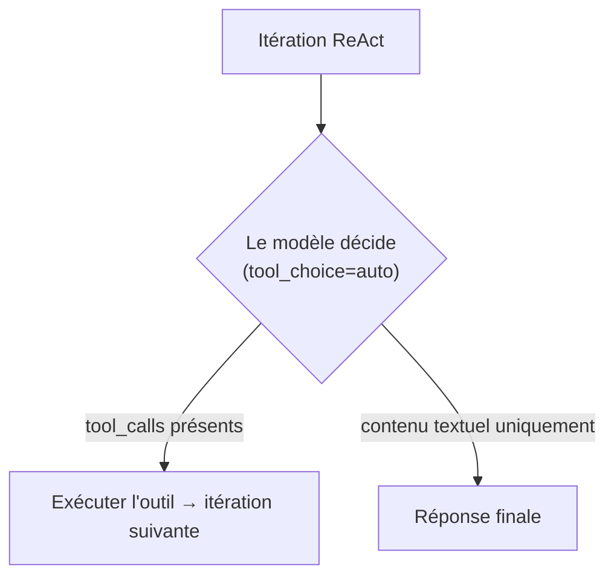
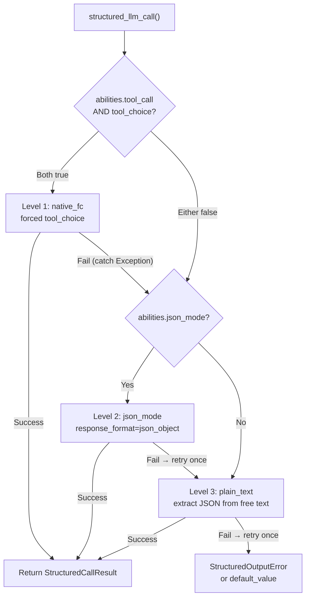

## Détection du fournisseur

FIM One utilise LiteLLM comme adaptateur universel. La fonction `_resolve_litellm_model()` dans `core/model/openai_compatible.py` mappe l'`LLM_BASE_URL` + `LLM_MODEL` de l'utilisateur à un identifiant de modèle LiteLLM avec un préfixe de fournisseur. Le préfixe détermine comment LiteLLM achemine la requête — protocole API natif (Anthropic Messages API, Gemini, etc.) ou générique OpenAI-compatible `/v1/chat/completions`.

Ordre de résolution :

1. **Fournisseur explicite** (champ DB `ModelConfig.provider`) — priorité la plus élevée. Si le fournisseur correspond à un domaine connu dans l'URL, aucun `api_base` n'est renvoyé (LiteLLM achemine nativement). Sinon, `api_base` est défini sur l'URL de relais.
2. **Correspondance de domaine** par rapport à `KNOWN_DOMAINS` — les points de terminaison API officiels sont reconnus par nom d'hôte.
3. **Indice de chemin d'URL** par rapport à `PATH_PROVIDER_HINTS` — courant sur les plateformes de relais comme UniAPI où `/claude` ou `/anthropic` dans le chemin indique le protocole en amont.
4. **Secours** — préfixe `openai/` (générique OpenAI-compatible).

| Domaine / Chemin | Préfixe du fournisseur | Protocole |
|---|---|---|
| `api.openai.com` | `openai/` | OpenAI Chat Completions |
| `anthropic.com` | `anthropic/` | Anthropic Messages API |
| `generativelanguage.googleapis.com` | `gemini/` | Google Gemini |
| `api.deepseek.com` | `deepseek/` | DeepSeek (OpenAI-compatible) |
| `api.mistral.ai` | `mistral/` | Mistral |
| Le chemin contient `/claude` ou `/anthropic` | `anthropic/` | Anthropic Messages API (via relais) |
| Le chemin contient `/gemini` | `gemini/` | Google Gemini (via relais) |
| Tout le reste | `openai/` | Générique OpenAI-compatible |

Lorsque le préfixe du fournisseur est un protocole natif (anthropic, gemini, etc.) et que l'URL n'est pas le point de terminaison officiel, LiteLLM utilise le protocole natif mais envoie les requêtes à l'`api_base` du relais. Cela signifie que les comportements spécifiques au fournisseur — y compris le problème de prefill Bedrock décrit ci-dessous — s'appliquent indépendamment du fait que la requête aille à l'API officielle ou via un relais.

<Warning>
Si votre URL de relais contient `/claude` dans le chemin, FIM One achemine automatiquement via le protocole natif d'Anthropic. C'est généralement correct (meilleur streaming, support de la réflexion), mais cela signifie que les comportements spécifiques au fournisseur s'appliquent — y compris le problème de prefill Bedrock décrit ci-dessous.
</Warning>

## tool_choice — les quatre modes

Le paramètre `tool_choice` est standardisé via le format OpenAI. LiteLLM le traduit vers le protocole natif de chaque fournisseur avant d'envoyer la requête.

| Mode | Signification | Support des fournisseurs |
|---|---|---|
| `"auto"` | Le modèle décide s'il faut appeler un outil ou répondre avec du texte | Tous les fournisseurs |
| `"required"` | Doit appeler un outil, mais le modèle choisit lequel | La plupart des fournisseurs |
| `{"type":"function","function":{"name":"X"}}` | Doit appeler la fonction X spécifiquement | La plupart des fournisseurs — **incompatible avec la réflexion Anthropic** |
| `"none"` | Impossible d'utiliser les outils, texte uniquement | Tous les fournisseurs |

La distinction entre `"auto"` et forcé (`{"type":"function",...}`) est au cœur de chaque problème de compatibilité dans FIM One. Ces deux modes sont utilisés par des sous-systèmes complètement différents avec des exigences différentes.

## Où tool_choice est utilisé

Deux sous-systèmes utilisent `tool_choice`, et ils l'utilisent de manières fondamentalement différentes.

### Moteur ReAct — tool_choice="auto"

La boucle ReAct nécessite que le modèle décide à chaque itération : appeler un outil ou donner une réponse finale. Seul `"auto"` a du sens ici — le modèle choisit librement entre produire des `tool_calls` ou du contenu textuel. Ceci est compatible avec tous les fournisseurs, tous les modèles et tous les modes, y compris la réflexion étendue.



Le moteur ReAct utilise l'appel de fonction natif (`_run_native`) quand `abilities["tool_call"] = True`, en se repliant sur le mode JSON-dans-le-contenu (`_run_json`) sinon. Les deux modes utilisent `"auto"` — la différence est que les outils sont passés via le paramètre `tools` ou décrits dans l'invite système. Voir [Moteur ReAct — Exécution en mode dual](/architecture/react-engine#dual-mode-execution) pour plus de détails.

### structured_llm_call — tool_choice=forced

Extraction structurée en une seule tentative (annotation de schéma, planification DAG, analyse de plan). Force le modèle à appeler une fonction virtuelle spécifique, garantissant une sortie JSON structurée. C'est le site d'appel qui déclenche les erreurs spécifiques au fournisseur.

`structured_llm_call` implémente une chaîne de dégradation à 3 niveaux :



La différence de conception critique : le fallback de `structured_llm_call` est **runtime** — il essaie dynamiquement chaque niveau et capture les exceptions pour passer au suivant. La sélection de mode du moteur ReAct est **build-time** — elle vérifie `_native_mode_active` une seule fois au démarrage et s'engage dans un mode pour l'ensemble de la boucle. Cela signifie que `structured_llm_call` peut récupérer de manière transparente des erreurs 400 spécifiques au fournisseur, tandis que ReAct s'appuie sur le fait que le mode soit correctement choisi dès le départ.

## Le piège du préfill Bedrock

Quand `response_format={"type":"json_object"}` est passé pour un modèle résolu avec le préfixe `anthropic/`, LiteLLM injecte en interne un message de préfill assistant pour simuler le mode JSON. L'API Messages d'Anthropic n'a pas de paramètre `response_format` natif, donc LiteLLM l'approxime en ajoutant une accolade ouvrante comme contenu assistant :

```json
{"role": "assistant", "content": "{"}
```

Cela fonctionne sur l'API directe d'Anthropic. Cependant, les versions plus récentes des modèles AWS Bedrock rejettent toute conversation dont le dernier message a `role: "assistant"` — ils appellent cela « assistant message prefill » et lèvent :

```
ValidationException: This model does not support assistant message prefill.
The conversation must end with a user message.
```

Cette erreur se produit uniquement quand **les trois conditions** sont remplies simultanément :

1. Le modèle est résolu avec le préfixe `anthropic/` (via correspondance de domaine ou indice de chemin URL).
2. `response_format={"type":"json_object"}` est passé (le chemin de code json_mode dans `structured_llm_call`).
3. Le backend réel est AWS Bedrock (qui rejette le préfill).

<Warning>
Cela n'affecte PAS l'appel d'outils natif (`tool_choice="auto"` avec le paramètre `tools=`). L'injection de préfill se produit uniquement pour `response_format`. L'exécution de l'agent ReAct n'est complètement pas affectée.
</Warning>

Si à la fois le Niveau 1 (native_fc) et le Niveau 2 (json_mode) échouent sur Bedrock, le système se rétablit au Niveau 3 (plain_text). Le drapeau `json_mode_enabled` décrit ci-dessous élimine l'appel Niveau 2 gaspillé.

### Le correctif : json_mode_enabled

Un indicateur `json_mode_enabled` par modèle contrôle si le Niveau 2 (json_mode) est jamais tenté :

- **Modèles configurés via BD** : basculer dans Admin → Models → Advanced settings. L'indicateur est stocké sur `ModelProviderModel.json_mode_enabled` (par défaut `TRUE`).
- **Modèles configurés via ENV** : définir `LLM_JSON_MODE_ENABLED=false` dans votre environnement.
- **Effet** : lorsque désactivé, `abilities["json_mode"]` retourne `False` → `response_format` n'est jamais passé → pas de prefill → Bedrock fonctionne. La chaîne de dégradation devient `native_fc → plain_text`, en ignorant entièrement l'appel json_mode voué à l'échec.
- **Aucune perte de qualité** : le modèle retourne toujours du JSON valide car le system prompt l'impose. Le niveau plain_text utilise `extract_json()` pour analyser le JSON à partir de contenu libre, ce qui fonctionne de manière fiable avec les modèles modernes.

## Modèles de réflexion + forced tool_choice

Certains modèles ont la réflexion étendue (chaîne de pensée) activée de manière permanente. Leurs API rejettent le `tool_choice` forcé car forcer un appel de fonction spécifique contredit la liberté du modèle de raisonner d'abord :

```
tool_choice 'specified' is incompatible with thinking enabled
```

Anthropic applique cette contrainte au niveau du protocole, et certains autres fournisseurs (par exemple Moonshot AI / Kimi K2.5) suivent le même modèle.

Pour les modèles Anthropic, `structured_llm_call` gère cela automatiquement en passant `reasoning_effort=None` lors de l'appel de native_fc, désactivant la réflexion étendue pour cet appel spécifique. Les appels de sortie structurée ont besoin de **conformité au schéma**, pas de réflexion profonde — désactiver la réflexion ici est à la fois correct et bénéfique (latence plus faible, coût plus faible).

Cependant, certains modèles (par exemple Kimi K2.5) ont la réflexion activée de manière permanente sans aucun moyen de la désactiver de l'extérieur. Pour ces modèles, native_fc échoue toujours avec une erreur 400, ajoutant environ 10 secondes de latence gaspillée par appel structuré avant que la chaîne de dégradation ne passe à json_mode.

### Le correctif : tool_choice_enabled

Un drapeau `tool_choice_enabled` par modèle contrôle si le Niveau 1 (native_fc) est jamais tenté :

- **Modèles configurés en BD** : basculer dans Admin → Models → Advanced → "Native Function Calling". Le drapeau est stocké sur `ModelProviderModel.tool_choice_enabled` (par défaut `TRUE`).
- **Modèles configurés par ENV** : définissez `LLM_TOOL_CHOICE_ENABLED=false` dans votre environnement.
- **Effet** : lorsque désactivé, `abilities["tool_choice"]` retourne `False` → la chaîne de dégradation commence au Niveau 2 (json_mode) ou Niveau 3 (plain_text), en ignorant complètement native_fc. Cela élimine la pénalité d'~10s par appel structuré pour les modèles incompatibles.
- **Agent ReAct non affecté** : `tool_choice_enabled` contrôle uniquement la sélection d'outil forcée dans `structured_llm_call`. Le moteur ReAct utilise `tool_choice="auto"` (le modèle décide librement), qui fonctionne avec tous les modèles indépendamment de ce paramètre.

<Note>
`tool_choice_enabled` et `tool_call` sont des drapeaux de capacité distincts. `tool_call` (toujours `True` pour `OpenAICompatibleLLM`) contrôle si les outils sont transmis au modèle du tout — le désactiver casserait l'agent ReAct. `tool_choice` contrôle uniquement si la sélection d'outil **forcée** est tentée pour l'extraction de sortie structurée.
</Note>

`tool_choice="auto"` n'est pas affecté par le mode de réflexion. Le moteur ReAct utilise `"auto"` exclusivement, donc l'exécution de l'agent fonctionne avec la réflexion activée.

<Warning>
Ne définissez PAS `abilities["tool_call"] = False` pour éviter cette contrainte. Cela désactiverait le mode `_run_native` de ReAct (qui utilise `tool_choice="auto"` et fonctionne bien avec la réflexion), le forçant dans le mode `_run_json` moins fiable.
</Warning>

<Note>
**Note de migration de fournisseur :** Certains relais tiers suppriment silencieusement les paramètres non supportés comme `reasoning_effort` (`drop_params=True`), donc la réflexion n'est jamais activée même si configurée. Lors de la migration vers un fournisseur qui supporte correctement la réflexion (Bedrock, API Anthropic directe), le `reasoning_effort=None` dans native_fc assure un comportement cohérent. Aucune action utilisateur n'est nécessaire — la sortie structurée fonctionne de manière identique sur tous les fournisseurs.
</Note>

## Référence rapide : ce qui fonctionne où

| Scénario | Mode ReAct | Chemin structured_llm_call | Notes |
|---|---|---|---|
| OpenAI (n'importe quel modèle) | `_run_native` | native_fc | Support complet |
| Anthropic (sans thinking) | `_run_native` | native_fc | Support complet |
| Anthropic + thinking | `_run_native` | native_fc (thinking auto-désactivé) | Thinking désactivé pour la sortie structurée uniquement |
| Relais Bedrock (sans thinking) | `_run_native` | native_fc | Support complet |
| Relais Bedrock + thinking | `_run_native` | native_fc (thinking auto-désactivé) | Thinking désactivé pour la sortie structurée uniquement |
| Gemini | `_run_native` | native_fc | Support complet |
| DeepSeek (non-thinking) | `_run_native` | native_fc | Support complet |
| DeepSeek R1 (thinking) | `_run_native` | json_mode (définir `tool_choice_enabled=false`) | Thinking toujours activé ; ignorer native_fc |
| Kimi K2 (non-thinking) | `_run_native` | native_fc | Support complet |
| Kimi K2.5 (thinking) | `_run_native` | json_mode (définir `tool_choice_enabled=false`) | Thinking toujours activé ; ignorer native_fc |
| OpenAI-compatible générique | `_run_native` | native_fc | Support complet |
| N'importe quel modèle avec `tool_call=false` | `_run_json` | json_mode ou plain_text | Secours pour les modèles sans support d'appel d'outil |

## Configuration recommandée par modèle

`tool_choice_enabled` et `json_mode_enabled` peuvent tous deux être activés/désactivés par modèle dans Admin → Models → Advanced settings. Les valeurs par défaut (tous deux `TRUE`) fonctionnent pour la plupart des fournisseurs. Ajustez uniquement si vous rencontrez des erreurs ou une latence inutile.

| Type de modèle | FC natif | Mode JSON | Raison |
|---|---|---|---|
| Série OpenAI GPT | ON | ON | Support complet — les valeurs par défaut sont correctes |
| Anthropic Claude | ON | ON | Thinking auto-désactivé pour native_fc |
| Google Gemini | ON | ON | Support complet |
| DeepSeek V3 / Coder | ON | ON | Support complet |
| **DeepSeek R1 (thinking)** | **OFF** | ON | Thinking toujours activé ; native_fc rejeté |
| **Kimi K2.5 (thinking)** | **OFF** | ON | Thinking toujours activé ; native_fc rejeté |
| Kimi K2 (non-thinking) | ON | ON | Support complet |
| **Relais AWS Bedrock** | ON | **OFF** | Bedrock rejette le prefill assistant en json_mode |
| Modèles faibles / petits | OFF | OFF | Aller directement à l'extraction plain_text |

<Tip>
**Quand changer :** si vous voyez des avertissements `structured_llm_call: native_fc call raised` dans vos logs suivis d'une extraction json_mode réussie, le modèle ne bénéficie pas de native_fc. Désactivez « Native Function Calling » pour ce modèle afin d'éliminer l'appel API gaspillé (~10s par demande de sortie structurée).
</Tip>

**Les remplacements au niveau ENV** s'appliquent à tous les modèles configurés via des variables d'environnement (pas l'interface admin) :

```bash
# Disable native_fc globally (for thinking-model-only deployments)
LLM_TOOL_CHOICE_ENABLED=false

# Disable json_mode globally (for Bedrock relay deployments)
LLM_JSON_MODE_ENABLED=false
```

## Effort de raisonnement et configuration de la réflexion

FIM One expose deux variables d'environnement pour contrôler la réflexion étendue / le raisonnement :

| Variable | Valeurs | Effet |
|---|---|---|
| `LLM_REASONING_EFFORT` | `low`, `medium`, `high` | Passé en tant que `reasoning_effort` à LiteLLM. Anthropic : mappé au paramètre `thinking`. OpenAI o-series : passé directement. Autres : silencieusement supprimé (`drop_params=True`). |
| `LLM_REASONING_BUDGET_TOKENS` | entier (ex. `10000`) | Anthropic uniquement : définit un plafond explicite `thinking.budget_tokens`, contournant le mappage automatique de LiteLLM. Utile pour contrôler les coûts sur les modèles Claude. |

Lorsque `reasoning_effort` est défini et que le modèle est résolu en tant que `anthropic/`, deux comportements supplémentaires s'appliquent :

1. **La température est forcée à 1.0.** Bedrock rejette `temperature != 1.0` lorsque la réflexion est activée. FIM One gère cela automatiquement — aucune action utilisateur nécessaire.
2. **GPT-5.x avec outils** : `reasoning_effort` est silencieusement supprimé lorsque des `tools` sont présents, car le point de terminaison GPT-5 `/v1/chat/completions` rejette la combinaison. Cela n'affecte que la boucle d'outil ReAct ; les appels `structured_llm_call` qui manquent d'un paramètre `tools` ne sont pas affectés.

## Analyse défensive pour la sortie structurée

Même avec native_fc fonctionnant correctement, le pipeline de sortie structurée inclut une couche d'analyse défensive pour gérer les cas limites de n'importe quel fournisseur ou couche de compatibilité.

L'analyseur `_dict_to_steps` du planificateur DAG gère trois cas limites courants :

1. **Objet unique au lieu de tableau.** Certains modèles retournent `{"steps": {"id": "1", "task": "..."}}` (un objet d'étape unique) au lieu de `{"steps": [{"id": "1", "task": "..."}]}` (un tableau). L'analyseur détecte cela en vérifiant la présence de clés `id` ou `task` et enveloppe l'objet dans une liste.

2. **Chaîne JSON double-encodée.** Lorsque la sortie structurée revient à json_mode (qui manque d'application de schéma), certains fournisseurs retournent la valeur `steps` comme chaîne JSON plutôt que comme tableau natif — par exemple, `{"steps": "[{\"id\": \"1\", ...}]"}`. Cette chaîne peut également contenir des sauts de ligne littéraux (du formatage du modèle) qui cassent le `json.loads` standard. L'analyseur utilise `extract_json_value()` (qui inclut `_repair_json_strings`) pour gérer :
   - Les sauts de ligne littéraux à l'intérieur des valeurs de chaîne JSON
   - Les séquences d'échappement invalides (courantes avec le contenu LaTeX ou de code)
   - Autres particularités de sérialisation des couches de compatibilité

3. **Enveloppe `steps` manquante.** Le modèle peut retourner une seule étape comme objet de niveau supérieur sans la clé d'enveloppe `steps`. L'analyseur détecte `id` et `task` au niveau racine et enveloppe en conséquence.

<Note>
En fonctionnement normal, native_fc retourne des arguments d'appel d'outil correctement structurés et ces cas limites ne se produisent pas. Les analyseurs défensifs existent comme filet de sécurité pour les sous-classes `BaseLLM` personnalisées, les comportements inhabituels des fournisseurs, ou les scénarios de secours où la sortie structurée se dégrade en json_mode ou plain_text.
</Note>

## Dépannage

**« Ce modèle ne supporte pas le préfixage des messages d'assistant »**
Bedrock + json_mode. Définissez `LLM_JSON_MODE_ENABLED=false` ou désactivez JSON Mode dans les paramètres du modèle de l'administrateur.

**« La réflexion ne peut pas être activée quand tool_choice force l'utilisation d'outils »** / **« tool_choice 'specified' est incompatible avec la réflexion activée »**
Pour les modèles Anthropic, `structured_llm_call` désactive automatiquement la réflexion pour les appels native_fc. Pour les autres fournisseurs avec réflexion toujours activée (par exemple Kimi K2.5), désactivez « Native Function Calling » dans les paramètres Avancés du modèle, ou définissez `LLM_TOOL_CHOICE_ENABLED=false` globalement. La chaîne de dégradation ignorera native_fc et extraira la sortie structurée via json_mode ou plain_text à la place.

**« DAG pipeline failed: LLM 'steps' is not an array »**
Le LLM a retourné le champ `steps` sous forme de chaîne ou d'objet unique au lieu d'un tableau. Cela signifie généralement que la sortie structurée est tombée en json_mode (qui manque d'application de schéma). Vérifiez le journal pour `structured_llm_call: level=xxx` — s'il affiche `json_mode` au lieu de `native_fc`, native_fc échoue silencieusement. Si vous utilisez une sous-classe `BaseLLM` personnalisée, vérifiez qu'elle accepte l'argument `reasoning_effort`.

**ReAct bascule vers JSON mode de manière inattendue**
Vérifiez que `abilities["tool_call"]` du modèle est `True`. C'est toujours `True` pour `OpenAICompatibleLLM`, mais une sous-classe `BaseLLM` personnalisée pourrait le remplacer. Vérifiez avec le point de terminaison de détail du modèle dans l'API d'administration.

**structured_llm_call épuise tous les niveaux et lève StructuredOutputError**
Le modèle n'a pas pu produire de JSON analysable à aucun niveau. C'est rare avec les modèles modernes. Vérifiez : (1) le schéma est un JSON Schema valide, (2) le modèle a suffisamment de `max_tokens` pour produire la réponse complète, (3) l'invite système ne contredit pas les instructions du schéma. Le planificateur DAG et l'analyseur fournissent tous deux des solutions de secours `default_value`, donc cette erreur ne se propage que depuis les sites d'appel qui omettent explicitement les valeurs par défaut.
