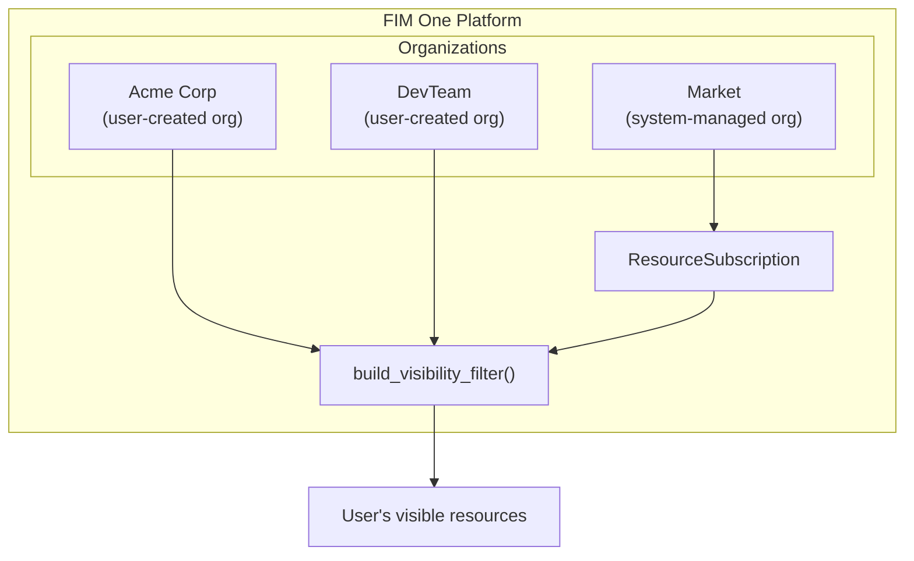
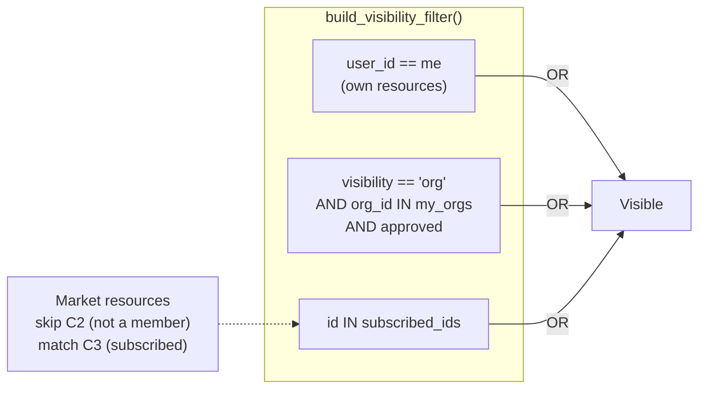
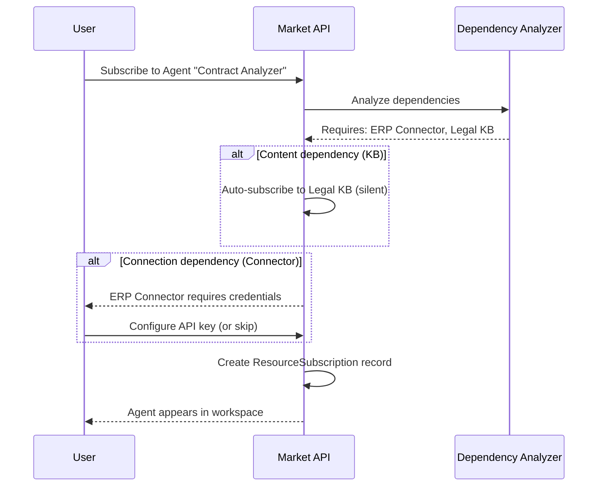
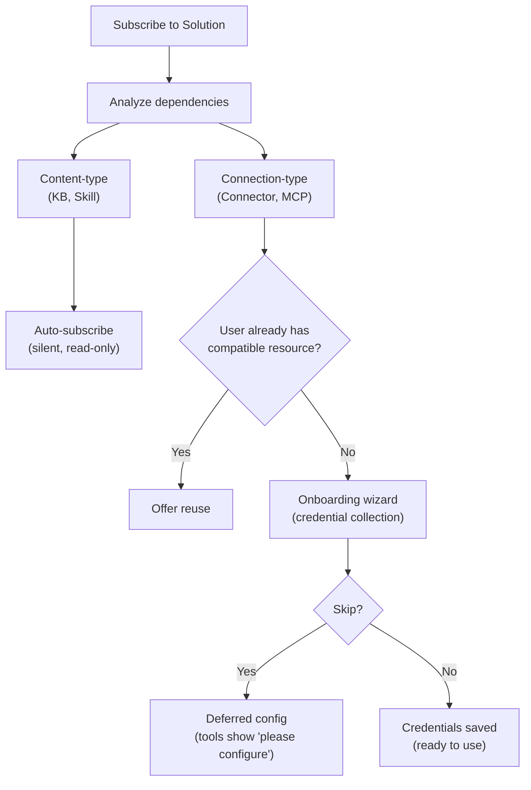

## Aperçu

Le Marché est la place de marché des ressources de FIM One. Les utilisateurs publient les ressources qu'ils ont créées, d'autres les découvrent et s'y abonnent, et les ressources auxquelles on est abonné apparaissent dans l'espace de travail de l'abonné comme s'il s'agissait des leurs. L'ensemble du système repose sur une seule idée architecturale : **le Marché est une organisation** — une organisation fantôme gérée par le système avec des règles de confiance spéciales.

Cette page explique l'architecture interne du Marché. Pour un aperçu orienté utilisateur de la publication et de l'abonnement, consultez [Marché (Fonctionnalités)](/concepts/market). Pour savoir comment les ressources auxquelles on est abonné sont chargées dans les ensembles d'outils, consultez [Découverte d'agent et de ressource](/architecture/agent-discovery).

## Classification à deux niveaux

Le Marché organise les ressources en deux catégories en fonction de ce que la ressource fait, et non de la façon dont elle est implémentée.

### Solutions

Les Solutions sont des choses qui **fonctionnent pour vous**. Un utilisateur s'abonne à une Solution et obtient une capacité prête à l'emploi.

| Type de ressource | Ce qu'il fait |
|---|---|
| **Agent** | Un assistant IA conversationnel avec des outils liés, des connaissances et des instructions |
| **Compétence** | Une POS globale (Procédure Standard d'Exploitation) qui peut orchestrer plusieurs agents via `call_agent` |
| **Workflow** | Un flux d'automatisation basé sur DAG avec édition visuelle et exécution déterministe |

Les Solutions peuvent dépendre d'autres ressources. Un Agent peut nécessiter un Connecteur spécifique pour ses appels API et une Base de connaissances pour son pipeline de récupération. Le Market gère automatiquement ces dépendances lors de l'abonnement (voir [Résolution des dépendances](#dependency-resolution) ci-dessous).

### Composants

Les composants sont des **blocs de construction réutilisables** pour les développeurs. Ils fournissent des capacités que les Solutions consomment.

| Type de ressource | Ce qu'il fait |
|---|---|
| **Connecteur** | Une définition d'adaptateur d'intégration API ou base de données |
| **Serveur MCP** | Une configuration de service d'outils utilisant le Model Context Protocol |

Les composants sont plus simples à s'abonner — ils n'ont pas de dépendances internes, seulement des exigences d'identifiants.

### Pourquoi les bases de connaissances ne sont pas listées indépendamment

Les bases de connaissances ne sont pas publiées en tant que ressources Market autonomes. Ce sont des dépendances internes des Solutions — le pipeline de récupération d'un agent ou le matériel de référence d'une compétence. Lorsqu'un utilisateur s'abonne à une Solution qui dépend d'une base de connaissances, la KB est automatiquement incluse en tant que référence en lecture seule. L'abonné n'a jamais besoin de trouver, d'évaluer ou de gérer les KB séparément.

<Info>
La classification à deux niveaux (Solutions vs. Composants) est un **concept de couche d'affichage**. Elle est dérivée de `resource_type` au moment de la requête, et non stockée en tant que champ distinct. Le mécanisme d'abonnement sous-jacent, le filtre de visibilité et le processus d'examen sont identiques pour tous les types de ressources.
</Info>

## Architecture unifiée

### Le Marché en tant qu'organisation fantôme

La décision architecturale la plus importante du Marché est qu'il n'est pas un sous-système séparé. C'est une **organisation** — une org gérée par le système avec un ID fixe (`MARKET_ORG_ID`), créée automatiquement lors de l'initialisation de la plateforme.

Cela signifie :

- **Le même filtre de visibilité** (`build_visibility_filter()`) gère les ressources personnelles, org et Marché dans une seule requête. Aucun code de cas particulier pour les recherches du Marché.
- **Le même mécanisme d'abonnement** (`ResourceSubscription`) s'applique aux ressources org et Marché. S'abonner à une ressource org et s'abonner à une ressource du Marché créent le même enregistrement.
- **La même gestion des identifiants** (fallback, remplacement par utilisateur) fonctionne dans les deux contextes. Le drapeau `allow_fallback` sur les Connecteurs et les Serveurs MCP se comporte de manière identique quelle que soit la source.
- **Le même processus d'examen** (`apply_publish_status()`) gère à la fois l'examen au niveau org et au niveau Marché. La seule différence est que l'org du Marché a tous les drapeaux d'examen verrouillés à `true`.

La distinction clé entre une organisation régulière et l'organisation du Marché :

| Aspect | Organisation | Marché |
|---|---|---|
| **Modèle de confiance** | Confiance élevée (appartenance à l'équipe) | Aucune confiance supposée (communauté mondiale) |
| **Examen** | Optionnel par type de ressource | Toujours obligatoire pour tous les types |
| **Accès** | Automatique pour tous les membres | Nécessite un abonnement explicite |
| **Portée** | Équipe ou entreprise | Mondiale |

<Tip>
Parce que le Marché est simplement une organisation avec des règles spéciales, toute fonctionnalité construite pour les organisations — flux de travail d'examen, gestion des identifiants, cycle de vie des ressources — fonctionne automatiquement pour le Marché sans implémentation supplémentaire.
</Tip>

### Comment le filtre de visibilité le gère

Personne n'est membre de l'organisation Market. Les utilisateurs ne « rejoignent » pas Market — ils s'abonnent à des ressources individuelles. Cela signifie que `MARKET_ORG_ID` n'est jamais présent dans la liste `user_org_ids` d'un utilisateur, et la condition de visibilité d'appartenance à l'organisation est naturellement ignorée pour les ressources Market.

À la place, les ressources Market auxquelles on s'est abonné passent par le chemin `subscribed_ids` dans `build_visibility_filter()` :

Cette clause OR à trois conditions constitue l'ensemble du modèle de visibilité. Les ressources personnelles, les ressources partagées au niveau de l'organisation et les ressources Market auxquelles on s'est abonné sont résolues dans une seule requête, sans logique de branchement pour différentes origines de ressources.

### Navigation basée sur la portée

La page Market fournit un **sélecteur de portée** qui bascule entre deux contextes de navigation :

| Portée | Ce qu'elle affiche | Qui examine |
|---|---|---|
| **Global Market** | Ressources publiées par n'importe qui vers l'org Market | Administrateurs de plateforme |
| **Organization: [name]** | Ressources publiées par les membres d'une org spécifique | Administrateurs d'org |

La même interface utilisateur, les mêmes onglets (Solutions / Composants) et le même flux d'abonnement s'appliquent dans les deux portées. Le changement de portée modifie uniquement le filtre `org_id` dans la requête de navigation. Du point de vue de l'utilisateur, l'expérience est identique — il parcourt un catalogue et choisit ce qu'il souhaite installer.

## Flux d'abonnement

### Parcourir et découvrir

Les utilisateurs parcourent le Marché via un catalogue paginé. Chaque ressource affiche son nom, sa description, son icône, le nom d'utilisateur de l'éditeur et un bouton d'abonnement. Les ressources auxquelles l'utilisateur s'est déjà abonné sont marquées en conséquence. L'API de parcours (`GET /api/market`) exclut les ressources de l'utilisateur — vous ne pouvez pas vous abonner à quelque chose que vous avez publié.

### S'abonner à une Solution

S'abonner à une Solution (Agent, Compétence ou Flux de travail) implique une analyse des dépendances :

1. Le système analyse les dépendances de la Solution — quels Connecteurs, Bases de connaissances, Serveurs MCP et Compétences elle nécessite.
2. **Les dépendances de type contenu** (Base de connaissances, Compétence) sont auto-abonnées silencieusement. L'utilisateur ne les voit pas ou ne les gère pas.
3. **Les dépendances de type connexion** (Connecteur, Serveur MCP) sont listées comme exigences. Un assistant d'intégration collecte les identifiants.
4. L'enregistrement `ResourceSubscription` est créé, et la ressource apparaît dans le filtre de visibilité de l'utilisateur.

### S'abonner à un composant

Les composants (connecteurs et serveurs MCP) ont un flux plus simple — aucune analyse de dépendance n'est nécessaire. L'utilisateur s'abonne, configure optionnellement les identifiants, et le composant est prêt à être utilisé.

### Configuration des identifiants

Les identifiants suivent un **modèle hybride** qui équilibre la commodité avec la flexibilité :

- **Proposés lors de l'abonnement.** Lorsqu'une dépendance de type connexion nécessite des identifiants, l'assistant d'intégration présente le formulaire d'identifiants immédiatement.
- **Ignorables.** L'utilisateur peut choisir « Ignorer, configurer plus tard ». La ressource est abonnée mais les outils nécessitant ces identifiants retournent un message « veuillez configurer vos identifiants » lors de l'invocation.
- **Configuration différée.** Les utilisateurs peuvent configurer ou mettre à jour les identifiants à tout moment à partir de leur page de paramètres.

C'est le même mécanisme `allow_fallback` utilisé dans les organisations. Si l'éditeur a activé le secours et défini un identifiant par défaut, les abonnés peuvent utiliser la ressource immédiatement sans fournir leur propre clé. Si le secours est désactivé, chaque abonné doit apporter le sien.

<Warning>
Lors de l'utilisation d'une ressource Market avec le secours des identifiants activé, vos requêtes API transitent par les identifiants de l'éditeur. Pour les opérations sensibles, envisagez de fournir vos propres identifiants ou de vérifier la fiabilité de l'éditeur.
</Warning>

### Se désabonner

Se désabonner supprime l'enregistrement `ResourceSubscription`. La ressource disparaît du filtre de visibilité de l'utilisateur et n'est plus chargée dans les ensembles d'outils. Pour les Solutions avec des dépendances auto-abonnées, les ressources dépendantes (KBs, Skills) sont également nettoyées. Les identifiants configurés par l'utilisateur pour la ressource sont supprimés.

## Résolution des dépendances

Lorsqu'une Solution est publiée ou souscrite, le système analyse son arborescence de dépendances. Les dépendances se divisent en deux catégories avec des stratégies de traitement différentes.

### Dépendances de type de contenu

Les **Bases de connaissances** et les **Compétences** référencées par une Solution sont des dépendances de type de contenu. Elles fournissent des données en lecture seule — documents de récupération, procédures opérationnelles — que la Solution consomme.

- **À l'abonnement :** abonnement automatique silencieux. L'utilisateur ne voit pas d'étape d'abonnement séparée pour chaque Base de connaissances ou Compétence.
- **Modèle d'accès :** référence en lecture seule à la ressource de l'auteur original. L'abonné ne peut pas modifier le contenu.
- **À la désinscription :** nettoyage automatique lors de la désinscription de la Solution parent.

### Dépendances de type connexion

Les **connecteurs** et les **serveurs MCP** référencés par une Solution sont des dépendances de type connexion. Ils nécessitent des identifiants pour fonctionner.

- **À l'abonnement :** listés comme exigences dans l'assistant d'intégration. L'utilisateur est invité à configurer les identifiants (ou à ignorer).
- **Correspondance intelligente :** si l'utilisateur dispose déjà d'un connecteur compatible (même type, même URL de base), le système propose de le réutiliser au lieu de créer un nouvel abonnement.
- **À la désinscription :** l'abonnement est supprimé, mais les identifiants créés par l'utilisateur sont conservés (l'utilisateur peut utiliser le même connecteur ailleurs).

## Publication

### Publication d'une Solution

Lorsqu'un auteur publie un Agent, une Compétence ou un Flux de travail sur le Marché :

1. Le système définit `visibility: "org"` et `org_id: MARKET_ORG_ID` sur la ressource.
2. Le système analyse les dépendances de la Solution et crée un manifeste — listant les Connecteurs, les BCs et les Serveurs MCP requis.
3. Le manifeste est présenté à l'auteur pour confirmation.
4. `apply_publish_status()` définit la ressource sur `pending_review` (l'organisation du Marché a tous les indicateurs d'examen verrouillés sur `true`).
5. Un administrateur système examine et approuve ou rejette la ressource.

### Publication d'un composant

La publication d'un connecteur ou d'un serveur MCP est plus simple :

1. Le système définit la visibilité et org_id comme ci-dessus.
2. Le schéma des identifiants est extrait (les champs que les abonnés doivent remplir).
3. La ressource entre en `pending_review` et attend l'approbation de l'administrateur.

### Processus d'examen

Le processus d'examen est le même mécanisme utilisé par les organisations, avec une différence critique :

| Contexte | Examen requis ? | Qui examine |
|---|---|---|
| **Organisation** | Configurable par type de ressource (`review_agents`, `review_connectors`, etc.) | Administrateurs de l'organisation |
| **Marché** | Toujours requis pour tous les types de ressources | Administrateurs de la plateforme (propriétaire de l'organisation Marché) |

L'organisation Marché est initialisée avec les six indicateurs d'examen définis sur `true`, et cette configuration ne peut pas être modifiée. Chaque ressource publiée sur le Marché doit passer l'examen administrateur avant de devenir visible dans le catalogue de navigation.

<Note>
Les propriétaires d'organisation contournent automatiquement l'examen — leurs ressources publiées sont immédiatement disponibles. Pour le Marché, seul le propriétaire de l'organisation Marché (l'administrateur système) dispose de ce privilège de contournement.
</Note>

Lorsqu'une ressource approuvée est modifiée par son auteur, `check_edit_revert()` rétablit automatiquement le `publish_status` à `pending_review`. Cela garantit que les modifications apportées aux ressources du Marché en direct sont réexaminées avant de devenir visibles pour les abonnés.

## Notes d'implémentation

### L'organisation fantôme

L'organisation Market possède un ID fixe bien connu (`00000000-0000-0000-0000-000000000001`) et un slug (`market`). Elle est créée par `ensure_market_org()` lors de l'initialisation de la plateforme — généralement lors de la première connexion de l'utilisateur administrateur. La fonction est idempotente ; l'appeler plusieurs fois est sans danger.

### ResourceSubscription

La table `ResourceSubscription` est la structure de données centrale pour l'accès au Marché :

| Colonne | Objectif |
|---|---|
| `user_id` | L'abonné |
| `resource_type` | `agent`, `connecteur`, `base de connaissances`, `mcp_server`, `compétence` ou `workflow` |
| `resource_id` | L'ID de la ressource abonnée |
| `org_id` | L'org source (ID org du Marché ou un ID org régulier) |

Une contrainte d'unicité sur `(user_id, resource_type, resource_id)` prévient les abonnements en doublon. La colonne `org_id` suit l'origine de l'abonnement, permettant une désinscription consciente du contexte.

### Intégration du filtre de visibilité

La fonction `resolve_visibility()` effectue deux recherches en un seul appel :

1. Récupère les appartenances organisationnelles de l'utilisateur (`user_org_ids`)
2. Récupère les abonnements de l'utilisateur (`subscribed_ids`)

Ceux-ci sont transmis à `build_visibility_filter()`, qui produit une seule clause SQL WHERE combinant les trois niveaux de visibilité (personnel, partagé au niveau organisationnel, abonné). Cette fonction est utilisée partout où les ressources sont interrogées — listes d'agents, menus déroulants de connecteurs, injection de compétences, mode de découverte automatique — garantissant une visibilité cohérente sur l'ensemble de la plateforme.

### Chiffrement des identifiants

Les identifiants configurés lors de l'abonnement (ou ultérieurement dans les paramètres) sont chiffrés au repos à l'aide de la clé de chiffrement de la plateforme. L'API Market n'expose jamais les valeurs des identifiants dans les réponses de navigation — seules les métadonnées (nom, description, icône, type) sont renvoyées dans les fonctions d'assistance `_*_market_info()`.

## Voir aussi

- [Organisation & Marché](/architecture/organization) -- modèle de partage et de confiance au niveau de l'organisation
- [Découverte d'Agent & de Ressource](/architecture/agent-discovery) -- comment les ressources souscrites sont chargées dans les ensembles d'outils
- [Architecture du Connecteur](/architecture/connector-architecture) -- conception du connecteur, injection d'authentification et audit
- [Aperçu du Système](/architecture/system-overview) -- l'abstraction d'outil unifiée dans laquelle convergent toutes les ressources
