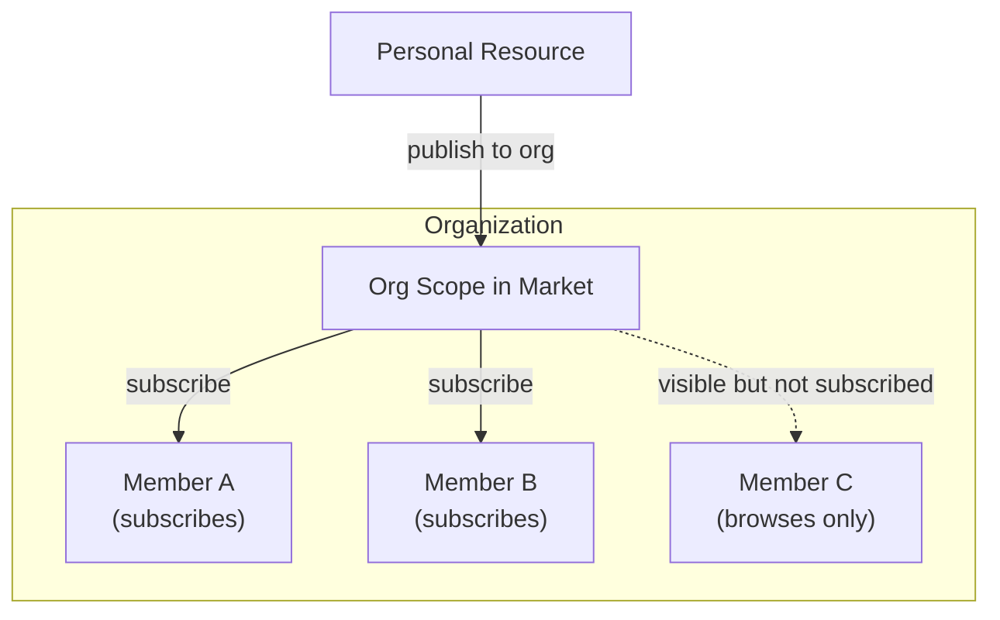
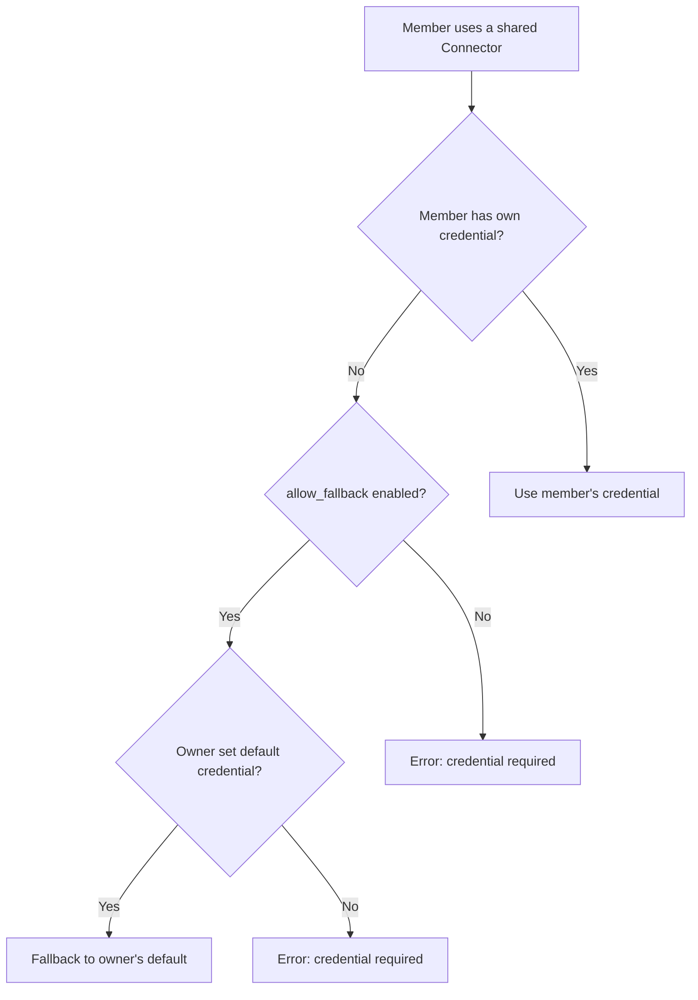

## Aperçu

Les organisations sont l'unité de collaboration d'équipe de FIM One. Elles permettent aux groupes d'utilisateurs de partager des ressources — Agents, Connecteurs, Bases de connaissances, Serveurs MCP, Workflows et Compétences — dans un périmètre de confiance.

Chaque ressource dans FIM One commence comme **personnelle** (visible uniquement pour son créateur). Lorsque vous publiez une ressource dans une organisation, elle devient **découvrable** par les autres membres de l'organisation via le périmètre d'organisation du Marché. Les membres parcourent les ressources partagées de l'organisation et s'abonnent à celles dont ils ont besoin.



Les organisations et le Marché mondial partagent le même modèle d'accès basé sur l'abonnement. La différence clé est la confiance : les organisations représentent une équipe ou une entreprise où les membres se connaissent et se font confiance, donc l'examen est facultatif et le partage des identifiants est simple.

## Création et gestion des organisations

Chaque utilisateur peut créer des organisations **illimitées** et rejoindre un nombre quelconque d'entre elles. Une organisation dispose de trois rôles :

| Rôle | Permissions |
|---|---|
| **Propriétaire** | Contrôle total — gérer les membres, configurer les paramètres, contourner l'examen |
| **Administrateur** | Gérer les membres et examiner les ressources publiées |
| **Membre** | Parcourir et s'abonner aux ressources partagées |

Le propriétaire est toujours l'utilisateur qui a créé l'organisation. La propriété peut être transférée mais non partagée.

## Publication de ressources

Lorsque vous publiez une ressource dans votre organisation, elle n'apparaît **pas** automatiquement dans l'espace de travail de chaque membre. Au lieu de cela, la ressource devient découvrable dans l'étendue organisation du Marché, où les membres peuvent la parcourir et s'y abonner.

Ce modèle basé sur l'abonnement donne à chaque membre le contrôle sur son espace de travail. Une grande organisation peut partager des dizaines de connecteurs, mais un membre individuel ne s'abonne qu'à ceux pertinents pour son travail.

```mermaid
sequenceDiagram
    participant U as Publisher
    participant P as Platform
    participant O as Org Settings
    participant M as Other Members

    U->>P: Publish Agent to Org
    P->>O: Check review_agents flag
    alt Review disabled
        P->>P: publish_status = NULL (auto-approved)
        P-->>U: Resource discoverable by org members
    else Review enabled
        P->>P: publish_status = "pending_review"
        P-->>U: Pending admin approval
        Note over P: Org admin approves or rejects
        P->>P: publish_status = "approved"
    end
    M->>P: Browse org resources in Market
    M->>P: Subscribe to Agent
    P-->>M: Agent appears in workspace
```



### Système d'examen

L'examen est **optionnel** et configuré par type de ressource. Chaque organisation dispose de drapeaux de basculement indépendants :

- `review_agents`
- `review_connectors`
- `review_kbs`
- `review_mcp_servers`
- `review_workflows`
- `review_skills`

Lorsque l'examen est désactivé pour un type de ressource, les ressources publiées sont immédiatement découvrables par les membres — aucune action d'administrateur n'est nécessaire. Lorsque l'examen est activé, les ressources entrent dans un état `pending_review` et nécessitent l'approbation d'un administrateur avant de devenir visibles.

<Tip>
Les propriétaires d'organisation contournent automatiquement l'examen. Leurs ressources publiées sont toujours immédiatement découvrables.
</Tip>

Cette flexibilité permet aux organisations d'adapter leurs besoins de gouvernance. Une petite startup pourrait désactiver tous les drapeaux d'examen pour un partage sans friction, tandis qu'une entreprise axée sur la conformité active l'examen sur les Agents et Connecteurs pour maintenir une supervision.

## Mécanisme de secours des identifiants

Les connecteurs et les serveurs MCP nécessitent souvent des identifiants (clés API, mots de passe de base de données, jetons OAuth). FIM One fournit un **mécanisme de secours** pour que les membres n'aient pas à configurer chaque identifiant eux-mêmes.



Il existe deux modes :

- **Mécanisme de secours activé** (`allow_fallback=true`, par défaut) : Les membres qui ne fournissent pas leurs propres identifiants utilisent automatiquement les identifiants par défaut du propriétaire. Cela fonctionne bien pour les clés API partagées par l'équipe ou les services internes où une seule clé couvre toute l'équipe.
- **Mécanisme de secours désactivé** (`allow_fallback=false`) : Chaque membre doit configurer ses propres identifiants. Ceci est approprié lorsque chaque utilisateur a besoin d'une clé API personnelle (par exemple, les licences SaaS par siège).

Les ressources qui ne nécessitent pas d'identifiants — comme un connecteur API public en lecture seule ou un Agent sans authentification — fonctionnent immédiatement après l'abonnement. Aucune configuration nécessaire.

<Info>
Le mécanisme de secours des identifiants s'applique uniquement après qu'un membre s'abonne à la ressource. Le mécanisme de secours détermine comment les identifiants sont résolus à l'exécution, non si la ressource est accessible.
</Info>

## Visibilité des ressources

Chaque ressource dans FIM One a une `visibility` qui détermine sa portée d'accès :

| Visibilité | Portée | Qui peut la découvrir |
|---|---|---|
| `personal` | Propriétaire uniquement | L'utilisateur qui l'a créée |
| `org` | Organisation | Les membres de l'organisation peuvent parcourir et s'abonner (si approuvé) |

Le filtre de visibilité suit un modèle de requête unifié :

```
A resource is available in your workspace if:
  1. You own it (any visibility), OR
  2. It's published to an org you belong to, approved, AND you've subscribed to it
```

<Warning>
Publier une ressource dans une organisation n'accorde pas d'accès automatique. Les membres doivent s'abonner via la portée org du Marché pour ajouter la ressource à leur espace de travail.
</Warning>

## Scénarios Pratiques

### Partage d'un connecteur de base de données en équipe

1. Alice crée un connecteur vers la base de données PostgreSQL de l'équipe
2. Alice le publie dans l'org de son équipe (l'examen est désactivé pour les connecteurs)
3. Le connecteur devient découvrable dans la portée org de la Market
4. Bob parcourt les ressources partagées de l'org, trouve le connecteur et s'y abonne
5. Le connecteur apparaît dans l'espace de travail de Bob, en utilisant les identifiants de base de données d'Alice comme solution de secours
6. Carol s'y abonne aussi. Dave (un entrepreneur externe) s'y abonne et configure ses propres identifiants en lecture seule à la place

### Organisation avec examen strict

1. Une entreprise axée sur la conformité active `review_agents=true` et `review_connectors=true` sur son organisation
2. Quand un employé publie un nouvel Agent, il entre dans l'état `pending_review`
3. Un administrateur de l'organisation examine la configuration de l'Agent et l'approuve
4. L'Agent devient découvrable — les autres membres peuvent maintenant le trouver et s'y abonner
5. Si l'éditeur modifie ultérieurement l'Agent approuvé, il revient automatiquement à `pending_review` pour une nouvelle approbation

### Abonnement sélectif dans une grande organisation

1. Une organisation publie 50+ connecteurs couvrant les API internes, les bases de données et les services tiers
2. L'équipe data s'abonne uniquement aux connecteurs de bases de données et aux API d'analyse
3. L'équipe marketing s'abonne uniquement aux connecteurs CRM et plateforme email
4. L'espace de travail de chaque membre de l'équipe reste concentré et organisé

## Voir aussi

- [Architecture du Marché](/concepts/market) — Pour le Marché global et sa relation avec les organisations. Les deux utilisent le même modèle d'abonnement, mais le Marché sert de canal de découverte inter-organisations avec révision obligatoire.
- [Découverte d'agents et de ressources](/architecture/agent-discovery) — Comment les ressources abonnées sont assemblées en ensembles d'outils lors du chat.
