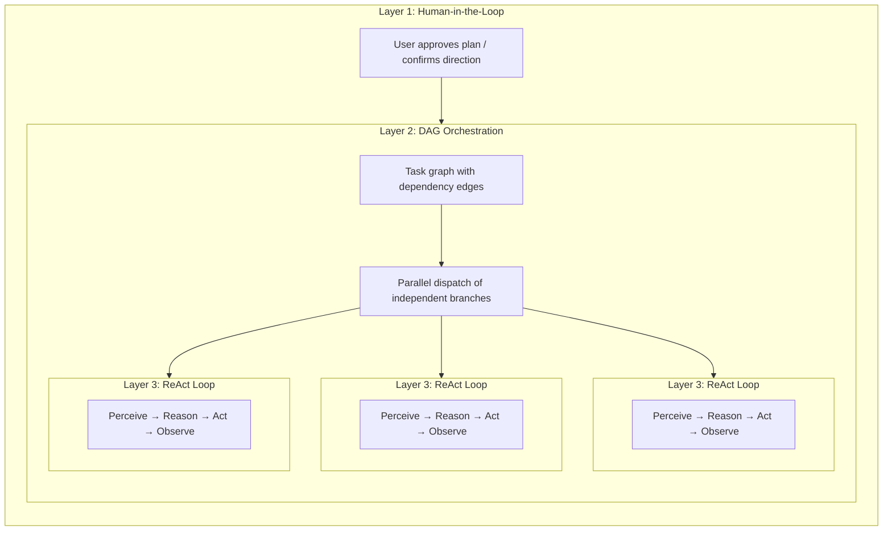

---
title: "Paysage de la planification"
description: "Cinq types de planification dans le paysage des outils d'IA et où FIM One s'inscrit."
---## Cinq types de « planification » dans le paysage des outils IA

Le mot « planification » est surchargé. Au moins cinq approches distinctes existent aujourd'hui, et elles résolvent des problèmes différents :

| Approche | Format du plan | Exécution | Approbation | Valeur principale |
|---|---|---|---|---|
| **Planification implicite du modèle** | Chaîne de pensée interne | Passage d'inférence unique | Aucune | Le modèle réfléchit aux étapes par lui-même |
| **Mode plan Claude Code** | Document Markdown | Série | Révision humaine avant exécution | S'aligner sur l'approche avant de toucher au code |
| **Claude Code Teams** | Liste de tâches avec arêtes de dépendance | **Concurrence** (multi-agent) | L'humain approuve le plan, puis autonome | Pool d'agents dynamique + exécution parallèle |
| **Développement piloté par spec Kiro** | Spec structuré (exigences + conception + tâches) | Série | Révision humaine de la spec | Exigences traçables, critères d'acceptation |
| **FIM One DAG** | Graphe de dépendance JSON | **Concurrence** (orchestrateur unique) | Automatique (PlanAnalyzer) | Exécution parallèle + planification à l'exécution |

Les deux premiers sont une planification au **moment de la conception** — ils produisent un plan *avant* le début du travail, et un humain (ou le modèle lui-même) le suit étape par étape. Les trois derniers introduisent une planification à l'**exécution** — les graphes d'exécution sont générés et planifiés par programmation, avec des branches indépendantes s'exécutant en parallèle. La différence est *qui* exécute : Claude Code Teams lance des agents autonomes ; FIM One DAG distribue les étapes au sein d'un orchestrateur unique.

Ces approches ne sont pas des concurrentes ; ce sont des couches complémentaires. Une spec de style Kiro peut définir *quoi* construire, tandis qu'un FIM One DAG peut planifier *comment* exécuter les sous-tâches en concurrence. Le mode plan de Claude Code garantit qu'un humain accepte l'approche ; le PlanAnalyzer de FIM One vérifie le résultat automatiquement.## Architecture à trois niveaux imbriqués : L'architecture de pleine puissance

Claude Code Teams et FIM One DAG, à pleine capacité, présentent une **architecture à trois niveaux imbriqués** :

- **Niveau 1 — Portail humain** : L'utilisateur examine le plan et l'approuve avant le début de l'exécution.
- **Niveau 2 — Orchestration DAG** : Le plan approuvé est décomposé en tâches avec des arêtes de dépendance. Les tâches indépendantes s'exécutent en parallèle ; les tâches en aval attendent que leurs bloqueurs se résolvent.
- **Niveau 3 — Boucle ReAct interne** : Chaque tâche est exécutée par un agent exécutant un cycle ReAct complet (Perceive → Reason → Act → Observe), capable de raisonnement multi-étapes, d'utilisation d'outils et de nouvelles tentatives autonomes.

L'insight clé : **Claude Code Teams et FIM One DAG implémentent les trois mêmes niveaux, simplement avec des mécaniques de niveau 2 différentes** — passage de messages vs résolution d'arêtes de dépendance.## Full-Power Runtime: FIM One vs Claude Code Teams

Both are genuine Agents — the core loop is identical: **Perceive → Reason → Act → Feedback**. The difference lies in how they orchestrate parallel work at full capacity.

| Dimension | Claude Code Teams | FIM One DAG |
|---|---|---|
| **Parallel model** | Leader spawns SubAgents, assigns tasks via messages | Topological sort auto-parallelizes independent steps |
| **Task graph** | TaskList with `blockedBy` / `blocks` edges (dynamic DAG) | Static JSON DAG with `depends_on` edges |
| **Coordination** | Explicit message passing (SendMessage / Broadcast) | Implicit dependency edges — no messages, just data flow |
| **Agent lifecycle** | Dynamic pool — agents spawned on demand, shut down when done | Fixed step executors — one LLM call per step |
| **Feedback & correction** | Each SubAgent retries autonomously; Leader re-assigns on failure | PlanAnalyzer evaluates outcomes → Re-Planning loop (up to 3 rounds) |
| **Human involvement** | Plan mode approval, then autonomous execution | Fully automatic — PlanAnalyzer decides pass/replan |
| **Context management** | Each SubAgent gets isolated context window (no cross-contamination) | Shared DbMemory + LLM Compact across all steps |
| **Token economics** | `N agents × per-agent tokens` — time↓ tokens↑ (multiplicative cost) | Sequential or shallow-parallel — lower total tokens |
| **Scaling pattern** | Add more SubAgents (horizontal, message-coupled) | Add more DAG branches (horizontal, dependency-coupled) |
| **Best suited for** | Diverse, loosely-related tasks (research + code + test) | Structured workflows with clear data dependencies |### Benchmark du monde réel : système RAG v0.5

Claude Code Teams a construit l'intégralité du sous-système RAG v0.5 de FIM One en une seule session :

- **8 phases** : Embedding → Reranker → Loaders → Chunking → VectorStore → Retrieval → KB Backend → Frontend + Docs
- **46 tests** réussis, build frontend propre
- **Temps écoulé** : ~5 minutes
- **Coût en tokens** : ~100k tokens par tâche agent × 8+ tâches ≈ 800k+ tokens au total
- **Arêtes de dépendance** : Phase 5 dépend de Phase 4 + 1b ; Phase 6 dépend de Phase 5 + 2 + 3 — un véritable DAG

Cela démontre le compromis fondamental : **parallélisme temporel au prix d'une multiplication de tokens**. Claude Code Teams échange des dollars de calcul contre des heures de développeur.### Convergence, pas concurrence

La frontière entre « collaboration d'équipe » et « planification de pipeline » s'estompe :

- **Les `blockedBy`/`blocks` de Claude Code Teams SONT un DAG** — les tâches ont des arêtes de dépendance explicites, et le leader distribue les tâches nouvellement débloquées à mesure que les prédécesseurs se terminent. C'est de la planification topologique avec des étapes supplémentaires (messages).
- **Le DAG de FIM One pourrait bénéficier de l'autonomie des agents** — au lieu d'appels LLM uniques par étape, laisser chaque étape exécuter une boucle ReAct complète gérerait mieux les sous-tâches complexes.

**Conclusion :** Même essence Agent, philosophies parallèles convergentes. Claude Code suit un modèle de **collaboration d'équipe** — un Leader délègue aux Workers qui communiquent via des messages. FIM One suit un modèle de **planification de pipeline** — un DAG Executor distribue les étapes en fonction de la résolution des dépendances. En pratique, les deux implémentent l'exécution parallèle pilotée par les dépendances ; la différence réside dans les frais généraux de coordination (messages vs arêtes) et l'économie des tokens (contextes isolés vs mémoire partagée). L'architecture optimale combine probablement les deux : planification DAG pour les pipelines structurés, pools d'agents pour les tâches qui nécessitent un raisonnement multi-étapes autonome.## Dégradation de la sortie structurée

Tous les sites d'appel LLM structurés dans le pipeline DAG (Planner, Analyzer, Tool Selection) utilisent un utilitaire `structured_llm_call()` unifié qui implémente une chaîne de dégradation à 3 niveaux :

| Niveau | Condition | Fonctionnement |
|---|---|---|
| **Native FC** | `llm.abilities["tool_call"]` | Force un appel d'outil virtuel ; extrait de `tool_calls[0].arguments` |
| **JSON Mode** | `llm.abilities["json_mode"]` | Définit `response_format={"type":"json_object"}`; analyse avec `extract_json()` |
| **Texte brut** | toujours disponible | Analyse le contenu libre avec `extract_json()`, puis `regex_fallback()` optionnel |

Chaque niveau basé sur du texte réessaie une fois avec une invite de reformatage avant de passer au suivant. Le résultat est un `StructuredCallResult` contenant la valeur analysée, le niveau d'extraction qui a réussi, et l'utilisation accumulée des tokens.

Cette conception signifie que le même prompt fonctionne de manière fiable sur GPT-4 (FC natif), Claude (JSON mode) et les modèles locaux (texte brut), avec une gestion d'erreur cohérente et une logique de retry en un seul endroit au lieu d'être dispersées sur quatre sites d'appel.