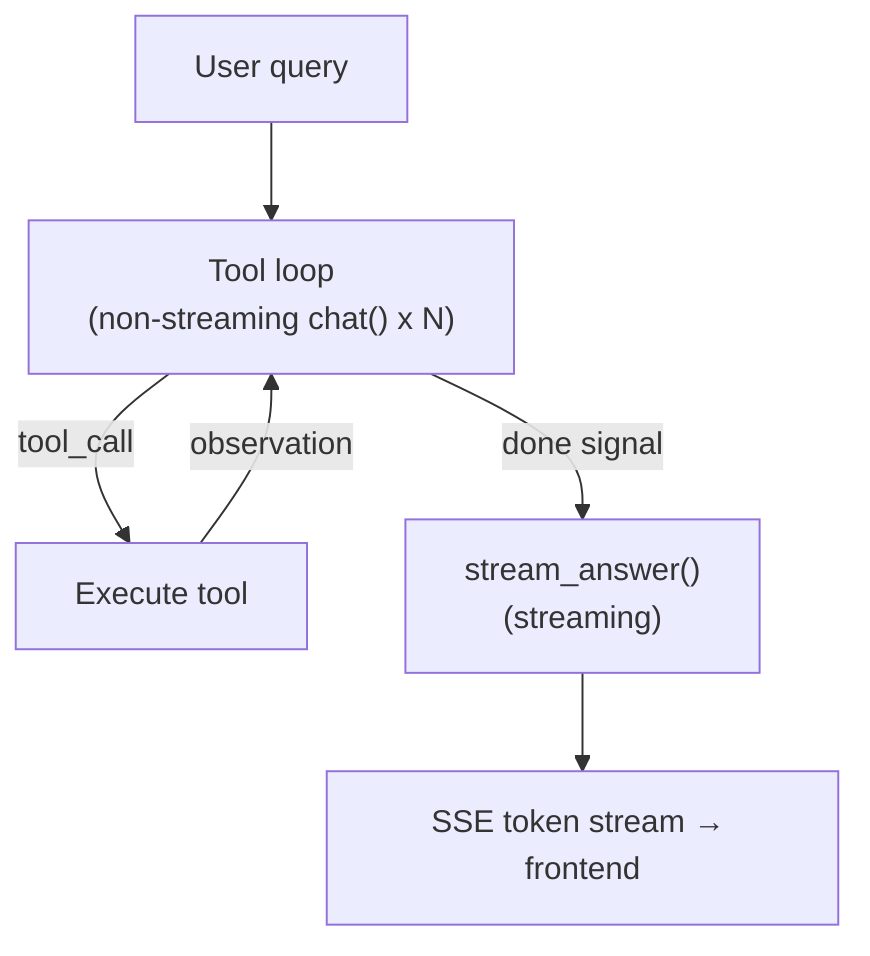
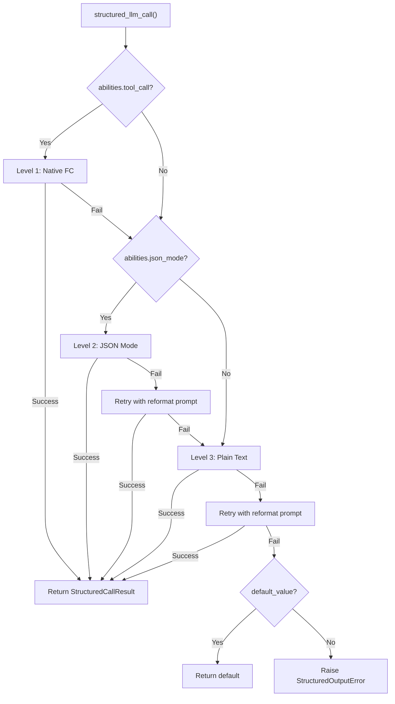
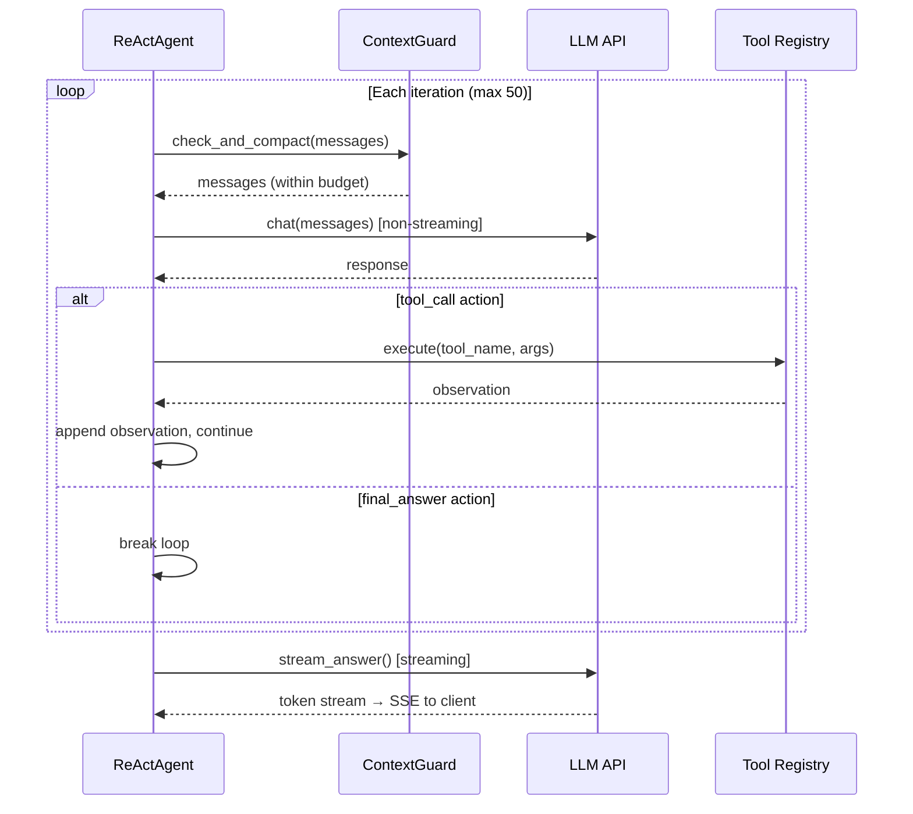
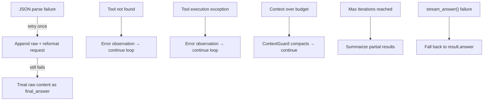
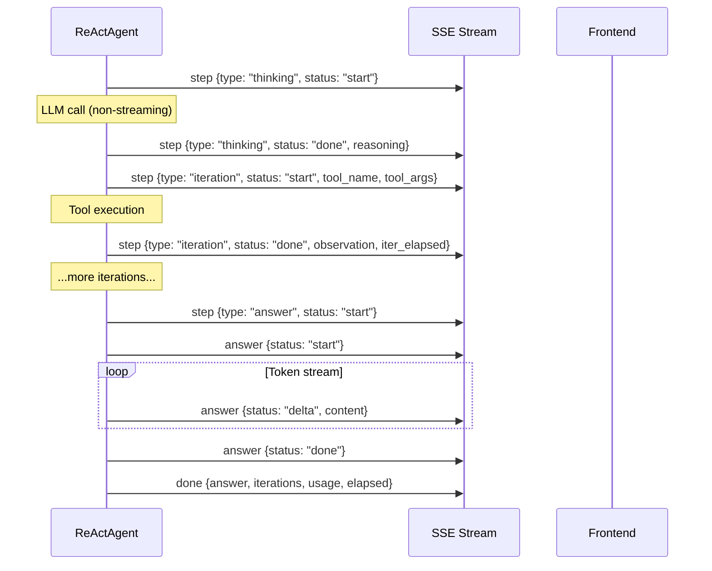

## L'architecture

Le moteur ReAct implémente un modèle d'exécution en deux phases. La première phase est une boucle itérative d'utilisation d'outils : l'agent demande à plusieurs reprises au LLM une action, exécute tout outil demandé, ajoute l'observation et continue jusqu'à ce que le LLM signale « terminé ». La deuxième phase est la synthèse de la réponse : un appel LLM de streaming séparé qui lit la trace d'exécution complète et produit la réponse destinée à l'utilisateur.

Cette séparation est délibérée. Les itérations d'outils sont optimisées pour la vitesse — chaque appel LLM dans la boucle utilise `chat()` sans streaming, car l'utilisateur n'a pas besoin de voir les actions JSON partielles ou les jetons de raisonnement intermédiaires. La génération de réponses est optimisée pour l'expérience utilisateur — elle utilise `stream_chat()` pour que l'utilisateur voie les jetons apparaître en temps réel. Le résultat est le meilleur des deux mondes : exécution d'outils rapide avec livraison de réponses réactive.

La boucle d'outils produit un `AgentResult` contenant l'historique complet de la conversation — invite système, requête utilisateur, chaque message d'assistant, chaque résultat d'outil. La méthode `stream_answer()` distille cette trace en une réponse concise et cohérente. Les résultats d'outils sont tronqués à 2 000 caractères chacun dans le contexte de synthèse, gardant l'invite allégée même après des flux de travail multi-outils complexes.

**Liaison de modèle.** Le LLM est injecté dans `ReActAgent.__init__()` et stocké en tant que `self._llm`. Chaque appel au sein d'une seule invocation `run()` — toutes les itérations de la boucle d'outils et la synthèse de réponse finale — utilise cette même instance. Le modèle ne change pas entre les itérations. Pour utiliser un modèle différent, un nouveau `ReActAgent` doit être construit. En mode DAG, `DAGExecutor._resolve_agent()` exploite ce modèle : il crée un agent frais par étape (en sélectionnant le modèle à partir de `ModelRegistry` en fonction de `step.model_hint`) immédiatement avant que la boucle ReAct de cette étape ne commence. Voir [DAG Engine — Per-step override](/architecture/dag-engine#two-llm-architecture) pour plus de détails.

## Exécution en mode dual

Le moteur ReAct prend en charge deux modes distincts d'interaction avec le LLM pendant la boucle d'outils.

**Mode JSON** (`_run_json`) intègre les descriptions d'outils directement dans l'invite système et demande au LLM de répondre avec un objet JSON — soit une action `tool_call` avec un nom d'outil et des arguments, soit un signal `final_answer`. L'agent analyse le JSON du contenu de la réponse, exécute l'outil et ajoute l'observation en tant que message utilisateur.

**Appel de fonction natif** (`_run_native`) utilise l'API d'appel d'outils intégrée du fournisseur LLM. Les descriptions d'outils sont transmises via le paramètre `tools`, et le LLM retourne des `tool_calls` structurés dans la réponse API plutôt que d'émettre du JSON dans son contenu. C'est le mode préféré pour les modèles qui le prennent en charge.

La sélection du mode est automatique. La propriété `_native_mode_active` retourne `True` uniquement lorsque les deux conditions sont remplies : l'agent a été créé avec `use_native_tools=True` (par défaut) et le LLM annonce `abilities["tool_call"] = True`. Si l'une des conditions échoue, le moteur revient au mode JSON.

| Aspect | Mode JSON | Appel de fonction natif |
|--------|-----------|------------------------|
| Sortie LLM | Objet JSON dans le contenu du message | `tool_calls` dans la réponse API |
| Invite système | Intègre les descriptions complètes d'outils en texte | Outils transmis via le paramètre `tools` |
| Appels d'outils parallèles | Un outil par itération | Plusieurs via `asyncio.gather` |
| Gestion des échecs d'analyse | Réessai avec invite de reformatage | N/A (structuré par l'API) |
| Appels LLM en boucle | `chat()` sans streaming | `chat()` sans streaming |
| Idéal pour | Modèles sans support d'appel d'outils | GPT-4, Claude et similaires |

Les deux modes partagent la même phase de synthèse de réponse — `stream_answer()` fonctionne de manière identique quel que soit le mode d'exécution de la boucle d'outils.

## structured_llm_call — extraction de sortie unifiée

Tout site d'appel qui a besoin que le LLM retourne des données conformes à un schéma JSON utilise `structured_llm_call()`. C'est le point d'entrée unique pour la sortie structurée dans l'ensemble du framework — le planificateur DAG, l'analyseur de plan, la sélection d'outils, et tout composant futur qui a besoin de JSON analysé à partir d'un LLM.

La fonction implémente une chaîne de dégradation à 3 niveaux, tentant chaque niveau dans l'ordre en fonction des capacités annoncées du LLM :

**Niveau 1 : Appel de fonction natif.** Utilise l'API `tool_call` / `tool_choice` du LLM pour forcer une réponse structurée. Disponible quand `abilities["tool_call"] = True`. Si le LLM retourne `tool_calls`, les arguments sont extraits directement. Si l'analyse échoue, passe au niveau suivant.

**Niveau 2 : Mode JSON.** Définit `response_format={"type": "json_object"}` pour contraindre le format de sortie du LLM. Disponible quand `abilities["json_mode"] = True`. Si la réponse ne peut pas être analysée, réessaie une fois avec une invite de reformatage (« Votre réponse précédente n'a pas pu être analysée comme du JSON valide... »), puis passe au niveau suivant.

**Niveau 3 : Texte brut.** Appelle le LLM sans contraintes de format et extrait le JSON du texte libre en utilisant `extract_json()`. Si l'extraction échoue, une fonction `regex_fallback` optionnelle est essayée. Réessaie une fois avec l'invite de reformatage avant d'abandonner.

La chaîne de dégradation signifie que chaque modèle — de GPT-4 avec support complet des appels d'outils à un LLM local qui ne peut produire que du texte brut — peut participer à des scénarios de sortie structurée. Le pire cas est 5 appels LLM (1 natif + 1 JSON + 1 réessai JSON + 1 brut + 1 réessai brut), mais en pratique la plupart des appels se résolvent au Niveau 1 en une seule tentative.

| Capacité du modèle | Chemin emprunté | Appels LLM max |
|-----------------|------------|---------------|
| tool_call + json_mode | L1 → L2 → L3 | 5 |
| json_mode uniquement | L2 → L3 | 4 |
| Texte brut uniquement | L3 | 2 |

Le résultat est un `StructuredCallResult` contenant la valeur analysée, le dictionnaire brut, le niveau qui a réussi, et l'utilisation cumulative des jetons. Les sites d'appel utilisent `parse_fn` pour transformer le dictionnaire brut en objet de domaine (par exemple, un plan DAG) et `default_value` pour fournir un secours quand l'échec total est acceptable.

`structured_llm_call` est utilisé par : le planificateur DAG (schéma de plan), l'analyseur de plan (schéma d'analyse), la sélection d'outils (schéma de liste d'outils), et tout composant qui a besoin d'une sortie structurée fiable. C'est également discuté dans [Planning Landscape](/architecture/planning-landscape).

## Sélection d'outils

Quand un agent a accès à de nombreux outils — courant en mode Hub où plusieurs connecteurs exposent chacun plusieurs actions — injecter le schéma complet de chaque outil dans le contexte de conversation est inefficace. Un hub de connecteurs avec 20 outils consomme environ 5K tokens dans les descriptions d'outils seules, réduisant l'espace disponible pour l'historique de conversation et les résultats d'outils.

Le moteur résout ce problème avec une phase de sélection légère. Quand le nombre total d'outils enregistrés dépasse `TOOL_SELECTION_THRESHOLD` (12), l'agent exécute un appel LLM préliminaire avant d'entrer dans la boucle principale. Cet appel reçoit un catalogue compact — environ 80 caractères par outil, contenant uniquement le nom et une description d'une ligne, sans schémas de paramètres — et sélectionne les outils les plus pertinents pour la requête actuelle, jusqu'à `_TOOL_SELECTION_MAX` (6).

La sélection utilise `structured_llm_call` avec un schéma simple (`{"tools": ["tool_name_1", "tool_name_2"]}`), donc elle bénéficie de la même dégradation à 3 niveaux. Les noms d'outils sélectionnés sont utilisés pour construire un `ToolRegistry` filtré que la boucle principale utilise à la fois pour la construction du message système et l'exécution des outils.

L'échec de la sélection est volontairement non fatal. Si le LLM retourne une sortie non analysable, si tous les noms sélectionnés sont invalides, ou si une exception quelconque se produit, l'agent revient à l'ensemble complet d'outils. Cela garantit qu'une sélection défectueuse ne empêche jamais l'agent de fonctionner — il utilise simplement plus de contexte que l'optimal.

## La boucle d'itération

La boucle centrale pilote à la fois le mode JSON et le mode natif, avec des différences mineures dans la gestion des messages. Chaque itération suit le même modèle de haut niveau : vérifier le budget de contexte, appeler le LLM, traiter la réponse, et soit exécuter un outil, soit s'arrêter.

**Boucle en mode JSON.** La réponse du LLM est analysée via `_parse_action()`, qui utilise `extract_json()` pour trouver un objet JSON dans le contenu. Si l'analyse échoue, l'agent ajoute la réponse brute et une demande de reformatage, puis continue — cela compte contre `max_iterations`, empêchant les boucles de retry infinies. En cas de succès, l'action est soit un `tool_call` (exécuter l'outil, ajouter l'observation comme message utilisateur) soit une `final_answer` (s'arrêter et procéder à la synthèse).

**Boucle en mode natif.** La réponse du LLM peut contenir un ou plusieurs `tool_calls`. Tous les appels d'outils dans une seule réponse sont exécutés en parallèle via `asyncio.gather`, et tous les messages de résultats d'outils sont ajoutés avant tout autre message. Cette contrainte d'ordre est critique — l'API OpenAI (et les fournisseurs compatibles) exige que les messages `tool` suivent immédiatement le message `assistant` qui a produit les `tool_calls`. Insérer tout autre message (comme une interruption utilisateur) entre eux briserait le protocole. Quand aucun `tool_calls` n'est présent, la réponse est traitée comme la réponse finale.

**Limite d'itérations.** La limite par défaut est 50 itérations. Si la boucle épuise cette limite sans produire une `final_answer`, l'agent synthétise une réponse de secours à partir des résultats d'étapes accumulés — un résumé des outils appelés et de leur succès ou échec. C'est un filet de sécurité, pas un chemin de sortie normal.

[Context Management](/architecture/context-management) explique comment ContextGuard applique le budget de tokens à chaque itération, y compris le système d'indices qui indique au LLM de compaction de préserver les chaînes de raisonnement récentes.

## Auto-réflexion en cours d'exécution

Les chaînes de raisonnement longues (10+ appels d'outils) risquent une **dérive d'objectif** — l'agent perd progressivement de vue l'objectif initial pour se concentrer sur un sous-problème local, répète des actions similaires, ou entre dans des boucles de retry circulaires. L'auto-réflexion en cours d'exécution est une contre-mesure légère.

Tous les `_SELF_REFLECTION_INTERVAL` appels d'outils (par défaut : **6**), l'agent injecte un message utilisateur dans la conversation demandant au LLM de faire une pause et de réfléchir :

- Est-il toujours sur la bonne voie vers l'objectif initial ?
- A-t-il répété des actions similaires ou tourné en rond ?
- Quelle est l'étape suivante la plus directe pour terminer ?
- Devrait-il produire une réponse finale maintenant ?

Le compteur suit **uniquement les appels d'outils réels** — les retries d'analyse JSON, les événements de réflexion, et les injections d'interruption ne comptent pas. En mode natif, le message de réflexion est ajouté strictement après tous les messages `tool_result` pour préserver la contrainte d'appairage tool_use/tool_result.

Cela coûte environ 100 tokens par injection (pas d'appel LLM supplémentaire) et n'a aucun effet sur les exécutions courtes (< 6 appels d'outils). Il complète ContextGuard (qui gère les budgets de tokens) et la vérification par étape (qui valide les résultats individuels) en traitant un mode de défaillance différent : l'agent perdant de vue son objectif au fil de nombreuses itérations.

## Synthèse des réponses (stream_answer)

La séparation entre la boucle d'outils et la synthèse des réponses est une décision architecturale fondamentale. Les itérations d'outils produisent des données brutes — actions JSON, observations d'outils, messages d'erreur. L'utilisateur a besoin d'une réponse cohérente et bien formatée, pas un vidage de la trace interne de l'agent.

`stream_answer()` construit un prompt de synthèse à partir de deux composants. Le prompt système instruit le LLM à agir comme un synthétiseur : présenter les résultats directement, utiliser le formatage markdown, éviter les méta-commentaires (« basé sur la sortie de l'outil... »), et correspondre à la langue de la requête originale. Le message utilisateur contient la question originale et une trace d'exécution formatée — chaque appel d'outil et son résultat, avec les résultats d'outils tronqués à 2 000 caractères.

L'appel de synthèse utilise `stream_chat()`, produisant des tokens de manière incrémentale. La couche web enveloppe ces tokens dans des événements SSE `answer` avec le statut `delta` afin que le frontend puisse les afficher au fur et à mesure de leur arrivée.

Si `stream_answer()` échoue — erreur réseau, délai d'attente du LLM, toute exception — la couche web revient à `result.answer`, le texte bref de l'itération finale de la boucle d'outils. C'est une expérience dégradée (pas de streaming, prose potentiellement moins soignée), mais elle garantit que l'utilisateur reçoit toujours une réponse.

## Gestion des interruptions

Les utilisateurs peuvent envoyer des messages de suivi pendant que l'agent traite toujours. Ceux-ci sont livrés via une `interrupt_queue` — une `InterruptQueue` enregistrée par conversation qui accumule les messages entre les itérations.

Le timing de vidage diffère entre les modes en raison de la contrainte d'ordre des appels d'outils :

- **Mode JSON** : la queue est vidée immédiatement après chaque message d'assistant, avant de vérifier si l'action est une `final_answer`. C'est sûr car le mode JSON utilise des messages utilisateur/assistant simples sans exigences d'appairage structurel.

- **Mode FC natif** : la queue est vidée uniquement après que les messages de résultats d'outils ont été ajoutés. Les messages `tool` doivent immédiatement suivre le message `assistant` contenant `tool_calls` — insérer un message utilisateur entre eux violerait le protocole API et causerait des erreurs.

Les messages injectés sont marqués comme `pinned=True`, garantissant qu'ils survivent à toute compaction ultérieure par ContextGuard. Consultez [Messages épinglés](/architecture/context-management#pinned-messages) pour comprendre comment le mécanisme d'épinglage empêche la compaction de supprimer les messages critiques.

Quand une `final_answer` est en attente mais que des messages injectés sont arrivés, l'agent supprime la réponse finale et continue la boucle pour pouvoir traiter le suivi de l'utilisateur. Les injections multiples du même vidage sont combinées en un seul message `[USER INTERRUPT]` — cela empêche le LLM de voir une séquence fragmentée de courts messages et l'encourage à traiter tous les suivis de manière holistique.

## Gestion des erreurs et secours

Le moteur est conçu pour ne jamais planter en cas d'échec du LLM ou des outils. Chaque chemin d'erreur soit se rétablit silencieusement, soit affiche un message utile à l'utilisateur.

**Échec d'analyse JSON.** Quand le LLM retourne du contenu non-JSON en mode JSON, `_parse_action()` l'encapsule comme `final_answer` avec le raisonnement `"(could not parse LLM output as JSON)"`. La boucle détecte cette sentinelle, ajoute le contenu brut et une instruction de reformatage, puis continue. Si la nouvelle tentative échoue aussi, le contenu brut devient la réponse — imparfait, mais pas un plantage.

**Erreurs d'outils.** À la fois « outil non trouvé » et « exception d'exécution d'outil » produisent des observations d'erreur qui sont ajoutées à la conversation. Le LLM voit l'erreur à l'itération suivante et peut décider de réessayer avec des arguments différents ou de continuer. Cela rend l'agent auto-réparable pour les défaillances transitoires d'outils.

**Réflexion étendue.** Les modèles comme DeepSeek R1 retournent le contenu de raisonnement dans un champ `reasoning_content` séparé plutôt que dans le corps JSON. Le moteur vérifie cela et l'utilise comme secours quand le champ JSON `reasoning` est vide.

**Contenu riche.** Quand un outil produit des artefacts HTML ou markdown, l'observation envoyée au LLM est remplacée par un court résumé (`"[Artifact generated: filename] The content is rendered as a preview in the UI..."`). Cela empêche le LLM de reproduire de gros blobs HTML dans sa réponse finale — un mode d'échec courant où le modèle reproduit utilement l'intégralité de la sortie de l'outil.

## Protocole d'événements SSE

La couche web traduit les rappels d'itération de l'agent en événements Server-Sent Events pour l'interface. Les événements sont émis sur deux canaux SSE : `step` pour la boucle d'outils, et `answer` pour la phase de synthèse.

| Événement | Canal | Charge utile | Quand |
|-----------|-------|-------------|-------|
| Début de réflexion | `step` | `{type: "thinking", status: "start", iteration}` | Avant chaque appel LLM |
| Réflexion terminée | `step` | `{type: "thinking", status: "done", iteration, reasoning}` | Après la réponse LLM, avant l'exécution de l'outil |
| Début d'itération | `step` | `{type: "iteration", status: "start", iteration, tool_name, tool_args}` | L'exécution de l'outil commence |
| Itération terminée | `step` | `{type: "iteration", status: "done", iteration, tool_name, observation, error, iter_elapsed}` | L'exécution de l'outil se termine |
| Signal de réponse | `step` | `{type: "answer", status: "start"}` | L'agent signale final_answer |
| Début de réponse | `answer` | `{status: "start"}` | La synthèse en streaming commence |
| Delta de réponse | `answer` | `{status: "delta", content}` | Chaque jeton diffusé |
| Réponse terminée | `answer` | `{status: "done"}` | La synthèse en streaming se termine |
| Compact | `compact` | `{original_messages, kept_messages}` | Le contexte a été compacté au chargement |
| Phase | `phase` | `{phase: "selecting_tools", total_tools}` | La phase de sélection d'outils est active |
| Injection | `inject` | `{type: "inject", content}` | Interruption utilisateur reçue |
| Terminé | `done` | `{answer, iterations, usage, elapsed}` | Charge utile du résultat final |

L'interface utilise les événements `step` pour afficher les cartes d'appels d'outils repliables (montrant quel outil s'exécute, ses arguments et l'observation), les deltas `answer` pour diffuser le texte de réponse, et `compact` pour afficher le séparateur de résumé de contexte. L'événement `done` porte les métadonnées complètes — nombre total d'itérations, utilisation des jetons et temps écoulé — pour le pied de page de la réponse.
