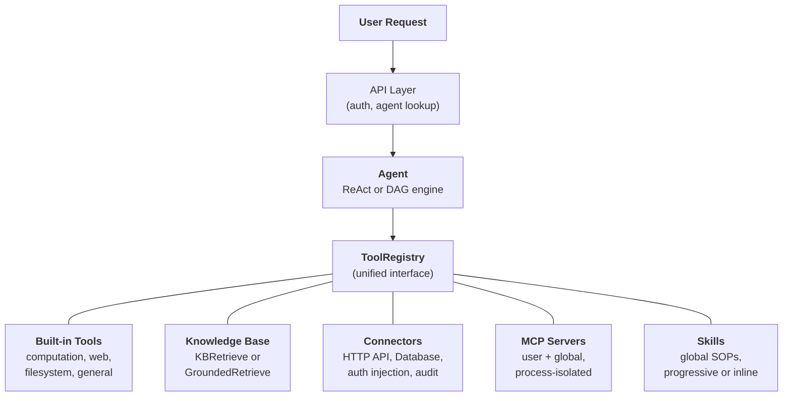
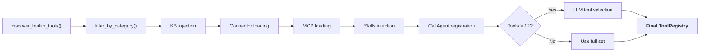

## L'abstraction unifiée des outils

L'insight de conception central dans FIM One est que **tout ce que l'agent peut faire est un outil**. Une calculatrice, une requête de base de connaissances, un appel API ERP et un serveur MCP tiers implémentent tous le même protocole `Tool` : `name`, `description`, `parameters_schema`, `category` et `run()`. L'agent ne sait pas et ne se soucie pas s'il appelle une fonction Python locale, interroge une base de données vectorielle, fait un proxy vers un système hérité ou invoque un serveur MCP communautaire. Il voit une liste plate d'outils appelables dans un `ToolRegistry`.

Il s'agit d'un choix architectural délibéré, pas d'une simplification accidentelle. Cela signifie que l'ajout d'une nouvelle source de capacité ne nécessite jamais de modifier l'agent, les moteurs d'exécution ou la couche de gestion du contexte. Vous enregistrez des outils ; l'agent les utilise.

Cinq sources de capacités convergent dans un registre unique. L'agent puise dans toutes de manière égale.

## Cinq sources de capacités

### Outils intégrés

Découverts automatiquement au démarrage via `discover_builtin_tools()`. Déposez une sous-classe `BaseTool` dans `core/tool/builtin/`, et elle s'enregistre sans aucune configuration. Les catégories incluent le calcul (`calculator`, `python_exec`), le web (`web_search`, `web_fetch`), le système de fichiers (`file_ops`), et les outils généraux (`email_send`, `json_transform`, `template_render`, `text_utils`). Ce sont les capacités natives de l'agent -- toujours disponibles, zéro configuration.

### Base de Connaissances

Conditionnel. Lorsqu'un agent a lié des `kb_ids`, l'outil générique `kb_retrieve` est remplacé par un outil de récupération spécialisé. En **mode simple**, `KBRetrieveTool` effectue une récupération RAG basique. En **mode grounding**, `GroundedRetrieveTool` exécute un pipeline à 5 étapes : récupération multi-KB, extraction de citations, scoring d'alignement, détection de conflits et calcul de confiance. La Base de Connaissances n'est pas un sous-système séparé situé à côté de l'agent -- elle entre dans l'agent en tant qu'outil spécialisé, soumis au même protocole `Tool` que tout le reste.

### Connecteur

`ConnectorToolAdapter` encapsule les actions des systèmes d'entreprise en tant qu'outils. Chaque action devient un outil nommé `{connecteur}__{action}`, catégorisé comme `connecteur`. L'adaptateur ajoute un proxy HTTP avec injection d'authentification (bearer, clé API, authentification basique), contrôle d'accès au niveau des opérations (lecture/écriture/administrateur), troncature des réponses et journalisation d'audit. Pour l'accès direct à la base de données, `DatabaseToolAdapter` fournit l'exécution SQL consciente du schéma avec application optionnelle du mode lecture seule. Les connecteurs sont le pont entre l'IA et les systèmes hérités -- le différenciateur clé. Voir [Architecture des connecteurs](/architecture/connector-architecture) pour la conception complète.

### MCP

Les serveurs MCP externes fournissent des outils tiers via le protocole standard. Chaque serveur s'exécute dans son propre processus (transport stdio ou HTTP), complètement isolé de la plateforme. Les outils sont adaptés au protocole `Tool` et enregistrés sous la catégorie `mcp`. Les administrateurs peuvent provisionner des **serveurs MCP globaux** qui se chargent automatiquement pour tous les utilisateurs. MCP est le jeu de l'écosystème -- tout serveur compatible MCP fonctionne sans intégration personnalisée.

### Compétences

Les compétences sont des procédures opérationnelles standard (SOP) réutilisables -- politiques d'entreprise, procédures de traitement, flux de travail étape par étape -- qui s'appliquent globalement quel que soit l'agent sélectionné. Contrairement aux connecteurs et aux bases de connaissances (qui peuvent être limités à des agents spécifiques), les compétences sont toujours chargées pour chaque utilisateur en fonction de la visibilité (personnelle, partagée au niveau de l'organisation ou abonnée au marché).

Les compétences prennent en charge deux modes d'injection. En **mode progressif** (par défaut), l'invite système contient des stubs compacts (nom + description), et le LLM appelle `read_skill(name)` à la demande pour charger le contenu complet -- économisant les jetons de contexte quand de nombreuses compétences sont disponibles. En **mode inline**, le contenu complet de la compétence est intégré directement dans l'invite système -- adapté quand peu de compétences petites sont en usage.

Pour une analyse plus approfondie de la raison pour laquelle les compétences sont globales (non liées à l'agent) et comment elles interagissent avec la découverte de ressources en mode dual, consultez [Découverte d'agent et de ressources](/architecture/agent-discovery).

## Assemblage d'outils par requête

Chaque requête de chat assemble un ensemble d'outils frais via un pipeline de filtrage dans `_resolve_tools()`. Ce n'est pas une configuration statique -- elle est calculée par requête en fonction des paramètres de l'agent, de l'identité de l'utilisateur, et des connecteurs et serveurs MCP disponibles.

Les huit étapes :

1. **Découverte de base.** `discover_builtin_tools()` charge tous les outils intégrés, limités au sandbox de la conversation.
2. **Filtre de catégorie d'agent.** `filter_by_category(*agent.tool_categories)` restreint uniquement aux catégories que l'agent est autorisé à utiliser.
3. **Injection de KB.** Si l'agent a `kb_ids`, l'outil de récupération générique est remplacé par `KBRetrieveTool` ou `GroundedRetrieveTool` selon le mode de récupération.
4. **Chargement des connecteurs.** En mode contraint par agent, seuls les connecteurs liés à l'agent sont chargés. En mode découverte automatique (aucun agent sélectionné), tous les connecteurs visibles pour l'utilisateur sont chargés -- en utilisant `ConnectorMetaTool` pour les connecteurs API (découverte progressive) et des outils individuels pour les connecteurs de base de données.
5. **Chargement MCP.** Les serveurs MCP personnels de l'utilisateur plus les serveurs MCP globaux provisionnés par l'administrateur sont chargés, connectés, et leurs outils enregistrés.
6. **Injection de Skills.** Tous les Skills actifs visibles pour l'utilisateur sont chargés -- indépendamment de la sélection d'agent. En mode progressif, `ReadSkillTool` est enregistré avec des stubs compacts dans l'invite système. En mode inline, le contenu complet du Skill est intégré directement.
7. **Enregistrement de CallAgent.** Tous les Agents actifs et visibles sont assemblés dans un catalogue et exposés via `CallAgentTool`, permettant au LLM de déléguer des tâches à des sous-agents spécialisés. Les sous-agents reçoivent un `ToolRegistry` complet construit à partir de leur propre configuration mais excluent `call_agent` pour éviter la récursion infinie.
8. **Sélection à l'exécution.** Si le nombre total d'outils dépasse 12, un appel LLM léger sélectionne le sous-ensemble le plus pertinent (jusqu'à 6) pour cette requête spécifique. L'échec de la sélection n'est pas fatal -- l'agent revient à l'ensemble complet.

Le résultat : l'agent voit exactement les outils dont il a besoin, pas plus. Un agent simple sans connecteurs et sans KB pourrait voir 5 outils. Un agent Hub connecté à 3 systèmes d'entreprise avec une base de connaissances ancrée et 2 serveurs MCP pourrait voir 30 -- mais après sélection, seulement les 6 plus pertinents font leur entrée dans le contexte.

## Quand utiliser quoi

| Besoin | Utiliser | Pourquoi |
|------|-----|-----|
| Calcul général, exécution de code, transformations de texte | Outil intégré | Toujours disponible, aucune configuration nécessaire |
| Intégration de systèmes d'entreprise (ERP, CRM, OA) | Connecteur | Gouvernance de l'authentification, piste d'audit, contrôle d'accès au niveau des opérations |
| Récupération de connaissances avec citations et preuves | Base de connaissances | Pipeline RAG, génération ancrée, scoring de confiance |
| Écosystème d'outils tiers | MCP | Protocole standard, isolation des processus, serveurs communautaires |
| Politiques organisationnelles, procédures opérationnelles, procédures de traitement | Compétence | Global par défaut, chargement progressif, visibilité limitée |
| Délégation de tâches à des agents spécialisés | AppelAgent | Routage sémantique des agents, héritage complet des outils, exécution parallèle |
| Accès direct à la base de données | Connecteur de base de données | SQL conscient du schéma, application optionnelle du mode lecture seule |
| Outillage interne personnalisé | MCP ou Outil intégré | MCP pour l'isolation des processus ; outil intégré pour une intégration étroite |

Les catégories ne s'excluent pas mutuellement. Un seul agent peut utiliser les cinq sources de capacités dans une conversation -- charger une Compétence pour la procédure opérationnelle de traitement des réclamations, interroger une base de connaissances pour les documents de politique, appeler un connecteur pour vérifier l'ERP, déléguer l'analyse à un sous-agent spécialisé, et utiliser un outil intégré pour formater les résultats.

## Les moteurs d'exécution sont orthogonaux

Le système d'outils et les moteurs d'exécution sont des préoccupations indépendantes. Les moteurs pilotés par LLM (ReAct et DAG) consomment des outils à partir du même `ToolRegistry`. Le choix du moteur affecte la façon dont les outils sont orchestrés, non les outils disponibles.

**ReAct** est une boucle d'outils itérative. L'agent raisonne, choisit un outil, observe le résultat et répète jusqu'à la fin. Il excelle dans les tâches exploratoires et conversationnelles où l'étape suivante dépend du résultat précédent. La boucle s'exécute jusqu'à 50 itérations avec gestion du contexte par itération via ContextGuard. Voir [Moteur ReAct](/architecture/react-engine) pour les détails d'implémentation.

**DAG** décompose un objectif en 2-6 étapes parallèles. Chaque étape exécute un agent ReAct indépendant. Un PlanAnalyzer évalue si l'objectif a été atteint ; sinon, le pipeline se replanifie automatiquement (jusqu'à 3 tours). DAG excelle dans les tâches avec des sous-tâches claires qui peuvent s'exécuter en parallèle -- "rechercher trois sources et comparer les résultats" se termine dans le temps d'une recherche, pas trois. Voir [Moteur DAG](/architecture/dag-engine) pour le pipeline complet.

Les deux moteurs partagent une infrastructure : `structured_llm_call` pour une sortie structurée fiable, `ContextGuard` pour l'application du budget de tokens, et `ToolRegistry` pour la résolution des outils. L'ajout d'un nouvel outil ne nécessite aucune modification dans l'un ou l'autre moteur. L'ajout d'un nouveau moteur (s'il en était jamais nécessaire) ne nécessite aucune modification du système d'outils.

Les deux moteurs supportent également la **délégation multi-agent** via `CallAgentTool`. En mode d'appel de fonction natif, le LLM peut invoquer plusieurs appels `call_agent` en un seul tour, qui s'exécutent en parallèle via `asyncio.gather`. Chaque sous-agent reçoit son propre `ToolRegistry` et s'exécute comme une unité d'exécution complète. Pour la conception détaillée de la découverte d'agents, des Skills en tant que procédures opérationnelles standard globales, et de l'orchestration multi-agent, voir [Découverte d'agents et de ressources](/architecture/agent-discovery).

### Moteur de flux de travail — le troisième paradigme

Aux côtés des moteurs ReAct et DAG pilotés par LLM, FIM One inclut un **Moteur de flux de travail** — un éditeur DAG visuel avec 26 types de nœuds pour l'automatisation de processus fixes (chaînes d'approbation, ETL planifiée, pipelines multi-étapes). Les flux de travail peuvent invoquer des Agents, des Connecteurs, des Bases de connaissances, des Serveurs MCP, des appels LLM, des requêtes HTTP, du code Python et des portes d'approbation humaines. La relation est asymétrique : les flux de travail peuvent orchestrer des Agents (via le nœud AGENT), mais les Agents ne peuvent pas invoquer directement les flux de travail. Utilisez les Agents pour les tâches flexibles et exploratoires ; utilisez les flux de travail pour les processus déterministes et reproductibles. Consultez [Modes d'exécution](/concepts/execution-modes) pour plus de détails.

## Aperçu du cycle de vie

**Démarrage.** `start.sh` exécute les migrations Alembic, lance le serveur FastAPI, découvre les outils intégrés et établit les connexions du serveur MCP pour tous les serveurs globaux préconfigurés.

**Par requête.** Authentification JWT, recherche de configuration d'agent, assemblage d'outils (le pipeline en 8 étapes ci-dessus), sélection du moteur (ReAct ou DAG selon la configuration de l'agent), exécution avec streaming SSE et persistance des résultats.

**Préoccupations transversales.** [Gestion du contexte](/architecture/context-management) (budget de jetons à 5 niveaux) protège chaque appel LLM du débordement. La journalisation d'audit suit chaque invocation d'outil connecteur. L'isolation du bac à sable contient les outils d'exécution de code. L'architecture à deux LLM (intelligent + rapide) optimise les coûts entre la planification, l'exécution et la synthèse.

L'architecture est conçue de sorte que chaque préoccupation -- enregistrement d'outils, orchestration d'exécution, gestion du contexte, sécurité -- peut évoluer indépendamment. Un nouveau type de connecteur, un nouveau moteur d'exécution ou une nouvelle stratégie de contexte peut être ajouté sans modifications en cascade dans le système.
