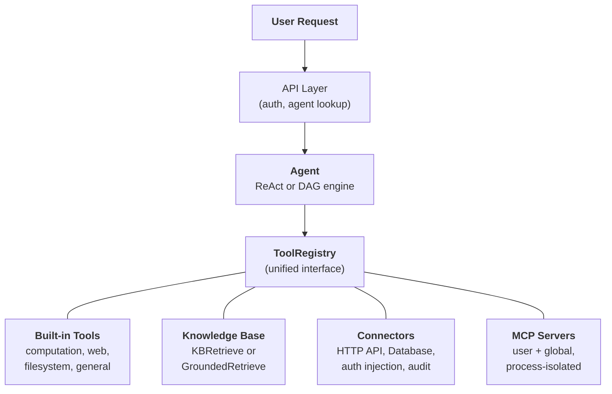
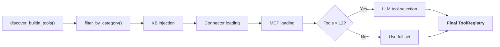

---
title: "Aperçu du système"
description: "Comment Agent, Knowledge Base, Connector, Built-in Tools et MCP se composent dans une architecture unifiée."
---## L'abstraction d'outil unifiée

L'insight de conception central dans FIM One est que **tout ce que l'agent peut faire est un outil**. Une calculatrice, une requête de base de connaissances, un appel API ERP et un serveur MCP tiers implémentent tous le même protocole `Tool` : `name`, `description`, `parameters_schema`, `category` et `run()`. L'agent ne sait pas et ne se soucie pas s'il appelle une fonction Python locale, interroge une base de données vectorielle, fait un proxy vers un système hérité ou invoque un serveur MCP communautaire. Il voit une liste plate d'outils appelables dans un `ToolRegistry`.

C'est un choix architectural délibéré, pas une simplification accidentelle. Cela signifie qu'ajouter une nouvelle source de capacité ne nécessite jamais de modifier l'agent, les moteurs d'exécution ou la couche de gestion du contexte. Vous enregistrez des outils ; l'agent les utilise.

Quatre sources de capacité convergent dans un seul registre. L'agent puise dans toutes de manière égale.## Quatre sources de capacités### Outils intégrés

Découverts automatiquement au démarrage via `discover_builtin_tools()`. Déposez une sous-classe `BaseTool` dans `core/tool/builtin/`, et elle s'enregistre sans aucune configuration. Les catégories incluent le calcul (`calculator`, `python_exec`), le web (`web_search`, `web_fetch`), le système de fichiers (`file_ops`), et les outils généraux (`email_send`, `json_transform`, `template_render`, `text_utils`). Ce sont les capacités natives de l'agent -- toujours disponibles, zéro configuration.### Base de connaissances

Conditionnel. Lorsqu'un agent a lié des `kb_ids`, l'outil générique `kb_retrieve` est remplacé par un outil de récupération spécialisé. En **mode simple**, `KBRetrieveTool` effectue une récupération RAG basique. En **mode grounding**, `GroundedRetrieveTool` exécute un pipeline à 5 étapes : récupération multi-KB, extraction de citations, scoring d'alignement, détection de conflits et calcul de confiance. La Base de connaissances n'est pas un sous-système séparé à côté de l'agent -- elle entre dans l'agent en tant qu'outil spécialisé, soumis au même protocole `Tool` que tout le reste.### Connecteur

`ConnectorToolAdapter` encapsule les actions des systèmes d'entreprise en tant qu'outils. Chaque action devient un outil nommé `{connector}__{action}`, catégorisé comme `connector`. L'adaptateur ajoute un proxy HTTP avec injection d'authentification (bearer, clé API, authentification basique), contrôle d'accès au niveau des opérations (lecture/écriture/admin), troncature de réponse et journalisation d'audit. Pour un accès direct à la base de données, `DatabaseToolAdapter` fournit une exécution SQL consciente du schéma avec application optionnelle du mode lecture seule. Les connecteurs sont le pont entre l'IA et les systèmes hérités -- le différenciateur clé. Voir [Architecture des connecteurs](/architecture/connector-architecture) pour la conception complète.### MCP

Les serveurs MCP externes fournissent des outils tiers via le protocole standard. Chaque serveur s'exécute dans son propre processus (transport stdio ou HTTP), complètement isolé de la plateforme. Les outils sont adaptés au protocole `Tool` et enregistrés sous la catégorie `mcp`. Les administrateurs peuvent provisionner des **serveurs MCP globaux** qui se chargent automatiquement pour tous les utilisateurs. MCP est le jeu de l'écosystème -- tout serveur compatible MCP fonctionne sans intégration personnalisée.## Assemblage d'outils par requête

Chaque requête de chat assemble un ensemble d'outils frais via un pipeline de filtrage dans `_resolve_tools()`. Ce n'est pas une configuration statique -- elle est calculée par requête en fonction des paramètres de l'agent, de l'identité de l'utilisateur, et des connecteurs et serveurs MCP disponibles.

Les six étapes :

1. **Découverte de base.** `discover_builtin_tools()` charge tous les outils intégrés, limités au sandbox de la conversation.
2. **Filtre de catégorie d'agent.** `filter_by_category(*agent.tool_categories)` restreint uniquement aux catégories que l'agent est autorisé à utiliser.
3. **Injection de KB.** Si l'agent a `kb_ids`, l'outil de récupération générique est remplacé par `KBRetrieveTool` ou `GroundedRetrieveTool` selon le mode de récupération.
4. **Chargement des connecteurs.** Les connecteurs liés de l'agent sont interrogés à partir de la base de données. Les actions de chaque connecteur (ou schémas de base de données) sont instanciées en tant qu'adaptateurs d'outils et enregistrées.
5. **Chargement de MCP.** Les serveurs MCP personnels de l'utilisateur plus les serveurs MCP globaux provisionnés par l'administrateur sont chargés, connectés, et leurs outils enregistrés.
6. **Sélection à l'exécution.** Si le nombre total d'outils dépasse 12, un appel LLM léger sélectionne le sous-ensemble le plus pertinent (jusqu'à 6) pour cette requête spécifique. L'échec de la sélection n'est pas fatal -- l'agent revient à l'ensemble complet.

Le résultat : l'agent voit exactement les outils dont il a besoin, pas plus. Un agent simple sans connecteurs et sans KB pourrait voir 5 outils. Un agent Hub connecté à 3 systèmes d'entreprise avec une base de connaissances ancrée et 2 serveurs MCP pourrait voir 30 -- mais après sélection, seulement les 6 plus pertinents font leur entrée dans le contexte.## Quand utiliser quoi

| Besoin | Utiliser | Pourquoi |
|------|-----|-----|
| Calcul général, exécution de code, transformations de texte | Built-in Tool | Toujours disponible, aucune configuration nécessaire |
| Intégration de systèmes d'entreprise (ERP, CRM, OA) | Connector | Gouvernance de l'authentification, piste d'audit, contrôle d'accès au niveau des opérations |
| Récupération de connaissances avec citations et preuves | Knowledge Base | Pipeline RAG, génération ancrée, détection de conflits |
| Écosystème d'outils tiers | MCP | Protocole standard, isolation des processus, serveurs communautaires |
| Accès direct à la base de données | Database Connector | SQL conscient du schéma, application optionnelle du mode lecture seule |
| Outils internes personnalisés | MCP ou Built-in | MCP pour l'isolation des processus ; built-in pour l'intégration étroite |

Les catégories ne s'excluent pas mutuellement. Un seul agent peut utiliser les quatre sources de capacités dans une conversation -- interroger une base de connaissances pour les documents de politique, appeler un connecteur pour vérifier l'ERP, et utiliser un outil built-in pour formater les résultats.## Les moteurs d'exécution sont orthogonaux

Le système d'outils et les moteurs d'exécution sont des préoccupations indépendantes. Les deux moteurs consomment les outils du même `ToolRegistry`. Le choix du moteur affecte la façon dont les outils sont orchestrés, non les outils disponibles.

**ReAct** est une boucle d'outils itérative. L'agent raisonne, choisit un outil, observe le résultat et répète jusqu'à la fin. Il excelle dans les tâches exploratoires et conversationnelles où l'étape suivante dépend du résultat précédent. La boucle s'exécute jusqu'à 50 itérations avec gestion du contexte par itération via ContextGuard. Voir [ReAct Engine](/architecture/react-engine) pour les détails d'implémentation.

**DAG** décompose un objectif en 2-6 étapes parallèles. Chaque étape exécute un agent ReAct indépendant. Un PlanAnalyzer évalue si l'objectif a été atteint ; sinon, le pipeline se replanie automatiquement (jusqu'à 3 tours). DAG excelle dans les tâches avec des sous-tâches claires qui peuvent s'exécuter en parallèle -- "rechercher trois sources et comparer les résultats" se termine dans le temps d'une recherche, pas trois. Voir [DAG Engine](/architecture/dag-engine) pour le pipeline complet.

Les deux moteurs partagent l'infrastructure : `structured_llm_call` pour une sortie structurée fiable, `ContextGuard` pour l'application du budget de jetons, et le `ToolRegistry` pour la résolution des outils. L'ajout d'un nouvel outil ne nécessite aucune modification dans l'un ou l'autre moteur. L'ajout d'un nouveau moteur (s'il en était jamais nécessaire) ne nécessite aucune modification du système d'outils.## Aperçu du cycle de vie

**Démarrage.** `start.sh` exécute les migrations Alembic, lance le serveur FastAPI, découvre les outils intégrés et établit les connexions du serveur MCP pour tous les serveurs globaux préconfigurés.

**Par requête.** Authentification JWT, recherche de configuration d'agent, assemblage d'outils (le pipeline en 6 étapes ci-dessus), sélection du moteur (ReAct ou DAG selon la configuration de l'agent), exécution avec streaming SSE et persistance des résultats.

**Préoccupations transversales.** [Gestion du contexte](/architecture/context-management) (budget de jetons à 5 niveaux) protège chaque appel LLM du débordement. La journalisation d'audit suit chaque invocation d'outil connecteur. L'isolation du bac à sable contient les outils d'exécution de code. L'architecture à deux LLM (intelligent + rapide) optimise les coûts entre la planification, l'exécution et la synthèse.

L'architecture est conçue de sorte que chaque préoccupation -- enregistrement des outils, orchestration de l'exécution, gestion du contexte, sécurité -- peut évoluer indépendamment. Un nouveau type de connecteur, un nouveau moteur d'exécution ou une nouvelle stratégie de contexte peut être ajouté sans entraîner de modifications en cascade dans le système.