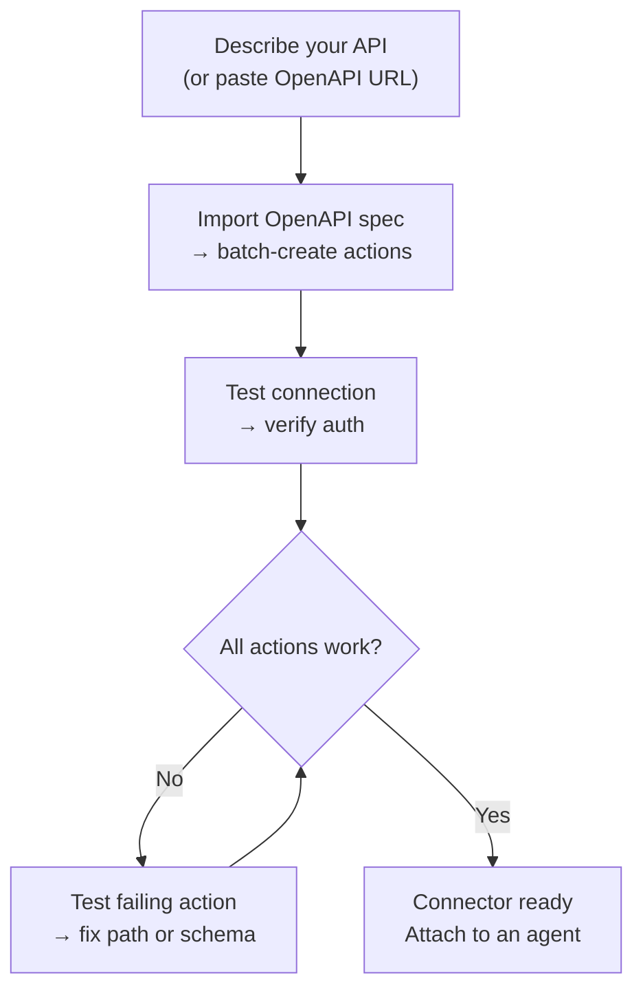
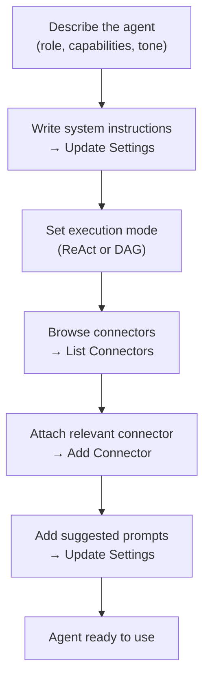

## Aperçu

AI Builder vous permet de décrire ce dont vous avez besoin en langage naturel et de faire configurer par un agent IA. Il fonctionne selon deux modes :

| Mode | Fonctionnement | Idéal pour |
|------|-------------|---------|
| **Suggestions rapides** | Un seul appel LLM génère la configuration | Brouillon rapide, API simples |
| **Générateur avancé** | Un agent ReAct utilise des outils en boucle pour construire, tester et affiner | API complexes, import OpenAPI, affinage itératif |

Vous pouvez basculer entre les modes à tout moment. Le mode rapide crée un point de départ ; le générateur avancé vous permet d'itérer.

---

## Générateur de connecteur

Un **connecteur** définit comment FIM One communique avec un système externe — son URL de base, l'authentification et les actions API spécifiques qu'il expose. Le Générateur de connecteur fournit à un agent IA 9 outils pour construire et gérer cette configuration en votre nom.

### Outils

| Outil | Fonction |
|------|-------------|
| **Get Settings** | Lire la configuration actuelle du connecteur (URL, type d'authentification, configuration d'authentification) |
| **Update Settings** | Modifier le nom du connecteur, l'URL de base ou les identifiants d'authentification |
| **List Actions** | Voir toutes les actions API existantes avec leurs méthodes et chemins |
| **Create Action** | Ajouter un nouveau point de terminaison API — méthode HTTP, chemin, paramètres, modèle de corps |
| **Update Action** | Modifier une action existante (description, schéma, extraction de réponse) |
| **Delete Action** | Supprimer une action qui n'est plus nécessaire |
| **Test Action** | Envoyer une requête HTTP en direct pour n'importe quelle action et inspecter la réponse |
| **Test Connection** | Vérifier que l'URL de base est accessible et que les identifiants sont acceptés |
| **Import OpenAPI** | Importer par lot jusqu'à 50 points de terminaison à partir d'une spécification Swagger 2.x ou OpenAPI 3.x |

### Flux de travail typique

Le modèle le plus courant : collez une URL OpenAPI et laissez le générateur faire le reste.

**Exemple de prompt :**
> « Importez la spécification OpenAPI depuis `https://api.acme.com/openapi.json`, puis testez le point de terminaison `GET /orders` avec `order_id=12345`. »

Le générateur récupère la spécification, crée automatiquement toutes les actions, envoie une requête de test et rapporte le résultat — tout cela sans que vous touchiez à un formulaire.

---

## Générateur d'Agent

Un **Agent** est une persona IA nommée avec un ensemble d'instructions, d'outils et (optionnellement) de connecteurs. Le Générateur d'Agent fournit à un agent IA 6 outils pour configurer un autre agent à partir de zéro.

### Outils

| Outil | Ce qu'il fait |
|------|-------------|
| **Get Settings** | Lire la configuration actuelle de l'agent (instructions, mode d'exécution, outils, modèle) |
| **Update Settings** | Modifier le nom, la description, l'invite système, le mode d'exécution ou les invites suggérées |
| **List Connectors** | Parcourir tous les connecteurs disponibles (attachés et détachés) |
| **Add Connector** | Attacher un connecteur pour que l'agent puisse appeler ses actions comme outils |
| **Remove Connector** | Détacher un connecteur (le connecteur lui-même n'est pas supprimé) |
| **Set Model** | Changer le LLM sous-jacent ou ajuster la température et les tokens maximum |

### Flux de travail typique

Commencez par une description et laissez le générateur configurer l'ensemble de l'agent :

**Exemple de prompt :**
> « Créez un Copilot Finance. Il doit répondre aux questions sur les commandes et les factures en utilisant le connecteur Acme. Utilisez le mode ReAct et ajoutez 3 prompts suggérés pour les questions courantes. »

Le générateur lit les paramètres actuels, rédige un prompt système, attache le connecteur, définit le mode d'exécution et ajoute des prompts suggérés — en un seul tour de conversation.

---

## Fonctionnement

Sous le capot, les deux générateurs partagent la même infrastructure que les agents réguliers :

| Mode du générateur | Mécanisme |
|-------------|-----------|
| **Suggestions rapides** | Un seul appel d'inférence LLM génère la configuration complète en JSON structuré |
| **Générateur avancé** | Une boucle d'agent ReAct : Raisonner → appeler un outil de générateur → observer le résultat → décider de l'étape suivante |

Le générateur avancé est un agent ReAct complet qui dispose d'un ensemble d'outils restreint — uniquement les 9 outils de générateur de Connecteur ou les 6 outils de générateur d'Agent, pas d'outils web ou de calcul. Il lit l'état actuel de la ressource cible, planifie les modifications nécessaires, appelle les outils appropriés et vérifie le résultat avant de déclarer la tâche terminée.

Cela signifie que le générateur avancé peut gérer l'ambiguïté : si l'import OpenAPI crée 30 actions mais que seulement 5 sont pertinentes, vous pouvez lui dire « conservez uniquement les points de terminaison liés aux commandes » et il supprimera le reste.
