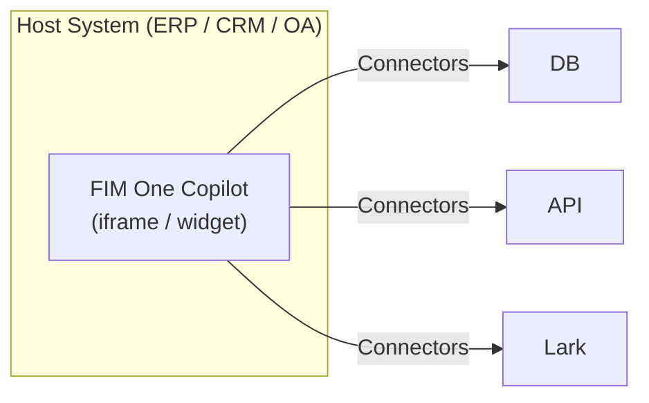
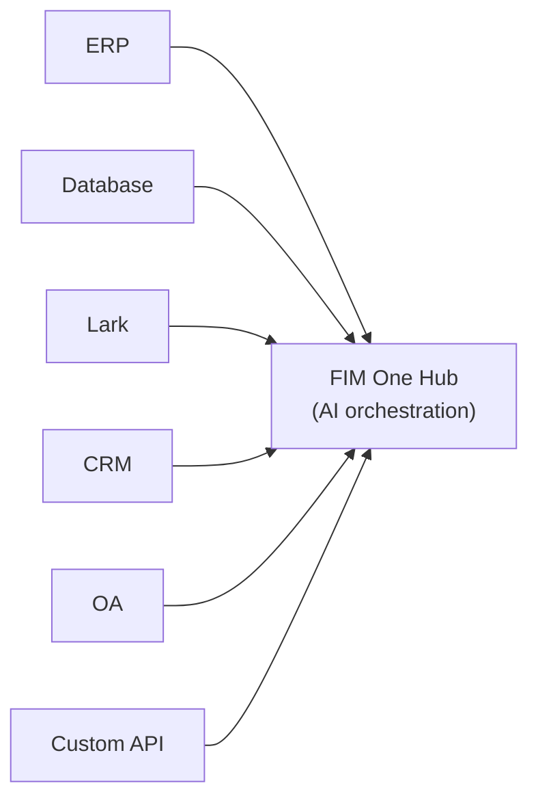
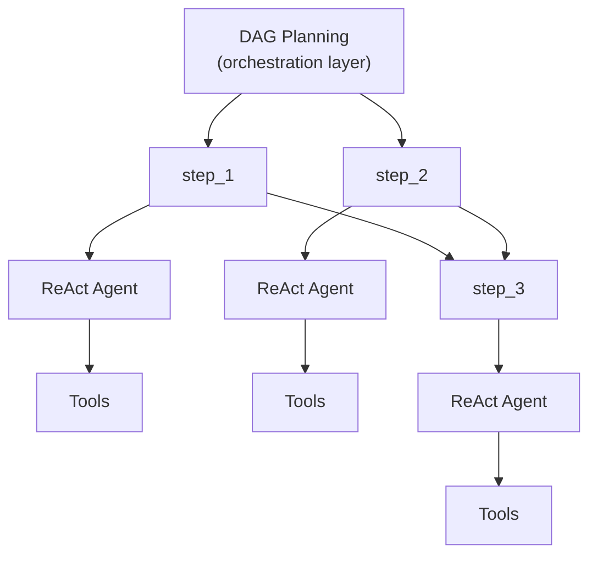

---
title: "Modes d'exécution"
description: "Autonome, Copilot et Hub — trois façons de déployer FIM One."
---## Trois modes

FIM One fonctionne selon trois modes, déterminés par la façon dont l'agent est déployé et utilisé :

| Mode | Qu'est-ce que c'est | Livraison | Exemple |
|------|-----------|----------|---------|
| **Standalone** | Assistant IA polyvalent | Portal | Chat, search, code execution, knowledge base Q&A |
| **Copilot** | IA intégrée dans un système hôte | iframe / widget / embed | "Finance Copilot" intégré dans l'interface web ERP |
| **Hub** | Orchestration centrale inter-systèmes | Portal / API | Agent interroge ERP, vérifie les approbations OA, notifie via Lark |

La progression est naturelle : commencer en mode standalone, intégrer dans un système hôte en tant que Copilot, puis configurer un Hub pour l'orchestration inter-systèmes. Le Copilot continue de fonctionner en mode intégré ; le Hub ajoute une couche d'orchestration centrale.## Détails du mode### Autonome (0 connecteurs)

Le mode par défaut. FIM One fonctionne comme un assistant IA complet :

- Outils intégrés : recherche web, exécution Python, calculatrice, opérations sur fichiers, commandes shell
- Base de connaissances avec RAG (PDF, DOCX, Markdown, HTML, CSV)
- Planification DAG dynamique pour les tâches multi-étapes complexes
- Streaming en temps réel avec visualisation DAG

Aucun accès au système externe nécessaire. Utile pour l'analyse générale, la recherche et les tâches de codage.### Copilot (embedded)

Intégrez FIM One dans l'interface web d'un système hôte. L'agent travaille aux côtés des utilisateurs dans leur interface familière — aucun changement de contexte requis. Le mode Copilot peut utiliser plusieurs connecteurs (par exemple, la base de données du système hôte + un service de notification).

Exemples :
- **Finance Copilot** : Connecté à Kingdee (金蝶) via connecteur DB → interroger les états financiers, générer des rapports d'analyse
- **Contract Copilot** : Connecté au système de gestion des contrats via connecteur API → rechercher des contrats, extraire des clauses, évaluer les risques
- **HR Copilot** : Connecté au système RH via connecteur API → interroger les informations des employés, générer des statistiques

L'agent utilise le même moteur ReAct/DAG qu'en mode Standalone, mais a maintenant accès aux données métier réelles via le connecteur.### Hub (orchestration centrale)

Le Hub est un portail autonome (ou une API) qui sert de couche d'intelligence centrale. Il n'est intégré dans aucun système unique — au lieu de cela, il se connecte à tous. Les utilisateurs y accèdent via l'interface utilisateur du portail ou l'API.

Exemples :
- "Vérifier les contrats en retard dans le CRM, croiser avec les paiements ERP, notifier l'équipe finance sur Lark"
- "Quand l'approbation OA est terminée, mettre à jour le statut du contrat dans le CRM et enregistrer dans la base de données d'audit"
- "Interroger les données de ventes de Salesforce, générer une prévision à partir de la base de données métier, envoyer un résumé par e-mail à la direction"

Chaque connector est un pont indépendant. L'ajout ou la suppression d'un ne affecte pas les autres.## Méthodes de livraison

| Livraison | Description | Mode typique |
|----------|-------------|-------------|
| **Portal (Web UI)** | Interface Next.js intégrée | Standalone, Hub |
| **API (headless)** | Points de terminaison HTTP/SSE (`/api/execute`, `/api/stream`) | Hub (accès programmatique) |
| **iframe / Embed** | Injecté dans les pages du système hôte | Copilot |

La livraison et le mode sont liés mais non verrouillés : vous pouvez accéder à un Hub via API, ou utiliser un agent standalone via le Portal. Mais le modèle typique est Portal pour Hub, embed pour Copilot.## Moteurs d'exécution (implémentation interne)

Sous le capot, FIM One fournit deux moteurs d'exécution :

| Moteur | Idéal pour | Fonctionnement |
|--------|----------|-------------|
| **ReAct** | Requêtes complexes uniques | Boucle Reason → Act → Observe avec outils |
| **DAG Planning** | Tâches multi-étapes parallèles | LLM génère un graphe de dépendances, les étapes indépendantes s'exécutent en parallèle |

ReAct est l'unité atomique ; DAG est la couche d'orchestration. Les deux moteurs fonctionnent dans les trois modes (Standalone, Copilot, Hub). En mode Hub, une seule étape DAG peut appeler des connecteurs vers différents systèmes.## Pourquoi pas de moteur de workflow traditionnel

FIM One ne construit délibérément **pas** d'éditeur de workflow par glisser-déposer. C'est un choix stratégique :

1. **Les workflows existent déjà ailleurs.** Les processus fixes des clients d'entreprise (chaînes d'approbation, flux d'audit) vivent dans leurs systèmes OA, ERP et hérités. Ils ont besoin d'une IA qui se connecte à ces systèmes, pas d'un autre éditeur de workflow.

2. **Le DAG dynamique couvre le cas flexible.** Pour les tâches non prédéfinies, les DAG générés par LLM s'adaptent à l'exécution — aucune pré-conception humaine requise.

3. **Les capacités existantes se composent en pipelines fixes.** Les tâches planifiées (prévues) déclenchent un agent DAG avec un prompt fixe ; le DAG planifie les étapes ; les Connectors établissent un pont vers les systèmes cibles. La combinaison équivaut à un pipeline statique — mais plus flexible, car l'LLM ajuste son plan en fonction des données qu'il rencontre.

4. **Connector = appel API.** Les opérations de workflow complexes (transfert, rejet, escalade) sont la responsabilité du système cible. Du point de vue du connector, chaque opération est simplement une requête HTTP avec des paramètres. FIM One appelle l'API ; le système cible gère la machine d'état.