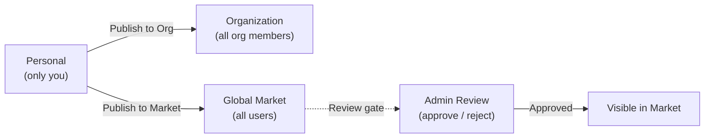

Le Marché est la place de marché de ressources intégrée de FIM One. Il organise les ressources partagées en deux niveaux :

- **Solutions** -- ressources de haut niveau qui fournissent des capacités de bout en bout : Agents, Compétences et Workflows.
- **Composants** -- blocs de construction sur lesquels les Solutions dépendent : Connecteurs et Serveurs MCP.

Vous parcourez par portée (votre Organisation ou le Marché Mondial), trouvez ce dont vous avez besoin, abonnez-vous et commencez à l'utiliser -- tout sans quitter FIM One.

<Info>
Le Marché utilise un **modèle de tirage** : les ressources sont découvertes par navigation et explicitement abonnées. Il n'y a pas de mécanisme d'auto-adhésion ou de poussée -- vous choisissez ce que vous installez, et vous pouvez filtrer par portée à tout moment.
</Info>

## Que puis-je trouver ?

### Solutions

Les solutions sont des capacités complètes et prêtes à l'emploi auxquelles vous pouvez vous abonner et commencer à utiliser immédiatement.

| Ressource | Catégorie | Ce que vous obtenez |
|---|---|---|
| **Agent** | Solution | Un assistant IA spécialisé avec des outils liés et des connaissances |
| **Compétence** | Solution | Un SOP global injecté dans les invites système, peut orchestrer des agents |
| **Workflow** | Solution | Un flux d'automatisation DAG pour une exécution planifiée ou déclenchée |

### Composants

Les composants sont les intégrations et les services d'outils à partir desquels les Solutions sont construites.

| Ressource | Catégorie | Ce que vous obtenez |
|---|---|---|
| **Connecteur** | Composant | Intégration API/base de données disponible comme outils d'agent |
| **Serveur MCP** | Composant | Service d'outil tiers chargé dans les sessions |

<Tip>
Les bases de connaissances ne sont pas listées indépendamment sur le Marché. Elles sont incluses comme dépendances internes lorsque vous vous abonnez à une Solution qui les utilise.
</Tip>

## Portée

Le Marché dispose d'un sélecteur de portée en haut de la page. L'interface utilisateur et le flux d'abonnement sont identiques dans les deux portées -- seule la visibilité des ressources change.

- **Organisation** -- ressources partagées au sein de votre équipe ou entreprise. La publication ici ne nécessite pas d'examen.
- **Marché Global** -- ressources de toute la communauté FIM One. La publication ici nécessite l'approbation d'un administrateur.

Basculez entre les portées à tout moment pour explorer ce qui est disponible.

## Comment m'abonner ?

Lorsque vous trouvez une ressource que vous souhaitez utiliser, cliquez sur **S'abonner**. Un assistant d'intégration vous guide à travers toute configuration requise -- par exemple, l'entrée des identifiants API pour un connecteur. Vous pouvez ignorer l'assistant et configurer les identifiants ultérieurement si vous préférez.

Une fois abonné :

- Les **agents** apparaissent dans votre sélecteur d'agent et dans le catalogue `call_agent`.
- Les **compétences** sont injectées automatiquement dans vos invites système.
- Les **flux de travail** apparaissent dans votre liste de flux de travail, prêts à être exécutés.
- Les **connecteurs** apparaissent dans votre ensemble d'outils et dans les menus déroulants de liaison d'agent.
- Les **serveurs MCP** chargent leurs outils dans vos sessions.

Si une Solution dépend de Composants (par exemple, un agent qui utilise des connecteurs spécifiques), ces dépendances sont résolues automatiquement lors de l'abonnement. Vous serez invité à fournir les identifiants requis.

Les abonnements sont instantanés -- aucune approbation n'est nécessaire de la part de l'éditeur. Vous pouvez vous désabonner à tout moment pour supprimer la ressource de votre espace de travail.

## Comment puis-je publier ?

Tout propriétaire de ressource peut publier pour rendre sa ressource découvrable. La publication peut cibler soit votre Organisation, soit le Marché Global.

| Cible | Qui peut la voir | Révision requise ? |
|---|---|---|
| **Organisation** | Tous les membres de votre org | Non (confiance au niveau org) |
| **Marché Global** | Tous les utilisateurs authentifiés | Oui -- approbation de l'administrateur requise |

La publication sur le Marché Global passe toujours par une étape de révision. Les administrateurs peuvent approuver, rejeter (avec une note) ou laisser la ressource en attente. Les ressources rejetées peuvent être révisées et renvoyées.

## Qu'en est-il des identifiants ?

Lorsque vous vous abonnez à une ressource qui nécessite des identifiants (clés API, jetons OAuth, mots de passe de base de données), l'assistant d'intégration les collecte lors de l'abonnement. Les identifiants sont stockés de manière sécurisée et limités à votre compte -- personne d'autre ne peut les voir.

Vous pouvez mettre à jour ou renouveler les identifiants à tout moment à partir de la page des paramètres de la ressource.

## Comment il s'intègre

Sous le capot, le Marché est implémenté comme une **organisation fantôme** -- un système org invisible qui ne contient aucun membre. Les ressources publiées sur le Marché mondial sont définies avec `visibility: "org"` dans cette organisation fantôme, ce qui permet au système de visibilité existant de les inclure naturellement.

Cela signifie que le Marché ne nécessite **aucun code de cas particulier** dans le pipeline d'assemblage des outils. Le même filtre de visibilité à trois niveaux (personnel -> partagé par org -> abonné) qui charge les ressources personnelles et org charge également les ressources du Marché. Lorsque vous vous abonnez, un enregistrement d'abonnement est créé, et la ressource apparaît automatiquement dans votre filtre de visibilité.

Pour les Solutions qui regroupent des dépendances (par exemple, un Agent avec des Connecteurs liés et des Bases de connaissances), le processus d'abonnement résout et provisionne ces dépendances afin que tout fonctionne immédiatement.

Pour les détails techniques sur le fonctionnement du filtre de visibilité sur tous les types de ressources, consultez [Découverte d'Agent et de ressources -- Modèle de visibilité](/architecture/agent-discovery#visibility-model).
