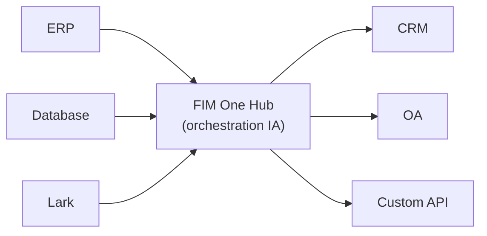

<Frame>
  
</Frame>

Bienvenue dans FIM One, un framework alimenté par l'IA pour construire des agents qui planifient et exécutent dynamiquement des tâches complexes dans vos systèmes d'entreprise.

  <a href="https://one.fim.ai/">Site Web</a> · <a href="https://github.com/fim-ai/fim-one">GitHub</a> · <a href="https://discord.gg/z64czxdC7z">Discord</a> · <a href="https://x.com/FIM_One">Twitter</a>

<Tip>
  **☁️ Essayez FIM One sur le Cloud — aucune configuration requise.**
  Une version gérée est disponible à [**cloud.fim.ai**](https://cloud.fim.ai/) : pas de Docker, pas de clés API, connectez-vous simplement et commencez à connecter vos systèmes. _Accès anticipé — les retours sont les bienvenus._
</Tip>

## Qu'est-ce que FIM One ?

FIM One est un framework Python agnostique des fournisseurs pour construire des agents IA qui fonctionnent avec vos systèmes existants. Contrairement aux générateurs de flux de travail qui vous demandent de répliquer la logique, FIM One relie vos systèmes de manière proactive — en lisant les bases de données, en appelant les API, en envoyant des notifications — tout cela via une interface IA unifiée.

L'idée centrale : **trois modes de livraison, un cœur d'agent unique**.

## Trois modes de livraison

| Mode | Qu'est-ce que c'est | Livraison | Cas d'usage |
|------|-----------|----------|----------|
| **Autonome** | Assistant IA polyvalent — recherche, code, base de connaissances | Portail | Chat, exécution de code, Q&A base de connaissances |
| **Copilote** | IA intégrée dans un système hôte — fonctionne aux côtés des utilisateurs dans leur interface existante | iframe / widget / embed | "Copilote Finance" dans votre interface web ERP |
| **Hub** | Orchestration centrale inter-systèmes — tous vos systèmes connectés | Portail / API | L'agent interroge l'ERP, vérifie l'OA, notifie via Lark |

## Architecture du Hub

Le Hub est le différenciateur central — un portail central où tous vos systèmes rencontrent l'IA :

Chaque connecteur est un pont standardisé. L'agent ne sait pas et ne se soucie pas de savoir s'il communique avec SAP ou une base de données PostgreSQL personnalisée. Vos données restent dans vos systèmes ; FIM One fournit la couche IA qui orchestre l'ensemble.

## Commencer

Explorez les sections suivantes pour comprendre l'architecture de FIM One et le déployer :

- **[Démarrage rapide](/quickstart)** — Lancez FIM One en quelques minutes avec Docker ou le développement local
- **[Modes d'exécution](/concepts/execution-modes)** — Comprenez en profondeur les modes Standalone, Copilot et Hub
- **[Générateur IA](/concepts/ai-builder)** — Utilisez l'IA pour construire des connecteurs et des agents avec le langage naturel
- **[Architecture des connecteurs](/architecture/connector-architecture)** — Comment FIM One connecte les systèmes hérités via l'IA
- **[Philosophie](/architecture/philosophy)** — Pourquoi la planification dynamique est le juste équilibre entre les flux de travail rigides et les agents entièrement autonomes
