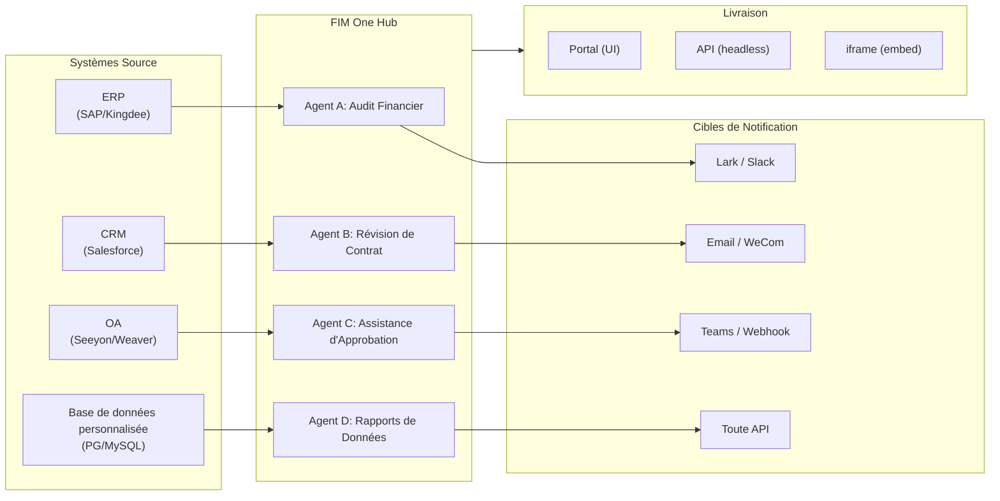

> Objectif : Construire un **Hub de connecteurs alimenté par l'IA** — Autonome (assistant de portail), Copilote (intégré au système hôte), Hub (orchestration centrale inter-systèmes).
>
> Principes : **Agnostique des fournisseurs** (pas de verrouillage des fournisseurs), **abstraction minimale**, **protocole en premier**, **connecteur en premier** (l'intégration est la valeur fondamentale).

## Vision du Produit

FIM One est un **Hub de Connecteurs IA** qui propose trois modes progressifs :

```
Standalone   → Votre propre assistant IA (Portal)
Copilot      → IA intégrée dans un système hôte (iframe / widget / embed)
Hub          → Orchestration centrale inter-systèmes (Portal / API)
```

**Le mode Hub est le différenciateur clé.** Les clients entreprise disposent de systèmes hérités — ERP, CRM, OA, finance, HR — qui doivent communiquer entre eux via l'IA :



**Stratégie GTM : Land and Expand**

| Étape | Mode | Ce qui se passe |
|------|------|-------------|
| Land | Copilot | Intégrer dans un système, prouver la valeur dans leur interface utilisateur |
| Expand | Copilot → Hub | Déployer sur plus de systèmes ; Hub les agrège |

## Versions Livrées

### v0.1 (2026-02-22) — MVP: ReAct + DAG Planner
- ReActAgent avec outils (calculatrice, python_exec, web_search)
- DAG Planner (LLM génère des graphes de dépendances)
- Portal UI avec streaming + KaTeX

### v0.2 (2026-02-24) — Multi-Model + Memory
- Retry / rate limiting / usage tracking
- Native function calling (no JSON-only parsing)
- Multi-model support (fast + main LLM)
- Memory: WindowMemory, SummaryMemory
- FastAPI backend with SSE streaming

### v0.3 (2026-02-25) — Web Tools + MCP
- Web tools (web_search, web_fetch) via Jina/Tavily/Brave
- File operations tool
- MCP client (standard tool integration)
- Tool auto-discovery + categories
- DAG visualization with click-to-scroll
- Code exec in Docker (`--network=none`)

### v0.4 (2026-02-25) — Conversations multi-tours + Agents
- Conversations multi-tours (DbMemory)
- Interface de repliement des étapes d'outils
- Outils de requête HTTP + exécution shell
- Gestion des agents (créer, configurer, publier)
- Authentification JWT
- Mode d'exécution par agent + contrôle de température

### v0.5 (2026-02-28) — Full RAG + Grounded Gen
- Pipeline RAG complet (embedding + vector store + FTS + RRF + reranker)
- Génération ancrée (citations, scores de confiance)
- Gestion des documents de la base de connaissances (CRUD, recherche, retry, migration de schéma)
- ContextGuard + messages épinglés (gestionnaire de budget de tokens)
- Persistance DbMemory + LLM Compact
- DAG Re-Planning (jusqu'à 3 rounds)

### v0.6 (2026-03-01) — Plateforme de connecteurs
- **CRUD de connecteur**: créer, lire, mettre à jour, supprimer
- **ConnectorToolAdapter**: convertit Connecteur → BaseTool
- **Identifiants par utilisateur**: chiffrement AES-GCM
- **Portail de confirmation**: approbation des opérations d'écriture
- **Journalisation d'audit**: tous les appels d'outils enregistrés
- **Disjoncteur**: dégradation progressive en cas de défaillance
- **Outils utilitaires**: email_send, json_transform, template_render, text_utils
- **Options d'intégration**: Jina, OpenAI, fournisseurs personnalisés

### v0.7 (2026-03-06) — Plateforme d'administration + Multi-locataire
- **Plateforme d'administration** : gestion des utilisateurs, basculement des rôles, réinitialisation de mot de passe, activation/désactivation de compte
- **Inscription sur invitation uniquement** : trois modes (ouvert/invitation/désactivé) + CRUD de code d'invitation
- **Gestion du stockage** : utilisation disque par utilisateur, effacement, nettoyage des orphelins
- **Modération des conversations** : liste d'administration/suppression de tous
- **Déconnexion forcée par utilisateur** : révocation de tous les jetons
- **Tableau de bord de santé API** : statistiques système, métriques des connecteurs
- **Assistant de configuration initiale** : création guidée du compte administrateur
- **Centre personnel** : instructions globales par utilisateur, préférence de langue
- **Authentification JWT** : authentification SSE basée sur jetons, propriété de conversation
- **Serveurs MCP globaux** : provisionnés par l'administrateur, chargés dans toutes les sessions
- **Compatibilité rétroactive** : migration automatique registration_enabled → registration_mode

### v0.7.x (2026-03-07 to 2026-03-12) — Stabilité + Polissage
- Gestion des codes d'invitation
- Quotas par utilisateur (application 429)
- Journalisation d'audit structurée
- Filtrage des mots sensibles
- Historique de connexion administrateur
- Navigateur de fichiers administrateur
- Vues administrateur améliorées (champs model_name, tools, kb_ids)
- Déploiement Docker Compose (image unique, volumes nommés)
- Détection automatique OAuth depuis window.location
- Support de la réflexion étendue / raisonnement (`LLM_REASONING_EFFORT`, `LLM_REASONING_BUDGET_TOKENS`) pour OpenAI série o, Gemini 2.5+, Claude
- Activation/désactivation par outil administrateur (outils désactivés exclus du chat à l'exécution)
- Gestion des serveurs MCP déplacée vers la page Connecteurs
- Support de base de données double : SQLite (par défaut sans configuration) + PostgreSQL (production) ; Docker Compose provisionne automatiquement PostgreSQL
- Page de documentation de configuration des modèles avec configuration de la réflexion étendue par fournisseur
- Protocole SSE v2 : diffusion de réponses en temps réel avec champs `delta_reasoning`, `usage`, et événements `done`/`suggestions`/`title`/`end` séparés ; taille du pool SQLite 5 -> 20
- Expansion AI Builder : 7 nouveaux outils de construction (GetSettings, TestConnection, ImportOpenAPI pour connecteurs ; ListConnectors, AddConnector, RemoveConnector, SetModel pour agents), drapeau `is_builder` sur les agents, actualisation automatique du prompt du constructeur, protection SSRF
- Frontend SSE v2 : curseur à point pulsant en continu, snapshots de re-plan DAG sous forme de cartes réductibles, mise en page DAG découplée des états d'étape
- Page de documentation du concept AI Builder avec guides de construction de connecteurs et d'agents
- Système d'organisation : CRUD complet avec adhésion basée sur les rôles (propriétaire/administrateur/membre), interface de gestion administrateur
- Visibilité des ressources à trois niveaux (personnel/org/global) pour les agents, connecteurs, bases de connaissances, serveurs MCP
- API Publier/Dépublier pour tous les types de ressources ; délégation de propriétaire pour les agents publiés
- Point de terminaison administrateur set-visibility (remplace clone-to-global) ; assistant de requête `build_visibility_filter()` unifié
- Connecteurs de base de données (Phase 1-3) : accès SQL direct à PG/MySQL/Oracle/SQL Server + BD héritées chinoises ; introspection de schéma, annotation IA, exécution de requête en lecture seule, identifiants chiffrés, 3 outils par connecteur (`list_tables`, `describe_table`, `query`)
- **Centre d'évaluation** : évaluation quantitative de la qualité des agents — CRUD d'ensemble de test (prompt + comportement attendu + assertions), exécutions d'éval (exécution parallèle + évaluateur LLM + résultats par cas réussi/échoué/latence/jeton), visionneuse de résultats avec interrogation automatique ; migration `r8t0v2x4z567`
- Trois rôles de modèle (Général/Rapide/Raisonnement) avec isolation de configuration env par niveau ; le modèle rapide n'hérite plus des paramètres du modèle principal
- Classe de données `StepOutput` remplaçant les résultats d'étape en chaîne simple pour les données structurées et la transmission d'artefacts
- Cache d'outil pour l'exécution DAG — appels d'outil identiques mis en cache par exécution avec prévention du verrouillage asynchrone stampede (`DAG_TOOL_CACHE`)
- Vérification LLM par étape avec 1 nouvelle tentative en cas d'échec (`DAG_STEP_VERIFICATION`)
- Routage automatique : LLM rapide classe les requêtes comme ReAct ou DAG ; point de terminaison `/api/auto` ; basculement de mode 3 voies frontend (`AUTO_ROUTING`)
- [x] ~~**Organisation du marché fantôme + Abonnements aux ressources**~~ : Organisation du marché intégré (fantôme, pas d'adhésion automatique) remplace l'organisation de plateforme ; ressources découvertes via navigation sur le marché et explicitement souscrites (modèle pull) ; API de marché pour s'abonner aux ressources partagées ; la publication sur le marché nécessite toujours un examen ; tableau des abonnements aux ressources ; partage de ressources basé sur l'organisation remplaçant la visibilité globale
- [x] ~~**Découverte automatique d'agent et liaison de sous-agent**~~ : drapeau `discoverable` sur les agents ; liste blanche `sub_agent_ids` ; CallAgentTool pour déléguer des tâches à des agents spécialisés
- [x] ~~**Identifiants du serveur MCP + Remplacement par utilisateur**~~ : tableau `mcp_server_credentials` ; point de terminaison `PUT /api/mcp-servers/{id}/my-credentials` ; drapeau `allow_fallback` pour le comportement de secours des identifiants
- [x] ~~**Basculement connecteur/KB**~~ : `POST /api/connectors/{id}/toggle` et `POST /api/knowledge-bases/{id}/toggle` pour suspendre/reprendre les ressources
- [x] ~~**Conversations KB autonomes**~~ : champ `kb_ids` sur les conversations pour le chat KB direct sans liaison d'agent

### v0.8 (2026-03-20) — Configuration déclarative des connecteurs + Divulgation progressive
- [x] **Connecteurs de base de données**: accès SQL direct (PostgreSQL, MySQL, Oracle) *(livré en v0.7.x — Phase 1-3)*
- [x] **RBAC**: contrôle d'accès aux connecteurs par utilisateur/rôle *(livré en v0.7.x — système org + visibilité à trois niveaux)*
- [x] **Chiffrement des identifiants de connecteur + remplacement par utilisateur**: table `connector_credentials`, chiffrement Fernet via `CREDENTIAL_ENCRYPTION_KEY`, drapeau `allow_fallback`, points de terminaison `GET/PUT/DELETE /my-credentials`, résolution des identifiants par utilisateur dans le chargement des outils de chat
- [x] **Interface d'examen de publication**: système d'examen de publication au niveau de l'organisation — basculement d'examen par organisation, ReviewsSheet avec flux d'approbation/rejet, badges de statut sur les cartes de ressources, avis d'examen dans la boîte de dialogue de publication, renvoi pour les ressources rejetées
- [x] **Divulgation progressive des connecteurs (Phase 1-2)**: un seul `ConnectorMetaTool` remplace les outils par action; le message système reçoit uniquement des **stubs** légers (nom + description d'une ligne, ~30 tokens/connecteur vs ~250 tokens/action); l'agent appelle `discover(connector)` pour charger le schéma d'action complet à la demande — le schéma ne se charge que lorsque le modèle sélectionne un connecteur, maintenant le préfixe du message stable pour la mise en cache. Suit le modèle de chargement d'outils différé courant dans les frameworks d'agents modernes. Sous-commande `execute`; drapeau de fonctionnalité pour la compatibilité rétroactive.
- [x] **Système de compétences d'agent + Instructions compactes**: Chargement à la demande des instructions de compétences pour les agents — modèle `Skill` (nom, contenu/SOP, scripts optionnels) attaché aux agents; référencé dans le message système par nom uniquement (~10 tokens/compétence); l'agent appelle `read_skill(name)` pour charger le contenu complet à la demande. Réduit le coût des tokens d'instruction par conversation d'environ 80% tout en permettant des bibliothèques SOP plus riches. Homologue de la divulgation progressive de ConnectorMetaTool appliquée au niveau des instructions. Active la différenciation de l'histoire "指令 + 工具 + 技能". Ajoute également le champ `compact_instructions` au modèle Agent — liste de priorités de compression par agent injectée dans `ContextGuard` lors de la compression (par exemple, "préserver les ID de commande et les montants, supprimer les réponses API brutes"), remplaçant l'invite générique statique actuelle. Suit la convention des instructions compactes largement adoptée dans les frameworks d'agents modernes.
- [x] **Import/export de connecteurs**: partage de modèles de connecteurs
- [x] **Fork de connecteur**: cloner et personnaliser les connecteurs existants
- [x] **Nœuds de phase 2 du flux de travail**: Iterator, Loop, VariableAggregator, ParameterExtractor, ListOperation, Transform, DocumentExtractor, QuestionUnderstanding, HumanIntervention — 9 types de nœuds avancés avec frontend + backend complets + 150 nouveaux tests (275 au total). Nouvelle tentative de nœud avec backoff exponentiel, évaluation d'expression sécurisée. Panneau de statistiques avec barre de taux de réussite. 12 modèles intégrés. Menu contextuel du volet (Coller, Sélectionner tout, Ajuster la vue, Disposition automatique).
- [x] **Nœuds de phase 3 du flux de travail: SubWorkflow + ENV** — 2 nouveaux types de nœuds (25 nœuds au total), 14 nouveaux tests (306 au total), 14 modèles intégrés. SubWorkflow: exécuteur de flux de travail imbriqué complet avec support de base de données, sélection de flux de travail cible, mappage de variables et limite de profondeur configurable pour éviter la récursion infinie. ENV: lit les variables d'environnement chiffrées avec sélecteur de clé et valeurs par défaut de secours. Frontend complet (composants de nœud, panneaux de configuration, entrées de palette, couleurs de minimap). Panneau de statistiques d'exécution par nœud (taux de réussite, durées, comptages d'échecs triés du pire au premier). Client API `getNodeStats` + type `NodeStatEntry`. Boîte de dialogue des raccourcis clavier (touche `?`).
- [x] **Déclencheurs planifiés du flux de travail**: Configuration cron par flux de travail avec fuseau horaire, entrées par défaut et calcul de la prochaine exécution. Boutons cron prédéfinis, 30 tests de déclenchement.
- [x] **Déclencheurs API du flux de travail**: Clés API publiques par flux de travail (préfixe `wf_`) pour l'exécution externe sans authentification utilisateur, avec limitation de débit. Boîte de dialogue de gestion des clés API avec génération/régénération/révocation, URL de déclenchement et exemples cURL/JS.
- [x] **Exécution par lot du flux de travail**: `POST /batch-run` avec jusqu'à 100 ensembles d'entrée, parallélisme configurable (1-10), résultats par élément réductibles, export JSON. 14 tests d'exécution par lot.
- [x] **Visionneuse du journal d'exécution du flux de travail**: Flux d'événements SSE chronologique en temps réel dans le panneau d'exécution avec horodatages, badges codés par couleur et bascules de filtre par type d'événement.
- [x] **Statistiques d'exécution du flux de travail**: Le backend récupère par lot les comptages d'exécution et les taux de réussite via la sous-requête GROUP BY; le frontend affiche les statistiques sur les cartes de flux de travail avec des indicateurs de taux de réussite codés par couleur.
- [x] **Démon du planificateur de flux de travail**: Service asynchrone en arrière-plan interrogeant tous les 60 secondes les flux de travail basés sur cron dus. Support du fuseau horaire Croniter, concurrence par sémaphore, suivi de `last_scheduled_at`, livraison de webhook. 14 tests.
- [x] **Résolveur de conflits d'import de flux de travail**: Détecte les références d'agent/connecteur/KB/MCP non résolues lors de l'import. Requêtes DB par lot avec filtrage de visibilité, avertissements toast frontend. 17 tests.
- [x] **Exécution de nœud de test du flux de travail**: Test isolé de nœud unique avec variables fictives, intégré dans l'éditeur (bouton Test du panneau de configuration + menu contextuel). 23 tests.
- [x] **Diff de version du flux de travail**: Comparaison de blueprint côte à côte avec détection de changement de nœud/arête, indicateurs codés par couleur (ajouté/supprimé/modifié).
- [x] **Gestion des exécutions du flux de travail**: Supprimer les exécutions individuelles (`DELETE /runs/{run_id}`) et effacer toutes les exécutions terminées (`DELETE /runs`), avec boîtes de dialogue de confirmation frontend.
- [x] **Superposition de relecture d'exécution du flux de travail**: Bouton "Afficher sur le canevas" dans l'historique d'exécution pour superposer les résultats d'exécution passés sur le canevas, affichant le statut et la sortie par nœud sans réexécution.
- [x] **Favoris/épinglage du flux de travail**: Étoile/épingle des flux de travail en haut de la liste avec persistance localStorage.
- [x] **Export de l'historique d'exécution du flux de travail**: Exporter l'historique d'exécution en tant que téléchargement de fichier JSON avec métadonnées d'exécution complètes et résultats par nœud.
- [x] **Gestion des flux de travail administrateur**: Onglet du panneau administrateur pour gérer tous les flux de travail entre les utilisateurs — lister, basculer actif/inactif, supprimer avec confirmation. Points de terminaison par lot pour supprimer, basculer et publier avec journalisation d'audit.
- [x] **Système de modèles de flux de travail**: Modèle ORM `WorkflowTemplate` avec CRUD administrateur, API de listing/clone public et 5 modèles de semences insérés automatiquement au premier démarrage.
- [x] **Badges de validation en ligne du flux de travail**: `ValidationBadge` en temps réel par nœud sur le canevas avec info-bulles d'erreur/avertissement pour un retour visuel immédiat lors de l'édition.
- [x] **Visionneuse de trace d'exécution du flux de travail**: Visionneuse de trace basée sur la chronologie avec paramètre `trace_level` du moteur et snapshots de variables par nœud pour le débogage pas à pas.
- [x] **Limitation de débit et délai d'expiration du flux de travail**: `WorkflowRateLimiter` par utilisateur (fenêtre glissante 10 exécutions/min, 3 concurrentes) et délai d'expiration global par défaut de 10 minutes.
- [x] **Système de blueprint de flux de travail**: Éditeur de flux de travail visuel pour concevoir et exécuter des blueprints d'automatisation multi-étapes — modèles ORM `Workflow` / `WorkflowRun`, CRUD complet + API d'exécution SSE, import/export, duplication, point de terminaison de validation de blueprint, `WorkflowEngine` avec tri topologique + concurrence basée sur sémaphore + branchement conditionnel et 12 types de nœuds (Start, End, LLM, ConditionBranch, QuestionClassifier, Agent, KnowledgeRetrieval, Connector, HTTPRequest, VariableAssign, TemplateTransform, CodeExecution), `VariableStore` avec interpolation `{{node_id.output}}` et espace de noms `env.*`, stratégies d'erreur par nœud (STOP_WORKFLOW / CONTINUE / FAIL_BRANCH) avec délai d'expiration par nœud et interface de configuration avancée, éditeur visuel React Flow v12 avec palette glisser-déposer + panneau de configuration de nœud + combobox de sélecteur de variable + ajouter-nœud-sur-arête + disposition automatique (ELK.js) + feuille d'historique d'exécution, conception de nœud compact de style Dify avec statut d'exécution basé sur anneau et transitions d'arête animées, 4 modèles de démarrage intégrés (Chaîne LLM simple, Routeur conditionnel, QA augmenté par connaissance, Pipeline API HTTP) avec boîte de dialogue de sélecteur de modèle et API `GET /templates` + `POST /from-template`, point de terminaison de statistiques, paramètre URL `?run=true` ouverture automatique, exécution de code basée sur subprocess pour la sécurité, suite de tests 105 (modèles, aplatissement d'espace de noms eval, avertissements de validation de blueprint, suppression de nœud/arête, import/export/duplication, détection d'impasse, branchement multi-condition)
- [x] **Audit opérationnel**: journalisation détaillée de qui a fait quoi — onglet d'examen du journal d'audit administrateur ajouté (piste d'examen de publication par organisation/ressource)
- [x] **Annotations de schéma sémantique**: étendre les champs de schéma de connecteur avec `semantic_tag`, `description` et drapeaux `pii`; annotations affichées dans les descriptions d'outils LLM afin que l'agent comprenne l'intention du champ sans deviner à partir des noms de colonnes

### v0.8.1 (2026-03-29) — Divulgation Progressive de la Maturité + Durcissement ReAct
- Divulgation progressive pour les connecteurs de base de données (`DatabaseMetaTool`), les serveurs MCP (`MCPServerMetaTool`), et le chargement d'outils à la demande (`request_tools` meta-tool)
- Révision de la qualité du DAG (5 améliorations : mise à niveau du modèle, découverte automatique des compétences, vérificateur de citations, préservation du contenu structuré, routage conscient du domaine)
- Escalade du modèle de domaine dans ReAct (les domaines spécialisés s'escaladent automatiquement vers le modèle de raisonnement)
- Basculement d'appel de fonction native par modèle (`tool_choice_enabled`)
- Détection de cycle ReAct (prévention déterministe des appels d'outils en double)
- Liste de contrôle d'achèvement ReAct (vérification pré-réponse lorsque des outils ont été utilisés)
- Phase 1 de la fourche de ressources (points de terminaison de fourche du serveur MCP + compétence avec suivi de la lignée)
- Abonnement automatique des dépendances de connexion de flux de travail (résolution récursive des dépendances de sous-flux de travail)
- Modèles de solutions préconstruites (8 solutions verticales ensemencées au Marché lors de la première inscription)
- Améliorations des notifications d'administration (conscientes du fuseau horaire, commutateur maître, Réponse SMTP)
- Disjoncteur de budget de jetons par tour (`REACT_MAX_TURN_TOKENS`)
- Troncature d'outils centralisée, budgétisation dynamique des invites système
- Téléchargement de pièces jointes, correction de la soumission de messages en double

### v0.8.2 (2026-04-10) — Durcissement du noyau d'agent + Documents avec vision
- **Phase 0 du noyau d'agent** — Prompt compact amélioré au format structuré en 9 sections ; protection des résultats d'outils vides (message descriptif au lieu de `(no output)`) ; prompt anti-boucle + seuil de détection de cycle abaissé à 2 ; classificateur de domaine + résolution de configuration DB en vol parallélisée (400–1100 ms économisés par requête) ; événement SSE `end` envoyé immédiatement après la réponse, avec titre/suggestions déplacés aux tâches en arrière-plan
- **Phase 1 du noyau d'agent (Anti-encombrement du contexte)** — Nettoyage basé sur règles `MicroCompact` des anciens résultats d'outils (conservation des 6 derniers) ; plafond agrégé `REACT_TOOL_RESULT_BUDGET=40000` ; compactage réactif au débordement de contexte (auto-compactage à 50% du budget et nouvelle tentative au lieu de crash)
- **Phase 2 du noyau d'agent (Vitesse)** — Présélection d'outils basée sur mots-clés (ignore l'appel LLM sur les correspondances évidentes, 200–500 ms économisés) ; mise en pool de connexions LLM `SharedHttpClient` ; vérification d'achèvement ignorée pour les réponses >200 tokens ; `FallbackLLM` enveloppe le primaire+rapide avec basculement automatique sur erreurs 429/503/529/connexion
- **Traitement intelligent des documents (Vision-Aware)** — Gestion adaptative des documents : pages PDF rendues en images via PyMuPDF pour les modèles compatibles vision (GPT-4o, Claude 3/4, Gemini), secours texte uniquement via pdfplumber. Drapeau `supports_vision` par modèle. Modes via `DOCUMENT_PROCESSING_MODE`, `DOCUMENT_VISION_DPI`, `DOCUMENT_VISION_MAX_PAGES`. Extraction d'images intégrées DOCX/PPTX. Persistance vision multi-tours entre les tours de conversation. Traitement PDF intelligent (pages riches en texte extraient texte + images ; pages numérisées rendues en PNG pleine page). Image sandbox pré-construite (`Dockerfile.sandbox`) avec packages data-science courants pour exécution de code `--network=none`
- **Achèvement de la fourche de ressources** — Points de terminaison de fourche Agent / Connecteur / Workflow ajoutés, complétant le suivi de lignée de cinq types (fourche KB supprimée — intrinsèquement locale à l'utilisateur)
- **Garde-fou d'intégrité de fichier** — Règle du prompt système empêche l'agent de substituer des contenus de fichiers non liés lorsqu'un fichier cible est illisible ; les fichiers téléchargés incluent désormais `file_id` dans le contexte du message pour accès direct `read_uploaded_file`

### v0.8.3 (2026-04-16) — Conversion universelle de documents + Phase 3 du cœur de l'agent
- **Conversion universelle de documents (`convert_to_markdown` + OCR)** — Outil d'agent intégré enveloppant Microsoft MarkItDown ; convertit PDF, Word, Excel, PowerPoint, HTML, JSON, CSV, XML, ZIP, EPUB, Outlook .msg, images, audio, URLs YouTube en Markdown. `LiteLLMOpenAIShim` active l'OCR via n'importe quel LLM capable de vision (Claude, Gemini, Bedrock, Azure). Ingestion RAG sensible à la vision avec repli sans régression pour texte uniquement. Variable d'environnement `LLM_SUPPORTS_VISION` pour refuser
- **Phase 3 du cœur de l'agent (Durcissement des invariants d'exécution)** — Récupération de conversation (réparation automatique de `tool_use` en suspens) ; carte de travail compacte structurée (`WorkCard` fusion typée sur les tours de compaction) ; profileur au niveau des tours (`REACT_TURN_PROFILE_ENABLED`) ; limitation de débit par utilisateur (`LLM_RATE_LIMIT_PER_USER`) ; message d'assistant avec contenu vide et `tool_calls` ne sont plus supprimés

### v0.8.4 (2026-04-17) — Cache de prompts + Correction du raisonnement
- **Registre de section de prompts système avec points d'arrêt de cache** — `PromptRegistry` mémoïsée divise les prompts système en préfixe stable + suffixe dynamique ; les fournisseurs compatibles avec le cache (Claude, Bedrock Anthropic, Vertex Claude) reçoivent `cache_control: {"type": "ephemeral"}` sur le préfixe pour ~60-80% d'économies de tokens d'entrée par tour. Les fournisseurs sans cache reçoivent un seul message concaténé (zéro changement de comportement)
- **Observabilité du cache de prompts** — `cache_read_input_tokens` et `cache_creation_input_tokens` suivis via `UsageSummary` → `TurnProfiler` → champ `done_payload.cache`. Ligne de journal `turn_cache` structurée par tour. Sert également de sonde de vérification d'honnêteté du cache relais
- **MVP de récupération de conversation** — Les lignes `tool_result` synthétiques persistent après les tours interrompus ; `POST /chat/resume` rejoue les événements SSE en cache à partir d'un curseur monotone ; hook frontend `useSseResume` se reconnecte automatiquement avec backoff exponentiel (300ms → 1s → 3s, max 3 tentatives) et indicateur « Reconnexion en cours… »
- **Persistance des blocs de raisonnement avec signature** — `reasoning_content` + `signature` Anthropic persistés dans `metadata_["thinking"]` et rejoués aux tours suivants ; corrige l'erreur HTTP 400 de non-concordance de signature sur les conversations multi-tours Claude 4
- **Politique de relecture du raisonnement consciente du fournisseur** — `reasoning_replay_policy()` centralisée dans `core/prompt/reasoning.py` contrôle la sérialisation par famille de fournisseur : Claude rejoue les blocs de raisonnement avec signature ; DeepSeek-R1/Qwen-QwQ/Gemini-thinking/o-series suppriment `reasoning_content` en sortie (précédemment fui, cassant les caches KV des fournisseurs et violant la documentation API)

## Versions Planifiées

### v0.9 — Observabilité + Durcissement de la production

**Objectif** : Opérations de qualité production, débogage et surveillance. Introduit le **Système de Hook** — une couche d'application déterministe qui se situe sous les instructions de l'agent et ne peut pas être contournée par le LLM.

- [ ] **Divulgation progressive des connecteurs (Phase 3-4)** : interface `ConnectorExecutor` unifiée (API/DB/MCP derrière une abstraction unique) ; validation des paramètres d'action avec `jsonschema` ; découverte/exécution agnostique du protocole
- [ ] **Configuration des connecteurs YAML/JSON** : génération automatique du serveur MCP par la plateforme
- [ ] **Connecteurs de base de données Phase 4** : pilotes d'entreprise — Oracle (`oracledb`), SQL Server (`aioodbc`), [x] 达梦 DM8 (natif `dmPython`), [x] 人大金仓 KingbaseES + 瀚高 HighGo (compatible PG, réutiliser `asyncpg`), 南大通用 GBase (`aioodbc` + GBase ODBC)
- [ ] **Intégration des canaux IM (bidirectionnelle)** : **Phase 1 — Push sortant** : actions de notification Lark, WeCom, Slack, Email, Teams à partir des résultats de l'Agent/Workflow. **Phase 2 — Déclenchement entrant** : les utilisateurs @mentionnent l'Agent dans les chats de groupe IM pour déclencher des tâches sans ouvrir le Portal ; récepteur webhook par canal ; chaque canal IM modélisé comme un connecteur avec actions bidirectionnelles (envoi + réception). Fonctionnalité clé du mode Hub
  - [x] **Canal Feishu (sous-ensemble Phase 1)** — Ressource `Channel` à portée organisationnelle avec identifiants chiffrés Fernet ; implémentation `FeishuChannel` supportant l'envoi de cartes interactives + rappel (vérification de signature + défi URL) ; s'intègre à la porte de confirmation pour que les approbations d'opérations d'écriture arrivent sous forme de cartes Approve/Reject dans le chat de groupe Feishu configuré ; UI de gestion des canaux Paramètres. Livré en avance pour la feuille de route du 2026-04-24. Restant : WeCom, Slack, Email, Teams sortant + déclencheurs entrants Phase 2.
  - [ ] **Modèles de notification sortants (génériques, réutilisables sur les types de canaux)** : L'abstraction `BaseChannel` identique supporte un catalogue de cas d'usage sortants au-delà de la porte d'approbation. Chaque modèle est implémenté une fois par rapport à `BaseChannel` et fonctionne automatiquement pour chaque canal concret (Feishu aujourd'hui ; Slack/WeCom/Teams/Email à mesure qu'ils arrivent).
    - [ ] **Notification d'achèvement de tâche** : quand un DAG/Workflow/agent planifié de longue durée se termine, publier une carte récapitulative sur le canal organisationnel (ou un canal choisi par l'utilisateur) avec extrait de résultat + liens d'artefacts. Le produit minimum viable « Canal sortant » — premier consommateur après `FeishuGateHook`
    - [ ] **Alertes d'exception/défaillance** : l'inférence de l'agent échoue, un fournisseur LLM génère une erreur, un connecteur lève une 5xx, un DAG épuise le budget de re-planification → pousser une carte de diagnostic vers le canal ops avec ID de trace et possibilité de réessai
    - [ ] **Avertissements de coût/budget** : le budget token/requête par utilisateur ou par agent atteint les seuils 80% / 100% → pousser vers le canal admin (ou @-mentionner le propriétaire de l'agent) avec utilisation actuelle vs. limite
    - [ ] **Digests planifiés** : les agents ou workflows émettent des cartes récapitulatives périodiques (quotidiennes/hebdomadaires) — cumul KPI, triage des tickets ouverts, liste de renouvellement de contrats — directement dans le canal sans obliger les utilisateurs à ouvrir le Portal
    - [ ] **Escalade sur agent bloqué** : l'agent n'a fait aucun progrès observable pendant N itérations consécutives (cycle détecté, ou `max_iterations` dépassé) → publier une carte demandant à un opérateur humain de prendre le relais, avec contexte actuel et action « reprendre avec votre note »
    - [ ] **Reçus d'audit pour les appels d'outils sensibles** : indépendamment de la porte d'approbation — chaque appel à un outil marqué `audit=true` émet une carte de reçu en lecture seule vers le canal de conformité (qui/quoi/quand/args), fournissant une piste d'audit durable en dehors de la base de données
    - [ ] **Escalade d'approbation** : si une carte d'approbation `feishu_gate` ne reçoit pas de réponse dans N minutes, @-mentionner automatiquement le propriétaire du groupe ou transférer la carte vers un canal de niveau supérieur ; configurable par outil/connecteur

#### API Public (Phase 2)

Phase 1 (déployée) : middleware d'authentification par clé API, support des portées, spécification OpenAPI curée, référence API Mintlify avec terrain de jeu interactif.

- [ ] **Limitation de débit par clé** — Limites configurables de requêtes/minute et requêtes/jour par clé API ; réponses `429 Too Many Requests` avec en-têtes `X-RateLimit-*`
- [ ] **Quota d'utilisation par clé** — Budgets mensuels de jetons/requêtes avec tableau de bord administrateur et alertes de seuil
- [ ] **Application des portées par endpoint** — Dépendance `require_scope("chat")` sur tous les endpoints protégés ; les clés avec `scopes=chat` ne peuvent accéder qu'aux APIs liées au chat
- [ ] **Versioning d'API** (`/v1/...`) — Contrat d'API versionné stable ; en-têtes de dépréciation pour les endpoints supprimés
- [ ] **Callbacks webhook** — Enregistrer les URLs webhook par clé API ; recevoir des notifications POST pour la fin de conversation, les erreurs d'agent et les résultats de tâches asynchrones
- [ ] **Génération de SDK** — SDKs clients Python et TypeScript générés automatiquement à partir de la spécification OpenAPI ; publiés sur PyPI et npm
- [ ] **Portail développeur** — Panneaux interactifs « Essayer » dans la documentation Mintlify ; analyses d'utilisation visibles aux propriétaires de clés
- [ ] **Rotation de clé API** — Rotation de clé en un clic avec période de grâce (ancienne clé valide pendant 24h après rotation)
- [ ] **API batch / asynchrone** — `POST /api/batch` acceptant jusqu'à 100 requêtes ; retourne un `batch_id` pour interroger les résultats ; utile pour les requêtes KB en masse ou l'orchestration multi-agent
- [ ] **Disjoncteur par dépendance externe** — Prévenir les défaillances en cascade quand les fournisseurs LLM en aval ou les connecteurs ne sont pas disponibles ; basculement automatique et récupération

#### Observabilité et Runtime d'Agent

- [ ] **Agent Trace Layer (Observabilité++)**: Hiérarchie run/trace/thread au niveau application pour le débogage d'agent — chaque conversation → `Trace`, chaque appel LLM / appel outil / étape DAG → `Span` avec input/output/tokens/timing. Visionneuse de trace frontend avec timeline et payloads d'appel LLM dépliables. Cela va au-delà d'OTel (niveau infrastructure) pour fournir un débogage de boucle d'agent actif pour les développeurs et clients enterprise. Export OpenTelemetry comme option de récepteur de données. Modélisé d'après les concepts run/trace/thread de LangSmith — le modèle validé par l'industrie pour l'observabilité d'agent.
- [ ] **Tableau de bord des métriques**: latence, taux de succès, utilisation des tokens, analytique d'appels de connecteur — par agent, par utilisateur, par org
- [x] ~~**Disjoncteur**: machine à trois états (closed/open/half-open) avec suivi des défaillances par connecteur, détection 5xx et endpoints de monitoring~~ *(livré en avance — implémenté en v0.8)*
- [x] ~~**Nettoyage de rétention des exécutions de workflow**: tâche de nettoyage en arrière-plan avec âge max et nombre max configurables par workflow; surcharges par workflow; endpoint admin pour déclenchement manuel~~ *(livré en v0.8.1)*
- [x] ~~**Résumés de changement de version de workflow**: `compute_blueprint_diff()` génère automatiquement des résumés lisibles par l'homme à partir des diffs de blueprint lors de la sauvegarde de version~~ *(livré en v0.8.1)*
- [x] ~~**Refonte de qualité DAG**: mise à niveau du modèle par défaut pour les étapes non-fast; auto-découverte de compétences en planification; vérificateur de citation pour les domaines juridique/médical/financier; préservation du contexte de contenu structuré; classification de domaine dans le routeur avec sélection de modèle consciente du domaine~~ *(livré en v0.8.1)*
- [x] ~~**Escalade de modèle de domaine en ReAct**: les domaines spécialisés s'escaladent automatiquement vers le modèle de raisonnement avec recherche web obligatoire et vérification de citation~~ *(livré en v0.8.1)*
- [x] ~~**Basculement Native Function Calling par modèle**: le paramètre `tool_choice_enabled` permet aux modèles de sauter la sélection d'outil forcée et d'aller directement au JSON Mode~~ *(livré en v0.8.1)*
- [x] ~~**DatabaseMetaTool (Progressive Disclosure pour connecteurs DB)**: un seul méta-outil `database` avec sous-commandes `list_tables`/`discover`/`query` remplace 3N outils individuels par connecteur de base de données; configurable via variable d'env `DATABASE_TOOL_MODE` (`progressive` par défaut, fallback `legacy`)~~ *(livré en v0.8.1)*
- [x] ~~**Chargement d'outil à la demande via méta-outil `request_tools`**: quand >12 outils sont disponibles après sélection intelligente, l'LLM peut charger dynamiquement des outils supplémentaires en milieu de conversation; fonctionne en modes JSON et function-calling natif~~ *(livré en v0.8.1)*
- [x] ~~**MCPServerMetaTool (Progressive Disclosure pour MCP)**: un seul méta-outil `mcp` avec sous-commandes `discover`/`call` remplace N*M outils MCP individuels; configurable via variable d'env `MCP_TOOL_MODE` (`progressive` par défaut, fallback `legacy`)~~ *(livré en v0.8.1)*
- [x] ~~**Auto-Subscribe des dépendances de connexion de workflow**: Étendre la cascade d'abonnement Market pour auto-souscrire les dépendances de connexion du workflow (API Connectors, MCP Servers). Les nœuds de workflow peuvent référencer des Connecteurs, MCP Servers, Agents (qui référencent récursivement plus de dépendances) et des sous-Workflows — toutes les dépendances de connexion dans l'arbre complet doivent être auto-souscrites à la souscription et nettoyées en cascade à la désinscription. Plus complexe que Skill/Agent en raison de la résolution récursive de sous-workflow avec détection de cycle. Contrepartie à l'auto-souscription des dépendances de connexion de Solution (Skill/Agent)~~ *(livré en v0.8.1)*
- [x] ~~**Exécuteurs de workflow réels**: remplacé les stubs d'exécuteur de nœud MCP et BuiltinTool par des implémentations complètes (découverte de serveur MCP + appel d'outil; intégration ToolRegistry)~~ *(livré en v0.8.1)*
- [ ] **Système de hooks d'agent**: Une couche d'application déterministe qui s'exécute **en dehors de la boucle LLM** — les hooks s'exécutent automatiquement sur les événements d'outil et ne peuvent pas être contournés par les instructions d'agent. Trois points de hook: `PreToolUse` (valider / bloquer avant exécution), `PostToolUse` (effets secondaires après exécution), `SessionStart` (injecter du contexte dynamique). Hooks intégrés: auto-écrire `ConnectorCallLog` sur chaque appel de connecteur (actuellement manuel); bloquer les opérations d'écriture quand l'org est en mode lecture seule; auto-tronquer les résultats de requête DB surdimensionnés avant qu'ils ne frappent l'agent; limiter la fréquence d'appel par connecteur. Hooks définis par l'utilisateur: configuration YAML par agent (`hooks:` field) déclarant des commandes shell ou callables Python déclenchés sur les événements d'outil correspondants — un modèle d'application de hook partagé par les frameworks d'agent modernes. Principe de conception clé: **les hooks sont pour la logique "doit toujours se produire" qui ne devrait jamais dépendre du LLM se souvenant de le faire**. Les instructions disent "enregistrer tous les appels"; les hooks les enregistrent réellement. Les instructions disent "ne pas écrire en mode lecture seule"; les hooks le bloquent réellement.
  - [x] **Squelette du système de hooks + FeishuGateHook** — Abstractions `PreToolUseHook` / `PostToolUseHook` basées sur classe câblées sous la boucle ReAct; le premier hook concret est `FeishuGateHook`, qui intercepte les outils marqués `requires_confirmation=True` et achemine l'approbation via le canal Feishu de l'org. Le cycle de vie complet du hook (hooks YAML définis par l'utilisateur, hooks intégrés audit/block/truncate, `SessionStart`) reste dans la portée v0.9. Livré en avance pour la feuille de route 2026-04-24.
  - [x] **Hook Approval Playground** — Testeur round-trip piloté par l'UI: la feuille de détails des canaux lance maintenant une boîte de dialogue qui crée une vraie ligne `ConfirmationRequest`, envoie la carte de production à Feishu et sonde la décision en direct. Exerce le chemin de code exact qu'un hook de production utiliserait, rendant les répétitions et démos de pré-déploiement fidèles.
  - [x] **Système de hooks en direct dans ReAct + runtime DAG** — `build_hook_registry_for_agent` résout `agent.model_config_json.hooks.class_hooks` à chaque session de chat; les points d'entrée ReAct et DAG instancient tous deux les hooks avant la dispatch d'outil. L'adaptateur d'outil expose `requires_confirmation` comme propriété publique afin que les prédicats de hook puissent duck-type sans couplage d'adaptateur. Associé à un script de fumée end-to-end (`scripts/smoke_feishu_gate.py`) couvrant les chemins approve / reject à travers la vraie boucle d'agent.
  - [ ] **Pass-through de config par hook** — Les entrées `class_hooks` aujourd'hui sont des chaînes nues; pour surcharger `FeishuGateHook.timeout_seconds`, `poll_interval_seconds` ou `callback_base_url` par agent, le schéma doit accepter des objets `{"name": "feishu_gate", "config": {...}}` qui sont transmis en tant que kwargs à la fabrique de hook. Suivi v0.8.5 à faible risque; les valeurs par défaut actuelles (timeout 120s / poll 1.5s / URL de rappel var-env) sont acceptables pour v0.8.
- [ ] **Agent Workspace (Persistent Agent Desktop)**: Trois couches: (1) **Tool Output Offloading** — auto-sauvegarder les réponses d'outil surdimensionnées (>8K chars) vers les fichiers `workspace://`, retourner l'aperçu tronqué + URI; outils intégrés `read_workspace_file`, `list_workspace_files`, `write_workspace_file` pour l'accès sélectif et les artefacts générés par agent. (2) **Handoff Notes** — `write_handoff(summary)` pour les transitions de contexte entre compression/commutations de session. (3) **Workspace UI** — panneau du navigateur de fichiers frontend par conversation (aperçu texte/JSON/CSV, téléchargement, suppression/renommage); rétention de fichiers entre sessions; intégration de quota de stockage par utilisateur. Étend `truncate_tool_output()` dans les adaptateurs + endpoint `GET /api/conversations/{id}/workspace`
- [x] **Smart File Content Injection + outil `read_uploaded_file`**: Les petits fichiers téléchargés (`<32K` chars) sont auto-inlinés dans le contexte LLM; les grands fichiers obtiennent des métadonnées + indice d'outil. Outil `read_uploaded_file` en mode dual (lecture paginée + recherche regex). Endpoint `GET /api/files/{file_id}/content`, stockage sidecar `.content`, `content_length` dans les réponses API de fichier
- [x] ~~**Intelligent Document Processing (Vision-Aware)**: Gestion adaptative des documents — pages PDF rendues en images via PyMuPDF pour les modèles capables de vision (GPT-4o, Claude 3/4, Gemini); fallback texte seul via pdfplumber. Flag `supports_vision` par modèle dans Admin. Deux modes (vision/texte) configurables via variable d'env `DOCUMENT_PROCESSING_MODE`. Traitement intelligent des PDF: pages riches en texte extraient texte + images intégrées (efficace en tokens), pages numérisées rendent en PNG pleine page. Extraction d'image intégrée DOCX/PPTX. Persistance de vision multi-tour. Image sandbox pré-construite (`Dockerfile.sandbox`). Rendu de page en cache avec sidecar `.pages/`.~~ *(livré en v0.8.2)*
- [x] ~~**Universal Document Conversion (`convert_to_markdown` + OCR)** — Outil d'agent intégré enveloppant Microsoft MarkItDown, disponible pour chaque agent par défaut. Convertit PDF, Word, Excel, PowerPoint, HTML, JSON, CSV, XML, ZIP, EPUB, Outlook .msg, images, audio, URLs YouTube et data URIs en Markdown propre en conversation. Les images intégrées dans les fichiers Office et les pages PDF numérisées sont OCR'd automatiquement via le plugin officiel `markitdown-ocr` utilisant le LLM capable de vision de l'espace de travail (DB-first, fallback ENV). Le même noyau de conversion est partagé par le pipeline d'ingestion RAG, donc la conversion au moment du chat et l'ingestion de base de connaissances produisent un Markdown byte-identique. Les fournisseurs non-OpenAI (Claude, Gemini, Bedrock, Azure) sont soutenus de manière transparente via un `LiteLLMOpenAIShim` qui présente tout LLM FIM One comme un client en forme de SDK openai, puis achemine via LiteLLM. Fallback sans régression: quand aucun modèle de vision n'est disponible, l'extraction texte seul continue exactement comme avant.~~ *(livré en v0.8.3)*
- [ ] **Gestion de fichiers entre sessions**: UI du navigateur de fichiers, quotas de stockage, nettoyage d'expiration automatique
- [ ] **Associations de fichiers au niveau de la session**: suivre quels fichiers ont été utilisés dans quelles conversations
- [ ] **Rappel de conversation entre sessions**: outils d'agent pour lister, rechercher et lire l'historique de conversation passée — `list_conversations`, `search_conversations` (mot-clé/regex dans l'historique), `read_conversation` (récupérer le fil complet). Active les workflows "qu'avons-nous discuté la dernière fois" et "trouver le changement d'API que j'ai demandé la semaine dernière". Associé à la gestion de fichiers entre sessions pour former une couche de mémoire d'agent à long terme complète
- [ ] **Hardening du sandbox**: améliorations v2 de l'isolation d'exécution de code
- [ ] **Test de performance**: benchmarks de charge concurrente
- [ ] **MCP Connection Pooling**: la génération de sous-processus STDIO par requête ne s'adapte pas — 100 utilisateurs concurrents = 100 sous-processus par serveur MCP. Pool les connexions STDIO avec isolation d'env par utilisateur (clé par `(server_id, env_hash)`); les transports SSE/HTTP partagent les sessions `httpx.AsyncClient`. Cible: `≤100 ms` warm-start pour STDIO en pool, connexions HTTP O(1) par serveur MCP indépendamment du nombre d'utilisateurs
- [ ] **Internal Harness Benchmark** — Suite de test intégrée pour quantifier les changements de paramètre de harnais (system prompt, fréquence d'auto-réflexion, seuil de sélection d'outil) utilisant l'infrastructure EVAL CENTER
- [x] ~~**ReAct Cycle Detection** — Détection déterministe d'appel d'outil dupliqué avec seuil configurable; prévient les boucles d'agent sans dépendre de l'auto-conscience du LLM~~ *(livré en v0.8.1)*
- [x] ~~**ReAct Completion Checklist** — Invite de vérification unique pré-réponse quand des outils ont été utilisés; réduit les conclusions prématurées~~ *(livré en v0.8.1)*
- [x] ~~**Agent Core Phase 3 — Runtime Invariant Hardening**: quatre corrections de bug / mises à niveau d'observabilité adressant les invariants de runtime de CC — (I.14) Conversation Recovery: détecter et réparer les blocs `tool_use` pendants des tours interrompus dans `DbMemory.get_messages()` pour prévenir les erreurs de trajectoire HTTP 400; (I.15) Structured Compact Work Card: analy
#### Cache de Prompts + Suites de Raisonnement (à partir des MVP de Batch A)

Ces éléments complètent le travail partiellement livré dans Batch A (Récupération de Conversation, Registre de Prompts Système, Blocs de Réflexion) et étendent la couverture du cache aux familles de fournisseurs restantes.

- [ ] **Adaptateur de Cache de Contexte Gemini** : Google Gemini utilise une API REST distincte (`POST /v1beta/cachedContents` → retourne `cacheName` → référencé via `cachedContent: "<cacheName>"` dans les appels `generateContent` suivants) plutôt que le marqueur inline `cache_control` qu'Anthropic utilise. Nécessite un `GeminiCacheAdapter` avec gestion du cycle de vie (pré-enregistrement du préfixe → référence cacheName → invalidation consciente du TTL), intégré dans le chemin Gemini de `OpenAICompatibleLLM` ou du fournisseur Gemini de LiteLLM. Réduction de lecture ~0,25×, préfixe minimum 32 768 tokens (Gemini Pro) / 4 096 (Flash) — les principaux bénéficiaires sont les agents KB/RAG à long contexte et les workflows lourds en documents.
- [ ] **Expansion du registre de prompts vers planificateur / vérificateur / classificateur de domaine** : étendre le pattern `PromptRegistry` + `DYNAMIC_BOUNDARY` de ReAct aux sites d'appel LLM restants : `DAGPlanner`, `PlanAnalyzer`, `StepVerifier`, `CitationVerifier`, `DomainClassifier`, `ExecutionModeRouter`, `CompactUtils`. Actuellement, ces éléments reconstruisent les prompts à partir de zéro à chaque invocation. Fréquence inférieure à ReAct, donc ROI inférieur, mais complète l'histoire du cache.
- [ ] **Configuration `cache_ttl` par agent** : permettre aux propriétaires d'agents de choisir entre `ephemeral` (5 min, par défaut, écriture bon marché) et `extended` (1 heure, coût d'écriture 2×, mais meilleur pour les workflows batch / planifiés). Exposer comme champ sur le modèle Agent et transmettre via `cache_control: {"type": "...", "ttl": "..."}` où supporté.
- [ ] **Table de point de contrôle au niveau des étapes DAG** : le MVP actuel de Récupération de Conversation A1 persiste les tool_results synthétiques et les événements SSE en cache, mais l'état des étapes intermédiaires DAG vit uniquement en mémoire. La nouvelle table `dag_execution_step` crée des snapshots de chaque étape tool_calls, résultats et références d'artefacts, de sorte qu'une déconnexion mid-DAG peut reprendre sans réexécuter les étapes complétées. Associée au hook frontend `useSseResume` pour la continuité de bout en bout.
- [ ] **Colonne `tool_call_id` dédiée sur Message** : aujourd'hui `tool_call_id` vit dans JSON `metadata_`, nécessitant des recherches `json_extract(...)` / `::json->>` pour les requêtes d'utilisation d'outils orphelins. Pour les déploiements à fort trafic, une colonne indexée de première classe permettrait à la passe de récupération de s'exécuter en O(log n) au lieu de scans O(n). Priorité basse jusqu'à ce que l'échelle le demande.
- [ ] **Reconstruction de tokens de réflexion en flux** : la granularité de reprise actuelle est « prochain événement SSE complet » — si la chute se produit à l'intérieur d'un delta de réflexion, le client redémarre à partir de l'événement suivant. La reprise au niveau des tokens nécessiterait de réémettre les tokens en mémoire tampon du bloc de réflexion en vol. Amélioration de niche ; seulement utile si les utilisateurs signalent une gigue UX de réflexion sur les connexions instables.
- [ ] **Sonde d'honnêteté du cache de relais API** : outil de fond (déclenché par administrateur ou planifié) qui envoie deux requêtes Claude identiques via chaque relais configuré, compare les entrées réellement facturées par rapport à `cache_read_input_tokens`, et signale les relais qui suppriment le marqueur `cache_control` ou ne transmettent pas la réduction 0,10×. Exposé comme signal « santé du relais » au niveau de l'Espace de Travail — outil opérationnel utile pour les entreprises acheminant via des proxies API chinois.

#### Suivi de la fiabilité (Matrice de priorités du cœur de l'agent)

La majorité de la base de l'intégration du cœur de l'agent (Phase 0–3, I.1–I.16) a été livrée dans les versions v0.8.2 et v0.8.3. Les éléments ci-dessous proviennent de la matrice de priorités parallèle qui nécessitent encore une attention.

- [ ] **Persistance de l'état de remplacement de contenu** (invariant de streaming #2) : « une fois vu, destin figé » — le contenu des messages qui a déjà été émis au client ne doit pas être muté rétroactivement lors de la reprise / rechargement. Nécessite un registre de remplacement aligné avec le curseur SSE de A1. Bloqué par la compréhension des véritables glitches visibles par l'utilisateur ; aucune plainte active.
- [ ] **Routeur de contexte des pièces jointes** : injection de pièces jointes plus intelligente avec déduplication `alreadySurfaced` + `readFileState`, budget de pièces jointes agrégé et vérifications de vivacité. Empêche le renvoi du même extrait PDF de 50 Ko à chaque tour. S'associe au déchargement des fichiers de l'espace de travail (déjà prévu pour v0.9).
- [ ] **Workers de requête auxiliaire (pool de workers de prompt)** : pools légers dédiés pour les requêtes de rappel / classification / résumé / mémoire de session afin qu'elles ne rivalisent pas avec l'appel LLM principal de l'agent pour le budget de limite de débit. Condition préalable : expansion du registre de prompt (ci-dessus).

#### Écosystème et mise à l'échelle

- [ ] **Tâches planifiées + Agents déclenchés par événements (Loop)** : déclencheurs de tâches de fond de type cron ; tables DB `scheduled_jobs` + `job_runs` ; intégration APScheduler ; API CRUD de tâches + interface utilisateur d'historique des tâches ; notification des résultats via connecteurs de notification de messages. La portée couvre à la fois les modèles déclenchés par le temps (cron) et déclenchés par événement (webhook entrant) — un agent s'exécutant de manière asynchrone en arrière-plan EST le cas d'utilisation du sous-agent asynchrone pour le mode Hub.
- [x] ~~**Modèles de solutions préconfigurées (contenu d'amorçage du marché)** : 8 solutions verticales prêtes à l'emploi publiées sur le marché lors de l'enregistrement du premier utilisateur — Audit financier, Examen de contrat, Rapports de données, Service d'assistance informatique, Intégration RH, Assistant commercial, Rédacteur de contenu, Résumé de réunion. Chacune regroupe un Agent + Compétence avec procédures opératoires en chinois ; amorcée de manière idempotente via `ensure_solution_templates()`, publiée sur l'organisation Market pour une disponibilité immédiate sur la place de marché~~ *(livré dans v0.8.1)*
- [ ] **Générateur de schéma DB avancé** : agent de gestion de schéma piloté par l'IA pour les bases de données à grande échelle — annotation stratégique de table (basée sur les modèles, informée par l'exécution SQL), gestion de visibilité en masse par préfixe de domaine, annotation itérative multi-tours pour les déploiements de 1K–7K+ tables ; complète le travail d'annotation par lot existant avec sélectivité et raisonnement contextuel métier
- [x] ~~**Branche de ressource (phase 1 du système de packages — prérequis pour le système de packages v1.0)** : tous les points de terminaison de branche par ressource implémentés — Serveur MCP, Compétence, Agent, Connecteur, Flux de travail. Branche KB supprimée (intrinsèquement locale à l'utilisateur). Chaque `POST /api/{type}/{id}/fork` crée une copie profonde détenue par l'utilisateur avec suivi de lignée `forked_from`.~~ *(complété dans v0.8.1)*

**Impact** : Exécutez FIM One à l'échelle en toute confiance. Quatre piliers : **Couche de traçage** (voir ce qui s'est passé), **Système de hooks** (appliquer ce qui doit se passer), **Espace de travail d'agent** (gestion de fichiers persistants + remise), **Canal IM** (les agents vivent où les utilisateurs travaillent). Les modèles de solutions préconfigurées éliminent le démarrage à froid ; l'amélioration du tableau de bord fait surface la santé opérationnelle. L'écart entre « les instructions que l'agent pourrait suivre » et « les garanties que le système applique » est comblé — la différence entre une démo et un outil d'entreprise de production.

### v1.0 — Hot-Plug + Embeddable

**Objectif** : Ajout de connecteurs sans redémarrage, écosystème de paquets et livraison intégrée.

- [ ] **Divulgation Progressive des Connecteurs (Phase 5)** : **Sélection d'Outils Guidée par la Sémantique** (extraction d'entités à partir de la requête → recherche dans le registre d'ontologie → réduction de l'ensemble de connecteurs ; réduction de 90%+ des jetons pour les déploiements de 50+ connecteurs) ; Mode d'échelle pour les connecteurs batch/ETL ; Interface universelle de style CLI `connector <name> <action> <params>`
- [ ] **Alignement d'Entités Cross-Connecteur (Registre d'Ontologie)** : définir les types d'entités partagées (Customer, Order, Asset) avec mappages de champs entre connecteurs ; DAGPlanner résout automatiquement les clés JOIN cross-système ; active les requêtes cross-connecteur (par ex., « clients dans Salesforce qui ont commandé dans Shopify ») sans noms de champs codés en dur
- [ ] **Connecteurs hot-plug** : télécharger la spécification OpenAPI, l'IA génère la configuration, actif en 5 minutes (pas de redémarrage)
- [x] ~~**Refonte de la Marketplace Phase 1 — Solutions + Composants**~~ : Modèle de marché à deux niveaux (Solutions : Agent/Skill/Workflow ; Composants : Connecteur/Serveur MCP) ; sélecteur de portée (Marché Global / org) ; modèle d'abonnement unifié (suppression de l'auto-apparition org) ; KB supprimée de la portée du marché ; migration de données remplissant les abonnements pour les membres org existants
- [ ] **Système de Paquets de Marché** : Bundles de ressources distribuables pour la Marketplace — remplace les « marketplaces » par type avec une couche d'empaquetage unifiée. Le manifeste `fim-package.yaml` déclare : métadonnées (nom, version, description, auteur, licence, tags, `min_fim_version`), point d'entrée (Skill ou Agent principal), liste de ressources (agents, skills, connecteurs, KBs, serveurs MCP, workflows) avec références de configuration, dépendances inter-paquets (plages semver), identifiants requis (mappés aux références de connecteur pour la collecte au moment de l'installation), et variables configurables par l'utilisateur avec valeurs par défaut. **Deux modes de consommation** : (1) **install** — création batch de toutes les ressources + auto-câblage des références internes via substitution d'ID ; installation liée à la source pour les notifications de mise à jour de version ; `POST /api/market/packages/{id}/install` ; (2) **fork** — cloner en tant que copies modifiables appartenant à l'utilisateur sans lien de mise à jour (c'est le mode modèle) ; `POST /api/market/packages/{id}/fork`. Points de terminaison supplémentaires : publier (`POST /api/market/packages` avec flux d'examen), désinstaller (`DELETE /packages/{id}/uninstall` avec vérification de dépendance + confirmation de ressource modifiée), historique des versions (`GET /packages/{id}/versions`), mettre à niveau (`POST /packages/{id}/upgrade` avec aperçu de diff par ressource). Résolveur de dépendances pour les exigences de paquets imbriqués avec détection de conflits. La table `PackageInstallation` suit les paquets installés par utilisateur avec mappage d'ID de ressource pour la désinstallation/mise à niveau. **Coexiste avec la publication de ressources individuelles** — Le paquet est une couche de composition, pas un remplacement ; un seul connecteur est toujours publiable de manière autonome. Exemple d'arborescence de dépendances : `Package: contract-review` → `Skill: contract-review` (point d'entrée) → `Agent: contract-analyst` + `Agent: risk-scorer` → `KB: legal-clauses` + `Connector: docusign-api` + `MCP: pdf-extractor` + `Workflow: contract-approval-flow`
- [ ] **Programme Créateur** : Couche de monétisation de la Marketplace — profils de créateur avec pages de portfolio, analyses par paquet (installations, forks, utilisateurs actifs, évaluations/avis), suivi des commissions d'affiliation lorsque les paquets génèrent de nouveaux abonnements. Niveau de paquet payant avec tarification, flux d'achat et flux d'approbation. Tableau de bord créateur avec tendances d'installation, rapports de revenus et retours d'utilisateurs. API créateur publique pour la publication de paquets programmatique (CI/CD pour les auteurs de paquets). Fonctionnalités communautaires : commentaires de paquet, Q&A, changelogs par version
- [ ] **Widget intégrable** : `<script src="fim-one.js">` injecté dans la page hôte
- [ ] **Injection de contexte de page** : le widget lit le contexte de la page hôte (ID actuel, URL, sélecteurs DOM)
- [ ] **Déclencheurs avancés** : Événements entrants webhook ; améliorations des tâches planifiées (multi-fuseau horaire, sensibilité au calendrier)
- [ ] **Exécution batch** : traiter 1000+ éléments via DAG
- [ ] **Sécurité d'entreprise** : liste blanche IP, chiffrement au repos, SSO
- [ ] **Éditeur Avancé KB** : Agent en mode Builder pour les utilisateurs avancés gérant de grandes bases de connaissances — ingestion d'URL en masse, détection des doublons, analyse des lacunes, gestion du cycle de vie des documents ; étend le chat IA KB existant avec boucle d'outils ReAct

**Impact** : Les entreprises déploient FIM One de zéro à l'orchestration multi-système en quelques jours. Le système de paquets crée un écosystème de créateurs — les auteurs de solutions publient des bundles composites (Skill + Agents + Connecteurs + KBs + Workflows), les entreprises installent en un clic, les créateurs gagnent de l'adoption. La dualité install/fork couvre à la fois les cas d'usage « utiliser tel quel » et « personnaliser à partir d'un modèle » dans un seul mécanisme.

## Fonctionnalités gelées (livrées, maintenance uniquement)

Selon la [Stratégie d'orthogonalité](/strategy/orthogonality-strategy), ces fonctionnalités sont livrées et fonctionnelles mais ne recevront pas de nouvelles capacités (corrections de bugs uniquement) :

| Fonctionnalité | Version | Raison du gel |
|---------|---------|-----------|
| Agent ReAct | v0.1, v0.9 | Les modèles disposent désormais d'appels d'outils natifs. L'auto-réflexion en milieu de boucle (v0.9) prévient la dérive d'objectif dans les longues chaînes. La qualité de la synthèse d'observation d'outils s'est améliorée (8K caractères, configurable via `REACT_TOOL_OBS_TRUNCATION`) |
| Planification DAG / Re-planification | v0.1, v0.5, v0.7.5 | Les capacités de raisonnement des modèles s'améliorent ; la décomposition devient mono-coup. La vérification par étape est livrée en v0.7.5 (`DAG_STEP_VERIFICATION`). Renforcée : propagation des défaillances en cascade, correction du statut du vérificateur, descriptions des outils du planificateur, historique complet de replanification, cache d'outils basé sur liste blanche. 14 constantes de moteur exposées en tant que variables ENV — aucune nouvelle primitive de planification prévue |
| Mémoire (Fenêtre, Résumé, Compact) | v0.2, v0.5 | Les fenêtres de contexte augmentent (200K+) ; moins besoin de gestion externe de la mémoire |
| Pipeline RAG | v0.5 | Les fournisseurs construisent la récupération nativement (file_search OpenAI, Gemini Search Grounding) |
| Génération ancrée | v0.5 | Les modèles s'améliorent dans les citations ; le pipeline à 5 étapes ajoute une valeur décroissante |
| ContextGuard / Messages épinglés | v0.5 | Livraison en l'état ; aucune nouvelle fonctionnalité |

## À considérer (Reporté indéfiniment)

Selon la Stratégie d'Orthogonalité, ces éléments seraient à fort effort et feraient face à un risque d'absorption :

| Fonctionnalité | Raison du report |
|---------|------------|
| Orchestration Multi-Agent (hiérarchies profondes) | Les fournisseurs construisent nativement (OpenAI Swarm, Google A2A, et offres multi-agent similaires). Le CallAgentTool de FIM One couvre le cas de délégation à un niveau ; les agents d'arrière-plan déclenchés par événement sont couverts par Scheduled Jobs en v0.9 |
| Compétences Auto-modifiantes d'Agent (Mémoire Procédurale) | Les agents mettant à jour leur propre `skill.md` pendant l'exécution — complexité élevée, surface de sécurité/audit. Dépend de la livraison du Système de Compétences d'Agent (v0.8) en premier. Réévaluer si les clients d'entreprise demandent explicitement des agents auto-améliorants |
| ~~Espace de Travail d'Agent (Déchargement de Fichiers de Sortie d'Outil)~~ | Promu en v0.9. La valeur est la **lecture sélective**, non la capacité de contexte — validation inter-frameworks confirmée. Le raisonnement de report original (« les fenêtres 200K+ réduisent l'urgence ») était incorrect. |
| Mémoire Long-Terme Inter-Session | Les fenêtres de contexte croissent rapidement (200K–2M) ; les fournisseurs ajoutent la mémoire intégrée (mémoire OpenAI, mise en cache de contexte Gemini) ; coût d'implémentation élevé par rapport à la valeur de différenciation décroissante. Réévaluer quand les clients d'entreprise la demandent explicitement |
| Cycle de Vie de la Mémoire (TTL, quotas) | Dépend de la mémoire inter-session ; reporté ensemble |
| Outil de Compression de Contexte Actif (déclenché par agent) | Explicitement gelé avec ContextGuard (v0.5). Les fenêtres de contexte à 200K+ réduisent la valeur. Ne sera pas revisité sauf si les coûts de contexte deviennent une plainte majeure d'entreprise |
| Automatisation de Navigateur / Computer Use | Coût de maintenance élevé (changements DOM, anti-bot, sandboxing). L'industrie converge vers le mode Computer Use (Anthropic, OpenAI Operator, Google Mariner) et les outils de navigateur MCP (Puppeteer/Playwright MCP). Consommer via l'intégration MCP, ne pas auto-construire. Réévaluer quand un standard MCP Computer Use stable émerge |
| Notifications Web Push | Push natif du navigateur via Service Worker + VAPID. Chevauche l'Intégration de Canal IM (v0.8) qui couvre les canaux préférés d'entreprise (Lark/Slack/WeCom/Email). Le push IM a une valeur d'entreprise plus élevée ; Web Push est un plus pour les utilisateurs Portal uniquement. Réévaluer après la livraison du Canal IM — si les utilisateurs demandent des notifications de navigateur au-delà de la couverture IM |

## Comment les versions s'alignent avec les modes

| Version | Autonome | Copilot | Hub | Notes |
|---------|-----------|---------|-----|-------|
| **v0.1–v0.3** | Fonctionnel | Pas encore | Pas encore | Portail uniquement, utilisateur unique |
| **v0.4** | Fonctionnel | Pas encore | Pas encore | Multi-conversation, gestion d'agent |
| **v0.5** | Fonctionnel | Pas encore | Pas encore | Base de connaissances + RAG |
| **v0.6** | Fonctionnel | Possible | Possible | Connecteurs disponibles ; Copilot/Hub possible avec câblage manuel |
| **v0.7** | Fonctionnel | Prêt | Prêt | Plateforme d'administration ; authentification multi-locataire ; prêt pour la production |
| **v0.8** | Fonctionnel | Prêt | Optimisé | RBAC + journal d'audit par système ; intégration plus facile |
| **v0.9** | Fonctionnel | Prêt | Production | Observabilité, performance, renforcement |
| **v1.0** | Fonctionnel | Optimisé | Entreprise | Système de paquets, programme créateur, hot-plug, widget intégrable, webhooks, batch |

## Allocation des ressources (v0.8–v1.0)

La Stratégie d'Orthogonalité façonne l'orientation des efforts :

| Catégorie | Allocation | Versions | Raison |
|----------|-----------|----------|-----|
| **Plateforme de connecteurs** (v0.6+) | 50% | Continu | Différenciation centrale ; aucun risque d'absorption |
| **Fonctionnalités Entreprise** (RBAC, audit, sécurité, observabilité) | 30% | v0.8–v1.0 | Ennuyeux mais durable ; exigence de production. La couche Agent Trace est l'ancrage commercial |
| **Intelligence des agents** (Système de compétences, agents planifiés) | 15% | v0.8–v0.9 | Histoire de différenciation instructions+outils+compétences ; risque d'absorption faible — les frameworks valident les modèles, mais les procédures d'entreprise sont spécifiques aux clients |
| **Maintenance v0.1–v0.5** | 5% | Continu | Corrections de bugs uniquement ; aucune nouvelle fonctionnalité |

## Jalons pilotés par les métriques

Le succès est mesuré par :

| Métrique | Cible v0.7 | Cible v0.8 | Cible v1.0 |
|--------|------------|------------|------------|
| Connecteurs déployés | 5 | 20+ | 100+ |
| Clients entreprise | 1–2 | 5–10 | 20+ |
| Temps de configuration moyen des connecteurs | 2 semaines | 2 jours | 5 minutes (hot-plug) |
| Efficacité des tokens (DAG vs ReAct uniquement) | Réduction de 30 % | Réduction de 40 % | Réduction de 50 % |
| SLA de disponibilité | 99,5 % | 99,9 % | 99,95 % |
| Thèmes des tickets de support | Intégration, configuration | Logique personnalisée des connecteurs | Hot-plug, mise à l'échelle |

## Questions ouvertes / À définir

- **Modération de la marketplace** : Comment valider les packages communautaires et les ressources individuelles ? Analyse automatisée des fuites de credentials dans les configurations de packages ? (v1.0)
- **Économie des tokens** : Comment tarifier les scénarios multi-utilisateurs, multi-agents ? (v1.0)
- **Versioning des packages** : Changements cassants dans les packages installés — mise à niveau automatique avec scripts de migration, ou approbation manuelle par mise à jour ? Résolution du problème du diamant de dépendances ? (v1.0)
- **Tarification des packages** : Niveaux gratuits vs payants, taux de commission pour le Programme Créateurs, intégration du fournisseur de paiement ? (v1.0)
- **UX des credentials de package** : Collecte de credentials au moment de l'installation — assistant étape par étape ou configuration différée ? Partage de credentials entre packages utilisant le même type de connecteur ? (v1.0)
- **Opt-out de télémétrie** : Comment respecter les préférences de confidentialité ? (v0.8)
- **Versioning des connecteurs** : Comment gérer les changements cassants dans les APIs de connecteurs ? (v0.8)
- **Limitation de débit** : Limitation de débit par workflow utilisateur livrée (fenêtre glissante 10 exécutions/min, 3 concurrentes). Limitation de débit par connecteur et par agent à définir (v0.9)

