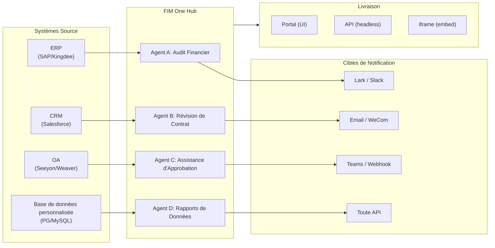

> Objectif : Construire un **Hub de Connecteurs alimenté par l'IA** — Autonome (assistant de portail), Copilote (intégré au système hôte), Hub (orchestration centrale inter-systèmes).
>
> Principes : **Agnostique des fournisseurs** (pas de verrouillage propriétaire), **abstraction minimale**, **orienté protocole**, **orienté connecteur** (l'intégration est la valeur fondamentale).

## Vision du Produit

FIM One est un **Hub de Connecteurs IA** qui propose trois modes progressifs :

```
Standalone   → Votre propre assistant IA (Portal)
Copilot      → IA intégrée dans un système hôte (iframe / widget / embed)
Hub          → Orchestration centrale inter-systèmes (Portal / API)
```

**Le mode Hub est le différenciateur clé.** Les clients entreprise disposent de systèmes hérités — ERP, CRM, OA, finance, HR — qui doivent communiquer entre eux via l'IA :



**Stratégie GTM : Land and Expand**

| Étape | Mode | Ce qui se passe |
|------|------|-------------|
| Land | Copilot | Intégrer dans un système, prouver la valeur dans leur interface utilisateur |
| Expand | Copilot → Hub | Déployer sur plus de systèmes ; Hub les agrège |

## Versions Livrées

### v0.1 (2026-02-22) — MVP: ReAct + DAG Planner
- ReActAgent avec outils (calculatrice, python_exec, web_search)
- DAG Planner (LLM génère des graphes de dépendances)
- Portal UI avec streaming + KaTeX

### v0.2 (2026-02-24) — Multi-Model + Memory
- Retry / rate limiting / usage tracking
- Native function calling (no JSON-only parsing)
- Multi-model support (fast + main LLM)
- Memory: WindowMemory, SummaryMemory
- FastAPI backend with SSE streaming

### v0.3 (2026-02-25) — Web Tools + MCP
- Web tools (web_search, web_fetch) via Jina/Tavily/Brave
- File operations tool
- MCP client (standard tool integration)
- Tool auto-discovery + categories
- DAG visualization with click-to-scroll
- Code exec in Docker (`--network=none`)

### v0.4 (2026-02-25) — Conversations multi-tours + Agents
- Conversations multi-tours (DbMemory)
- Interface de repliement des étapes d'outils
- Outils de requête HTTP + exécution shell
- Gestion des agents (créer, configurer, publier)
- Authentification JWT
- Mode d'exécution par agent + contrôle de température

### v0.5 (2026-02-28) — Full RAG + Grounded Gen
- Pipeline RAG complet (embedding + vector store + FTS + RRF + reranker)
- Génération ancrée (citations, détection de conflits, scores de confiance)
- Gestion des documents de la base de connaissances (CRUD, recherche, retry, migration de schéma)
- ContextGuard + messages épinglés (gestionnaire de budget de tokens)
- Persistance DbMemory + LLM Compact
- DAG Re-Planning (jusqu'à 3 rounds)

### v0.6 (2026-03-01) — Plateforme de connecteurs
- **CRUD de connecteur**: créer, lire, mettre à jour, supprimer
- **ConnectorToolAdapter**: convertit Connecteur → BaseTool
- **Identifiants par utilisateur**: chiffrement AES-GCM
- **Portail de confirmation**: approbation des opérations d'écriture
- **Journalisation d'audit**: tous les appels d'outils enregistrés
- **Disjoncteur**: dégradation progressive en cas de défaillance
- **Outils utilitaires**: email_send, json_transform, template_render, text_utils
- **Options d'intégration**: Jina, OpenAI, fournisseurs personnalisés

### v0.7 (2026-03-06) — Plateforme d'administration + Multi-locataire
- **Plateforme d'administration** : gestion des utilisateurs, basculement des rôles, réinitialisation de mot de passe, activation/désactivation de compte
- **Inscription sur invitation uniquement** : trois modes (ouvert/invitation/désactivé) + CRUD de code d'invitation
- **Gestion du stockage** : utilisation disque par utilisateur, effacement, nettoyage des orphelins
- **Modération des conversations** : liste d'administration/suppression de tous
- **Déconnexion forcée par utilisateur** : révocation de tous les jetons
- **Tableau de bord de santé API** : statistiques système, métriques des connecteurs
- **Assistant de configuration initiale** : création guidée du compte administrateur
- **Centre personnel** : instructions globales par utilisateur, préférence de langue
- **Authentification JWT** : authentification SSE basée sur jetons, propriété de conversation
- **Serveurs MCP globaux** : provisionnés par l'administrateur, chargés dans toutes les sessions
- **Compatibilité rétroactive** : migration automatique registration_enabled → registration_mode

### v0.7.x (2026-03-07 to 2026-03-12) — Stabilité + Polissage
- Gestion des codes d'invitation
- Quotas par utilisateur (application 429)
- Journalisation d'audit structurée
- Filtrage des mots sensibles
- Historique de connexion administrateur
- Navigateur de fichiers administrateur
- Vues administrateur améliorées (champs model_name, tools, kb_ids)
- Déploiement Docker Compose (image unique, volumes nommés)
- Détection automatique OAuth depuis window.location
- Support de la réflexion étendue / raisonnement (`LLM_REASONING_EFFORT`, `LLM_REASONING_BUDGET_TOKENS`) pour OpenAI série o, Gemini 2.5+, Claude
- Activation/désactivation par outil administrateur (outils désactivés exclus du chat à l'exécution)
- Gestion des serveurs MCP déplacée vers la page Connecteurs
- Support de base de données double : SQLite (par défaut zéro-config) + PostgreSQL (production) ; Docker Compose provisionne automatiquement PostgreSQL
- Page de documentation de configuration des modèles avec configuration de la réflexion étendue par fournisseur
- Protocole SSE v2 : streaming de réponse en temps réel avec champs `delta_reasoning`, `usage`, et événements `done`/`suggestions`/`title`/`end` séparés ; taille du pool SQLite 5 -> 20
- Expansion AI Builder : 7 nouveaux outils de construction (GetSettings, TestConnection, ImportOpenAPI pour connecteurs ; ListConnectors, AddConnector, RemoveConnector, SetModel pour agents), drapeau `is_builder` sur agents, actualisation automatique du prompt du constructeur, garde SSRF
- Frontend SSE v2 : curseur pulsant avec points animés, snapshots de re-planification DAG sous forme de cartes réductibles, mise en page DAG découplée des états d'étapes
- Page de documentation du concept AI Builder avec guides de construction de connecteurs et d'agents
- Système d'organisation : CRUD complet avec adhésion basée sur les rôles (propriétaire/administrateur/membre), interface de gestion administrateur
- Visibilité des ressources à trois niveaux (personnel/org/global) pour agents, connecteurs, bases de connaissances, serveurs MCP
- API Publier/dépublier pour tous les types de ressources ; délégation de propriétaire pour agents publiés
- Point de terminaison administrateur set-visibility (remplace clone-to-global) ; assistant de requête `build_visibility_filter()` unifié
- Connecteurs de base de données (Phase 1-3) : accès SQL direct à PG/MySQL/Oracle/SQL Server + BD héritées chinoises ; introspection de schéma, annotation IA, exécution de requête en lecture seule, identifiants chiffrés, 3 outils par connecteur (`list_tables`, `describe_table`, `query`)
- **Centre d'évaluation** : benchmarking quantitatif de la qualité des agents — CRUD d'ensemble de test (invite + comportement attendu + assertions), exécutions d'éval (exécution parallèle + évaluateur LLM + résultats par cas réussi/échoué/latence/jetons), visionneuse de résultats avec interrogation automatique ; migration `r8t0v2x4z567`
- Trois rôles de modèle (Général/Rapide/Raisonnement) avec isolation de configuration env par niveau ; le modèle rapide n'hérite plus des paramètres du modèle principal
- Classe de données `StepOutput` remplaçant les résultats d'étapes en chaîne simple pour les données structurées et le passage d'artefacts
- Cache d'outils pour l'exécution DAG — appels d'outils identiques mis en cache par exécution avec verrouillage asynchrone de prévention de ruée (`DAG_TOOL_CACHE`)
- Vérification LLM par étape avec 1 nouvelle tentative en cas d'échec (`DAG_STEP_VERIFICATION`)
- Routage automatique : LLM rapide classe les requêtes comme ReAct ou DAG ; point de terminaison `/api/auto` ; bascule de mode 3 voies frontend (`AUTO_ROUTING`)
- [x] ~~**Organisation de plateforme + Abonnements aux ressources**~~ : Org de plateforme intégré rejoint automatiquement tous les utilisateurs ; API Marché pour s'abonner aux ressources partagées ; tableau d'abonnements aux ressources ; partage de ressources basé sur org remplaçant la visibilité globale
- [x] ~~**Découverte automatique d'agent et liaison de sous-agent**~~ : drapeau `discoverable` sur agents ; liste blanche `sub_agent_ids` ; CallAgentTool pour déléguer des tâches aux agents spécialistes
- [x] ~~**Identifiants du serveur MCP + Remplacement par utilisateur**~~ : tableau `mcp_server_credentials` ; point de terminaison `PUT /api/mcp-servers/{id}/my-credentials` ; drapeau `allow_fallback` pour le comportement de secours des identifiants
- [x] ~~**Bascule connecteur/KB**~~ : `POST /api/connectors/{id}/toggle` et `POST /api/knowledge-bases/{id}/toggle` pour suspendre/reprendre les ressources
- [x] ~~**Conversations KB autonomes**~~ : champ `kb_ids` sur conversations pour le chat KB direct sans liaison d'agent

## Versions Planifiées

### v0.8 — Configuration déclarative des connecteurs + Divulgation progressive

**Objectif** : Faciliter la définition des connecteurs sans écrire de code Python, et optimiser la manière dont les outils et les instructions sont exposés au LLM.

- [x] ~~**Connecteurs de base de données** : accès SQL direct (PostgreSQL, MySQL, Oracle)~~ *(livré en v0.7.x — Phase 1-3)*
- [x] ~~**RBAC** : contrôle d'accès aux connecteurs par utilisateur/rôle~~ *(livré en v0.7.x — système org + visibilité à trois niveaux)*
- [x] **Chiffrement des identifiants de connecteur + remplacement par utilisateur** : table `connector_credentials`, chiffrement Fernet via `CREDENTIAL_ENCRYPTION_KEY`, drapeau `allow_fallback`, points de terminaison `GET/PUT/DELETE /my-credentials`, résolution des identifiants par utilisateur lors du chargement des outils de chat
- [x] **Interface d'examen de publication** : Système d'examen de publication au niveau de l'organisation — bascule d'examen par organisation, ReviewsSheet avec flux d'approbation/rejet, badges de statut sur les cartes de ressources, avis d'examen dans la boîte de dialogue de publication, renvoi pour les ressources rejetées
- [ ] **Divulgation progressive des connecteurs (Phase 1-2)** : un seul `ConnectorMetaTool` remplace les outils par action ; le message système reçoit uniquement des **stubs** légers (nom + description d'une ligne, ~30 tokens/connecteur vs ~250 tokens/action) ; l'agent appelle `discover(connecteur)` pour charger le schéma d'action complet à la demande — le schéma ne se charge que lorsque le modèle sélectionne un connecteur, maintenant le préfixe du message stable pour la mise en cache. Reflète le modèle interne `defer_loading: true` de Claude Code. Sous-commande `execute` ; drapeau de fonctionnalité pour la compatibilité rétroactive.
- [x] ~~**Système de compétences d'agent + Instructions compactes** : Chargement à la demande des compétences pour les instructions d'agent — modèle `Skill` (nom, contenu/SOP, scripts optionnels) attaché aux agents ; référencé dans le message système par nom uniquement (~10 tokens/compétence) ; l'agent appelle `read_skill(nom)` pour charger le contenu complet à la demande. Réduit le coût en tokens d'instruction par conversation d'environ 80% tout en permettant des bibliothèques SOP plus riches. Équivalent à la divulgation progressive de ConnectorMetaTool appliquée au niveau des instructions. Active la différenciation « instructions + outils + compétences ». Ajoute également le champ `compact_instructions` au modèle Agent — liste de priorités de compression par agent injectée dans `ContextGuard` lors de la compression (par exemple, « préserver les ID de commande et les montants, supprimer les réponses API brutes »), remplaçant l'invite générique statique actuelle. Inspiré par le modèle Compact Instructions de Claude Code.~~
- [ ] **Configuration de connecteur YAML/JSON** : la plateforme génère automatiquement un serveur MCP
- [ ] **Import/export de connecteur** : partager des modèles de connecteur
- [ ] **Fork de connecteur** : cloner et personnaliser les connecteurs existants
- [ ] **Connecteurs de base de données Phase 4** : pilotes d'entreprise — Oracle (`oracledb`), SQL Server (`aioodbc`), 达梦 DM8 (`aioodbc` + DM ODBC), 南大通用 GBase (`aioodbc` + GBase ODBC)
- [ ] **Notification push de message** : Actions de notification Lark, WeCom, Slack, Email
- [x] **Système de plan de flux de travail** : Éditeur de flux de travail visuel pour concevoir et exécuter des plans d'automatisation multi-étapes — modèles ORM `Workflow` / `WorkflowRun`, CRUD complet + API d'exécution SSE, import/export, duplication, point de terminaison de validation de plan, `WorkflowEngine` avec tri topologique + concurrence basée sur sémaphore + branchement conditionnel et 12 types de nœuds (Start, End, LLM, ConditionBranch, QuestionClassifier, Agent, KnowledgeRetrieval, Connector, HTTPRequest, VariableAssign, TemplateTransform, CodeExecution), `VariableStore` avec interpolation `{{node_id.output}}` et espace de noms `env.*`, stratégies d'erreur par nœud (STOP_WORKFLOW / CONTINUE / FAIL_BRANCH) avec délai d'expiration par nœud et interface de configuration avancée, éditeur visuel React Flow v12 avec palette glisser-déposer + panneau de configuration de nœud + sélecteur de variable combobox + ajout de nœud sur arête + mise en page automatique (ELK.js) + feuille d'historique d'exécution, conception de nœud compact de style Dify avec statut d'exécution basé sur anneau et transitions d'arête animées, 4 modèles de démarrage intégrés (Simple LLM Chain, Conditional Router, Knowledge-Augmented QA, HTTP API Pipeline) avec dialogue de sélection de modèle et API `GET /templates` + `POST /from-template`, point de terminaison de statistiques, paramètre URL `?run=true` ouverture automatique, sécurité d'exécution de code basée sur sous-processus, suite de 105 tests (modèles, aplatissement d'espace de noms eval, avertissements de validation de plan, suppression de nœud/arête, import/export/duplication, détection d'interblocage, branchement multi-condition)
- [x] **Audit opérationnel** : journalisation détaillée de qui a fait quoi — onglet d'audit du journal d'examen administrateur ajouté (piste d'examen de publication par organisation/ressource)
- [ ] **Annotations de schéma sémantique** : étendre les champs de schéma de connecteur avec les drapeaux `semantic_tag`, `description` et `pii` ; annotations affichées dans les descriptions d'outils LLM afin que l'agent comprenne l'intention du champ sans deviner à partir des noms de colonnes

**Impact** : Les ingénieurs d'implémentation (aucun Python requis) peuvent ajouter des connecteurs en 1-2 heures. Le coût en tokens pour les définitions d'outils et les instructions d'agent diminue d'environ 80-93% à grande échelle.

### v0.9 — Observabilité + Durcissement de la production

**Objectif** : Opérations de qualité production, débogage et surveillance. Introduit le **Système de hooks** — une couche d'application déterministe qui se situe en dessous des instructions de l'agent et ne peut pas être contournée par le LLM.

- [ ] **Divulgation progressive des connecteurs (Phase 3-4)** : interface `ConnectorExecutor` unifiée (API/DB/MCP derrière une seule abstraction) ; validation des paramètres d'action avec `jsonschema` ; découverte et exécution agnostiques du protocole
- [ ] **Couche de trace d'agent (Observabilité++)** : Hiérarchie run/trace/thread au niveau de l'application pour le débogage des agents — chaque conversation → `Trace`, chaque appel LLM / appel d'outil / étape DAG → `Span` avec entrée/sortie/tokens/timing. Visionneuse de trace frontend avec chronologie et charges utiles d'appels LLM extensibles. Cela va au-delà d'OTel (niveau infrastructure) pour fournir un débogage de boucle d'agent exploitable pour les développeurs et les clients d'entreprise. Export OpenTelemetry comme option de récepteur de données. Modélisé d'après les concepts run/trace/thread de LangSmith — le modèle validé par l'industrie pour l'observabilité des agents.
- [ ] **Tableau de bord des métriques** : latence, taux de succès, utilisation des tokens, analytique des appels de connecteurs — par agent, par utilisateur, par org
- [ ] **Disjoncteur** : backoff exponentiel, détection de défaillance
- [ ] **Système de hooks d'agent** : Une couche d'application déterministe qui s'exécute **en dehors de la boucle LLM** — les hooks s'exécutent automatiquement sur les événements d'outil et ne peuvent pas être contournés par les instructions de l'agent. Trois points de hook : `PreToolUse` (valider / bloquer avant l'exécution), `PostToolUse` (effets secondaires après l'exécution), `SessionStart` (injecter du contexte dynamique). Hooks intégrés : écriture automatique de `ConnectorCallLog` à chaque appel de connecteur (actuellement manuel) ; blocage des opérations d'écriture quand l'org est en mode lecture seule ; troncature automatique des résultats de requête DB surdimensionnés avant qu'ils n'atteignent l'agent ; limitation du débit par fréquence d'appel de connecteur. Hooks définis par l'utilisateur : configuration YAML par agent (champ `hooks:`) déclarant des commandes shell ou des callables Python déclenchés sur les événements d'outil correspondants — même modèle que les hooks de Claude Code. Principe de conception clé : **les hooks sont pour la logique "doit toujours se produire" qui ne devrait jamais dépendre du LLM se souvenant de le faire**. Les instructions disent « enregistrer tous les appels » ; les hooks les enregistrent réellement. Les instructions disent « ne pas écrire en mode lecture seule » ; les hooks le bloquent réellement.
- [ ] **Espace de travail d'agent (Déchargement de sortie d'outil + Transfert)** : Quand les réponses MCP / connecteur / DB dépassent un seuil (par défaut : 8K caractères), enregistrement automatique de la sortie complète dans un fichier d'espace de travail par conversation (`workspace://tool_result_xxx.txt`) et retour d'un aperçu tronqué + URI de fichier à l'agent. Trois nouveaux outils intégrés : `read_workspace_file(path, start_line, end_line)` pour l'accès sélectif, `list_workspace_files()` pour la découverte, et `write_handoff(summary)` pour les transitions de contexte — l'agent écrit une note HANDOFF structurée (progression, ce qui a fonctionné, ce qui a échoué, prochaine étape) avant la compression de contexte ou le changement de session ; l'instance d'agent suivante la lit au lieu de dépendre de la qualité du résumé de l'algorithme de compression. Reflète les modèles d'espace de travail + transfert de Claude Code. Prévient la dilution de l'attention sur les grands ensembles de résultats et élimine la perte de données silencieuse due à la troncature. Changement minimal : étendre `truncate_tool_output()` dans `MCPToolAdapter` et `ConnectorToolAdapter` pour écrire dans le stockage d'espace de travail.
- [ ] **Durcissement du sandbox** : améliorations v2 de l'isolation de l'exécution du code
- [ ] **Tests de performance** : benchmarks de charge concurrente
- [ ] **Mise en pool des connexions MCP** : la génération de sous-processus STDIO par requête ne s'adapte pas — 100 utilisateurs concurrents = 100 sous-processus par serveur MCP. Mettre en pool les connexions STDIO avec isolation d'env par utilisateur (clé par `(server_id, env_hash)`) ; les transports SSE/HTTP partagent les sessions `httpx.AsyncClient`. Objectif : démarrage à chaud sub-100ms pour STDIO en pool, connexions O(1) HTTP par serveur MCP quel que soit le nombre d'utilisateurs
- [ ] **Tâches planifiées + Agents déclenchés par événement (Boucle)** : déclencheurs de tâches de fond de type cron ; tables DB `scheduled_jobs` + `job_runs` ; intégration APScheduler ; API CRUD de tâche + UI d'historique de tâche ; notification de résultat via connecteurs de push de message. La portée couvre à la fois les modèles déclenchés par le temps (cron) et déclenchés par événement (webhook entrant) — un agent s'exécutant de manière asynchrone en arrière-plan EST le cas d'usage du sous-agent asynchrone pour le mode Hub.
- [ ] **Générateur de schéma DB avancé** : agent de gestion de schéma piloté par IA pour les bases de données à grande échelle — annotation stratégique de table (basée sur motif, informée par exécution SQL), gestion de visibilité en masse par préfixe de domaine, annotation itérative multi-tour pour les déploiements de 1K–7K+ tables ; complète le travail d'annotation par lot existant avec sélectivité et raisonnement de contexte métier

**Impact** : Exécuter FIM One à l'échelle en toute confiance. Trois couches architecturales maintenant complètes : **Couche de trace** (voir ce qui s'est passé), **Système de hooks** (appliquer ce qui doit se produire), **Espace de travail d'agent** (l'agent gère son propre accès aux données). Ensemble, ils comblent l'écart entre « les instructions que l'agent pourrait suivre » et « les garanties que le système applique » — la différence entre une démo et un outil d'entreprise de production.

### v1.0 — Connecteur Hot-Plug + Intégrable

**Objectif** : Ajout de connecteur sans redémarrage et livraison intégrée.

- [ ] **Divulgation Progressive des Connecteurs (Phase 5)** : **Sélection d'Outils Guidée par Sémantique** (extraction d'entités à partir de la requête → recherche dans le Registre d'Ontologie → réduction de l'ensemble de connecteurs ; réduction de 90%+ des jetons pour les déploiements de 50+ connecteurs) ; Mode d'échelle pour les connecteurs batch/ETL ; Interface universelle de style CLI `connecteur <nom> <action> <params>`
- [ ] **Alignement d'Entités Inter-Connecteurs (Registre d'Ontologie)** : définir les types d'entités partagées (Client, Commande, Actif) avec mappages de champs entre connecteurs ; DAGPlanner résout automatiquement les clés JOIN inter-systèmes ; active les requêtes inter-connecteurs (par ex., « clients dans Salesforce qui ont commandé dans Shopify ») sans noms de champs codés en dur
- [ ] **Connecteurs hot-plug** : télécharger la spécification OpenAPI, l'IA génère la configuration, actif en 5 minutes (pas de redémarrage)
- [ ] **Marketplace de connecteurs** : modèles partagés par la communauté
- [ ] **Widget intégrable** : `<script src="fim-one.js">` injecté dans la page hôte
- [ ] **Injection de contexte de page** : le widget lit le contexte de la page hôte (ID actuel, URL, sélecteurs DOM)
- [ ] **Déclencheurs avancés** : événements entrants par webhook ; améliorations des tâches planifiées (multi-fuseau horaire, sensibilité au calendrier)
- [ ] **Exécution par lot** : traiter 1000+ éléments via DAG
- [ ] **Sécurité d'entreprise** : liste blanche IP, chiffrement au repos, SSO
- [ ] **Éditeur KB Avancé** : Agent en mode Builder pour les utilisateurs avancés gérant de grandes bases de connaissances — ingestion d'URL en masse, détection des doublons, analyse des lacunes, gestion du cycle de vie des documents ; étend le chat IA KB existant avec une boucle d'outils ReAct

**Impact** : Les entreprises déploient FIM One de zéro à l'orchestration multi-systèmes en quelques jours.

## Fonctionnalités figées (Livrées, Maintenance uniquement)

Selon la [Stratégie d'orthogonalité](/strategy/orthogonality-strategy), ces fonctionnalités sont livrées et fonctionnelles mais ne recevront pas de nouvelles capacités (corrections de bugs uniquement) :

| Fonctionnalité | Version | Raison du gel |
|---------|---------|-----------|
| Agent ReAct | v0.1 | Les modèles disposent désormais d'appels d'outils natifs |
| Planification DAG / Re-planification | v0.1, v0.5, v0.7.5 | Les capacités de raisonnement des modèles s'améliorent ; la décomposition devient mono-coup. La vérification par étape a été livrée en v0.7.5 (`DAG_STEP_VERIFICATION`) — aucune nouvelle primitive de planification prévue |
| Mémoire (Fenêtre, Résumé, Compact) | v0.2, v0.5 | Les fenêtres de contexte augmentent (200K+) ; moins besoin de gestion de mémoire externe |
| Pipeline RAG | v0.5 | Les fournisseurs construisent la récupération nativement (OpenAI file_search, Gemini Search Grounding) |
| Génération ancrée | v0.5 | Les modèles s'améliorent dans les citations ; le pipeline à 5 étapes ajoute une valeur décroissante |
| ContextGuard / Messages épinglés | v0.5 | Livraison en l'état ; aucune nouvelle fonctionnalité |

## À considérer (Reporté indéfiniment)

Selon la Stratégie d'Orthogonalité, ces éléments représenteraient un effort important et feraient face à un risque d'absorption :

| Fonctionnalité | Raison du report |
|---------|------------|
| Orchestration Multi-Agent (hiérarchies profondes) | Les fournisseurs construisent nativement (OpenAI Swarm, Claude Code Teams, Google A2A). Le CallAgentTool de FIM One couvre le cas de délégation à un niveau ; les agents d'arrière-plan déclenchés par événement sont couverts par les Scheduled Jobs en v0.9 |
| Compétences Auto-modifiantes d'Agent (Mémoire Procédurale) | Les agents mettant à jour leur propre `skill.md` pendant l'exécution — complexité élevée, surface de sécurité/audit. Dépend de la livraison du Agent Skill System (v0.8) en premier. Réévaluer si les clients entreprise demandent explicitement des agents auto-améliorants |
| ~~Espace de Travail d'Agent (Déchargement de Fichiers de Sortie d'Outil)~~ | Promu à v0.9. La valeur est la **lecture sélective**, non la capacité de contexte — la validation Claude Code l'a confirmé. Le raisonnement initial du report (« les fenêtres 200K+ réduisent l'urgence ») était incorrect. |
| Mémoire Long-Terme Inter-Session | Les fenêtres de contexte augmentent rapidement (200K–2M) ; les fournisseurs ajoutent la mémoire intégrée (mémoire OpenAI, mise en cache de contexte Gemini) ; coût d'implémentation élevé par rapport à la valeur de différenciation décroissante. Réévaluer quand les clients entreprise le demandent explicitement |
| Cycle de Vie de la Mémoire (TTL, quotas) | Dépend de la mémoire inter-session ; reporté ensemble |
| Outil de Compression de Contexte Actif (déclenché par agent) | Explicitement gelé avec ContextGuard (v0.5). Les fenêtres de contexte à 200K+ réduisent la valeur. Ne sera pas revisité à moins que les coûts de contexte ne deviennent une plainte majeure des clients entreprise |

## Comment les versions s'alignent avec les modes

| Version | Standalone | Copilot | Hub | Notes |
|---------|-----------|---------|-----|-------|
| **v0.1–v0.3** | Fonctionnel | Pas encore | Pas encore | Portail uniquement, utilisateur unique |
| **v0.4** | Fonctionnel | Pas encore | Pas encore | Multi-conversation, gestion d'agent |
| **v0.5** | Fonctionnel | Pas encore | Pas encore | Base de connaissances + RAG |
| **v0.6** | Fonctionnel | Possible | Possible | Connecteurs disponibles ; Copilot/Hub possible avec câblage manuel |
| **v0.7** | Fonctionnel | Prêt | Prêt | Plateforme d'administration ; authentification multi-locataire ; prêt pour la production |
| **v0.8** | Fonctionnel | Prêt | Optimisé | RBAC + journal d'audit par système ; intégration plus facile |
| **v0.9** | Fonctionnel | Prêt | Production | Observabilité, performance, renforcement |
| **v1.0** | Fonctionnel | Optimisé | Entreprise | Plug-and-play, marketplace, tâches planifiées, webhooks, batch |

## Allocation des ressources (v0.8–v1.0)

La Stratégie d'Orthogonalité façonne l'orientation des efforts :

| Catégorie | Allocation | Versions | Raison |
|----------|-----------|----------|-----|
| **Plateforme de connecteurs** (v0.6+) | 50% | Continu | Différenciation centrale ; aucun risque d'absorption |
| **Fonctionnalités Entreprise** (RBAC, audit, sécurité, observabilité) | 30% | v0.8–v1.0 | Ennuyeux mais durable ; exigence de production. La couche Agent Trace est l'ancrage commercial |
| **Intelligence des agents** (Système de compétences, agents planifiés) | 15% | v0.8–v0.9 | Histoire de différenciation instructions+outils+compétences ; risque d'absorption faible — les frameworks valident les modèles, mais les procédures d'entreprise sont spécifiques aux clients |
| **Maintenance v0.1–v0.5** | 5% | Continu | Corrections de bugs uniquement ; aucune nouvelle fonctionnalité |

## Jalons pilotés par les métriques

Le succès est mesuré par :

| Métrique | Cible v0.7 | Cible v0.8 | Cible v1.0 |
|--------|------------|------------|------------|
| Connecteurs déployés | 5 | 20+ | 100+ |
| Clients entreprise | 1–2 | 5–10 | 20+ |
| Temps de configuration moyen des connecteurs | 2 semaines | 2 jours | 5 minutes (hot-plug) |
| Efficacité des tokens (DAG vs ReAct uniquement) | Réduction de 30 % | Réduction de 40 % | Réduction de 50 % |
| SLA de disponibilité | 99,5 % | 99,9 % | 99,95 % |
| Thèmes des tickets de support | Intégration, configuration | Logique personnalisée des connecteurs | Hot-plug, mise à l'échelle |

## Questions ouvertes / À définir

- **Modération de la marketplace** : Comment valider les connecteurs communautaires ? (v1.0)
- **Économie des tokens** : Comment tarifier les scénarios multi-utilisateurs, multi-agents ? (v1.0)
- **Désactivation de la télémétrie** : Comment respecter les préférences de confidentialité ? (v0.8)
- **Versioning des connecteurs** : Comment gérer les changements cassants dans les API des connecteurs ? (v0.8)
- **Limitation de débit** : Par connecteur, par utilisateur ou global ? (v0.8)

