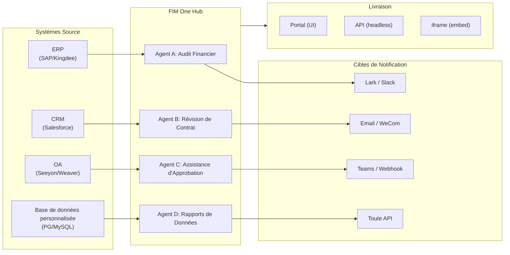

> Objectif : Construire un **Hub de connecteurs alimenté par l'IA** — Autonome (assistant de portail), Copilote (intégré au système hôte), Hub (orchestration centrale inter-systèmes).
>
> Principes : **Agnostique des fournisseurs** (pas de verrouillage des fournisseurs), **abstraction minimale**, **protocole en premier**, **connecteur en premier** (l'intégration est la valeur fondamentale).

## Vision du Produit

FIM One est un **Hub de Connecteurs IA** qui propose trois modes progressifs :

```
Standalone   → Votre propre assistant IA (Portal)
Copilot      → IA intégrée dans un système hôte (iframe / widget / embed)
Hub          → Orchestration centrale inter-systèmes (Portal / API)
```

**Le mode Hub est le différenciateur clé.** Les clients entreprise disposent de systèmes hérités — ERP, CRM, OA, finance, HR — qui doivent communiquer entre eux via l'IA :



**Stratégie GTM : Land and Expand**

| Étape | Mode | Ce qui se passe |
|------|------|-------------|
| Land | Copilot | Intégrer dans un système, prouver la valeur dans leur interface utilisateur |
| Expand | Copilot → Hub | Déployer sur plus de systèmes ; Hub les agrège |

## Versions Livrées

### v0.1 (2026-02-22) — MVP: ReAct + DAG Planner
- ReActAgent avec outils (calculatrice, python_exec, web_search)
- DAG Planner (LLM génère des graphes de dépendances)
- Portal UI avec streaming + KaTeX

### v0.2 (2026-02-24) — Multi-Model + Memory
- Retry / rate limiting / usage tracking
- Native function calling (no JSON-only parsing)
- Multi-model support (fast + main LLM)
- Memory: WindowMemory, SummaryMemory
- FastAPI backend with SSE streaming

### v0.3 (2026-02-25) — Web Tools + MCP
- Web tools (web_search, web_fetch) via Jina/Tavily/Brave
- File operations tool
- MCP client (standard tool integration)
- Tool auto-discovery + categories
- DAG visualization with click-to-scroll
- Code exec in Docker (`--network=none`)

### v0.4 (2026-02-25) — Conversations multi-tours + Agents
- Conversations multi-tours (DbMemory)
- Interface de repliement des étapes d'outils
- Outils de requête HTTP + exécution shell
- Gestion des agents (créer, configurer, publier)
- Authentification JWT
- Mode d'exécution par agent + contrôle de température

### v0.5 (2026-02-28) — Full RAG + Grounded Gen
- Pipeline RAG complet (embedding + vector store + FTS + RRF + reranker)
- Génération ancrée (citations, scores de confiance)
- Gestion des documents de la base de connaissances (CRUD, recherche, retry, migration de schéma)
- ContextGuard + messages épinglés (gestionnaire de budget de tokens)
- Persistance DbMemory + LLM Compact
- DAG Re-Planning (jusqu'à 3 rounds)

### v0.6 (2026-03-01) — Plateforme de connecteurs
- **CRUD de connecteur**: créer, lire, mettre à jour, supprimer
- **ConnectorToolAdapter**: convertit Connecteur → BaseTool
- **Identifiants par utilisateur**: chiffrement AES-GCM
- **Portail de confirmation**: approbation des opérations d'écriture
- **Journalisation d'audit**: tous les appels d'outils enregistrés
- **Disjoncteur**: dégradation progressive en cas de défaillance
- **Outils utilitaires**: email_send, json_transform, template_render, text_utils
- **Options d'intégration**: Jina, OpenAI, fournisseurs personnalisés

### v0.7 (2026-03-06) — Plateforme d'administration + Multi-locataire
- **Plateforme d'administration** : gestion des utilisateurs, basculement des rôles, réinitialisation de mot de passe, activation/désactivation de compte
- **Inscription sur invitation uniquement** : trois modes (ouvert/invitation/désactivé) + CRUD de code d'invitation
- **Gestion du stockage** : utilisation disque par utilisateur, effacement, nettoyage des orphelins
- **Modération des conversations** : liste d'administration/suppression de tous
- **Déconnexion forcée par utilisateur** : révocation de tous les jetons
- **Tableau de bord de santé API** : statistiques système, métriques des connecteurs
- **Assistant de configuration initiale** : création guidée du compte administrateur
- **Centre personnel** : instructions globales par utilisateur, préférence de langue
- **Authentification JWT** : authentification SSE basée sur jetons, propriété de conversation
- **Serveurs MCP globaux** : provisionnés par l'administrateur, chargés dans toutes les sessions
- **Compatibilité rétroactive** : migration automatique registration_enabled → registration_mode

### v0.7.x (2026-03-07 to 2026-03-12) — Stabilité + Polissage
- Gestion des codes d'invitation
- Quotas par utilisateur (application 429)
- Journalisation d'audit structurée
- Filtrage des mots sensibles
- Historique de connexion administrateur
- Navigateur de fichiers administrateur
- Vues administrateur améliorées (champs model_name, tools, kb_ids)
- Déploiement Docker Compose (image unique, volumes nommés)
- Détection automatique OAuth depuis window.location
- Support de la réflexion étendue / raisonnement (`LLM_REASONING_EFFORT`, `LLM_REASONING_BUDGET_TOKENS`) pour OpenAI série o, Gemini 2.5+, Claude
- Activation/désactivation par outil administrateur (outils désactivés exclus du chat à l'exécution)
- Gestion des serveurs MCP déplacée vers la page Connecteurs
- Support de base de données double : SQLite (par défaut sans configuration) + PostgreSQL (production) ; Docker Compose provisionne automatiquement PostgreSQL
- Page de documentation de configuration des modèles avec configuration de la réflexion étendue par fournisseur
- Protocole SSE v2 : diffusion de réponses en temps réel avec champs `delta_reasoning`, `usage`, et événements `done`/`suggestions`/`title`/`end` séparés ; taille du pool SQLite 5 -> 20
- Expansion AI Builder : 7 nouveaux outils de construction (GetSettings, TestConnection, ImportOpenAPI pour connecteurs ; ListConnectors, AddConnector, RemoveConnector, SetModel pour agents), drapeau `is_builder` sur les agents, actualisation automatique du prompt du constructeur, protection SSRF
- Frontend SSE v2 : curseur à point pulsant en continu, snapshots de re-plan DAG sous forme de cartes réductibles, mise en page DAG découplée des états d'étape
- Page de documentation du concept AI Builder avec guides de construction de connecteurs et d'agents
- Système d'organisation : CRUD complet avec adhésion basée sur les rôles (propriétaire/administrateur/membre), interface de gestion administrateur
- Visibilité des ressources à trois niveaux (personnel/org/global) pour les agents, connecteurs, bases de connaissances, serveurs MCP
- API Publier/Dépublier pour tous les types de ressources ; délégation de propriétaire pour les agents publiés
- Point de terminaison administrateur set-visibility (remplace clone-to-global) ; assistant de requête `build_visibility_filter()` unifié
- Connecteurs de base de données (Phase 1-3) : accès SQL direct à PG/MySQL/Oracle/SQL Server + BD héritées chinoises ; introspection de schéma, annotation IA, exécution de requête en lecture seule, identifiants chiffrés, 3 outils par connecteur (`list_tables`, `describe_table`, `query`)
- **Centre d'évaluation** : évaluation quantitative de la qualité des agents — CRUD d'ensemble de test (prompt + comportement attendu + assertions), exécutions d'éval (exécution parallèle + évaluateur LLM + résultats par cas réussi/échoué/latence/jeton), visionneuse de résultats avec interrogation automatique ; migration `r8t0v2x4z567`
- Trois rôles de modèle (Général/Rapide/Raisonnement) avec isolation de configuration env par niveau ; le modèle rapide n'hérite plus des paramètres du modèle principal
- Classe de données `StepOutput` remplaçant les résultats d'étape en chaîne simple pour les données structurées et la transmission d'artefacts
- Cache d'outil pour l'exécution DAG — appels d'outil identiques mis en cache par exécution avec prévention du verrouillage asynchrone stampede (`DAG_TOOL_CACHE`)
- Vérification LLM par étape avec 1 nouvelle tentative en cas d'échec (`DAG_STEP_VERIFICATION`)
- Routage automatique : LLM rapide classe les requêtes comme ReAct ou DAG ; point de terminaison `/api/auto` ; basculement de mode 3 voies frontend (`AUTO_ROUTING`)
- [x] ~~**Organisation du marché fantôme + Abonnements aux ressources**~~ : Organisation du marché intégré (fantôme, pas d'adhésion automatique) remplace l'organisation de plateforme ; ressources découvertes via navigation sur le marché et explicitement souscrites (modèle pull) ; API de marché pour s'abonner aux ressources partagées ; la publication sur le marché nécessite toujours un examen ; tableau des abonnements aux ressources ; partage de ressources basé sur l'organisation remplaçant la visibilité globale
- [x] ~~**Découverte automatique d'agent et liaison de sous-agent**~~ : drapeau `discoverable` sur les agents ; liste blanche `sub_agent_ids` ; CallAgentTool pour déléguer des tâches à des agents spécialisés
- [x] ~~**Identifiants du serveur MCP + Remplacement par utilisateur**~~ : tableau `mcp_server_credentials` ; point de terminaison `PUT /api/mcp-servers/{id}/my-credentials` ; drapeau `allow_fallback` pour le comportement de secours des identifiants
- [x] ~~**Basculement connecteur/KB**~~ : `POST /api/connectors/{id}/toggle` et `POST /api/knowledge-bases/{id}/toggle` pour suspendre/reprendre les ressources
- [x] ~~**Conversations KB autonomes**~~ : champ `kb_ids` sur les conversations pour le chat KB direct sans liaison d'agent

### v0.8 (2026-03-20) — Configuration déclarative des connecteurs + Divulgation progressive
- [x] **Connecteurs de base de données**: accès SQL direct (PostgreSQL, MySQL, Oracle) *(livré en v0.7.x — Phase 1-3)*
- [x] **RBAC**: contrôle d'accès aux connecteurs par utilisateur/rôle *(livré en v0.7.x — système org + visibilité à trois niveaux)*
- [x] **Chiffrement des identifiants de connecteur + remplacement par utilisateur**: table `connector_credentials`, chiffrement Fernet via `CREDENTIAL_ENCRYPTION_KEY`, drapeau `allow_fallback`, points de terminaison `GET/PUT/DELETE /my-credentials`, résolution des identifiants par utilisateur lors du chargement des outils de chat
- [x] **Interface d'examen de publication**: Système d'examen de publication au niveau de l'organisation — bascule d'examen par org, ReviewsSheet avec flux d'approbation/rejet, badges de statut sur les cartes de ressources, avis d'examen dans la boîte de dialogue de publication, renvoi pour les ressources rejetées
- [x] **Divulgation progressive des connecteurs (Phase 1-2)**: un seul `ConnectorMetaTool` remplace les outils par action; le message système reçoit uniquement des **stubs** légers (nom + description d'une ligne, ~30 tokens/connecteur vs ~250 tokens/action); l'agent appelle `discover(connector)` pour charger le schéma d'action complet à la demande — le schéma ne se charge que lorsque le modèle sélectionne un connecteur, maintenant le préfixe du message stable pour la mise en cache. Reflète le modèle interne `defer_loading: true` de Claude Code. Sous-commande `execute`; drapeau de fonctionnalité pour la compatibilité rétroactive.
- [x] **Système de compétences d'agent + Instructions compactes**: Chargement à la demande des instructions de compétences pour les agents — modèle `Skill` (nom, contenu/SOP, scripts optionnels) attaché aux agents; référencé dans le message système par nom uniquement (~10 tokens/compétence); l'agent appelle `read_skill(name)` pour charger le contenu complet à la demande. Réduit le coût des tokens d'instruction par conversation d'environ 80% tout en permettant des bibliothèques SOP plus riches. Homologue de la divulgation progressive de ConnectorMetaTool appliquée au niveau des instructions. Active la différenciation « instructions + outils + compétences ». Ajoute également le champ `compact_instructions` au modèle Agent — liste de priorités de compression par agent injectée dans `ContextGuard` lors de la compression (par exemple, « préserver les ID et montants des commandes, supprimer les réponses API brutes »), remplaçant l'invite générique statique actuelle. Inspiré par le modèle Compact Instructions de Claude Code.
- [x] **Importation/exportation de connecteurs**: partager les modèles de connecteurs
- [x] **Duplication de connecteur**: cloner et personnaliser les connecteurs existants
- [x] **Nœuds de phase 2 de flux de travail**: Iterator, Loop, VariableAggregator, ParameterExtractor, ListOperation, Transform, DocumentExtractor, QuestionUnderstanding, HumanIntervention — 9 types de nœuds avancés avec frontend + backend complets + 150 nouveaux tests (275 au total). Nouvelle tentative de nœud avec backoff exponentiel, évaluation d'expression sûre. Panneau de statistiques avec barre de taux de réussite. 12 modèles intégrés. Menu contextuel du volet (Coller, Sélectionner tout, Ajuster la vue, Disposition automatique).
- [x] **Nœuds de phase 3 de flux de travail: SubWorkflow + ENV** — 2 nouveaux types de nœuds (25 nœuds au total), 14 nouveaux tests (306 au total), 14 modèles intégrés. SubWorkflow: exécuteur de flux de travail imbriqué complet avec support de base de données, sélection de flux de travail cible, mappage de variables et limite de profondeur configurable pour éviter la récursion infinie. ENV: lit les variables d'environnement chiffrées avec sélecteur de clé et valeurs par défaut de secours. Frontend complet (composants de nœud, panneaux de configuration, entrées de palette, couleurs de minimap). Panneau de statistiques d'exécution par nœud (taux de réussite, durées, nombre d'échecs triés du pire au meilleur). Client API `getNodeStats` + type `NodeStatEntry`. Boîte de dialogue des raccourcis clavier (touche `?`).
- [x] **Déclencheurs programmés de flux de travail**: Configuration cron par flux de travail avec fuseau horaire, entrées par défaut et calcul de prochaine exécution. Boutons cron prédéfinis, 30 tests de déclencheur.
- [x] **Déclencheurs API de flux de travail**: Clés API publiques par flux de travail (préfixe `wf_`) pour l'exécution externe sans authentification utilisateur, avec limitation de débit. Boîte de dialogue de gestion des clés API avec génération/régénération/révocation, URL de déclenchement et exemples cURL/JS.
- [x] **Exécution par lot de flux de travail**: `POST /batch-run` avec jusqu'à 100 ensembles d'entrée, parallélisme configurable (1-10), résultats par élément réductibles, exportation JSON. 14 tests d'exécution par lot.
- [x] **Visionneuse du journal d'exécution du flux de travail**: Flux d'événements SSE chronologique en temps réel dans le panneau d'exécution avec horodatages, badges codés par couleur et bascules de filtre de type d'événement.
- [x] **Statistiques d'exécution du flux de travail**: Le backend récupère par lot les nombres d'exécutions et les taux de réussite via une sous-requête GROUP BY; le frontend affiche les statistiques sur les cartes de flux de travail avec des indicateurs de taux de réussite codés par couleur.
- [x] **Démon du planificateur de flux de travail**: Service asynchrone en arrière-plan interrogeant toutes les 60 secondes les flux de travail basés sur cron dus. Support du fuseau horaire Croniter, sémaphore de concurrence, suivi `last_scheduled_at`, livraison webhook. 14 tests.
- [x] **Résolveur de conflits d'importation de flux de travail**: Détecte les références d'agent/connecteur/KB/MCP non résolues lors de l'importation. Requêtes DB par lot avec filtrage de visibilité, avertissements toast frontend. 17 tests.
- [x] **Exécution de nœud de test de flux de travail**: Test isolé de nœud unique avec variables fictives, intégré dans l'éditeur (bouton Test du panneau de configuration + menu contextuel). 23 tests.
- [x] **Diff de version de flux de travail**: Comparaison de plan côte à côte avec détection de changement de nœud/arête, indicateurs codés par couleur (ajouté/supprimé/modifié).
- [x] **Gestion des exécutions de flux de travail**: Supprimer les exécutions individuelles (`DELETE /runs/{run_id}`) et effacer toutes les exécutions terminées (`DELETE /runs`), avec boîtes de dialogue de confirmation frontend.
- [x] **Superposition de relecture d'exécution de flux de travail**: Bouton « Afficher sur le canevas » dans l'historique d'exécution pour superposer les résultats d'exécution passés sur le canevas, affichant le statut et la sortie par nœud sans réexécution.
- [x] **Favoris/épinglage de flux de travail**: Étoiler/épingler les flux de travail en haut de la liste avec persistance localStorage.
- [x] **Exportation de l'historique d'exécution du flux de travail**: Exporter l'historique d'exécution en tant que téléchargement de fichier JSON avec métadonnées d'exécution complètes et résultats par nœud.
- [x] **Gestion des flux de travail administrateur**: Onglet du panneau administrateur pour gérer tous les flux de travail entre les utilisateurs — lister, basculer actif/inactif, supprimer avec confirmation. Points de terminaison par lot pour supprimer, basculer et publier avec journalisation d'audit.
- [x] **Système de modèles de flux de travail**: Modèle ORM `WorkflowTemplate` avec CRUD administrateur, API de listing/clonage public et 5 modèles de départ insérés automatiquement au premier démarrage.
- [x] **Badges de validation en ligne de flux de travail**: `ValidationBadge` en temps réel par nœud sur le canevas avec info-bulles d'erreur/avertissement pour un retour visuel immédiat lors de l'édition.
- [x] **Visionneuse de trace d'exécution de flux de travail**: Visionneuse de trace basée sur une chronologie avec paramètre `trace_level` du moteur et captures d'instantané de variables par nœud pour le débogage pas à pas.
- [x] **Limitation de débit et délai d'expiration du flux de travail**: `WorkflowRateLimiter` par utilisateur (fenêtre glissante 10 exécutions/min, 3 concurrentes) et délai d'expiration global par défaut de 10 minutes.
- [x] **Système de plan de flux de travail**: Éditeur de flux de travail visuel pour concevoir et exécuter des plans d'automatisation multi-étapes — modèles ORM `Workflow` / `WorkflowRun`, CRUD complet + API d'exécution SSE, importation/exportation, duplication, point de terminaison de validation de plan, `WorkflowEngine` avec tri topologique + concurrence basée sur sémaphore + branchement conditionnel et 12 types de nœuds (Start, End, LLM, ConditionBranch, QuestionClassifier, Agent, KnowledgeRetrieval, Connector, HTTPRequest, VariableAssign, TemplateTransform, CodeExecution), `VariableStore` avec interpolation `{{node_id.output}}` et espace de noms `env.*`, stratégies d'erreur par nœud (STOP_WORKFLOW / CONTINUE / FAIL_BRANCH) avec délai d'expiration par nœud et interface de configuration avancée, éditeur visuel React Flow v12 avec palette glisser-déposer + panneau de configuration de nœud + combobox de sélecteur de variable + ajout-nœud-sur-arête + disposition automatique (ELK.js) + feuille d'historique d'exécution, conception de nœud compact de style Dify avec style de statut d'exécution basé sur anneau et transitions d'arête animées, 4 modèles de démarrage intégrés (Chaîne LLM simple, Routeur conditionnel, QA augmentée par connaissance, Pipeline API HTTP) avec boîte de dialogue de sélecteur de modèle et API `GET /templates` + `POST /from-template`, point de terminaison de statistiques, paramètre URL `?run=true` ouverture automatique, sécurité d'exécution de code basée sur subprocess, suite de tests de 105 (modèles, aplatissement de l'espace de noms eval, avertissements de validation de plan, suppression de nœud/arête, importation/exportation/duplication, détection de blocage, branchement multi-condition)
- [x] **Audit opérationnel**: journalisation détaillée de qui a fait quoi — onglet d'audit du journal d'examen administrateur ajouté (piste d'examen de publication par org/ressource)
- [x] **Annotations de schéma sémantique**: étendre les champs de schéma de connecteur avec `semantic_tag`, `description` et drapeaux `pii`; annotations affichées dans les descriptions d'outils LLM pour que l'agent comprenne l'intention du champ sans deviner à partir des noms de colonnes

### v0.8.1 (2026-03-29) — Divulgation Progressive de la Maturité + Durcissement ReAct
- Divulgation progressive pour les connecteurs de base de données (`DatabaseMetaTool`), les serveurs MCP (`MCPServerMetaTool`), et le chargement d'outils à la demande (`request_tools` meta-tool)
- Révision de la qualité du DAG (5 améliorations : mise à niveau du modèle, découverte automatique des compétences, vérificateur de citations, préservation du contenu structuré, routage conscient du domaine)
- Escalade du modèle de domaine dans ReAct (les domaines spécialisés s'escaladent automatiquement vers le modèle de raisonnement)
- Basculement d'appel de fonction native par modèle (`tool_choice_enabled`)
- Détection de cycle ReAct (prévention déterministe des appels d'outils en double)
- Liste de contrôle d'achèvement ReAct (vérification pré-réponse lorsque des outils ont été utilisés)
- Phase 1 de la fourche de ressources (points de terminaison de fourche du serveur MCP + compétence avec suivi de la lignée)
- Abonnement automatique des dépendances de connexion de flux de travail (résolution récursive des dépendances de sous-flux de travail)
- Modèles de solutions préconstruites (8 solutions verticales ensemencées au Marché lors de la première inscription)
- Améliorations des notifications d'administration (conscientes du fuseau horaire, commutateur maître, Réponse SMTP)
- Disjoncteur de budget de jetons par tour (`REACT_MAX_TURN_TOKENS`)
- Troncature d'outils centralisée, budgétisation dynamique des invites système
- Téléchargement de pièces jointes, correction de la soumission de messages en double

### v0.8.2 (2026-04-10) — Durcissement du noyau d'agent + Documents avec vision
- **Phase 0 du noyau d'agent** — Prompt compact amélioré au format structuré en 9 sections ; protection des résultats d'outils vides (message descriptif au lieu de `(no output)`) ; prompt anti-boucle + seuil de détection de cycle abaissé à 2 ; classificateur de domaine + résolution de configuration DB en vol parallélisée (400–1100 ms économisés par requête) ; événement SSE `end` envoyé immédiatement après la réponse, avec titre/suggestions déplacés aux tâches en arrière-plan
- **Phase 1 du noyau d'agent (Anti-encombrement du contexte)** — Nettoyage basé sur règles `MicroCompact` des anciens résultats d'outils (conservation des 6 derniers) ; plafond agrégé `REACT_TOOL_RESULT_BUDGET=40000` ; compactage réactif au débordement de contexte (auto-compactage à 50% du budget et nouvelle tentative au lieu de crash)
- **Phase 2 du noyau d'agent (Vitesse)** — Présélection d'outils basée sur mots-clés (ignore l'appel LLM sur les correspondances évidentes, 200–500 ms économisés) ; mise en pool de connexions LLM `SharedHttpClient` ; vérification d'achèvement ignorée pour les réponses >200 tokens ; `FallbackLLM` enveloppe le primaire+rapide avec basculement automatique sur erreurs 429/503/529/connexion
- **Traitement intelligent des documents (Vision-Aware)** — Gestion adaptative des documents : pages PDF rendues en images via PyMuPDF pour les modèles compatibles vision (GPT-4o, Claude 3/4, Gemini), secours texte uniquement via pdfplumber. Drapeau `supports_vision` par modèle. Modes via `DOCUMENT_PROCESSING_MODE`, `DOCUMENT_VISION_DPI`, `DOCUMENT_VISION_MAX_PAGES`. Extraction d'images intégrées DOCX/PPTX. Persistance vision multi-tours entre les tours de conversation. Traitement PDF intelligent (pages riches en texte extraient texte + images ; pages numérisées rendues en PNG pleine page). Image sandbox pré-construite (`Dockerfile.sandbox`) avec packages data-science courants pour exécution de code `--network=none`
- **Achèvement de la fourche de ressources** — Points de terminaison de fourche Agent / Connecteur / Workflow ajoutés, complétant le suivi de lignée de cinq types (fourche KB supprimée — intrinsèquement locale à l'utilisateur)
- **Garde-fou d'intégrité de fichier** — Règle du prompt système empêche l'agent de substituer des contenus de fichiers non liés lorsqu'un fichier cible est illisible ; les fichiers téléchargés incluent désormais `file_id` dans le contexte du message pour accès direct `read_uploaded_file`

### v0.8.3 (2026-04-16) — Conversion universelle de documents + Phase 3 du cœur de l'agent
- **Conversion universelle de documents (`convert_to_markdown` + OCR)** — Outil d'agent intégré enveloppant Microsoft MarkItDown ; convertit PDF, Word, Excel, PowerPoint, HTML, JSON, CSV, XML, ZIP, EPUB, Outlook .msg, images, audio, URLs YouTube en Markdown. `LiteLLMOpenAIShim` active l'OCR via n'importe quel LLM capable de vision (Claude, Gemini, Bedrock, Azure). Ingestion RAG sensible à la vision avec repli sans régression pour texte uniquement. Variable d'environnement `LLM_SUPPORTS_VISION` pour refuser
- **Phase 3 du cœur de l'agent (Durcissement des invariants d'exécution)** — Récupération de conversation (réparation automatique de `tool_use` en suspens) ; carte de travail compacte structurée (`WorkCard` fusion typée sur les tours de compaction) ; profileur au niveau des tours (`REACT_TURN_PROFILE_ENABLED`) ; limitation de débit par utilisateur (`LLM_RATE_LIMIT_PER_USER`) ; message d'assistant avec contenu vide et `tool_calls` ne sont plus supprimés

## Versions Planifiées

### v0.9 — Observabilité + Durcissement de la production

**Objectif** : Opérations de qualité production, débogage et surveillance. Introduit le **Système de crochets** — une couche d'application déterministe qui se situe sous les instructions de l'agent et ne peut pas être remplacée par le LLM.

- [ ] **Divulgation progressive des connecteurs (Phase 3-4)** : interface `ConnectorExecutor` unifiée (API/DB/MCP derrière une abstraction unique) ; validation des paramètres d'action avec `jsonschema` ; découverte/exécution agnostique du protocole
- [ ] **Configuration des connecteurs YAML/JSON** : la plateforme génère automatiquement le serveur MCP
- [ ] **Connecteurs de base de données Phase 4** : pilotes d'entreprise — Oracle (`oracledb`), SQL Server (`aioodbc`), 达梦 DM8 (`aioodbc` + DM ODBC), 南大通用 GBase (`aioodbc` + GBase ODBC)
- [ ] **Intégration des canaux IM (bidirectionnelle)** : **Phase 1 — Push sortant** : actions de notification Lark, WeCom, Slack, Email, Teams à partir des résultats de l'agent/flux de travail. **Phase 2 — Déclenchement entrant** : les utilisateurs @mentionnent l'agent dans les chats de groupe IM pour déclencher des tâches sans ouvrir le portail ; récepteur webhook par canal ; chaque canal IM modélisé comme un connecteur avec des actions bidirectionnelles (envoi + réception). Fonctionnalité killer du mode Hub

#### API Public (Phase 2)

Phase 1 (déployée) : middleware d'authentification par clé API, support des portées, spécification OpenAPI curée, référence API Mintlify avec terrain de jeu interactif.

- [ ] **Limitation de débit par clé** — Limites configurables de requêtes/minute et requêtes/jour par clé API ; réponses `429 Too Many Requests` avec en-têtes `X-RateLimit-*`
- [ ] **Quota d'utilisation par clé** — Budgets mensuels de jetons/requêtes avec tableau de bord administrateur et alertes de seuil
- [ ] **Application des portées par endpoint** — Dépendance `require_scope("chat")` sur tous les endpoints protégés ; les clés avec `scopes=chat` ne peuvent accéder qu'aux APIs liées au chat
- [ ] **Versioning d'API** (`/v1/...`) — Contrat d'API versionné stable ; en-têtes de dépréciation pour les endpoints supprimés
- [ ] **Callbacks webhook** — Enregistrer les URLs webhook par clé API ; recevoir des notifications POST pour la fin de conversation, les erreurs d'agent et les résultats de tâches asynchrones
- [ ] **Génération de SDK** — SDKs clients Python et TypeScript générés automatiquement à partir de la spécification OpenAPI ; publiés sur PyPI et npm
- [ ] **Portail développeur** — Panneaux interactifs « Essayer » dans la documentation Mintlify ; analyses d'utilisation visibles aux propriétaires de clés
- [ ] **Rotation de clé API** — Rotation de clé en un clic avec période de grâce (ancienne clé valide pendant 24h après rotation)
- [ ] **API batch / asynchrone** — `POST /api/batch` acceptant jusqu'à 100 requêtes ; retourne un `batch_id` pour interroger les résultats ; utile pour les requêtes KB en masse ou l'orchestration multi-agent
- [ ] **Disjoncteur par dépendance externe** — Prévenir les défaillances en cascade quand les fournisseurs LLM en aval ou les connecteurs ne sont pas disponibles ; basculement automatique et récupération

#### Observabilité et Runtime d'Agent

- [ ] **Agent Trace Layer (Observabilité++)**: Hiérarchie run/trace/thread au niveau application pour le débogage d'agent — chaque conversation → `Trace`, chaque appel LLM / appel d'outil / étape DAG → `Span` avec input/output/tokens/timing. Visionneuse de trace frontend avec timeline et payloads d'appels LLM dépliables. Cela va au-delà d'OTel (niveau infrastructure) pour fournir un débogage de boucle d'agent exploitable pour les développeurs et les clients entreprise. Export OpenTelemetry comme option de récepteur de données. Modélisé d'après les concepts run/trace/thread de LangSmith — le pattern validé par l'industrie pour l'observabilité d'agent.
- [ ] **Tableau de bord des métriques**: latence, taux de succès, utilisation des tokens, analytiques d'appels de connecteur — par agent, par utilisateur, par org
- [x] ~~**Disjoncteur**: machine à trois états (closed/open/half-open) avec suivi des défaillances par connecteur, détection 5xx et endpoints de monitoring~~ *(livré en avance — implémenté en v0.8)*
- [x] ~~**Nettoyage de rétention des exécutions de workflow**: tâche de nettoyage en arrière-plan avec âge max et nombre max configurable par workflow; surcharges par workflow; endpoint admin pour déclenchement manuel~~ *(livré en v0.8.1)*
- [x] ~~**Résumés de changements de version de workflow**: `compute_blueprint_diff()` génère automatiquement des résumés lisibles par l'homme à partir des diffs de blueprint lors de la sauvegarde de version~~ *(livré en v0.8.1)*
- [x] ~~**Refonte de la qualité DAG**: mise à niveau du modèle par défaut pour les étapes non-rapides; auto-découverte de compétences en planification; vérificateur de citations pour les domaines juridique/médical/financier; préservation du contexte de contenu structuré; classification de domaine dans le routeur avec sélection de modèle consciente du domaine~~ *(livré en v0.8.1)*
- [x] ~~**Escalade de modèle de domaine en ReAct**: les domaines spécialisés s'escaladent automatiquement vers le modèle de reasoning avec recherche web obligatoire et vérification de citation~~ *(livré en v0.8.1)*
- [x] ~~**Basculement Native Function Calling par modèle**: le paramètre `tool_choice_enabled` permet aux modèles de sauter la sélection d'outil forcée et d'aller directement au JSON Mode~~ *(livré en v0.8.1)*
- [x] ~~**DatabaseMetaTool (Progressive Disclosure pour les connecteurs DB)**: un seul `database` meta-tool avec sous-commandes `list_tables`/`discover`/`query` remplace 3N outils individuels par connecteur de base de données; configurable via la variable d'environnement `DATABASE_TOOL_MODE` (`progressive` par défaut, fallback `legacy`)~~ *(livré en v0.8.1)*
- [x] ~~**Chargement d'outil à la demande via `request_tools` meta-tool**: quand >12 outils sont disponibles après sélection intelligente, le LLM peut charger dynamiquement des outils supplémentaires en milieu de conversation; fonctionne en modes JSON et function-calling natif~~ *(livré en v0.8.1)*
- [x] ~~**MCPServerMetaTool (Progressive Disclosure pour MCP)**: un seul `mcp` meta-tool avec sous-commandes `discover`/`call` remplace N*M outils MCP individuels; configurable via la variable d'environnement `MCP_TOOL_MODE` (`progressive` par défaut, fallback `legacy`)~~ *(livré en v0.8.1)*
- [x] ~~**Workflow Connection Dep Auto-Subscribe**: Étendre la cascade d'abonnement Market pour auto-souscrire les dépendances de connexion du Workflow (API Connectors, MCP Servers). Les nœuds de workflow peuvent référencer des Connectors, MCP Servers, Agents (qui référencent récursivement plus de dépendances) et des sous-Workflows — toutes les dépendances de connexion dans l'arbre complet doivent être auto-souscrites à la souscription et nettoyées en cascade à la désinscription. Plus complexe que Skill/Agent en raison de la résolution récursive de sous-workflow avec détection de cycle. Équivalent à l'auto-souscription des dépendances de connexion Solution (Skill/Agent)~~ *(livré en v0.8.1)*
- [x] ~~**Exécuteurs de workflow réels**: remplacé les stubs d'exécuteur de nœud MCP et BuiltinTool par des implémentations complètes (découverte de serveur MCP + appel d'outil; intégration ToolRegistry)~~ *(livré en v0.8.1)*
- [ ] **Système de Hooks d'Agent**: Une couche d'application déterministe qui s'exécute **en dehors de la boucle LLM** — les hooks s'exécutent automatiquement sur les événements d'outil et ne peuvent pas être contournés par les instructions d'agent. Trois points de hook: `PreToolUse` (valider / bloquer avant exécution), `PostToolUse` (effets secondaires après exécution), `SessionStart` (injecter du contexte dynamique). Hooks intégrés: auto-écrire `ConnectorCallLog` sur chaque appel de connecteur (actuellement manuel); bloquer les opérations d'écriture quand l'org est en mode lecture seule; auto-tronquer les résultats de requête DB surdimensionnés avant qu'ils ne frappent l'agent; limiter la fréquence d'appels par connecteur. Hooks définis par l'utilisateur: configuration YAML par agent (`hooks:` field) déclarant des commandes shell ou callables Python déclenchés sur les événements d'outil correspondants — même pattern que les hooks de Claude Code. Principe de conception clé: **les hooks sont pour la logique "doit toujours arriver" qui ne devrait jamais dépendre du LLM se souvenant de le faire**. Les instructions disent "enregistrer tous les appels"; les hooks les enregistrent réellement. Les instructions disent "ne pas écrire en mode lecture seule"; les hooks le bloquent réellement.
- [ ] **Agent Workspace (Persistent Agent Desktop)**: Trois couches: (1) **Tool Output Offloading** — auto-sauvegarder les réponses d'outil surdimensionnées (>8K caractères) vers des fichiers `workspace://`, retourner un aperçu tronqué + URI; outils intégrés `read_workspace_file`, `list_workspace_files`, `write_workspace_file` pour l'accès sélectif et les artefacts générés par agent. (2) **Handoff Notes** — `write_handoff(summary)` pour les transitions de contexte entre compressions/commutations de session. (3) **Workspace UI** — panneau de navigateur de fichiers frontend par conversation (aperçu texte/JSON/CSV, téléchargement, suppression/renommage); rétention de fichiers inter-session; intégration de quota de stockage par utilisateur. Étend `truncate_tool_output()` dans les adaptateurs + endpoint `GET /api/conversations/{id}/workspace`
- [x] **Smart File Content Injection + `read_uploaded_file` tool**: Les petits fichiers téléchargés (`<32K` caractères) sont auto-intégrés dans le contexte LLM; les gros fichiers obtiennent des métadonnées + indice d'outil. Outil `read_uploaded_file` en mode dual (lecture paginée + recherche regex). Endpoint `GET /api/files/{file_id}/content`, stockage sidecar `.content`, `content_length` dans les réponses de l'API fichier
- [x] ~~**Intelligent Document Processing (Vision-Aware)**: Gestion adaptative des documents — pages PDF rendues en images via PyMuPDF pour les modèles capables de vision (GPT-4o, Claude 3/4, Gemini); fallback texte seul via pdfplumber. Flag `supports_vision` par modèle dans Admin. Deux modes (vision/texte) configurables via la variable d'environnement `DOCUMENT_PROCESSING_MODE`. Traitement PDF intelligent: pages riches en texte extraient le texte + images intégrées (efficace en tokens), pages numérisées rendent en PNG pleine page. Extraction d'images intégrées DOCX/PPTX. Persistance de vision multi-tour. Image sandbox pré-construite (`Dockerfile.sandbox`). Rendu de page mis en cache avec sidecar `.pages/`.~~ *(livré en v0.8.2)*
- [x] ~~**Universal Document Conversion (`convert_to_markdown` + OCR)** — Outil Agent intégré enveloppant Microsoft MarkItDown, disponible pour chaque agent par défaut. Convertit PDF, Word, Excel, PowerPoint, HTML, JSON, CSV, XML, ZIP, EPUB, Outlook .msg, images, audio, URLs YouTube et data URIs en Markdown propre en conversation. Les images intégrées dans les fichiers Office et les pages PDF numérisées sont OCR'd automatiquement via le plugin officiel `markitdown-ocr` en utilisant le LLM capable de vision du workspace (DB-first, fallback ENV). Le même noyau de conversion est partagé par le pipeline d'ingestion RAG, donc la conversion au moment du chat et l'ingestion de base de connaissances produisent du Markdown byte-identique. Les fournisseurs non-OpenAI (Claude, Gemini, Bedrock, Azure) sont supportés de manière transparente via un `LiteLLMOpenAIShim` qui présente n'importe quel LLM FIM One comme un client en forme d'openai-SDK, puis route via LiteLLM. Fallback zéro-régression: quand aucun modèle de vision n'est disponible, l'extraction texte seul continue exactement comme avant.~~ *(livré en v0.8.3)*
- [ ] **Cross-session file management**: UI navigateur de fichiers, quotas de stockage, nettoyage auto-expiration
- [ ] **Session-level file associations**: suivre quels fichiers ont été utilisés dans quelles conversations
- [ ] **Cross-session conversation recall**: outils d'agent pour lister, rechercher et lire l'historique de conversation passée — `list_conversations`, `search_conversations` (mot-clé/regex sur l'historique), `read_conversation` (récupérer le thread complet). Active les workflows "qu'avons-nous discuté la dernière fois" et "trouver le changement d'API que j'ai demandé la semaine dernière". Associé à la gestion de fichiers inter-session pour former une couche de mémoire d'agent à long terme complète
- [ ] **Sandbox hardening**: améliorations v2 de l'isolation de l'exécution de code
- [ ] **Performance testing**: benchmarks de charge concurrente
- [ ] **MCP Connection Pooling**: le spawning de sous-processus STDIO par requête ne s'adapte pas — 100 utilisateurs concurrents = 100 sous-processus par serveur MCP. Pool les connexions STDIO avec isolation d'env par utilisateur (clé par `(server_id, env_hash)`); les transports SSE/HTTP partagent les sessions `httpx.AsyncClient`. Cible: `≤100 ms` warm-start pour STDIO en pool, connexions HTTP O(1) par serveur MCP indépendamment du nombre d'utilisateurs
- [ ] **Internal Harness Benchmark** — Suite de test intégrée pour quantifier les changements de paramètres de harnais (system prompt, fréquence d'auto-réflexion, seuil de sélection d'outil) en utilisant l'infrastructure EVAL CENTER
- [x] ~~**ReAct Cycle Detection** — Détection déterministe d'appels d'outil dupliqués avec seuil configurable; prévient les boucles d'agent sans dépendre de l'auto-conscience du LLM~~ *(livré en v0.8.1)*
- [x] ~~**ReAct Completion Checklist** — Prompt de vérification pré-réponse unique quand des outils ont été utilisés; réduit les conclusions prématurées~~ *(livré en v0.8.1)*
- [x] ~~**Agent Core Phase 3 — Runtime Invariant Hardening**: quatre corrections de bugs / mises à niveau d'observabilité abordant les invariants runtime de CC — (I.14) Conversation Recovery: détecter et réparer les blocs `tool_use` pendants d'appels interrompus dans `DbMemory.get_messages()` pour prévenir les erreurs de trajectoire HTTP 400; (I.15) Structured Compact Work Card: analyser la sortie compacte à 9 sections en un `WorkCard` typé et fusionner sur les compactions successives pour que les erreurs/tâches en attente survivent à plusieurs tours; (I.16) Turn Profiler: logs de timing par phase par tour (`memory_load`/`compact`/`tool_schema_build`/`llm_first_token`/`llm_total`/`tool_exec`) contrôlés par `REACT_TURN_PROFILE_ENABLED`; (I.17) Per-user Rate Limiting: corriger le limiteur de débit global de processus vers des buckets clés par utilisateur via plomberie `ContextVar`, contrôlée par `LLM_RATE_LIMIT_PER_USER`. Fondation préalable pour Agent Trace Layer.~~ *(livré en v0.8.3)*
- [x] **Conversation Recovery (partiel — MVP)**: les lignes `tool_result` synthétiques de `DbMemory._repair_dangling_tool_calls` sont maintenant persistées en tant que lignes DB durables `role="tool"` (idempotent via recherche de chemin JSON consciente du dialecte), et un nouvel endpoint `POST /chat/resume` rejoue les événements SSE en cache après un curseur monotone donné pour que les clients déconnectés puissent reprendre un flux abandonné sans réexécuter l'agent. La conception complète (colonne `tool_call_id` dédiée, table de checkpoint DAG par étape, reconstruction de thinking en milieu de flux) est reportée au-delà de v0.9.
#### Écosystème et mise à l'échelle

- [ ] **Tâches planifiées + Agents déclenchés par événements (Loop)** : déclencheurs de tâches de fond de type cron ; tables DB `scheduled_jobs` + `job_runs` ; intégration APScheduler ; API CRUD de tâches + interface utilisateur d'historique des tâches ; notification des résultats via connecteurs de notification de messages. La portée couvre à la fois les modèles déclenchés par le temps (cron) et déclenchés par événement (webhook entrant) — un agent s'exécutant de manière asynchrone en arrière-plan EST le cas d'utilisation du sous-agent asynchrone pour le mode Hub.
- [x] ~~**Modèles de solutions préconfigurées (contenu d'amorçage du marché)** : 8 solutions verticales prêtes à l'emploi publiées sur le marché lors de l'enregistrement du premier utilisateur — Audit financier, Examen de contrat, Rapports de données, Service d'assistance informatique, Intégration RH, Assistant commercial, Rédacteur de contenu, Résumé de réunion. Chacune regroupe un Agent + Compétence avec procédures opératoires en chinois ; amorcée de manière idempotente via `ensure_solution_templates()`, publiée sur l'organisation Market pour une disponibilité immédiate sur la place de marché~~ *(livré dans v0.8.1)*
- [ ] **Générateur de schéma DB avancé** : agent de gestion de schéma piloté par l'IA pour les bases de données à grande échelle — annotation stratégique de table (basée sur les modèles, informée par l'exécution SQL), gestion de visibilité en masse par préfixe de domaine, annotation itérative multi-tours pour les déploiements de 1K–7K+ tables ; complète le travail d'annotation par lot existant avec sélectivité et raisonnement contextuel métier
- [x] ~~**Branche de ressource (phase 1 du système de packages — prérequis pour le système de packages v1.0)** : tous les points de terminaison de branche par ressource implémentés — Serveur MCP, Compétence, Agent, Connecteur, Flux de travail. Branche KB supprimée (intrinsèquement locale à l'utilisateur). Chaque `POST /api/{type}/{id}/fork` crée une copie profonde détenue par l'utilisateur avec suivi de lignée `forked_from`.~~ *(complété dans v0.8.1)*

**Impact** : Exécutez FIM One à l'échelle en toute confiance. Quatre piliers : **Couche de traçage** (voir ce qui s'est passé), **Système de hooks** (appliquer ce qui doit se passer), **Espace de travail d'agent** (gestion de fichiers persistants + remise), **Canal IM** (les agents vivent où les utilisateurs travaillent). Les modèles de solutions préconfigurées éliminent le démarrage à froid ; l'amélioration du tableau de bord fait surface la santé opérationnelle. L'écart entre « les instructions que l'agent pourrait suivre » et « les garanties que le système applique » est comblé — la différence entre une démo et un outil d'entreprise de production.

### v1.0 — Hot-Plug + Embeddable

**Objectif** : Ajout de connecteurs sans redémarrage, écosystème de paquets et livraison intégrée.

- [ ] **Divulgation Progressive des Connecteurs (Phase 5)** : **Sélection d'Outils Guidée par la Sémantique** (extraction d'entités à partir de la requête → recherche dans le registre d'ontologie → réduction de l'ensemble de connecteurs ; réduction de 90%+ des jetons pour les déploiements de 50+ connecteurs) ; Mode d'échelle pour les connecteurs batch/ETL ; Interface universelle de style CLI `connector <name> <action> <params>`
- [ ] **Alignement d'Entités Cross-Connecteur (Registre d'Ontologie)** : définir les types d'entités partagées (Customer, Order, Asset) avec mappages de champs entre connecteurs ; DAGPlanner résout automatiquement les clés JOIN cross-système ; active les requêtes cross-connecteur (par ex., « clients dans Salesforce qui ont commandé dans Shopify ») sans noms de champs codés en dur
- [ ] **Connecteurs hot-plug** : télécharger la spécification OpenAPI, l'IA génère la configuration, actif en 5 minutes (pas de redémarrage)
- [x] ~~**Refonte de la Marketplace Phase 1 — Solutions + Composants**~~ : Modèle de marché à deux niveaux (Solutions : Agent/Skill/Workflow ; Composants : Connecteur/Serveur MCP) ; sélecteur de portée (Marché Global / org) ; modèle d'abonnement unifié (suppression de l'auto-apparition org) ; KB supprimée de la portée du marché ; migration de données remplissant les abonnements pour les membres org existants
- [ ] **Système de Paquets de Marché** : Bundles de ressources distribuables pour la Marketplace — remplace les « marketplaces » par type avec une couche d'empaquetage unifiée. Le manifeste `fim-package.yaml` déclare : métadonnées (nom, version, description, auteur, licence, tags, `min_fim_version`), point d'entrée (Skill ou Agent principal), liste de ressources (agents, skills, connecteurs, KBs, serveurs MCP, workflows) avec références de configuration, dépendances inter-paquets (plages semver), identifiants requis (mappés aux références de connecteur pour la collecte au moment de l'installation), et variables configurables par l'utilisateur avec valeurs par défaut. **Deux modes de consommation** : (1) **install** — création batch de toutes les ressources + auto-câblage des références internes via substitution d'ID ; installation liée à la source pour les notifications de mise à jour de version ; `POST /api/market/packages/{id}/install` ; (2) **fork** — cloner en tant que copies modifiables appartenant à l'utilisateur sans lien de mise à jour (c'est le mode modèle) ; `POST /api/market/packages/{id}/fork`. Points de terminaison supplémentaires : publier (`POST /api/market/packages` avec flux d'examen), désinstaller (`DELETE /packages/{id}/uninstall` avec vérification de dépendance + confirmation de ressource modifiée), historique des versions (`GET /packages/{id}/versions`), mettre à niveau (`POST /packages/{id}/upgrade` avec aperçu de diff par ressource). Résolveur de dépendances pour les exigences de paquets imbriqués avec détection de conflits. La table `PackageInstallation` suit les paquets installés par utilisateur avec mappage d'ID de ressource pour la désinstallation/mise à niveau. **Coexiste avec la publication de ressources individuelles** — Le paquet est une couche de composition, pas un remplacement ; un seul connecteur est toujours publiable de manière autonome. Exemple d'arborescence de dépendances : `Package: contract-review` → `Skill: contract-review` (point d'entrée) → `Agent: contract-analyst` + `Agent: risk-scorer` → `KB: legal-clauses` + `Connector: docusign-api` + `MCP: pdf-extractor` + `Workflow: contract-approval-flow`
- [ ] **Programme Créateur** : Couche de monétisation de la Marketplace — profils de créateur avec pages de portfolio, analyses par paquet (installations, forks, utilisateurs actifs, évaluations/avis), suivi des commissions d'affiliation lorsque les paquets génèrent de nouveaux abonnements. Niveau de paquet payant avec tarification, flux d'achat et flux d'approbation. Tableau de bord créateur avec tendances d'installation, rapports de revenus et retours d'utilisateurs. API créateur publique pour la publication de paquets programmatique (CI/CD pour les auteurs de paquets). Fonctionnalités communautaires : commentaires de paquet, Q&A, changelogs par version
- [ ] **Widget intégrable** : `<script src="fim-one.js">` injecté dans la page hôte
- [ ] **Injection de contexte de page** : le widget lit le contexte de la page hôte (ID actuel, URL, sélecteurs DOM)
- [ ] **Déclencheurs avancés** : Événements entrants webhook ; améliorations des tâches planifiées (multi-fuseau horaire, sensibilité au calendrier)
- [ ] **Exécution batch** : traiter 1000+ éléments via DAG
- [ ] **Sécurité d'entreprise** : liste blanche IP, chiffrement au repos, SSO
- [ ] **Éditeur Avancé KB** : Agent en mode Builder pour les utilisateurs avancés gérant de grandes bases de connaissances — ingestion d'URL en masse, détection des doublons, analyse des lacunes, gestion du cycle de vie des documents ; étend le chat IA KB existant avec boucle d'outils ReAct

**Impact** : Les entreprises déploient FIM One de zéro à l'orchestration multi-système en quelques jours. Le système de paquets crée un écosystème de créateurs — les auteurs de solutions publient des bundles composites (Skill + Agents + Connecteurs + KBs + Workflows), les entreprises installent en un clic, les créateurs gagnent de l'adoption. La dualité install/fork couvre à la fois les cas d'usage « utiliser tel quel » et « personnaliser à partir d'un modèle » dans un seul mécanisme.

## Fonctionnalités gelées (livrées, maintenance uniquement)

Selon la [Stratégie d'orthogonalité](/strategy/orthogonality-strategy), ces fonctionnalités sont livrées et fonctionnelles mais ne recevront pas de nouvelles capacités (corrections de bugs uniquement) :

| Fonctionnalité | Version | Raison du gel |
|---------|---------|-----------|
| Agent ReAct | v0.1, v0.9 | Les modèles disposent désormais d'appels d'outils natifs. L'auto-réflexion en milieu de boucle (v0.9) prévient la dérive d'objectif dans les longues chaînes. La qualité de la synthèse d'observation d'outils s'est améliorée (8K caractères, configurable via `REACT_TOOL_OBS_TRUNCATION`) |
| Planification DAG / Re-planification | v0.1, v0.5, v0.7.5 | Les capacités de raisonnement des modèles s'améliorent ; la décomposition devient mono-coup. La vérification par étape est livrée en v0.7.5 (`DAG_STEP_VERIFICATION`). Renforcée : propagation des défaillances en cascade, correction du statut du vérificateur, descriptions des outils du planificateur, historique complet de replanification, cache d'outils basé sur liste blanche. 14 constantes de moteur exposées en tant que variables ENV — aucune nouvelle primitive de planification prévue |
| Mémoire (Fenêtre, Résumé, Compact) | v0.2, v0.5 | Les fenêtres de contexte augmentent (200K+) ; moins besoin de gestion externe de la mémoire |
| Pipeline RAG | v0.5 | Les fournisseurs construisent la récupération nativement (file_search OpenAI, Gemini Search Grounding) |
| Génération ancrée | v0.5 | Les modèles s'améliorent dans les citations ; le pipeline à 5 étapes ajoute une valeur décroissante |
| ContextGuard / Messages épinglés | v0.5 | Livraison en l'état ; aucune nouvelle fonctionnalité |

## À considérer (Reporté indéfiniment)

Selon la Stratégie d'Orthogonalité, ces éléments seraient très coûteux et risqueraient une absorption :

| Fonctionnalité | Raison du report |
|---------|------------|
| Orchestration Multi-Agents (hiérarchies profondes) | Les fournisseurs construisent nativement (OpenAI Swarm, Claude Code Teams, Google A2A). Le CallAgentTool de FIM One couvre le cas de délégation à un niveau ; les agents d'arrière-plan déclenchés par événement sont couverts par les Tâches Planifiées en v0.9 |
| Agents Auto-modifiant les Compétences (Mémoire Procédurale) | Les agents mettant à jour leur propre `skill.md` pendant l'exécution — complexité élevée, surface de sécurité/audit. Dépend de la livraison du Système de Compétences d'Agent (v0.8) en premier. Réévaluer si les clients entreprise demandent explicitement des agents auto-améliorants |
| ~~Espace de Travail d'Agent (Déchargement des Fichiers de Sortie d'Outils)~~ | Promu à v0.9. La valeur est la **lecture sélective**, non la capacité de contexte — la validation Claude Code l'a confirmé. Le raisonnement de report original (« les fenêtres 200K+ réduisent l'urgence ») était erroné. |
| Mémoire à Long Terme Entre Sessions | Les fenêtres de contexte croissent rapidement (200K–2M) ; les fournisseurs ajoutent la mémoire intégrée (mémoire OpenAI, mise en cache de contexte Gemini) ; coût d'implémentation élevé par rapport à la valeur de différenciation décroissante. Réévaluer quand les clients entreprise la demandent explicitement |
| Cycle de Vie de la Mémoire (TTL, quotas) | Dépend de la mémoire entre sessions ; reporté ensemble |
| Outil de Compression de Contexte Actif (déclenché par agent) | Explicitement gelé avec ContextGuard (v0.5). Les fenêtres de contexte à 200K+ réduisent la valeur. Ne sera pas revisité sauf si les coûts de contexte deviennent une plainte majeure en entreprise |
| Automatisation de Navigateur / Utilisation d'Ordinateur | Coût de maintenance élevé (changements DOM, anti-bot, sandboxing). L'industrie converge vers le mode Utilisation d'Ordinateur (Anthropic, OpenAI Operator, Google Mariner) et les outils MCP de navigateur (Puppeteer/Playwright MCP). Consommer via l'intégration MCP, ne pas auto-construire. Réévaluer quand un standard MCP stable pour Utilisation d'Ordinateur émerge |
| Notifications Web Push | Push natif du navigateur via Service Worker + VAPID. Chevauche l'Intégration de Canal IM (v0.8) qui couvre les canaux préférés en entreprise (Lark/Slack/WeCom/Email). Le push IM a une valeur entreprise plus élevée ; Web Push est un plus pour les utilisateurs du Portail uniquement. Réévaluer après la livraison du Canal IM — si les utilisateurs demandent des notifications de navigateur au-delà de la couverture IM |

## Comment les versions s'alignent avec les modes

| Version | Autonome | Copilot | Hub | Notes |
|---------|-----------|---------|-----|-------|
| **v0.1–v0.3** | Fonctionnel | Pas encore | Pas encore | Portail uniquement, utilisateur unique |
| **v0.4** | Fonctionnel | Pas encore | Pas encore | Multi-conversation, gestion d'agent |
| **v0.5** | Fonctionnel | Pas encore | Pas encore | Base de connaissances + RAG |
| **v0.6** | Fonctionnel | Possible | Possible | Connecteurs disponibles ; Copilot/Hub possible avec câblage manuel |
| **v0.7** | Fonctionnel | Prêt | Prêt | Plateforme d'administration ; authentification multi-locataire ; prêt pour la production |
| **v0.8** | Fonctionnel | Prêt | Optimisé | RBAC + journal d'audit par système ; intégration plus facile |
| **v0.9** | Fonctionnel | Prêt | Production | Observabilité, performance, renforcement |
| **v1.0** | Fonctionnel | Optimisé | Entreprise | Système de paquets, programme créateur, hot-plug, widget intégrable, webhooks, batch |

## Allocation des ressources (v0.8–v1.0)

La Stratégie d'Orthogonalité façonne l'orientation des efforts :

| Catégorie | Allocation | Versions | Raison |
|----------|-----------|----------|-----|
| **Plateforme de connecteurs** (v0.6+) | 50% | Continu | Différenciation centrale ; aucun risque d'absorption |
| **Fonctionnalités Entreprise** (RBAC, audit, sécurité, observabilité) | 30% | v0.8–v1.0 | Ennuyeux mais durable ; exigence de production. La couche Agent Trace est l'ancrage commercial |
| **Intelligence des agents** (Système de compétences, agents planifiés) | 15% | v0.8–v0.9 | Histoire de différenciation instructions+outils+compétences ; risque d'absorption faible — les frameworks valident les modèles, mais les procédures d'entreprise sont spécifiques aux clients |
| **Maintenance v0.1–v0.5** | 5% | Continu | Corrections de bugs uniquement ; aucune nouvelle fonctionnalité |

## Jalons pilotés par les métriques

Le succès est mesuré par :

| Métrique | Cible v0.7 | Cible v0.8 | Cible v1.0 |
|--------|------------|------------|------------|
| Connecteurs déployés | 5 | 20+ | 100+ |
| Clients entreprise | 1–2 | 5–10 | 20+ |
| Temps de configuration moyen des connecteurs | 2 semaines | 2 jours | 5 minutes (hot-plug) |
| Efficacité des tokens (DAG vs ReAct uniquement) | Réduction de 30 % | Réduction de 40 % | Réduction de 50 % |
| SLA de disponibilité | 99,5 % | 99,9 % | 99,95 % |
| Thèmes des tickets de support | Intégration, configuration | Logique personnalisée des connecteurs | Hot-plug, mise à l'échelle |

## Questions ouvertes / À définir

- **Modération de la marketplace** : Comment valider les packages communautaires et les ressources individuelles ? Analyse automatisée des fuites de credentials dans les configurations de packages ? (v1.0)
- **Économie des tokens** : Comment tarifier les scénarios multi-utilisateurs, multi-agents ? (v1.0)
- **Versioning des packages** : Changements cassants dans les packages installés — mise à niveau automatique avec scripts de migration, ou approbation manuelle par mise à jour ? Résolution du problème du diamant de dépendances ? (v1.0)
- **Tarification des packages** : Niveaux gratuits vs payants, taux de commission pour le Programme Créateurs, intégration du fournisseur de paiement ? (v1.0)
- **UX des credentials de package** : Collecte de credentials au moment de l'installation — assistant étape par étape ou configuration différée ? Partage de credentials entre packages utilisant le même type de connecteur ? (v1.0)
- **Opt-out de télémétrie** : Comment respecter les préférences de confidentialité ? (v0.8)
- **Versioning des connecteurs** : Comment gérer les changements cassants dans les APIs de connecteurs ? (v0.8)
- **Limitation de débit** : Limitation de débit par workflow utilisateur livrée (fenêtre glissante 10 exécutions/min, 3 concurrentes). Limitation de débit par connecteur et par agent à définir (v0.9)

