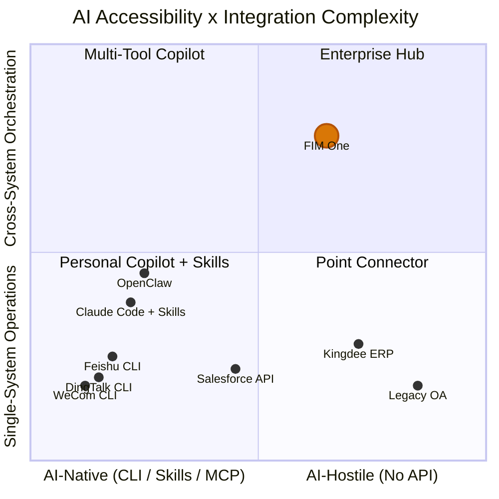

## Le Signal de Mars 2026

En mars 2026, trois grandes plateformes de travail chinoises ont ouvert le code source de leurs outils CLI au cours de la même semaine :

- **DingTalk** a publié `dws` — 104 outils répartis sur 12 domaines métier
- **Feishu/Lark** a publié `lark-cli` — 200+ commandes réparties sur 11 domaines
- **WeCom** a publié `wecom-cli` — couvrant 7 domaines métier

Aucun d'entre eux n'a choisi MCP. Les trois ont livré des outils CLI purs avec des Skills IA pré-packagés distribués via `npx skills add`. C'est la première fois que l'industrie a collectivement montré sa main sur la façon dont les agents IA devraient communiquer avec les systèmes d'entreprise — et la réponse n'était pas un protocole, mais un format de packaging.

Ce document analyse ce que cela signifie pour l'intégration IA-système en général, et pour la stratégie de FIM One spécifiquement.

## Trois paradigmes pour l'intégration système IA

### 1. REST API (Traditionnel)

La base de référence. Chaque plateforme SaaS expose des points de terminaison HTTP documentés avec des spécifications OpenAPI. L'intégration IA nécessite une couche adaptateur — quelque chose qui traduit entre « appeler ce point de terminaison API avec ces en-têtes et ce corps JSON » et « voici un outil que l'agent peut invoquer ».

C'est ce que le ConnectorToolAdapter de FIM One fait aujourd'hui. Cela fonctionne, mais chaque intégration nécessite un travail personnalisé : lire la documentation de l'API, gérer l'authentification, mapper les formats de réponse, gérer la pagination.

- **Qui l'utilise** : Chaque plateforme SaaS, intégrations héritées
- **Intégration IA** : Nécessite une couche adaptateur (ConnectorToolAdapter, code personnalisé)
- **Force** : Universel, bien compris, I/O JSON structuré
- **Faiblesse** : Chaque intégration nécessite un effort de développement personnalisé

### 2. CLI + Skills (Émergent)

La plateforme fournit un binaire CLI compilé. L'intégration IA se fait via des fichiers Skill pré-packagés — des documents markdown qui enseignent aux IDE IA comment invoquer les commandes CLI via subprocess. La distribution se fait via npm : `npx skills add dingtalk/dws`.

L'IA lit le fichier Skill, comprend quelles commandes sont disponibles et quels arguments elles prennent, puis invoque le CLI en tant que subprocess. La sortie est généralement du texte libre (tableaux, chaînes formatées) que l'IA doit analyser.

- **Qui l'utilise** : DingTalk, Feishu, WeCom (tous ont choisi cela en mars 2026)
- **Intégration IA** : `npx skills add platform/cli` — L'IDE IA lit le markdown Skill, invoque les commandes CLI
- **Point fort** : Rapide à déployer, fonctionne avec n'importe quel IDE IA supportant le format Skills
- **Point faible** : Sortie texte non structurée (l'IA doit analyser), pas de protocole de découverte standardisé, portée mono-plateforme

### 3. MCP (Model Context Protocol)

JSON-RPC sur stdio ou SSE. Découverte d'outils structurée (`tools/list`) et invocation (`tools/call`). Le client IA négocie les capacités avec le serveur, obtient un schéma typé pour chaque outil et reçoit des réponses `CallToolResult` structurées.

- **Qui l'utilise** : Écosystème Anthropic, nombre croissant d'outils de développement
- **Intégration IA** : Protocole natif — E/S structurée, découverte basée sur schéma
- **Force** : Standardisé, structuré, composable, conçu pour l'orchestration multi-outils
- **Faiblesse** : Coût d'implémentation plus élevé, pas encore adopté par les grandes plateformes de travail

### Comparaison

| Dimension | API REST | CLI + Skills | MCP |
|-----------|----------|-------------|-----|
| Standardisation | Moyen (OpenAPI) | Faible (Skills spécifiques au fournisseur) | Élevé (protocole JSON-RPC) |
| Convivialité pour l'IA | Faible (nécessite un adaptateur) | Moyen (E/S texte, analysé par l'IA) | Élevé (E/S JSON structuré) |
| Mécanisme de découverte | Spec OpenAPI / docs | `--help` + markdown Skill | Point de terminaison du protocole `tools/list` |
| Format de sortie | JSON structuré | Texte libre (nécessite une analyse par l'IA) | `CallToolResult` structuré |
| Temps de mise en œuvre | Semaines (par intégration) | Jours (encapsuler l'API existante) | Semaines (implémenter le protocole) |
| Orchestration multiplateforme | Nécessite un hub | Non intégré | Non intégré |
| Gouvernance d'entreprise | Nécessite un hub | Non intégré | Non intégré |

## Ce que les grandes plates-formes ont réellement choisi

| | DingTalk `dws` | Feishu `lark-cli` | WeCom `wecom-cli` |
|---|---|---|---|
| Langage | Go | Go + Python | Rust + TS |
| Outils | 104 / 12 domaines | 200+ / 11 domaines | 7 domaines |
| Support MCP | Non | Non | Non |
| Intégration IA | Markdown Skills + introspection de schéma | 19 Skills npm (`npx skills add`) | 12 Skills npm (`npx skills add`) |
| Formats de sortie | JSON / table / raw + `--jq` | JSON / table / csv / ndjson | JSON |
| Drapeaux compatibles avec les agents | `--yes`, `--dry-run`, correction intelligente des entrées | `--no-wait`, `--as user/bot`, `--dry-run` | Paramètres JSON directs |
| Découverte | `dws schema` (auto-introspection) | `lark-cli schema` (auto-introspection) | Via fichiers Skills uniquement |

Observation clé : `npx skills add` devient un canal de distribution de facto pour les intégrations d'outils IA, contournant entièrement MCP. Ces plates-formes ont choisi la rapidité de mise en marché plutôt que la normalisation des protocoles. L'écosystème des IDE IA (Cursor, Claude Code, Windsurf) comprend déjà les fichiers Skills, donc les plates-formes obtiennent une intégration IA immédiate sans avoir à implémenter un serveur de protocole.

## Le spectre d'accessibilité de l'IA

Tous les systèmes ne sont pas également faciles d'accès pour l'IA, et toutes les tâches ne sont pas également simples. Ces deux dimensions définissent où différentes approches d'intégration créent de la valeur.

**Lecture du graphique :**

- **Bas-gauche (Copilote personnel + Skills)** : Plateformes natives de l'IA avec des opérations simples. DingTalk, Feishu et WeCom se regroupent ici — ils livrent leur propre CLI + Skills, rendant l'intégration de l'IA sur une seule plateforme en libre-service. Les copilotes personnels comme OpenClaw et Claude Code with Skills occupent cette zone. FIM One ajoute peu de valeur ici — la plateforme a déjà fait le travail.
- **Haut-gauche (Copilote multi-outils)** : Plateformes natives de l'IA avec des besoins inter-systèmes. Un utilisateur installant plusieurs Skills (`dingtalk` + `feishu` + `wechat`) dans Claude Code peut tenter une coordination multi-plateforme, mais manque de gouvernance, de planification d'orchestration et de gestion unifiée des identifiants.
- **Bas-droit (Connecteur ponctuel)** : Systèmes hérités qui ont besoin d'un simple pont. Un seul Connecteur vers un ERP Kingdee ou un système OA hérité — FIM One est utile ici en tant qu'adaptateur, même pour des opérations sur un seul système, car ces systèmes n'ont pas de CLI et ont une API limitée ou inexistante.
- **Haut-droit (Hub d'entreprise)** : Systèmes hérités ou limités en API avec des exigences d'orchestration inter-systèmes. C'est le point fort de FIM One. Interroger des contrats dans un système de gestion hérité, les corréler avec les créances ERP et envoyer des avis de recouvrement via DingTalk — cela nécessite une planification DAG, une coordination multi-connecteurs, un coffre-fort d'identifiants, des pistes d'audit et des portes de confirmation humaine. Aucun copilote personnel, aucun CLI, aucun fichier Skills ne pourra jamais atteindre cela.

La valeur de FIM One augmente à mesure que vous vous déplacez vers le haut-droit : systèmes plus difficiles d'accès combinés à des besoins d'orchestration plus complexes. Les plateformes qui livrent leur propre CLI + Skills occupent le coin opposé — faciles d'accès, opérations simples — et représentent un marché que FIM One ne devrait pas poursuivre.

## Copilote personnel vs Hub d'entreprise

La prolifération des copilotes IA personnels (OpenClaw, Claude Code, Cursor, Windsurf) soulève une question de positionnement. Deux modèles fondamentalement différents existent :

### Copilote Personnel

- **Utilisateur** : Développeur individuel ou travailleur du savoir
- **Portée des données** : Mon calendrier, mes e-mails, mes documents
- **Authentification** : Mon token personnel, ma session OAuth
- **Portée de l'intégration** : Une seule personne, quelques plateformes, productivité personnelle
- **Gouvernance** : Aucune nécessaire — ce sont mes données, mes actions

### Hub de connecteurs d'entreprise

- **Utilisateur** : Organisation (équipes, départements, flux de travail transversaux)
- **Portée des données** : Inter-départements, inter-systèmes, incluant les données sensibles et réglementées
- **Authentification** : Permissions assignées par l'administrateur, principe du moindre privilège, coffre-fort d'identifiants
- **Portée de l'intégration** : Orchestration multi-systèmes, automatisation des processus métier
- **Gouvernance** : Journaux d'audit, RBAC, portes de confirmation, exigences de conformité

Ces approches sont complémentaires, non concurrentes. À mesure que les copilotes personnels se multiplient, les entreprises auront besoin d'un hub central pour gouverner ce que ces copilotes peuvent consulter. Un utilisateur utilisant Claude Code avec `npx skills add dingtalk/dws` peut lire ses propres messages DingTalk. Mais quand un agent IA doit orchestrer entre DingTalk, l'ERP de l'entreprise et le système financier — avec des pistes d'audit, des contrôles de permissions et une confirmation humaine pour les opérations d'écriture — c'est un problème entièrement différent.

Les copilotes personnels banalisent les opérations simples sur une seule plateforme. Ce n'est pas le marché de FIM One. Le marché de FIM One est l'intégration d'entreprise inter-systèmes, nécessitant une gouvernance, inclusive des systèmes hérités, qu'aucun copilote personnel ne peut gérer.

## Implications stratégiques pour FIM One

| Priorité | Action | Justification |
|----------|--------|-----------|
| Rester le cap | Continuer à investir dans l'architecture Connector pour les systèmes legacy/API | C'est l'avantage concurrentiel — CLI + Skills ne pourront jamais atteindre les systèmes legacy |
| Adopter MCP | Le support MCP Server est déjà intégré (MCPServerMetaTool) — le maintenir en bon état | MCP est le protocole structuré sur lequel on mise ; certaines plateformes l'adopteront éventuellement |
| Surveiller Skills | Suivre l'écosystème `npx skills add` mais ne pas le poursuivre | Skills résolvent un problème de distribution que FIM One n'a pas |
| Se différencier sur la gouvernance | Audit, RBAC, portes de confirmation, gestion des identifiants | Les copilotes personnels n'offriront jamais la gouvernance d'entreprise |
| Positionner clairement | « Le hub où vos systèmes rencontrent l'IA » — pas « une autre façon d'appeler DingTalk » | Éviter de concurrencer sur les intégrations simples que les plateformes offrent gratuitement |

Le pire mouvement stratégique serait de réagir à la vague CLI + Skills en construisant des adaptateurs Skills pour les plateformes qui en fournissent déjà les leurs. C'est une course vers le bas contre les vendeurs de plateformes eux-mêmes. La bonne réponse est de rester concentré sur les systèmes que ces vendeurs ne pourront jamais atteindre.

## La relation entre CLI, Skills et MCP

Ces trois concepts opèrent à différentes couches et sont souvent confondus dans les discussions. Une distinction précise :

- **CLI** est une interface utilisateur — commandes shell, E/S texte, un format d'interaction avec un système
- **Skills** est un mécanisme de distribution — fichiers markdown qui enseignent à l'IA comment invoquer des commandes CLI, un format de packaging pour les intégrations d'outils IA
- **MCP** est un protocole — JSON-RPC, découverte et invocation structurées, une norme d'interopérabilité pour la communication IA-outil

À long terme, ils ne sont pas des substituts les uns aux autres. Un CLI est la façon dont un humain (ou un sous-processus IA) interagit avec un outil. Un fichier Skill est la façon dont ce CLI est distribué dans les IDEs IA. MCP est la façon dont une intégration structurée, typée par schéma et composable fonctionne au niveau du protocole.

Cependant, à court terme (2026), CLI + Skills gagne en vitesse d'adoption car c'est moins cher à implémenter que MCP. Une plateforme avec un CLI existant peut livrer un fichier Skills en un jour. Implémenter un serveur MCP prend des semaines et nécessite de comprendre la spécification du protocole, les couches de transport et la négociation des capacités.

La convergence probable : les plateformes qui livrent des CLIs aujourd'hui pourraient les envelopper en serveurs MCP demain. Le transport stdio de MCP lance déjà des processus CLI — l'écart entre « CLI invoqué par Skills » et « CLI enveloppé en serveur MCP » est faible. Mais cette convergence n'est pas garantie. Si l'écosystème Skills croît assez vite et que les IDEs IA se standardisent autour de lui, MCP pourrait rester un protocole pour les outils de développement plutôt qu'une norme pour les outils d'entreprise.

Pour FIM One, le message est clair : investir dans la couche protocole (MCP) et la couche gouvernance (architecture Connector), pas dans la couche distribution (Skills). La distribution est un problème résolu pour les fournisseurs de plateforme. Le protocole et la gouvernance sont là où un hub crée une valeur durable.
