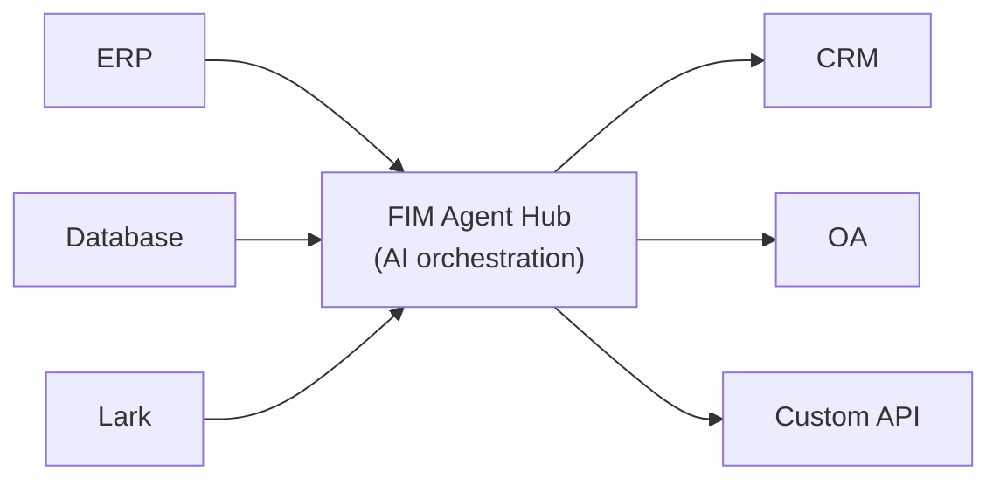

Welcome to FIM Agent, an AI-powered framework for building agents that dynamically plan and execute complex tasks across your enterprise systems.

## What is FIM Agent?

FIM Agent is a provider-agnostic Python framework for building AI agents that work with your existing systems. Unlike workflow builders that ask you to replicate logic, FIM Agent bridges your systems proactively — reading databases, calling APIs, pushing notifications — all through a unified AI interface.

The core insight: **three delivery modes, one agent core**.

## Three Delivery Modes

| Mode | What it is | Delivery | Use Case |
|------|-----------|----------|----------|
| **Standalone** | General-purpose AI assistant — search, code, knowledge base | Portal | Chat, code execution, knowledge base Q&A |
| **Copilot** | AI embedded in a host system — works alongside users in their existing UI | iframe / widget / embed | "Finance Copilot" in your ERP web UI |
| **Hub** | Central cross-system orchestration — all your systems connected | Portal / API | Agent queries ERP, checks OA, notifies via Lark |

## The Hub Architecture

The Hub is the core differentiator — a central portal where all your systems meet AI:

Each connector is a standardized bridge. The agent doesn't know or care whether it's talking to SAP or a custom PostgreSQL database. Your data stays in your systems; FIM Agent provides the AI layer that orchestrates across them.

## Get Started

Explore the next sections to understand FIM Agent's architecture and deploy it:

- **[Quick Start](/quickstart)** — Get FIM Agent running in minutes with Docker or local development
- **[Execution Modes](/concepts/execution-modes)** — Understand Standalone, Copilot, and Hub modes in depth
- **[AI Builder](/concepts/ai-builder)** — Use AI to build Connectors and Agents with natural language
- **[Connector Architecture](/architecture/connector-architecture)** — How FIM Agent connects legacy systems through AI
- **[Philosophy](/architecture/philosophy)** — Why dynamic planning is the right middle ground between rigid workflows and fully autonomous agents
