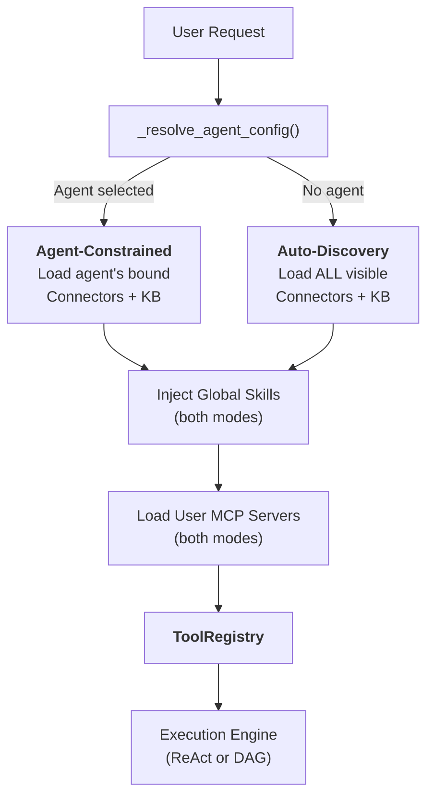
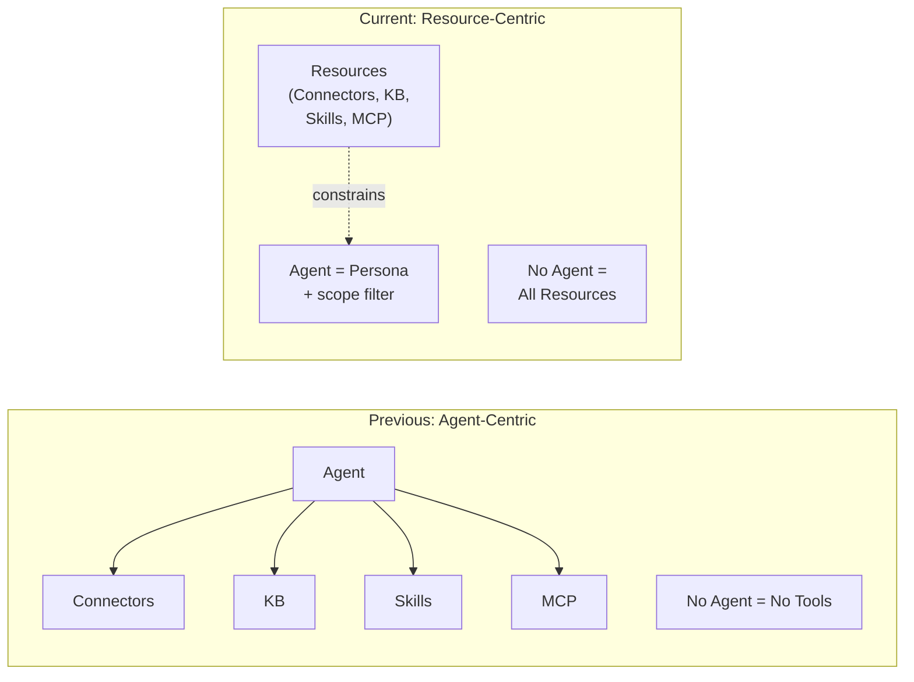
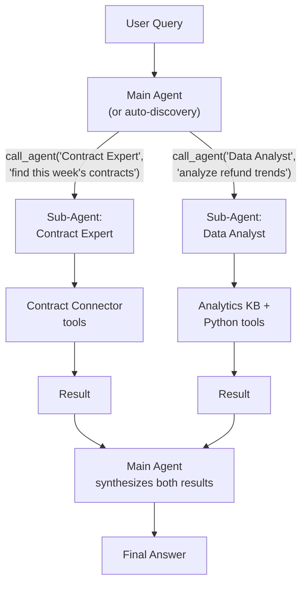
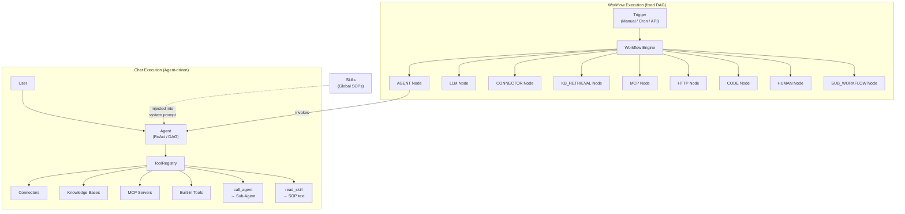

## 2つのモード

FIM Oneのすべてのチャットリクエストは1つの質問から始まります：**エージェントが選択されているか？** この答えによって、リソース（コネクタ、ナレッジベース、スキル、MCPサーバー）がどのように検出され、LLMが使用できるツールセットに組み立てられるかが決まります。

**エージェント制約モード**は、ユーザーが特定のエージェントを選択したときに有効になります。システムは、そのエージェントが明示的に設定されたリソースのみをロードします：

- **コネクタ**：エージェントにバインドされた`connector_ids`のみがツールとしてロードされます。
- **ナレッジベース**：エージェントにバインドされた`kb_ids`のみが取得ツールとして注入されます。
- **スキル**：グローバルに利用可能 — ユーザーに表示されるすべてのアクティブなスキルが注入されます。スキルはエージェント固有の知識ではなく、組織のSOP（標準業務手順）だからです。（下記の[グローバルSOPとしてのスキル](#skills-as-global-sops)を参照してください。）
- **MCPサーバー**：常にユーザースコープ — ユーザーに表示されるすべてのアクティブなMCPサーバーが両方のモードでロードされます。
- **インストラクション**：エージェントの`instructions`フィールドは、システムプロンプトに注入されるペルソナと行動ガイドラインを定義します。

**グローバル自動検出モード**は、エージェントが選択されていない場合（例：新しいチャット）に有効になります。システムはユーザーがアクセス可能なすべてのものを自動検出します：

- **コネクタ**：ユーザーに表示されるすべてのコネクタ（自分のもの + 組織共有 + マーケット購読）がロードされます。
- **ナレッジベース**：アクセス可能なすべてのKBが`kb_retrieve`経由で取得可能です。
- **スキル**：ユーザーに表示されるすべてのアクティブなスキルがSOPスタブとして注入されます。
- **MCPサーバー**：エージェント制約モードと同じ — ユーザーに表示されるすべてのアクティブなサーバー。
- **インストラクション**：汎用アシスタントペルソナが使用されます。

分岐は`_resolve_tools()`内で発生し、これはすべてのチャットリクエストで呼び出されます：



実際の効果：ユーザーはエージェントを設定することなく、すぐにチャットを開始できます。システムは利用可能なリソースを検出し、それらをツールとして公開します。エージェントを選択すると、スコープが絞られます — 新しい機能のロックを解除するのではなく、既存の機能に焦点を当てます。

### 各モードが検出するもの

2つのモードは**スコープ**が異なり、種類は同じです。どちらも `ToolRegistry` を生成しますが、異なる方法で入力されます。

**自動検出モード（エージェント未選択）:**

| リソース | 検出 | ツール形式 |
|---|---|---|
| コネクタ（API） | `resolve_visibility()` — ユーザーに表示されるすべて | `ConnectorMetaTool`（プログレッシブ） |
| コネクタ（DB） | `resolve_visibility()` — ユーザーに表示されるすべて | `DatabaseMetaTool`（プログレッシブ） |
| ナレッジベース | アクセス可能なすべてのKB | `kb_retrieve` |
| スキル | `resolve_visibility()` — すべてのアクティブ | `read_skill`（プログレッシブスタブ） |
| MCPサーバー | `resolve_visibility()` — ユーザーに表示されるすべて | `MCPServerMetaTool`（プログレッシブ） |
| エージェント | `resolve_visibility()` — すべてのアクティブ、非ビルダー | `call_agent`（カタログ） |
| 組み込みツール | `discover_builtin_tools()` — 完全なセット | カテゴリフィルタなし |

**エージェント制約モード（エージェント選択）:**

| リソース | 検出 | ツール形式 |
|---|---|---|
| コネクタ | `agent.connector_ids` のみ | `ConnectorMetaTool` またはレガシー（アクション別） |
| ナレッジベース | `agent.kb_ids` のみ | `GroundedRetrieveTool` / `KBRetrieveTool` |
| スキル | グローバル — **エージェントで制約されない** | `read_skill` |
| MCPサーバー | ユーザースコープ — **エージェントで制約されない** | `MCPServerMetaTool`（プログレッシブ） |
| エージェント | グローバル — `call_agent` 常に利用可能 | `call_agent` |
| 組み込みツール | `agent.tool_categories` フィルタ | カテゴリ別サブセット |

主な非対称性：コネクタとナレッジベースはエージェントでスコープされますが、スキル、MCPサーバー、CallAgentは常にグローバルです。これは設計意図を反映しています — スキルは組織的ルール（すべてのユーザーが同じSOPに従う）であり、コネクタとKBは機能バインディング（異なるエージェントが異なるシステムに接続する）です。

## すべてはツールである

LLMレベルでは、すべてのリソースタイプは呼び出し可能なツールのフラットリストに収束します。LLMは、コネクタ、MCPサーバー、またはナレッジベースを呼び出しているかどうかについての構造的な認識を持ちません。`ToolRegistry`を見ます — 名前、説明、パラメータスキーマを持つ関数のセットです。

| リソースタイプ | LLMレベルでの変換 | ツール名パターン |
|---|---|---|
| Connector (プログレッシブ) | 単一のメタツール | `connector` |
| Connector (レガシー) | アクションごとにNツール | `{connector}__{action}` |
| Database Connector (プログレッシブ) | 単一のメタツール | `database` |
| Database Connector (レガシー) | データベースごとに3ツール | `{db}__list_tables`, `{db}__describe_table`, `{db}__query` |
| MCP Server (プログレッシブ) | 単一のメタツール | `mcp` |
| MCP Server (レガシー) | サーバーごとにNツール | `{server}__{tool}` |
| ナレッジベース | 検索ツール | `kb_retrieve` または `grounded_retrieve` |
| Skill (プログレッシブ) | 読み取りツール + システムプロンプトスタブ | `read_skill` |
| Skill (インライン) | システムプロンプトテキストのみ | _(ツールなし)_ |
| エージェント自体 | ツールとして表示されない | _(指示 + ツールアセンブリ)_ |

重要な洞察: **エージェントはツールではなく、ツールを使用するエンティティです。** エージェントはその指示をシステムプロンプトに寄与し、どのツールが利用可能かを決定します。しかし、LLMの観点からは、「エージェント」という概念は存在しません — システムプロンプトと呼び出し可能な関数のセットのみです。

この均一性がシステムを拡張可能にするものです。新しいリソースタイプを追加することは、`Tool`プロトコル（`name`、`description`、`parameters_schema`、`run()`）を実装することを意味します。実行エンジン、コンテキスト管理、およびLLM相互作用レイヤーは変わりません。

## スキルをグローバルSOPとして

スキルはエージェントの上位レイヤーに位置します。これらは組織のポリシーと手順であり、選択されたエージェントに関係なく、すべてのエージェントが従う必要があります。

### スキルがエージェントにバインドされない理由

「顧客苦情処理 SOP」のようなスキルは、顧客と対話するすべてのエージェントに適用されます。スキルをエージェントにバインドすると、双方向の所有権の問題が生じます。スキルがエージェントをオーケストレーションし、エージェントがスキルを所有する場合、誰が誰を制御するのでしょうか。

スキルはグローバル設計です。これらはエージェント固有の知識ではなく、会社のルールです。`_resolve_tools()` 関数は、エージェント選択に関係なく、ユーザーに表示されるすべてのアクティブなスキルを読み込みます。これは他のリソースに使用されるのと同じ `resolve_visibility()` フィルタを使用します。

### 2つのインジェクションモード

スキルは2つのインジェクションモードをサポートしています -- **progressive**（デフォルト）と**inline** -- これらは`SKILL_TOOL_MODE`またはエージェントの`model_config_json.skill_tool_mode`で制御されます。プログレッシブモードでは、コンパクトなスタブのみがシステムプロンプトに表示され、LLMは必要に応じて`read_skill(name)`を呼び出して完全なコンテンツを読み込みます。これはFIM Oneの広範な[Progressive Disclosure](/architecture/progressive-disclosure)アーキテクチャの一部であり、すべてのリソースタイプ全体でコンテキスト消費を最小化します。

## エージェントはコンテナではなくペルソナ

FIM Oneのアーキテクチャは、エージェント中心モデルからリソース中心モデルへの意図的なシフトを反映しています。

**前のモデル:** エージェントはすべてのリソースへのアクセスをゲートするコンテナでした。エージェントが選択されていない場合、コネクタ、スキル、特殊化されたKBはありません。エージェントはあらゆる機能への必須のエントリーポイントでした。

**現在のモデル:** エージェントはペルソナ — 一連の指示と行動ガイドライン — とオプションのリソース制約の組み合わせです。リソースはエージェントから独立して存在します。エージェントを選択するとスコープが絞られます。選択しないと完全に開かれます。



これは以下を意味します:

- **ユーザーはエージェントを設定することなく、すぐにチャットを開始できます**。
- **システムは利用可能なリソースを自動検出し、ツールとして公開します**。
- **エージェントは軽量なペルソナになります** — 指示を書いて、オプションで特定のコネクタとKBをバインドするだけで、すぐに作成できます。
- **リソース管理はエージェント管理から分離されます**。組織にコネクタを公開すると、自動検出モード、エージェントバインディングドロップダウン、サブエージェントツール解決のすべての場所で利用可能になります。

## マルチエージェント オーケストレーション

FIM One は `CallAgentTool` を使用して、タスクをスペシャリスト エージェントに委譲することをサポートしています。これにより、親エージェント (または自動検出モード) が、フォーカスされたタスクのためにサブエージェントを呼び出すことができます。

### エージェント カタログ

実行時に、ユーザーに表示されるすべてのアクティブな非ビルダー エージェントがカタログに集約されます。各エージェントの名前と説明は `call_agent` ツールのパラメータ スキーマにリストされており、LLM が意味的に適切なスペシャリストを選択できます。ハードコードされたルーティングは不要です。

### 完全なツール継承

サブエージェントが `call_agent(agent_id, task)` 経由で呼び出されると、独自の設定から構築された完全な `ToolRegistry` を受け取ります。これには、バインドされたコネクタ、KB、および組み込みツールが含まれます。サブエージェントは、テキストのみのアドバイザーではなく、完全な実行ユニットです。

### ワンレベルデリゲーション

無限再帰を防ぐため、サブエージェントは `call_agent` ツールを受け取りません。デリゲーションは常に1レベル深いです：親がチャイルドを呼び出し、チャイルドが実行して結果を返します。親は複数のサブエージェントからの結果を統合します。

### 並列実行

ネイティブ関数呼び出しモードでは、LLMは単一のターンで複数の `call_agent` 呼び出しを実行できます。これらは `asyncio.gather` を介して同時に実行され、「3つのソースを同時に検索する」などのパターンを実現します。



## 可視性モデル

すべてのリソース検出 — 両方のモード — は、3つのティアを持つ統一された可視性モデルによって管理されます：

| ティア | 説明 | 例 |
|---|---|---|
| **Own** | ユーザーによって作成されました。常に表示されます。 | チームのAPI用に構築したコネクタ |
| **Organization-shared** | ユーザーの組織からの`visibility: "org"`を持つリソース。すべての承認された組織メンバーに表示されます。 | ITによって公開された社内ERP コネクタ |
| **Market-subscribed** | FIM One Marketからインストールされたリソース。サブスクライバーに表示されます。 | インストールしたコミュニティ構築のSlack コネクタ |

`web/visibility.py`の`resolve_visibility()`関数は、3つのティアすべてを単一のクエリに含むSQLフィルタを構築します：

```python
conditions = [
    model.user_id == user_id,                    # own resources
    and_(model.visibility == "org",              # org-shared
         model.org_id.in_(user_org_ids),
         or_(model.publish_status == None,
             model.publish_status == "approved")),
    model.id.in_(subscribed_ids),                # Market-subscribed
]
```

このフィルタは以下のすべての場所で使用されます：

- エージェントなしモードでのコネクタの自動検出
- `CallAgentTool`のエージェントカタログの構築
- システムプロンプトインジェクション用の表示可能なスキルの読み込み
- MCPサーバー解決
- エージェント設定ルックアップ（ユーザーが表示可能なエージェントのみを選択できることを保証）

この統一性は、**コネクタを組織に公開すると、自動検出モード、エージェントバインディングドロップダウン、およびサブエージェントツール解決で自動的に利用可能になる** ことを意味します — 特別な配線は不要です。可視性モデルは「このユーザーが何にアクセスできるか」の唯一の情報源です。

## 関係図

FIM One には、**チャット（エージェント駆動）** と **ワークフロー（DAG駆動）** という 2 つの並列実行パラダイムがあり、同じ基盤リソースを共有しながら異なる方法でそれらを調整します。



図から得られる重要なポイント：

- **エージェントとワークフローは並列パラダイムです。** 両者ともコネクタ、ナレッジベース、MCP サーバーを使用できますが、メカニズムが異なります。エージェントは `ToolRegistry` 内のツールとして使用し、ワークフローは型付き DAG ノードとして使用します。
- **ワークフローはエージェントを調整できます。** `AGENT` ノード経由で — ワークフロー ステップは独自の ReAct/DAG ループを持つ完全なエージェントを呼び出すことができます。逆は成り立ちません。エージェントはワークフローを直接呼び出すことはできません（API/webhook トリガー経由でのみ間接的に可能）。
- **スキルはエージェントにのみ注入されます。** スキルはシステム プロンプト テキストです — エージェント動作をガイドします。ワークフロー ノードは決定論的ロジックを実行し、LLM ガイド推論ではないため、ワークフローはスキルを使用しません。
- **共有リソース、異なるアクセス パターン。** コネクタはエージェント（`ConnectorToolAdapter` 経由）、ワークフロー（`CONNECTOR` ノード経由）、または同じビジネス プロセス内の両方によって呼び出すことができます — 例えば、ワークフローがエージェントをトリガーし、そのエージェントがワークフローが後のステップでも使用する同じコネクタをクエリします。

## ワークフローエンジン — もう一つの実行パラダイム

このドキュメントはエージェント駆動のチャット実行に焦点を当てていますが、FIM Oneには完全な**ワークフローエンジン**が含まれています — 固定プロセス自動化のための26種類のノードタイプを備えたビジュアルDAGエディタです。

| 側面 | エージェント (チャット) | ワークフロー |
|---|---|---|
| オーケストレーション | LLMが次のステップを動的に決定 | 設計時に定義された固定DAG |
| 最適な用途 | 探索的なタスク、会話、柔軟な推論 | 承認チェーン、スケジュール済みETL、マルチステップ自動化 |
| 呼び出し可能 | コネクタ、KB、MCP、組み込みツール、サブエージェント、スキル | エージェント、コネクタ、KB、MCP、LLM、HTTP、コード、人間の承認、サブワークフロー |
| トリガー | チャットでのユーザーメッセージ | 手動、cronスケジュール、またはAPI/webhook |
| ネスティング | ワンレベルの委譲 (親 → 子エージェント) | SUB_WORKFLOWノードを介した任意のDAG深度 |

この2つのパラダイムは相互補完的です。タスクがオープンエンドの場合はエージェントを使用してください(「今四半期の売上データを分析し、アクションを推奨してください」)。プロセスが既知の場合はワークフローを使用してください(「毎週月曜日、ERPから新しい請求書を取得し、コンプライアンスチェックを実行し、例外を人間のレビュアーにルーティングする」)。ワークフローは、固定パイプライン内で柔軟な推論が必要なステップについて、エージェントを呼び出すことができます。

エージェント実行モードとワークフローノードタイプの詳細については、[実行モード](/concepts/execution-modes)を参照してください。
