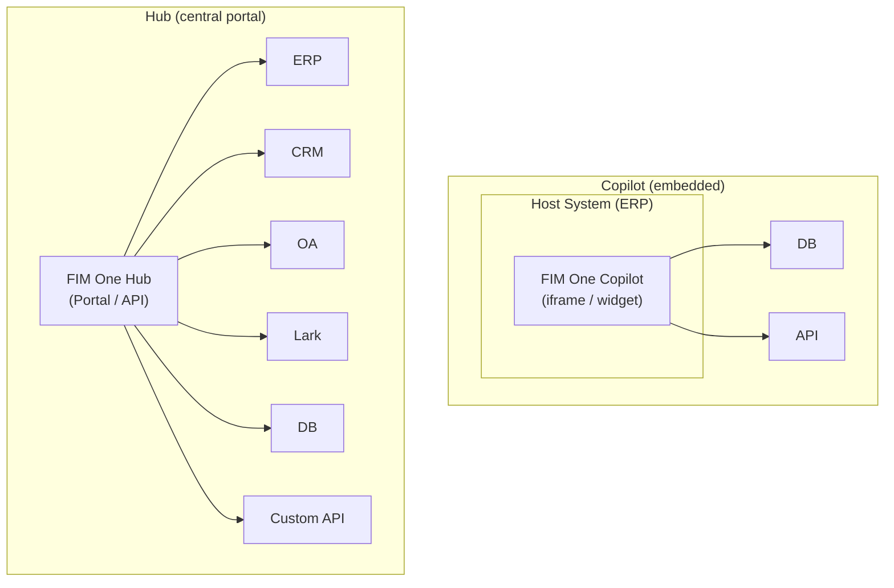
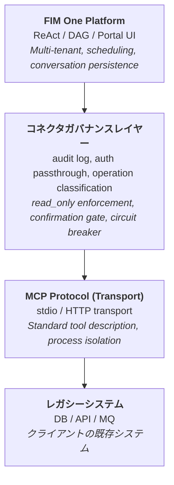
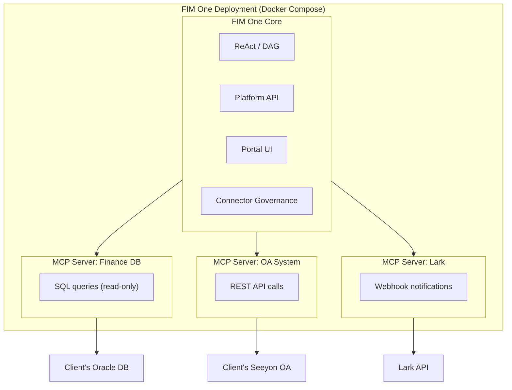
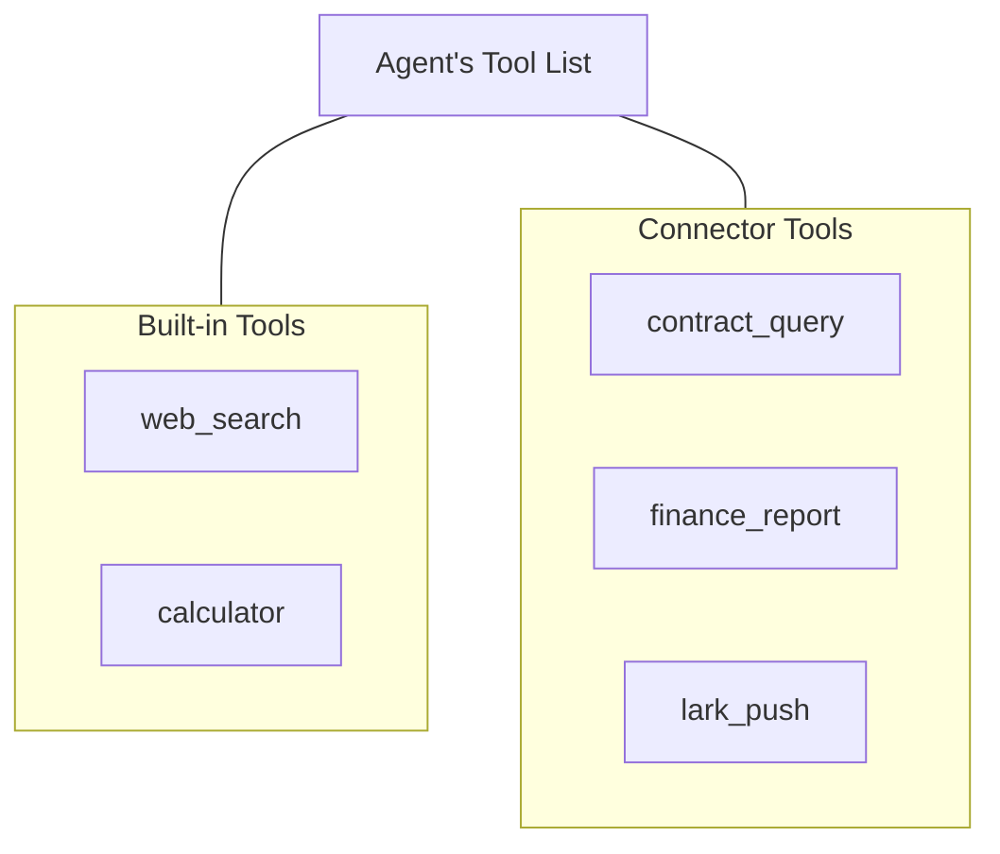
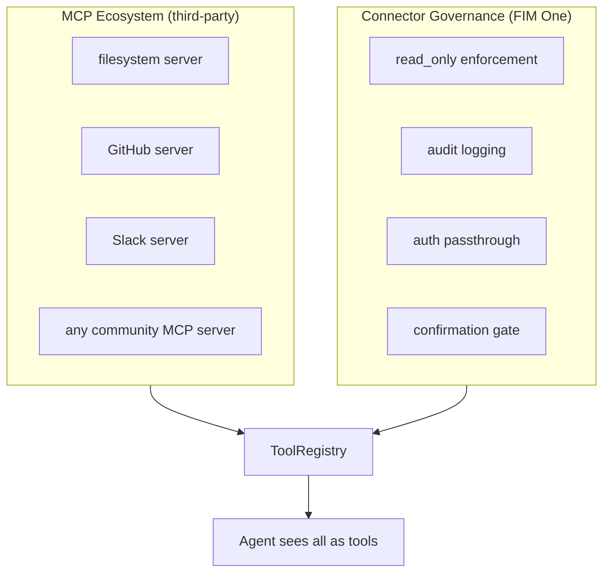

## Copilot vs Hub

アーキテクチャは2つの統合スケールをサポートしています：



**Copilot** はホストシステムのUIに組み込まれます。ユーザーは使い慣れたインターフェースを離れることなくAIと対話できます。複数のコネクタ（ホストDB + 通知サービスなど）を使用できます。

**Hub** はすべてのシステムを接続するスタンドアロンポータルです。単一のシステムに組み込まれるのではなく、システムとAIが出会う中央インテリジェンスレイヤーです。

同じコネクタアーキテクチャ、異なるデリバリー方法です。Copilotはハブと同じ `ConnectorToolAdapter` を使用します。

## コア原則

**クライアントはコードを変更しません。** FIM One はクライアントのシステムにプロアクティブに統合されます。データベースを読み取り、API を呼び出し、メッセージバスにプッシュします。クライアントが提供するのは認証情報とネットワークアクセスのみです。

## 3層アーキテクチャ



各レイヤーは異なる責任を持ちます：

| レイヤー | 担当 | 変更のタイミング... |
|---|---|---|
| **プラットフォーム** | オーケストレーション、マルチテナント、UI | 新しいプラットフォーム機能がリリースされたとき |
| **コネクタガバナンスレイヤー** | エンタープライズガバナンスポリシー | セキュリティ/コンプライアンス要件が変わったとき |
| **MCP Protocol** | トランスポート、ツールインターフェース標準 | なし（オープン標準） |
| **レガシーシステム** | ビジネスデータとロジック | なし（それが目的） |

## なぜ MCP をトランスポート層として使用するのか

アダプターは **MCP サーバー** として実装されています。これは意図的なアーキテクチャ上の選択です：

- **再利用性**: FIM One には既に MCP クライアント (v0.3) が付属しています。レガシーシステムアダプターを追加することは、任意の MCP ツールを追加するのと同じインフラストラクチャを再利用します。
- **標準プロトコル**: MCP はオープンスタンダードです。独自プロトコルを発明または保守する必要がありません。
- **エコシステム**: サードパーティの MCP サーバー（データベース、API、SaaS ツール）がそのまま動作します。
- **プロセス分離**: 各 MCP サーバーは別々のプロセスとして実行されます。不具合のあるアダプターがプラットフォームをクラッシュさせることはできません。

### MCP だけでは提供されないもの

**Connector Governance Layer** は、生の MCP に欠けているエンタープライズガバナンスを追加します:

| 懸念事項 | MCP | Connector Governance Layer |
|---|---|---|
| 読み取り専用の強制 | いいえ | 操作の `read_only` フラグ; デフォルトで書き込みをブロック |
| 監査ログ | いいえ | すべてのツール呼び出しを記録 (タイムスタンプ、ユーザー、ツール、パラメータ、結果) |
| 認証パススルー | いいえ | ホストシステム認証をプロキシ; エージェントはログイン済みユーザーの代わりに動作 |
| 確認ゲート | いいえ | 書き込み操作は人間の承認が必要 (SSE `confirmation_required`) |
| サーキットブレーカー | いいえ | 接続障害がグレースフルデグラデーションをトリガー |
| 操作分類 | いいえ | 操作にレベルごとのポリシーを持つ読み取り/書き込み/管理者としてタグ付け |

### カスタムプロトコルを発明しない理由

プロトコルは汎用品です。技術的価値はアダプタ自体（ドメイン知識、スキーママッピング、エッジケース処理）とガバナンスレイヤー（監査、認証、安全性）にあります。トランスポートプロトコルを発明すると、機能を追加することなくメンテナンスコストが増加します。Stripeはhttpsを使用し、DockerはcgroupsとMCPを使用しています。

## デプロイメントモデル

すべてが単一の Docker Compose デプロイメント内で実行されます。クライアントは何もインストールする必要がありません。



<Note>
すべて FIM One により提供されます。クライアントが提供するのは以下のみです:
- データベース認証情報（読み取り専用アカウントを推奨）
- API エンドポイントとキー（利用可能な場合）
- ネットワークホワイトリストアクセス
</Note>

**アクセス階層**: FIM One はクライアントが提供できるアクセスに適応します:

| クライアントが持つもの | FIM One の接続方法 |
|---|---|
| ドキュメント付き API | HTTP API アダプター（最適な場合） |
| ドキュメントなし API | HTTP API アダプター + 手動スキーママッピング |
| データベースアクセスのみ | データベースアダプター（直接 SQL、デフォルトで読み取り専用） |
| データベース + メッセージバス | データベースアダプター + メッセージプッシュアダプター |

## エージェント-コネクタの分離

エージェントはコネクタを通常のツールとして見ます。ツールが組み込みツール、サードパーティのMCP Server、またはレガシーシステムコネクタであるかどうかを知ったり気にしたりしません。



これは以下を意味します:

- **新しいシステムを追加** = コネクタ設定を追加。エージェントコードは変わりません。
- **コネクタを削除** = 設定を削除。コード変更なし。
- 同じエージェントが単一のタスク内で組み込みツールとコネクタを使用できます。

## ホットプラグ進化

| バージョン | 新しいコネクタの追加方法 | 再起動が必要? |
|---|---|---|
| **v0.6** | Connector Governance Layer を備えた Python MCP Server を作成し、docker-compose に追加 | 再デプロイ |
| **v0.8** | YAML/JSON 設定を作成し、プラットフォームが MCP Server を生成 | 再起動 |
| **v1.0** | OpenAPI 仕様をアップロード、AI が設定を自動生成 | **再起動不要（ホットプラグ）** |

エンタープライズデプロイメントは「一度実装したら数ヶ月間実行」という性質があります。ホットプラグは v1.0 の利便性であり、v0.6 の要件ではありません。

## データフロー例

ユーザー: 「財務システムから期限切れの契約をすべて確認し、Larkに概要を送信してください。」

```
1. User sends message via Portal / API

2. FIM One (ReAct mode):
   Think: I need to query the finance DB for overdue contracts, then push to Lark.

3. Act: contract_query(status="overdue", days_past_due=">30")
   → Connector Governance: audit log, read_only check (pass)
   → MCP Server: translates to SQL
   → Client DB: SELECT * FROM contracts WHERE status='overdue' AND ...
   ← Returns 7 overdue contracts

4. Think: Found 7 overdue contracts. I'll summarize and push.

5. Act: lark_push(message="7 overdue contracts found: ...")
   → Connector Governance: audit log, write operation → confirmation gate
   → User approves via Portal
   → MCP Server: POST to Lark webhook
   ← Push successful

6. Answer: "Found 7 overdue contracts. Summary pushed to Lark group."
```

## コネクタ標準化レベル

| レベル | バージョン | アプローチ | 構築者 |
|---|---|---|---|
| **レベル 1** | v0.6 | Python MCP Server with Connector Governance | FIM One 開発者 |
| **レベル 2** | v0.8 | YAML/JSON config、プラットフォームが MCP Server を自動生成 | 実装エンジニア (Python 不要) |
| **レベル 3** | v1.0 | OpenAPI/Swagger スペックをアップロード、AI が設定を生成 | AI (人間によるレビュー付き) |

## 既存のMCPエコシステムとの関係

FIM One の MCP クライアント（v0.3 で提供）は、すでにサードパーティの MCP サーバーをサポートしています。レガシーシステムアダプターは、Connector Governance Layer で構築された**ドメイン固有の MCP サーバー**であり、エンタープライズガバナンスのために設計されています。



Connector Governance Layer は MCP に置き換わるものではなく、エンタープライズレガシーシステム統合に必要なガバナンスレイヤーで MCP を拡張するものです。
