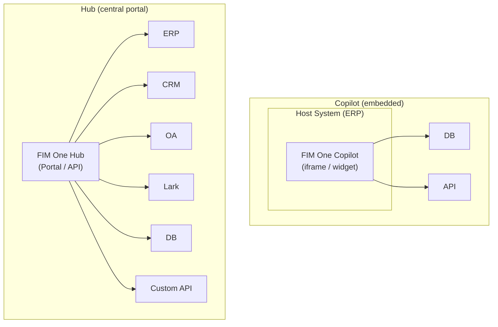
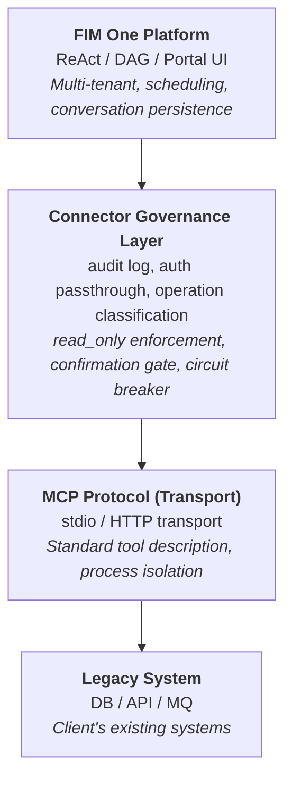
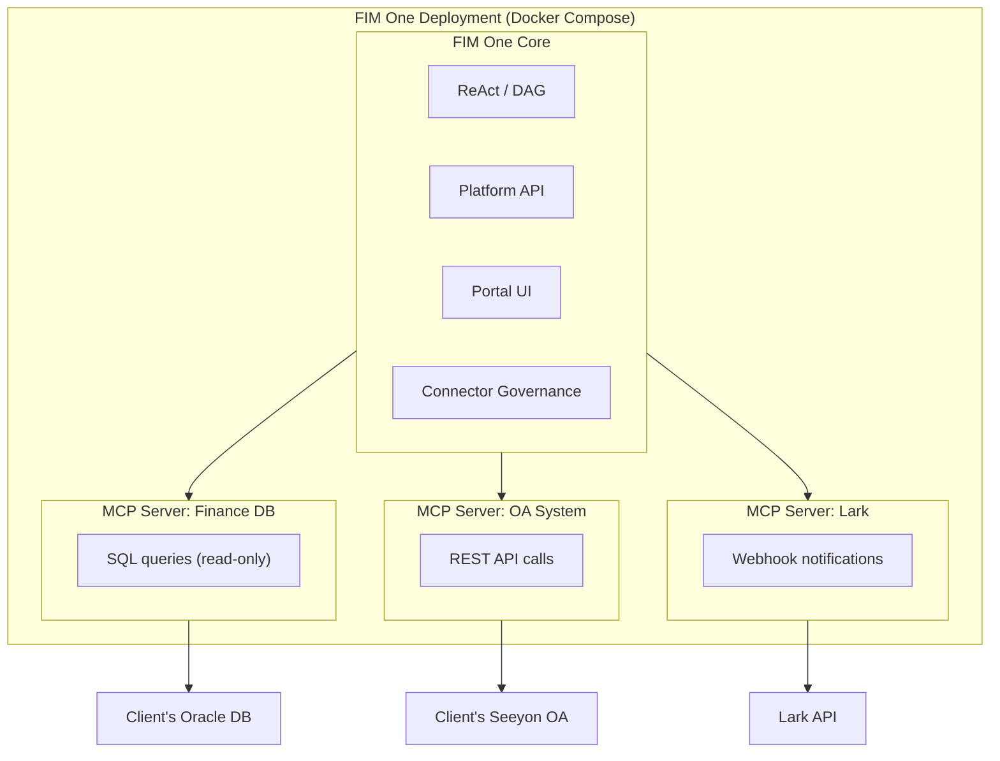
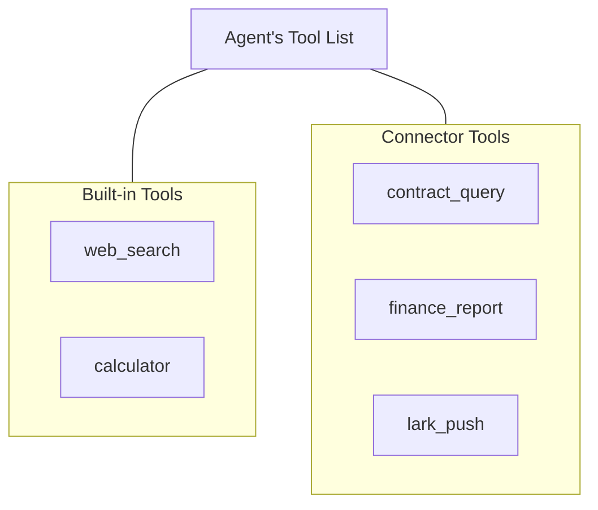
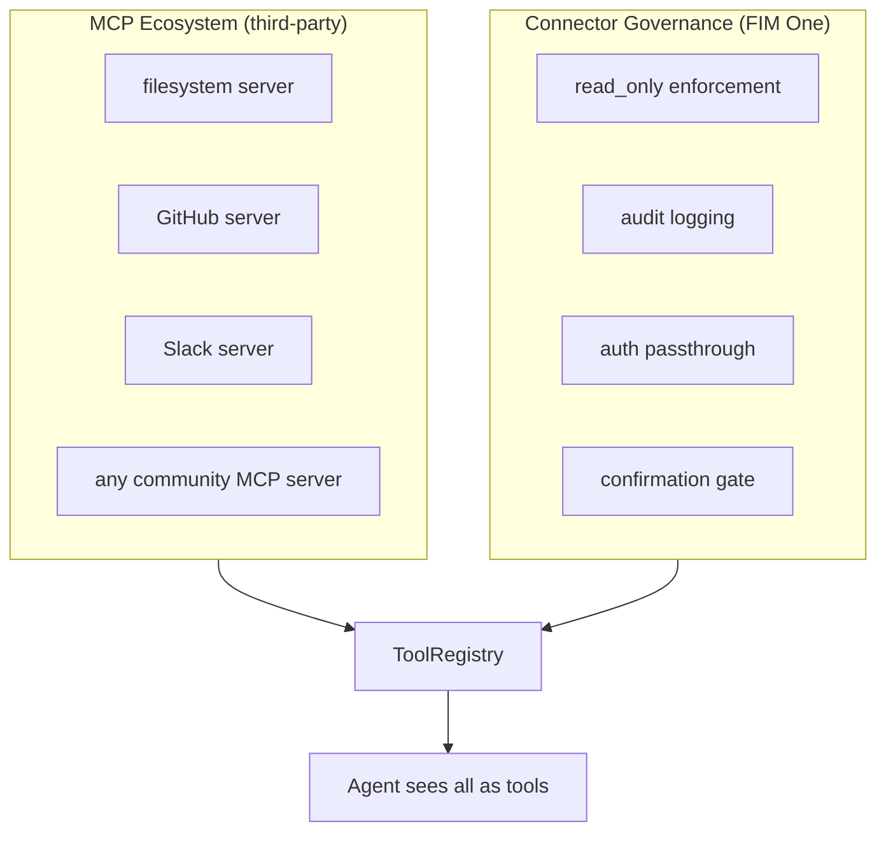

---
title: "コネクタアーキテクチャ"
description: "FIM OneがAIを通じてレガシーシステムを接続する方法 — Copilotからハブまで。"
---## Copilot vs Hub

アーキテクチャは2つの統合スケールをサポートしています：



**Copilot** はホストシステムのUIに組み込まれます。ユーザーは使い慣れたインターフェースを離れることなくAIと対話できます。複数のコネクタ（ホストDB + 通知サービスなど）を使用できます。

**Hub** はすべてのシステムを接続するスタンドアロンポータルです。単一のシステムに組み込まれるのではなく、システムとAIが出会う中央インテリジェンスレイヤーです。

同じコネクタアーキテクチャ、異なるデリバリー。CopilotはHubと同じ `ConnectorToolAdapter` を使用します。## コア原則

**クライアントはコードを変更しません。** FIM One は彼らのシステムにプロアクティブに統合されます -- 彼らのデータベースを読み取り、彼らの API を呼び出し、彼らのメッセージバスにプッシュします。クライアントが提供するのは認証情報とネットワークアクセスのみです。## Three-Layer Architecture



各レイヤーは異なる責任を持ちます：

| レイヤー | 所有 | 変更される場合... |
|---|---|---|
| **Platform** | オーケストレーション、マルチテナント、UI | 新しいプラットフォーム機能がリリースされる |
| **Connector Governance Layer** | エンタープライズガバナンスポリシー | セキュリティ/コンプライアンス要件が変更される |
| **MCP Protocol** | トランスポート、ツールインターフェース標準 | 変更されない（オープン標準） |
| **Legacy System** | ビジネスデータとロジック | 変更されない（それが全体のポイント） |## MCP を転送層として使用する理由

アダプターは **MCP サーバー** として実装されます。これは意図的なアーキテクチャ上の選択です：

- **再利用性**: FIM One には既に MCP クライアント (v0.3) が付属しています。レガシーシステムアダプターを追加することは、任意の MCP ツールを追加するのと同じインフラストラクチャを再利用します。
- **標準プロトコル**: MCP はオープンスタンダードです。独自プロトコルを発明または保守する必要はありません。
- **エコシステム**: サードパーティの MCP サーバー (データベース、API、SaaS ツール) がそのまま動作します。
- **プロセス分離**: 各 MCP サーバーは別々のプロセスとして実行されます。不具合のあるアダプターがプラットフォームをクラッシュさせることはできません。### MCP だけでは提供されないもの

**Connector Governance Layer** は、生の MCP に欠けているエンタープライズガバナンスを追加します:

| 懸念事項 | MCP | Connector Governance Layer |
|---|---|---|
| 読み取り専用の強制 | いいえ | 操作に `read_only` フラグ; 書き込みはデフォルトでブロック |
| 監査ログ | いいえ | すべてのツール呼び出しを記録 (タイムスタンプ、ユーザー、ツール、パラメータ、結果) |
| 認証パススルー | いいえ | ホストシステム認証をプロキシ; エージェントはログイン済みユーザーの代わりに動作 |
| 確認ゲート | いいえ | 書き込み操作は人間の承認が必要 (SSE `confirmation_required`) |
| サーキットブレーカー | いいえ | 接続失敗はグレースフルデグラデーションをトリガー |
| 操作分類 | いいえ | 操作は読み取り/書き込み/管理でタグ付け、レベルごとのポリシー |### カスタムプロトコルを発明しない理由

プロトコルは商品です。技術的な価値はアダプタ自体（ドメイン知識、スキーママッピング、エッジケース処理）とガバナンスレイヤー（監査、認証、安全性）にあります。トランスポートプロトコルを発明すると、機能を追加することなくメンテナンスコストが増加します。Stripeはhttpsを使用しており、DockerはcgroupsとMCPを使用しており、FIM OneはMCPを使用しています。## デプロイメントモデル

すべてが単一の Docker Compose デプロイメントで実行されます。クライアントは何もインストールしません。



<Note>
すべて FIM One により提供されます。クライアントが提供するのは以下のみです：
- データベース認証情報（読み取り専用アカウントを推奨）
- API エンドポイントとキー（利用可能な場合）
- ネットワークホワイトリストアクセス
</Note>

**アクセス階層**: FIM One はクライアントが提供できるアクセスに適応します：

| クライアントが持つもの | FIM One の接続方法 |
|---|---|
| ドキュメント付き API | HTTP API アダプター（最良のケース） |
| ドキュメントなし API | HTTP API アダプター + 手動スキーママッピング |
| データベースアクセスのみ | データベースアダプター（直接 SQL、デフォルトで読み取り専用） |
| データベース + メッセージバス | データベースアダプター + メッセージプッシュアダプター |## エージェント-コネクタの分離

エージェントはコネクタを通常のツールとして認識します。ツールが組み込み、サードパーティの MCP Server、またはレガシーシステムコネクタであるかどうかを知ったり、気にしたりしません。



これは以下を意味します:

- **新しいシステムを追加** = コネクタ設定を追加。エージェントコードは変わりません。
- **コネクタを削除** = 設定を削除。コード変更なし。
- 同じエージェントが単一のタスクで組み込みツールとコネクタを使用できます。## ホットプラグ進化

| バージョン | 新しいコネクタの追加方法 | 再起動が必要? |
|---|---|---|
| **v0.6** | Connector Governance LayerでPython MCP Serverを作成し、docker-composeに追加 | 再デプロイ |
| **v0.8** | YAML/JSONコンフィグを作成し、プラットフォームがMCP Serverを生成 | 再起動 |
| **v1.0** | OpenAPI specをアップロード、AIが自動的にコンフィグを生成 | **再起動不要（ホットプラグ）** |

エンタープライズデプロイメントは「一度実装したら数ヶ月間実行」という想定です。ホットプラグはv1.0の利便性であり、v0.6の要件ではありません。## データフロー例

ユーザー: 「財務システムから期限切れの契約をすべて確認し、Larkに概要をプッシュしてください。」

```
1. ユーザーがPortal / API経由でメッセージを送信

2. FIM One (ReAct mode):
   Think: 財務DBで期限切れの契約をクエリし、Larkにプッシュする必要があります。

3. Act: contract_query(status="overdue", days_past_due=">30")
   → Connector Governance: 監査ログ、読み取り専用チェック (合格)
   → MCP Server: SQLに変換
   → Client DB: SELECT * FROM contracts WHERE status='overdue' AND ...
   ← 7件の期限切れ契約を返す

4. Think: 7件の期限切れ契約が見つかりました。概要をまとめてプッシュします。

5. Act: lark_push(message="7 overdue contracts found: ...")
   → Connector Governance: 監査ログ、書き込み操作 → 確認ゲート
   → ユーザーがPortal経由で承認
   → MCP Server: Lark webhookにPOST
   ← プッシュ成功

6. Answer: "Found 7 overdue contracts. Summary pushed to Lark group."
```## Connector標準化レベル

| Level | Version | Approach | Who builds it |
|---|---|---|---|
| **Level 1** | v0.6 | Python MCP Server with Connector Governance | FIM One developer |
| **Level 2** | v0.8 | YAML/JSON config, platform auto-generates MCP Server | Implementation engineer (no Python needed) |
| **Level 3** | v1.0 | Upload OpenAPI/Swagger spec, AI generates config | AI (with human review) |## 既存のMCPエコシステムとの関係

FIM One の MCP Client（v0.3で提供）は、すでにサードパーティの MCP Servers をサポートしています。レガシーシステムアダプターは、単に Connector Governance Layer で構築された**ドメイン固有の MCP Servers**であり、エンタープライズガバナンスのために設計されています。



Connector Governance Layer は MCP に置き換わるものではなく、エンタープライズレガシーシステム統合に必要なガバナンスレイヤーで MCP を拡張するものです。