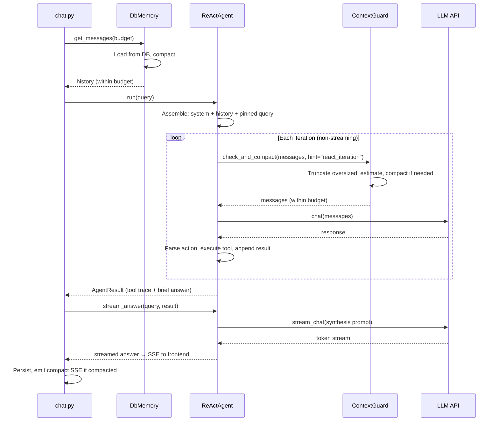
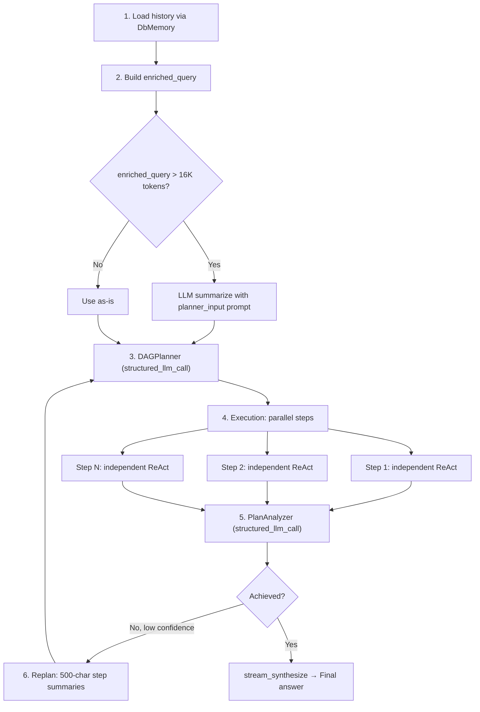

---
title: "コンテキスト管理"
description: "FIM Oneがどのように会話コンテキストを管理するか — トークンオーバーフローを防ぎながら会話品質を保つ5層の多層防御システム。"
---## 問題

LLM には有限のコンテキストウィンドウがあります。128K トークンモデルは寛容に聞こえますが、出力予算、システムプロンプト、ツール説明、マルチターン会話の蓄積された履歴を差し引くと話は別です。長い会話、大きなツール結果、マルチステップエージェントループはすべてこの制限に対して圧力をかけます — 多くの場合、単一セッション内で。

素朴な解決策は切り詰めです：ウィンドウが満杯になったら古いメッセージを削除します。これは高速で予測可能ですが、コンテキストを無差別に破壊します。ユーザーの元の意図、以前のターンからの重要な決定、重要なデータポイントはすべて、単純な文字切り詰めがそれらに当たるときに消えます。反対の極端 — 毎ターン LLM 駆動の要約 — は意味的なコンテンツを保持しますが、高価で遅く、独自の障害モード（幻覚された要約、失われた数値精度）を導入します。

真の課題は「ウィンドウに収まる」ことではありません。それは：**重要な情報を失わずに、不要な圧縮にトークンを浪費せずに、ユーザーが感じることができるレイテンシを追加せずに、優雅に劣化する。**

FIM One はこれを 5 層の多層防御アーキテクチャで解決します。各層は問題の異なるスケールに対処し、きれいに構成されます — 単一の層が完璧である必要はありません。次の層がそれが見落とすものをキャッチするからです。## 5つの防御層

コンテキスト管理は単一のメカニズムではありません。これはスタックであり、各層は特定の粒度で特定の関心事を処理します。

| 層 | コンポーネント | 機能 | 動作タイミング |
|-------|-----------|-------------|-------------|
| **5** | Budget Configuration | モデル仕様から使用可能な入力トークン予算を計算 | スタートアップ時 / リクエストごと |
| **4** | DbMemory | 永続化された履歴を読み込み、読み込み時にコンパクト化 | リクエストごとに1回 |
| **3** | ContextGuard | 反復ごとの予算強制 | すべてのReAct反復 |
| **2** | CompactUtils | トークン推定、スマート切り詰め、LLMコンパクト化 | 層3と4によって呼び出し |
| **1** | Memory Implementations | 抽象インターフェース + 具体的な戦略 | フレームワークレベル |

層は下から上へ番号付けされています。これは上位層が下位層に依存するためです。層5が予算を設定します。層4は初期ロード時のコンパクト化を実行します。層3は反復ごとに予算を強制します。層2と1は層3と4が使用するプリミティブを提供します。

```mermaid
flowchart TD
    L5["Layer 5: Budget Configuration<br/><i>context_size - max_output - 4K reserve</i>"]
    L4["Layer 4: DbMemory<br/><i>Load history, compact on load</i>"]
    L3["Layer 3: ContextGuard<br/><i>Per-iteration enforcement</i>"]
    L2["Layer 2: CompactUtils<br/><i>Estimation, truncation, LLM compact</i>"]
    L1["Layer 1: Memory Implementations<br/><i>BaseMemory, WindowMemory, SummaryMemory, DbMemory</i>"]

    L5 -->|"budget"| L4
    L5 -->|"budget"| L3
    L4 -->|"calls"| L2
    L3 -->|"calls"| L2
    L4 -.->|"implements"| L1
```### Layer 5 — Budget Configuration

予算は3つの値から計算されます:

```
usable_input_tokens = context_size - max_output_tokens - system_prompt_reserve
```

デフォルト値: `128,000 - 64,000 - 4,000 = 60,000 tokens`。

4,000トークンのシステムプロンプトリザーブは、agentのシステムプロンプト、ツール説明、およびフォーマットオーバーヘッドをカバーします。これは固定定数です — システムプロンプトのクリッピングを実際に回避するのに十分な余裕がありながら、予算を無駄にしないほど小さくなっています。

予算値は3つのソースから取得でき、優先順に解決されます:

1. **Database ModelConfig** — 管理者が設定したモデルごとの `context_size` と `max_output_tokens`。
2. **Environment variables** — `LLM_CONTEXT_SIZE` と `LLM_MAX_OUTPUT_TOKENS`。
3. **Hardcoded defaults** — 128Kコンテキスト、64K出力。

メインLLMと高速LLMは独立した予算を持ちます。DAGステップ実行は高速LLMの予算を使用し、ReActモードはメインLLMの予算を使用します。これが重要なのは、オペレータが履歴が蓄積するReActに対して大規模コンテキストモデルを、各ステップが新規に開始するDAGステップに対して小規模で高速なモデルをペアリングすることが多いためです。

4,000トークンの下限が適用されます — 設定ミスの値がより小さい予算を生成する場合、システムはサイレントに失敗するのではなく、4Kにクランプします。### Layer 4 — DbMemory

`DbMemory` は本番環境のメモリ実装です。データベースから永続化された会話履歴を読み込み、エージェントが見る前にトークン予算に合わせてコンパクト化します。

設計は**意図的に読み取り専用**です。永続化は `chat.py` で処理されます — API層は完全なメッセージライフサイクル（メタデータ、使用状況追跡、画像添付を含む）を所有しています。`DbMemory` は読み込みのみを行います。その `add_message()` と `clear()` メソッドはノーオペレーションです。この分離により二重書き込みを防ぎ、永続化ロジックを1つの場所に保ちます。

読み込み時、`DbMemory` は以下を実行します：

1. 会話のすべての `user` と `assistant` メッセージをクエリし、作成時刻順に並べます。
2. 末尾のユーザーメッセージ（エージェントが再度追加する現在のクエリ）を削除します。
3. 画像添付を再構築します — 画像を含むユーザーメッセージはメタデータ（`file_id`、`mime_type`）をデータベースに保存し、`DbMemory` はディスクからbase64データURLを再構築して、LLMが以前のターンからの画像を「見る」ことができるようにします。
4. コンパクト化：`compact_llm` が提供された場合、`CompactUtils.llm_compact()` を使用します。それ以外の場合は、`CompactUtils.smart_truncate()` にフォールバックします。

コンパクト化後、`DbMemory` は追跡フラグ（`was_compacted`、`_original_count`、`_compacted_count`）を設定し、SSE層がこれを使用してフロントエンドに `compact` イベントを発行します。### Layer 3 — ContextGuard

`ContextGuard` は反復ごとの予算強制ツールです。スタンドアロン ReAct モードと DAG ステップ内の各サブエージェントの両方で、すべての ReAct 反復の最初に呼び出されます。これはメッセージが LLM API に到達する前の最後の防御線です。

強制は 3 段階のプロセスに従います：

1. **サイズが大きすぎる個別メッセージを切り詰める。** 50K 文字を超える単一メッセージは、`[Truncated]` サフィックス付きでハード切り詰めされます。これは暴走するツール出力をキャッチします — Web スクレイピングが Web ページ全体を返す場合、ファイル読み取りが大規模なデータセットをダンプする場合などです。

2. **総トークン数を推定する。** 合計が予算内に収まる場合は、すぐに戻ります。ほとんどの反復はここで通過します — コンパクション は例外であり、常識ではありません。

3. **予算を超えた場合はコンパクションする。** `compact_llm` が利用可能な場合は、ヒント固有のプロンプトを使用して LLM 駆動のコンパクションを使用します。それ以外の場合は、`smart_truncate` にフォールバックします。

**ヒント システム** は、ContextGuard を万能ではなくコンテキスト認識にするものです。状況が異なれば、コンパクション戦略も異なります：

| ヒント | 使用者 | 保持 | 削除 |
|------|---------|-----------|-------|
| `react_iteration` | ReAct エージェント ループ | 最近の推論チェーン、現在の目標、重要なデータ | 古い冗長なステップ、失敗した再試行、詳細なツール出力 |
| `planner_input` | DAG エンリッチド クエリ | ユーザー インテント の進化、主要な決定、制約 | 対話の詳細、挨拶、ツール呼び出しメカニクス |
| `step_dependency` | DAG ステップ コンテキスト | 主要なデータ、数値、結論 | 推論プロセス、失敗した試行、詳細なフォーマット |
| `general` | デフォルト フォールバック | 主要な事実、決定、ツール結果 | 挨拶、フィラー、冗長なやり取り |

各ヒントは、コンパクション LLM に何を保持し何を破棄するかを指示する、注意深く作成されたシステム プロンプトにマップされます。プロンプトは「会話と同じ言語で書く」で終わります — これは CJK ユーザーの場合、サマリーがそれ以外の場合は英語にデフォルトされるため重要な詳細です。

LLM コンパクションが失敗した場合（ネットワーク エラー、空の応答、例外）、ContextGuard は `smart_truncate` に静かにフォールバックします。エージェントは失敗を見ることはありません。これは意図的な信頼性の選択です：ヒューリスティック切り詰めによってコンテキストを失う方が、反復をクラッシュさせるよりも良いです。### Layer 2 — CompactUtils

`CompactUtils` はステートレスなユーティリティクラスです。インスタンスもなく、状態もなく、純粋な関数のみです。レイヤー 3 と 4 が構築する 3 つの機能を提供します。

**トークン推定** は、トークナイザーライブラリをインポートせずにテキストをおおよそのトークン数に変換します。ヒューリスティックは以下の通りです:

- ASCII 文字: ~1 トークンあたり 4 文字
- CJK / 非 ASCII 文字: ~1 トークンあたり 1.5 文字
- 画像: 画像あたり 765 トークン (固定コスト)
- メッセージごとのオーバーヘッド: 4 トークン (ロールマーカー、デリミタ)

**`smart_truncate`** はヒューリスティックフォールバックです。ピン留めされたメッセージを無条件に保持し、その後、ピン留めされていないメッセージを逆向きに走査し、予算が尽きるまで蓄積します。結果は、会話のサフィックスで、予算内に収まります。また、結果が先行するユーザーメッセージのないアシスタントメッセージで始まらないようにします。孤立したアシスタントターンは LLM を混乱させます。

**`llm_compact`** は LLM を使用したパスです。メッセージを 3 つのグループに分割します。システムメッセージ (常に保持)、ピン留めされたメッセージ (常に保持)、およびコンパクト化可能なメッセージです。最も古いコンパクト化可能なメッセージは、単一の `[Conversation summary]` システムメッセージに要約されます。最新の 4 つのメッセージは逐語的に保持されます。コンパクト化された結果がまだ長すぎる場合、コンパクト化された出力に対して `smart_truncate` にフォールバックします。二重の安全装置です。### Layer 1 — Memory Implementations

メモリレイヤーは `BaseMemory` インターフェースを定義します: `add_message()`、`get_messages()`、`clear()`。3つの実装が存在します:

- **WindowMemory** — カウントベースのスライディングウィンドウ。最後のN個の非システムメッセージを保持します。シンプルで予測可能、LLM呼び出しなし。本番環境では使用されていません。テストとステートレスシナリオに有用です。

- **SummaryMemory** — メッセージ数がしきい値を超えるとLLM要約をトリガーします。古いメッセージを `[Conversation summary]` システムメッセージに圧縮します。本番環境では使用されていません。より洗練されたContextGuardアプローチより前のものです。

- **DbMemory** — 本番実装（Layer 4で説明）。データベースバックアップ、読み取り専用、ロード時のLLMまたはヒューリスティック圧縮。

WindowMemoryとSummaryMemoryはコードベースに残っています。これらはテストに有用なプリミティブとして機能し、WebレイヤーなしでFIM Oneのコアライブラリを組み込むユーザーのためです。これらはデッドコードではなく、アーキテクチャが成長した基本的なケースです。## ReActを通じたコンテキストフロー

ReActエージェントは、ロード時と反復時の2つの異なるフェーズでコンテキスト管理を使用します。



ツール反復は高速化のため非ストリーミング`chat()`を使用し、回答の合成は`stream_answer()`経由でストリーミング`stream_chat()`を使用します。この2フェーズの分割（高速ツールループの後にストリーミング合成）は、レイテンシとユーザー体験の両方を最適化します。デュアルモード実行とツール選択を含むReActエンジンの完全なアーキテクチャについては、[ReAct Engine](/architecture/react-engine)を参照してください。

重要な洞察：**DbMemoryは履歴コンテキストの問題（前のリクエストからのターン）を処理し、ContextGuardはリクエスト内の成長の問題（エージェントループ中に蓄積するツール結果）を処理します。** これらは異なるタイムスケールで動作し、異なる障害モードをキャッチします。

ユーザーの現在のクエリは常に`pinned=True`としてマークされます。これにより、すべての圧縮を通じて生き残ることが保証されます。`smart_truncate`と`llm_compact`の両方は、ピン留めされたメッセージを無条件に保持します。履歴がどれほど積極的に圧縮されても、ユーザーの実際の質問は決して失われません。## DAGを通じたコンテキストフロー

DAGモードはReActとは根本的に異なるコンテキスト形状を持っています。1つの長い会話スレッドではなく、ツリー構造になっています：計画フェーズ、複数の並列実行ステップ、分析フェーズです。各フェーズには独自のコンテキスト管理戦略があります。



**フェーズ1 — 履歴の読み込み。** DbMemoryは会話履歴を読み込んでコンパクト化します。これはReActと同じです。コンパクト化された履歴は`"Previous conversation:"`というプレフィックスが付いたテキストブロックにフォーマットされます。

**フェーズ2 — 拡張クエリの構築。** 履歴テキストと現在のクエリが`enriched_query`に結合されます。これが16Kトークンを超える場合、`planner_input`ヒントプロンプトを使用してLLMで要約されます。16Kの閾値が選ばれた理由は、プランナーが単一パスでクエリ全体を読む必要があるためです。ReActと異なり、計画中の反復的なコンパクト化はありません。

**フェーズ3 — 計画。** プランナーは2メッセージプロンプトを受け取ります：システムプロンプトと拡張クエリです。ここではContextGuardはありません。拡張クエリは既に16Kチェックによってサイズが制御されています。

**フェーズ4 — ステップ実行。** 各DAGステップは独自のContextGuardを持つ独立したReActエージェントとして実行されます。重要なのは、これらのサブエージェントは**メモリを持たない**ということです。タスク説明と依存関係コンテキストのみで新たに開始します。これは意図的な設計です：DAGステップは自己完結した作業単位であるべきです。依存関係の結果は`_build_step_context`を介して注入され、ContextGuardの`max_message_chars`制限である50Kで文字数が切り詰められます。

**フェーズ5 — 分析。** ステップ結果はアナライザーLLM用にフォーマットされ、ステップごとに10K文字で切り詰められます。これにより、単一ステップの冗長な出力が分析コンテキストを支配するのを防ぎます。

**フェーズ6 — 再計画。** アナライザーが目標が達成されず、信頼度が閾値以下であると判断した場合、ステップ結果は再計画コンテキスト用に各500文字に切り詰められます。再計画は*何が起こったのか*と*何が問題だったのか*を知る必要があり、すべてのステップの出力の完全な詳細は必要ありません。この積極的な切り詰めにより、再計画プロンプトはプランナーが効率的に処理できるほどコンパクトに保たれます。

DAGパイプラインアーキテクチャ全体（LLMコールマップと再計画ロジックを含む）については、[DAG Engine](/architecture/dag-engine)を参照してください。## ピン留めされたメッセージ

ピン留めメカニズムは、生き残る必要があるメッセージがコンパクション処理によって破棄されるのを防ぎます。2つのカテゴリーのメッセージがピン留めされます:

1. **現在のユーザークエリ** — 常にピン留めされます。ユーザーが質問をして履歴が長すぎる場合、システムは履歴を圧縮し、質問は圧縮しません。

2. **ストリーム中に注入されたメッセージ** — ユーザーがエージェント実行中にフォローアップを送信すると、注入されたメッセージはピン留めされ、エージェントは次の反復で見ることができます。

ピン留めのリスクは蓄積です。多くの注入されたメッセージを含む長いセッションでは、ピン留めされたコンテンツが予算の大部分を消費し、実際の会話履歴の余地がなくなる可能性があります。ContextGuardはハードキャップでこれに対処します: **ピン留めされたトークンが予算の50%を超える場合、最も古い注入されたメッセージはピン留めが解除され、コンパクト可能なプールに移動されます。** 最新のピン留めされたメッセージ(現在のクエリ)のみが保持されます。

これはトレードオフです。古い注入されたメッセージのピン留めを解除すると、それらが要約または切り詰められる可能性があります。しかし、別の方法 — ピン留めされたメッセージが他のすべてのコンテキストを圧倒するのを許可する — はさらに悪いです。システムは最新のコンテキストを保持することに偏っており、これはほぼ常に古い注入よりも関連性があります。## トークン推定

FIM One は実際のトークナイザーではなく、ヒューリスティックなトークン推定を使用しています。これは明確なトレードオフを伴う意図的な選択です。

**なぜ実際のトークナイザーを使わないのか？** 3つの理由があります：

1. **依存関係のコスト。** `tiktoken`（OpenAI のトークナイザー）は 15MB のコンパイル済み Rust バインディングです。`sentencepiece`（一部のオープンソースモデルで使用）には独自のビルド要件があります。複数の LLM プロバイダーをターゲットとするフレームワークの場合、単一の正しいトークナイザーは存在しません — 各モデルファミリーが異なるものを使用しています。

2. **速度。** ヒューリスティック推定は文字列に対する単一パスです。実際のトークン化には語彙検索、BPE マージ操作、特殊トークン処理が含まれます。ContextGuard は反復のたびに推定を呼び出し、複数回呼び出されることもあります — 速度の違いは重要です。

3. **十分に良い。** ヒューリスティックは混合言語テキスト用に調整されています（ASCII/CJK の分割は 2 つの主要なケースをカバーしています）。エッジケース（句読点が多いコード、珍しい Unicode）では 1.5～2 倍ずれる可能性がありますが、コンテキスト管理は本質的に近似的です。60K の予算で 30% ずれていても、快適なマージンが残ります。

具体的なヒューリスティック：

| コンテンツタイプ | 比率 | 根拠 |
|-------------|-------|-----------|
| ASCII テキスト | ~4 文字/トークン | 英語の散文とコードは GPT/Claude トークナイザー全体で平均 3.5～4.5 文字/トークン |
| CJK / 非 ASCII | ~1.5 文字/トークン | 各 CJK 文字は通常 1～2 トークン；1.5 は幾何平均 |
| 画像 | 765 トークン/画像 | ビジョン API の base64 エンコード画像の概算コスト |
| メッセージあたりのオーバーヘッド | 4 トークン | ロールマーカー、区切り文字、フォーマット |

推定は空でないコンテンツに対して常に最低 1 トークンを返します。これにより、予算計算でのゼロ除算エッジケースを防ぎます。## ユーザーが見るもの

コンテキスト管理は、一般的なケースでは見えないように設計されており、アクティブになる場合の影響は最小限に抑えられています。ユーザーに見える信号は以下の通りです：

**CompactDivider。** `DbMemory` がロード時に履歴をコンパクト化する場合、フロントエンドは「Earlier context (N messages) was summarized by AI.」というテキスト付きの破線の仕切り線を表示します。これは要約と保持された最近のメッセージの間に表示され、ユーザーに古いコンテキストが圧縮されたことを視覚的に示しながら、会話フローを中断しません。

**トークン使用量表示。** 各応答の最後の `done` カードには「X.Xk in / X.Xk out」が表示されます。これは消費された入力トークンと出力トークンの合計です。これにはコンパクト化に費やされたトークン（要約のための高速 LLM 呼び出し）が含まれます。トークン消費を監視するユーザーは、コンパクト化がどのようなオーバーヘッドを追加しているかを確認できます。

**グレースフルなエラーハンドリング。** コンテキスト管理が完全に失敗した場合（フォールバックチェーンを考えると起こらないはずですが、理論的には起こり得る）、エラーはシステムクラッシュではなく、応答内のエージェントエラーテキストとして表示されます。会話は続行され、ユーザーは再試行または言い換えることができます。

目標は、ほとんどのユーザーがコンテキスト管理について考えないようにすることです。ユーザーは長い会話を行い、システムは予算を透過的に処理し、唯一の目に見える成果物は時々現れるコンパクト仕切り線です。トークン効率を気にするパワーユーザーとオペレーターにとって、使用量表示と設定可能な予算パラメーターは必要な制御を提供します。