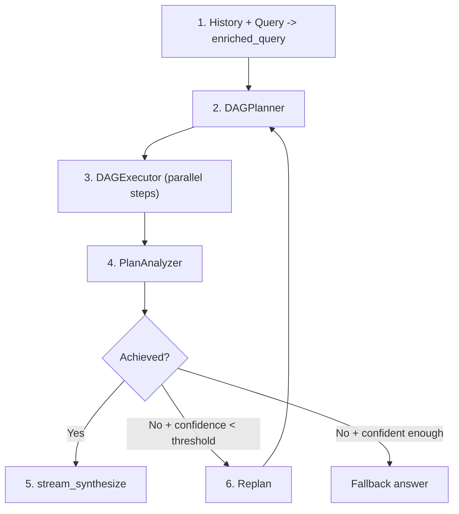
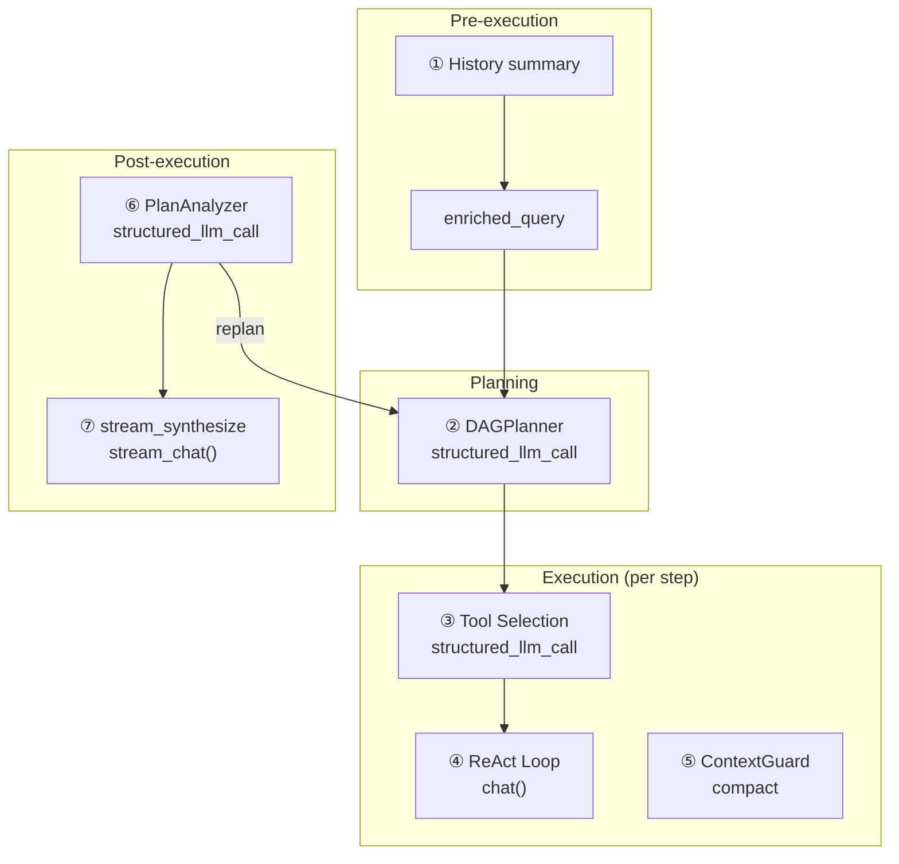
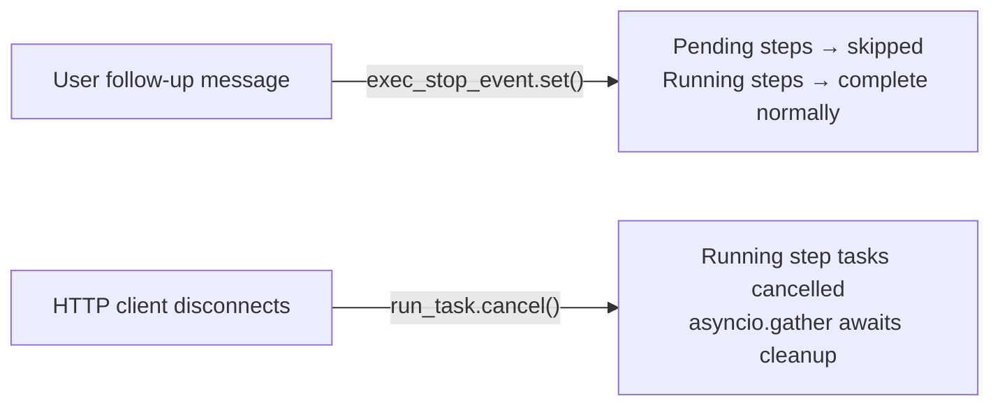

---
title: "DAG Engine"
description: "FIM One の DAG エンジンの仕組み — 動的計画、並列実行、目標認識分析、自律的な再計画。"
---## パイプライン

DAG モードは複雑な目標を有向非環グラフのステップに分解し、最大の並列性で実行してから、目標が実際に達成されたかどうかを反映します。達成されていない場合は、再計画して再度試行します — 自律的に、設定可能な予算まで。

パイプラインは、ループを形成する 4 つのフェーズで構成されています:

**計画。** スマート LLM は、明示的な依存関係エッジを持つ 2～6 個のステップに充実したクエリを分解します。各ステップには、タスク説明、オプションのツールヒント、および高速 LLM またはスマート LLM のどちらで実行するかを制御するモデルヒントが付与されます。

**実行。** DAGExecutor は、依存関係グラフを尊重しながら、独立したステップを並列で起動します (最大 5 つの同時実行)。各ステップは、メモリなしの自己完結型 ReAct エージェントとして実行されます — タスク説明と完了した依存関係の結果のみを受け取ります。

**分析。** PlanAnalyzer は、実行されたプランが元の目標を達成したかどうかを評価し、構造化された判定を生成します: `achieved` (ブール値)、`confidence` (0.0～1.0)、`reasoning`、およびオプションの `final_answer`。

**再計画。** 目標が達成されず、信頼度が停止閾値を下回る場合、パイプラインは、何が起こったか、何が間違っていたかをまとめた再計画コンテキストを使用して計画に戻ります。このループは、最大 `DAG_MAX_REPLAN_ROUNDS` 回まで自律的に実行されます。

2 つの LLM が全体を通じて協力します: **スマート LLM** は計画、分析、および回答合成を処理します (高い推論能力が必要なタスク)。一方、**高速 LLM** はステップ実行とコンテキスト圧縮を処理します (コストとレイテンシがピーク推論能力よりも重要なタスク)。すべての構造化出力呼び出しは `structured_llm_call` を使用します。これは、モデル固有の出力の癖に対処するための 3 レベルの低下チェーン (Native FC、JSON Mode、正規表現フォールバック付きプレーンテキスト) を提供します。## LLM呼び出しマップ

完全なDAGパイプラインは、7つの異なるカテゴリーのLLM呼び出しを行います。各呼び出しがどこで発生するか、どのモデルが処理するか、失敗時に何が起こるかを理解することは、デバッグとコスト最適化に不可欠です。

| # | 呼び出しサイト | モジュール | LLMの役割 | フォーマット | フォールバック |
|---|-----------|--------|----------|--------|----------|
| 1 | History summary | chat.py | fast LLM | plain text | 最後の20K文字を切り詰め |
| 2 | DAGPlanner | planner.py | smart LLM | structured\_llm\_call | 3段階の段階的低下 |
| 3 | Tool selection | react.py | step LLM | structured\_llm\_call | すべてのツールを返す |
| 4 | ReAct loop (per step) | react.py | fast/smart LLM | chat() | 再試行/フォールバック |
| 5 | ContextGuard compact | context\_guard.py | fast LLM | plain text | smart\_truncate |
| 6 | PlanAnalyzer | analyzer.py | smart LLM | structured\_llm\_call | regex + デフォルト |
| 7 | stream\_synthesize | analyzer.py | smart LLM | stream\_chat() | analysis.final\_answer |

呼び出し1と5は**ユーザーに見えない** — コンテキストサイズを管理するインフラストラクチャ呼び出しです。呼び出し2、6、7は**smart LLM**を使用します。これらは高い推論能力が必要だからです（目標の分解、達成の判定、一貫性のある回答の合成）。呼び出し3と4はデフォルトでは**fast LLM**を使用します。各DAGステップは焦点を絞った限定的なタスクであるべきだからです — ただし、`model_hint: null`を持つステップはモデルレジストリを介してsmart LLMに昇格させることができます。## DAGPlanner

プランナーの役割は、高レベルのゴールを有効な DAG の具体的で実行可能なステップに変換することです。これは、スマート LLM への単一の `structured_llm_call` で実行されます。

**プロンプト設計。** 計画プロンプトは現在の日時と年を注入し（LLM が時間を考慮した検索を計画できるように）、言語マッチングを強制し（タスク説明はゴールと同じ言語を使用する必要があります）、ステップ数を 2～6 に制限します。各ステップには 5 つのフィールドがあります：`id`、`task`、`dependencies`、`tool_hint`、`model_hint`。プロンプトは、些細に関連するサブタスクの分割を明示的に推奨していません — 「複数のチェックが 1 つのスクリプトで実行できる場合は、それらを 1 つのステップに統合してください。」

**構造化抽出。** プランナーは `structured_llm_call` を `_PLAN_SCHEMA`（`steps` 配列スキーマを定義）と `parse_fn`（生の辞書を `PlanStep` オブジェクトに変換）とともに使用します。LLM が `{"steps": [...]}` ラッパーの代わりに単一のステップオブジェクトを返す場合、パーサーは自動的に復旧します。[ReAct Engine — structured\_llm\_call](/architecture/react-engine#structured_llm_call--unified-output-extraction) に記載されている 3 レベルの段階的低下チェーンは、プロバイダー全体のモデル出力の特性を処理します。

**DAG 検証。** 抽出後、プランナーは Kahn のアルゴリズムを使用してトポロジカルソートにより グラフ構造を検証します。2 つの不変量がチェックされます：

1. **ダングリング参照なし。** ステップが計画に存在しない依存関係 ID を参照する場合、参照は警告ログとともにサイレントに削除されます。これは復旧メカニズムです — LLM は参照したステップを省略することがあり、ハード失敗は計画呼び出し全体を無駄にします。

2. **サイクルなし。** Kahn のアルゴリズムがすべてのノードにアクセスできない場合（少なくとも 1 つのサイクルが存在することを意味します）、プランナーは `ValueError` を発生させます。サイクルは復旧不可能です — サイクリック計画は実行できません。

**model\_hint。** プランナーは、単純で決定論的と考えるステップ（データ検索、形式変換、直接的な取得）に `"fast"` を割り当て、より深い推論が必要なステップに `null` を割り当てます。エグゼキューターはこのヒントを使用して、ステップごとに適切な LLM を選択します。不明な場合、プロンプトは LLM に `null` を使用するよう指示します — より有能なモデルを使用する方が常に安全です。

**入力構築。** 充実したクエリは会話履歴と現在のリクエストを組み合わせます。会話が長い場合、履歴は `DbMemory` 経由で読み込まれ、`"Previous conversation: ..."` として形式化されます。結果の充実したクエリが 16K トークンを超える場合（`CompactUtils.estimate_tokens` で推定）、ContextGuard の `planner_input` ヒントプロンプトを使用して LLM で要約されてからプランナーに渡されます。高速 LLM が利用できない場合のフォールバック：最後の 20K 文字にハード切り詰めします。## DAGExecutor

エグゼキューターは検証済みの `ExecutionPlan` を受け取り、その手順を並行実行し、依存関係エッジを尊重し、リソース制限を適用します。

**並行実行モデル。** `asyncio.Semaphore` は並列ステップ実行を `max_concurrency`（デフォルト 5、`MAX_CONCURRENCY` 環境変数で設定可能）に制限します。ディスパッチループは依存関係が完了したすべてのステップを特定し、それらを `asyncio.Task` インスタンスとして起動し、少なくとも 1 つが完了するまで待機してから再度チェックします。ステップは決定的な動作を保証するため、ソート済みの ID 順で起動されます。

**ステップごとの ReAct エージェント。** 各ステップは `_resolve_agent()` で作成された独立した ReAct エージェントとして実行されます。ステップに `model_hint` があり、それが `ModelRegistry` のロールと一致する場合、対応する LLM を持つ一時的なエージェントが作成されます。それ以外の場合は、デフォルトの高速 LLM エージェントが使用されます。これらのステップごとのエージェントは**メモリを持たない** — タスク説明、元のゴール、ツールヒント、および完了した依存関係の結果のみで新たに開始されます。この分離は意図的なもので、DAG ステップはグラフ全体で状態をリークしない自己完結型の作業単位であるべきです。

**依存関係コンテキスト注入。** `_build_step_context()` は完了したすべての依存ステップの結果をテキストブロックにフォーマットします。各依存関係の ID、ステータス、タスク説明、および結果が含まれます。`ContextGuard` が設定されており、結合されたコンテキストが `max_message_chars` を超える場合、`[Dependency context truncated]` サフィックス付きでハード切り詰めされます。これにより、複数の冗長な前任者に依存するステップが独自のコンテキストウィンドウを超過することを防ぎます。

**ステップタイムアウト。** 各ステップは `asyncio.wait_for` でラップされ、デフォルトタイムアウトは 600 秒（10 分）です。ステップがこれを超過した場合、キャンセルされ、タイムアウトメッセージとともに `"failed"` としてマークされます。タイムアウトはプランごとではなくステップごと — 5 ステップのプランは、ステップが順序実行される場合、理論的には 50 分間実行できます。

**中断とキャンセル。** エグゼキューターには 2 つの異なるキャンセルパスがあり、それぞれ異なるイベントによってトリガーされます。

*グレースフルスキップ — ストップイベント。* ユーザーが実行中にフォローアップメッセージを送信すると、`chat.py` のオーケストレーターが `exec_stop_event` を設定します。エグゼキューターは各ディスパッチサイクルの最初でこのフラグをチェック — 設定されている場合、すべての残りの `pending` ステップは即座に `"skipped"` としてマークされ、理由は `"Skipped — user changed requirements"` で、ループは終了します。既に実行中のステップは完了が許可される — 未開始のステップのみが放棄されます。この高速終了により、パイプラインは元のプラン全体が完了するのを待たずに、ユーザーの更新されたインテント周辺で再計画できます。

*即座の中止 — asyncio キャンセル。* HTTP クライアントが切断されると、`chat.py` は `asyncio.Task.cancel()` を介してトップレベルの `run_task` をキャンセルします。エグゼキューターは `asyncio.CancelledError` をキャッチし、現在実行中のすべてのステップタスクをキャンセルし、`asyncio.gather(..., return_exceptions=True)` を介してそれらの確認を待ってから再発生させます。クライアント切断は、SSE イベントループ内で 0.5 秒ごとに `await request.is_disconnected()` をポーリングすることで検出されます。

セマンティックな違いは重要です。**ストップイベント**は「未開始のものをスキップするが、既に実行中のものは保持する」を意味します — 完了したステップの結果は再計画を通知するために利用可能なままです。**CancelledError** は「すべてを即座に中止する」を意味します — すべての進行中の作業は結果回復なしでドロップされます。

**デッドロック検出。** ディスパッチループが実行中のタスクがなく、起動準備ができたステップもない場合（依存関係が失敗したため）、すべての残りの保留中ステップは `"failed"` としてマークされ、依存関係が完了しなかった理由を説明するメッセージが付きます。これにより、エグゼキューターが無期限にハングするのを防ぎます。

**進捗コールバック。** エグゼキューターは 3 つのイベントタイプの `(step_id, event, data)` コールバックを発火します。`"started"`（ステップ起動）、`"iteration"`（ステップ内のツール呼び出し）、および `"completed"`（ステップ完了）。`chat.py` の SSE レイヤーはこれらのコールバックを `step_progress` イベントにブリッジし、フロントエンドはリアルタイム DAG ビジュアライゼーションをレンダリングするために使用します。## PlanAnalyzer

アナライザーは、実行されたプランが元の目標を達成したかどうかを評価します。4つのフィールドを持つ構造化された `AnalysisResult` を生成します：

- **`achieved`** (boolean) — 目標が完全に達成された場合のみ `true`。
- **`confidence`** (float, 0.0-1.0) — アナライザーの評価の確実性。矛盾するソースはこのスコアを低下させます。
- **`final_answer`** (string or null) — 達成時の統合された回答、そうでない場合は `null`。
- **`reasoning`** (string) — LLMの思考の連鎖による正当化。

**構造化抽出。** アナライザーは `structured_llm_call` と `_ANALYSIS_SCHEMA` を使用し、型強制とconfidence制限を処理する `parse_fn`、および不正なJSONに対する `regex_fallback` を使用します。正規表現フォールバック（`_regex_extract_analysis`）は、パターンマッチングを使用して部分的に有効なJSONから `achieved`、`confidence`、`final_answer`、および `reasoning` フィールドを抽出します。これが重要なのは、分析応答は計画応答よりも長く複雑になる傾向があり、JSON形式エラーがより起こりやすいためです。

**安全なデフォルト。** すべての抽出レベルが失敗した場合（ネイティブFC、JSONモード、プレーンテキスト、正規表現）、アナライザーは `AnalysisResult(achieved=False, confidence=0.0, reasoning="Could not parse analysis response")` を返します。これにより、パイプラインは常に使用可能な結果を取得します — 解析失敗は「達成されていない」という判定になり、クラッシュするのではなく再計画をトリガーします。

**ステップ結果フォーマット。** 各ステップの結果は、分析プロンプトで10K文字に切り詰められます。これにより、単一ステップの冗長な出力（例えば、大規模なウェブスクレイプやファイルダンプ）がアナライザーのコンテキストウィンドウを支配し、他のステップの結果を圧迫するのを防ぎます。

**マルチソース比較。** 分析プロンプトには、異なるソースからの結果を明示的に比較するディレクティブが含まれています。ウェブ検索結果、ナレッジベース検索、およびファイル操作がすべてデータを提供する場合、アナライザーは矛盾（異なる数字、日付、主張）にフラグを立て、どのソースがより信頼できるかを示す必要があります。矛盾はconfidenceスコアを低下させ、これが再計画の決定に影響を与えます。## 再計画

再計画ループはDAGエンジンの最も特徴的な機能です。部分的な失敗から自律的に回復し、何が問題だったかを反映して別のアプローチを試すことができます。

**決定ロジック。** plan-execute-analyzeの各ラウンド後、`chat.py`のオーケストレーターは分析結果を評価します：

1. **`achieved == True`** — ループを終了し、ストリーミング合成に進みます。
2. **このラウンド中にユーザー注入が発生した** — 信頼度または予算に関わらず、常に再計画します。ユーザーのフォローアップメッセージは要件の変更として扱われ、新しい試みが必要です。これは自律再計画予算を消費しません。
3. **自律再計画予算が枯渇した** — ループを終了します。予算は`max_replan_rounds - 1`の自律再計画です（デフォルト：合計3ラウンドの予算から2回の自律再計画）。
4. **`confidence >= replan_stop_confidence`** — ループを終了します。目標が完全に達成されなかった場合でも、高い信頼度スコア（デフォルト閾値：0.8、`DAG_REPLAN_STOP_CONFIDENCE`で設定可能）は、アナライザーが何が起こったかについてかなり確実であることを示します — 再計画は役に立つ可能性は低いです。
5. **それ以外の場合** — 再計画します。目標が達成されず、信頼度が低く、予算が残っています。

**再計画コンテキスト。** 再計画時、オーケストレーターは`_format_replan_context()`を呼び出して前のラウンドの概要を構築します。これには、アナライザーの推論と各ステップの結果の切り詰められたプレビュー（ステップあたり最大500文字）が含まれます。積極的な切り詰めは意図的です。プランナーは*何が起こったか*と*何が問題だったか*を知る必要があり、すべてのステップの出力の完全な詳細は必要ありません。このコンテキストは、元の充実したクエリと共に`context`パラメーターとして`DAGPlanner.plan()`に渡されます。

**最大ラウンド数。** `DAG_MAX_REPLAN_ROUNDS`環境変数（デフォルト3）は、計画ラウンドの総数を制御します。デフォルト設定では、最初のラウンドは初期計画であり、最大2回の自律再計画が残ります。ユーザーがトリガーした再計画（メッセージ注入経由）はこの予算にはカウントされません — ユーザーはパイプラインを無期限に操舵できます。

**SSEイベント。** パイプラインが再計画することを決定すると、アナライザーの推論を含む`replanning`フェーズイベントを発行します。フロントエンドはこれを使用して、パイプラインが再試行している理由をユーザーに表示します。

**enriched_query累積。** ユーザーのフォローアップメッセージはラウンド全体で充実したクエリに追加されます：`enriched_query += "\n\n[User follow-up]: {content}"`。これは、プランナーが修正された計画を構築するときに、ユーザーの意図の完全な進化 — 元のリクエストとその後のすべての明確化 — を見ることを意味します。## ストリーミング合成

アナライザーがゴール達成を確認すると（`analysis.achieved == True`）、パイプラインは `PlanAnalyzer.stream_synthesize()` を介して合成された最終回答をユーザーにストリーミングします。

**入力。** 合成呼び出しは3つの入力を受け取ります：元のゴール、フォーマットされたステップ結果（ステップあたり最大10K文字）、およびノンストリーミング分析呼び出しからのアナライザーの推論です。推論は、合成がカバーすべき内容の「ロードマップ」を提供します。

**システムプロンプト。** 合成プロンプトは、LLMにメタコメンタリーなしで直接回答するよう指示し（「'結果に基づいて'のようなフレーズを含めないでください」）、元のゴールの言語に一致させ、該当する場合は異なるソースからの結果を比較します。ユーザー設定から言語ディレクティブが利用可能な場合は追加されます。

**ストリーミング。** このメソッドは `stream_chat()` を使用してトークンを段階的に生成します。SSEレイヤーは各チャンクを `status: "delta"` の `answer` イベントでラップし、フロントエンドに最終回答のリアルタイムレンダリングを提供します。

**フォールバックチェーン。** 2つのフォールバックパスが失敗に対応します：

1. **stream_synthesize が例外を発生させる** — ノンストリーミング `analyze()` 呼び出しから `analysis.final_answer` にフォールバックします。この回答は分析中に既に生成されているため、ストリーミング呼び出しが失敗した場合でも利用可能です。

2. **ゴール未達成（合成は試行されない）** — すべての完了したステップ結果を連結し、水平線で区切ります。各結果にはそのステップIDが付きます。ステップが全く完了しなかった場合は、`"(goal not achieved)"` を返します。

フォールバック設計により、ユーザーは常に回答を取得します — 低下していますが、決して空ではありません。## 2つのLLMアーキテクチャ

DAGエンジンのコストとレイテンシプロファイルは、デュアルモデル設計によって形成されます。役割分担は以下の通りです：

| 役割 | 用途 | 最適化対象 |
|------|----------|---------------|
| **Smart LLM** | 計画、分析、回答の統合 | 推論能力 |
| **Fast LLM** | ステップ実行、コンテキスト圧縮、履歴要約 | コストとレイテンシ |

Smart LLMは、最も深い推論が必要な3つの呼び出しを処理します：目標を一貫した計画に分解すること、計画が目標を達成したかどうかを判断すること、複数のステップ結果を一貫して統合した最終回答を統合することです。これらの呼び出しはラウンドごとに1回（または統合では合計1回）発生するため、トークンあたりのコストが高くても償却されます。

Fast LLMは、高頻度の呼び出しを処理します：各DAGステップのReActループ（複数のツール呼び出しと反復を含む可能性がある）、ステップコンテキストが大きくなりすぎた場合のコンテキスト圧縮、マルチターン会話の履歴要約です。5ステップの計画で1ステップあたり3回の反復がある場合、15回以上のFast LLM呼び出しが発生します。ここでSmart LLMを使用すると、コストが禁止的に高くなります。

**ステップごとのオーバーライド。** 各`PlanStep`の`model_hint`フィールドにより、プランナーは個別のステップをSmart LLMに昇格させることができます。`model_hint`が`null`の場合、エグゼキューターはデフォルトエージェント（Fast LLM）を使用します。`"fast"`の場合、エグゼキューターはモデルレジストリ経由でFast LLMを明示的に使用します。プランナーは決定論的なタスクに対して`"fast"`を設定し、複雑な推論に対して`null`を設定するよう指示されていますが、`ModelRegistry`に登録されたカスタムロールに設定することもできます。モデル解決は**ステップごとに1回**、そのステップのReActループが開始される直前に`_resolve_agent()`経由で行われます。ステップ内のすべての反復（ツール選択、ReActループ、ContextGuard圧縮）は、同じ解決されたLLMを使用します。モデルはステップ中に変更されることはありません。

**予算の独立性。** Smart LLMとFast LLMは、それぞれのモデル設定から計算された独立したコンテキスト予算を持ちます。DAGステップ実行はFast LLMの予算を使用します。計画と分析の呼び出しはSmart LLMの予算を使用します。これは重要です。なぜなら、オペレーターは多くの場合、計画用に大規模なコンテキストモデル（128K以上）と、ステップ実行用に小規模で高速なモデル（32K）をペアリングするからです。予算の計算方法の詳細については、[コンテキスト管理 — 予算設定](/architecture/context-management#layer-5--budget-configuration)を参照してください。