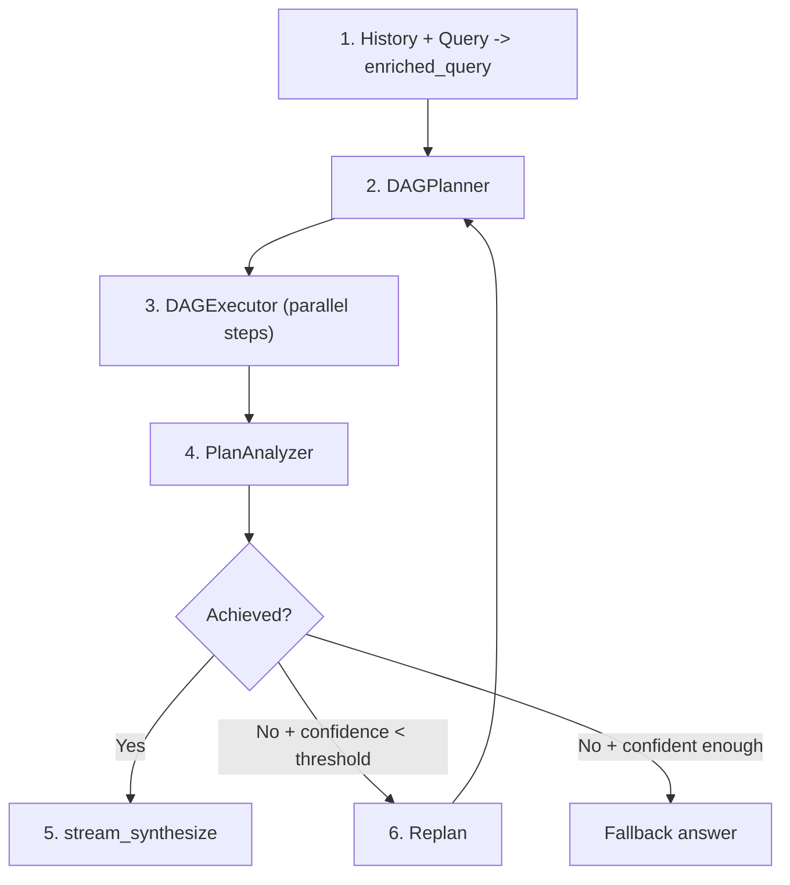
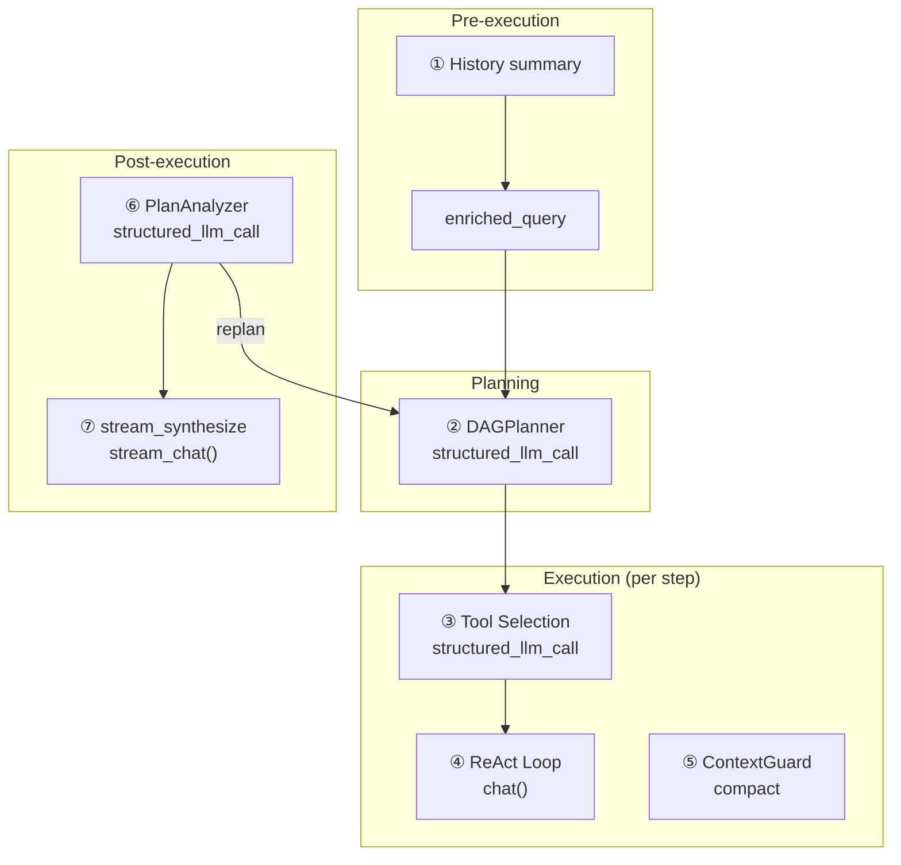
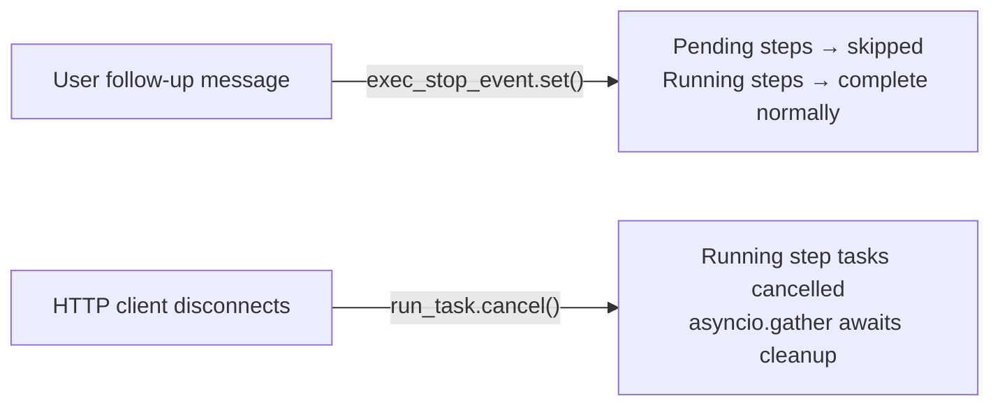

## パイプライン

DAG モードは複雑な目標を有向非環グラフのステップに分解し、最大限の並列性で実行してから、目標が実際に達成されたかどうかを反映します。達成されていない場合は、再計画して再度試行します — 自律的に、設定可能な予算まで。

パイプラインはループを形成する 4 つのフェーズを持ちます：

**計画。** スマート LLM は充実したクエリを 2～6 個のステップに分解し、明示的な依存関係エッジを持ちます。各ステップはタスク説明、オプションのツールヒント、および高速 LLM またはスマート LLM のどちらで実行するかを制御するモデルヒントを取得します。

**実行。** DAGExecutor は依存グラフを尊重しながら、独立したステップを並列で起動します（最大 5 つの同時実行）。各ステップはメモリを持たない自己完結型の ReAct エージェントとして実行され、タスク説明と完了した依存関係の結果のみを受け取ります。

**分析。** PlanAnalyzer は実行されたプランが元の目標を達成したかどうかを評価し、構造化された判定を生成します：`achieved`（ブール値）、`confidence`（0.0～1.0）、`reasoning`、およびオプションの `final_answer`。

**再計画。** 目標が達成されず、信頼度が停止閾値を下回る場合、パイプラインは何が起こったか、何が間違っていたかをまとめた再計画コンテキストを使用して計画に戻ります。このループは最大 `DAG_MAX_REPLAN_ROUNDS` 回まで自律的に実行されます。

2 つの LLM が全体を通じて協力します：**スマート LLM** は計画、分析、および回答の合成を処理します（高い推論能力が必要なタスク）。一方、**汎用 LLM** はデフォルトでステップ実行を処理します（`model_hint="fast"` ステップはコスト削減のため高速 LLM に委譲されます）。コンテキスト圧縮と履歴サマリーは高速 LLM を使用します。すべての構造化出力呼び出しは `structured_llm_call` を使用し、モデル固有の出力の特性に対処するための 3 レベルの低下チェーン（Native FC、JSON Mode、正規表現フォールバック付きプレーンテキスト）を提供します。

## LLM呼び出しマップ

完全なDAGパイプラインは、7つの異なるカテゴリのLLM呼び出しを行います。各呼び出しがどこで発生するか、どのモデルがそれを処理するか、失敗時に何が起こるかを理解することは、デバッグとコスト最適化に不可欠です。

| # | 呼び出しサイト | モジュール | LLMの役割 | フォーマット | フォールバック |
|---|-----------|--------|----------|--------|----------|
| 1 | 履歴サマリー | chat.py | 高速LLM | プレーンテキスト | 最後の20K文字を切り詰め |
| 2 | DAGPlanner | planner.py | スマートLLM | structured\_llm\_call | 3段階の低下 |
| 3 | ツール選択 | react.py | ステップLLM | structured\_llm\_call | すべてのツールを返す |
| 4 | ReActループ（ステップごと） | react.py | 一般LLM（デフォルト）/ 高速LLM（`model_hint="fast"`）/ 推論LLM（`model_hint="reasoning"`） | chat() | 再試行/フォールバック |
| 5 | ContextGuardコンパクト | context\_guard.py | 高速LLM | プレーンテキスト | smart\_truncate |
| 6 | PlanAnalyzer | analyzer.py | スマートLLM | structured\_llm\_call | regex + デフォルト |
| 7 | stream\_synthesize | analyzer.py | スマートLLM | stream\_chat() | analysis.final\_answer |

呼び出し1と5は**ユーザーに見えない** — コンテキストサイズを管理するインフラストラクチャ呼び出しです。呼び出し2、6、7は**スマートLLM**を使用します。これらは高い推論能力が必要だからです（目標の分解、達成の判定、一貫した回答の合成）。呼び出し4はデフォルトで**一般LLM**を使用します — `model_hint="fast"`で明示的にマークされたステップのみが高速LLMにダウングレードされ、`model_hint="reasoning"`でマークされたステップは推論LLMに昇格されます。呼び出し3は、そのステップで解決されたのと同じLLMを使用します。

## DAGプランナー

プランナーの役割は、高レベルの目標を有効なDAGの具体的で実行可能なステップに変換することです。これは、スマートLLMへの単一の`structured_llm_call`で実行されます。

**プロンプト設計。** 計画プロンプトは現在の日時と年を注入し（LLMが時間を考慮した検索を計画できるようにするため）、言語マッチングを強制し（タスク説明は目標と同じ言語を使用する必要があります）、ステップ数を2～6に制限します。各ステップには5つのフィールドがあります：`id`、`task`、`dependencies`、`tool_hint`、`model_hint`。プロンプトは、些細に関連するサブタスクの分割を明示的に推奨していません — 「複数のチェックが1つのスクリプトで実行できる場合は、それらを1つのステップに統合してください。」

**構造化抽出。** プランナーは`_PLAN_SCHEMA`を使用して`structured_llm_call`を実行し、`steps`配列スキーマを定義し、`parse_fn`が生のdictを`PlanStep`オブジェクトに変換します。LLMが`{"steps": [...]}`ラッパーの代わりに単一のステップオブジェクトを返す場合、パーサーは自動的に復旧します。[ReAct Engine — structured_llm_call](/architecture/react-engine#structured_llm_call--unified-output-extraction)に記載されている3レベルの低下チェーンは、プロバイダー間のモデル出力の特性を処理します。

**DAG検証。** 抽出後、プランナーはKahnのアルゴリズムを使用してトポロジカルソートでグラフ構造を検証します。2つの不変条件がチェックされます：

1. **ぶら下がった参照がない。** ステップが計画に存在しない依存関係IDを参照する場合、参照は警告ログとともに静かに削除されます。これは復旧メカニズムです — LLMは参照したステップを省略することがあり、ハード失敗は計画全体の呼び出しを無駄にします。

2. **サイクルがない。** Kahnのアルゴリズムがすべてのノードにアクセスできない場合（少なくとも1つのサイクルが存在することを意味します）、プランナーは`ValueError`を発生させます。サイクルは復旧不可能です — サイクリック計画は実行できません。

**model_hint。** プランナーは、単純で決定的と考えるステップ（データ検索、形式変換、直接的な取得）に`"fast"`を割り当て、標準的な推論が必要なステップに`null`を割り当て（一般的なモデルに解決）、深い分析が必要なステップに`"reasoning"`を割り当てます。エグゼキューターはこのヒントを使用して、`ModelRegistry`経由でステップごとに適切なLLMを選択します。不確実な場合、プロンプトはLLMに`null`を使用するよう指示します — より能力の高いモデルを使用する方が常に安全です。ドメイン固有のタスク（法律、医療、金融）の場合、プランナーはルーターからドメインコンテキストを受け取り、専門家の精度が必要なステップに`model_hint="reasoning"`を割り当てるよう指導されます。

**入力構築。** 充実したクエリは、会話履歴と現在のリクエストを組み合わせます。会話が長い場合、履歴は`DbMemory`経由で読み込まれ、`"Previous conversation: ..."`としてフォーマットされます。結果の充実したクエリが16Kトークンを超える場合（`CompactUtils.estimate_tokens`経由で推定）、ContextGuardの`planner_input`ヒントプロンプトを使用してLLMで要約されてからプランナーに渡されます。高速LLMが利用できない場合のフォールバック：最後の20K文字にハード切り詰めします。

## DAGExecutor

エグゼキューターは検証済みの `ExecutionPlan` を受け取り、その手順を並行実行し、依存関係エッジを尊重し、リソース制限を強制します。

**並行実行モデル。** `asyncio.Semaphore` は並列ステップ実行を `max_concurrency`（デフォルト 5、`MAX_CONCURRENCY` 環境変数で設定可能）に制限します。ディスパッチループは依存関係が完了したすべてのステップを特定し、`asyncio.Task` インスタンスとして起動し、少なくとも 1 つが完了するまで待機してから再度チェックします。ステップは決定論的な動作のためにソート済みの ID 順で起動されます。

**ステップごとの ReAct エージェント。** 各ステップは `_resolve_agent()` で作成された独立した ReAct エージェントとして実行されます。ステップに `ModelRegistry` のロールと一致する `model_hint` がある場合、対応する LLM で一時的なエージェントが作成されます。それ以外の場合は、レジストリのデフォルト（汎用）モデルが使用されます。これらのステップごとのエージェントは**メモリを持たない** — タスク説明、元のゴール、ツールヒント、および完了した依存関係の結果のみで新たに開始されます。この分離は意図的です。DAG ステップはグラフ全体で状態をリークしない自己完結した作業単位であるべきです。

**依存関係コンテキスト注入。** `_build_step_context()` は完了したすべての依存ステップの結果をテキストブロックにフォーマットします。各依存関係の ID、ステータス、タスク説明、および結果が含まれます。`ContextGuard` が設定されており、結合されたコンテキストが `max_message_chars` を超える場合、`[Dependency context truncated]` サフィックス付きでハード切り詰めされます。これにより、複数の冗長な先行ステップに依存するステップが独自のコンテキストウィンドウを超過するのを防ぎます。

**構造化コンテンツ乗数。** 依存関係の結果に構造化コンテンツ（法的引用、マークダウンテーブル、またはコードブロック）が含まれている場合、`_build_step_context()` は切り詰め予算に乗数を適用します（デフォルト `3.0`、`DAG_STRUCTURED_CONTEXT_MULTIPLIER` で設定可能）。これにより、引用、表形式データ、およびその他の構造化アーティファクトがステップ境界全体で保持され、参照の途中で切り詰められることはありません。

**ステップタイムアウト。** 各ステップは `asyncio.wait_for` でラップされ、デフォルトタイムアウトは 600 秒（10 分）です。ステップがこれを超える場合、キャンセルされ、タイムアウトメッセージで `"failed"` としてマークされます。タイムアウトはステップごとであり、プラン全体ではありません — 5 ステップのプランはステップが順序実行される場合、理論的には 50 分間実行できます。

**中断とキャンセル。** エグゼキューターには 2 つの異なるキャンセルパスがあり、それぞれ異なるイベントによってトリガーされます。

*グレースフルスキップ — ストップイベント。* ユーザーが実行中にフォローアップメッセージを送信すると、`chat.py` のオーケストレーターが `exec_stop_event` を設定します。エグゼキューターは各ディスパッチサイクルの最上部でこのフラグをチェックします。設定されている場合、残りのすべての `pending` ステップは即座に `"skipped"` としてマークされ、理由は `"Skipped — user changed requirements"` で、ループが終了します。既に実行中のステップは完了が許可されます — 未開始のステップのみが放棄されます。この高速終了により、パイプラインは元のプラン全体の完了を待つことなく、ユーザーの更新されたインテント周辺で再計画できます。

*即座の中止 — asyncio キャンセル。* HTTP クライアントが切断されると、`chat.py` は `asyncio.Task.cancel()` 経由で最上位の `run_task` をキャンセルします。エグゼキューターは `asyncio.CancelledError` をキャッチし、現在実行中のすべてのステップタスクをキャンセルし、`asyncio.gather(..., return_exceptions=True)` 経由で確認応答を待機してから再発生させます。クライアント切断は SSE イベントループ内で 0.5 秒ごとに `await request.is_disconnected()` をポーリングすることで検出されます。

セマンティックな違いは重要です。**ストップイベント**は「未開始のものをスキップするが、既に実行中のものは保持する」を意味します — 完了したステップ結果は再計画を通知するために利用可能なままです。**CancelledError** は「すべてを即座に中止する」を意味します — すべての進行中の作業は結果回復なしでドロップされます。

**デッドロック検出。** ディスパッチループが実行中のタスクがなく、起動準備ができたステップもない場合（依存関係が失敗したため）、残りのすべての保留中ステップは `"failed"` としてマークされ、依存関係が完了しなかったことを説明するメッセージが付きます。これにより、エグゼキューターが無期限にハングするのを防ぎます。

**進捗コールバック。** エグゼキューターは 3 つのイベントタイプの `(step_id, event, data)` コールバックを発火します。`"started"`（ステップ起動）、`"iteration"`（ステップ内のツール呼び出し）、および `"completed"`（ステップ完了）です。`chat.py` の SSE レイヤーはこれらのコールバックを `step_progress` イベントにブリッジし、フロントエンドはリアルタイム DAG ビジュアライゼーションをレンダリングするために使用します。

## 引用検証

各ステップが完了した後、実行者はオプションで**引用検証ツール**を実行し、ステップの出力内の事実主張をチェックします。これは `DAG_CITATION_VERIFICATION` 環境変数によって制御されます（デフォルト: `true`）。法定法令、医学参考文献、金融規制など、不正確な引用がリスクを伴う領域を対象としています。

検証ツールは3つのステージで動作します:

1. **抽出。** 正規表現パターンがステップ結果内の引用のような文字列を識別します（例：事件番号、法定法令参照、規制コード）。
2. **検証。** 抽出された各引用は、妥当性と内部一貫性をチェックするLLM判定呼び出しによって評価されます。
3. **失敗時の再試行。** 検証が失敗した場合、ステップは修正フィードバックをタスク説明に追加して再試行され、エージェントが不正確な参考文献を修正する機会が与えられます。

引用検証は引用を含むステップにレイテンシを追加しますが、引用を含まないステップには影響しません。引用に敏感な領域が使用例に含まれない場合は、`DAG_CITATION_VERIFICATION=false` を設定して無効にしてください。

## ドメイン対応ルーティング

オートルーターは、既存のモード選択と並行して、**`domain_hint`** でクエリを分類するようになりました。認識されるドメインは `legal`、`medical`、`financial` です。これらのドメイン外のクエリは `null` を受け取ります。

ドメイン分類は、パイプラインに 2 つの方法で影響を与えます。

**DAG モード。** ルーターが DAG を選択し、null 以外の `domain_hint` を提供する場合、ドメインコンテキストはプランナープロンプトに注入されます。これにより、プランナーは専門的な精度が必要なステップに `model_hint="reasoning"` を割り当て、利用可能なドメインスキルと一致するステップに `tool_hint="read_skill"` を提案するよう導かれます。

**ReAct モード。** ルーターがドメイン固有のクエリに対して ReAct を選択する場合、システムは `registry.get_by_role("reasoning")` を介して一般モデルから**推論モデル**にエスカレートします。さらに、エージェントがドメイン固有のコンテンツを作成する前に `web_search` を使用し、検索を通じて引用を検証することを要求する必須の指示が注入されます。`read_skill` ツールはツール選択で固定されます（フィルタリングされません）。ドメイン知識が常にアクセス可能であることを保証します。

ルーティングバイアスも変わります。複数のサブタスクがコンテキストと引用を共有する密結合ドメイン分析は、DAG ステップ境界を越えてコンテキストが失われるのを避けるため、ReAct モードを優先します。

## PlanAnalyzer

実行されたプランが元の目標を達成したかどうかを評価するアナライザーです。4つのフィールドを持つ構造化された `AnalysisResult` を生成します：

- **`achieved`** (boolean) — 目標が完全に達成された場合のみ `true`。
- **`confidence`** (float, 0.0-1.0) — アナライザーの評価の確実性。矛盾するソースはこのスコアを低下させます。
- **`final_answer`** (string or null) — 達成時の統合された回答、そうでない場合は `null`。
- **`reasoning`** (string) — LLMのチェーン・オブ・ソート正当化。

**構造化抽出。** アナライザーは `structured_llm_call` を `_ANALYSIS_SCHEMA`、型強制と信頼度クランピングを処理する `parse_fn`、および不正な形式のJSONに対する `regex_fallback` で使用します。正規表現フォールバック（`_regex_extract_analysis`）は、パターンマッチングを使用して部分的に有効なJSONから `achieved`、`confidence`、`final_answer`、および `reasoning` フィールドを抽出します。これが重要な理由は、分析応答は計画応答よりも長く複雑になる傾向があり、JSON形式エラーがより発生しやすいためです。

**安全なデフォルト。** すべての抽出レベルが失敗した場合（ネイティブFC、JSONモード、プレーンテキスト、正規表現）、アナライザーは `AnalysisResult(achieved=False, confidence=0.0, reasoning="Could not parse analysis response")` を返します。これにより、パイプラインは常に使用可能な結果を取得します — 解析失敗は「達成されていない」という判定になり、クラッシュする代わりに再計画がトリガーされます。

**ステップ結果のフォーマット。** 各ステップの結果は分析プロンプトで10K文字に切り詰められます。これにより、単一のステップの詳細な出力（大規模なウェブスクレイプやファイルダンプなど）がアナライザーのコンテキストウィンドウを支配し、他のステップの結果を圧迫するのを防ぎます。

**マルチソース比較。** 分析プロンプトには、異なるソースからの結果を明示的に比較するディレクティブが含まれています。ウェブ検索結果、ナレッジベース検索、およびファイル操作がすべてデータを提供する場合、アナライザーは矛盾（異なる数字、日付、主張）にフラグを立て、どのソースがより信頼できるかを示す必要があります。矛盾は信頼度スコアを低下させ、これが再計画の決定に影響を与えます。

## 再計画

再計画ループは DAG エンジンの最も特徴的な機能です。部分的な失敗から自律的に回復し、何が問題だったかを反映して別のアプローチを試すことができます。

**決定ロジック。** plan-execute-analyze の各ラウンド後、`chat.py` のオーケストレーターは分析結果を評価します：

1. **`achieved == True`** — ループを終了し、ストリーミング合成に進みます。
2. **このラウンド中にユーザー注入が発生** — 信頼度または予算に関係なく、常に再計画します。ユーザーのフォローアップメッセージは、新しい試みを要求する要件変更として扱われます。これは自律再計画予算を消費しません。
3. **自律再計画予算が枯渇** — ループを終了します。予算は `max_replan_rounds - 1` 自律再計画です（デフォルト：合計 3 ラウンドの予算から 2 回の自律再計画）。
4. **`confidence >= replan_stop_confidence`** — ループを終了します。目標が完全に達成されなかった場合でも、高い信頼度スコア（デフォルト閾値：0.8、`DAG_REPLAN_STOP_CONFIDENCE` で設定可能）は、アナライザーが何が起こったかについてかなり確信していることを示します — 再計画は役に立つ可能性は低いです。
5. **その他の場合** — 再計画します。目標が達成されず、信頼度が低く、予算が残っています。

**再計画コンテキスト。** 再計画時、オーケストレーターは `_format_replan_context()` を呼び出して前のラウンドの要約を構築します。これには、アナライザーの推論と各ステップの結果の切り詰められたプレビュー（ステップあたり最大 500 文字）が含まれます。積極的な切り詰めは意図的です。プランナーは*何が起こったか*と*何が問題だったか*を知る必要があり、すべてのステップの出力の完全な詳細ではありません。このコンテキストは、元の充実したクエリとともに `context` パラメーターとして `DAGPlanner.plan()` に渡されます。

**最大ラウンド数。** `DAG_MAX_REPLAN_ROUNDS` 環境変数（デフォルト 3）は、計画ラウンドの総数を制御します。デフォルト設定では、最初のラウンドは初期計画であり、最大 2 回の自律再計画が残ります。ユーザーがトリガーした再計画（メッセージ注入経由）はこの予算にカウントされません — ユーザーはパイプラインを無限に操舵できます。

**SSE イベント。** パイプラインが再計画することを決定すると、アナライザーの推論を含む `replanning` フェーズイベントを発行します。フロントエンドはこれを使用して、パイプラインが再試行している理由をユーザーに表示します。

**enriched_query の蓄積。** ユーザーのフォローアップメッセージはラウンド全体で充実したクエリに追加されます：`enriched_query += "\n\n[User follow-up]: {content}"`。これは、プランナーが修正された計画を構築するときに、ユーザーの意図の完全な進化 — 元のリクエストとそれに続くすべての明確化 — を見ることを意味します。

## ストリーミング合成

アナライザーがゴール達成を確認すると（`analysis.achieved == True`）、パイプラインは `PlanAnalyzer.stream_synthesize()` を通じて合成された最終回答をユーザーにストリーミングします。

**入力。** 合成呼び出しは3つの入力を受け取ります：元のゴール、フォーマットされたステップ結果（ステップあたり最大10K文字）、およびノンストリーミング分析呼び出しからのアナライザーの推論です。推論は合成がカバーすべき内容の「ロードマップ」を提供します。

**システムプロンプト。** 合成プロンプトは、LLMにメタコメンタリーなしで直接回答するよう指示し（「'結果に基づいて'のようなフレーズを含めないこと」）、元のゴールの言語に合わせ、該当する場合は異なるソースからの結果を比較するよう指示します。ユーザー設定から言語ディレクティブが利用可能な場合は追加されます。

**ストリーミング。** メソッドは `stream_chat()` を使用してトークンを段階的に生成します。SSEレイヤーは各チャンクを `status: "delta"` の `answer` イベントでラップし、フロントエンドに最終回答のリアルタイムレンダリングを提供します。

**フォールバックチェーン。** 2つのフォールバックパスが失敗に対応します：

1. **stream_synthesize が例外を発生させる** — ノンストリーミング `analyze()` 呼び出しから `analysis.final_answer` にフォールバックします。この回答は分析中に既に生成されているため、ストリーミング呼び出しが失敗しても利用可能です。

2. **ゴール未達成（合成は試行されない）** — すべての完了したステップ結果を連結し、水平線で区切ります。各結果にはそのステップIDが接頭辞として付きます。ステップが全く完了しなかった場合は、`"(goal not achieved)"` を返します。

フォールバック設計により、ユーザーは常に回答を取得します — 低下していても決して空ではありません。

## マルチLLMアーキテクチャ

DAGエンジンのコストとレイテンシプロファイルは、マルチモデル設計によって形作られます。役割分担は以下の通りです：

| 役割 | 用途 | 最適化対象 |
|------|----------|---------------|
| **Smart LLM** | 計画、分析、回答の統合 | 推論能力 |
| **General LLM** | ステップ実行（デフォルト）、ReActエージェント | 能力とコストのバランス |
| **Fast LLM** | `model_hint="fast"`ステップ、コンテキスト圧縮、履歴要約 | コストとレイテンシ |
| **Reasoning LLM** | `model_hint="reasoning"`ステップ、ドメイン段階的ReAct | 深い分析能力 |

Smart LLMは、最も深い推論が必要な3つの呼び出しを処理します：目標をコヒーレントな計画に分解すること、計画が目標を達成したかどうかを判断すること、複数のステップ結果をコヒーレントに統合した最終回答を合成することです。これらの呼び出しはラウンドごとに1回（または統合の場合は合計1回）発生するため、トークンあたりのコストが高くても償却されます。

General LLMはデフォルトでステップ実行を処理します。各DAGステップのReActループは、プランナーが異なる`model_hint`を明示的に割り当てない限り、汎用モデルで実行されます。Fast LLMは`model_hint="fast"`でタグ付けされたステップ（単純なルックアップ、フォーマット変換）とインフラストラクチャ呼び出し（コンテキスト圧縮、履歴要約）のために予約されています。Reasoning LLMは`model_hint="reasoning"`でタグ付けされたステップとドメイン段階的ReActタスク（[ドメイン認識ルーティング](#domain-aware-routing)を参照）に使用されます。

**ステップごとのオーバーライド。** 各`PlanStep`の`model_hint`フィールドは、そのステップを実行するLLMを制御します。`model_hint`が`null`の場合、エグゼキューターは汎用モデルを使用します。`"fast"`の場合、エグゼキューターはモデルレジストリを介してFast LLMを使用します。`"reasoning"`の場合、エグゼキューターはReasoning LLMを使用します。プランナーは、決定論的タスクには`"fast"`を、標準的な推論には`null`を、深い分析には`"reasoning"`を設定するよう指示されていますが、`ModelRegistry`に登録されたカスタムロールに設定することもできます。モデル解決は**ステップごとに1回**、そのステップのReActループが開始される直前に`_resolve_agent()`を介して発生します。ステップ内のすべてのイテレーション（ツール選択、ReActループ、ContextGuard圧縮）は、同じ解決されたLLMを使用します。モデルはステップ中に変更されることはありません。

**予算の独立性。** 各LLMロールは、そのモデル設定から計算された独立したコンテキスト予算を持ちます。DAGステップ実行は、解決されたステップモデルの予算を使用します（デフォルトは汎用）。計画および分析呼び出しはSmart LLMの予算を使用します。これは、オペレーターが計画用の大規模コンテキストモデル（128K以上）とステップ実行用の異なるモデルをペアリングすることが多いため重要です。予算の計算方法の詳細については、[コンテキスト管理 — 予算設定](/architecture/context-management#layer-5--budget-configuration)を参照してください。
