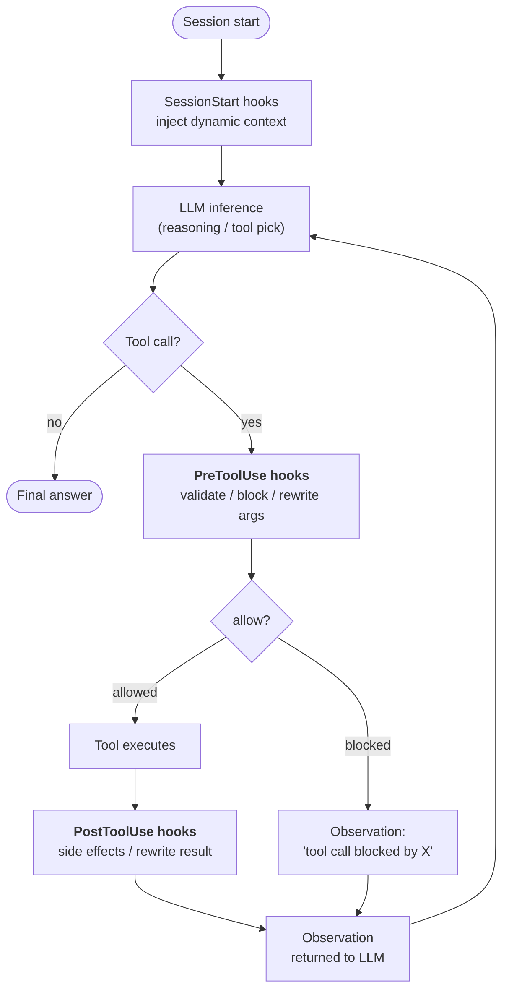
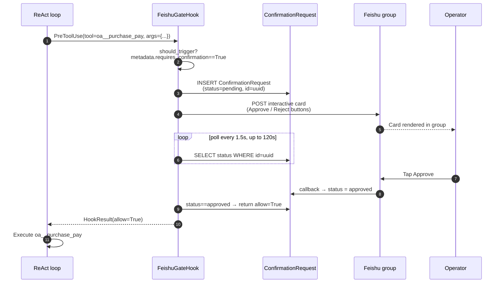

## フックが存在する理由

システムプロンプトの指示は**提案**です。十分に頑固または混乱したLLMはそれらを無視できます。ほとんどの智能体の動作では、それはまさにあなたが望むことです — 指示はモデルに適応する余地を与えます。

しかし、いくつかの要件は提案ではありません。「すべての機密ツール呼び出しはログに記録される必要があります」「書き込み操作は、組織が読み取り専用モードの場合はブロックされます」「¥50k以上の支払いは実行前に人間の確認が必要です」。これらは**不変条件** — モデルがどのターンで何を決定しようとも成立する必要があるシステムについての事実です。

フックは、智能体の実行ライフサイクルの明確に定義されたポイントで**LLMループの外で**実行されるコードです。LLMはフックを見ることができません。LLMはフックに異議を唱えることができません。LLMはフックにステップをスキップするよう説得することはできません。`PreToolUse`フックが`allow=False`を返した場合、ツール呼び出しは発生しません — 推理トレースがどれほど執拗であっても関係ありません。

これが重要なアーキテクチャ上の区別です：

| メカニズム | 実行場所 | 制御者 | 保証 |
|---|---|---|---|
| **システムプロンプト指示** | LLM推論内 | モデル | 「おそらく従う」 |
| **ツール説明 / スキーマ** | LLM推論内 | モデル | 「おそらく従う」 |
| **フック** | LLM推論の周囲 | プラットフォームコード | **常に実行される** |

フックは、FIM Oneが「智能体は...することになっている」を「智能体は...をバイパスできない」に変える方法です。

## フックが接続される場所

現在、3つのフックポイントが定義されています。各ポイントは、智能体が1つのループ反復中に越える境界をマークします：



| フックポイント | 発火するタイミング | ブロック可能か | データ変更可能か |
|---|---|---|---|
| `SessionStart` | セッションの最初のLLM呼び出しの前 | いいえ | はい — 初期提示词にコンテキストを注入します |
| `PreToolUse` | LLMがツールを選択した後、ツール実行前 | **はい** (`allow=False`経由) | はい — 実行前に`tool_args`を書き直すことができます |
| `PostToolUse` | ツールが戻った後、観測がLLMに渡される前 | いいえ | はい — 観測を書き直すことができます |

同じポイントの複数のフックは優先度順に実行されます。前の`PreToolUse`フックで書き直された引数は後続のフックに引き継がれるため、ミドルウェアが構成されます。

## フックと命令のどちらを使うか

要件をプロンプト命令またはフックで解決するかの判断は、「実行時アサーション対コードコメント」と同じ計算です：

| 症状 | ソリューション |
|---|---|
| 「智能体はYの場合、Xを優先すべき」 | 命令 — ソフトガイダンス、モデルに裁量がある |
| 「智能体はコネクタZへのすべての呼び出しをログに記録する必要がある」 | **PostToolUse フック** — モデルが記憶することに依存できない |
| 「¥50k以上の支払いには人間の承認が必要」 | **PreToolUse フック** — モデルに尋ねることに依存できない |
| 「智能体は中国語で自己紹介すべき」 | 命令 — スタイル的、見落とされても低コスト |
| 「智能体は読み取り専用モードで本番データベースに書き込むことはできない」 | **PreToolUse フック** — セキュリティ不変式、ゼロトレランス |
| 「智能体は長いDBクエリ結果を要約すべき」 | どちらでもよいが、フックはより堅牢 — PostToolUse truncateを参照 |

経験則：**間違った動作がインシデントの場合はフックを使用します。間違った動作が軽微な不便の場合は、命令で問題ありません。**

## フックコントラクト

フックは `PreToolUseHook`、`PostToolUseHook`、または `SessionStartHook` のサブクラスで、1つの必須メソッドを持ちます：

```python
class ReadOnlyGuard(PreToolUseHook):
    name = "readonly_guard"
    priority = 5                          # lower runs earlier

    def should_trigger(self, ctx: HookContext) -> bool:
        return ctx.tool_name.startswith("sql_")

    async def execute(self, ctx: HookContext) -> HookResult:
        if org_is_readonly(ctx.metadata["org_id"]):
            return HookResult(
                allow=False,
                error="Org is in read-only mode — write blocked.",
                side_effects=["readonly_guard: blocked sql write"],
            )
        return HookResult()               # default: allow=True, no mutation
```

渡される `HookContext` は `tool_name`、`tool_args`、`agent_id`、`user_id`、およびエンジンがリクエストごとの事実（org id、conversation id、コネクタアクションの `requires_confirmation` フラグなど）を入力する柔軟な `metadata` 辞書を含みます。

返される `HookResult` は結果を制御します：

- `allow: bool = True` — ツール呼び出しが進行するかどうか（`PostToolUse` / `SessionStart` では無視されます）
- `error: str | None` — 人間が読める理由で、ブロックされた場合は観測値として LLM に表示されます
- `modified_args: dict | None` — 設定されている場合、実行前にツール引数を置き換えます
- `modified_result: Any | None` — 設定されている場合（PostToolUse）、LLM に返される前に観測値を置き換えます
- `side_effects: list[str]` — フックが実行した内容の監査証跡で、エージェントのトレースにマージされます

## ケーススタディ: `FeishuGateHook`

このシステムの上に構築された最初のフックは `FeishuGateHook` です。これは `PreToolUse` フックで、`requires_confirmation=True` とフラグ付けされたツールを、組織の Feishu グループに投稿されるヒューマン・イン・ザ・ループ承認カードに変換します。

このフックは完全なライフサイクルを実行します:



このデザインがもたらすもの:

- **ツール呼び出しは本当に一時停止します。** エージェントの SSE ストリームは「`oa__purchase_pay` を呼び出します」と観察の間で一時停止します。ユーザーはエージェントが待機しているのを見ます。これは内部で起きていることと一致します。
- **承認はプロセス再起動後も保持されます。** 保留中の行はデータベースにあり、メモリにはありません。カードが未処理の状態でバックエンドが再起動した場合、次のポーリングは中断したところから再開します。
- **決定は監査されます。** `ConfirmationRequest` は `payload`、`responded_at`、`responded_by_open_id`、および最終ステータスを保持します。誰が何をいつ承認したかの監査可能な記録です。
- **決定ループに LLM はありません。** モデルはツール呼び出しを生成します。人間は判定を生成します。フックは決定論的なブリッジです。

`FeishuGateHook` は設定済みの [Feishu Channel](/configuration/channels/feishu) に依存します。フックはチャネルの `send_interactive_card()` メソッドを通じてカードを送信し、チャネルが解析したコールバックイベントをリッスンします。この分離は意図的です。フックは「承認ステートマシン」を所有し、チャネルは「IM プラットフォーム機構」を所有します。同じフックは、ロジックを変更することなく、明日 Slack または WeCom をターゲットにすることができます。チャネル実装のみを変更します。

## 計画中のフック (v0.9)

v0.9 ロードマップには 4 つのフックパターンがあり、すべて同じライフサイクルを再利用します:

| フック | ポイント | 目的 |
|---|---|---|
| `AuditLogHook` | PostToolUse | すべてのコネクタ呼び出しで `ConnectorCallLog` を自動的に書き込みます。現在これは手動です。フックにすることでカバレッジを確保します。 |
| `ReadOnlyGuard` | PreToolUse | 組織が読み取り専用モードの場合、書き込みをブロックします。 |
| `ResultTruncateHook` | PostToolUse | 過度に大きいツール観測 (>8k 文字) を LLM コンテキストに到達する前に切り詰めます。 |
| `ConnectorRateLimitHook` | PreToolUse | コネクタごと、ユーザーごとの呼び出し頻度上限。LLM レート制限とは独立しています。 |

ユーザー定義フックレイヤーも計画中です: エージェントごとの YAML 設定 (`hooks: [...]`) で、マッチングツールイベントで実行するシェルコマンドまたは Python 呼び出し可能オブジェクトを宣言します。これは最新のエージェントフレームワーク (Claude Code、OpenDevin) が収束したパターンに従います — フックベースの強制により、「必ず実行される」ロジックをプロンプトから除外します。

## Hooks vs. Channels

The two abstractions solve orthogonal problems:

| Concept | What it models | Lifetime | Example |
|---|---|---|---|
| **Hook** | 智能体の実行内でプラットフォームコードが実行されるポイント | ツール呼び出しごと | `FeishuGateHook`, `AuditLogHook` |
| **Channel** | 外部メッセージングプラットフォームへのプラグイン可能なアダプター | 組織ごとの長期間 | `FeishuChannel`, planned `SlackChannel` |

Hooks は Channels を消費します — 外部世界と通信する必要があるフック（カードを送信、アラートを投稿、グループにエスカレート）は、組織の Channel を呼び出します。フックが使用していない Channel でも有用です（例：智能体がツール経由で主動的に通知を送信できます）が、承認ゲートパターンは両方が揃っていることが必要です。

別の言い方をすると：**Channels は「人間と通信する場所」のプラミング、Hooks は「人間と通信する必要がある時」のポリシーです**。本番環境の人間参加型ワークフローには両方が必要です。

## 現在の状態 (v0.8.4)

リリース済みおよび今後予定されている機能のスナップショット:

- ✅ `HookRegistry`、`HookContext`、`HookResult` プリミティブが ReAct と DAG の両方に統合
- ✅ `PreToolUseHook` / `PostToolUseHook` / `SessionStartHook` 抽象基底クラス
- ✅ `FeishuGateHook` — 完全実装。`ConfirmationRequest` テーブル、ポーリングループ、タイムアウト/有効期限、コールバック駆動の状態遷移を含む
- ✅ Feishu チャネルコールバックエンドポイント。`card.action.trigger` をデコードして保留中の行を更新
- ✅ エージェントレベルのフック宣言: `agent.model_config_json.hooks.class_hooks` は ReAct/DAG セッションごとにインスタンス化された `HookRegistry` に解決
- 🟡 **実行サーフェス間のフック継承** (v0.8.5): メインチャットパス (Portal、API、DAG) がフックを発火。Eval Center は意図的に**フックをバイパス** (自動評価は人間の承認でブロックされてはいけない)。委譲されたサブエージェント (`CallAgentTool`) と Workflow `AGENT` ノードは現在、親フックを継承しない — 継承ポリシーは v0.8.5 の決定ポイント
- ❌ `AuditLogHook`、`ReadOnlyGuard`、`ResultTruncateHook`、`ConnectorRateLimitHook` (v0.9)
- ❌ ユーザー定義 YAML フック宣言 (v0.9)

フックシステムは v0.9 本番環境強化のための**負荷を支える基盤**です。その最初のユーザー (`FeishuGateHook`) はそれ自体が本番機能でもあるため、フックカタログ全体の完成を待つのではなく、2026-04-24 ロードショーのために早期にスケルトンをリリースしました。
