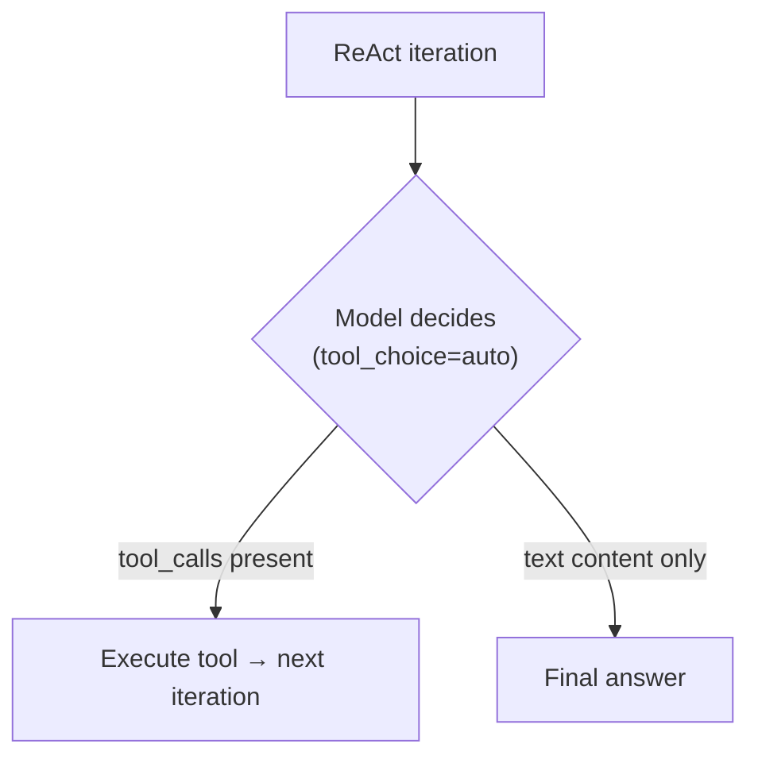
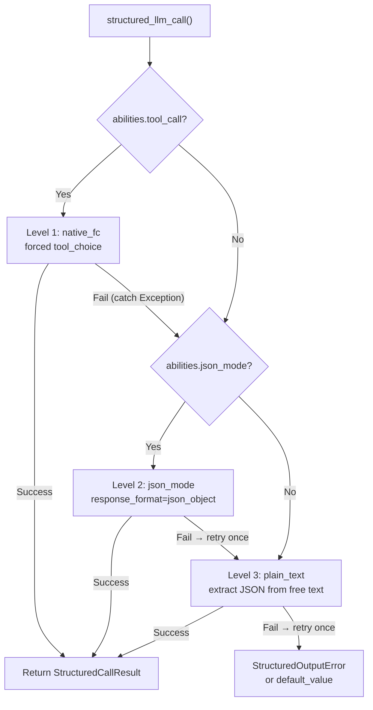

## プロバイダー検出

FIM Oneはユニバーサルアダプターとして LiteLLM を使用します。`core/model/openai_compatible.py` の `_resolve_litellm_model()` 関数は、ユーザーの `LLM_BASE_URL` + `LLM_MODEL` を、プロバイダープレフィックス付きの LiteLLM モデル識別子にマッピングします。プレフィックスは、LiteLLM がリクエストをどのようにルーティングするかを決定します — ネイティブ API プロトコル（Anthropic Messages API、Gemini など）またはジェネリック OpenAI 互換の `/v1/chat/completions`。

解決順序：

1. **明示的なプロバイダー**（DB の `ModelConfig.provider` フィールドから）— 最優先。プロバイダーが URL 内の既知ドメインと一致する場合、`api_base` は返されません（LiteLLM はネイティブでルーティング）。それ以外の場合、`api_base` はリレー URL に設定されます。
2. **`KNOWN_DOMAINS` に対するドメイン一致** — 公式 API エンドポイントはホスト名で認識されます。
3. **`PATH_PROVIDER_HINTS` に対する URL パスヒント** — UniAPI のようなリレープラットフォームで一般的です。パスに `/claude` または `/anthropic` が含まれている場合、アップストリームプロトコルを示します。
4. **フォールバック** — `openai/` プレフィックス（ジェネリック OpenAI 互換）。

| ドメイン / パス | プロバイダープレフィックス | プロトコル |
|---|---|---|
| `api.openai.com` | `openai/` | OpenAI Chat Completions |
| `anthropic.com` | `anthropic/` | Anthropic Messages API |
| `generativelanguage.googleapis.com` | `gemini/` | Google Gemini |
| `api.deepseek.com` | `deepseek/` | DeepSeek（OpenAI 互換） |
| `api.mistral.ai` | `mistral/` | Mistral |
| パスに `/claude` または `/anthropic` を含む | `anthropic/` | Anthropic Messages API（リレー経由） |
| パスに `/gemini` を含む | `gemini/` | Google Gemini（リレー経由） |
| その他すべて | `openai/` | ジェネリック OpenAI 互換 |

プロバイダープレフィックスがネイティブプロトコル（anthropic、gemini など）で、URL が公式エンドポイントでない場合、LiteLLM はネイティブプロトコルを使用しますが、リレーの `api_base` にリクエストを送信します。これは、プロバイダー固有の動作（以下で説明する Bedrock プリフィル問題を含む）がリクエストが公式 API に送信されるか、リレー経由で送信されるかに関わらず適用されることを意味します。

<Warning>
リレー URL のパスに `/claude` が含まれている場合、FIM One は自動的に Anthropic のネイティブプロトコル経由でルーティングします。これは通常正しい選択です（ストリーミングとシンキングサポートが向上）が、プロバイダー固有の動作が適用されることを意味します — 以下で説明する Bedrock プリフィル問題を含みます。
</Warning>

## tool_choice — 4つのモード

`tool_choice` パラメータは OpenAI 形式で標準化されています。LiteLLM はリクエストを送信する前に、各プロバイダーのネイティブプロトコルに変換します。

| モード | 意味 | プロバイダーサポート |
|---|---|---|
| `"auto"` | モデルがツール呼び出しまたはテキスト応答を決定 | すべてのプロバイダー |
| `"required"` | ツール呼び出しが必須だが、モデルが選択 | ほとんどのプロバイダー |
| `{"type":"function","function":{"name":"X"}}` | 関数 X の呼び出しが必須 | ほとんどのプロバイダー — **Anthropic thinking と互換性なし** |
| `"none"` | ツール使用不可、テキストのみ | すべてのプロバイダー |

`"auto"` と強制モード（`{"type":"function",...}`）の区別は、FIM One のあらゆる互換性問題の核心です。これら 2 つのモードは、異なる要件を持つまったく異なるサブシステムで使用されています。

## tool_choiceが使用される場所

2つのサブシステムが`tool_choice`を使用しており、それらは根本的に異なる方法でそれを使用しています。

### ReAct エンジン — tool_choice="auto"

ReAct ループでは、モデルが各イテレーションで以下を決定する必要があります: ツールを呼び出すか、最終的な回答を提供するか。ここで意味があるのは `"auto"` だけです — モデルは `tool_calls` を生成するか、テキスト コンテンツを生成するかを自由に選択します。これはすべてのプロバイダー、すべてのモデル、拡張思考を含むすべてのモードと互換性があります。



ReAct エンジンは、`abilities["tool_call"] = True` の場合にネイティブ関数呼び出し (`_run_native`) を使用し、それ以外の場合は JSON-in-content モード (`_run_json`) にフォールバックします。両方のモードで `"auto"` を使用します — 違いは、ツールが `tools` パラメータを介して渡されるか、システム プロンプトで説明されるかです。詳細は [ReAct エンジン — デュアルモード実行](/architecture/react-engine#dual-mode-execution) を参照してください。

### structured_llm_call — tool_choice=forced

ワンショット構造化抽出（スキーマアノテーション、DAG計画、計画分析）。モデルに特定の仮想関数を呼び出すことを強制し、構造化JSON出力を保証します。これはプロバイダー固有のエラーをトリガーするコールサイトです。

`structured_llm_call` は3レベルの劣化チェーンを実装します：



重要な設計上の違い：`structured_llm_call` のフォールバックは**実行時**です — 各レベルを動的に試行し、例外をキャッチして次のレベルに進みます。ReActエンジンのモード選択は**ビルド時**です — 開始時に `_native_mode_active` を一度チェックし、ループ全体で1つのモードにコミットします。つまり、`structured_llm_call` はプロバイダー固有の400エラーから透過的に回復できますが、ReActは事前に正しくモードが選択されていることに依存しています。

## Bedrockプリフィルトラップ

`response_format={"type":"json_object"}` が `anthropic/` プレフィックスで解決されたモデルに渡される場合、LiteLLMは内部的にアシスタントプリフィルメッセージを注入してJSONモードをシミュレートします。Anthropic Messages APIにはネイティブな `response_format` パラメータがないため、LiteLLMはアシスタントコンテンツとして開き括弧を前置することで近似します：

```json
{"role": "assistant", "content": "{"}
```

これはAnthropicの直接APIで機能します。ただし、より新しいAWS Bedrockモデルバージョンは、最後のメッセージが `role: "assistant"` を持つ会話を拒否します — これを「アシスタントメッセージプリフィル」と呼び、以下をスローします：

```
ValidationException: This model does not support assistant message prefill.
The conversation must end with a user message.
```

このエラーは、**以下の3つの条件すべてが同時に満たされる場合**にのみ発生します：

1. モデルが `anthropic/` プレフィックスで解決されている（ドメインマッチまたはURLパスヒント経由）。
2. `response_format={"type":"json_object"}` が渡されている（`structured_llm_call` のjson_modeコードパス）。
3. 実際のバックエンドがAWS Bedrock（プリフィルを拒否）である。

<Warning>
これはネイティブツール呼び出し（`tool_choice="auto"` と `tools=` パラメータ）には影響しません。プリフィル注入は `response_format` に対してのみ発生します。ReActエージェント実行は完全に影響を受けません。
</Warning>

Level 1（native_fc）とLevel 2（json_mode）の両方がBedrockで失敗する場合、システムはLevel 3（plain_text）で回復します。以下で説明する `json_mode_enabled` フラグは、無駄なLevel 2呼び出しを排除します。

### 修正: json_mode_enabled

モデルごとの `json_mode_enabled` フラグは、Level 2 (json_mode) が試行されるかどうかを制御します:

- **DB設定モデル**: Admin → Models → Advanced settings でトグル。フラグは `ModelConfig.json_mode_enabled` に保存されます (デフォルト `TRUE`)。
- **ENV設定モデル**: 環境変数で `LLM_JSON_MODE_ENABLED=false` を設定。
- **効果**: 無効化すると、`abilities["json_mode"]` は `False` を返す → `response_format` は渡されない → プリフィルなし → Bedrock が動作。デグラデーションチェーンは `native_fc → plain_text` となり、失敗する json_mode 呼び出しをスキップします。
- **品質低下なし**: システムプロンプトがモデルに有効な JSON を返すよう指示するため、モデルは依然として有効な JSON を返します。plain_text レベルは `extract_json()` を使用してフリーフォーム コンテンツから JSON を解析し、最新のモデルで確実に動作します。

## Anthropicの思考 + 強制tool_choice

Anthropicの API は、拡張思考が有効な場合、`tool_choice={"type":"function","function":{"name":"X"}}` を拒否します：

```
Thinking may not be enabled when tool_choice forces tool use
```

これはプロトコルレベルでの意味的な競合です：特定のツール呼び出しを強制することは、モデルがどのツールを呼び出すかについて推論する自由と矛盾しています。Anthropic はこの制約を強制します。他のプロバイダーはそうではありません。

`structured_llm_call` は、native_fc（強制された `tool_choice` レベル）を呼び出すときに `reasoning_effort=None` を渡すことでこれを処理します。これにより、その特定の呼び出しの拡張思考が無効になるため、強制tool_choice はグローバルな推論設定に関係なく常に機能します。構造化出力呼び出し（DAG計画、スキーマ注釈、計画分析）には、深い推論ではなく**スキーマ準拠**が必要です。ここで思考を無効にすることは、正しく、かつ有益です（レイテンシが低く、コストが低い）。

`tool_choice="auto"` は思考モードの影響を受けません。ReAct エンジンは `"auto"` のみを使用するため、エージェント実行は思考が有効な状態で機能します。

<Warning>
この制約を回避するために `abilities["tool_call"] = False` を設定しないでください。これにより ReAct の `_run_native` モード（`tool_choice="auto"` を使用し、思考で正常に機能）が無効になり、信頼性の低い `_run_json` モードに強制されます。
</Warning>

<Note>
**プロバイダー移行に関する注記：** 一部のサードパーティリレーは、`reasoning_effort` などのサポートされていないパラメータを暗黙的にドロップします（`drop_params=True`）。そのため、設定されていても思考は決してアクティベートされません。思考を適切にサポートするプロバイダー（Bedrock、直接 Anthropic API）に移行する場合、native_fc の `reasoning_effort=None` により一貫した動作が保証されます。ユーザーアクションは不要です。構造化出力はすべてのプロバイダー間で同じように機能します。
</Note>

## クイックリファレンス: どこで何が機能するか

| シナリオ | ReAct モード | structured_llm_call パス | 注記 |
|---|---|---|---|
| OpenAI (任意のモデル) | `_run_native` | native_fc | 完全サポート |
| Anthropic (thinking なし) | `_run_native` | native_fc | 完全サポート |
| Anthropic + thinking | `_run_native` | native_fc (thinking 自動無効化) | 構造化出力のみ thinking が無効化 |
| Bedrock リレー (thinking なし) | `_run_native` | native_fc | 完全サポート |
| Bedrock リレー + thinking | `_run_native` | native_fc (thinking 自動無効化) | 構造化出力のみ thinking が無効化 |
| Gemini | `_run_native` | native_fc | 完全サポート |
| DeepSeek | `_run_native` | native_fc | 完全サポート |
| 汎用 OpenAI 互換 | `_run_native` | native_fc | 完全サポート |
| `tool_call=false` のモデル | `_run_json` | json_mode または plain_text | ツール呼び出しをサポートしないモデルのフォールバック |

**AWS Bedrock リレーの推奨設定:**

```bash
# In .env or environment
LLM_JSON_MODE_ENABLED=false
```

または管理 UI でモデルごと: Admin → Models → Bedrock モデルを選択 → Advanced → 「JSON Mode」を無効化。

Bedrock の `json_mode_enabled=false` の設定は多層防御として推奨されます。Native_fc は構造化出力を確実に処理しますが、予期しない理由で失敗した場合、json_mode を無効化することでフォールバックチェーンが Bedrock プリフィルトラップをスキップし、plain_text に直接進みます。

## 推論努力と思考設定

FIM One は、拡張思考/推論を制御するための 2 つの環境変数を公開しています:

| 変数 | 値 | 効果 |
|---|---|---|
| `LLM_REASONING_EFFORT` | `low`, `medium`, `high` | LiteLLM に `reasoning_effort` として渡されます。Anthropic: `thinking` パラメータにマップされます。OpenAI o シリーズ: そのまま渡されます。その他: サイレントにドロップされます (`drop_params=True`)。 |
| `LLM_REASONING_BUDGET_TOKENS` | 整数 (例: `10000`) | Anthropic のみ: 明示的な `thinking.budget_tokens` キャップを設定し、LiteLLM の自動マッピングをバイパスします。Claude モデルのコスト制御に便利です。 |

`reasoning_effort` が設定され、モデルが `anthropic/` として解決される場合、以下の 2 つの追加動作が適用されます:

1. **温度は 1.0 に強制されます。** Bedrock は思考が有効な場合、`temperature != 1.0` を拒否します。FIM One はこれを自動的に処理します — ユーザーアクションは不要です。
2. **GPT-5.x とツール**: `tools` が存在する場合、`reasoning_effort` はサイレントにドロップされます。これは GPT-5 の `/v1/chat/completions` エンドポイントがこの組み合わせを拒否するためです。これは ReAct ツールループにのみ影響します。`tools` パラメータを持たない `structured_llm_call` 呼び出しは影響を受けません。

## 構造化出力の防御的パース

native_fcが正しく動作している場合でも、構造化出力パイプラインには、任意のプロバイダーまたは互換性レイヤーからのエッジケースを処理するための防御的パース層が含まれています。

DAGプランナーの`_dict_to_steps`パーサーは、3つの一般的なエッジケースを処理します:

1. **配列の代わりに単一オブジェクト。** 一部のモデルは`{"steps": [{"id": "1", "task": "..."}]}`（配列）の代わりに`{"steps": {"id": "1", "task": "..."}}`（単一ステップオブジェクト）を返します。パーサーは`id`または`task`キーをチェックしてこれを検出し、オブジェクトをリストでラップします。

2. **ダブルエンコードされたJSON文字列。** 構造化出力がスキーマ強制を欠くjson_modeにフォールバックする場合、一部のプロバイダーは`steps`値をネイティブ配列ではなくJSON文字列として返します。例えば`{"steps": "[{\"id\": \"1\", ...}]"}`です。この文字列には、標準的な`json.loads`を破壊するモデルのフォーマットからのリテラル改行も含まれる場合があります。パーサーは`extract_json_value()`（`_repair_json_strings`を含む）を使用して以下を処理します:
   - JSON文字列値内のリテラル改行
   - 無効なエスケープシーケンス（LaTeXまたはコードコンテンツで一般的）
   - 互換性レイヤーからの他のシリアライゼーション特性

3. **`steps`ラッパーの欠落。** モデルは`steps`ラッパーキーなしでトップレベルオブジェクトとして単一ステップを返す場合があります。パーサーはルートレベルで`id`と`task`を検出し、それに応じてラップします。

<Note>
通常の動作では、native_fcは適切に構造化されたツール呼び出し引数を返し、これらのエッジケースは発生しません。防御的パーサーは、カスタム`BaseLLM`サブクラス、異常なプロバイダー動作、または構造化出力がjson_modeまたはplain_textに低下するフォールバックシナリオのための安全ネットとして存在します。
</Note>

## トラブルシューティング

**「このモデルはアシスタントメッセージプリフィルをサポートしていません」**
Bedrock + json_mode。`LLM_JSON_MODE_ENABLED=false`を設定するか、管理者モデル設定でJSON Modeを無効にしてください。

**「tool_choiceがツール使用を強制する場合、Thinkingは有効にできない可能性があります」**
`structured_llm_call`はnative_fcコールの場合、自動的にthinkingを無効にします。このエラーが表示される場合は、`structured_llm_call`をバイパスするコードパスか、`reasoning_effort`kwargを受け入れないカスタム`BaseLLM`サブクラスを示しています。LLMサブクラスのシグネチャが`BaseLLM.chat()`と一致することを確認してください。

**「DAGパイプラインが失敗しました: LLM 'steps'は配列ではありません」**
LLMが`steps`フィールドを文字列または単一オブジェクトとして返しました。これは通常、構造化出力がjson_modeにフォールスルーしたことを意味します（スキーマ強制がありません）。ログで`structured_llm_call: level=xxx`を確認してください。`json_mode`ではなく`native_fc`が表示されている場合、native_fcが静かに失敗しています。カスタム`BaseLLM`サブクラスを使用している場合は、`reasoning_effort`kwargを受け入れることを確認してください。

**ReActが予期せずJSON modeにフォールバックする**
モデルの`abilities["tool_call"]`が`True`であることを確認してください。これは`OpenAICompatibleLLM`では常に`True`ですが、カスタム`BaseLLM`サブクラスはこれをオーバーライドする可能性があります。管理者APIのモデル詳細エンドポイントで確認してください。

**structured_llm_callがすべてのレベルを使い尽くしてStructuredOutputErrorを発生させる**
モデルはいずれのレベルでも解析可能なJSONを生成できませんでした。これは最新のモデルではまれです。確認してください: (1) スキーマが有効なJSON Schemaである、(2) モデルが完全な応答を生成するのに十分な`max_tokens`を持っている、(3) システムプロンプトがスキーマ指示と矛盾していない。DAGプランナーとアナライザーは両方とも`default_value`フォールバックを提供するため、このエラーはデフォルトを明示的に省略した呼び出しサイトからのみ伝播します。
