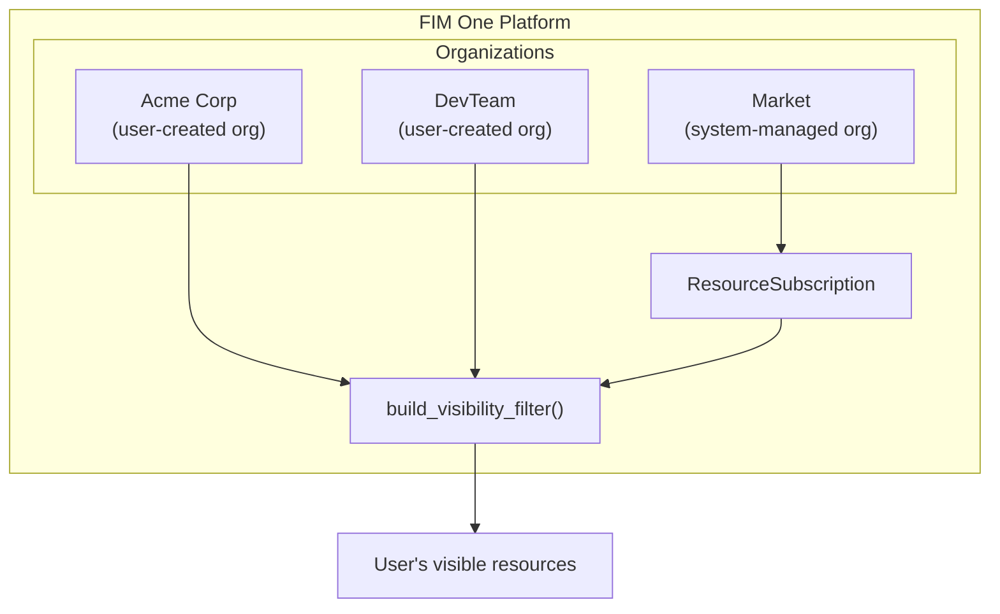
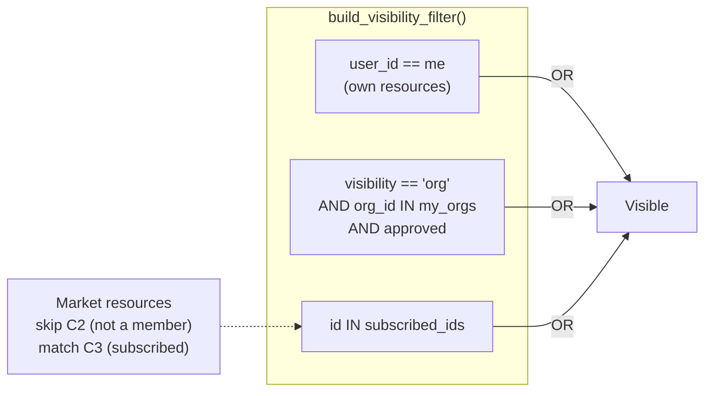
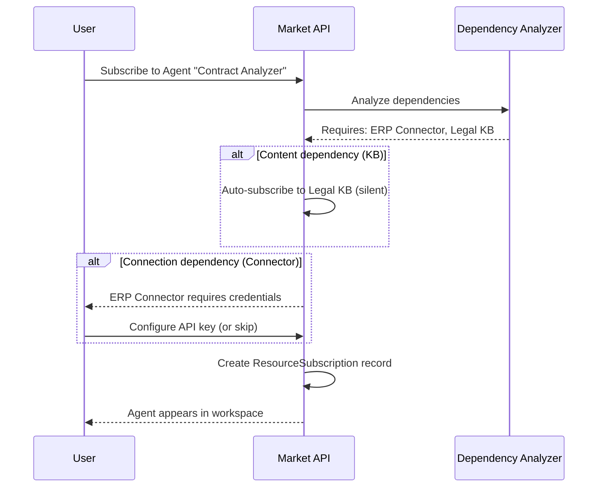
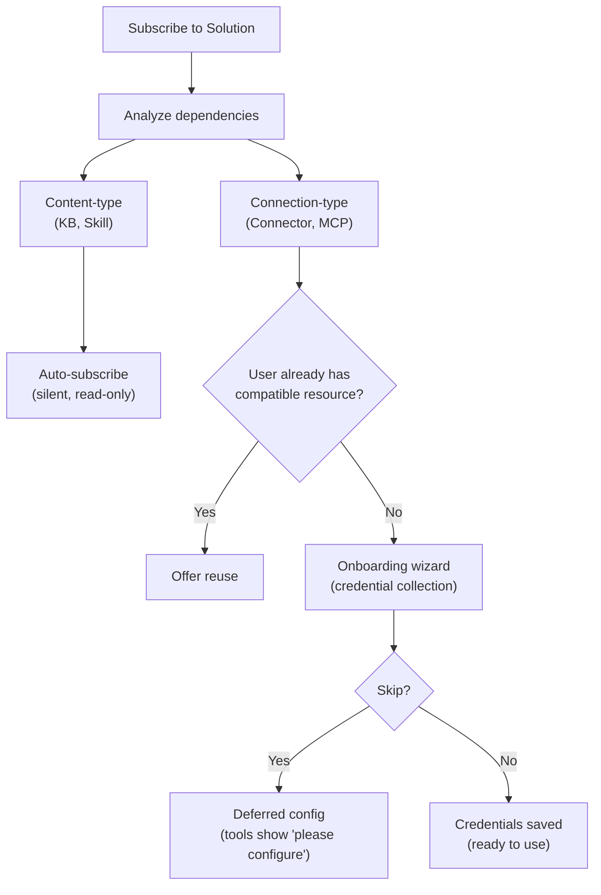

## 概要

Market は FIM One のリソースマーケットプレイスです。ユーザーが構築したリソースを公開し、他のユーザーがそれらを発見して購読し、購読したリソースは購読者のワークスペースに自分のものであるかのように表示されます。システム全体は、単一のアーキテクチャ上の洞察に基づいて構築されています：**Market は組織である** — システムが管理するシャドウ組織で、特別な信頼ルールを持ちます。

このページでは、Market の内部アーキテクチャについて説明します。公開と購読のユーザー向け概要については、[Market (Features)](/concepts/market) を参照してください。購読したリソースがツールセットに読み込まれる方法については、[エージェント & リソース発見](/architecture/agent-discovery) を参照してください。

## 2段階分類

マーケットプレイスは、リソースがどのように実装されているかではなく、リソースが何をするかに基づいて、リソースを2つのカテゴリに整理しています。

### ソリューション

ソリューションは**あなたのために機能するもの**です。ユーザーはソリューションを購読し、すぐに使用できる機能を取得します。

| リソースタイプ | 機能 |
|---|---|
| **エージェント** | バインドされたツール、ナレッジ、および指示を備えた会話型AI アシスタント |
| **スキル** | `call_agent` を介して複数のエージェントをオーケストレーションできるグローバル SOP (標準操作手順) |
| **ワークフロー** | ビジュアル編集と決定論的実行を備えた DAG ベースの自動化フロー |

ソリューションは他のリソースに依存する場合があります。エージェントは API 呼び出し用の特定のコネクタと取得パイプライン用のナレッジベースが必要な場合があります。マーケットプレイスは購読時にこれらの依存関係を自動的に処理します ([依存関係の解決](#dependency-resolution)を参照)。

### コンポーネント

コンポーネントは開発者向けの**再利用可能なビルディングブロック**です。ソリューションが消費する機能を提供します。

| リソースタイプ | 機能 |
|---|---|
| **コネクタ** | API またはデータベース統合アダプタ定義 |
| **MCP サーバー** | Model Context Protocol を使用したツールサービス設定 |

コンポーネントはサブスクライブが簡単です。内部依存関係がなく、認証情報の要件のみがあります。

### ナレッジベースが独立してリストされない理由

ナレッジベースはスタンドアロンのマーケットリソースとして公開されていません。これらはソリューションの内部依存関係です。エージェントの検索パイプラインまたはスキルの参考資料です。ユーザーがナレッジベースに依存するソリューションにサブスクライブすると、KBは読み取り専用参照として自動的に含まれます。サブスクライバーがナレッジベースを個別に検索、評価、または管理する必要はありません。

<Info>
2層分類（ソリューション対コンポーネント）は**表示層の概念**です。これはクエリ時に`resource_type`から派生し、別のフィールドとして保存されません。基盤となるサブスクリプションメカニズム、可視性フィルター、およびレビュープロセスは、すべてのリソースタイプで同じです。
</Info>

## 統一されたアーキテクチャ

### マーケットプレイスをシャドウ組織として

マーケットプレイスの最も重要なアーキテクチャ上の決定は、それが独立したサブシステムではないということです。それは**組織**です — システム管理の組織で、固定ID（`MARKET_ORG_ID`）を持ち、プラットフォーム初期化時に自動的に作成されます。

これは以下を意味します：

- **同じ可視性フィルター**（`build_visibility_filter()`）が、個人、組織、およびマーケットプレイスのリソースを単一クエリで処理します。マーケットプレイス検索用の特殊なコードはありません。
- **同じサブスクリプション機構**（`ResourceSubscription`）が、組織とマーケットプレイスの両方のリソースに適用されます。組織リソースへのサブスクリプションとマーケットプレイスリソースへのサブスクリプションは、同じレコードを作成します。
- **同じ認証情報処理**（フォールバック、ユーザーごとのオーバーライド）が両方のコンテキストで機能します。コネクターとMCP サーバーの`allow_fallback`フラグは、ソースに関わらず同じように動作します。
- **同じレビュープロセス**（`apply_publish_status()`）が、組織レベルとマーケットプレイスレベルの両方を処理します。唯一の違いは、マーケットプレイス組織がすべてのレビューフラグを`true`にロックしていることです。

通常の組織とマーケットプレイス組織の主な違い：

| 側面 | 組織 | マーケットプレイス |
|---|---|---|
| **信頼モデル** | 高信頼（チームメンバーシップ） | 信頼なし（グローバルコミュニティ） |
| **レビュー** | リソースタイプごとにオプション | すべてのタイプで常に必須 |
| **アクセス** | すべてのメンバーに自動 | 明示的なサブスクリプションが必要 |
| **スコープ** | チームまたは企業 | グローバル |

<Tip>
マーケットプレイスは特別なルールを持つ単なる組織であるため、組織向けに構築されたすべての機能 — レビューワークフロー、認証情報管理、リソースライフサイクル — は、追加の実装なしで自動的にマーケットプレイスで機能します。
</Tip>

### 可視性フィルターの処理方法

Market orgにはメンバーシップを持つユーザーがいません。ユーザーは Market に「参加」するのではなく、個別のリソースをサブスクライブします。つまり、`MARKET_ORG_ID` はユーザーの `user_org_ids` リストに存在することはなく、org メンバーシップの可視性条件は Market リソースに対して自然にスキップされます。

代わりに、サブスクライブされた Market リソースは `build_visibility_filter()` の `subscribed_ids` パスを通ります：

この 3 つの条件の OR 句が可視性モデル全体です。個人用リソース、org 共有リソース、Market サブスクライブリソースは 1 つのクエリで解決され、リソースの出所に応じた分岐ロジックはありません。

### スコープベースのブラウジング

Market ページは、2 つのブラウジング コンテキスト間を切り替える**スコープ セレクター**を提供します:

| スコープ | 表示内容 | レビュー担当者 |
|---|---|---|
| **Global Market** | Market org に誰かが公開したリソース | プラットフォーム管理者 |
| **Organization: [name]** | 特定の org のメンバーが公開したリソース | org 管理者 |

同じ UI、同じタブ (Solutions / Components)、同じサブスクリプション フローが両方のスコープに適用されます。スコープを切り替えると、ブラウズ クエリの `org_id` フィルターのみが変わります。ユーザーの観点からは、エクスペリエンスは同じです。つまり、カタログをブラウジングして、インストールするものを選択しています。

## サブスクリプションフロー

### ブラウジングと検出

ユーザーはページネーション付きカタログを通じてマーケットをブラウジングします。各リソースには、名前、説明、アイコン、パブリッシャーのユーザー名、および購読ボタンが表示されます。ユーザーが既に購読しているリソースは、それに応じてマークされます。ブラウズAPI（`GET /api/market`）はユーザー自身のリソースを除外します。公開したものは購読できません。

### ソリューションへのサブスクライブ

ソリューション（エージェント、スキル、またはワークフロー）へのサブスクライブには、依存関係の分析が含まれます：

1. システムはソリューションの依存関係を分析します — 必要なコネクタ、ナレッジベース、MCP サーバー、およびスキルを特定します。
2. **コンテンツタイプの依存関係**（KB、スキル）は自動的にサイレントにサブスクライブされます。ユーザーはこれらを表示または管理しません。
3. **接続タイプの依存関係**（コネクタ、MCP サーバー）は要件として表示されます。オンボーディングウィザードが認証情報を収集します。
4. `ResourceSubscription` レコードが作成され、リソースがユーザーの可視性フィルターに表示されます。

### コンポーネントへのサブスクライブ

コンポーネント（コネクタと MCP サーバー）はより単純なフローを持っています — 依存関係分析は不要です。ユーザーがサブスクライブし、必要に応じて認証情報を設定すると、コンポーネントは使用可能になります。

### 認証情報の設定

認証情報は**ハイブリッドモデル**に従い、利便性と柔軟性のバランスを取ります：

- **サブスクリプション時に提供。** 接続タイプの依存関係が認証情報を必要とする場合、オンボーディングウィザードは認証情報フォームをすぐに表示します。
- **スキップ可能。** ユーザーは「スキップして後で設定」を選択できます。リソースはサブスクライブされますが、これらの認証情報が必要なツールは呼び出し時に「認証情報を設定してください」というメッセージを返します。
- **遅延設定。** ユーザーは設定ページからいつでも認証情報を設定または更新できます。

これは組織で使用されるのと同じ`allow_fallback`メカニズムです。パブリッシャーがフォールバックを有効にしてデフォルト認証情報を設定している場合、サブスクライバーは独自のキーを提供することなくリソースをすぐに使用できます。フォールバックが無効な場合、各サブスクライバーは独自のものを用意する必要があります。

<Warning>
認証情報フォールバックが有効になっているMarketリソースを使用する場合、APIリクエストはパブリッシャーの認証情報を通じて流れます。機密性の高い操作の場合は、独自の認証情報を提供するか、パブリッシャーの信頼性を確認することを検討してください。
</Warning>

### 購読解除

購読解除により、`ResourceSubscription` レコードが削除されます。リソースはユーザーの可視性フィルターから消え、ツールセットに読み込まれなくなります。自動購読依存関係を持つソリューションの場合、依存リソース（KB、スキル）もクリーンアップされます。リソースのユーザー設定認証情報が削除されます。

## 依存関係の解決

ソリューションが公開または購読されると、システムはその依存関係ツリーを分析します。依存関係は2つのカテゴリに分かれており、異なる処理戦略があります。

### コンテンツタイプの依存関係

**ナレッジベース**と**スキル**はソリューションによって参照されるコンテンツタイプの依存関係です。これらはソリューションが消費する読み取り専用データ（検索ドキュメント、SOP手順など）を提供します。

- **サブスクリプション時:** 自動的にサイレントサブスクリプションされます。ユーザーは各KBまたはスキルに対して個別のサブスクリプションステップを表示されません。
- **アクセスモデル:** 元の作成者のリソースへの読み取り専用参照。サブスクライバーはコンテンツを変更できません。
- **サブスクリプション解除時:** 親ソリューションがサブスクリプション解除されると自動的にクリーンアップされます。

### 接続タイプの依存関係

**コネクタ**と**MCPサーバー**がソリューションによって参照される場合、それらは接続タイプの依存関係です。機能するには認証情報が必要です。

- **サブスクリプション時:** オンボーディングウィザードで要件として表示されます。ユーザーは認証情報を設定するか、スキップするかを求められます。
- **スマートマッチング:** ユーザーが互換性のあるコネクタ（同じタイプ、同じベースURL）を既に持っている場合、システムは新しいサブスクリプションを作成する代わりに、それを再利用することを提案します。
- **サブスクリプション解除時:** サブスクリプションは削除されますが、ユーザーが作成した認証情報は保持されます（ユーザーは同じコネクタを他の場所で使用できます）。

## 公開

### ソリューションの公開

著者がエージェント、スキル、またはワークフローをマーケットプレイスに公開する場合:

1. システムはリソースに `visibility: "org"` と `org_id: MARKET_ORG_ID` を設定します。
2. システムはソリューションの依存関係を分析し、マニフェストを構築します — 必要なコネクタ、KB、および MCP サーバーをリストアップします。
3. マニフェストが著者に確認のため表示されます。
4. `apply_publish_status()` はリソースを `pending_review` に設定します (マーケットプレイス組織のすべてのレビューフラグは `true` にロックされています)。
5. システム管理者がリソースをレビューして承認または却下します。

### コンポーネントの公開

Connectorまたはサーバーの公開はより簡単です：

1. システムが上記のように可視性とorg_idを設定します。
2. 認証情報スキーマが抽出されます（サブスクライバーが入力する必要があるフィールド）。
3. リソースが`pending_review`に入り、管理者の承認を待ちます。

### レビュープロセス

レビュープロセスは、組織で使用されるのと同じメカニズムですが、1つの重要な違いがあります:

| コンテキスト | レビューが必要? | レビュー担当者 |
|---|---|---|
| **Organization** | リソースタイプごとに設定可能（`review_agents`、`review_connectors`など） | 組織管理者 |
| **Market** | すべてのリソースタイプで常に必須 | プラットフォーム管理者（Market組織の所有者） |

Market組織は6つのレビューフラグすべてが`true`に設定された状態で初期化され、この設定は変更できません。Marketに公開されるすべてのリソースは、ブラウズカタログに表示される前に管理者レビューに合格する必要があります。

<Note>
組織の所有者は自動的にレビューをバイパスします — 公開されたリソースはすぐに利用可能になります。Marketの場合、Market組織の所有者（システム管理者）のみがこのバイパス特権を持ちます。
</Note>

承認されたリソースが著者によって編集されると、`check_edit_revert()`は自動的に`publish_status`を`pending_review`に戻します。これにより、ライブMarketリソースへの変更がサブスクライバーに表示される前に再度レビューされることが保証されます。

## 実装に関する注記

### シャドウ組織

Market組織は、よく知られた固定ID（`00000000-0000-0000-0000-000000000001`）とスラッグ（`market`）を持っています。プラットフォーム初期化中に`ensure_market_org()`によって作成されます — 通常は最初の管理者ユーザーのログイン時です。この関数はべき等です。複数回呼び出しても安全です。

### ResourceSubscription

`ResourceSubscription` テーブルは Market アクセスのコアデータ構造です:

| Column | Purpose |
|---|---|
| `user_id` | 購読者 |
| `resource_type` | `agent`、`connector`、`knowledge_base`、`mcp_server`、`skill`、または `workflow` |
| `resource_id` | 購読されたリソースの ID |
| `org_id` | ソース org (Market org ID または通常の org ID) |

`(user_id, resource_type, resource_id)` に対するユニーク制約により、重複した購読を防ぎます。`org_id` カラムは購読の出所を追跡し、スコープを認識した購読解除を可能にします。

### 可視性フィルター統合

`resolve_visibility()` 関数は単一の呼び出しで 2 つのルックアップを実行します:

1. ユーザーの組織メンバーシップを取得 (`user_org_ids`)
2. ユーザーのサブスクリプションを取得 (`subscribed_ids`)

これらは `build_visibility_filter()` に渡され、3 つすべての可視性レベル (自分のもの、組織共有、サブスクリプション) を組み合わせた単一の SQL WHERE 句を生成します。この関数はリソースがクエリされるあらゆる場所で使用されます — エージェントリスト、コネクターのドロップダウン、スキルインジェクション、自動検出モード — プラットフォーム全体で一貫した可視性を確保します。

### 認証情報の暗号化

サブスクリプション中（またはその後の設定で）に設定された認証情報は、プラットフォームの暗号化キーを使用して保存時に暗号化されます。Market API は参照レスポンスで認証情報の値を公開することはありません — `_*_market_info()` ヘルパー関数ではメタデータ（名前、説明、アイコン、タイプ）のみが返されます。

## 関連項目

- [Organization & Market](/architecture/organization) -- 組織レベルの共有と信頼モデル
- [Agent & Resource Discovery](/architecture/agent-discovery) -- サブスクライブされたリソースがツールセットにどのように読み込まれるか
- [Connector Architecture](/architecture/connector-architecture) -- コネクタ設計、認証注入、監査
- [System Overview](/architecture/system-overview) -- すべてのリソースが収束する統一ツール抽象化
