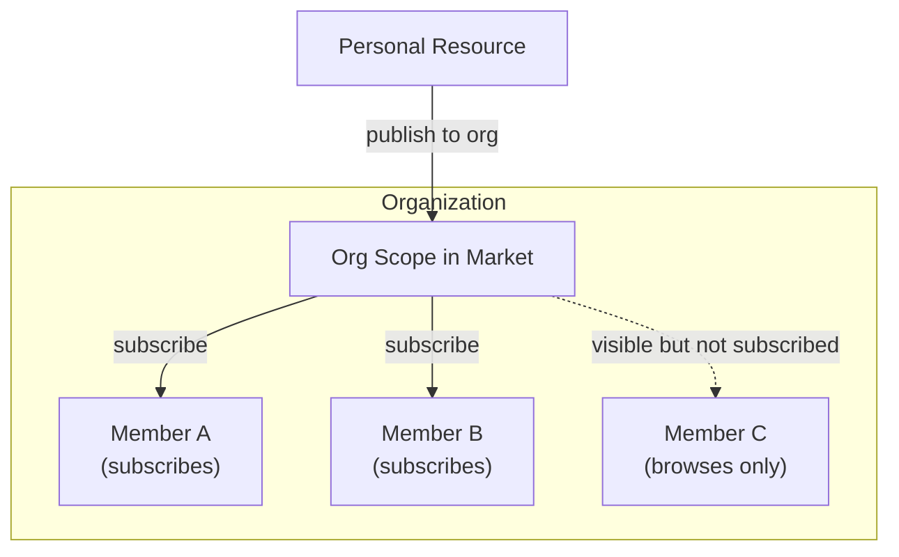
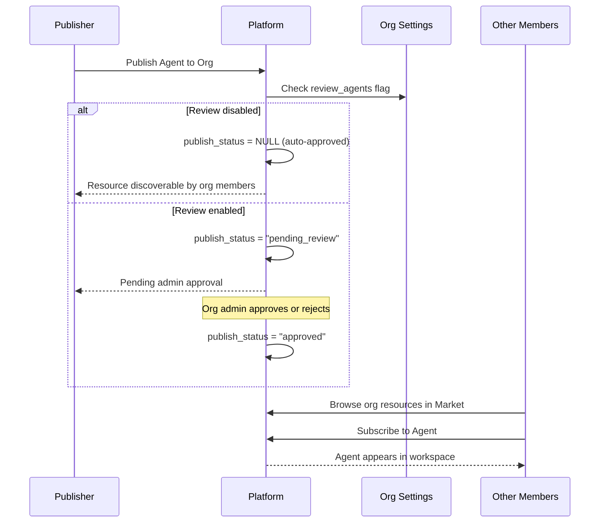
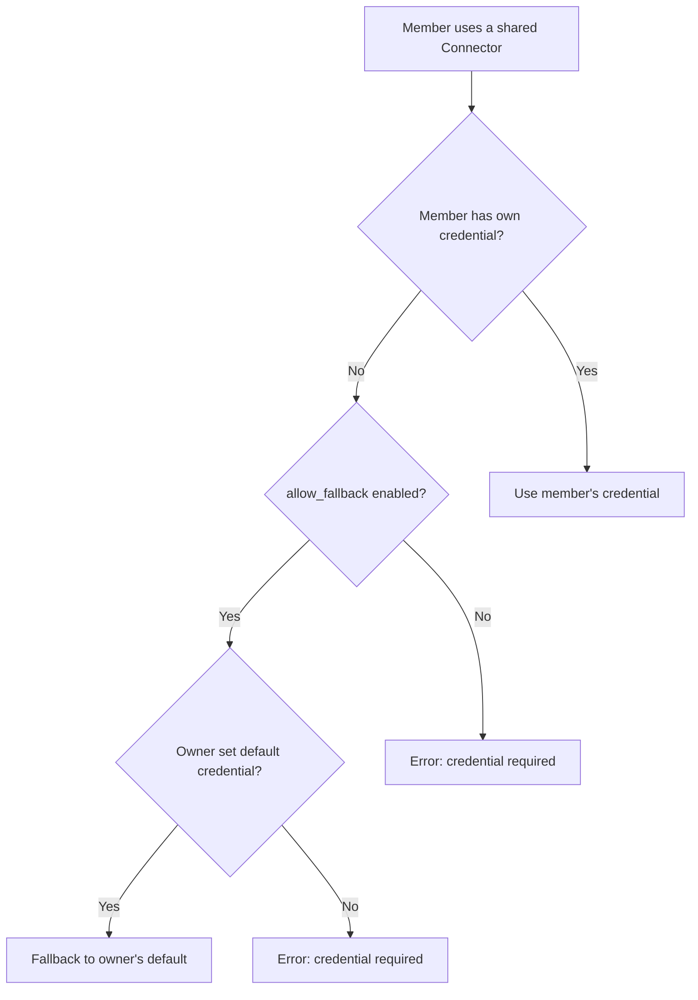
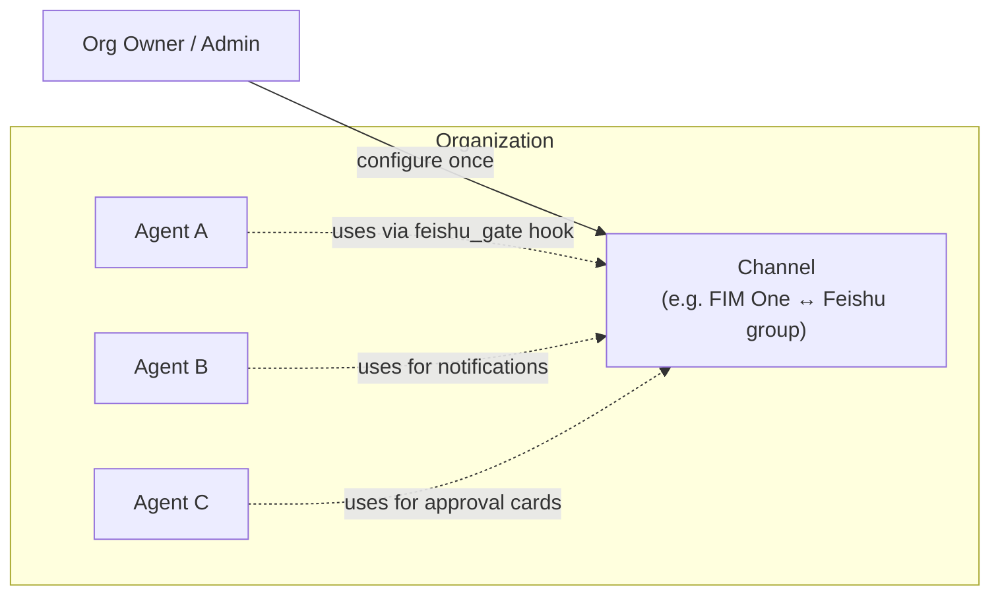

## 概要

組織はFIM Oneのチームコラボレーションの単位です。ユーザーグループがエージェント、コネクタ、ナレッジベース、MCPサーバー、ワークフロー、スキルなどのリソースを信頼できるスコープ内で共有できます。

FIM Oneのすべてのリソースは**個人用**として開始されます（作成者のみに表示されます）。リソースを組織に公開すると、マーケットの組織スコープを通じて他の組織メンバーが**発見可能**になります。メンバーは組織の共有リソースを参照し、必要なものにサブスクライブします。



組織とグローバルマーケットは同じサブスクリプションベースのアクセスモデルを共有しています。主な違いは信頼です。組織はメンバーが互いに知り、信頼し合うチームまたは企業を表すため、レビューはオプションで、認証情報の共有は簡単です。

## 組織の作成と管理

すべてのユーザーは**無制限**の組織を作成でき、任意の数の組織に参加できます。組織には3つのロールがあります：

| ロール | 権限 |
|---|---|
| **オーナー** | 完全な制御 — メンバー管理、設定の構成、レビューのバイパス |
| **管理者** | メンバー管理と公開リソースのレビュー |
| **メンバー** | 共有リソースの閲覧とサブスクリプション |

オーナーは常に組織を作成したユーザーです。所有権は譲渡できますが、共有することはできません。

## リソースの公開

組織にリソースを公開すると、すべてのメンバーのワークスペースに自動的に表示されるわけではありません。代わりに、リソースはマーケットの組織スコープで検出可能になり、メンバーはそこでリソースを閲覧して購読できます。

このサブスクリプションベースのモデルにより、各メンバーは自分のワークスペースを制御できます。大規模な組織は数十のコネクタを共有できますが、個々のメンバーは自分の仕事に関連するものだけを購読します。



### レビューシステム

レビューは**オプション**であり、リソースタイプごとに設定されます。各組織は独立したトグルフラグを持っています：

- `review_agents`
- `review_connectors`
- `review_kbs`
- `review_mcp_servers`
- `review_workflows`
- `review_skills`

リソースタイプのレビューが無効な場合、公開されたリソースはメンバーによってすぐに発見可能になります。管理者のアクションは不要です。レビューが有効な場合、リソースは`pending_review`状態に入り、管理者の承認が必要になってから表示されます。

<Tip>
組織のオーナーは自動的にレビューをバイパスします。公開されたリソースは常にすぐに発見可能です。
</Tip>

この柔軟性により、組織はガバナンスのニーズに合わせることができます。小規模なスタートアップはすべてのレビュートグルを無効にして摩擦のない共有を実現できますが、コンプライアンス重視のエンタープライズはエージェントとコネクタのレビューを有効にして監視を維持できます。

## 認証情報フォールバック

コネクタと MCP サーバーはしばしば認証情報（API キー、データベースパスワード、OAuth トークン）を必要とします。FIM One は**フォールバック機構**を提供しており、メンバーが自分で毎回認証情報を設定する必要がありません。



2 つのモードがあります：

- **フォールバック有効** (`allow_fallback=true`、デフォルト)：自分の認証情報を提供しないメンバーは、所有者のデフォルト認証情報を自動的に使用します。これはチーム共有の API キーや、単一のキーでチーム全体をカバーする内部サービスに適しています。
- **フォールバック無効** (`allow_fallback=false`)：すべてのメンバーが自分の認証情報を設定する必要があります。これは各ユーザーが個人用 API キーを必要とする場合（例えば、ユーザーごとのライセンスを持つ SaaS）に適しています。

認証情報を必要としないリソース（読み取り専用の公開 API コネクタやエージェントなど）は、サブスクリプション後すぐに機能します。設定は不要です。

<Info>
認証情報フォールバックはメンバーがリソースをサブスクリプションした後にのみ適用されます。フォールバック機構はリソースがアクセス可能かどうかではなく、実行時に認証情報がどのように解決されるかを決定します。
</Info>

## リソース可視性

FIM One のすべてのリソースには、アクセス範囲を決定する `visibility` があります:

| 可視性 | スコープ | 発見できるユーザー |
|---|---|---|
| `personal` | オーナーのみ | リソースを作成したユーザー |
| `org` | 組織 | 組織メンバーは閲覧でき、承認されれば購読可能 |

可視性フィルターは統一されたクエリパターンに従います:

```
A resource is available in your workspace if:
  1. You own it (any visibility), OR
  2. It's published to an org you belong to, approved, AND you've subscribed to it
```

<Warning>
リソースを組織に公開しても、自動的にアクセス権が付与されるわけではありません。メンバーはマーケットの組織スコープを通じて購読し、リソースをワークスペースに追加する必要があります。
</Warning>

## インフラストラクチャリソース（組織全体、サブスクリプションなし）

2番目のクラスの組織スコープリソースは、上記の個人 → 公開 → サブスクライブのライフサイクルに**従いません**。これらは**組織オーナーまたは管理者によって一度設定され**、その後、組織内のすべての智能体に透過的に利用可能になります：

| リソース | 目的 | 設定者 | 使用者 |
|---|---|---|---|
| **Channels** | IM プラットフォームへのアウトバウンドブリッジ（現在は Feishu、Slack / WeCom / Teams は計画中） | 組織オーナー / 管理者 | すべての智能体の [Hook System](/architecture/hook-system) とプロアクティブ通知ツール |
| **OAuth Providers** | ソーシャルログイン認証情報（GitHub、Google、Feishu、Discord） | システム管理者（環境変数） | サインインページ |
| **API Keys** | ヘッドレスクライアント向けのプログラマティックアクセストークン | 各ユーザー、組織スコープ | 外部統合 |



重要な区別：**公開可能なリソース**（智能体、コネクタ、KB など）はユーザーごとのアーティファクトであり、明示的なメンバーサブスクリプションが必要です。**インフラストラクチャリソース**（Channels、OAuth、API キー）はプラットフォームレベルの配線であり、すべての智能体が暗黙的に共有します。特に Channels は組織全体の IM ホットラインです — よく保守された 1 つの Feishu チャネルがすべての智能体の承認ゲート、すべてのスケジュール済みレポート、すべてのエスカレーションイベントを支えています。

チャネルのライフサイクルとサポートされているプラットフォームについては、[Channels overview](/configuration/channels/overview) を参照してください。

## 実践的なシナリオ

### チームがデータベースコネクタを共有する

1. Aliceがチームの PostgreSQL データベースへのコネクタを作成する
2. Aliceがそれをチームの org に公開する（コネクタではレビューが無効になっています）
3. コネクタが Market の org スコープで検出可能になる
4. Bobが org の共有リソースを参照し、コネクタを見つけて購読する
5. コネクタが Bob のワークスペースに表示され、Alice のデータベース認証情報がフォールバックとして使用される
6. Carol も購読する。Dave（外部契約者）が購読し、代わりに独自の読み取り専用認証情報を設定する

### 厳密なレビューを伴う組織

1. コンプライアンス重視の企業が、組織で `review_agents=true` と `review_connectors=true` を有効にします
2. 従業員が新しいエージェントを公開すると、`pending_review` 状態になります
3. 組織管理者がエージェント設定をレビューして承認します
4. エージェントが検出可能になり、他のメンバーがそれを見つけて購読できるようになります
5. 発行者が後で承認されたエージェントを編集すると、再承認のために自動的に `pending_review` に戻ります

### 大規模組織での選択的サブスクリプション

1. 組織が50以上のコネクターを公開しており、内部API、データベース、サードパーティサービスをカバーしている
2. データチームはデータベースコネクターと分析APIのみをサブスクライブしている
3. マーケティングチームはCRMとメールプラットフォームコネクターのみをサブスクライブしている
4. 各チームメンバーのワークスペースは焦点を絞った状態に保たれ、整理されている

## 関連項目

- [マーケットアーキテクチャ](/concepts/market) — グローバルマーケットと組織との関係について。両者は同じサブスクリプションモデルを使用していますが、マーケットは組織間の発見チャネルとして機能し、レビューが必須です。
- [エージェント＆リソース発見](/architecture/agent-discovery) — サブスクライブされたリソースがチャット中にツールセットにどのように組み立てられるかについて。
