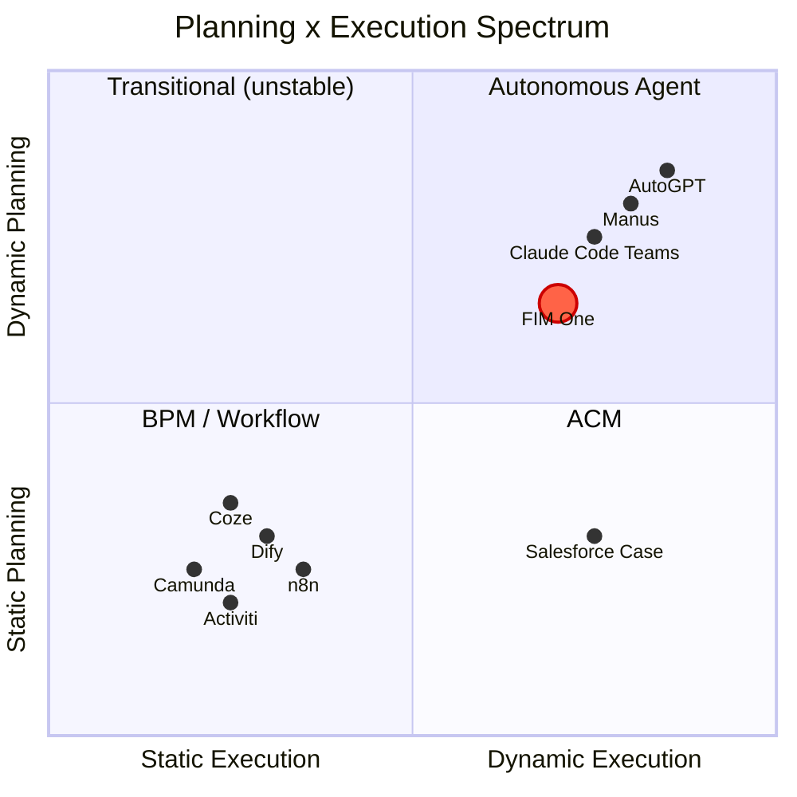
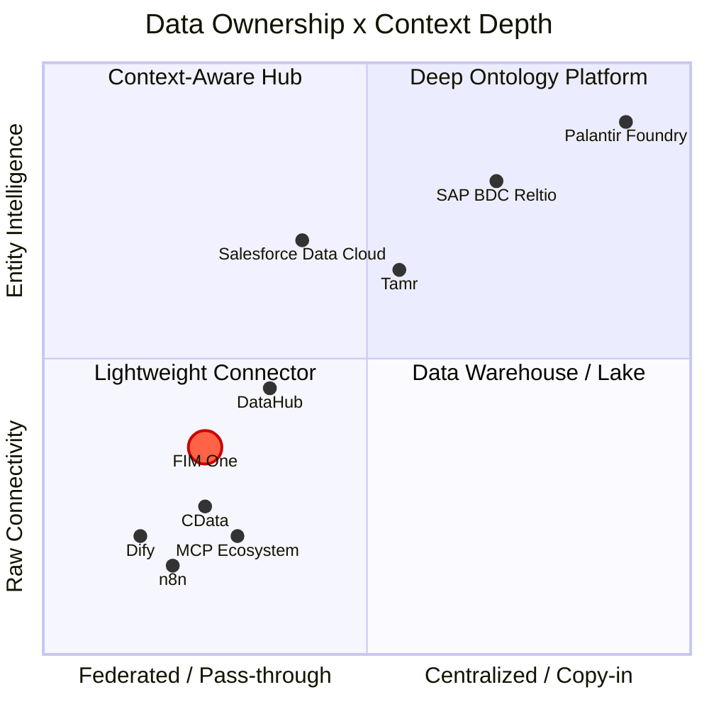

## 動的計画が難しい中間地点である理由

AIエージェントの風景は2つのキャンプに分かれ、どちらも簡単な道を選びました。従来のワークフローエンジン（Dify、n8n、Coze）は静的オーケストレーションを選択しました。ビジュアルドラッグアンドドロップフローチャートと固定実行パスです。これは無知ではなく、エンタープライズ顧客は決定論を要求し（同じ入力で安定した出力）、静的グラフはそれを実現します。一方の極端では、完全に自律的なエージェント（AutoGPTとその派生物）はエンドツーエンドの自律性を約束しましたが、実用的ではないことが判明しました。信頼できないタスク分解、暴走するトークンコスト、そして誰も予測またはデバッグできない動作です。

スイートスポットは狭いですが、実在します。シンプルなタスクはプランナーを必要としません。数十の相互依存するステップが必要なほど複雑なタスクは、現在のLLMを圧倒します。しかし、その間には豊かな問題のクラスがあります。明確な並列サブタスクを持つタスクで、ハードコーディングするには退屈だが、LLMが分解するには実行可能です。動的DAG計画はこのゾーンをまさに対象としています。モデルが実行時に実行グラフを提案し、フレームワークが構造を検証して最大並行性で実行します。ドラッグアンドドロップなし、無謀な自律性なし。

## モデル改善への賭け

数ヶ月ごとに基盤が変わる -- GPT-4、function calling、Claude 3、MCP protocol。移動する地盤の上に厳密な抽象化を構築するのはリスキーだ。LangChainの過度な抽象化は、このスペースの誰もが内在化している警告の話だ。FIM Oneは逆のアプローチを取る：**最小限の抽象化、最大限の拡張性**。フレームワークはオーケストレーション、並行処理、可観測性を所有する。インテリジェンスはモデルから来ており、モデルは常に改善し続けている。

今日、LLM タスク分解の精度は、非自明な目標に対して約70-80%である。それが90%以上に達すると、動的計画の「スイートスポット」は劇的に拡大する -- 昨日は複雑すぎた問題が明日は扱いやすくなる。FIM OneのDAGフレームワークは、配管を書き直すことなく、その拡大する価値をキャプチャするように設計されている。

## ReActとDAGプランニングは廃止されるのか？

ReActは消えることはありません。オペレーティングシステムに吸収されるのです。類似の例として、TCPハンドシェイクを手書きすることはありませんが、TCPが消えたわけではなく、オペレーティングシステムに組み込まれました。モデルが十分に強力になると、think-act-observeループはフレームワークコードの明示的な部分ではなく、モデル内の暗黙的な動作になります。これはすでに起こっています。Claude Codeは本質的にはReActエージェントですが、ループは外部のハーネスではなくモデル自体によって駆動されています。

DAGプランニングの永続的な価値は「ダムなモデルがタスクを分解するのを支援する」ことではなく、**並行スケジューリング**です。無限に能力のあるモデルでも、物理的な制約があります。10個のLLM呼び出しの直列チェーンは3つの並列ウェーブの10倍の時間がかかります。DAGはエンジニアリング上の問題（物事を高速かつ確実に実行する方法）であり、インテリジェンスの問題（何を実行するかを決定する方法）ではありません。リトライロジック、コスト制御、タイムアウト管理、可観測性は、モデルがより賢くなっても消えることはありません。

最終的な形：**モデルが「何を」を所有し（プランニングインテリジェンスはモデルに内在化）、フレームワークが「どのように」を所有する（並行処理、リトライ、監視、コスト管理）**。フレームワークの永続的な価値はインテリジェンスではなく、ガバナンスです。

## Difyのワークフローエディターをミラーリングしない理由

自然な質問です：DAGが柔軟なケースをカバーしているなら、決定論的なケースのための静的ワークフローエディターも構築すべきではないでしょうか？

いいえ。その理由は以下の通りです：

1. **ワークフローは既に他の場所に存在しています。** 政府および企業クライアントの固定プロセスは、彼らのOA、ERP、およびレガシーシステムに存在しています。彼らはそれらのフローを別のプラットフォームで再構築したくありません。彼らが望むのは、それらのフローが既に実行されているシステムに接続できるAIです。Connector Platform（v0.6）がこれを直接解決します。

2. **既存の機能は固定パイプラインに組み合わさります。** Scheduled Jobs（v1.0）は固定プロンプトでDAGエージェントをトリガーします。DAGは動的にステップを計画します。Connectors（v0.6）はターゲットシステムに接続します。この組み合わせは静的パイプラインと同等です。ただし、LLMが遭遇するデータに基づいてプランを調整できるため、より柔軟です。別のパイプラインDSLは不要です。

3. **投資のミスマッチ。** 本番品質のビジュアルワークフローエディター（キャンバス、ノードタイプ、変数の受け渡し、デバッグ/リプレイ）は、数ヶ月の専任の努力が必要です。その結果は、Difyの120K星のコミュニティが既に保守している低忠実度のコピーになります。その努力は、Connector アーキテクチャに費やす方が良いです。これは競合他社が提供していない機能です。

戦略的な賭け：**ワークフロー可視化では競争しない。システムとAIが出会うハブであることで競争する**。Difyに「AIワークフローを視覚的に構築する」を任せてください。FIM Oneは「システムとAIが出会うハブ」を所有しています。

## FIM Oneの立場

FIM Oneは「AGIタスクスケジューラー」ではなく、静的なワークフローエンジンでもありません。中間領域を占めています：制約のある計画機能、可観測性を備わった並行処理。

- **Dify**と比較して：より柔軟性が高い -- 実行時DAG生成対設計時フローチャート。すべての実行パスを事前に予測する必要がありません。ビジュアルワークフロー編集では競争しません。レガシーシステム統合で競争します。
- **AutoGPT**と比較して：より制御可能 -- 制限された反復、再計画制限、ロードマップ上の人間参加。ガードレール内での自律性。

戦略は単純です：オーケストレーションフレームワークを今構築し、改善されたモデルが時間とともにそれに機能を満たすようにします。

## FIM Oneが位置する場所：計画 x 実行スペクトラム

AI実行ランドスケープは2つの軸でマッピングできます。計画の作成方法（静的 vs 動的）と実行方法（厳密 vs 適応的）です：

**Dify/n8nが静的計画 + 静的実行である理由**：DAGは設計時に人間がビジュアルキャンバス上に描画されます。各ノードは固定操作（固定プロンプトを使用したLLM呼び出し、HTTPリクエスト、コードブロック）を実行します。ランタイム再計画はありません。ステップが失敗した場合、ワークフローは失敗するか、事前配線されたエラーブランチに従います。これは構造的にはBPMと同じで、グラフにAIノードがあるだけです。

**FIM Oneの位置：動的計画 + 動的実行**

- **DAGトポロジーはランタイムでLLMによって生成されます**（動的計画）-- 人間がグラフを設計することはありません
- **各DAGノードは完全なReACtループを実行します**（動的実行）-- ノードは推論し、ツールを使用し、適応します
- **再計画メカニズム**（実行 → 分析 → 不満足な場合は再計画）
- ただし制限あり：最大3回の再計画ラウンド、トークン予算、人間確認ゲート

これはFIM OneをAutoGPTと同じ象限に配置しますが、暴走動作を防ぐエンジニアリング制約があります。BPM/Difyより柔軟で、AutoGPTより制御されています。

## 概念用語集

このドキュメントで使用される用語に不慣れな読者向け:

| 用語 | 1行説明 | FIM One との関係 |
|------|---------------------|----------------------|
| **BPM** (Business Process Management) | 設計時に完全に固定されたプロセスを厳密に実行。Camunda、Activiti。 | FIM One は **BPM ではない**。固定プロセスエンジンなし。 |
| **FSM** (Finite State Machine) | システムは常に正確に 1 つの状態にあり、イベントが遷移をトリガー。ループをサポート (却下 → 再送信)。 | ターゲットシステム (ERP、契約システム) は内部で FSM を使用。FIM One は **独自の FSM が不要** -- ターゲットシステムの API を呼び出す。 |
| **ACM** (Adaptive Case Management) | スケルトンは静的、ブランチは動的。メインフローは事前定義、各ノードは実行時に適応。 | FIM One の DAG + ReAct は自然にこの象限に該当。 |
| **HTN** (Hierarchical Task Network) | 再帰的タスク分解: 高レベル → サブタスク → アトミック操作。 | DAG 再計画はほとんどのシナリオをカバー; 完全な HTN はまだ不要。 |
| **iPaaS** (Integration Platform as a Service) | 複数の SaaS/オンプレミスシステムを接続するクラウド統合プラットフォーム。MuleSoft、Zapier。 | FIM One の Hub Mode は **AI ネイティブ iPaaS** のようなもの -- 自然言語がシステム間統合を駆動。 |
| **MDM** (Master Data Management) | システム全体のエンティティレコードを重複排除して統合し、「ゴールデンレコード」を作成。Reltio、Informatica、Tamr。 | FIM One は **MDM システムに接続**; エンティティ解決は複製しない。 |
| **Context Layer / System of Context** | AI エージェントに信頼できるビジネスコンテキストを提供する統合エンティティ + 関係グラフ。用語は Reltio (2026) により普及。 | FIM One はこれをアップストリーム MDM/データプラットフォームに委譲。スキルは一般的なケースの軽量集約を提供。 |

## アーキテクチャ境界: FIM One はワークフロー ロジックを複製しない

複雑なビジネス プロセス (承認チェーン、転送、却下、エスカレーション、連署、副署) は、**ターゲット システムの責任**です。これらのシステムはこのロジックを何年もかけて構築してきました -- ERP、OA、契約管理システムはすべて成熟したステート マシンを備えています。

コネクタの観点から:

| 操作 | コネクタが行うこと |
|-----------|------------------------|
| 転送 | 1 つの API を呼び出し、対象者を渡す |
| 却下 | 1 つの API を呼び出し、却下理由を渡す |
| エスカレーション | 1 つの API を呼び出し、エスカレーション対象者リストを渡す |
| 連署 | 1 つの API を呼び出し、連署者リストを渡す |

複雑なワークフロー操作はすべて、パラメータを持つ HTTP リクエストに集約されます。FIM One は API を呼び出し、ターゲット システムがステート マシンを管理します。

これは**意図的なアーキテクチャ境界**であり、機能ギャップではありません。ターゲット システムに既に存在するワークフロー ロジックを複製することは:
1. メンテナンス負担を生じさせます (2 つのステート マシンを同期させる必要があります)
2. 障害モードを追加します (それらが一致しない場合はどうなりますか?)
3. 追加の価値を提供しません (ターゲット システムは既にこれを正しく実行しています)

コネクタ パターンは設計上シンプルです: **1 つの操作 = 1 つの API 呼び出し**。

## アーキテクチャ境界: コンテキストレイヤーではなくコネクタレイヤー

エンタープライズAIは、エージェントコンテキストのための層状アーキテクチャに収束しています:

| レイヤー | 機能 | 代表的なプレイヤー |
|-------|-------------|----------------------|
| **Decision Traces** | 何が起こったのか、なぜ起こったのかを記録 -- 監査証跡、系統 | Palantir Decision Lineage、Arize |
| **Entity Context** | 統一されたゴールデンレコード + 関係グラフ -- 「System of Context」 | Reltio/SAP、Informatica/Salesforce、Tamr |
| **Data Connectivity** | APIとプロトコルを介してエージェントをソースシステムに接続 | **FIM One**、CData、MCPエコシステム |
| **Source Systems** | CRM、ERP、契約管理、データベース、SaaSアプリ | SAP、Salesforce、カスタムシステム |

FIM Oneは**データ接続レイヤー**で動作します。その上のエンティティコンテキストレイヤーを構築しようとはしません。これは意図的な選択であり、ギャップではありません。

### 業界コンテキスト：2025-2026年の統合

2つのランドマーク的な買収がエンタープライズAIデータランドスケープを再構成し、コンテキストレイヤーを戦略的な競争地点にしました：

- **Salesforceが Informaticaを買収** (2025年11月) -- エンタープライズMDMとデータガバナンスをData Cloud + Agentforceスタックに追加。目標：Informaticaのゴールデンレコードに基づいてAgentforceエージェントを信頼できるものにする。
- **SAPが Reltioの買収を発表** (2026年3月) -- AI ネイティブなエンティティ解決と関係グラフをBusiness Data Cloud (BDC)に追加。目標：SAPおよび非SAP環境にまたがる「System of Context」を作成し、Joule Agentの信頼できる基盤として機能させる。

これらの動きは、世界最大級のエンタープライズプラットフォームが、統一されたエンティティコンテキストを信頼できるAIエージェントの前提条件と考えていることを示しています -- 単なるあると便利な機能ではなく。

### データ所有権 × コンテキスト深度スペクトラム

**チャートの読み方:**

- **左下（軽量コネクタ）**: データ所有権は最小限、生のAPI接続性。Dify、n8n、基本的なMCPサーバーはここに位置します。システムに接続しますが、エンティティを理解しません。FIM Oneはこの象限にありますが、段階的開示メタツール、スキルベースのコンテキスト集約、ドメイン対応エスカレーションにより、y軸上でより高い位置にあります。
- **左上（コンテキスト認識ハブ）**: エンティティレベルの理解を伴うフェデレーテッドアクセス。Salesforce Data Cloudはこれを例示します。ゼロコピーフェデレーションとオンデマンドエンティティ解決を備えています。DataHubはメタデータレベルのコンテキスト（スキーマ、系統、所有権）を提供しますが、ビジネスデータは所有しません。
- **右上（ディープオントロジープラットフォーム）**: 完全なデータ取り込みと深いエンティティインテリジェンス。SAP BDC + Reltioは、リレーションシップグラフを備えた永続的なマルチドメインゴールデンレコードを構築します。Palantirが最も進んでいます。3層オントロジーと決定系統を備えています。
- **右下（データウェアハウス/レイク）**: エンティティセマンティクスなしの集中型データストレージ。すべてを取り込みますが、エンティティ解決またはリレーションシップモデリングが不足している従来のデータプラットフォーム。

FIM Oneの位置は意図的な選択を反映しています。フェデレーテッドで軽量のままですが、アップストリームエンティティコンテキスト（任意のMDMから）をエージェントが簡単にアクセスできるようにすることに投資します。

### 3つのエンティティコンテキストモデル

**SAP: マルチドメイン・ゴールデンレコード（コピーイン + ガバナンス）**

SAPは3層のエンタープライズアーキテクチャを構築しています：

| レイヤー | システム | 役割 |
|-------|--------|------|
| **トランザクション** | S/4HANA | ビジネス実行 -- 注文、請求書、納品 |
| **インテリジェンス** | Business Data Cloud (BDC) + Reltio | セマンティック統合、エンティティ解決、関係グラフ |
| **エージェント** | Joule + Joule Agents | インテント理解、ツールオーケストレーション、自律実行 |

Reltioはインテリジェンスレイヤーの中核に位置しています。その役割：SAPおよび非SAPシステムからエンティティデータを取り込み、AI ベースのマッチングを通じて重複を解決し、関係グラフを備えた**マルチドメイン・ゴールデンレコード**（顧客、サプライヤー、製品、患者、資産）を生成することです。Reltioの**MCPプロトコル**の早期採用は戦略的に重要です -- ゴールデンレコードをSAPのJouleだけでなく、MCPに対応したあらゆるエージェントから直接呼び出し可能な位置づけにしています。

SAPの賭け：エージェントは高リスクのエンタープライズプロセスで確実に動作するために、永続的で統治された、クロスドメインの「単一の情報源」が必要です。

**Salesforce: ゼロコピー・フェデレーション（フェデレート + オンデマンド解決）**

Salesforceはより軽量なアプローチを採用しています。Data Cloudは物理的なデータ移動を必要としません。代わりに**ゼロコピー・パートナーシップ**（Databricks、Snowflake、BigQuery）を使用してデータをインプレイスでフェデレートします。エンティティ解決はData Cloud内でオンデマンドで実行され、永続的なゴールデンレコードストアを必要とせずに統一された顧客プロファイルを作成します。

主要な数字（Q3 FY2026）：Data Cloudは32兆件のレコードを取り込み、そのうち15兆件がゼロコピー経由です（前年同期比341%の成長）。このスケールはCRM中心のユースケースに対するフェデレーションモデルを検証しています。

Agentforceエージェントはこのフェデレーションコンテキストに基づいています：すべてのデータを1つのシステムに集約することなく、分散データ資産全体で推論します。フロントオフィスシナリオ（営業、サービス、マーケティング）では、これは柔軟で展開が迅速です。

Salesforceの賭け：エージェントは重量級のゴールデンレコードストアを必要としません -- データがすでに存在する場所でフェデレーション、解決されたコンテキストへのリアルタイムアクセスが必要です。

**Palantir: ディープオントロジー（重量級リファレンス）**

極端な例として、Palantir Foundryはすべてのデータを取り込み、完全な決定系統を備えた3層のオントロジー（セマンティックオブジェクト + キネティックアクション + ダイナミックルール）を構築します。これは本番環境で最も完全なコンテキストシステムですが、1000万ドル以上の契約と6～18ヶ月の展開期間が必要です。ほとんどの組織にとって現実的なモデルではなく、リファレンスアーキテクチャとして機能します。

### FIM Oneの位置づけ

| 次元 | SAP + Reltio | Salesforce + Informatica | FIM One |
|-----------|-------------|-------------------------|---------|
| **データ哲学** | コピーイン：BDCに取り込み、ゴールデンレコードを構築 | フェデレーション：ゼロコピーアクセス、オンデマンド解決 | パススルー：ソースに接続、保存しない |
| **エンティティ解決** | 深い -- AI ネイティブ MDM と関係グラフ | 中程度 -- Data Cloud エンティティ解決 | なし -- 上流の MDM に委譲 |
| **エージェント統合** | Joule エージェント + MCP | Agentforce + Data Cloud グラウンディング | 任意のエージェント + 任意のコネクタ |
| **デプロイメントコスト** | エンタープライズプラットフォーム価格 | エンタープライズ SaaS 価格 | 軽量、数時間から数日 |
| **ロックイン** | 高い（BDC + S/4HANA エコシステム） | 中程度（Salesforce エコシステム） | 低い -- コネクタは相互交換可能 |
| **最適な用途** | 製造業、サプライチェーン、ライフサイエンス（複雑なマルチドメイン） | CRM 駆動型企業（フロントオフィス重視） | 中堅企業、マルチシステム、プロバイダーに依存しない |

FIM One は **Salesforce の哲学**（データを所有しない、接続する）に最も密接に一致していますが、Salesforce エコシステムへの依存がありません。戦略的な位置づけ：接続レイヤーでプロバイダーに依存しない状態を保ち、SAP/Reltio、Salesforce/Informatica、Tamr、またはカスタムソリューションなど、任意の MDM がエンティティコンテキストソースとして機能できるようにします。

### FIM One がコネクタレイヤーに留まる理由

エンティティコンテキストレイヤーを構築するには、永続的なデータストレージ、ML ベースのエンティティ解決、サバイバーシップルール、リレーションシップグラフエンジン、およびガバナンスフレームワークが必要です。これは異なる製品カテゴリ（MDM）であり、10 年以上の競争が存在します（Reltio、Informatica、Tamr）。これを試みると：

1. **FIM One をコネクタからデータプラットフォームに変換する** -- 根本的に異なる製品、チーム、およびゴー・トゥ・マーケット戦略
2. **アップストリームシステムが既に提供する機能を複製する** -- ワークフロー ロジックで回避する同じアンチパターン
3. **ロックインを増加させる** -- ユーザーが FIM One にゴールデンレコードを保存すると、切り替えコストが劇的に上昇

正しい戦略：**任意の MDM システムの最高のイングレスポイントになる**、MDM の代替ではなく。FIM One は、Reltio、Informatica、Tamr、またはカスタム MDM が MCP リソース、コネクタ API、またはナレッジベースインジェクション経由でエージェントにエンティティコンテキストを提供することを簡単にする必要があります。

### 現在のアプローチ: 軽量なコンテキスト集約としてのスキル

複数のコネクタにまたがるコンテキストが必要なシナリオ（例えば、サプライヤーデータ + 支払い履歴 + リスクフラグを必要とする契約レビュー）では、**スキル**は既に実用的なソリューションを提供しています。スキルの SOP は複数のコネクタアクションを順序立てて調整し、結果を集約し、永続的なエンティティレイヤーを構築することなく、構造化されたコンテキストをエージェントに提示できます。

これは 80% のユースケースをカバーしています。コネクタレベルでのリアルタイムエンティティ解決の需要が生じた場合、アーキテクチャは外部 MDM システムと統合する将来の `ContextSource` コネクタタイプの余地を残しています -- ただし、これは将来の検討事項であり、現在のコミットメントではありません。

### アナロジー

FIM Oneとコンテキストレイヤーの関係は、SQLAlchemyとデータベースの関係のようなものです。データを保存または管理するのではなく、任意のデータソースをアプリケーションレイヤーからアクセス可能にします。エンティティ解決はMDMプラットフォームに任せ、FIM Oneは接続を所有します。

## FIM One が AI スタックのどこに位置するか

### レイヤード モデル

有用なメンタルモデル（クレジット [Phil Schmid](https://www.philschmid.de/)）は、AI システムをコンピューティング ハードウェアに類似した 4 層スタックにマッピングします：

| レイヤー | アナロジー | FIM One コンポーネント |
|-------|---------|-------------------|
| **Model** | CPU | ModelRegistry -- any OpenAI-compatible LLM |
| **Context** | RAM | ContextGuard + Memory (Window / Summary / DB) |
| **Harness** | Operating System | ReAct Agent + DAG Planner + Hooks + ToolRegistry |
| **Application** | App | Portal, Copilot, Hub API |

FIM One は **harness レイヤー** で動作します。モデルと競合するのではなく、適切なツール、制約、フィードバック ループを提供することで、モデルを生産的にします。モデルはインテリジェンスを供給し、ハーネスはガバナンス、並行処理、および信頼性を供給します。

### AI エンジニアリングの3つの時代

このディシプリンは異なるフェーズを通じて進化してきました。**プロンプト エンジニアリング**は固定されたモデルから正しい動作を引き出すためにより良い指示を作成することに焦点を当てていました。**コンテキスト エンジニアリング**は注意を正しい情報の組み立てへシフトさせました。ドキュメントの取得、ツール結果の注入、メモリ管理など、モデルが適切に推論するために必要なものを提供することです。**ハーネス エンジニアリング**はさらに進みます。決定論的なガードレール、ツール オーケストレーション、フィードバック ループ、コスト制御を含む、モデルの周囲の完全な実行環境を設計することです。

FIM One のアーキテクチャはハーネス エンジニアリングの原則を体現しています。Hook ミドルウェアはモデル プロンプトに触れることなく決定論的な制約（レート制限、コンテンツ フィルター、監査ログ）を注入します。ContextGuard はコンテキスト ウィンドウに何が入るか、いつ入るかを管理します。動的ツール選択（段階的開示メタツール）はコネクタ数が増えるにつれてツール サーフェスを扱いやすく保ちます。ReAct ループの自己反映メカニズムと DAG プランナーの再計画サイクルは、より高性能なモデルを必要とせずに実行品質を向上させる構造化されたフィードバックを提供します。
