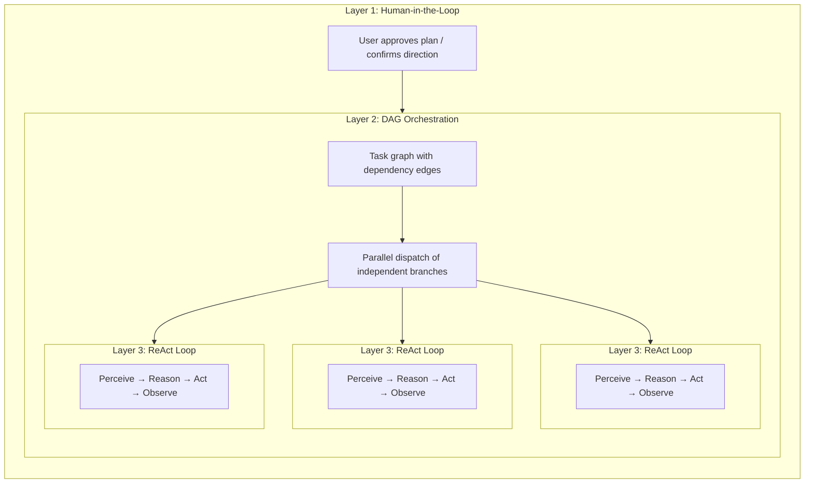

---
title: "計画ランドスケープ"
description: "AI ツーリング環境における 5 つの計画タイプと FIM One の位置付け"
---## AI ツーリング環境における5つの「計画」

「計画」という言葉は過負荷状態にあります。今日、少なくとも5つの異なるアプローチが存在し、それぞれ異なる問題を解決します：

| アプローチ | 計画形式 | 実行 | 承認 | コア価値 |
|---|---|---|---|---|
| **暗黙的モデル計画** | 内部思考の連鎖 | 単一推論パス | なし | モデルが自ら段階を考える |
| **Claude Code プランモード** | Markdown ドキュメント | 順序実行 | 実行前に人間がレビュー | 実行前にアプローチを調整 |
| **Claude Code Teams** | 依存関係エッジ付きタスクリスト | **並行実行**（マルチエージェント） | 人間がプランを承認、その後自律実行 | 動的エージェントプール + 並列実行 |
| **Kiro spec-driven dev** | 構造化仕様（要件 + 設計 + タスク） | 順序実行 | 人間が仕様をレビュー | トレーサブルな要件、受け入れ基準 |
| **FIM One DAG** | JSON 依存グラフ | **並行実行**（単一オーケストレーター） | 自動（PlanAnalyzer） | 並列実行 + ランタイムスケジューリング |

最初の2つは**設計時**計画です — 作業開始*前*に計画を生成し、人間（またはモデル自体）がそれに従って段階的に進めます。最後の3つは**ランタイム**計画を導入します — 実行グラフはプログラム的に生成・スケジュールされ、独立したブランチが並列実行されます。違いは*誰が*実行するかです：Claude Code Teams は自律エージェントを生成し、FIM One DAG は単一オーケストレーター内でステップをディスパッチします。

これらのアプローチは競合ではなく、補完的なレイヤーです。Kiro スタイルの仕様は*何を*構築するかを定義でき、FIM One DAG はサブタスクを並行実行する*方法*をスケジュールできます。Claude Code のプランモードは人間がアプローチに同意することを保証し、FIM One の PlanAnalyzer は結果を自動的に検証します。## 3層ネスティング: フルパワーアーキテクチャ

Claude Code TeamsとFIM One DAGは、フル容量で、**3層ネストされたアーキテクチャ**を示します:

- **レイヤー1 — ヒューマンゲート**: ユーザーが計画をレビューし、実行開始前に承認します。
- **レイヤー2 — DAGオーケストレーション**: 承認された計画は依存関係エッジを持つタスクに分解されます。独立したタスクは並列実行され、ダウンストリームタスクはブロッカーの解決を待ちます。
- **レイヤー3 — ReAct内部ループ**: 各タスクは完全なReAcサイクル(Perceive → Reason → Act → Observe)を実行するエージェントによって実行され、マルチステップ推論、ツール使用、自律的な再試行が可能です。

重要な洞察: **Claude Code TeamsとFIM One DAGは同じ3つのレイヤーを実装していますが、レイヤー2のメカニクスが異なります** — メッセージパッシング対依存関係エッジ解決。## フルパワーランタイム: FIM One vs Claude Code Teams

どちらも真正なエージェント — コアループは同じです: **Perceive → Reason → Act → Feedback**。違いは、フル容量で並列作業をどのようにオーケストレーションするかにあります。

| Dimension | Claude Code Teams | FIM One DAG |
|---|---|---|
| **Parallel model** | リーダーがSubAgentを生成し、メッセージでタスクを割り当てる | トポロジカルソート — 独立したステップを自動並列化 |
| **Task graph** | `blockedBy` / `blocks` エッジ付きTaskList（動的DAG） | `depends_on` エッジ付き静的JSON DAG |
| **Coordination** | 明示的なメッセージパッシング（SendMessage / Broadcast） | 暗黙的な依存エッジ — メッセージなし、データフローのみ |
| **Agent lifecycle** | 動的プール — エージェントはオンデマンドで生成、完了時にシャットダウン | 固定ステップエグゼキューター — ステップごとに1つのLLM呼び出し |
| **Feedback & correction** | 各SubAgentが自律的に再試行; リーダーが失敗時に再割り当て | PlanAnalyzerが結果を評価 → 再計画ループ（最大3ラウンド） |
| **Human involvement** | プランモード承認、その後自律実行 | 完全自動 — PlanAnalyzerが合格/再計画を決定 |
| **Context management** | 各SubAgentが分離されたコンテキストウィンドウを取得（クロスコンタミネーションなし） | すべてのステップ間で共有DbMemory + LLM Compact |
| **Token economics** | `N agents × per-agent tokens` — time↓ tokens↑（乗法的コスト） | 順序実行または浅い並列化 — 総トークン数が低い |
| **Scaling pattern** | より多くのSubAgentを追加（水平、メッセージ結合） | より多くのDAGブランチを追加（水平、依存結合） |
| **Best suited for** | 多様で疎結合なタスク（リサーチ + コード + テスト） | 明確なデータ依存関係を持つ構造化ワークフロー |### リアルワールドベンチマーク: v0.5 RAG システム

Claude Code Teams は FIM One の v0.5 RAG サブシステム全体を単一セッションで構築しました:

- **8 フェーズ**: Embedding → Reranker → Loaders → Chunking → VectorStore → Retrieval → KB Backend → Frontend + Docs
- **46 テスト**合格、フロントエンドビルドクリーン
- **実経過時間**: 約 5 分
- **トークンコスト**: エージェントタスクあたり約 100k トークン × 8+ タスク ≈ 800k+ 合計トークン
- **依存関係エッジ**: フェーズ 5 はフェーズ 4 + 1b に依存; フェーズ 6 はフェーズ 5 + 2 + 3 に依存 — 真の DAG

これは中核的なトレードオフを実証しています: **トークン乗算のコストでの時間並列化**。Claude Code Teams は計算ドルを開発者時間と交換します。### 収束、競争ではなく

「チーム協働」と「パイプラインスケジューリング」の境界が曖昧になっています：

- **Claude Code Teamsの`blockedBy`/`blocks`はDAGです** — タスクは明示的な依存関係エッジを持ち、リーダーは先行タスクが完了すると新たにブロック解除されたタスクをディスパッチします。これはトポロジカルスケジューリングにさらなるステップ（メッセージ）を加えたものです。
- **FIM OneのDAGはエージェント自律性から恩恵を受ける可能性があります** — ステップごとの単一LLM呼び出しの代わりに、各ステップが完全なReACtループを実行できるようにすることで、複雑なサブタスクをより適切に処理できます。

**要点：** 同じエージェント本質、収束する並列哲学。Claude Codeは**チーム協働**モデルに従います — リーダーがワーカーに委譲し、ワーカーはメッセージを介して通信します。FIM Oneは**パイプラインスケジューリング**モデルに従います — DAG実行器が依存関係解決に基づいてステップをディスパッチします。実際には、両者は依存関係駆動型の並列実行を実装しています。違いはコーディネーションオーバーヘッド（メッセージ対エッジ）とトークン経済学（分離されたコンテキスト対共有メモリ）です。最適なアーキテクチャは両者を組み合わせる可能性があります：構造化パイプライン用のDAGスケジューリング、自律的なマルチステップ推論が必要なタスク用のエージェントプール。## 構造化出力の低下

DAG パイプライン内のすべての構造化 LLM 呼び出しサイト（Planner、Analyzer、Tool Selection）は、3 レベルの低下チェーンを実装する統一された `structured_llm_call()` ユーティリティを使用します：

| レベル | 条件 | 動作方法 |
|---|---|---|
| **Native FC** | `llm.abilities["tool_call"]` | 仮想ツール呼び出しを強制します。`tool_calls[0].arguments` から抽出します |
| **JSON Mode** | `llm.abilities["json_mode"]` | `response_format={"type":"json_object"}` を設定します。`extract_json()` で解析します |
| **Plain text** | 常に利用可能 | `extract_json()` で自由形式のコンテンツを解析し、オプションで `regex_fallback()` を実行します |

各テキストベースのレベルは、次のレベルに低下する前に、リフォーマットプロンプトで 1 回再試行します。結果は、解析された値、抽出が成功したレベル、および累積トークン使用量を含む `StructuredCallResult` です。

このデザインにより、同じプロンプトが GPT-4（ネイティブ FC）、Claude（JSON モード）、ローカルモデル（プレーンテキスト）全体で確実に機能し、4 つの呼び出しサイト全体に散在する代わりに、1 つの場所で一貫したエラーハンドリングと再試行ロジックが実現されます。