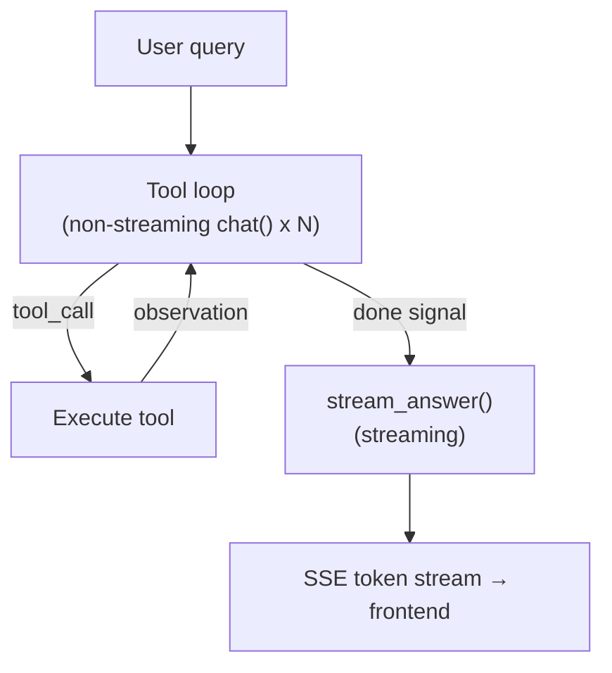
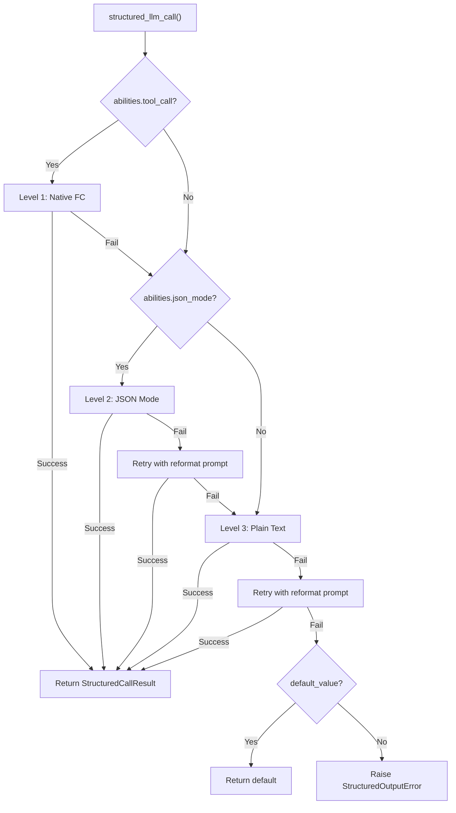
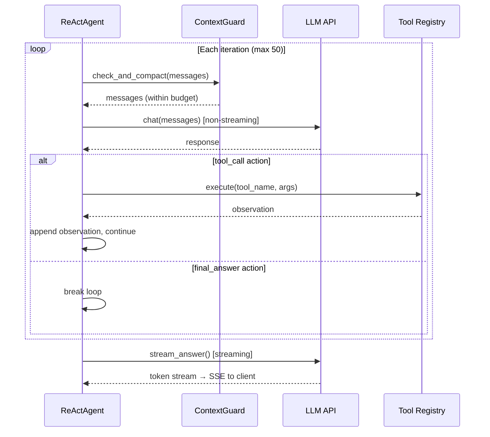
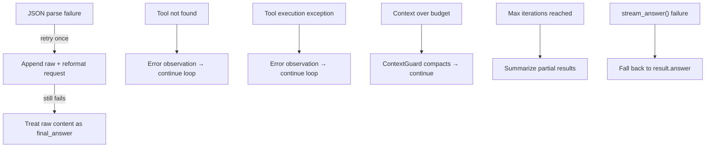
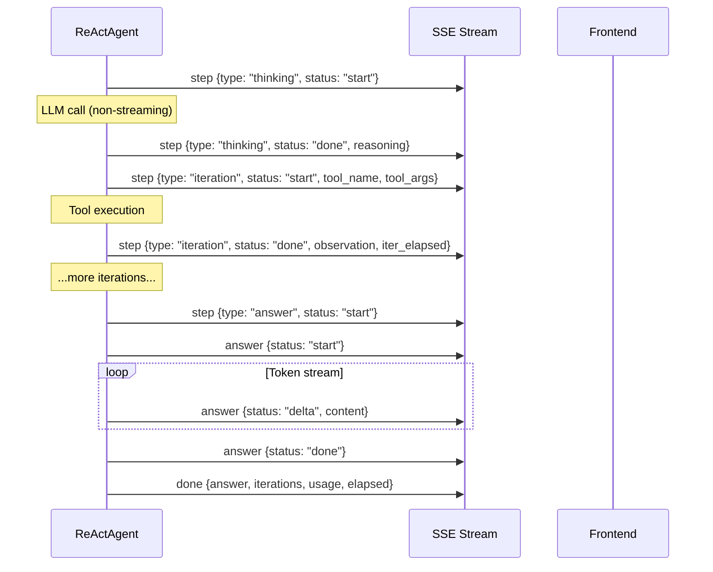

---
title: "ReAct エンジン"
description: "FIM One の ReAct エンジンの仕組み — デュアルモード実行、構造化 LLM 呼び出し、ストリーミング回答合成。"
---## アーキテクチャ

ReActエンジンは2段階の実行モデルを実装しています。第1段階は反復的なツール使用ループです。エージェントはLLMに繰り返しアクションを要求し、要求されたツールを実行し、観察を追加し、LLMが「完了」を示すまで続けます。第2段階は回答の合成です。完全な実行トレースを読み取り、ユーザー向けの応答を生成する別のストリーミングLLM呼び出しです。

この分割は意図的です。ツール反復は速度に最適化されています。ループ内のすべてのLLM呼び出しはストリーミングなしの `chat()` を使用します。ユーザーは部分的なJSONアクションや中間推論トークンを見る必要がないからです。回答生成はUXに最適化されています。ストリーミング `stream_chat()` を使用するため、ユーザーはトークンがリアルタイムで表示されるのを見ることができます。結果は両方の長所を備えています。高速なツール実行と応答性の高い回答配信です。

ツールループは完全な会話履歴を含む `AgentResult` を生成します。システムプロンプト、ユーザークエリ、すべてのアシスタントメッセージ、すべてのツール結果です。`stream_answer()` メソッドはこのトレースを簡潔で一貫性のある回答に蒸留します。ツール結果は合成コンテキストで各2,000文字に切り詰められ、複雑なマルチツールワークフロー後もプロンプトを簡潔に保ちます。

**モデルバインディング。** LLMは `ReActAgent.__init__()` に注入され、`self._llm` として保存されます。単一の `run()` 呼び出し内のすべての呼び出し（すべてのツールループ反復と最終的な回答合成）は、この同じインスタンスを使用します。モデルは反復間で変わりません。別のモデルを使用するには、新しい `ReActAgent` を構築する必要があります。DAGモードでは、`DAGExecutor._resolve_agent()` はこのパターンを利用します。ステップごとに新しいエージェントを作成し（`ModelRegistry` から `step.model_hint` に基づいてモデルを選択し）、そのステップのReActループが開始される直前に作成します。詳細は [DAG Engine — Per-step override](/architecture/dag-engine#two-llm-architecture) を参照してください。## デュアルモード実行

ReAct エンジンは、ツールループ中に LLM と対話するための 2 つの異なるモードをサポートしています。

**JSON Mode** (`_run_json`) はツール説明をシステムプロンプトに直接埋め込み、LLM に JSON オブジェクトで応答するよう指示します。ツール名と引数を含む `tool_call` アクション、または `final_answer` シグナルのいずれかです。エージェントは応答コンテンツから JSON を解析し、ツールを実行し、観察をユーザーメッセージとして追加します。

**Native Function Calling** (`_run_native`) は LLM プロバイダーの組み込みツール呼び出し API を使用します。ツール説明は `tools` パラメータを介して渡され、LLM はコンテンツで JSON を出力するのではなく、API レスポンスで構造化された `tool_calls` を返します。これはツール呼び出しをサポートするモデルの推奨モードです。

モード選択は自動的に行われます。`_native_mode_active` プロパティは、エージェントが `use_native_tools=True`（デフォルト）で作成され、かつ LLM が `abilities["tool_call"] = True` をアドバタイズしている場合にのみ `True` を返します。いずれかの条件が満たされない場合、エンジンは JSON モードにフォールバックします。

| 側面 | JSON Mode | Native Function Calling |
|--------|-----------|------------------------|
| LLM 出力 | メッセージコンテンツ内の JSON オブジェクト | API レスポンス内の `tool_calls` |
| システムプロンプト | テキストにツール説明を完全に埋め込む | `tools` パラメータを介してツールを渡す |
| 並列ツール呼び出し | 反復ごとに 1 つのツール | `asyncio.gather` 経由で複数 |
| 解析失敗処理 | 再フォーマットプロンプトで再試行 | N/A（API により構造化） |
| ループ LLM 呼び出し | ストリーミングなし `chat()` | ストリーミングなし `chat()` |
| 最適用途 | ツール呼び出しサポートなしのモデル | GPT-4、Claude など |

両モードは同じ回答合成フェーズを共有します。ツールループの実行方法に関わらず、`stream_answer()` は同じように機能します。## structured_llm_call — 統一された出力抽出

LLMがJSON スキーマに準拠したデータを返す必要があるすべての呼び出しサイトは、`structured_llm_call()` を使用します。これはフレームワーク全体における構造化出力の単一のエントリーポイントです。DAG プランナー、プラン分析器、ツール選択、および LLM からの解析済み JSON が必要な将来のコンポーネントで使用されます。

この関数は 3 レベルの段階的な低下チェーンを実装し、LLM の公開されている機能に基づいて各レベルを順番に試みます。

**レベル 1: ネイティブ関数呼び出し。** LLM の `tool_call` / `tool_choice` API を使用して構造化された応答を強制します。`abilities["tool_call"] = True` の場合に利用可能です。LLM が `tool_calls` を返す場合、引数は直接抽出されます。解析に失敗した場合は、次のレベルにフォールスルーします。

**レベル 2: JSON モード。** `response_format={"type": "json_object"}` を設定して、LLM の出力形式を制限します。`abilities["json_mode"] = True` の場合に利用可能です。応答を解析できない場合は、再フォーマットプロンプト（「前回の応答は有効な JSON として解析できませんでした...」）で 1 回再試行してから、次のレベルにフォールスルーします。

**レベル 3: プレーンテキスト。** 形式制約なしで LLM を呼び出し、`extract_json()` を使用してフリーフォーム テキストから JSON を抽出します。抽出に失敗した場合は、オプションの `regex_fallback` 関数が試行されます。再フォーマットプロンプトで 1 回再試行してから、処理を中止します。

段階的な低下チェーンは、完全なツール呼び出しサポートを備えた GPT-4 からプレーンテキストのみを生成できるローカル LLM まで、すべてのモデルが構造化出力シナリオに参加できることを意味します。最悪の場合は 5 回の LLM 呼び出し（1 回のネイティブ + 1 回の JSON + 1 回の JSON 再試行 + 1 回のプレーン + 1 回のプレーン再試行）ですが、実際にはほとんどの呼び出しはレベル 1 で 1 回の試行で解決されます。

| モデル機能 | 選択されるパス | 最大 LLM 呼び出し数 |
|-----------------|------------|---------------|
| tool_call + json_mode | L1 → L2 → L3 | 5 |
| json_mode のみ | L2 → L3 | 4 |
| プレーンテキストのみ | L3 | 2 |

結果は、解析された値、生の辞書、成功したレベル、および累積トークン使用量を含む `StructuredCallResult` です。呼び出しサイトは `parse_fn` を使用して生の辞書をドメインオブジェクト（例：DAG プラン）に変換し、`default_value` を使用して完全な失敗が許容される場合のフォールバックを提供します。

`structured_llm_call` は以下で使用されます：DAG プランナー（プランスキーマ）、プラン分析器（分析スキーマ）、ツール選択（ツールリストスキーマ）、および信頼できる構造化出力が必要なコンポーネント。また、[Planning Landscape](/architecture/planning-landscape) でも説明されています。## ツール選択

エージェントが多くのツールにアクセスできる場合（Hub モードで複数のコネクタがそれぞれ複数のアクションを公開する場合など）、すべてのツールの完全なスキーマを会話コンテキストに注入することは無駄です。20 個のツールを持つコネクタハブだけで、ツール説明に約 5K トークンを消費し、会話履歴とツール結果のスペースを圧迫します。

エンジンはこれを軽量な選択フェーズで対処します。登録されたツールの総数が `TOOL_SELECTION_THRESHOLD`（12）を超える場合、エージェントはメインループに入る前に予備的な LLM 呼び出しを実行します。この呼び出しはコンパクトなカタログ（ツールあたり約 80 文字で、名前と 1 行の説明のみを含み、パラメータスキーマは含まない）を受け取り、現在のクエリに最も関連するツールを `_TOOL_SELECTION_MAX`（6）まで選択します。

選択は `structured_llm_call` を使用して単純なスキーマ（`{"tools": ["tool_name_1", "tool_name_2"]}`）で実行されるため、同じ 3 レベルの低下から利益を得ます。選択されたツール名は、メインループがシステムプロンプト構築とツール実行の両方に使用するフィルタリングされた `ToolRegistry` を構築するために使用されます。

選択の失敗は意図的に致命的ではありません。LLM が解析不可能な出力を返す場合、選択されたすべての名前が無効である場合、または例外が発生する場合、エージェントは完全なツールセットにフォールバックします。これにより、不正な選択がエージェントの機能を妨げることはなく、最適より多くのコンテキストを使用するだけです。## イテレーションループ

コアループは JSON モードとネイティブモードの両方を駆動し、メッセージ処理にわずかな違いがあります。各イテレーションは同じ高レベルパターンに従います: コンテキスト予算をチェック、LLM を呼び出し、レスポンスを処理し、ツールを実行するか中断するかのいずれかです。

**JSON モードループ。** LLM のレスポンスは `_parse_action()` を介して解析され、`extract_json()` を使用してコンテンツ内の JSON オブジェクトを検出します。解析に失敗した場合、エージェントは生のレスポンスと再フォーマットリクエストを追加してから続行します — これは `max_iterations` に対してカウントされ、無限再試行ループを防止します。成功時、アクションは `tool_call` (ツールを実行し、観察をユーザーメッセージとして追加) または `final_answer` (中断して合成に進む) のいずれかです。

**ネイティブモードループ。** LLM のレスポンスは 1 つ以上の `tool_calls` を含む可能性があります。単一のレスポンス内のすべてのツール呼び出しは `asyncio.gather` を介して並列実行され、すべてのツール結果メッセージは他のメッセージの前に追加されます。この順序付けの制約は重要です — OpenAI API (および互換性のあるプロバイダー) は `tool` メッセージが `tool_calls` を生成した `assistant` メッセージの直後に続くことを要求します。それらの間に他のメッセージ (ユーザー割り込みなど) を挿入するとプロトコルが破損します。`tool_calls` が存在しない場合、レスポンスは最終回答として扱われます。

**最大イテレーション。** デフォルト制限は 50 イテレーションです。`final_answer` を生成せずにこの制限に達した場合、エージェントは累積されたステップ結果からフォールバックレスポンスを合成します — どのツールが呼び出されたか、および成功したか失敗したかの概要です。これは安全ネットであり、通常の終了パスではありません。

[コンテキスト管理](/architecture/context-management) では、ContextGuard がすべてのイテレーションでトークン予算を強制する方法、および最近の推論チェーンを保持するようにコンパクション LLM に指示するヒントシステムについて説明しています。## 回答の合成 (stream_answer)

ツールループと回答合成の分離は、コアアーキテクチャの決定です。ツール反復は生データ — JSON アクション、ツール観察、エラーメッセージ — を生成します。ユーザーは、エージェントの内部トレースのダンプではなく、一貫性のある、適切にフォーマットされた回答が必要です。

`stream_answer()` は 2 つのコンポーネントから合成プロンプトを構築します。システムプロンプトは、LLM に合成器として機能するよう指示します：結果を直接提示し、マークダウンフォーマットを使用し、メタコメント（「ツール出力に基づいて...」）を避け、元のクエリの言語と一致させます。ユーザーメッセージには、元の質問とフォーマットされた実行トレース — 各ツール呼び出しとその結果（ツール結果は 2,000 文字に切り詰められています）— が含まれます。

合成呼び出しは `stream_chat()` を使用し、トークンを段階的に生成します。ウェブレイヤーはこれらのトークンを SSE `answer` イベントで `delta` ステータスでラップするため、フロントエンドは到着時にそれらをレンダリングできます。

`stream_answer()` が失敗した場合 — ネットワークエラー、LLM タイムアウト、その他の例外 — ウェブレイヤーは `result.answer` にフォールバックします。これはツールループの最終反復からの簡潔なテキストです。これは低下した体験（ストリーミングなし、潜在的にあまり洗練されていないテキスト）ですが、ユーザーが常に応答を受け取ることを保証します。## 割り込み処理

ユーザーはエージェントがまだ処理中に後続のメッセージを送信できます。これらは `interrupt_queue` — 会話ごとに登録された `InterruptQueue` を通じて配信され、イテレーション間でメッセージが蓄積されます。

ドレインのタイミングはツール呼び出しの順序制約のため、モード間で異なります:

- **JSON mode**: キューは各アシスタントメッセージの直後にドレインされ、アクションが `final_answer` であるかどうかをチェックする前です。JSON mode は構造的なペアリング要件のない通常のユーザー/アシスタントメッセージを使用するため、これは安全です。

- **Native FC mode**: キューは tool result メッセージが追加された後にのみドレインされます。`tool` メッセージは `tool_calls` を含むアシスタントメッセージの直後に続く必要があります — ユーザーメッセージをそれらの間に挿入するとAPIプロトコルに違反し、エラーが発生します。

注入されたメッセージは `pinned=True` としてマークされ、その後の ContextGuard による圧縮を生き残ることを保証します。[Pinned Messages](/architecture/context-management#pinned-messages) を参照して、ピニング機構がどのように圧縮から重要なメッセージの破棄を防ぐかを確認してください。

`final_answer` が保留中だが注入されたメッセージが到着した場合、エージェントは最終回答を抑制し、ユーザーのフォローアップに対応できるようにループを続けます。同じドレインからの複数の注入は単一の `[USER INTERRUPT]` メッセージに結合されます — これにより LLM が短いメッセージの断片化されたシーケンスを見ることを防ぎ、すべてのフォローアップに全体的に対応することを促します。## エラーハンドリングとフォールバック

エンジンは LLM またはツールの失敗でクラッシュしないように設計されています。すべてのエラーパスは、サイレントに復旧するか、ユーザーに有用なメッセージを表示します。

**JSON パース失敗。** LLM が JSON モードで JSON 以外のコンテンツを返すと、`_parse_action()` はそれを `final_answer` としてラップし、理由を `"(could not parse LLM output as JSON)"` とします。ループはこのセンチネルを検出し、生のコンテンツと再フォーマット指示を追加して続行します。リトライも失敗した場合、生のコンテンツが答えになります — 不完全ですが、クラッシュではありません。

**ツールエラー。** 「ツールが見つからない」と「ツール実行例外」の両方は、会話に追加されるエラー観測を生成します。LLM は次の反復でエラーを見て、異なる引数で再試行するか先に進むかを決定できます。これにより、エージェントは一時的なツール失敗に対して自己修復可能になります。

**拡張思考。** DeepSeek R1 のようなモデルは、推論コンテンツを JSON ボディではなく、別の `reasoning_content` フィールドで返します。エンジンはこれをチェックし、JSON の `reasoning` フィールドが空の場合のフォールバックとして使用します。

**リッチコンテンツ。** ツールが HTML またはマークダウンアーティファクトを生成すると、LLM に送信される観測は短いサマリー（`"[Artifact generated: filename] The content is rendered as a preview in the UI..."`）に置き換えられます。これにより、LLM が最終的な答えで大きな HTML ブロブをエコーバックするのを防ぎます — モデルが親切にツール出力全体を貼り付け直す一般的な失敗モードです。## SSE イベントプロトコル

ウェブレイヤーはエージェントの反復コールバックをサーバー送信イベント（Server-Sent Events）に変換してフロントエンドに送信します。イベントは2つのSSEチャネルで発行されます：ツールループ用の `step` と、合成フェーズ用の `answer` です。

| イベント | チャネル | ペイロード | タイミング |
|-------|---------|---------|------|
| 思考開始 | `step` | `{type: "thinking", status: "start", iteration}` | 各LLM呼び出しの前 |
| 思考完了 | `step` | `{type: "thinking", status: "done", iteration, reasoning}` | LLMが応答した後、ツール実行前 |
| 反復開始 | `step` | `{type: "iteration", status: "start", iteration, tool_name, tool_args}` | ツール実行が開始される |
| 反復完了 | `step` | `{type: "iteration", status: "done", iteration, tool_name, observation, error, iter_elapsed}` | ツール実行が完了する |
| 回答シグナル | `step` | `{type: "answer", status: "start"}` | エージェントがfinal_answerを通知する |
| 回答開始 | `answer` | `{status: "start"}` | 合成ストリーミングが開始される |
| 回答デルタ | `answer` | `{status: "delta", content}` | ストリーミングされた各トークン |
| 回答完了 | `answer` | `{status: "done"}` | 合成ストリーミングが完了する |
| コンパクト | `compact` | `{original_messages, kept_messages}` | 読み込み時にコンテキストが圧縮された |
| フェーズ | `phase` | `{phase: "selecting_tools", total_tools}` | ツール選択フェーズがアクティブ |
| インジェクト | `inject` | `{type: "inject", content}` | ユーザー割り込みが受信された |
| 完了 | `done` | `{answer, iterations, usage, elapsed}` | 最終結果ペイロード |

フロントエンドは `step` イベントを使用して折りたたみ可能なツール呼び出しカード（実行中のツール、その引数、観測結果を表示）をレンダリングし、`answer` デルタを使用して応答テキストをストリーミングし、`compact` を使用してコンテキスト要約区切り線を表示します。`done` イベントは完全なメタデータ（総反復回数、トークン使用量、経過時間）を含み、応答フッターに使用されます。