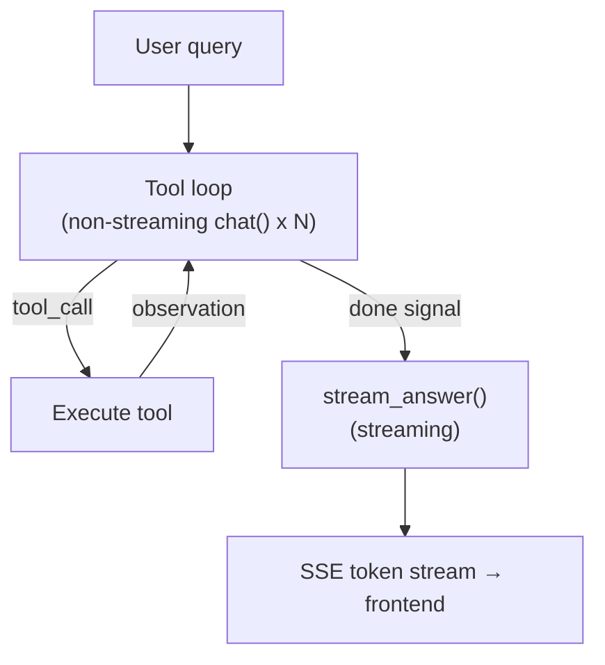
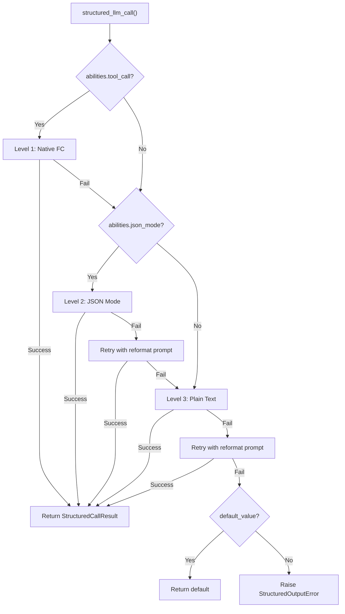
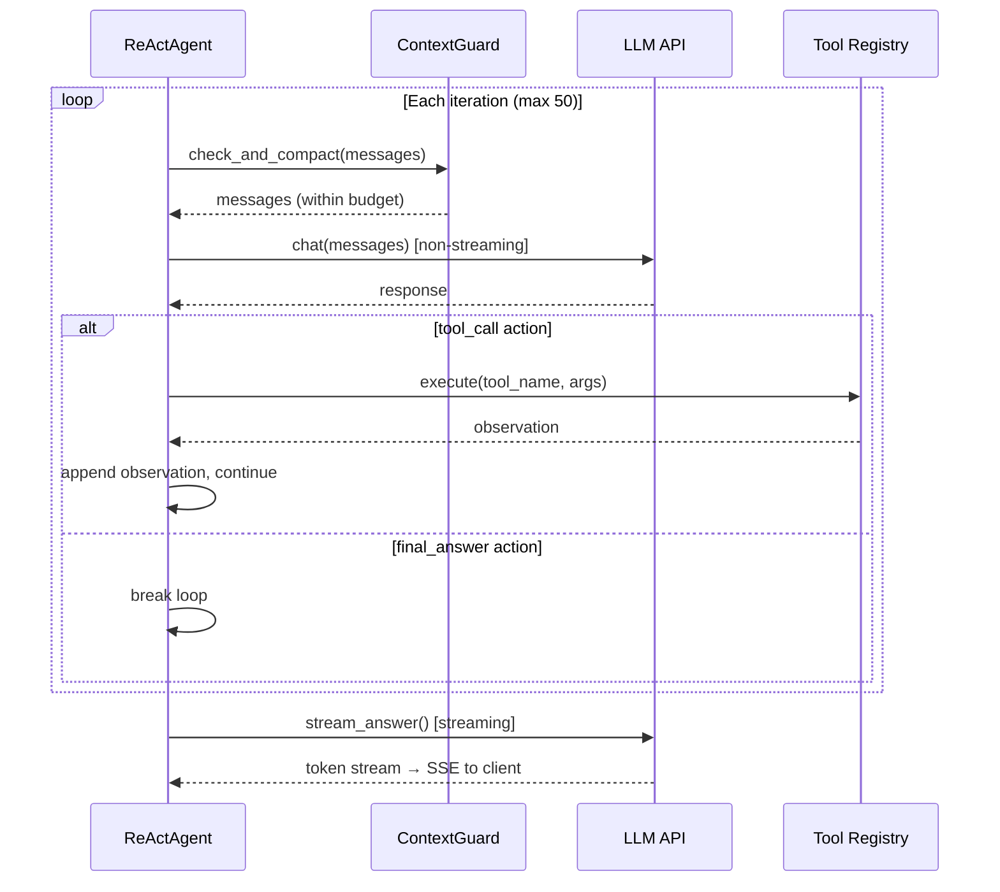
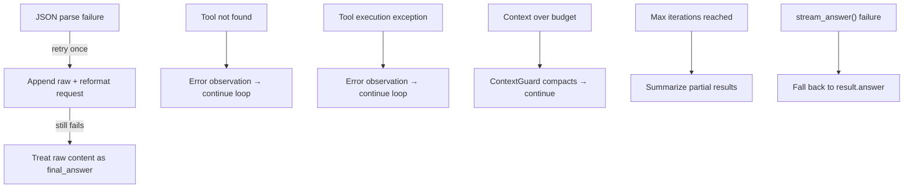
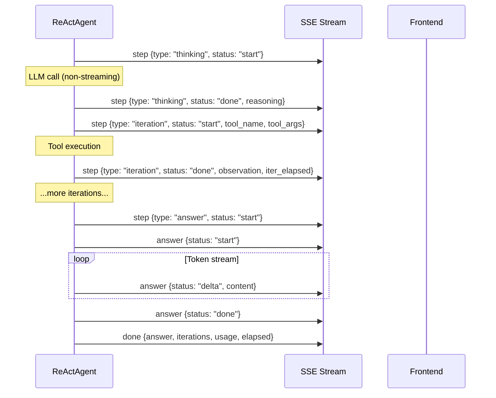

## アーキテクチャ

ReActエンジンは2段階の実行モデルを実装しています。第1段階は反復的なツール使用ループです。エージェントは繰り返しLLMにアクションを要求し、要求されたツールを実行し、観察を追加し、LLMが「完了」を示すまで続けます。第2段階は回答の合成です。完全な実行トレースを読み取り、ユーザー向けの応答を生成する別のストリーミングLLM呼び出しです。

この分割は意図的です。ツール反復は速度に最適化されています。ループ内のすべてのLLM呼び出しはストリーミングなしの`chat()`を使用します。ユーザーは部分的なJSONアクションや中間推論トークンを見る必要がないためです。回答生成はUXに最適化されています。`stream_chat()`を使用するため、ユーザーはトークンがリアルタイムで表示されるのを見ることができます。結果として、高速なツール実行と応答性の高い回答配信の両方の利点が得られます。

ツールループは完全な会話履歴を含む`AgentResult`を生成します。システムプロンプト、ユーザークエリ、すべてのアシスタントメッセージ、すべてのツール結果です。`stream_answer()`メソッドはこのトレースを簡潔で一貫性のある回答に蒸留します。ツール結果は合成コンテキストで各2,000文字に切り詰められ、複雑なマルチツールワークフロー後でもプロンプトを簡潔に保ちます。

**モデルバインディング。** LLMは`ReActAgent.__init__()`に注入され、`self._llm`として保存されます。単一の`run()`呼び出し内のすべての呼び出し（すべてのツールループ反復と最終的な回答合成）は、この同じインスタンスを使用します。モデルは反復間で変わりません。別のモデルを使用するには、新しい`ReActAgent`を構築する必要があります。DAGモードでは、`DAGExecutor._resolve_agent()`はこのパターンを利用します。そのステップのReActループが開始される直前に、ステップごとに新しいエージェントを作成します（`ModelRegistry`から`step.model_hint`に基づいてモデルを選択）。詳細は[DAGエンジン — ステップごとのオーバーライド](/architecture/dag-engine#two-llm-architecture)を参照してください。

## デュアルモード実行

ReActエンジンは、ツールループ中にLLMと相互作用する2つの異なるモードをサポートしています。

**JSONモード** (`_run_json`) はツール説明をシステムプロンプトに直接埋め込み、LLMに`tool_call`アクション（ツール名と引数を含む）または`final_answer`シグナルのいずれかのJSONオブジェクトで応答するよう指示します。エージェントはレスポンスコンテンツからJSONを解析し、ツールを実行し、観察結果をユーザーメッセージとして追加します。

**ネイティブ関数呼び出し** (`_run_native`) はLLMプロバイダーの組み込みツール呼び出しAPIを使用します。ツール説明は`tools`パラメータを介して渡され、LLMはコンテンツ内でJSONを出力する代わりに、APIレスポンスで構造化された`tool_calls`を返します。これはそれをサポートするモデルの推奨モードです。

モード選択は自動的に行われます。`_native_mode_active`プロパティは、エージェントが`use_native_tools=True`（デフォルト）で作成され、かつLLMが`abilities["tool_call"] = True`をアドバタイズしている場合にのみ`True`を返します。いずれかの条件が失敗した場合、エンジンはJSONモードにフォールバックします。

| 側面 | JSONモード | ネイティブ関数呼び出し |
|--------|-----------|------------------------|
| LLM出力 | メッセージコンテンツ内のJSONオブジェクト | APIレスポンス内の`tool_calls` |
| システムプロンプト | テキスト内に完全なツール説明を埋め込む | `tools`パラメータを介してツールを渡す |
| 並列ツール呼び出し | 反復ごとに1つのツール | `asyncio.gather`経由で複数 |
| 解析失敗処理 | 再フォーマットプロンプトで再試行 | 該当なし（APIによって構造化） |
| ループLLM呼び出し | ストリーミングなし`chat()` | ストリーミングなし`chat()` |
| 最適な用途 | ツール呼び出しサポートなしのモデル | GPT-4、Claude、および同様のモデル |

両モードは同じ回答合成フェーズを共有します — `stream_answer()`はツールループの実行方法に関わらず同じように機能します。

## structured_llm_call — 統一された出力抽出

LLMがJSONスキーマに準拠したデータを返す必要があるあらゆるコールサイトは、`structured_llm_call()`を使用します。これはフレームワーク全体における構造化出力の単一エントリーポイント — DAGプランナー、プラン分析器、ツール選択、およびLLMから解析されたJSONが必要な将来のコンポーネント。

この関数は3段階の劣化チェーンを実装し、LLMの公表された機能に基づいて各段階を順番に試みます:

**レベル1: ネイティブ関数呼び出し。** LLMの`tool_call` / `tool_choice` APIを使用して構造化応答を強制します。`abilities["tool_call"] = True`の場合に利用可能です。LLMが`tool_calls`を返す場合、引数は直接抽出されます。解析に失敗した場合、次のレベルにフォールスルーします。

**レベル2: JSONモード。** `response_format={"type": "json_object"}`を設定してLLMの出力形式を制限します。`abilities["json_mode"] = True`の場合に利用可能です。応答を解析できない場合、リフォーマットプロンプト（「前の応答は有効なJSONとして解析できませんでした...」）で1回再試行してから、次のレベルにフォールスルーします。

**レベル3: プレーンテキスト。** 形式制約なしでLLMを呼び出し、`extract_json()`を使用してフリーフォームテキストからJSONを抽出します。抽出に失敗した場合、オプションの`regex_fallback`関数が試されます。リフォーマットプロンプトで1回再試行してから、諦めます。

劣化チェーンは、フルツール呼び出しサポートを備えたGPT-4からプレーンテキストのみを生成できるローカルLLMまで、あらゆるモデルが構造化出力シナリオに参加できることを意味します。最悪のケースは5回のLLM呼び出し（1回のネイティブ + 1回のJSON + 1回のJSON再試行 + 1回のプレーン + 1回のプレーン再試行）ですが、実際にはほとんどの呼び出しはレベル1で1回の試行で解決されます。

| モデル機能 | 取られるパス | 最大LLM呼び出し |
|-----------------|------------|---------------|
| tool_call + json_mode | L1 → L2 → L3 | 5 |
| json_mode のみ | L2 → L3 | 4 |
| プレーンテキストのみ | L3 | 2 |

結果は、解析された値、生のdict、成功したレベル、および累積トークン使用量を含む`StructuredCallResult`です。コールサイトは`parse_fn`を使用して生のdictをドメインオブジェクト（例：DAGプラン）に変換し、`default_value`を使用して完全な失敗が許容可能な場合のフォールバックを提供します。

`structured_llm_call`は以下によって使用されます: DAGプランナー（プランスキーマ）、プラン分析器（分析スキーマ）、ツール選択（ツールリストスキーマ）、および信頼性の高い構造化出力が必要なあらゆるコンポーネント。これは[Planning Landscape](/architecture/planning-landscape)でも説明されています。

## ツール選択

エージェントが多くのツールにアクセスできる場合（複数のコネクタがそれぞれ複数のアクションを公開するハブモードで一般的）、すべてのツールの完全なスキーマを会話コンテキストに注入することは無駄です。20個のツールを持つコネクタハブは、ツール説明だけで約5Kトークンを消費し、会話履歴とツール結果のスペースを圧迫します。

エンジンはこれを軽量な選択フェーズで対処します。登録されたツールの総数が `TOOL_SELECTION_THRESHOLD`（12）を超える場合、エージェントはメインループに入る前に予備的なLLM呼び出しを実行します。この呼び出しはコンパクトなカタログを受け取ります。ツールあたり約80文字で、名前と1行の説明のみを含み、パラメータスキーマは含みません。そして現在のクエリに最も関連するツールを選択し、最大 `_TOOL_SELECTION_MAX`（6）個までです。

選択は `structured_llm_call` を使用して、シンプルなスキーマ（`{"tools": ["tool_name_1", "tool_name_2"]}`）で実行されるため、同じ3レベルの低下から恩恵を受けます。選択されたツール名は、メインループがシステムプロンプト構築とツール実行の両方に使用するフィルタリングされた `ToolRegistry` を構築するために使用されます。

選択の失敗は意図的に致命的ではありません。LLMが解析不可能な出力を返す場合、選択されたすべての名前が無効な場合、または例外が発生した場合、エージェントは完全なツールセットにフォールバックします。これにより、不完全な選択がエージェントの機能を妨げることはなく、最適より多くのコンテキストを使用するだけです。

## 反復ループ

コアループは JSON モードとネイティブモードの両方を駆動し、メッセージ処理にはわずかな違いがあります。各反復は同じ高レベルパターンに従います：コンテキスト予算をチェック、LLM を呼び出し、レスポンスを処理し、ツールを実行するか終了するかのいずれかです。

**JSON モードループ。** LLM のレスポンスは `_parse_action()` を介して解析され、`extract_json()` を使用してコンテンツ内の JSON オブジェクトを検出します。解析に失敗した場合、エージェントは生のレスポンスと再フォーマットリクエストを追加してから続行します。これは `max_iterations` に対してカウントされ、無限再試行ループを防ぎます。成功時、アクションは `tool_call`（ツールを実行し、観測結果をユーザーメッセージとして追加）または `final_answer`（ループを終了して合成に進む）のいずれかです。

**ネイティブモードループ。** LLM のレスポンスには 1 つ以上の `tool_calls` が含まれる場合があります。単一のレスポンス内のすべてのツール呼び出しは `asyncio.gather` を介して並列実行され、すべてのツール結果メッセージは他のメッセージの前に追加されます。この順序制約は重要です。OpenAI API（および互換プロバイダー）では、`tool` メッセージが `tool_calls` を生成した `assistant` メッセージの直後に続く必要があります。それらの間に他のメッセージ（ユーザー割り込みなど）を挿入するとプロトコルが破損します。`tool_calls` がない場合、レスポンスは最終回答として扱われます。

**最大反復回数。** デフォルト制限は 50 反復です。ループがこの制限を超えても `final_answer` を生成しない場合、エージェントは累積されたステップ結果からフォールバックレスポンスを合成します。これは、どのツールが呼び出されたか、成功したか失敗したかの概要です。これは安全ネットであり、通常の終了パスではありません。

[コンテキスト管理](/architecture/context-management)では、ContextGuard が毎回の反復でトークン予算を強制する方法について説明しており、最近の推論チェーンを保持するようにコンパクション LLM に指示するヒントシステムも含まれています。

## 回答の合成 (stream_answer)

ツールループと回答合成の分離は、コアアーキテクチャの決定です。ツール反復は生データを生成します — JSON アクション、ツール観察、エラーメッセージ。ユーザーは、エージェントの内部トレースのダンプではなく、一貫性のある、よくフォーマットされた回答が必要です。

`stream_answer()` は 2 つのコンポーネントから合成プロンプトを構築します。システムプロンプトは LLM に合成者として機能するよう指示します：結果を直接提示し、マークダウンフォーマットを使用し、メタコメンタリー（「ツール出力に基づいて...」）を避け、元のクエリの言語に一致させます。ユーザーメッセージには、元の質問とフォーマットされた実行トレースが含まれます — 各ツール呼び出しとその結果で、ツール結果は 2,000 文字に切り詰められます。

合成呼び出しは `stream_chat()` を使用し、トークンを段階的に生成します。ウェブレイヤーはこれらのトークンを SSE `answer` イベントで `delta` ステータスでラップするため、フロントエンドは到着時にそれらをレンダリングできます。

`stream_answer()` が失敗した場合 — ネットワークエラー、LLM タイムアウト、任意の例外 — ウェブレイヤーは `result.answer` にフォールバックします。これはツールループの最終反復からの簡潔なテキストです。これは低下した体験です（ストリーミングなし、潜在的にあまり洗練されていないプロース）が、ユーザーが常に応答を取得することを保証します。

## 割り込み処理

ユーザーはエージェントがまだ処理中に後続メッセージを送信できます。これらは`interrupt_queue`経由で配信されます。これは会話ごとに登録された`InterruptQueue`で、反復間でメッセージを蓄積します。

ドレイン タイミングはツール呼び出しの順序制約のため、モード間で異なります:

- **JSONモード**: キューは各アシスタント メッセージの直後にドレインされ、アクションが`final_answer`であるかどうかをチェックする前です。JSONモードは構造的なペアリング要件のない通常のユーザー/アシスタント メッセージを使用するため、これは安全です。

- **ネイティブFC モード**: キューはツール結果メッセージが追加された後にのみドレインされます。`tool`メッセージは`tool_calls`を含むアシスタント メッセージの直後に続く必要があります。その間にユーザー メッセージを挿入するとAPIプロトコルに違反し、エラーが発生します。

注入されたメッセージは`pinned=True`としてマークされ、その後のContextGuardによる圧縮で生き残ることが保証されます。ピン留めメカニズムが重要なメッセージの圧縮による破棄を防ぐ方法については、[ピン留めメッセージ](/architecture/context-management#pinned-messages)を参照してください。

`final_answer`が保留中だが注入されたメッセージが到着した場合、エージェントは最終回答を抑制し、ユーザーのフォローアップに対応できるようにループを続けます。同じドレインからの複数の注入は単一の`[USER INTERRUPT]`メッセージに結合されます。これにより、LLMが短いメッセージの断片化されたシーケンスを見ることを防ぎ、すべてのフォローアップに全体的に対応することを促進します。

## エラーハンドリングとフォールバック

エンジンは LLM またはツールの障害でクラッシュしないように設計されています。すべてのエラーパスは、サイレントに復旧するか、ユーザーに有用なメッセージを表示します。

**JSON パース失敗。** LLM が JSON モードで JSON 以外のコンテンツを返す場合、`_parse_action()` はそれを `final_answer` としてラップし、推論を `"(could not parse LLM output as JSON)"` とします。ループはこのセンチネルを検出し、生のコンテンツと再フォーマット指示を追加して続行します。再試行も失敗した場合、生のコンテンツが答えになります — 完璧ではありませんが、クラッシュしません。

**ツールエラー。** 「ツールが見つからない」と「ツール実行例外」の両方は、会話に追加されるエラー観測を生成します。LLM は次の反復でエラーを見て、異なる引数で再試行するか先に進むかを決定できます。これにより、エージェントは一時的なツール障害に対して自己修復可能になります。

**拡張思考。** DeepSeek R1 のようなモデルは、推論コンテンツを JSON ボディではなく、別の `reasoning_content` フィールドで返します。エンジンはこれをチェックし、JSON の `reasoning` フィールドが空の場合のフォールバックとして使用します。

**リッチコンテンツ。** ツールが HTML またはマークダウンアーティファクトを生成する場合、LLM に送信される観測は短いサマリーに置き換えられます（`"[Artifact generated: filename] The content is rendered as a preview in the UI..."`）。これにより、LLM が最終的な答えで大きな HTML ブロブをエコーバックするのを防ぎます — モデルが親切にツール出力全体を貼り付け直す一般的な障害モードです。

## SSE イベントプロトコル

ウェブレイヤーはエージェントの反復コールバックをServer-Sent Eventsに変換してフロントエンドに送信します。イベントは2つのSSEチャネルで発行されます：ツールループ用の `step` と合成フェーズ用の `answer` です。

| イベント | チャネル | ペイロード | タイミング |
|-------|---------|---------|------|
| 思考開始 | `step` | `{type: "thinking", status: "start", iteration}` | 各LLM呼び出しの前 |
| 思考完了 | `step` | `{type: "thinking", status: "done", iteration, reasoning}` | LLMが応答した後、ツール実行前 |
| 反復開始 | `step` | `{type: "iteration", status: "start", iteration, tool_name, tool_args}` | ツール実行が開始される時 |
| 反復完了 | `step` | `{type: "iteration", status: "done", iteration, tool_name, observation, error, iter_elapsed}` | ツール実行が完了した時 |
| 回答シグナル | `step` | `{type: "answer", status: "start"}` | エージェントが最終回答を通知した時 |
| 回答開始 | `answer` | `{status: "start"}` | 合成ストリーミングが開始される時 |
| 回答デルタ | `answer` | `{status: "delta", content}` | ストリーミングされた各トークン |
| 回答完了 | `answer` | `{status: "done"}` | 合成ストリーミングが完了した時 |
| コンパクト | `compact` | `{original_messages, kept_messages}` | ロード時にコンテキストが圧縮された時 |
| フェーズ | `phase` | `{phase: "selecting_tools", total_tools}` | ツール選択フェーズがアクティブな時 |
| インジェクト | `inject` | `{type: "inject", content}` | ユーザー割り込みを受け取った時 |
| 完了 | `done` | `{answer, iterations, usage, elapsed}` | 最終結果ペイロード |

フロントエンドは `step` イベントを使用して折りたたみ可能なツール呼び出しカード（実行中のツール、その引数、観測結果を表示）をレンダリングし、`answer` デルタを使用して応答テキストをストリーミングし、`compact` を使用してコンテキスト要約区切り線を表示します。`done` イベントは完全なメタデータ（総反復回数、トークン使用量、経過時間）を含み、応答フッターに使用されます。
