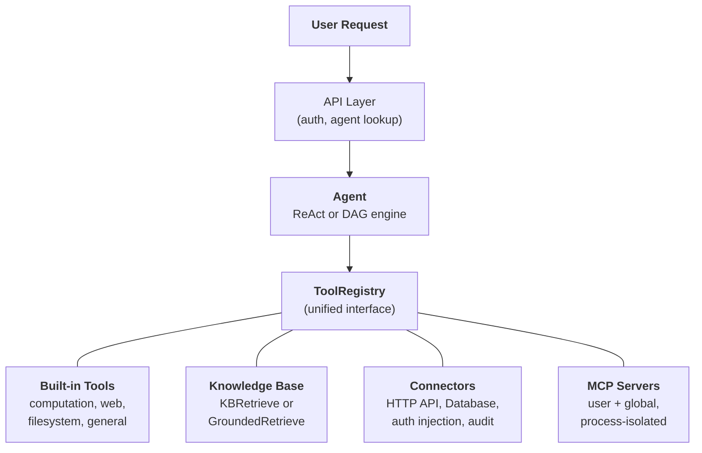
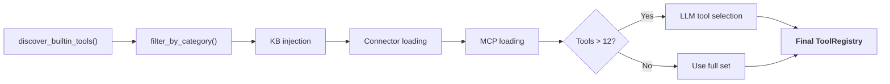

## 統一されたツール抽象化

FIM Oneの中心的な設計洞察は、**エージェントができることはすべてツール**ということです。計算機、ナレッジベースクエリ、ERP API呼び出し、サードパーティMCPサーバーはすべて同じ`Tool`プロトコルを実装しています：`name`、`description`、`parameters_schema`、`category`、および`run()`。エージェントは、ローカルPython関数を呼び出しているのか、ベクトルデータベースをクエリしているのか、レガシーシステムにプロキシしているのか、コミュニティMCPサーバーを呼び出しているのかを知らず、気にしません。`ToolRegistry`内の呼び出し可能なツールのフラットリストを見ます。

これは意図的なアーキテクチャ選択であり、偶然の単純化ではありません。つまり、新しい機能ソースを追加する場合、エージェント、実行エンジン、またはコンテキスト管理レイヤーを変更する必要がないということです。ツールを登録すれば、エージェントがそれを使用します。

4つの機能ソースが1つのレジストリに収束します。エージェントはそれらすべてから等しく引き出します。

## 4つの機能ソース

### 組み込みツール

`discover_builtin_tools()` によるスタートアップ時の自動検出。`core/tool/builtin/` に `BaseTool` サブクラスをドロップすると、設定なしで登録されます。カテゴリには計算（`calculator`、`python_exec`）、ウェブ（`web_search`、`web_fetch`）、ファイルシステム（`file_ops`）、および一般的なもの（`email_send`、`json_transform`、`template_render`、`text_utils`）が含まれます。これらはエージェントのネイティブ機能です。常に利用可能で、セットアップは不要です。

### ナレッジベース

条件付き。エージェントが `kb_ids` をバインドしている場合、汎用の `kb_retrieve` ツールは特殊な検索ツールに置き換わります。**シンプルモード**では、`KBRetrieveTool` は基本的な RAG 検索を実行します。**グラウンディングモード**では、`GroundedRetrieveTool` は 5 段階のパイプラインを実行します：マルチ KB 検索、引用抽出、アライメントスコアリング、競合検出、および信頼度計算。ナレッジベースはエージェントの横に位置する独立したサブシステムではなく、エージェント内に特殊なツールとして組み込まれ、他のすべてのツールと同じ `Tool` プロトコルの対象となります。

### コネクタ

`ConnectorToolAdapter` はエンタープライズシステムのアクションをツールとしてラップします。各アクションは `{connector}__{action}` という名前のツールになり、`connector` カテゴリに分類されます。アダプタは、認証注入（ベアラー、APIキー、基本認証）を備えたHTTPプロキシ、操作レベルのアクセス制御（読み取り/書き込み/管理者）、レスポンス切り詰め、および監査ログを追加します。直接的なデータベースアクセスの場合、`DatabaseToolAdapter` はスキーマ対応のSQL実行とオプションの読み取り専用強制を提供します。コネクタはAIとレガシーシステム間のブリッジであり、コア差別化要因です。詳細な設計については [コネクタアーキテクチャ](/architecture/connector-architecture) を参照してください。

### MCP

外部MCPサーバーは標準プロトコルを介してサードパーティツールを提供します。各サーバーは独自のプロセス（stdioまたはHTTPトランスポート）で実行され、プラットフォームから完全に隔離されています。ツールは`Tool`プロトコルに適応され、`mcp`カテゴリの下に登録されます。管理者は、すべてのユーザーに対して自動的にロードされる**グローバルMCPサーバー**をプロビジョニングできます。MCPはエコシステムの取り組みです。MCPと互換性のあるサーバーはカスタム統合なしで動作します。

## リクエストごとのツールアセンブリ

すべてのチャットリクエストは、`_resolve_tools()` のフィルタリングパイプラインを通じて新しいツールセットをアセンブルします。これは静的な設定ではなく、エージェントの設定、ユーザーのアイデンティティ、利用可能なコネクタと MCP サーバーに基づいてリクエストごとに計算されます。

6つのステップ：

1. **基本検出。** `discover_builtin_tools()` はすべての組み込みツールを読み込み、会話のサンドボックスにスコープします。
2. **エージェントカテゴリフィルタ。** `filter_by_category(*agent.tool_categories)` はエージェントが使用を許可されているカテゴリのみに制限します。
3. **KB インジェクション。** エージェントが `kb_ids` を持つ場合、汎用検索ツールは検索モードに基づいて `KBRetrieveTool` または `GroundedRetrieveTool` に置き換えられます。
4. **コネクタ読み込み。** エージェントにバインドされたコネクタはデータベースから照会されます。各コネクタのアクション（またはデータベーススキーマ）はツールアダプターとしてインスタンス化され、登録されます。
5. **MCP 読み込み。** ユーザーの個人用 MCP サーバーと管理者がプロビジョニングしたグローバル MCP サーバーが読み込まれ、接続され、そのツールが登録されます。
6. **ランタイム選択。** ツールの総数が 12 を超える場合、軽量な LLM 呼び出しがこの特定のクエリに最も関連するサブセット（最大 6 個）を選択します。選択の失敗は致命的ではなく、エージェントは完全なセットにフォールバックします。

結果：エージェントは必要なツールだけを見ます。コネクタなし、KB なしのシンプルなエージェントは 5 つのツールを見るかもしれません。3 つのエンタープライズシステムに接続された Hub エージェントで、グラウンデッドナレッジベースと 2 つの MCP サーバーを持つものは 30 個を見るかもしれません。ただし、選択後は、最も関連性の高い 6 個だけがコンテキストに入ります。

## 何を使うべきか

| 必要性 | 使用するもの | 理由 |
|------|-----|-----|
| 一般的な計算、コード実行、テキスト変換 | 組み込みツール | 常に利用可能、設定不要 |
| エンタープライズシステム統合（ERP、CRM、OA） | コネクタ | 認証ガバナンス、監査証跡、操作レベルのアクセス制御 |
| 引用と証拠を伴う知識検索 | ナレッジベース | RAG パイプライン、根拠のある生成、競合検出 |
| サードパーティツールエコシステム | MCP | 標準プロトコル、プロセス分離、コミュニティサーバー |
| 直接的なデータベースアクセス | データベースコネクタ | スキーマ認識 SQL、オプションの読み取り専用強制 |
| カスタム内部ツール | MCP または組み込み | プロセス分離は MCP、密結合統合は組み込み |

これらのカテゴリは相互に排他的ではありません。単一のエージェントは 1 つの会話で 4 つすべての機能ソースを使用できます。ポリシードキュメントのナレッジベースをクエリし、ERP を確認するためにコネクタを呼び出し、結果をフォーマットするために組み込みツールを使用します。

## 実行エンジンは直交している

ツールシステムと実行エンジンは独立した関心事です。両方のエンジンは同じ `ToolRegistry` からツールを使用します。エンジンの選択は、ツールがどのように調整されるかに影響しますが、どのツールが利用可能かには影響しません。

**ReAct** は反復的なツールループです。エージェントが推論し、ツールを選択し、結果を観察し、完了するまで繰り返します。前のステップの結果に次のステップが依存する探索的で会話的なタスクに優れています。ループは最大 50 回の反復を実行し、ContextGuard を介した反復ごとのコンテキスト管理を行います。実装の詳細については [ReAct Engine](/architecture/react-engine) を参照してください。

**DAG** は目標を 2～6 個の並列ステップに分解します。各ステップは独立した ReAct エージェントを実行します。PlanAnalyzer は目標が達成されたかどうかを評価し、達成されていない場合、パイプラインは自律的に再計画します（最大 3 ラウンド）。DAG は明確なサブタスクを持ち、同時に実行できるタスク（「3 つのソースを検索して結果を比較する」は 3 つではなく 1 つの検索の時間で完了）に優れています。完全なパイプラインについては [DAG Engine](/architecture/dag-engine) を参照してください。

2 つのエンジンは、信頼性の高い構造化出力のための `structured_llm_call`、トークン予算の強制のための `ContextGuard`、ツール解決のための `ToolRegistry` などのインフラストラクチャを共有しています。新しいツールを追加するには、どちらのエンジンも変更する必要がありません。新しいエンジンを追加する場合（必要になった場合）、ツールシステムに変更は必要ありません。

## ライフサイクル概要

**スタートアップ。** `start.sh` は Alembic マイグレーションを実行し、FastAPI サーバーを起動し、組み込みツールを検出し、事前設定されたグローバルサーバーの MCP サーバー接続を確立します。

**リクエストごと。** JWT 認証、エージェント設定ルックアップ、ツールアセンブリ（上記の 6 ステップパイプライン）、エンジン選択（エージェント設定に基づく ReAct または DAG）、SSE ストリーミングでの実行、および結果の永続化。

**横断的関心事。** [コンテキスト管理](/architecture/context-management)（5 層トークン予算）はすべての LLM 呼び出しをオーバーフローから保護します。監査ログはすべてのコネクタツール呼び出しを追跡します。サンドボックス分離はコード実行ツールを含みます。2 つの LLM アーキテクチャ（スマート + 高速）は計画、実行、合成全体でコストを最適化します。

アーキテクチャは、各関心事 -- ツール登録、実行オーケストレーション、コンテキスト管理、セキュリティ -- が独立して進化できるように設計されています。新しいコネクタタイプ、新しい実行エンジン、または新しいコンテキスト戦略は、システム全体に波及する変更なく追加できます。
