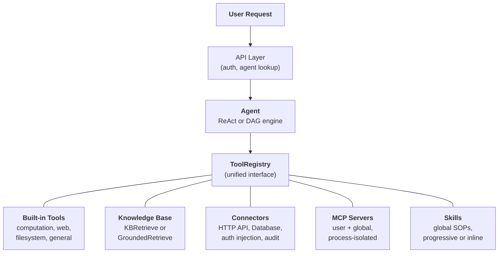
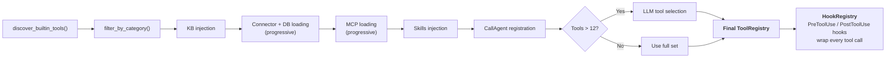

## 統一されたツール抽象化

FIM Oneの中心的な設計洞察は、**エージェントができることはすべてツール**ということです。計算機、ナレッジベースクエリ、ERP API呼び出し、サードパーティMCPサーバーはすべて同じ`Tool`プロトコルを実装しています：`name`、`description`、`parameters_schema`、`category`、および`run()`。エージェントは、ローカルPython関数を呼び出しているのか、ベクトルデータベースをクエリしているのか、レガシーシステムにプロキシしているのか、またはコミュニティMCPサーバーを呼び出しているのかを知りません。`ToolRegistry`内の呼び出し可能なツールのフラットリストを見ます。

これは意図的なアーキテクチャ上の選択であり、偶然の単純化ではありません。つまり、新しい機能ソースを追加する場合、エージェント、実行エンジン、またはコンテキスト管理レイヤーを変更する必要がないということです。ツールを登録するだけで、エージェントがそれらを使用します。

5つの機能ソースが1つのレジストリに収束します。エージェントはそれらすべてから等しく引き出します。

## 5つの機能ソース

### 組み込みツール

`discover_builtin_tools()` によるスタートアップ時の自動検出。`core/tool/builtin/` に `BaseTool` サブクラスをドロップすると、設定なしで登録されます。カテゴリには計算（`calculator`、`python_exec`）、ウェブ（`web_search`、`web_fetch`）、ファイルシステム（`file_ops`）、および一般的なもの（`email_send`、`json_transform`、`template_render`、`text_utils`）が含まれます。これらはエージェントのネイティブ機能です。常に利用可能で、セットアップは不要です。

### ナレッジベース

条件付き。エージェントが `kb_ids` をバインドしている場合、汎用の `kb_retrieve` ツールは特殊な検索ツールに置き換わります。**シンプルモード**では、`KBRetrieveTool` は基本的な RAG 検索を実行します。**グラウンディングモード**では、`GroundedRetrieveTool` は 5 段階のパイプラインを実行します：マルチ KB 検索、引用抽出、アライメントスコアリング、競合検出、および信頼度計算。ナレッジベースはエージェントの横に位置する独立したサブシステムではなく、エージェント内に特殊なツールとして組み込まれ、他のすべてのツールと同じ `Tool` プロトコルの対象となります。

### コネクタ

`ConnectorToolAdapter` はエンタープライズシステムのアクションをツールとしてラップします。各アクションは `{connector}__{action}` という名前のツールになり、`connector` カテゴリに分類されます。アダプタは、認証注入（ベアラー、APIキー、基本認証）を備えたHTTPプロキシ、操作レベルのアクセス制御（読み取り/書き込み/管理者）、レスポンス切り詰め、および監査ログを追加します。直接的なデータベースアクセスの場合、`DatabaseToolAdapter` はスキーマ対応のSQL実行とオプションの読み取り専用強制を提供します。コネクタはAIとレガシーシステム間のブリッジであり、コア差別化要因です。詳細な設計については [コネクタアーキテクチャ](/architecture/connector-architecture) を参照してください。

### MCP

外部MCPサーバーは標準プロトコルを介してサードパーティツールを提供します。各サーバーは独自のプロセス（stdioまたはHTTPトランスポート）で実行され、プラットフォームから完全に隔離されています。ツールは`Tool`プロトコルに適応され、`mcp`カテゴリの下に登録されます。管理者は、すべてのユーザーに対して自動的にロードされる**グローバルMCPサーバー**をプロビジョニングできます。MCPはエコシステムの取り組みです。MCPと互換性のあるサーバーはカスタム統合なしで動作します。

### スキル

スキルは再利用可能な標準作業手順（SOP）です。企業ポリシー、対応手順、段階的なワークフローなど、選択されたエージェントに関係なくグローバルに適用されます。コネクタとナレッジベース（特定のエージェントにスコープできます）とは異なり、スキルは可視性（個人、組織共有、またはマーケット購読）に基づいて、すべてのユーザーに対して常にロードされます。

スキルは2つのインジェクションモード（**段階的**（デフォルト）と**インライン**）をサポートしており、`SKILL_TOOL_MODE`で制御されます。段階的モードでは、コンパクトなスタブがシステムプロンプトに表示され、LLMは必要に応じて`read_skill(name)`を呼び出します。これは、スキル、コネクタ、データベース、MCP サーバー全体に同じスタブファースト、オンデマンド詳細パターンを適用する、より広い[段階的情報開示](/architecture/progressive-disclosure)アーキテクチャの一部です。

スキルがグローバル（エージェント非依存）である理由と、デュアルモードリソース検出との相互作用について詳しく知るには、[エージェント＆リソース検出](/architecture/agent-discovery)を参照してください。

## リクエストごとのツールアセンブリ

すべてのチャットリクエストは、`_resolve_tools()` のフィルタリングパイプラインを通じて、リクエストごとに新しいツールセットをアセンブルします。これは静的な設定ではなく、エージェントの設定、ユーザーのアイデンティティ、利用可能なコネクタと MCP サーバーに基づいてリクエストごとに計算されます。

8つのステップ：

1. **ベース検出。** `discover_builtin_tools()` はすべての組み込みツールを読み込み、会話のサンドボックスにスコープします。
2. **エージェントカテゴリフィルタ。** `filter_by_category(*agent.tool_categories)` は、エージェントが使用を許可されているカテゴリのみに制限します。
3. **KB インジェクション。** エージェントが `kb_ids` を持つ場合、汎用検索ツールは検索モードに基づいて `KBRetrieveTool` または `GroundedRetrieveTool` に置き換えられます。
4. **コネクタ読み込み。** エージェント制約モードでは、エージェントにバインドされたコネクタのみが読み込まれます。オートディスカバリーモード（エージェント未選択）では、ユーザーに表示されるすべてのコネクタが読み込まれます。API コネクタ（`ConnectorMetaTool`）とデータベースコネクタ（`DatabaseMetaTool`）の両方は、デフォルトで[プログレッシブディスクロージャ](/architecture/progressive-disclosure)を使用します。システムプロンプトの軽量スタブ、必要に応じて読み込まれる完全なスキーマ。
5. **MCP 読み込み。** ユーザーの個人用 MCP サーバーと管理者がプロビジョニングしたグローバル MCP サーバーが読み込まれて接続されます。プログレッシブモード（デフォルト）では、単一の `MCPServerMetaTool` がすべてのサーバーを統合します。LLM は必要に応じて `discover` と `call` サブコマンドを呼び出します。[プログレッシブディスクロージャ](/architecture/progressive-disclosure)を参照してください。
6. **スキルインジェクション。** ユーザーに表示されるすべてのアクティブなスキルが読み込まれます。エージェント選択に関係なく。プログレッシブモードでは、`ReadSkillTool` がシステムプロンプトのコンパクトなスタブで登録されます。インラインモードでは、完全なスキルコンテンツが直接埋め込まれます。
7. **CallAgent 登録（オートモードのみ）。** 特定のエージェントが選択されていない場合、すべてのアクティブで表示されるエージェントがカタログにアセンブルされ、`CallAgentTool` を通じて公開され、LLM が専門エージェントにタスクを委譲できるようになります。委譲されたエージェントは、独自の設定から構築された完全な `ToolRegistry` を受け取りますが、無限再帰を防ぐために `call_agent` を除外します。特定のエージェントが選択されている場合、`CallAgentTool` は登録されません。エージェントは専門化されており、他のエージェントに委譲しません。これにより、マーケットプレイスエージェントが他のエージェントのプライベートプロンプトにアクセスするのを防ぎます。
8. **ランタイム選択。** ツールの総数が 12 を超える場合、軽量な LLM 呼び出しがこの特定のクエリに最も関連するサブセット（最大 6 個）を選択します。`request_tools` メタツールが自動的に登録され、LLM が会話中に追加のツールを動的に読み込むことができるようになります。初期選択で必要なツールが見落とされた場合。選択失敗は致命的ではなく、エージェントは完全なセットにフォールバックします。[プログレッシブディスクロージャ](/architecture/progressive-disclosure)を参照してください。
9. **フック登録。** エージェントの宣言されたフック（`model_config_json.hooks` から）がインスタンス化され、`HookRegistry` にアタッチされます。選択されたツール呼び出しはそれぞれラップされます。`PreToolUse` フックは実行前に引数をブロックまたは書き換えることができます。`PostToolUse` フックは観測を LLM に返す前に書き換えることができます。フックは **LLM ループの外で** 実行され、エージェント命令によってバイパスされることはできません。[フックシステム](/architecture/hook-system)を参照してください。

結果：エージェントは必要なツールだけを見ます。それ以上ではなく。コネクタなし、KB なしの単純なエージェントは 5 つのツールを見るかもしれません。3 つのエンタープライズシステムに接続された Hub エージェント、グラウンデッド知識ベース、2 つの MCP サーバーを持つエージェントは 30 個を見るかもしれません。ただし、選択後、最も関連する 6 個だけがコンテキストに入ります。

## 何を使うべきか

| 必要な機能 | 使用するもの | 理由 |
|------|-----|-----|
| 一般的な計算、コード実行、テキスト変換 | 組み込みツール | 常に利用可能、設定不要 |
| エンタープライズシステム統合（ERP、CRM、OA） | コネクタ | 認証ガバナンス、監査証跡、操作レベルのアクセス制御 |
| 引用と証拠を伴う知識検索 | ナレッジベース | RAGパイプライン、根拠のある生成、信頼度スコアリング |
| サードパーティツールエコシステム | MCP | 標準プロトコル、プロセス分離、コミュニティサーバー |
| 組織ポリシー、SOP、処理手順 | スキル | デフォルトでグローバル、段階的読み込み、可視性スコープ |
| 専門エージェントへのタスク委譲 | エージェント呼び出し | セマンティックエージェントルーティング、完全なツール継承、並列実行 |
| 直接データベースアクセス | データベースコネクタ | スキーマ認識SQL、オプションの読み取り専用強制 |
| カスタム内部ツール | MCP または組み込み | MCPはプロセス分離用、組み込みは緊密な統合用 |

これらのカテゴリは相互に排他的ではありません。単一のエージェントは1つの会話で5つすべての機能ソースを使用できます。苦情処理SOPのスキルを読み込み、ポリシードキュメントのナレッジベースをクエリし、ERPを確認するためにコネクタを呼び出し、専門エージェント（自動モード）に分析を委譲し、組み込みツールを使用して結果をフォーマットします。

## 実行エンジンは直交している

ツールシステムと実行エンジンは独立した関心事です。LLM駆動エンジン（ReActとDAG）は同じ `ToolRegistry` からツールを消費します。エンジンの選択は、ツールがどのように調整されるかに影響しますが、どのツールが利用可能かには影響しません。

**ReAct** は反復的なツールループです。エージェントは推論し、ツールを選択し、結果を観察し、完了するまで繰り返します。前のステップの結果に次のステップが依存する、探索的で会話的なタスクに優れています。ループは最大50回の反復を実行し、ContextGuardを介した反復ごとのコンテキスト管理を行います。実装の詳細については、[ReAct Engine](/architecture/react-engine) を参照してください。

**DAG** は目標を2～6個の並列ステップに分解します。各ステップは独立したReActエージェントを実行します。PlanAnalyzerは目標が達成されたかどうかを評価し、達成されていない場合、パイプラインは自律的に再計画します（最大3ラウンド）。DAGは、「3つのソースを検索して結果を比較する」のように、明確なサブタスクを持ち、並行実行できるタスクに優れています。これは3回の検索の時間ではなく、1回の検索の時間で完了します。完全なパイプラインについては、[DAG Engine](/architecture/dag-engine) を参照してください。

2つのエンジンは、信頼性の高い構造化出力のための `structured_llm_call`、トークン予算の強制のための `ContextGuard`、ツール解決のための `ToolRegistry` などのインフラストラクチャを共有しています。新しいツールを追加するには、どちらのエンジンも変更は不要です。新しいエンジンを追加する場合（必要になった場合）、ツールシステムへの変更は不要です。

両方のエンジンは、オートモード（エージェント未選択）の場合、`CallAgentTool` を介した**エージェント委譲**もサポートしています。ネイティブ関数呼び出しモードでは、LLMは単一のターンで複数の `call_agent` 呼び出しを実行でき、これらは `asyncio.gather` を介して並行実行されます。各委譲されたエージェントは独自の `ToolRegistry` を受け取り、完全な実行ユニットとして実行されます。エージェント発見、グローバルSOPとしてのスキル、およびエージェント委譲の詳細な設計については、[Agent & Resource Discovery](/architecture/agent-discovery) を参照してください。

### ワークフローエンジン — 第3のパラダイム

LLM駆動のReActおよびDAGエンジンと並んで、FIM Oneには**ワークフローエンジン**が含まれています。これは26種類のノードタイプを備えたビジュアルDAGエディタで、固定プロセスの自動化（承認チェーン、スケジュール済みETL、マルチステップパイプライン）に対応しています。ワークフローはエージェント、コネクタ、ナレッジベース、MCP サーバー、LLM呼び出し、HTTPリクエスト、Pythonコード、および人間による承認ゲートを呼び出すことができます。この関係は非対称です。ワークフローはエージェントを（AGENTノード経由で）オーケストレートできますが、エージェントはワークフローを直接呼び出すことはできません。柔軟で探索的なタスクにはエージェントを使用し、決定論的で反復可能なプロセスにはワークフローを使用してください。詳細は[実行モード](/concepts/execution-modes)を参照してください。

## ライフサイクル概要

**スタートアップ。** `start.sh` は Alembic マイグレーションを実行し、FastAPI サーバーを起動し、組み込みツールを検出し、事前設定されたグローバルサーバーの MCP サーバー接続を確立します。

**リクエストごと。** JWT 認証、エージェント設定ルックアップ、ツール組み立て（上記の8ステップパイプライン）、エンジン選択（エージェント設定に基づく ReAct または DAG）、SSE ストリーミングによる実行、および結果の永続化。

**横断的な関心事。** [コンテキスト管理](/architecture/context-management)（5層 token 予算）は、すべての LLM 呼び出しをオーバーフローから保護します。[フックシステム](/architecture/hook-system)は、すべてのツール呼び出しをプラットフォーム制御の `PreToolUse` / `PostToolUse` ロジックでラップします — ヒューマンインザループ承認（`FeishuGateHook`）、監査ログ、読み取り専用モード強制の仕組みです。監査ログはすべてのコネクタツール呼び出しを追跡します。サンドボックス分離はコード実行ツールを含みます。2つの LLM アーキテクチャ（スマート + 高速）は、計画、実行、合成全体のコストを最適化します。

このアーキテクチャは、各関心事 — ツール登録、実行オーケストレーション、コンテキスト管理、セキュリティ — が独立して進化できるように設計されています。新しいコネクタタイプ、新しい実行エンジン、または新しいコンテキスト戦略は、システム全体に連鎖的な変更を引き起こすことなく追加できます。
