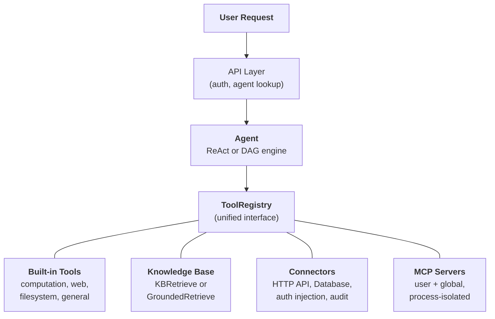
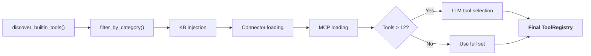

---
title: "システム概要"
description: "Agent、Knowledge Base、Connector、Built-in Tools、および MCP が統一されたアーキテクチャにどのように構成されるか。"
---## 統一されたツール抽象化

FIM One の中心的な設計洞察は、**エージェントができることはすべてツール**ということです。計算機、ナレッジベースクエリ、ERP API 呼び出し、サードパーティ MCP サーバーはすべて同じ `Tool` プロトコル（`name`、`description`、`parameters_schema`、`category`、`run()`）を実装しています。エージェントは、ローカル Python 関数を呼び出しているのか、ベクトルデータベースをクエリしているのか、レガシーシステムにプロキシしているのか、コミュニティ MCP サーバーを呼び出しているのかを知ったり気にしたりしません。`ToolRegistry` 内の呼び出し可能なツールのフラットなリストを見ます。

これは意図的なアーキテクチャ上の選択であり、偶然の単純化ではありません。つまり、新しい機能ソースを追加する場合、エージェント、実行エンジン、またはコンテキスト管理レイヤーを変更する必要がないということです。ツールを登録するだけで、エージェントがそれらを使用します。

4 つの機能ソースが 1 つのレジストリに収束します。エージェントはそれらすべてから等しく引き出します。## 4つの機能ソース### 組み込みツール

`discover_builtin_tools()` によって起動時に自動検出されます。`BaseTool` サブクラスを `core/tool/builtin/` にドロップすると、設定なしで登録されます。カテゴリには計算 (`calculator`、`python_exec`)、ウェブ (`web_search`、`web_fetch`)、ファイルシステム (`file_ops`)、および一般 (`email_send`、`json_transform`、`template_render`、`text_utils`) が含まれます。これらはエージェントのネイティブ機能です -- 常に利用可能で、セットアップ不要です。### ナレッジベース

条件付き。エージェントが `kb_ids` をバインドしている場合、汎用の `kb_retrieve` ツールは特殊な検索ツールに置き換わります。**シンプルモード**では、`KBRetrieveTool` は基本的な RAG 検索を実行します。**グラウンディングモード**では、`GroundedRetrieveTool` は 5 段階のパイプラインを実行します：マルチ KB 検索、引用抽出、アライメントスコアリング、競合検出、および信頼度計算。ナレッジベースはエージェントの横に座っている独立したサブシステムではなく、他のすべてのものと同じ `Tool` プロトコルに従う特殊なツールとしてエージェントに組み込まれます。### Connector

`ConnectorToolAdapter` はエンタープライズシステムのアクションをツールとしてラップします。各アクションは `{connector}__{action}` という名前のツールになり、`connector` カテゴリに分類されます。アダプターは HTTP プロキシと認証注入（bearer、API キー、基本認証）、操作レベルのアクセス制御（読み取り/書き込み/管理者）、レスポンス切り詰め、および監査ログを追加します。直接データベースアクセスの場合、`DatabaseToolAdapter` はスキーマ対応の SQL 実行とオプションの読み取り専用強制を提供します。Connector は AI とレガシーシステム間のブリッジです -- 主な差別化要因です。詳細な設計については [Connector Architecture](/architecture/connector-architecture) を参照してください。### MCP

External MCP servers provide third-party tools via the standard protocol. Each server runs in its own process (stdio or HTTP transport), fully isolated from the platform. Tools are adapted into the `Tool` protocol and registered under category `mcp`. Admins can provision **global MCP servers** that load for all users automatically. MCP is the ecosystem play -- any MCP-compatible server works without custom integration.## リクエストごとのツールアセンブリ

すべてのチャットリクエストは、`_resolve_tools()` のフィルタリングパイプラインを通じて新しいツールセットをアセンブルします。これは静的な設定ではなく、エージェントの設定、ユーザーのアイデンティティ、および利用可能なコネクタと MCP サーバーに基づいてリクエストごとに計算されます。

6つのステップ：

1. **ベース検出。** `discover_builtin_tools()` はすべての組み込みツールをロードし、会話のサンドボックスにスコープします。
2. **エージェントカテゴリフィルタ。** `filter_by_category(*agent.tool_categories)` はエージェントが使用を許可されているカテゴリのみに制限します。
3. **KB インジェクション。** エージェントが `kb_ids` を持つ場合、汎用検索ツールは検索モードに基づいて `KBRetrieveTool` または `GroundedRetrieveTool` に置き換えられます。
4. **コネクタロード。** エージェントのバインドされたコネクタはデータベースから照会されます。各コネクタのアクション（またはデータベーススキーマ）はツールアダプタとしてインスタンス化され、登録されます。
5. **MCP ロード。** ユーザーの個人用 MCP サーバーと管理者がプロビジョニングしたグローバル MCP サーバーがロードされ、接続され、それらのツールが登録されます。
6. **ランタイム選択。** ツール数の合計が 12 を超える場合、軽量な LLM 呼び出しがこの特定のクエリに最も関連するサブセット（最大 6 個）を選択します。選択の失敗は致命的ではなく、エージェントは完全なセットにフォールバックします。

結果：エージェントは必要なツールだけを見ます。それ以上ではありません。コネクタがなく KB がないシンプルなエージェントは 5 つのツールを見るかもしれません。3 つのエンタープライズシステムに接続され、グラウンデッドナレッジベースと 2 つの MCP サーバーを持つ Hub エージェントは 30 個を見るかもしれません。ただし、選択後は、最も関連性の高い 6 個だけがコンテキストに入ります。## 何を使うべきか

| 必要な機能 | 使用するもの | 理由 |
|------|-----|-----|
| 一般的な計算、コード実行、テキスト変換 | Built-in Tool | 常に利用可能、設定不要 |
| エンタープライズシステム統合（ERP、CRM、OA） | Connector | 認証ガバナンス、監査証跡、操作レベルのアクセス制御 |
| 引用と証拠を伴う知識検索 | Knowledge Base | RAGパイプライン、根拠のある生成、競合検出 |
| サードパーティツールエコシステム | MCP | 標準プロトコル、プロセス分離、コミュニティサーバー |
| 直接的なデータベースアクセス | Database Connector | スキーマ認識SQL、オプションの読み取り専用強制 |
| カスタム内部ツール | MCP または Built-in | プロセス分離にはMCP、密接な統合にはbuilt-in |

これらのカテゴリは相互に排他的ではありません。単一のエージェントは1つの会話内で、4つすべての機能ソースを使用できます。ポリシードキュメントの知識ベースへのクエリ、ERPをチェックするためのコネクタの呼び出し、結果をフォーマットするための組み込みツールの使用などです。## 実行エンジンは直交している

ツールシステムと実行エンジンは独立した関心事です。両方のエンジンは同じ `ToolRegistry` からツールを消費します。エンジンの選択は、ツールがどのように調整されるかに影響しますが、どのツールが利用可能かには影響しません。

**ReAct** は反復的なツールループです。エージェントは推論し、ツールを選択し、結果を観察し、完了するまで繰り返します。これは、次のステップが前の結果に依存する探索的で会話的なタスクに優れています。ループは最大50回の反復を実行し、ContextGuard を介した反復ごとのコンテキスト管理を行います。実装の詳細については [ReAct Engine](/architecture/react-engine) を参照してください。

**DAG** は目標を2～6個の並列ステップに分解します。各ステップは独立した ReAct エージェントを実行します。PlanAnalyzer は目標が達成されたかどうかを評価し、達成されていない場合はパイプラインが自律的に再計画します（最大3ラウンド）。DAG は明確なサブタスクを持つタスクに優れており、並行実行できます。「3つのソースを検索して結果を比較する」は3つの検索の時間ではなく、1つの検索の時間で完了します。完全なパイプラインについては [DAG Engine](/architecture/dag-engine) を参照してください。

2つのエンジンはインフラストラクチャを共有しています：信頼性の高い構造化出力のための `structured_llm_call`、トークン予算の強制のための `ContextGuard`、ツール解決のための `ToolRegistry`。新しいツールを追加するには、どちらのエンジンも変更が不要です。新しいエンジンを追加する場合（必要になることがあれば）、ツールシステムの変更は不要です。## ライフサイクル概要

**スタートアップ。** `start.sh` は Alembic マイグレーションを実行し、FastAPI サーバーを起動し、組み込みツールを検出し、事前に設定されたグローバルサーバーの MCP サーバー接続を確立します。

**リクエストごと。** JWT 認証、エージェント設定ルックアップ、ツールアセンブリ（上記の 6 ステップパイプライン）、エンジン選択（エージェント設定に基づく ReAct または DAG）、SSE ストリーミングによる実行、および結果の永続化。

**横断的関心事。** [コンテキスト管理](/architecture/context-management)（5 層トークン予算）は、すべての LLM 呼び出しをオーバーフローから保護します。監査ログは、すべてのコネクタツール呼び出しを追跡します。サンドボックス分離は、コード実行ツールを含みます。2 つの LLM アーキテクチャ（スマート + 高速）は、計画、実行、および合成全体でコストを最適化します。

アーキテクチャは、各関心事 -- ツール登録、実行オーケストレーション、コンテキスト管理、セキュリティ -- が独立して進化できるように設計されています。新しいコネクタタイプ、新しい実行エンジン、または新しいコンテキスト戦略は、システム全体にわたるカスケード変更なしに追加できます。