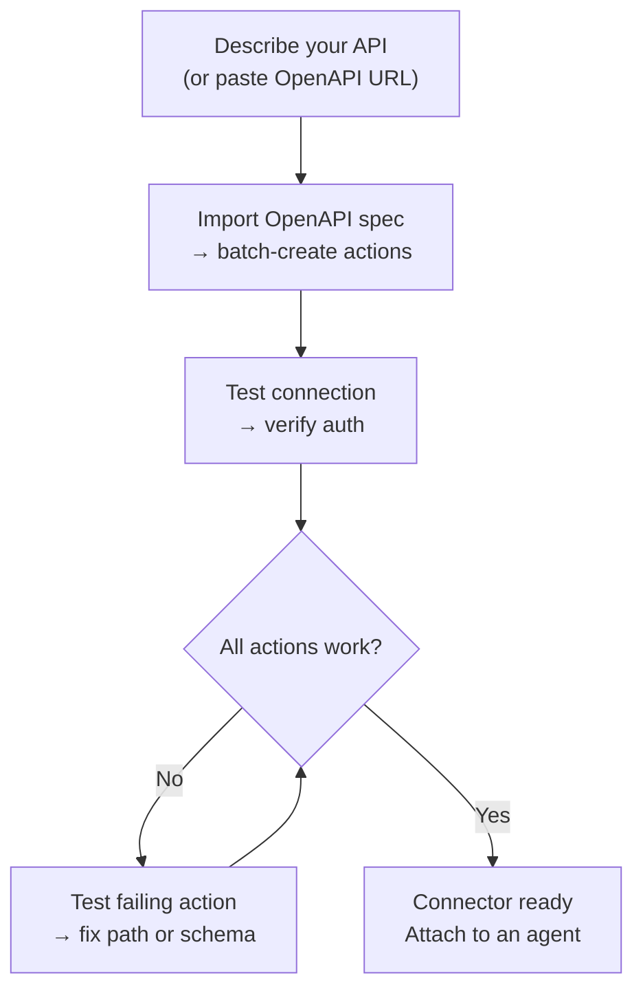
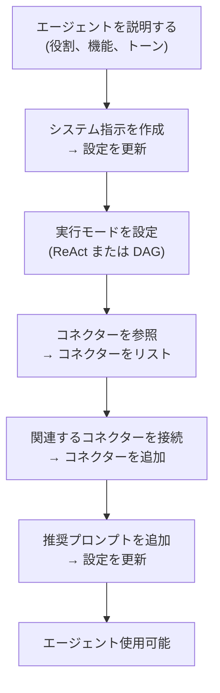

---
title: "AI Builder"
description: "AIを使用してConnectorとAgentを構築 — クイック提案または完全なReActビルダー。"
---## 概要

AI Builderを使用すると、プレーンテキストで必要な内容を説明し、AIエージェントがそれを設定してくれます。2つのモードで動作します：

| モード | 動作方法 | 最適な用途 |
|------|-------------|---------|
| **クイック提案** | 単一のLLM呼び出しが設定を生成 | 迅速な初期ドラフト、シンプルなAPI |
| **Advanced builder** | ReActエージェントがループ内でツールを使用して構築、テスト、改善 | 複雑なAPI、OpenAPIインポート、反復的な改善 |

いつでもモード間を切り替えることができます。クイックモードは開始点を作成し、Advanced builderは反復を可能にします。

---## Connector Builder

**Connector** は、FIM One が外部システムとどのように通信するかを定義します。ベース URL、認証、および公開する特定の API アクションを含みます。Connector Builder は、AI エージェントに 9 つのツールを提供し、あなたの代わりにこの設定を構築・管理します。### ツール

| ツール | 機能 |
|------|-------------|
| **Get Settings** | 現在のコネクタ設定（URL、認証タイプ、認証設定）を読み取る |
| **Update Settings** | コネクタ名、ベース URL、または認証認証情報を変更する |
| **List Actions** | 既存のすべての API アクション（メソッドとパス）を表示する |
| **Create Action** | 新しい API エンドポイントを追加する — HTTP メソッド、パス、パラメータ、本文テンプレート |
| **Update Action** | 既存のアクションを変更する（説明、スキーマ、レスポンス抽出） |
| **Delete Action** | 不要になったアクションを削除する |
| **Test Action** | 任意のアクションのライブ HTTP リクエストを送信し、レスポンスを検査する |
| **Test Connection** | ベース URL に到達可能であり、認証情報が受け入れられることを確認する |
| **Import OpenAPI** | Swagger 2.x または OpenAPI 3.x 仕様から最大 50 個のエンドポイントをバッチインポートする |### 典型的なワークフロー

最も一般的なパターン：OpenAPI URLを貼り付けて、ビルダーに残りの処理をさせます。

**プロンプトの例：**
> "Import the OpenAPI spec from `https://api.acme.com/openapi.json`, then test the `GET /orders` endpoint with `order_id=12345`."

ビルダーはスペックを取得し、すべてのアクションを自動的に作成し、テストリクエストを実行して、結果を報告します。すべてフォームに触れることなく実行されます。

---## Agent Builder

**Agent** は、一連の指示、ツール、および（オプション）コネクタを持つ名前付きの AI ペルソナです。Agent Builder は、AI エージェントに別のエージェントをゼロから構成するための 6 つのツールを提供します。### ツール

| ツール | 機能 |
|------|-------------|
| **Get Settings** | 現在のエージェント設定（指示、実行モード、ツール、モデル）を読み取る |
| **Update Settings** | 名前、説明、システムプロンプト、実行モード、または推奨プロンプトを変更する |
| **List Connectors** | 利用可能なすべてのコネクタ（接続済みおよび未接続）を参照する |
| **Add Connector** | コネクタを接続して、エージェントがそのアクションをツールとして呼び出せるようにする |
| **Remove Connector** | コネクタを切断する（コネクタ自体は削除されない） |
| **Set Model** | 基盤となるLLMを切り替えるか、温度と最大トークンを調整する |### 典型的ワークフロー

説明から始めて、ビルダーがエージェント全体を設定します：

**プロンプト例：**
> "Finance Copilotを作成してください。Acmeコネクターを使用して、注文と請求書に関する質問に答える必要があります。ReActモードを使用し、一般的な質問用に3つの推奨プロンプトを追加してください。"

ビルダーは現在の設定を読み取り、システムプロンプトを作成し、コネクターを接続し、実行モードを設定し、推奨プロンプトを追加します — すべて1回の会話ターンで行われます。

---## 仕組み

内部では、両方のビルダーは通常のエージェントと同じインフラストラクチャを共有しています：

| ビルダーモード | メカニズム |
|-------------|-----------|
| **クイック提案** | 単一のLLM推論呼び出しが、構造化JSON として完全な設定を生成します |
| **高度なビルダー** | ReAct エージェントループ：推論 → ビルダーツール呼び出し → 結果を観察 → 次のステップを決定 |

高度なビルダーは完全な ReAct エージェントであり、制限されたツールセット（9個の Connector または 6個の Agent ビルダーツールのみで、ウェブまたは計算ツールはなし）を持っています。ターゲットリソースの現在の状態を読み取り、変更が必要な内容を計画し、適切なツールを呼び出し、完了を宣言する前に結果を検証します。

これは、高度なビルダーが曖昧性を処理できることを意味します：OpenAPI インポートが 30 個のアクションを作成しても、関連があるのは 5 個だけの場合、「注文関連のエンドポイントのみを保持する」と指示すれば、残りを削除します。