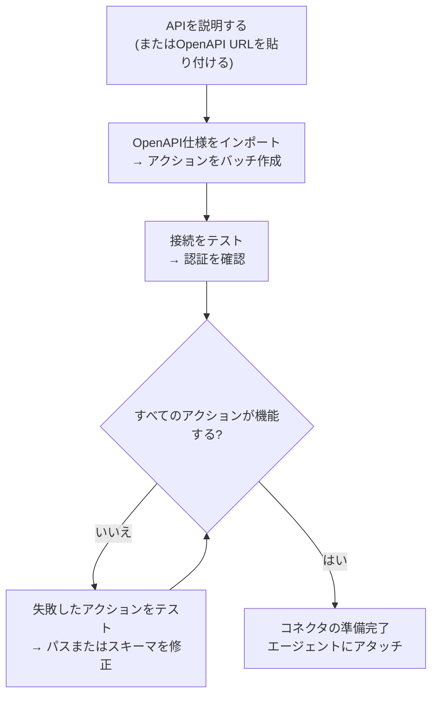
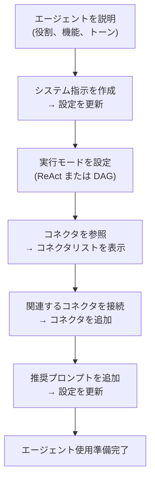

## 概要

AI Builderを使用すると、プレーンテキストで必要な内容を説明し、AIエージェントがそれを設定してくれます。2つのモードで動作します:

| モード | 動作方法 | 最適な用途 |
|------|-------------|---------|
| **クイック提案** | 単一のLLM呼び出しで設定を生成 | 迅速な初期ドラフト、シンプルなAPI |
| **高度なビルダー** | ReActエージェントがループ内でツールを使用して構築、テスト、改善 | 複雑なAPI、OpenAPIインポート、反復的な改善 |

いつでもモード間を切り替えることができます。クイックモードは開始点を作成し、高度なビルダーでは反復処理が可能です。

---

## コネクタビルダー

**コネクタ**は、FIM Oneが外部システムと通信する方法を定義します。ベースURL、認証、および公開する特定のAPIアクションが含まれます。コネクタビルダーは、AIエージェントに9つのツールを提供し、あなたの代わりにこの設定を構築・管理します。

### ツール

| ツール | 機能 |
|------|-------------|
| **Get Settings** | 現在のコネクタ設定を読み取る（URL、認証タイプ、認証設定） |
| **Update Settings** | コネクタ名、ベースURL、または認証認証情報を変更する |
| **List Actions** | 既存のすべてのAPIアクションとそのメソッドおよびパスを表示する |
| **Create Action** | 新しいAPIエンドポイントを追加する — HTTPメソッド、パス、パラメータ、ボディテンプレート |
| **Update Action** | 既存のアクションを変更する（説明、スキーマ、レスポンス抽出） |
| **Delete Action** | 不要になったアクションを削除する |
| **Test Action** | 任意のアクションのライブHTTPリクエストを送信し、レスポンスを検査する |
| **Test Connection** | ベースURLに到達可能であり、認証情報が受け入れられることを確認する |
| **Import OpenAPI** | Swagger 2.xまたはOpenAPI 3.xスペックから最大50個のエンドポイントを一括インポートする |

### 典型的ワークフロー

最も一般的なパターン：OpenAPI URLを貼り付けて、ビルダーに残りの処理を任せます。

**プロンプトの例：**
> "OpenAPI仕様を`https://api.acme.com/openapi.json`からインポートし、`order_id=12345`で`GET /orders`エンドポイントをテストしてください。"

ビルダーは仕様を取得し、すべてのアクションを自動的に作成し、テストリクエストを実行し、結果を報告します。フォームに触れることなくすべてが完了します。

---

## エージェントビルダー

**エージェント**は、一連の指示、ツール、および（オプション）コネクタを備えた名前付きのAIペルソナです。エージェントビルダーは、AIエージェントに別のエージェントをゼロから構成するための6つのツールを提供します。

### ツール

| ツール | 機能 |
|------|-------------|
| **Get Settings** | 現在のエージェント設定（指示、実行モード、ツール、モデル）を読み取る |
| **Update Settings** | 名前、説明、システムプロンプト、実行モード、または提案されたプロンプトを変更する |
| **List Connectors** | 利用可能なすべてのコネクタ（接続済みおよび未接続）を参照する |
| **Add Connector** | コネクタを接続して、エージェントがそのアクションをツールとして呼び出せるようにする |
| **Remove Connector** | コネクタを切断する（コネクタ自体は削除されない） |
| **Set Model** | 基盤となるLLMを切り替えるか、温度と最大トークン数を調整する |

### 典型的ワークフロー

説明から始めて、ビルダーがエージェント全体を設定します:

**プロンプト例:**
> "Finance Copilotを作成してください。Acmeコネクタを使用して、注文と請求書に関する質問に答える必要があります。ReActモードを使用し、一般的な質問用に3つの推奨プロンプトを追加してください。"

ビルダーは現在の設定を読み取り、システムプロンプトを作成し、コネクタを接続し、実行モードを設定し、推奨プロンプトを追加します — すべて1回の会話ターンで行われます。

---

## 仕組み

内部では、両方のビルダーは通常のエージェントと同じインフラストラクチャを共有しています:

| ビルダーモード | メカニズム |
|-------------|-----------|
| **クイック提案** | 単一のLLM推論呼び出しが、構造化JSON形式の完全な設定を生成します |
| **高度なビルダー** | ReActエージェントループ: 推論 → ビルダーツール呼び出し → 結果を観察 → 次のステップを決定 |

高度なビルダーは完全なReActエージェントであり、制限されたツールセット（9個のコネクタまたは6個のエージェントビルダーツールのみで、ウェブまたは計算ツールはなし）を持っています。ターゲットリソースの現在の状態を読み取り、何を変更する必要があるかを計画し、適切なツールを呼び出し、完了を宣言する前に結果を検証します。

つまり、高度なビルダーは曖昧性に対応できます: OpenAPI インポートが30個のアクションを作成しても、5個だけが関連している場合、「注文関連のエンドポイントのみを保持する」と指示すれば、残りを削除します。
