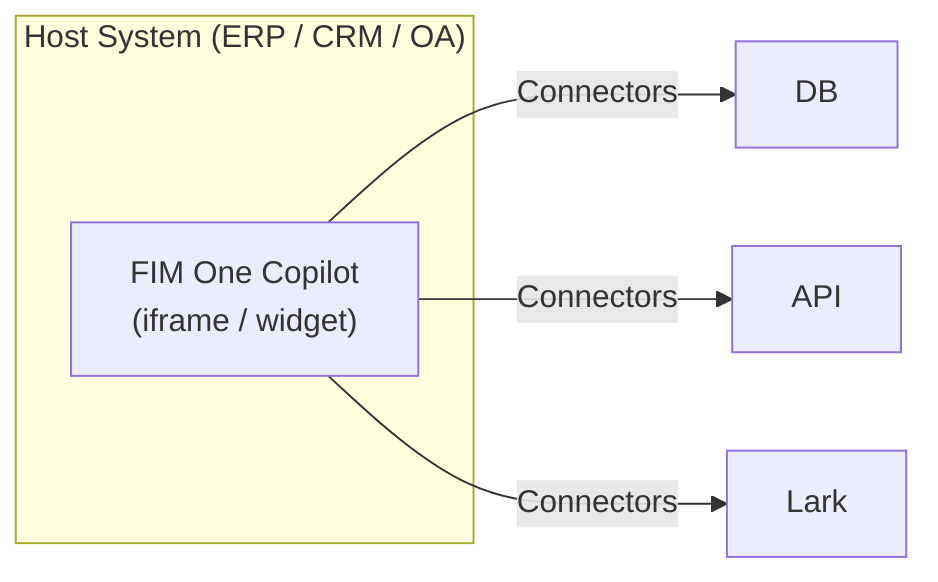
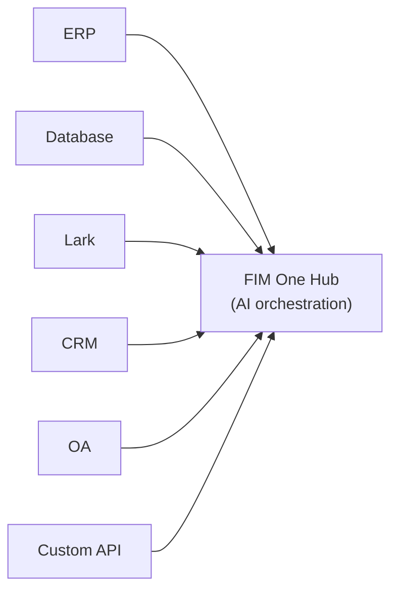
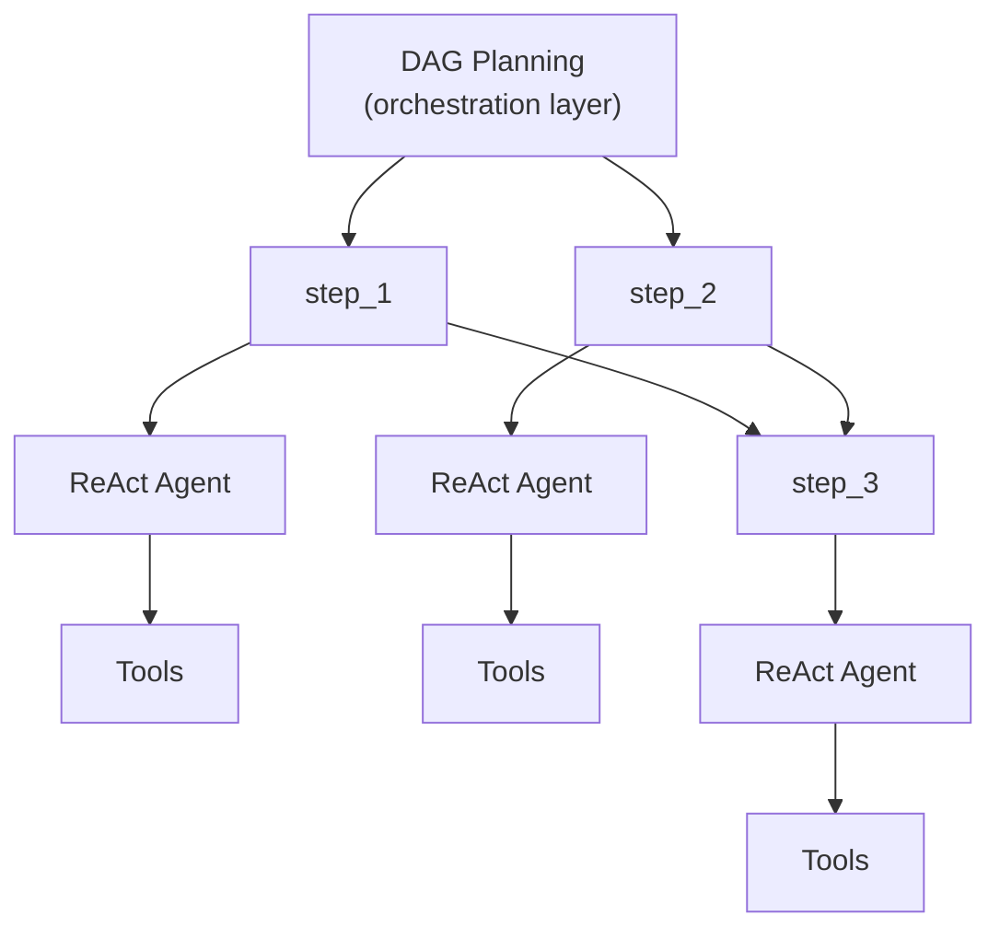

---
title: "実行モード"
description: "スタンドアロン、コパイロット、ハブ — FIM One をデプロイする 3 つの方法。"
---## 3つのモード

FIM Oneは、エージェントのデプロイ方法と使用方法によって決まる3つのモードで動作します：

| モード | 説明 | 配信方法 | 例 |
|------|-----------|----------|---------|
| **Standalone** | 汎用AI アシスタント | Portal | チャット、検索、コード実行、ナレッジベースQ&A |
| **Copilot** | ホストシステムに組み込まれたAI | iframe / widget / embed | ERP ウェブUIに組み込まれた「Finance Copilot」 |
| **Hub** | システム横断的な中央オーケストレーション | Portal / API | エージェントがERP をクエリ、OA承認を確認、Lark経由で通知 |

進行は自然です：Standaloneから始まり、ホストシステムにCopilotとして組み込み、その後クロスシステムオーケストレーション用のHubをセットアップします。Copilotは組み込まれたまま実行され続け、Hubは中央オーケストレーションレイヤーを追加します。## モード詳細### スタンドアロン（0コネクタ）

デフォルトモード。FIM Oneは完全機能のAIアシスタントとして動作します：

- 組み込みツール：ウェブ検索、Python実行、計算機、ファイル操作、シェルコマンド
- RAG搭載ナレッジベース（PDF、DOCX、Markdown、HTML、CSV）
- 複雑なマルチステップタスク向けの動的DAGプランニング
- DAG可視化を備えたリアルタイムストリーミング

外部システムへのアクセスは不要です。一般的な分析、リサーチ、コードタスクに有用です。### Copilot (embedded)

FIM One をホストシステムの Web UI に埋め込みます。エージェントはユーザーの使い慣れたインターフェース内で動作し、コンテキストの切り替えは不要です。Copilot モードは複数のコネクタ（例：ホストシステムの DB + 通知サービス）を使用できます。

例：
- **Finance Copilot**: DB コネクタを介して Kingdee (金蝶) に接続 → 財務諸表のクエリ、分析レポートの生成
- **Contract Copilot**: API コネクタを介して契約管理システムに接続 → 契約の検索、条項の抽出、リスク評価
- **HR Copilot**: API コネクタを介して HR システムに接続 → 従業員情報のクエリ、統計情報の生成

エージェントは Standalone モードと同じ ReAct/DAG エンジンを使用しますが、コネクタを通じて実際のビジネスデータにアクセスできるようになります。### Hub (中央オーケストレーション)

Hubはスタンドアロンポータル(またはAPI)で、中央インテリジェンスレイヤーとして機能します。単一のシステムに埋め込まれるのではなく、すべてのシステムに接続します。ユーザーはPortal UIまたはAPIを通じてアクセスします。

例:
- "CRMで期限切れの契約を確認し、ERP支払いと相互参照し、Larkで財務チームに通知"
- "OA承認が完了したら、CRMで契約ステータスを更新し、監査データベースにログ"
- "Salesforceから営業データをクエリし、ビジネスDBを使用して予測を生成し、管理者にメール要約を送信"

各connectorは独立したブリッジです。1つを追加または削除しても、他には影響しません。## 配信方法

| 配信 | 説明 | 典型的なモード |
|----------|-------------|-------------|
| **Portal (Web UI)** | 組み込みの Next.js インターフェース | スタンドアロン、Hub |
| **API (headless)** | HTTP/SSE エンドポイント (`/api/execute`, `/api/stream`) | Hub (プログラマティックアクセス) |
| **iframe / Embed** | ホストシステムページに注入 | Copilot |

配信とモードは関連していますが、固定されていません。API 経由で Hub にアクセスしたり、スタンドアロンエージェントをポータル経由で使用したりできます。ただし、典型的なパターンは Hub にはポータル、Copilot には埋め込みです。## 実行エンジン（内部実装）

FIM One は、内部的には 2 つの実行エンジンを提供しています：

| エンジン | 最適な用途 | 動作方法 |
|--------|----------|-------------|
| **ReAct** | 単一の複雑なクエリ | Reason → Act → Observe ループとツール |
| **DAG Planning** | マルチステップの並列タスク | LLM が依存関係グラフを生成し、独立したステップが同時実行 |

ReAct はアトミックユニット、DAG はオーケストレーションレイヤーです。両方のエンジンは 3 つのモード（Standalone、Copilot、Hub）すべてで動作します。Hub モードでは、単一の DAG ステップが異なるシステムへの connector を呼び出す可能性があります。## 従来のワークフローエンジンを使用しない理由

FIM Oneは意図的にドラッグ&ドロップワークフローエディタを構築していません。これは戦略的な選択です：

1. **ワークフローは既に他の場所に存在します。** エンタープライズクライアントの固定プロセス（承認チェーン、監査フロー）は、OA、ERP、レガシーシステムに存在します。別のワークフローエディタではなく、これらのシステムに接続するAIが必要です。

2. **動的DAGは柔軟なケースをカバーします。** 事前に定義されていないタスクの場合、LLMが生成するDAGは実行時に適応します。人間による事前設計は不要です。

3. **既存の機能は固定パイプラインに構成されます。** スケジュール済みジョブ（計画中）は固定プロンプトでDAGエージェントをトリガーします。DAGはステップを計画し、コネクタはターゲットシステムにブリッジします。この組み合わせは静的パイプラインと同等ですが、LLMが遭遇するデータに基づいて計画を調整するため、より柔軟です。

4. **コネクタ = APIコール。** 複雑なワークフロー操作（転送、却下、エスカレーション）はターゲットシステムの責任です。コネクタの観点からは、各操作は単にパラメータを持つHTTPリクエストです。FIM OneがAPIを呼び出し、ターゲットシステムが状態マシンを管理します。