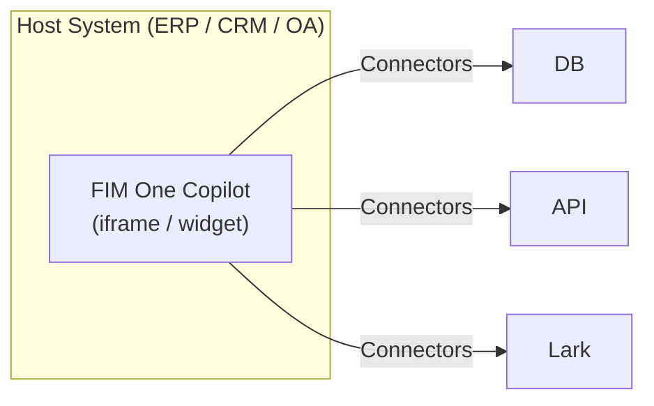
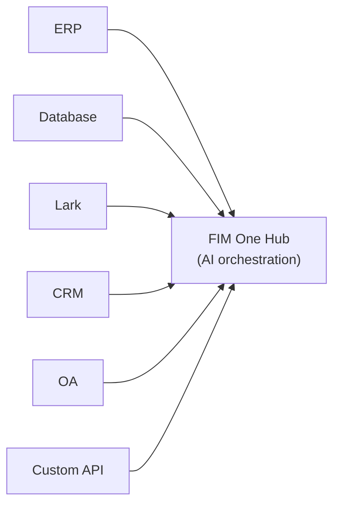
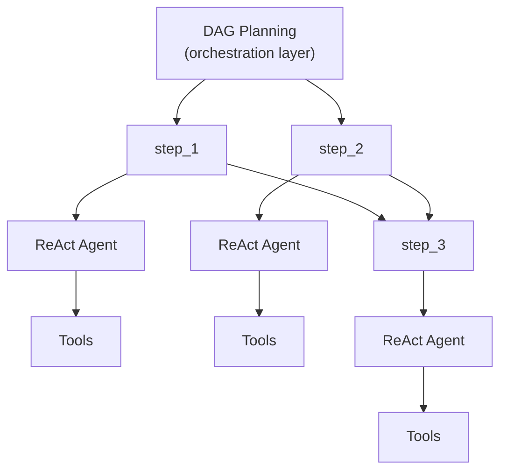

## 3つのモード

FIM Oneは、エージェントがどのようにデプロイされ、使用されるかによって決定される3つのモードで動作します:

| モード | 説明 | 配信方法 | 例 |
|------|-----------|----------|---------|
| **スタンドアロン** | 汎用AI アシスタント | ポータル | チャット、検索、コード実行、ナレッジベースQ&A |
| **Copilot** | ホストシステムに組み込まれたAI | iframe / ウィジェット / 埋め込み | ERP Webユーザーインターフェースに組み込まれた「Finance Copilot」 |
| **Hub** | システム間の中央オーケストレーション | ポータル / API | エージェントがERPをクエリし、OA承認をチェックし、Larkで通知 |

進行は自然です: スタンドアロンから始めて、ホストシステムにCopilotとして組み込み、その後クロスシステムオーケストレーション用のHubをセットアップします。Copilotは組み込まれたまま実行され続けます。Hubは中央オーケストレーションレイヤーを追加します。

## モードの詳細

### スタンドアロン（0コネクタ）

デフォルトモード。FIM Oneは完全な機能を備えたAIアシスタントとして動作します：

- 組み込みツール：ウェブ検索、Python実行、計算機、ファイル操作、シェルコマンド
- RAG対応ナレッジベース（PDF、DOCX、Markdown、HTML、CSV）
- 複雑なマルチステップタスク用の動的DAG計画
- DAG可視化を備えたリアルタイムストリーミング

外部システムへのアクセスは不要です。一般的な分析、リサーチ、コードタスクに有用です。

### Copilot（組み込み）

FIM Oneをホストシステムのウェブ UIに組み込みます。エージェントはユーザーの使い慣れたインターフェース内で動作し、コンテキストの切り替えは不要です。Copilotモードは複数のコネクタ（例：ホストシステムのDB + 通知サービス）を使用できます。

例：
- **Finance Copilot**: DBコネクタ経由でKingdee（金蝶）に接続 → 財務諸表の照会、分析レポートの生成
- **Contract Copilot**: APIコネクタ経由で契約管理システムに接続 → 契約の検索、条項の抽出、リスク評価
- **HR Copilot**: APIコネクタ経由でHRシステムに接続 → 従業員情報の照会、統計情報の生成

エージェントはスタンドアロンモードと同じReAct/DAGエンジンを使用しますが、コネクタを通じて実際のビジネスデータにアクセスできます。

### Hub（中央オーケストレーション）

Hubはスタンドアロンポータル（またはAPI）であり、中央インテリジェンスレイヤーとして機能します。単一のシステムに組み込まれるのではなく、すべてのシステムに接続します。ユーザーはPortal UIまたはAPIを通じてアクセスします。

例：
- 「CRMの期限切れ契約を確認し、ERPの支払いと相互参照し、Larkで財務チームに通知」
- 「OA承認が完了したら、CRMの契約ステータスを更新し、監査データベースにログ」
- 「Salesforceから営業データをクエリし、ビジネスDBを使用して予測を生成し、経営陣にメール要約を送信」

各コネクタは独立したブリッジです。1つを追加または削除しても、他には影響しません。

## 配信方法

| 配信 | 説明 | 典型的なモード |
|----------|-------------|-------------|
| **ポータル (Web UI)** | 組み込みの Next.js インターフェース | スタンドアロン、Hub |
| **API (ヘッドレス)** | HTTP/SSE エンドポイント (`/api/execute`, `/api/stream`) | Hub (プログラマティックアクセス) |
| **iframe / 埋め込み** | ホストシステムのページに注入 | コパイロット |

配信とモードは関連していますが、固定されていません。API 経由で Hub にアクセスしたり、スタンドアロンエージェントをポータル経由で使用したりできます。ただし、典型的なパターンは Hub ではポータル、コパイロットでは埋め込みです。

## 実行エンジン（内部実装）

FIM One は、内部的に 2 つの実行エンジンを提供しています：

| エンジン | 最適な用途 | 動作方式 |
|--------|----------|-------------|
| **ReAct** | 単一の複雑なクエリ | Reason → Act → Observe ループとツール |
| **DAG Planning** | マルチステップの並列タスク | LLM が依存関係グラフを生成し、独立したステップが並行実行 |

ReAct はアトミックユニット、DAG はオーケストレーションレイヤーです。両方のエンジンは 3 つのモード（Standalone、Copilot、Hub）すべてで動作します。Hub モードでは、単一の DAG ステップが異なるシステムへのコネクタを呼び出す可能性があります。

## 従来のワークフローエンジンを使わない理由

FIM Oneは意図的にドラッグアンドドロップ型のワークフローエディタを構築していません。これは戦略的な選択です：

1. **ワークフローは既に他の場所に存在します。** エンタープライズクライアントの固定プロセス（承認チェーン、監査フロー）は、彼らのOA、ERP、およびレガシーシステムに存在しています。彼らは別のワークフローエディタではなく、それらのシステムに接続するAIが必要です。

2. **動的DAGが柔軟なケースをカバーします。** 事前に定義されていないタスクの場合、LLMが生成するDAGは実行時に適応します — 人間による事前設計は不要です。

3. **既存の機能が固定パイプラインに組み合わさります。** スケジュール済みジョブ（計画中）は固定プロンプトでDAGエージェントをトリガーします。DAGはステップを計画し、コネクタはターゲットシステムに接続します。この組み合わせは静的パイプラインと同等です — ただし、LLMが遭遇するデータに基づいて計画を調整するため、より柔軟です。

4. **コネクタ = APIコール。** 複雑なワークフロー操作（転送、却下、エスカレーション）はターゲットシステムの責任です。コネクタの観点からは、各操作は単なるパラメータ付きのHTTPリクエストです。FIM OneはAPIを呼び出し、ターゲットシステムが状態マシンを管理します。
