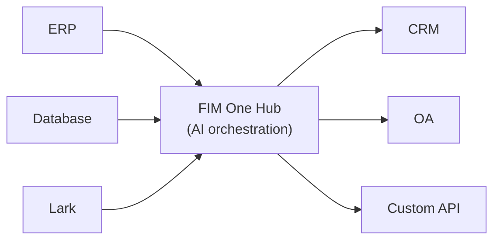

<Frame>
  
</Frame>

FIM Oneへようこそ。エンタープライズシステム全体にわたって複雑なタスクを動的に計画・実行するエージェントを構築するためのAI搭載フレームワークです。

  <a href="https://one.fim.ai/">ウェブサイト</a> · <a href="https://github.com/fim-ai/fim-one">GitHub</a> · <a href="https://discord.gg/z64czxdC7z">Discord</a> · <a href="https://x.com/FIM_One">Twitter</a>

<Tip>
  **☁️ FIM Oneをクラウドで試す — セットアップ不要。**
  マネージド版が [**cloud.fim.ai**](https://cloud.fim.ai/) で利用可能です：Docker不要、APIキー不要、サインインしてシステムの接続を開始するだけです。_アーリーアクセス — フィードバック歓迎。_
</Tip>

## FIM Oneとは？

FIM Oneは、既存のシステムと連携するAIエージェントを構築するためのプロバイダー非依存のPythonフレームワークです。ロジックを複製するよう求めるワークフロービルダーとは異なり、FIM Oneはシステムをプロアクティブに橋渡しします — データベースの読み取り、APIの呼び出し、通知のプッシュ — すべて統一されたAIインターフェースを通じて。

コアとなる洞察：**3つのデリバリーモード、1つのエージェントコア**。

## 3つのデリバリーモード

| モード | 説明 | デリバリー | ユースケース |
|------|-----------|----------|----------|
| **スタンドアロン** | 汎用AI アシスタント — 検索、コード、ナレッジベース | ポータル | チャット、コード実行、ナレッジベースQ&A |
| **コパイロット** | ホストシステムに組み込まれたAI — ユーザーの既存UIで並行して動作 | iframe / ウィジェット / 埋め込み | ERP ウェブUIの「Finance Copilot」 |
| **ハブ** | 中央クロスシステムオーケストレーション — すべてのシステムが接続 | ポータル / API | エージェントがERP をクエリ、OA をチェック、Lark で通知 |

## ハブアーキテクチャ

ハブはコア差別化要因です。すべてのシステムがAIと出会う中央ポータルです：

各コネクタは標準化されたブリッジです。エージェントはSAPとカスタムPostgreSQLデータベースのどちらと通信しているかを知る必要も気にする必要もありません。データはシステムに留まり、FIM Oneはそれらを調整するAIレイヤーを提供します。

## はじめに

次のセクションを確認して、FIM One のアーキテクチャを理解し、デプロイしましょう：

- **[クイックスタート](/quickstart)** — Docker またはローカル開発で数分で FIM One を実行
- **[実行モード](/concepts/execution-modes)** — Standalone、Copilot、Hub モードを詳しく理解
- **[AI ビルダー](/concepts/ai-builder)** — 自然言語を使用して AI でコネクタとエージェントを構築
- **[コネクタアーキテクチャ](/architecture/connector-architecture)** — FIM One が AI を通じてレガシーシステムを接続する方法
- **[哲学](/architecture/philosophy)** — 動的計画が厳密なワークフローと完全に自律的なエージェントの間の正しい中間地点である理由
