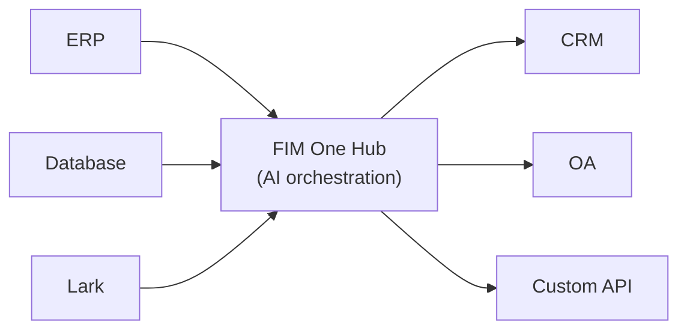

<Frame>
  
</Frame>

FIM Oneへようこそ。エンタープライズシステム全体にわたって複雑なタスクを動的に計画・実行するエージェントを構築するためのAI搭載フレームワークです。

  <a href="https://one.fim.ai/">ウェブサイト</a> · <a href="https://github.com/fim-ai/fim-one">GitHub</a> · <a href="https://discord.gg/z64czxdC7z">Discord</a> · <a href="https://x.com/FIM_One">Twitter</a> · <a href="https://www.producthunt.com/products/fim-one">Product Hunt</a>

<Tip>
  **☁️ クラウドでFIM Oneを試す — セットアップ不要。**
  マネージド版が[**cloud.fim.ai**](https://cloud.fim.ai/)で利用可能です。Docker不要、APIキー不要、サインインするだけでシステムの接続を開始できます。_アーリーアクセス — フィードバック歓迎。_
</Tip>## FIM Oneとは？

FIM Oneは、既存システムと連携するAIエージェントを構築するためのプロバイダー非依存のPythonフレームワークです。ロジックの複製を求めるワークフロービルダーとは異なり、FIM Oneはシステムをプロアクティブに橋渡しします — データベースの読み取り、APIの呼び出し、通知のプッシュ — すべて統一されたAIインターフェースを通じて。

コアの洞察：**3つのデリバリーモード、1つのエージェントコア**。## 3つのデリバリーモード

| モード | 説明 | デリバリー | ユースケース |
|------|-----------|----------|----------|
| **Standalone** | 汎用AI アシスタント — 検索、コード、ナレッジベース | ポータル | チャット、コード実行、ナレッジベースQ&A |
| **Copilot** | ホストシステムに組み込まれたAI — ユーザーの既存UIで並行して動作 | iframe / widget / embed | ERP ウェブUIの「Finance Copilot」 |
| **Hub** | システム横断的な中央オーケストレーション — すべてのシステムが接続 | ポータル / API | エージェントがERP をクエリ、OA をチェック、Lark 経由で通知 |## ハブアーキテクチャ

ハブはコア差別化要因です。すべてのシステムがAIと出会う中央ポータルです：

各コネクタは標準化されたブリッジです。エージェントは、SAPと通信しているのか、カスタムPostgreSQLデータベースと通信しているのかを知る必要も気にする必要もありません。データはシステムに残ります。FIM Oneは、それらを調整するAIレイヤーを提供します。## はじめに

次のセクションを参照して、FIM One のアーキテクチャを理解し、デプロイしてください:

- **[クイックスタート](/quickstart)** — Docker またはローカル開発で数分で FIM One を実行
- **[実行モード](/concepts/execution-modes)** — Standalone、Copilot、Hub モードを深く理解
- **[AI Builder](/concepts/ai-builder)** — 自然言語を使用して AI で Connector と Agent を構築
- **[Connector アーキテクチャ](/architecture/connector-architecture)** — FIM One が AI を通じてレガシーシステムに接続する方法
- **[Philosophy](/architecture/philosophy)** — 動的計画が厳密なワークフローと完全自律エージェント間の適切な中間地点である理由