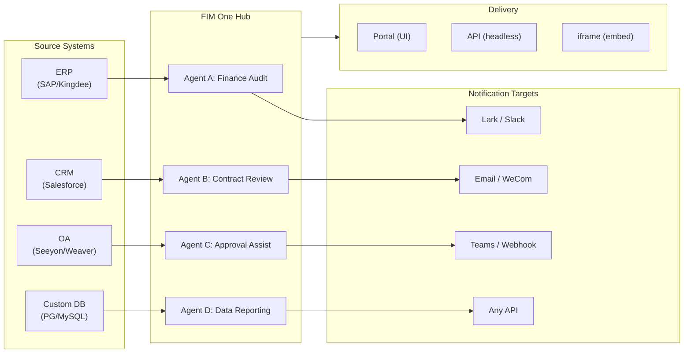

> Goal: Build an **AI-powered Connector Hub** — Standalone (portal assistant), Copilot (embedded in host system), Hub (central cross-system orchestration).
>
> Principles: **Provider-agnostic** (no vendor lock-in), **minimal-abstraction**, **protocol-first**, **connector-first** (integration is the core value).

## 製品ビジョン

FIM One は、3つの段階的なモードで機能する **AI コネクタハブ** です：

```
Standalone   → 独自の AI アシスタント (Portal)
Copilot      → ホストシステムに組み込まれた AI (iframe / widget / embed)
Hub          → 中央クロスシステムオーケストレーション (Portal / API)
```

**Hub モードが主要な差別化要因です。** エンタープライズクライアントは、ERP、CRM、OA、財務、HR などのレガシーシステムを持っており、これらが AI を通じて相互に通信する必要があります：



**GTM パス：ランド・アンド・エクスパンド**

| ステップ | モード | 実行内容 |
|------|------|-------------|
| Land | Copilot | 1つのシステムに組み込み、UI 内で価値を実証 |
| Expand | Copilot → Hub | より多くのシステムにロールアウト；Hub がそれらを集約 |

## 出荷済みバージョン

### v0.1 (2026-02-22) — MVP: ReAct + DAG Planner
- ReActAgent with tools (calculator, python_exec, web_search)
- DAG Planner (LLM generates dependency graphs)
- Portal UI with streaming + KaTeX

### v0.2 (2026-02-24) — マルチモデル + メモリ
- リトライ / レート制限 / 使用状況追跡
- ネイティブ関数呼び出し (JSON のみの解析なし)
- マルチモデルサポート (高速 + メイン LLM)
- メモリ: WindowMemory、SummaryMemory
- FastAPI バックエンド SSE ストリーミング付き

### v0.3 (2026-02-25) — Web Tools + MCP
- Web tools (web_search, web_fetch) via Jina/Tavily/Brave
- File operations tool
- MCP client (standard tool integration)
- Tool auto-discovery + categories
- DAG visualization with click-to-scroll
- Code exec in Docker (`--network=none`)

### v0.4 (2026-02-25) — マルチターン + エージェント
- マルチターン会話 (DbMemory)
- ツールステップ折りたたみUI
- HTTPリクエスト + シェル実行ツール
- エージェント管理 (作成、設定、公開)
- JWT認証
- エージェント単位の実行モード + 温度制御

### v0.5 (2026-02-28) — Full RAG + Grounded Gen
- Full RAG パイプライン (embedding + vector store + FTS + RRF + reranker)
- Grounded Generation (citations, conflict detection, confidence scores)
- ナレッジベース ドキュメント管理 (CRUD, search, retry, schema migration)
- ContextGuard + pinned messages (token budget manager)
- DbMemory persistence + LLM Compact
- DAG Re-Planning (up to 3 rounds)

### v0.6 (2026-03-01) — コネクタプラットフォーム
- **コネクタ CRUD**: 作成、読み取り、更新、削除
- **ConnectorToolAdapter**: コネクタ → BaseToolに変換
- **ユーザーごとの認証情報**: AES-GCM暗号化
- **確認ゲート**: 書き込み操作の承認
- **監査ログ**: すべてのツール呼び出しを記録
- **サーキットブレーカー**: 障害時の段階的な機能低下
- **ユーティリティツール**: email_send、json_transform、template_render、text_utils
- **埋め込みオプション**: Jina、OpenAI、カスタムプロバイダー

### v0.7 (2026-03-06) — 管理プラットフォーム + マルチテナント
- **管理プラットフォーム**: ユーザー管理、ロール切り替え、パスワードリセット、アカウント有効化/無効化
- **招待制登録**: 3つのモード (オープン/招待/無効) + 招待コード CRUD
- **ストレージ管理**: ユーザーごとのディスク使用量、クリア、孤立ファイルのクリーンアップ
- **会話モデレーション**: 管理者による一覧表示/削除
- **ユーザーごとの強制ログアウト**: すべてのトークンを無効化
- **API ヘルスダッシュボード**: システム統計、コネクタメトリクス
- **初回セットアップウィザード**: ガイド付き管理者アカウント作成
- **個人センター**: ユーザーごとのグローバル指示、言語設定
- **JWT 認証**: トークンベースの SSE 認証、会話の所有権
- **グローバル MCP サーバー**: 管理者がプロビジョニング、すべてのセッションで読み込み
- **後方互換性**: registration_enabled → registration_mode 自動マイグレーション

### v0.7.x (2026-03-07 to 2026-03-12) — 安定性 + ポーランド
- 招待コード管理
- ユーザーごとのクォータ (429 強制)
- 構造化監査ログ
- 機密単語フィルタリング
- 管理者ログイン履歴
- 管理者ファイルブラウザ
- 拡張管理者ビュー (model_name、tools、kb_ids フィールド)
- Docker Compose デプロイメント (単一イメージ、名前付きボリューム)
- OAuth 自動検出 (window.location から)
- 拡張思考/推論サポート (`LLM_REASONING_EFFORT`、`LLM_REASONING_BUDGET_TOKENS`) — OpenAI o シリーズ、Gemini 2.5+、Claude 対応
- 管理者ツール単位の有効/無効切り替え (無効ツールはチャット実行時に除外)
- MCP サーバー管理をコネクタページに移動
- デュアルデータベースサポート: SQLite (ゼロ設定デフォルト) + PostgreSQL (本番環境); Docker Compose は PostgreSQL を自動プロビジョニング
- モデル設定ドキュメントページ (プロバイダーごとの拡張思考セットアップ付き)
- SSE Protocol v2: リアルタイム回答ストリーミング (`delta_reasoning`、`usage` フィールド付き、`done`/`suggestions`/`title`/`end` イベント分割); SQLite プール サイズ 5 → 20
- AI Builder 拡張: 7 つの新しいビルダーツール (GetSettings、TestConnection、ImportOpenAPI (コネクタ用); ListConnectors、AddConnector、RemoveConnector、SetModel (エージェント用))、エージェントの `is_builder` フラグ、ビルダープロンプト自動更新、SSRF ガード
- SSE v2 フロントエンド: ストリーミングドット パルスカーソル、DAG 再計画ラウンドスナップショット (折りたたみ可能カード)、DAG レイアウトをステップ状態から分離
- AI Builder コンセプトドキュメントページ (コネクタおよびエージェントビルダーガイド付き)
- 組織システム: 完全な CRUD、ロールベースのメンバーシップ (オーナー/管理者/メンバー)、管理者管理 UI
- 3 層リソース可視性 (個人/組織/グローバル) — エージェント、コネクタ、ナレッジベース、MCP サーバー
- すべてのリソースタイプの公開/非公開 API; 公開エージェントのオーナー委譲
- 管理者設定可視性エンドポイント (クローン・トゥ・グローバルに置き換え); 統一された `build_visibility_filter()` クエリヘルパー
- データベースコネクタ (フェーズ 1-3): PG/MySQL/Oracle/SQL Server + 中国レガシー DB への直接 SQL アクセス; スキーマ内省、AI 注釈、読み取り専用クエリ実行、暗号化された認証情報、コネクタあたり 3 つのツール (`list_tables`、`describe_table`、`query`)
- **評価センター**: 定量的エージェント品質ベンチマーク — テストデータセット CRUD (プロンプト + 期待される動作 + アサーション)、評価実行 (並列実行 + LLM グレーダー + ケースごとの合格/不合格/レイテンシ/トークン結果)、自動ポーリング付き結果ビューア; マイグレーション `r8t0v2x4z567`
- 3 つのモデルロール (General/Fast/Reasoning) — ティアごとの環境設定分離; 高速モデルはメインモデル設定を継承しない
- 構造化データとアーティファクト渡しのための `StepOutput` データクラス (プレーン文字列ステップ結果に置き換え)
- DAG 実行用ツールキャッシュ — 実行ごとに同一ツール呼び出しをキャッシュ (非同期ロック スタンピード防止付き) (`DAG_TOOL_CACHE`)
- ステップごとの LLM 検証 (失敗時に 1 回再試行) (`DAG_STEP_VERIFICATION`)
- 自動ルーティング: 高速 LLM がクエリを ReAct または DAG として分類; `/api/auto` エンドポイント; フロントエンド 3 方向モード切り替え (`AUTO_ROUTING`)
- [x] ~~**プラットフォーム組織 + リソースサブスクリプション**~~: 組み込みプラットフォーム組織がすべてのユーザーに自動参加; 共有リソースをサブスクライブするための Market API; リソースサブスクリプションテーブル; グローバル可視性に置き換わる組織ベースのリソース共有
- [x] ~~**エージェント自動検出とサブエージェントバインディング**~~: エージェントの `discoverable` フラグ; `sub_agent_ids` ホワイトリスト; 専門エージェントへのタスク委譲用 CallAgentTool
- [x] ~~**MCP サーバー認証情報 + ユーザーごとのオーバーライド**~~: `mcp_server_credentials` テーブル; `PUT /api/mcp-servers/{id}/my-credentials` エンドポイント; 認証情報フォールバック動作用 `allow_fallback` フラグ
- [x] ~~**コネクタ/KB 切り替え**~~: `POST /api/connectors/{id}/toggle` および `POST /api/knowledge-bases/{id}/toggle` (リソースの一時停止/再開用)
- [x] ~~**スタンドアロン KB 会話**~~: 会話の `kb_ids` フィールド (エージェントバインディングなしの直接 KB チャット用)

## 計画されているバージョン

### v0.8 — コネクタ宣言型設定 + プログレッシブディスクロージャー

**目標**: Pythonコードを書かずにコネクタを定義しやすくし、ツールと指示がLLMにどのように公開されるかを最適化する。

- [x] ~~**データベースコネクタ**: 直接SQLアクセス (PostgreSQL、MySQL、Oracle)~~ *(v0.7.x で出荷 — フェーズ1-3)*
- [x] ~~**RBAC**: ユーザー/ロール単位のコネクタアクセス制御~~ *(v0.7.x で出荷 — org システム + 3段階の可視性)*
- [x] **コネクタ認証情報の暗号化 + ユーザー単位のオーバーライド**: `connector_credentials` テーブル、`CREDENTIAL_ENCRYPTION_KEY` 経由の Fernet 暗号化、`allow_fallback` フラグ、`GET/PUT/DELETE /my-credentials` エンドポイント、チャットツール読み込み時のユーザー単位の認証情報解決
- [x] **公開レビューUI**: 組織レベルの公開レビューシステム — 組織ごとのレビュー切り替え、承認/却下ワークフロー付き ReviewsSheet、リソースカード上のステータスバッジ、公開ダイアログ内のレビュー通知、却下されたリソースの再提出
- [ ] **コネクタプログレッシブディスクロージャー (フェーズ1-2)**: 単一の `ConnectorMetaTool` がアクション単位のツールに置き換わる; システムプロンプトは軽量な**スタブ**のみを受け取る (名前 + 1行の説明、コネクタあたり ~30 トークン vs アクションあたり ~250 トークン); エージェントが `discover(connector)` を呼び出して完全なアクションスキーマをオンデマンドで読み込む — スキーマはモデルがコネクタを選択した時のみ読み込まれ、プロンプトプレフィックスをキャッシング用に安定に保つ。Claude Code の `defer_loading: true` 内部パターンをミラーリング。`execute` サブコマンド; 後方互換性のための機能フラグ。
- [x] ~~**エージェントスキルシステム + コンパクト指示**: エージェント指示のオンデマンドスキル読み込み — `Skill` モデル (名前、コンテンツ/SOP、オプションのスクリプト) をエージェントにアタッチ; システムプロンプト内で名前のみで参照 (~スキルあたり ~10 トークン); エージェントが `read_skill(name)` を呼び出して完全なコンテンツをオンデマンドで読み込む。会話ごとの指示トークンコストを ~80% 削減しながら、より豊富な SOP ライブラリを可能にする。ConnectorMetaTool のプログレッシブディスクロージャーの指示レベルでの対応物。「指示 + ツール + スキル」の差別化ストーリーを実現。また Agent モデルに `compact_instructions` フィールドを追加 — エージェント単位の圧縮優先度リストを `ContextGuard` に圧縮時に注入 (例: 「注文ID と金額を保持し、生の API レスポンスを削除」)、現在の静的な汎用プロンプトに置き換わる。Claude Code の Compact Instructions パターンにインスパイアされた。~~
- [ ] **YAML/JSON コネクタ設定**: プラットフォームが自動的に MCP サーバーを生成
- [ ] **コネクタのインポート/エクスポート**: コネクタテンプレートを共有
- [ ] **コネクタのフォーク**: 既存コネクタのクローンとカスタマイズ
- [ ] **データベースコネクタ フェーズ4**: エンタープライズドライバー — Oracle (`oracledb`)、SQL Server (`aioodbc`)、達梦 DM8 (`aioodbc` + DM ODBC)、南大通用 GBase (`aioodbc` + GBase ODBC)
- [ ] **メッセージプッシュ**: Lark、WeCom、Slack、Email 通知アクション
- [x] **ワークフロー ブループリント システム**: マルチステップ自動化ブループリントを設計・実行するためのビジュアルワークフローエディタ — `Workflow` / `WorkflowRun` ORM モデル、完全な CRUD + SSE 実行 API、インポート/エクスポート、トポロジカル実行と 12 ノードタイプ (Start、End、LLM、ConditionBranch、QuestionClassifier、Agent、KnowledgeRetrieval、Connector、HTTPRequest、VariableAssign、TemplateTransform、CodeExecution) を備えた `WorkflowEngine`、ドラッグ&ドロップパレットとノード設定パネル付き React Flow v12 ビジュアルエディタ、サブプロセスベースのコード実行セキュリティ
- [x] **操作監査**: 誰が何をしたかの詳細ログ — 管理者レビューログ監査タブを追加 (組織/リソースごとの公開レビュー追跡)
- [ ] **セマンティックスキーマアノテーション**: `semantic_tag`、`description`、`pii` フラグでコネクタスキーマフィールドを拡張; アノテーションを LLM ツール説明に表示して、エージェントが列名から推測することなくフィールドの意図を理解できるようにする

**インパクト**: 実装エンジニア (Python 不要) は 1-2 時間でコネクタを追加できる。ツール定義とエージェント指示のトークンコストは規模に応じて ~80–93% 削減される。

### v0.9 — 可観測性 + 本番環境対応

**目標**: 本番環境グレードの運用、デバッグ、監視。**フック システム**を導入 — エージェント命令の下に位置する決定論的な強制レイヤーで、LLMによってオーバーライドされることはありません。

- [ ] **コネクタ段階的情報開示（フェーズ3-4）**: 統一された`ConnectorExecutor`インターフェース（API/DB/MCPを1つの抽象化の背後に）; `jsonschema`を使用したアクション パラメータ検証; プロトコル非依存の検出/実行
- [ ] **エージェント トレース レイヤー（可観測性++）**: エージェント デバッグ用のアプリケーション レベルの実行/トレース/スレッド階層 — 各会話 → `Trace`、各LLM呼び出し/ツール呼び出し/DAGステップ → 入力/出力/トークン/タイミング付きの`Span`。タイムラインと展開可能なLLM呼び出しペイロード付きのフロントエンド トレース ビューアー。これはOTel（インフラストラクチャ レベル）を超えて、開発者とエンタープライズ クライアント向けのアクション可能なエージェント ループ デバッグを提供します。OpenTelemetry エクスポートをデータ シンク オプションとして提供。LangSmithの実行/トレース/スレッド概念に基づいてモデル化 — エージェント可観測性の業界検証済みパターン。
- [ ] **メトリクス ダッシュボード**: レイテンシ、成功率、トークン使用量、コネクタ呼び出し分析 — エージェント単位、ユーザー単位、組織単位の内訳
- [ ] **サーキット ブレーカー**: 指数バックオフ、障害検出
- [ ] **エージェント フック システム**: **LLM ループの外側で**実行される決定論的な強制レイヤー — フックはツール イベントで自動的に実行され、エージェント命令によってバイパスされることはありません。3つのフック ポイント: `PreToolUse`（実行前に検証/ブロック）、`PostToolUse`（実行後の副作用）、`SessionStart`（動的コンテキストを注入）。組み込みフック: すべてのコネクタ呼び出しで`ConnectorCallLog`を自動書き込み（現在は手動）; 組織が読み取り専用モードの場合、書き込み操作をブロック; オーバーサイズのDBクエリ結果をエージェントに到達する前に自動切り詰め; コネクタ呼び出し頻度をレート制限。ユーザー定義フック: エージェント単位のYAML設定（`hooks:`フィールド）でシェル コマンドまたはPythonコール可能オブジェクトを宣言し、マッチングツール イベントでトリガー — Claude Codeのフックと同じパターン。主要な設計原則: **フックは「常に発生する必要があり、LLMがそれを覚えていることに依存してはいけない」ロジック用です**。命令は「すべての呼び出しを記録する」と言う; フックが実際に記録する。命令は「読み取り専用モードで書き込まない」と言う; フックが実際にブロックする。
- [ ] **エージェント ワークスペース（ツール出力オフロード + ハンドオフ）**: MCP/コネクタ/DBツール レスポンスが閾値（デフォルト: 8K文字）を超える場合、完全な出力を会話単位のワークスペース ファイル（`workspace://tool_result_xxx.txt`）に自動保存し、切り詰められたプレビュー + ファイルURIをエージェントに返す。3つの新しい組み込みツール: 選択的アクセス用の`read_workspace_file(path, start_line, end_line)`、検出用の`list_workspace_files()`、コンテキスト遷移用の`write_handoff(summary)` — エージェントはコンテキスト圧縮またはセッション切り替え前に構造化されたハンドオフ ノート（進捗、何が機能したか、何が失敗したか、次のステップ）を書き込む; 次のエージェント インスタンスは圧縮アルゴリズムの要約品質に依存する代わりにそれを読む。Claude Codeのワークスペース + ハンドオフ パターンをミラーリング。大規模な結果セットでの注意散漫を防ぎ、切り詰めによるサイレント データ損失を排除。最小限の変更: `MCPToolAdapter`と`ConnectorToolAdapter`の`truncate_tool_output()`を拡張してワークスペース ストレージに書き込む。
- [ ] **サンドボックス強化**: v2コード実行分離の改善
- [ ] **パフォーマンス テスト**: 同時負荷ベンチマーク
- [ ] **MCP接続プーリング**: リクエスト単位のSTDIOサブプロセス生成はスケーリングしない — 100同時ユーザー = MCPサーバーあたり100サブプロセス。ユーザー単位のenv分離でSTDIO接続をプール（`(server_id, env_hash)`でキー化）; SSE/HTTPトランスポートは`httpx.AsyncClient`セッションを共有。目標: プール済みSTDIOの100ms未満のウォーム スタート、ユーザー数に関係なくMCPサーバーあたりO(1)HTTP接続
- [ ] **スケジュール済みジョブ + イベント トリガー エージェント（ループ）**: cronのようなバックグラウンド タスク トリガー; `scheduled_jobs` + `job_runs`DBテーブル; APScheduler統合; ジョブCRUD API + ジョブ履歴UI; メッセージ プッシュ コネクタ経由の結果通知。スコープは時間トリガー（cron）とイベント トリガー（webhookインバウンド）の両方のパターンをカバー — バックグラウンドで非同期に実行されるエージェントはハブ モード用の非同期サブエージェント ユースケースです。
- [ ] **DBスキーマ高度なビルダー**: 大規模データベース向けのAI駆動スキーマ管理エージェント — 戦略的テーブル注釈（パターンベース、SQL実行インフォームド）、ドメイン プレフィックス別の一括可視性管理、1K～7K+テーブル デプロイメント向けの反復的マルチラウンド注釈; 既存のバッチ注釈ジョブを選択性とビジネス コンテキスト推論で補完

**インパクト**: FIM Oneを自信を持ってスケールで実行します。3つのアーキテクチャ レイヤーが完成: **トレース レイヤー**（何が起こったかを確認）、**フック システム**（何が起こる必要があるかを強制）、**エージェント ワークスペース**（エージェントが独自のデータ アクセスを管理）。これらを組み合わせることで、「エージェントが従う可能性のある命令」と「システムが強制する保証」の間のギャップを埋める — デモと本番環境エンタープライズ ツールの違い。

### v1.0 — ホットプラグ + 埋め込み可能

**目標**: ゼロ再起動のコネクタ追加と埋め込み配信。

- [ ] **コネクタプログレッシブディスクロージャー (フェーズ 5)**: **セマンティックガイド付きツール選択** (クエリからのエンティティ抽出 → オントロジーレジストリ検索 → コネクタセット削減; 50+ コネクタデプロイメントで 90%+ トークン削減); バッチ/ETL コネクタ用スケールモード; CLI スタイルの汎用 `connector <name> <action> <params>` インターフェース
- [ ] **クロスコネクタエンティティアライメント (オントロジーレジストリ)**: 共有エンティティタイプ (Customer、Order、Asset) を定義し、コネクタ間でフィールドマッピングを実施; DAGPlanner がクロスシステム JOIN キーを自動解決; ハードコードされたフィールド名なしでクロスコネクタクエリを有効化 (例: "Salesforce の顧客で Shopify で注文した顧客")
- [ ] **ホットプラグコネクタ**: OpenAPI スペックをアップロード、AI が設定を生成、5 分で稼働 (再起動なし)
- [ ] **コネクタマーケットプレイス**: コミュニティ共有テンプレート
- [ ] **埋め込み可能ウィジェット**: `<script src="fim-one.js">` をホストページに注入
- [ ] **ページコンテキスト注入**: ウィジェットがホストページコンテキスト (現在の ID、URL、DOM セレクタ) を読み取り
- [ ] **高度なトリガー**: Webhook インバウンドイベント; スケジュール済みジョブの強化 (マルチタイムゾーン、カレンダー対応)
- [ ] **バッチ実行**: DAG 経由で 1000+ アイテムを処理
- [ ] **エンタープライズセキュリティ**: IP ホワイトリスト、保存時暗号化、SSO
- [ ] **KB 高度なエディタ**: 大規模ナレッジベースを管理するパワーユーザー向けビルダーモードエージェント — 一括 URL 取り込み、重複検出、ギャップ分析、ドキュメントライフサイクル管理; ReAct ツールループで既存 KB AI チャットを拡張

**インパクト**: エンタープライズが FIM One をゼロから数日でマルチシステムオーケストレーションにデプロイ。

## 凍結機能（リリース済み、メンテナンスのみ）

[直交性戦略](/strategy/orthogonality-strategy)に従い、これらの機能はリリース済みで動作していますが、新しい機能は追加されません（バグ修正のみ）：

| 機能 | バージョン | 凍結理由 |
|---------|---------|-----------|
| ReAct エージェント | v0.1 | モデルがネイティブツール呼び出しを備えている |
| DAG プランニング / 再プランニング | v0.1, v0.5, v0.7.5 | モデルの推論能力が向上中；分解がシングルショット化。ステップごとの検証が v0.7.5 で実装済み（`DAG_STEP_VERIFICATION`）— 今後のプランニングプリミティブは計画なし |
| メモリ（ウィンドウ、サマリー、コンパクト） | v0.2, v0.5 | コンテキストウィンドウが拡大中（200K+）；外部メモリ管理の必要性が低下 |
| RAG パイプライン | v0.5 | プロバイダーがネイティブ検索を構築中（OpenAI file_search、Gemini Search Grounding） |
| グラウンデッド生成 | v0.5 | モデルの引用精度が向上中；5段階パイプラインは限定的な価値 |
| ContextGuard / ピン留めメッセージ | v0.5 | 現状のままリリース；新機能なし |

## 検討中（無期限延期）

直交戦略に基づき、これらは高い労力が必要で吸収リスクに直面しています：

| 機能 | 延期理由 |
|---------|------------|
| マルチエージェントオーケストレーション（深い階層） | プロバイダーがネイティブに構築中（OpenAI Swarm、Claude Code Teams、Google A2A）。FIM Oneの CallAgentToolは1レベルの委譲ケースをカバー。イベントトリガーのバックグラウンドエージェントはv0.9のScheduled Jobsでカバー |
| エージェント自己修正スキル（手続き型メモリ） | エージェントが実行中に独自の`skill.md`を更新 — 高い複雑性、セキュリティ/監査の表面積が大きい。エージェントスキルシステム（v0.8）のリリースに依存。エンタープライズ顧客が自己改善エージェントを明示的にリクエストした場合は再評価 |
| ~~エージェントワークスペース（ツール出力ファイルオフロード）~~ | v0.9に昇格。価値は**選択的読み取り**であり、コンテキスト容量ではない — Claude Code検証で確認。元の延期理由（「200K+ウィンドウは緊急性を低下させる」）は誤り |
| クロスセッション長期メモリ | コンテキストウィンドウが急速に拡大中（200K–2M）。プロバイダーが組み込みメモリを追加中（OpenAIメモリ、Geminiコンテキストキャッシング）。実装コストが高い割に差別化価値が低下。エンタープライズ顧客が明示的にリクエストした場合に再評価 |
| メモリライフサイクル（TTL、クォータ） | クロスセッションメモリに依存。一緒に延期 |
| アクティブコンテキスト圧縮ツール（エージェントトリガー） | ContextGuard（v0.5）で明示的に凍結。200K+のコンテキストウィンドウは価値を低下させる。コンテキストコストがエンタープライズの主要な懸念にならない限り、再検討しない |

## バージョンとモードの整合性

| バージョン | スタンドアロン | コパイロット | ハブ | 注記 |
|---------|-----------|---------|-----|-------|
| **v0.1–v0.3** | 動作中 | まだ | まだ | ポータルのみ、シングルユーザー |
| **v0.4** | 動作中 | まだ | まだ | マルチ会話、エージェント管理 |
| **v0.5** | 動作中 | まだ | まだ | ナレッジベース + RAG |
| **v0.6** | 動作中 | 可能 | 可能 | コネクタ配布; 手動配線でコパイロット/ハブが可能 |
| **v0.7** | 動作中 | 準備完了 | 準備完了 | 管理プラットフォーム; マルチテナント認証; 本番環境対応 |
| **v0.8** | 動作中 | 準備完了 | 最適化 | システムごとのRBAC + 監査ログ; オンボーディングが容易 |
| **v0.9** | 動作中 | 準備完了 | 本番環境 | 可観測性、パフォーマンス、強化 |
| **v1.0** | 動作中 | 最適化 | エンタープライズ | ホットプラグ、マーケットプレイス、スケジュール済みジョブ、ウェブフック、バッチ |

## リソース配分 (v0.8–v1.0)

直交性戦略は努力の方向を決定します:

| カテゴリ | 配分 | バージョン | 理由 |
|----------|-----------|----------|-----|
| **コネクタプラットフォーム** (v0.6+) | 50% | 継続中 | コア差別化; 吸収リスクなし |
| **エンタープライズ機能** (RBAC、監査、セキュリティ、可観測性) | 30% | v0.8–v1.0 | 地味だが耐久性がある; 本番環境要件。エージェント トレース レイヤーは商用アンカー |
| **エージェント インテリジェンス** (スキルシステム、スケジュール済みエージェント) | 15% | v0.8–v0.9 | 指令+ツール+スキル差別化ストーリー; 吸収リスク低 — フレームワークはパターンを検証しますが、エンタープライズ SOP は顧客固有 |
| **v0.1–v0.5 メンテナンス** | 5% | 継続中 | バグ修正のみ; 新機能なし |

## メトリック駆動型マイルストーン

成功は以下のメトリクスで測定されます:

| メトリック | v0.7 ターゲット | v0.8 ターゲット | v1.0 ターゲット |
|--------|------------|------------|------------|
| デプロイされたコネクタ | 5 | 20+ | 100+ |
| エンタープライズ顧客 | 1–2 | 5–10 | 20+ |
| 平均コネクタセットアップ時間 | 2週間 | 2日 | 5分 (ホットプラグ) |
| トークン効率 (DAG vs ReAct-only) | 30% 削減 | 40% 削減 | 50% 削減 |
| アップタイム SLA | 99.5% | 99.9% | 99.95% |
| サポートチケットテーマ | 統合、セットアップ | コネクタカスタムロジック | ホットプラグ、スケーリング |

## 未解決の質問 / TBD

- **マーケットプレイスのモデレーション**: コミュニティコネクタをどのように検証するか? (v1.0)
- **トークンエコノミクス**: マルチユーザー、マルチエージェントシナリオをどのように価格設定するか? (v1.0)
- **テレメトリのオプトアウト**: プライバシー設定をどのように尊重するか? (v0.8)
- **コネクタのバージョニング**: コネクタAPIの破壊的変更をどのように管理するか? (v0.8)
- **レート制限**: コネクタごと、ユーザーごと、またはグローバルか? (v0.8)

