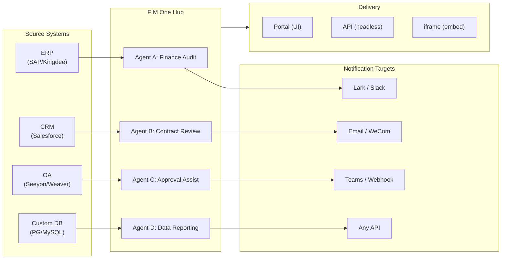

> Goal: Build an **AI-powered Connector Hub** — Standalone (portal assistant), Copilot (embedded in host system), Hub (central cross-system orchestration).
>
> Principles: **Provider-agnostic** (no vendor lock-in), **minimal-abstraction**, **protocol-first**, **connector-first** (integration is the core value).

## 製品ビジョン

FIM One は、3つの段階的なモードで機能する **AI コネクタハブ** です：

```
Standalone   → 独自の AI アシスタント (Portal)
Copilot      → ホストシステムに組み込まれた AI (iframe / widget / embed)
Hub          → 中央クロスシステムオーケストレーション (Portal / API)
```

**Hub モードが主要な差別化要因です。** エンタープライズクライアントは、ERP、CRM、OA、財務、HR などのレガシーシステムを持っており、これらが AI を通じて相互に通信する必要があります：



**GTM パス：ランド・アンド・エクスパンド**

| ステップ | モード | 実行内容 |
|------|------|-------------|
| Land | Copilot | 1つのシステムに組み込み、UI 内で価値を実証 |
| Expand | Copilot → Hub | より多くのシステムにロールアウト；Hub がそれらを集約 |

## 出荷済みバージョン

### v0.1 (2026-02-22) — MVP: ReAct + DAG Planner
- ReActAgent with tools (calculator, python_exec, web_search)
- DAG Planner (LLM generates dependency graphs)
- Portal UI with streaming + KaTeX

### v0.2 (2026-02-24) — マルチモデル + メモリ
- リトライ / レート制限 / 使用状況追跡
- ネイティブ関数呼び出し (JSON のみの解析なし)
- マルチモデルサポート (高速 + メイン LLM)
- メモリ: WindowMemory、SummaryMemory
- FastAPI バックエンド SSE ストリーミング付き

### v0.3 (2026-02-25) — Web Tools + MCP
- Web tools (web_search, web_fetch) via Jina/Tavily/Brave
- File operations tool
- MCP client (standard tool integration)
- Tool auto-discovery + categories
- DAG visualization with click-to-scroll
- Code exec in Docker (`--network=none`)

### v0.4 (2026-02-25) — マルチターン + エージェント
- マルチターン会話 (DbMemory)
- ツールステップ折りたたみUI
- HTTPリクエスト + シェル実行ツール
- エージェント管理 (作成、設定、公開)
- JWT認証
- エージェント単位の実行モード + 温度制御

### v0.5 (2026-02-28) — Full RAG + Grounded Gen
- Full RAG パイプライン (embedding + vector store + FTS + RRF + reranker)
- Grounded Generation (引用、信頼度スコア)
- ナレッジベース ドキュメント管理 (CRUD、検索、再試行、スキーマ移行)
- ContextGuard + ピン留めメッセージ (トークン予算マネージャー)
- DbMemory 永続化 + LLM Compact
- DAG 再計画 (最大3ラウンド)

### v0.6 (2026-03-01) — コネクタプラットフォーム
- **コネクタ CRUD**: 作成、読み取り、更新、削除
- **ConnectorToolAdapter**: コネクタ → BaseToolに変換
- **ユーザーごとの認証情報**: AES-GCM暗号化
- **確認ゲート**: 書き込み操作の承認
- **監査ログ**: すべてのツール呼び出しを記録
- **サーキットブレーカー**: 障害時の段階的な機能低下
- **ユーティリティツール**: email_send、json_transform、template_render、text_utils
- **埋め込みオプション**: Jina、OpenAI、カスタムプロバイダー

### v0.7 (2026-03-06) — 管理プラットフォーム + マルチテナント
- **管理プラットフォーム**: ユーザー管理、ロール切り替え、パスワードリセット、アカウント有効化/無効化
- **招待制登録**: 3つのモード (オープン/招待/無効) + 招待コード CRUD
- **ストレージ管理**: ユーザーごとのディスク使用量、クリア、孤立ファイルのクリーンアップ
- **会話モデレーション**: 管理者による一覧表示/削除
- **ユーザーごとの強制ログアウト**: すべてのトークンを無効化
- **API ヘルスダッシュボード**: システム統計、コネクタメトリクス
- **初回セットアップウィザード**: ガイド付き管理者アカウント作成
- **個人センター**: ユーザーごとのグローバル指示、言語設定
- **JWT 認証**: トークンベースの SSE 認証、会話の所有権
- **グローバル MCP サーバー**: 管理者がプロビジョニング、すべてのセッションで読み込み
- **後方互換性**: registration_enabled → registration_mode 自動マイグレーション

### v0.7.x (2026-03-07 to 2026-03-12) — 安定性 + ポーランド
- 招待コード管理
- ユーザーごとのクォータ (429 強制)
- 構造化監査ログ
- 機密ワードフィルタリング
- 管理者ログイン履歴
- 管理者ファイルブラウザ
- 強化された管理者ビュー (model_name、tools、kb_ids フィールド)
- Docker Compose デプロイメント (単一イメージ、名前付きボリューム)
- OAuth 自動検出 (window.location から)
- 拡張思考 / 推論サポート (`LLM_REASONING_EFFORT`、`LLM_REASONING_BUDGET_TOKENS`) OpenAI o シリーズ、Gemini 2.5+、Claude 向け
- 管理者ツール単位の有効/無効切り替え (無効なツールはチャット実行時に除外)
- MCP サーバー管理をコネクタページに移動
- デュアルデータベースサポート: SQLite (ゼロコンフィグデフォルト) + PostgreSQL (本番環境); Docker Compose は自動的に PostgreSQL をプロビジョニング
- モデル設定ドキュメントページ (プロバイダーごとの拡張思考セットアップ)
- SSE Protocol v2: リアルタイム回答ストリーミング (`delta_reasoning`、`usage` フィールド、および分割 `done`/`suggestions`/`title`/`end` イベント); SQLite プール サイズ 5 -> 20
- AI Builder 拡張: 7 つの新しいビルダーツール (GetSettings、TestConnection、ImportOpenAPI (コネクタ向け); ListConnectors、AddConnector、RemoveConnector、SetModel (エージェント向け))、エージェント上の `is_builder` フラグ、ビルダープロンプト自動更新、SSRF ガード
- SSE v2 フロントエンド: ストリーミングドットパルスカーソル、DAG 再計画ラウンドスナップショット (折りたたみ可能なカード)、DAG レイアウトをステップ状態から分離
- AI Builder コンセプトドキュメントページ (コネクタおよびエージェントビルダーガイド)
- 組織システム: 完全な CRUD (ロールベースのメンバーシップ: オーナー/管理者/メンバー)、管理者管理 UI
- 3 段階のリソース可視性 (個人/組織/グローバル) エージェント、コネクタ、ナレッジベース、MCP サーバー向け
- すべてのリソースタイプの公開/非公開 API; 公開エージェントのオーナー委譲
- 管理者設定可視性エンドポイント (クローン・トゥ・グローバルを置き換え); 統一された `build_visibility_filter()` クエリヘルパー
- データベースコネクタ (フェーズ 1-3): PG/MySQL/Oracle/SQL Server + 中国レガシー DB への直接 SQL アクセス; スキーマ内省、AI アノテーション、読み取り専用クエリ実行、暗号化された認証情報、コネクタごと 3 つのツール (`list_tables`、`describe_table`、`query`)
- **評価センター**: 定量的なエージェント品質ベンチマーク — テストデータセット CRUD (プロンプト + 期待される動作 + アサーション)、評価実行 (並列実行 + LLM グレーダー + ケースごとの合格/不合格/レイテンシ/トークン結果)、自動ポーリング付き結果ビューア; マイグレーション `r8t0v2x4z567`
- 3 つのモデルロール (General/Fast/Reasoning) (ティアごとの env コンフィグ分離); 高速モデルはメインモデル設定を継承しない
- `StepOutput` データクラス (構造化データとアーティファクト渡し用の通常文字列ステップ結果を置き換え)
- DAG 実行用ツールキャッシュ — 実行ごとの同一ツール呼び出しキャッシュ (非同期ロック スタンピード防止付き) (`DAG_TOOL_CACHE`)
- ステップごとの LLM 検証 (失敗時 1 回の再試行) (`DAG_STEP_VERIFICATION`)
- 自動ルーティング: 高速 LLM がクエリを ReAct または DAG として分類; `/api/auto` エンドポイント; フロントエンド 3 方向モード切り替え (`AUTO_ROUTING`)
- [x] ~~**Shadow Market Organization + Resource Subscriptions**~~: 組み込み Market org (shadow、自動参加なし) は Platform org を置き換え; マーケットプレイスブラウジングおよび明示的なサブスクリプション経由でリソースを発見 (プルモデル); Market API (共有リソースへのサブスクリプション); Market への公開は常にレビューが必要; リソースサブスクリプションテーブル; グローバル可視性を置き換える org ベースのリソース共有
- [x] ~~**Agent Auto-discovery and Sub-agent Binding**~~: エージェント上の `discoverable` フラグ; `sub_agent_ids` ホワイトリスト; CallAgentTool (タスクを専門エージェントに委譲)
- [x] ~~**MCP Server Credentials + Per-User Override**~~: `mcp_server_credentials` テーブル; `PUT /api/mcp-servers/{id}/my-credentials` エンドポイント; 認証情報フォールバック動作用の `allow_fallback` フラグ
- [x] ~~**Connector/KB Toggle**~~: `POST /api/connectors/{id}/toggle` および `POST /api/knowledge-bases/{id}/toggle` (リソースの一時停止/再開)
- [x] ~~**Standalone KB Conversations**~~: 会話上の `kb_ids` フィールド (エージェントバインディングなしの直接 KB チャット)

### v0.8 (2026-03-20) — コネクタ宣言型設定 + 段階的情報開示
- [x] **データベースコネクタ**: 直接SQL アクセス (PostgreSQL、MySQL、Oracle) *(v0.7.x で提供 — フェーズ 1-3)*
- [x] **RBAC**: ユーザー/ロール単位のコネクタアクセス制御 *(v0.7.x で提供 — 組織システム + 3 段階の可視性)*
- [x] **コネクタ認証情報暗号化 + ユーザー単位のオーバーライド**: `connector_credentials` テーブル、`CREDENTIAL_ENCRYPTION_KEY` 経由の Fernet 暗号化、`allow_fallback` フラグ、`GET/PUT/DELETE /my-credentials` エンドポイント、チャットツール読み込み時のユーザー単位の認証情報解決
- [x] **公開レビュー UI**: 組織レベルの公開レビューシステム — 組織ごとのレビュー切り替え、承認/却下ワークフロー付き ReviewsSheet、リソースカードのステータスバッジ、公開ダイアログのレビュー通知、却下されたリソースの再送信
- [x] **コネクタ段階的情報開示 (フェーズ 1-2)**: 単一の `ConnectorMetaTool` がアクション単位のツールに置き換わり、システムプロンプトは軽量な**スタブ**のみを受け取ります (名前 + 1 行説明、コネクタあたり約 30 トークン vs アクションあたり約 250 トークン)。エージェントが `discover(connector)` を呼び出して、完全なアクションスキーマをオンデマンドで読み込みます — スキーマはモデルがコネクタを選択した場合のみ読み込まれ、プロンプトプレフィックスをキャッシング用に安定に保ちます。Claude Code の `defer_loading: true` 内部パターンをミラーリングします。`execute` サブコマンド、後方互換性のための機能フラグ。
- [x] **エージェントスキルシステム + コンパクト指示**: エージェント指示のオンデマンドスキル読み込み — `Skill` モデル (名前、コンテンツ/SOP、オプションのスクリプト) がエージェントに添付されます。システムプロンプトでは名前のみで参照されます (スキルあたり約 10 トークン)。エージェントが `read_skill(name)` を呼び出して、完全なコンテンツをオンデマンドで読み込みます。会話単位の指示トークンコストを約 80% 削減しながら、より豊富な SOP ライブラリを実現します。ConnectorMetaTool の段階的情報開示と同等の指示レベルでの対応。「指示 + ツール + スキル」の差別化ストーリーを実現します。また、Agent モデルに `compact_instructions` フィールドを追加します — エージェント単位の圧縮優先度リストが圧縮時に `ContextGuard` に注入されます (例: 「注文 ID と金額を保持し、生の API レスポンスを削除」)。現在の静的な汎用プロンプトに置き換わります。Claude Code の Compact Instructions パターンに着想を得ています。
- [x] **コネクタのインポート/エクスポート**: コネクタテンプレートの共有
- [x] **コネクタのフォーク**: 既存コネクタのクローンとカスタマイズ
- [x] **ワークフロー フェーズ 2 ノード**: Iterator、Loop、VariableAggregator、ParameterExtractor、ListOperation、Transform、DocumentExtractor、QuestionUnderstanding、HumanIntervention — 9 つの高度なノードタイプ、フルフロントエンド + バックエンド + 150 の新しいテスト (合計 275)。ノード再試行と指数バックオフ、安全な式評価。成功率バー付きの統計パネル。12 個の組み込みテンプレート。ペーンコンテキストメニュー (貼り付け、すべて選択、ビューに合わせる、自動レイアウト)。
- [x] **ワークフロー フェーズ 3 ノード: SubWorkflow + ENV** — 2 つの新しいノードタイプ (合計 25 ノード)、14 の新しいテスト (合計 306)、14 個の組み込みテンプレート。SubWorkflow: ターゲットワークフロー選択、変数マッピング、無限再帰を防ぐための設定可能な深さ制限を備えた、完全な DB バックアップ ネストワークフロー実行器。ENV: キーピッカーとフォールバックデフォルト付きの暗号化環境変数を読み込みます。フルフロントエンド (ノードコンポーネント、設定パネル、パレットエントリ、ミニマップの色)。ノード単位の実行統計パネル (成功率、期間、失敗数を最悪順でソート)。`getNodeStats` API クライアント + `NodeStatEntry` タイプ。キーボードショートカットダイアログ (`?` キー)。
- [x] **ワークフロー スケジュール トリガー**: タイムゾーン、デフォルト入力、次実行時刻計算を備えたワークフロー単位の cron 設定。プリセット cron ボタン、30 個のトリガーテスト。
- [x] **ワークフロー API トリガー**: ユーザー認証なしで外部実行用の公開ワークフロー単位の API キー (`wf_` プレフィックス)、レート制限付き。API キー管理ダイアログ (生成/再生成/取り消し、トリガー URL、cURL/JS の例)。
- [x] **ワークフロー バッチ実行**: 最大 100 個の入力セット、設定可能な並列処理 (1-10)、折りたたみ可能なアイテム単位の結果、JSON エクスポート付きの `POST /batch-run`。14 個のバッチ実行テスト。
- [x] **ワークフロー実行ログビューアー**: 実行パネルのタイムスタンプ、色分けされたバッジ、イベントタイプフィルタ切り替え付きのリアルタイム時系列 SSE イベントストリーム。
- [x] **ワークフロー実行統計**: バックエンド GROUP BY サブクエリ経由のバッチ実行数と成功率取得、ワークフローカードの統計表示と色分けされた成功率インジケーター。
- [x] **ワークフロー スケジューラ デーモン**: 60 秒ごとに期限切れの cron ベースワークフローをポーリングするバックグラウンド非同期サービス。Croniter タイムゾーンサポート、セマフォ並列処理、`last_scheduled_at` トラッキング、webhook 配信。14 個のテスト。
- [x] **ワークフロー インポート コンフリクト リゾルバー**: インポート中に未解決のエージェント/コネクタ/KB/MCP 参照を検出します。可視性フィルタリング付きのバッチ DB クエリ、フロントエンド toast 警告。17 個のテスト。
- [x] **ワークフロー テスト-ノード実行**: モック変数を使用した分離されたシングルノードテスト、エディターに統合 (設定パネル Test ボタン + コンテキストメニュー)。23 個のテスト。
- [x] **ワークフロー バージョン差分**: ノード/エッジ変更検出を備えたサイドバイサイドブループリント比較、色分けされたインジケーター (追加/削除/変更)。
- [x] **ワークフロー実行管理**: 個別実行の削除 (`DELETE /runs/{run_id}`) と完了した実行すべてのクリア (`DELETE /runs`)、フロントエンド確認ダイアログ付き。
- [x] **ワークフロー実行リプレイオーバーレイ**: 実行履歴の「キャンバスで表示」ボタンで、キャンバス上に過去の実行結果をオーバーレイし、ノード単位のステータスと出力を表示します (再実行なし)。
- [x] **ワークフロー お気に入り/ピン留め**: ワークフローにスター/ピン留めしてリストの上部に固定、localStorage 永続化。
- [x] **ワークフロー実行履歴エクスポート**: 完全な実行メタデータとノード単位の結果を含む JSON ファイルダウンロードとして実行履歴をエクスポート。
- [x] **管理者ワークフロー管理**: ユーザー全体のワークフロー管理用の管理パネルタブ — リスト、アクティブ/非アクティブ切り替え、確認付き削除。削除、切り替え、公開用のバッチエンドポイント、監査ログ付き。
- [x] **ワークフロー テンプレート システム**: 管理者 CRUD、公開リスト/クローン API、初回起動時に自動挿入される 5 個のシードテンプレート付きの `WorkflowTemplate` ORM モデル。
- [x] **ワークフロー インライン検証バッジ**: キャンバス上のノード単位の `ValidationBadge` リアルタイム、エラー/警告ツールチップ付きで編集中の即座の視覚的フィードバック。
- [x] **ワークフロー実行トレースビューアー**: エンジン `trace_level` パラメータとノード単位の変数スナップショット付きのタイムラインベースのトレースビューアー Sheet (ステップスルーデバッグ用)。
- [x] **ワークフロー レート制限とタイムアウト**: ユーザー単位の `WorkflowRateLimiter` (スライディングウィンドウ 10 実行/分、3 並列) とデフォルト 10 分のグローバル実行タイムアウト。
- [x] **ワークフロー ブループリント システム**: マルチステップ自動化ブループリント設計・実行用のビジュアルワークフローエディター — `Workflow` / `WorkflowRun` ORM モデル、フル CRUD + SSE 実行 API、インポート/エクスポート、複製、ブループリント検証エンドポイント、トポロジカルソート + セマフォベースの並列処理 + 条件分岐と 12 ノードタイプ (Start、End、LLM、ConditionBranch、QuestionClassifier、Agent、KnowledgeRetrieval、Connector、HTTPRequest、VariableAssign、TemplateTransform、CodeExecution) 付きの `WorkflowEngine`、`{{node_id.output}}` 補間と `env.*` 名前空間付きの `VariableStore`、ノード単位のエラー戦略 (STOP_WORKFLOW / CONTINUE / FAIL_BRANCH)、ノード単位のタイムアウトと高度な設定 UI、ドラッグアンドドロップパレット + ノード設定パネル + 変数ピッカーコンボボックス + エッジ上のノード追加 + 自動レイアウト (ELK.js) + 実行履歴 sheet 付き React Flow v12 ビジュアルエディター、リングベースの実行ステータススタイリングとアニメーション化されたエッジトランジション付きの Dify スタイルコンパクトノード設計、テンプレートピッカーダイアログと `GET /templates` + `POST /from-template` API 付きの 4 個の組み込みスターターテンプレート (Simple LLM Chain、Conditional Router、Knowledge-Augmented QA、HTTP API Pipeline)、統計エンドポイント、`?run=true` URL パラメータ自動オープン、サブプロセスベースのコード実行セキュリティ、105 テストスイート (テンプレート、eval 名前空間フラット化、ブループリント検証警告、ノード/エッジ削除、インポート/エクスポート/複製、デッドロック検出、マルチ条件分岐)
- [x] **操作監査**: 詳細なログ記録 (誰が何をしたか) — 管理者レビューログ監査タブ追加 (組織/リソース単位の公開レビュー追跡)
- [x] **セマンティック スキーマ アノテーション**: `semantic_tag`、`description`、`pii` フラグでコネクタスキーマフィールドを拡張。アノテーションは LLM ツール説明に表示されるため、エージェントは列名から推測することなくフィールドの意図を理解できます

### v0.8.1 (2026-03-29) — プログレッシブディスクロージャー成熟度 + ReAct強化
- DBコネクタ（`DatabaseMetaTool`）、MCPサーバー（`MCPServerMetaTool`）、オンデマンドツール読み込み（`request_tools`メタツール）のプログレッシブディスクロージャー
- DAG品質全面改善（5つの改善：モデルアップグレード、スキル自動検出、引用検証者、構造化コンテンツ保持、ドメイン認識ルーティング）
- ReActでのドメインモデルエスカレーション（専門ドメインが推論モデルに自動エスカレート）
- モデルごとのネイティブ関数呼び出しトグル（`tool_choice_enabled`）
- ReActサイクル検出（決定論的重複ツール呼び出し防止）
- ReAct完了チェックリスト（ツール使用時の事前回答検証）
- リソースフォークフェーズ1（系統追跡付きMCPサーバー + スキルフォークエンドポイント）
- ワークフロー接続依存関係自動購読（再帰的サブワークフロー依存関係解決）
- プリビルトソリューションテンプレート（初回登録時にマーケットに8つの業界別ソリューションをシード）
- 管理者通知改善（タイムゾーン対応、マスタースイッチ、SMTP Reply-To）
- ターンごとのトークン予算サーキットブレーカー（`REACT_MAX_TURN_TOKENS`）
- 一元化されたツール切り詰め、動的システムプロンプト予算配分
- ファイル添付ダウンロード、重複メッセージ送信修正

### v0.8.2 (2026-04-10) — 智能体コア強化 + ビジョンドキュメント
- **智能体コアフェーズ 0** — コンパクト提示词を9セクション構造化フォーマットにアップグレード; 空のツール結果保護（`(no output)` の代わりに説明的なメッセージ）; アンチループ提示词 + サイクル検出閾値を2に低下; ドメイン分類器 + プリフライトDB設定解決を並列化（リクエストあたり400～1100 ms削減）; SSE `end` イベントを回答直後に送信、タイトル/提案をバックグラウンドタスクに移動
- **智能体コアフェーズ 1（コンテキストアンチブロート）** — `MicroCompact` ルールベースの古いツール結果クリーンアップ（最後の6つを保持）; `REACT_TOOL_RESULT_BUDGET=40000` 集計上限; コンテキストオーバーフロー時のリアクティブコンパクト（予算の50%に自動コンパクトして再試行、クラッシュの代わりに）
- **智能体コアフェーズ 2（速度）** — キーワードベースのツールプリセレクション（明らかなマッチでLLM呼び出しをスキップ、200～500 ms削減）; `SharedHttpClient` LLM接続プーリング; 200トークン以上の回答では完了チェックをスキップ; `FallbackLLM` はプライマリ+高速をラップし、429/503/529/接続エラーで自動フェイルオーバー
- **インテリジェントドキュメント処理（ビジョン対応）** — 適応的なドキュメント処理: PDFページはビジョン対応モデル（GPT-4o、Claude 3/4、Gemini）向けにPyMuPDFで画像としてレンダリング、テキストのみフォールバックはpdfplumberで実行。モデルごとの `supports_vision` フラグ。`DOCUMENT_PROCESSING_MODE`、`DOCUMENT_VISION_DPI`、`DOCUMENT_VISION_MAX_PAGES` 経由のモード。DOCX/PPTX埋め込み画像抽出。会話ターン全体でのマルチターンビジョン永続化。スマートPDF処理（テキストリッチページはテキスト+画像を抽出; スキャンページはフルページPNGとしてレンダリング）。`--network=none` コード実行用の一般的なデータサイエンスパッケージを備えた事前構築サンドボックスイメージ（`Dockerfile.sandbox`）
- **リソースフォーク完了** — 智能体 / コネクタ / ワークフローフォークエンドポイントを追加、5タイプ系統追跡を完了（KBフォークは削除 — 本質的にユーザーローカル）
- **ファイル整合性ガードレール** — システム提示词ルールは、ターゲットファイルが読み取り不可の場合、智能体が無関係なファイルコンテンツを代替することを防止; アップロードされたファイルにはメッセージコンテキストに `file_id` が含まれ、直接 `read_uploaded_file` アクセス用

### v0.8.3 (2026-04-16) — ユニバーサルドキュメント変換 + エージェントコア フェーズ 3
- **ユニバーサルドキュメント変換（`convert_to_markdown` + OCR）** — Microsoft MarkItDownをラップした組み込みエージェントツール。PDF、Word、Excel、PowerPoint、HTML、JSON、CSV、XML、ZIP、EPUB、Outlook .msg、画像、オーディオ、YouTube URLをMarkdownに変換します。`LiteLLMOpenAIShim`は任意のビジョン対応LLM（Claude、Gemini、Bedrock、Azure）経由でOCRを有効にします。ビジョン対応RAG取り込みとゼロリグレッションのテキストのみフォールバック。`LLM_SUPPORTS_VISION`環境変数でオプトアウト可能
- **エージェントコア フェーズ 3（ランタイム不変性の強化）** — 会話復旧（ぶら下がり`tool_use`の自動修復）；構造化コンパクト作業カード（圧縮ラウンド全体での型付き`WorkCard`マージ）；ターンレベルプロファイラー（`REACT_TURN_PROFILE_ENABLED`）；ユーザーごとのレート制限（`LLM_RATE_LIMIT_PER_USER`）；`tool_calls`を含む空のコンテンツアシスタントメッセージは削除されなくなりました

## 計画されているバージョン

### v0.9 — 可観測性 + 本番環境対応

**目標**: 本番環境グレードの運用、デバッグ、監視。**フックシステム**を導入 — エージェント命令の下に位置する決定論的な強制レイヤーで、LLMによってオーバーライドできません。

- [ ] **コネクタ段階的開示（フェーズ3-4）**: 統一された`ConnectorExecutor`インターフェース（API/DB/MCPを1つの抽象化の背後に）; `jsonschema`によるアクションパラメータ検証; プロトコル非依存の検出/実行
- [ ] **YAML/JSONコネクタ設定**: プラットフォームが自動生成するMCPサーバー
- [ ] **データベースコネクタ フェーズ4**: エンタープライズドライバー — Oracle (`oracledb`)、SQL Server (`aioodbc`)、達梦 DM8 (`aioodbc` + DM ODBC)、南大通用 GBase (`aioodbc` + GBase ODBC)
- [ ] **IMチャネル統合（双方向）**: **フェーズ1 — アウトバウンドプッシュ**: Lark、WeCom、Slack、Email、Teamsの通知アクション（エージェント/ワークフロー結果から）。**フェーズ2 — インバウンドトリガー**: ユーザーがIMグループチャットでエージェントに@メンションしてPortalを開かずにタスクをトリガー; チャネルごとのwebhookレシーバー; 各IMチャネルを双方向アクション（送信+受信）を持つコネクタとしてモデル化。ハブモードのキラーフィーチャー

#### パブリックAPI（フェーズ2）

フェーズ1（リリース済み）：APIキー認証ミドルウェア、スコープサポート、キュレーション済みOpenAPI仕様、インタラクティブプレイグラウンド付きMintlify APIリファレンス。

- [ ] **キーごとのレート制限** — APIキーごとに設定可能なリクエスト/分およびリクエスト/日の制限；`X-RateLimit-*`ヘッダー付きの`429 Too Many Requests`レスポンス
- [ ] **キーごとの使用量クォータ** — 月間トークン/リクエスト予算、管理ダッシュボード、閾値アラート
- [ ] **エンドポイントごとのスコープ強制** — すべての保護されたエンドポイントに`require_scope("chat")`依存性；`scopes=chat`を持つキーはチャット関連APIのみにアクセス可能
- [ ] **APIバージョニング**（`/v1/...`） — 安定したバージョン付きAPIコントラクト；サンセットエンドポイント用の廃止予定ヘッダー
- [ ] **Webhookコールバック** — APIキーごとにWebhook URLを登録；会話完了、エージェントエラー、非同期タスク結果のPOSト通知を受信
- [ ] **SDK生成** — OpenAPI仕様から自動生成されたPythonおよびTypeScriptクライアントSDK；PyPIおよびnpmに公開
- [ ] **デベロッパーポータル** — Mintlifyドキュメント内のインタラクティブな「試す」パネル；キー所有者に表示される使用分析
- [ ] **APIキーローテーション** — ワンクリックキーローテーション、グレースピリオド付き（ローテーション後24時間は古いキーが有効）
- [ ] **バッチ/非同期API** — 最大100クエリを受け入れる`POST /api/batch`；結果をポーリングするための`batch_id`を返す；KB一括クエリまたはマルチエージェントオーケストレーションに有用
- [ ] **外部依存関係ごとのサーキットブレーカー** — ダウンストリームLLMプロバイダーまたはコネクタが利用できない場合のカスケード障害を防止；自動フォールバックと復旧

#### 可観測性とエージェント ランタイム

- [ ] **Agent Trace Layer (Observability++)**: アプリケーション レベルの run/trace/thread 階層でエージェント デバッグ用 — 各会話 → `Trace`、各 LLM 呼び出し / ツール呼び出し / DAG ステップ → input/output/tokens/timing を含む `Span`。タイムラインと展開可能な LLM 呼び出しペイロードを備えたフロントエンド trace ビューアー。これは OTel (インフラストラクチャ レベル) を超えて、開発者とエンタープライズ クライアント向けの実用的なエージェント ループ デバッグを提供します。OpenTelemetry エクスポートをデータ シンク オプションとして使用可能。LangSmith の run/trace/thread コンセプトに基づいてモデル化 — エージェント可観測性の業界検証済みパターン。
- [ ] **Metrics ダッシュボード**: レイテンシ、成功率、token 使用量、コネクタ呼び出し分析 — エージェント別、ユーザー別、組織別の内訳
- [x] ~~**Circuit breaker**: 3 状態マシン (closed/open/half-open) で、コネクタごとの障害追跡、5xx 検出、監視エンドポイント~~ *(v0.8 で早期出荷 — 実装済み)*
- [x] ~~**Workflow run retention cleanup**: 設定可能な最大経過時間と workflow ごとの最大数を持つバックグラウンド クリーンアップ タスク; workflow ごとのオーバーライド; 手動トリガー用の管理エンドポイント~~ *(v0.8.1 で出荷)*
- [x] ~~**Workflow version change summaries**: `compute_blueprint_diff()` は blueprint diff からバージョン保存時に人間が読める要約を自動生成~~ *(v0.8.1 で出荷)*
- [x] ~~**DAG quality overhaul**: 非高速ステップ向けのデフォルト モデル アップグレード; planning での skill 自動検出; 法務/医療/金融ドメイン向けの citation verifier; 構造化コンテンツ コンテキスト保持; router でのドメイン分類とドメイン対応モデル選択~~ *(v0.8.1 で出荷)*
- [x] ~~**ReAct でのドメイン モデル エスカレーション**: 専門ドメインは推理モデルに自動エスカレーション、必須の web 検索と citation 検証~~ *(v0.8.1 で出荷)*
- [x] ~~**Per-model Native Function Calling toggle**: `tool_choice_enabled` 設定により、モデルは強制ツール選択をスキップして JSON Mode に直接移行可能~~ *(v0.8.1 で出荷)*
- [x] ~~**DatabaseMetaTool (DB コネクタの段階的開示)**: 3N 個の個別ツールを置き換える `list_tables`/`discover`/`query` サブコマンド付きの単一 `database` メタ ツール; `DATABASE_TOOL_MODE` env var (`progressive` デフォルト、`legacy` フォールバック) で設定可能~~ *(v0.8.1 で出荷)*
- [x] ~~**`request_tools` メタ ツール経由のオンデマンド ツール ロード**: スマート選択後に >12 個のツールが利用可能な場合、LLM は会話中に動的に追加ツールをロード可能; JSON と native function-calling の両方のモードで動作~~ *(v0.8.1 で出荷)*
- [x] ~~**MCPServerMetaTool (MCP の段階的開示)**: N*M 個の個別 MCP ツールを置き換える `discover`/`call` サブコマンド付きの単一 `mcp` メタ ツール; `MCP_TOOL_MODE` env var (`progressive` デフォルト、`legacy` フォールバック) で設定可能~~ *(v0.8.1 で出荷)*
- [x] ~~**Workflow Connection Dep Auto-Subscribe**: Market subscription cascade を Workflow の接続依存関係 (API Connectors、MCP Servers) に自動サブスクライブするように拡張。Workflow ノードは Connectors、MCP Servers、Agents (さらに多くの依存関係を再帰的に参照)、および sub-Workflows を参照可能 — 完全なツリー内のすべての接続 deps は subscribe 時に自動サブスクライブされ、unsubscribe 時にカスケード クリーンアップされる必要があります。サイクル検出を伴う再帰的な sub-workflow 解決により、Skill/Agent より複雑。Solution (Skill/Agent) connection dep auto-subscribe のカウンターパート~~ *(v0.8.1 で出荷)*
- [x] ~~**Workflow real executors**: MCP と BuiltinTool ノード executor スタブを完全な実装に置き換え (MCP サーバー検出 + ツール呼び出し; ToolRegistry 統合)~~ *(v0.8.1 で出荷)*
- [ ] **Agent Hook System**: **LLM ループの外側で実行される**決定論的な強制レイヤー — hooks はツール イベント時に自動実行され、エージェント命令によってバイパスできません。3 つの hook ポイント: `PreToolUse` (実行前に検証 / ブロック)、`PostToolUse` (実行後の副作用)、`SessionStart` (動的コンテキストを注入)。組み込み hooks: すべてのコネクタ呼び出しで自動的に `ConnectorCallLog` を書き込み (現在は手動); 組織が読み取り専用モードの場合、書き込み操作をブロック; 超大型 DB クエリ結果をエージェントに到達する前に自動切り詰め; コネクタごとの呼び出し頻度をレート制限。ユーザー定義 hooks: マッチング ツール イベント時にトリガーされるシェル コマンドまたは Python callables を宣言する agent ごとの YAML 設定 (`hooks:` フィールド) — Claude Code の hooks と同じパターン。主要な設計原則: **hooks は LLM がそれを実行することを記憶に頼るべきではない「必ず発生する」ロジック用**。命令は「すべての呼び出しを記録」と言う; hooks は実際に記録する。命令は「読み取り専用モードで書き込まない」と言う; hooks は実際にそれをブロックする。
- [ ] **Agent Workspace (永続的なエージェント デスクトップ)**: 3 つのレイヤー: (1) **Tool Output Offloading** — 超大型ツール応答 (>8K 文字) を `workspace://` ファイルに自動保存、切り詰められたプレビュー + URI を返す; 選択的アクセスとエージェント生成アーティファクト用の組み込み tools `read_workspace_file`、`list_workspace_files`、`write_workspace_file`。(2) **Handoff Notes** — 圧縮/セッション切り替え全体でのコンテキスト遷移用の `write_handoff(summary)`。(3) **Workspace UI** — 会話ごとのフロントエンド ファイル ブラウザ パネル (テキスト/JSON/CSV プレビュー、ダウンロード、削除/名前変更); クロス セッション ファイル保持; ユーザーごとのストレージ クォータ統合。adapters の `truncate_tool_output()` + `GET /api/conversations/{id}/workspace` エンドポイントを拡張
- [x] **Smart File Content Injection + `read_uploaded_file` tool**: 小さいアップロード ファイル (`<32K` 文字) は LLM コンテキストに自動インライン化; 大きいファイルはメタデータ + tool ヒントを取得。ページング読み取り + regex 検索の dual-mode `read_uploaded_file` tool。`GET /api/files/{file_id}/content` エンドポイント、`.content` sidecar ストレージ、ファイル API レスポンスの `content_length`
- [x] ~~**Intelligent Document Processing (Vision-Aware)**: 適応的なドキュメント処理 — PDF ページは vision 対応モデル (GPT-4o、Claude 3/4、Gemini) 用に PyMuPDF 経由で画像としてレンダリング; text-only フォールバックは pdfplumber 経由。Admin の per-model `supports_vision` フラグ。`DOCUMENT_PROCESSING_MODE` env var で設定可能な 2 つのモード (vision/text)。スマート PDF 処理: text-rich ページはテキスト + 埋め込み画像を抽出 (token 効率的)、スキャン ページは full-page PNG としてレンダリング。DOCX/PPTX 埋め込み画像抽出。マルチターン vision 永続化。事前構築サンドボックス イメージ (`Dockerfile.sandbox`)。`.pages/` sidecar でキャッシュされたページ レンダリング。~~ *(v0.8.2 で出荷)*
- [x] ~~**Universal Document Conversion (`convert_to_markdown` + OCR)** — Microsoft MarkItDown をラップする組み込み Agent tool、すべてのエージェントでデフォルトで利用可能。PDF、Word、Excel、PowerPoint、HTML、JSON、CSV、XML、ZIP、EPUB、Outlook .msg、画像、オーディオ、YouTube URL、およびデータ URI を会話内でクリーン Markdown に変換。Office ファイルとスキャン PDF ページの埋め込み画像は、ワークスペースの vision 対応 LLM (DB ファースト、ENV フォールバック) を使用して公式 `markitdown-ocr` プラグイン経由で自動的に OCR 処理されます。同じ変換カーネルは RAG ingestion パイプラインで共有されるため、chat-time 変換と knowledge-base ingestion はバイト同一の Markdown を生成します。非 OpenAI プロバイダー (Claude、Gemini、Bedrock、Azure) は、任意の FIM One LLM を openai-SDK 形状のクライアントとして提示し、LiteLLM 経由でルーティングする `LiteLLMOpenAIShim` 経由で透過的にサポートされます。ゼロ リグレッション フォールバック: vision モデルが利用できない場合、text-only 抽出は以前と全く同じように続行されます。~~ *(v0.8.3 で出荷)*
- [ ] **Cross-session file management**: ファイル ブラウザ UI、ストレージ クォータ、自動有効期限切れ クリーンアップ
- [ ] **Session-level file associations**: どのファイルがどの会話で使用されたかを追跡
- [ ] **Cross-session conversation recall**: 過去の会話履歴をリスト、検索、読み取るエージェント tools — `list_conversations`、`search_conversations` (履歴全体でのキーワード/regex)、`read_conversation` (完全なスレッドを取得)。「前回何を議論したか」と「先週尋ねた API 変更を見つける」ワークフローを有効にします。cross-session file management と組み合わせて、完全な長期エージェント メモリ レイヤーを形成
- [ ] **Sandbox hardening**: コード実行分離への v2 改善
- [ ] **Performance testing**: 同時負荷ベンチマーク
- [ ] **MCP Connection Pooling**: per-request STDIO subprocess spawning はスケーリングしない — 100 同時ユーザー = MCP サーバーごとに 100 サブプロセス。STDIO 接続を per-user env 分離でプール化 (`(server_id, env_hash)` でキー化); SSE/HTTP トランスポートは `httpx.AsyncClient` セッションを共有。目標: プール化 STDIO の `≤100 ms` warm-start、ユーザー数に関わらず MCP サーバーごとの O(1) HTTP 接続
- [ ] **Internal Harness Benchmark** — EVAL CENTER インフラストラクチャを使用して harness パラメータ変更 (system prompt、self-reflection 頻度、tool selection threshold) の定量化用の組み込みテスト スイート
- [x] ~~**ReAct Cycle Detection** — LLM self-awareness に依存しない設定可能なしきい値を備えた決定論的な重複ツール呼び出し検出; エージェント ループを防止~~ *(v0.8.1 で出荷)*
- [x] ~~**ReAct Completion Checklist** — ツールが使用された場合の 1 回限りの事前回答検証プロンプト; 早すぎる結論を削減~~ *(v0.8.1 で出荷)*
- [x] ~~**Agent Core Phase 3 — Runtime Invariant Hardening**: CC のランタイム不変量に対応する 4 つのバグ修正 / 可観測性アップグレード — (I.14) Conversation Recovery: `DbMemory.get_messages()` の中断されたターンからの dangling `tool_use` ブロックを検出して修復し、HTTP 400 trajectory エラーを防止; (I.15) Structured Compact Work Card: 9 セクション compact 出力を typed `WorkCard` に解析し、連続した compactions 全体でマージして、エラー/保留中のタスクが複数ラウンド生き残る; (I.16) Turn Profiler: per-turn phase-level timing ログ (`memory_load`/`compact`/`tool_schema_build`/`llm_first_
#### エコシステム & スケーリング

- [ ] **スケジュール済みジョブ + イベントトリガー型エージェント (Loop)**: cron風のバックグラウンドタスクトリガー; `scheduled_jobs` + `job_runs` DBテーブル; APScheduler統合; ジョブCRUD API + ジョブ履歴UI; メッセージプッシュコネクタ経由の結果通知。スコープはタイムトリガー (cron) とイベントトリガー (webhook インバウンド) の両パターンをカバー — バックグラウンドで非同期実行されるエージェントはHub モードの非同期サブエージェント用途です。
- [x] ~~**プリビルトソリューションテンプレート (マーケットシードコンテンツ)**: 初回ユーザー登録時にマーケットに公開される8つのすぐに使用可能な業種別ソリューション — Financial Audit、Contract Review、Data Reporting、IT Helpdesk、HR Onboarding、Sales Assistant、Content Writer、Meeting Summary。各ソリューションはエージェント + スキルと中国語SOPをバンドル; `ensure_solution_templates()` 経由でべき等にブートストラップされ、マーケット組織に公開されて即座にマーケットプレイス利用可能~~ *(v0.8.1で提供)*
- [ ] **DB スキーマ高度なビルダー**: 大規模データベース向けAI駆動スキーマ管理エージェント — 戦略的なテーブルアノテーション (パターンベース、SQL実行インフォームド)、ドメインプレフィックス別の一括可視性管理、1K～7K+テーブルデプロイメント向けの反復的マルチラウンドアノテーション; 既存のバッチアノテーションジョブを選択性とビジネスコンテキスト推論で補完
- [x] ~~**リソースフォーク (パッケージフェーズ1 — v1.0パッケージシステムの前提条件)**: すべてのリソースごとのフォークエンドポイント実装 — MCP Server、Skill、Agent、Connector、Workflow。KBフォークは削除 (本質的にユーザーローカル)。各 `POST /api/{type}/{id}/fork` はユーザー所有のディープコピーを `forked_from` 系統追跡で作成~~ *(v0.8.1で完了)*

**インパクト**: FIM One を自信を持ってスケールで実行します。4つの柱: **トレースレイヤー** (何が起きたかを確認)、**フックシステム** (何が起きるべきかを強制)、**エージェントワークスペース** (永続ファイル管理 + ハンドオフ)、**IMチャネル** (エージェントはユーザーが働く場所に存在)。プリビルトソリューションテンプレートはコールドスタートを排除; ダッシュボード拡張は運用ヘルスを表面化します。「エージェントが従うかもしれない指示」と「システムが強制する保証」の間のギャップは閉じられます — デモと本番エンタープライズツールの違いです。

### v1.0 — ホットプラグ + 埋め込み可能

**目標**: ゼロ再起動のコネクタ追加、パッケージエコシステム、および埋め込み配信。

- [ ] **コネクタプログレッシブディスクロージャー (フェーズ 5)**: **セマンティックガイド付きツール選択** (クエリからのエンティティ抽出 → オントロジーレジストリ検索 → コネクタセット削減; 50+ コネクタデプロイメントで 90%+ トークン削減); バッチ/ETL コネクタのスケールモード; CLI スタイルのユニバーサル `connector <name> <action> <params>` インターフェース
- [ ] **クロスコネクタエンティティアライメント (オントロジーレジストリ)**: 共有エンティティタイプ (Customer、Order、Asset) をコネクタ全体のフィールドマッピングで定義; DAGPlanner がクロスシステム JOIN キーを自動解決; ハードコードされたフィールド名なしでクロスコネクタクエリを有効化 (例: "Salesforce の顧客で Shopify で注文した顧客")
- [ ] **ホットプラグコネクタ**: OpenAPI スペックをアップロード、AI がコンフィグを生成、5 分でライブ (再起動なし)
- [x] ~~**マーケットプレイス再設計フェーズ 1 — ソリューション + コンポーネント**~~: 2 層マーケットモデル (ソリューション: エージェント/スキル/ワークフロー; コンポーネント: コネクタ/MCP サーバー); スコープセレクタ (グローバルマーケット / org); 統一サブスクリプションモデル (org 自動表示削除); KB をマーケットスコープから削除; データ移行は既存 org メンバーのサブスクリプションをバックフィル
- [ ] **マーケットパッケージシステム**: マーケットプレイス用の配布可能なリソースバンドル — タイプごとの「マーケットプレイス」を統一パッケージングレイヤーに置き換え。`fim-package.yaml` マニフェストは以下を宣言: メタデータ (名前、バージョン、説明、作成者、ライセンス、タグ、`min_fim_version`)、エントリーポイント (プライマリスキルまたはエージェント)、リソースリスト (エージェント、スキル、コネクタ、KB、MCP サーバー、ワークフロー) とコンフィグ参照、パッケージ間依存関係 (semver 範囲)、必要な認証情報 (インストール時の収集用コネクタ参照にマップ)、およびデフォルト値付きのユーザー設定可能変数。**2 つの消費モード**: (1) **install** — すべてのリソースをバッチ作成 + ID 置換による内部参照の自動配線; インストールはソースにリンク、バージョン更新通知用; `POST /api/market/packages/{id}/install`; (2) **fork** — ユーザー所有の編集可能なコピーとしてクローン、更新リンクなし (これはテンプレートモード); `POST /api/market/packages/{id}/fork`。追加エンドポイント: 公開 (`POST /api/market/packages` レビューワークフロー付き)、アンインストール (`DELETE /packages/{id}/uninstall` 依存関係チェック + 変更リソース確認付き)、バージョン履歴 (`GET /packages/{id}/versions`)、アップグレード (`POST /packages/{id}/upgrade` リソースごとの差分プレビュー付き)。ネストされたパッケージ要件の依存関係リゾルバー、競合検出付き。`PackageInstallation` テーブルはユーザーごとのインストール済みパッケージを追跡、アンインストール/アップグレード用のリソース ID マッピング付き。**個別リソース公開と共存** — パッケージは構成レイヤー、置き換えではない; 単一コネクタは依然として単独で公開可能。例: 依存関係ツリー: `Package: contract-review` → `Skill: contract-review` (エントリーポイント) → `Agent: contract-analyst` + `Agent: risk-scorer` → `KB: legal-clauses` + `Connector: docusign-api` + `MCP: pdf-extractor` + `Workflow: contract-approval-flow`
- [ ] **クリエータープログラム**: マーケットプレイス収益化レイヤー — ポートフォリオページ付きクリエータープロフィール、パッケージごとの分析 (インストール、フォーク、アクティブユーザー、評価/レビュー)、パッケージが新規サブスクリプションを促進する場合のアフィリエイト手数料追跡。価格設定、購入フロー、承認ワークフロー付きの有料パッケージティア。インストール傾向、収益レポート、ユーザーフィードバック付きクリエータダッシュボード。プログラマティックなパッケージ公開用のパブリッククリエータ API (パッケージ作成者向け CI/CD)。コミュニティ機能: パッケージコメント、Q&A、バージョンごとのチェンジログ
- [ ] **埋め込み可能ウィジェット**: `<script src="fim-one.js">` をホストページに注入
- [ ] **ページコンテキスト注入**: ウィジェットはホストページコンテキスト (現在の ID、URL、DOM セレクタ) を読み取り
- [ ] **高度なトリガー**: Webhook インバウンドイベント; スケジュール済みジョブの拡張 (マルチタイムゾーン、カレンダー対応)
- [ ] **バッチ実行**: DAG 経由で 1000+ アイテムを処理
- [ ] **エンタープライズセキュリティ**: IP ホワイトリスト、保存時暗号化、SSO
- [ ] **KB 高度なエディタ**: 大規模ナレッジベースを管理するパワーユーザー向けビルダーモードエージェント — 一括 URL 取り込み、重複検出、ギャップ分析、ドキュメントライフサイクル管理; 既存 KB AI チャットを ReAct ツールループで拡張

**インパクト**: エンタープライズは FIM One をゼロから数日でマルチシステムオーケストレーションにデプロイ。パッケージシステムはクリエータエコシステムを作成 — ソリューション作成者は複合バンドル (スキル + エージェント + コネクタ + KB + ワークフロー) を公開、エンタープライズはワンクリックでインストール、クリエータは採用から収益を得る。インストール/フォークの二重性は「そのまま使用」と「テンプレートからカスタマイズ」の両方のユースケースを単一メカニズムでカバー。

## 凍結された機能（リリース済み、メンテナンスのみ）

[直交性戦略](/strategy/orthogonality-strategy)に従い、これらの機能はリリースされ動作していますが、新しい機能は追加されません（バグ修正のみ）：

| 機能 | バージョン | 凍結理由 |
|---------|---------|-----------|
| ReAct エージェント | v0.1, v0.9 | モデルがネイティブツール呼び出しを備えている。ループ中の自己反省（v0.9）は長いチェーンでの目標のずれを防ぐ。ツール観察合成品質が向上（8K文字、`REACT_TOOL_OBS_TRUNCATION`で設定可能） |
| DAG計画 / 再計画 | v0.1, v0.5, v0.7.5 | モデルの推論能力が向上。分解がシングルショットになりつつある。ステップごとの検証がv0.7.5でリリース（`DAG_STEP_VERIFICATION`）。強化：カスケード障害伝播、検証者ステータス修正、プランナーツール説明、完全な再計画履歴、ホワイトリストベースのツールキャッシュ。14個のエンジン定数が環境変数として公開 — さらなる計画プリミティブは予定されていない |
| メモリ（ウィンドウ、サマリー、コンパクト） | v0.2, v0.5 | コンテキストウィンドウが拡大（200K以上）。外部メモリ管理の必要性が低下 |
| RAGパイプライン | v0.5 | プロバイダーがネイティブに検索を構築（OpenAI file_search、Gemini Search Grounding） |
| グラウンデッド生成 | v0.5 | モデルが引用に改善。5段階パイプラインは限定的な価値を追加 |
| ContextGuard / ピン留めメッセージ | v0.5 | 現状のままリリース。新機能なし |

## 検討中（無期限延期）

直交性戦略に基づき、以下は高い実装コストと吸収リスクに直面しています：

| 機能 | 延期理由 |
|---------|------------|
| マルチエージェントオーケストレーション（深い階層） | プロバイダーがネイティブに構築中（OpenAI Swarm、Claude Code Teams、Google A2A）。FIM Oneの CallAgentTool は1レベルの委譲ケースをカバー。イベントトリガー型バックグラウンドエージェントは v0.9 のスケジュール済みジョブでカバー |
| エージェント自己修正スキル（手続き型メモリ） | エージェントが実行中に独自の `skill.md` を更新 — 高い複雑性、セキュリティ/監査の表面積が大きい。エージェントスキルシステム（v0.8）のリリースに依存。エンタープライズ顧客が自己改善型エージェントを明示的にリクエストした場合は再評価 |
| ~~エージェントワークスペース（ツール出力ファイルオフロード）~~ | v0.9 に昇格。価値は**選択的読み取り**であり、コンテキスト容量ではない — Claude Code 検証で確認。元の延期理由（「200K+ ウィンドウは緊急性を低下させる」）は誤り |
| クロスセッション長期メモリ | コンテキストウィンドウが急速に拡大中（200K–2M）。プロバイダーが組み込みメモリを追加中（OpenAI メモリ、Gemini コンテキストキャッシング）。実装コストが高く、差別化価値が低下。エンタープライズ顧客が明示的にリクエストした場合に再評価 |
| メモリライフサイクル（TTL、クォータ） | クロスセッションメモリに依存。一緒に延期 |
| アクティブコンテキスト圧縮ツール（エージェントトリガー型） | ContextGuard（v0.5）で明示的に凍結。200K+ のコンテキストウィンドウで価値が低下。コンテキストコストがエンタープライズの主要な課題にならない限り再検討しない |
| ブラウザオートメーション / コンピュータユース | 高い保守コスト（DOM 変更、アンチボット、サンドボックス）。業界が Computer Use モード（Anthropic、OpenAI Operator、Google Mariner）と MCP ブラウザツール（Puppeteer/Playwright MCP）に収束中。MCP 統合経由で利用。自社構築しない。安定した Computer Use MCP 標準が出現した場合に再評価 |
| Web プッシュ通知 | ブラウザネイティブプッシュ（Service Worker + VAPID）。IM チャネル統合（v0.8）と重複。IM チャネルはエンタープライズ推奨チャネル（Lark/Slack/WeCom/Email）をカバー。IM プッシュはエンタープライズ価値が高い。Web プッシュはポータルのみユーザー向けのナイスツー。IM チャネルリリース後に再評価 — ユーザーが IM カバレッジ外のブラウザ通知をリクエストした場合 |

## バージョンとモードの整合性

| Version | Standalone | Copilot | Hub | Notes |
|---------|-----------|---------|-----|-------|
| **v0.1–v0.3** | Working | Not yet | Not yet | Portal-only, single-user |
| **v0.4** | Working | Not yet | Not yet | Multi-conversation, agent management |
| **v0.5** | Working | Not yet | Not yet | Knowledge base + RAG |
| **v0.6** | Working | Possible | Possible | Connectors ship; Copilot/Hub possible with manual wiring |
| **v0.7** | Working | Ready | Ready | Admin platform; multi-tenant auth; ready for production |
| **v0.8** | Working | Ready | Optimized | RBAC + audit log per-system; easier to onboard |
| **v0.9** | Working | Ready | Production | Observability, performance, hardening |
| **v1.0** | Working | Optimized | Enterprise | Package system, creator program, hot-plug, embeddable widget, webhooks, batch |

## リソース配分 (v0.8–v1.0)

直交性戦略は努力の方向を決定します:

| カテゴリ | 配分 | バージョン | 理由 |
|----------|-----------|----------|-----|
| **コネクタプラットフォーム** (v0.6+) | 50% | 継続中 | コア差別化; 吸収リスクなし |
| **エンタープライズ機能** (RBAC、監査、セキュリティ、可観測性) | 30% | v0.8–v1.0 | 地味だが耐久性がある; 本番環境要件。エージェント トレース レイヤーは商用アンカー |
| **エージェント インテリジェンス** (スキルシステム、スケジュール済みエージェント) | 15% | v0.8–v0.9 | 指令+ツール+スキル差別化ストーリー; 吸収リスク低 — フレームワークはパターンを検証しますが、エンタープライズ SOP は顧客固有 |
| **v0.1–v0.5 メンテナンス** | 5% | 継続中 | バグ修正のみ; 新機能なし |

## メトリック駆動型マイルストーン

成功は以下のメトリクスで測定されます:

| メトリック | v0.7 ターゲット | v0.8 ターゲット | v1.0 ターゲット |
|--------|------------|------------|------------|
| デプロイされたコネクタ | 5 | 20+ | 100+ |
| エンタープライズ顧客 | 1–2 | 5–10 | 20+ |
| 平均コネクタセットアップ時間 | 2週間 | 2日 | 5分 (ホットプラグ) |
| トークン効率 (DAG vs ReAct-only) | 30% 削減 | 40% 削減 | 50% 削減 |
| アップタイム SLA | 99.5% | 99.9% | 99.95% |
| サポートチケットテーマ | 統合、セットアップ | コネクタカスタムロジック | ホットプラグ、スケーリング |

## 未解決の質問 / TBD

- **マーケットプレイスのモデレーション**: コミュニティパッケージと個別リソースを検証する方法は？パッケージ設定の認証情報漏洩を自動スキャンする？(v1.0)
- **トークンエコノミクス**: マルチユーザー、マルチエージェントシナリオの価格設定方法は？(v1.0)
- **パッケージのバージョニング**: インストール済みパッケージの破壊的変更 — マイグレーションスクリプトを使用した自動アップグレード、またはアップデートごとの手動承認？依存関係のダイヤモンド問題の解決？(v1.0)
- **パッケージの価格設定**: 無料層と有料層、クリエイタープログラムの手数料率、決済プロバイダーの統合？(v1.0)
- **パッケージ認証情報UX**: インストール時の認証情報収集 — ウィザード形式のステップバイステップ、または遅延セットアップ？同じコネクタタイプを使用するパッケージ間での認証情報共有？(v1.0)
- **テレメトリのオプトアウト**: プライバシー設定をどのように尊重するか？(v0.8)
- **コネクタのバージョニング**: コネクタAPIの破壊的変更をどのように管理するか？(v0.8)
- **レート制限**: ユーザーごとのワークフローレート制限が実装済み（スライディングウィンドウ 10 runs/min、3 concurrent）。コネクタごと、エージェントごとのレート制限はTBD (v0.9)

