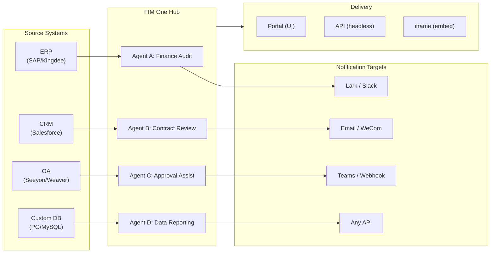

> Goal: Build an **AI-powered Connector Hub** — Standalone (portal assistant), Copilot (embedded in host system), Hub (central cross-system orchestration).
>
> Principles: **Provider-agnostic** (no vendor lock-in), **minimal-abstraction**, **protocol-first**, **connector-first** (integration is the core value).

## 製品ビジョン

FIM One は、3つの段階的なモードで機能する **AI コネクタハブ** です：

```
Standalone   → 独自の AI アシスタント (Portal)
Copilot      → ホストシステムに組み込まれた AI (iframe / widget / embed)
Hub          → 中央クロスシステムオーケストレーション (Portal / API)
```

**Hub モードが主要な差別化要因です。** エンタープライズクライアントは、ERP、CRM、OA、財務、HR などのレガシーシステムを持っており、これらが AI を通じて相互に通信する必要があります：



**GTM パス：ランド・アンド・エクスパンド**

| ステップ | モード | 実行内容 |
|------|------|-------------|
| Land | Copilot | 1つのシステムに組み込み、UI 内で価値を実証 |
| Expand | Copilot → Hub | より多くのシステムにロールアウト；Hub がそれらを集約 |

## 出荷済みバージョン

### v0.1 (2026-02-22) — MVP: ReAct + DAG Planner
- ReActAgent with tools (calculator, python_exec, web_search)
- DAG Planner (LLM generates dependency graphs)
- Portal UI with streaming + KaTeX

### v0.2 (2026-02-24) — マルチモデル + メモリ
- リトライ / レート制限 / 使用状況追跡
- ネイティブ関数呼び出し (JSON のみの解析なし)
- マルチモデルサポート (高速 + メイン LLM)
- メモリ: WindowMemory、SummaryMemory
- FastAPI バックエンド SSE ストリーミング付き

### v0.3 (2026-02-25) — Web Tools + MCP
- Web tools (web_search, web_fetch) via Jina/Tavily/Brave
- File operations tool
- MCP client (standard tool integration)
- Tool auto-discovery + categories
- DAG visualization with click-to-scroll
- Code exec in Docker (`--network=none`)

### v0.4 (2026-02-25) — マルチターン + エージェント
- マルチターン会話 (DbMemory)
- ツールステップ折りたたみUI
- HTTPリクエスト + シェル実行ツール
- エージェント管理 (作成、設定、公開)
- JWT認証
- エージェント単位の実行モード + 温度制御

### v0.5 (2026-02-28) — Full RAG + Grounded Gen
- Full RAG パイプライン (embedding + vector store + FTS + RRF + reranker)
- Grounded Generation (引用、信頼度スコア)
- ナレッジベース ドキュメント管理 (CRUD、検索、再試行、スキーマ移行)
- ContextGuard + ピン留めメッセージ (トークン予算マネージャー)
- DbMemory 永続化 + LLM Compact
- DAG 再計画 (最大3ラウンド)

### v0.6 (2026-03-01) — コネクタプラットフォーム
- **コネクタ CRUD**: 作成、読み取り、更新、削除
- **ConnectorToolAdapter**: コネクタ → BaseToolに変換
- **ユーザーごとの認証情報**: AES-GCM暗号化
- **確認ゲート**: 書き込み操作の承認
- **監査ログ**: すべてのツール呼び出しを記録
- **サーキットブレーカー**: 障害時の段階的な機能低下
- **ユーティリティツール**: email_send、json_transform、template_render、text_utils
- **埋め込みオプション**: Jina、OpenAI、カスタムプロバイダー

### v0.7 (2026-03-06) — 管理プラットフォーム + マルチテナント
- **管理プラットフォーム**: ユーザー管理、ロール切り替え、パスワードリセット、アカウント有効化/無効化
- **招待制登録**: 3つのモード (オープン/招待/無効) + 招待コード CRUD
- **ストレージ管理**: ユーザーごとのディスク使用量、クリア、孤立ファイルのクリーンアップ
- **会話モデレーション**: 管理者による一覧表示/削除
- **ユーザーごとの強制ログアウト**: すべてのトークンを無効化
- **API ヘルスダッシュボード**: システム統計、コネクタメトリクス
- **初回セットアップウィザード**: ガイド付き管理者アカウント作成
- **個人センター**: ユーザーごとのグローバル指示、言語設定
- **JWT 認証**: トークンベースの SSE 認証、会話の所有権
- **グローバル MCP サーバー**: 管理者がプロビジョニング、すべてのセッションで読み込み
- **後方互換性**: registration_enabled → registration_mode 自動マイグレーション

### v0.7.x (2026-03-07 to 2026-03-12) — 安定性 + ポーランド
- 招待コード管理
- ユーザーごとのクォータ (429 強制)
- 構造化監査ログ
- 機密ワードフィルタリング
- 管理者ログイン履歴
- 管理者ファイルブラウザ
- 強化された管理者ビュー (model_name、tools、kb_ids フィールド)
- Docker Compose デプロイメント (単一イメージ、名前付きボリューム)
- OAuth 自動検出 (window.location から)
- 拡張思考 / 推論サポート (`LLM_REASONING_EFFORT`、`LLM_REASONING_BUDGET_TOKENS`) OpenAI o シリーズ、Gemini 2.5+、Claude 向け
- 管理者ツール単位の有効/無効切り替え (無効なツールはチャット実行時に除外)
- MCP サーバー管理をコネクタページに移動
- デュアルデータベースサポート: SQLite (ゼロコンフィグデフォルト) + PostgreSQL (本番環境); Docker Compose は自動的に PostgreSQL をプロビジョニング
- モデル設定ドキュメントページ (プロバイダーごとの拡張思考セットアップ)
- SSE Protocol v2: リアルタイム回答ストリーミング (`delta_reasoning`、`usage` フィールド、および分割 `done`/`suggestions`/`title`/`end` イベント); SQLite プール サイズ 5 -> 20
- AI Builder 拡張: 7 つの新しいビルダーツール (GetSettings、TestConnection、ImportOpenAPI (コネクタ向け); ListConnectors、AddConnector、RemoveConnector、SetModel (エージェント向け))、エージェント上の `is_builder` フラグ、ビルダープロンプト自動更新、SSRF ガード
- SSE v2 フロントエンド: ストリーミングドットパルスカーソル、DAG 再計画ラウンドスナップショット (折りたたみ可能なカード)、DAG レイアウトをステップ状態から分離
- AI Builder コンセプトドキュメントページ (コネクタおよびエージェントビルダーガイド)
- 組織システム: 完全な CRUD (ロールベースのメンバーシップ: オーナー/管理者/メンバー)、管理者管理 UI
- 3 段階のリソース可視性 (個人/組織/グローバル) エージェント、コネクタ、ナレッジベース、MCP サーバー向け
- すべてのリソースタイプの公開/非公開 API; 公開エージェントのオーナー委譲
- 管理者設定可視性エンドポイント (クローン・トゥ・グローバルを置き換え); 統一された `build_visibility_filter()` クエリヘルパー
- データベースコネクタ (フェーズ 1-3): PG/MySQL/Oracle/SQL Server + 中国レガシー DB への直接 SQL アクセス; スキーマ内省、AI アノテーション、読み取り専用クエリ実行、暗号化された認証情報、コネクタごと 3 つのツール (`list_tables`、`describe_table`、`query`)
- **評価センター**: 定量的なエージェント品質ベンチマーク — テストデータセット CRUD (プロンプト + 期待される動作 + アサーション)、評価実行 (並列実行 + LLM グレーダー + ケースごとの合格/不合格/レイテンシ/トークン結果)、自動ポーリング付き結果ビューア; マイグレーション `r8t0v2x4z567`
- 3 つのモデルロール (General/Fast/Reasoning) (ティアごとの env コンフィグ分離); 高速モデルはメインモデル設定を継承しない
- `StepOutput` データクラス (構造化データとアーティファクト渡し用の通常文字列ステップ結果を置き換え)
- DAG 実行用ツールキャッシュ — 実行ごとの同一ツール呼び出しキャッシュ (非同期ロック スタンピード防止付き) (`DAG_TOOL_CACHE`)
- ステップごとの LLM 検証 (失敗時 1 回の再試行) (`DAG_STEP_VERIFICATION`)
- 自動ルーティング: 高速 LLM がクエリを ReAct または DAG として分類; `/api/auto` エンドポイント; フロントエンド 3 方向モード切り替え (`AUTO_ROUTING`)
- [x] ~~**Shadow Market Organization + Resource Subscriptions**~~: 組み込み Market org (shadow、自動参加なし) は Platform org を置き換え; マーケットプレイスブラウジングおよび明示的なサブスクリプション経由でリソースを発見 (プルモデル); Market API (共有リソースへのサブスクリプション); Market への公開は常にレビューが必要; リソースサブスクリプションテーブル; グローバル可視性を置き換える org ベースのリソース共有
- [x] ~~**Agent Auto-discovery and Sub-agent Binding**~~: エージェント上の `discoverable` フラグ; `sub_agent_ids` ホワイトリスト; CallAgentTool (タスクを専門エージェントに委譲)
- [x] ~~**MCP Server Credentials + Per-User Override**~~: `mcp_server_credentials` テーブル; `PUT /api/mcp-servers/{id}/my-credentials` エンドポイント; 認証情報フォールバック動作用の `allow_fallback` フラグ
- [x] ~~**Connector/KB Toggle**~~: `POST /api/connectors/{id}/toggle` および `POST /api/knowledge-bases/{id}/toggle` (リソースの一時停止/再開)
- [x] ~~**Standalone KB Conversations**~~: 会話上の `kb_ids` フィールド (エージェントバインディングなしの直接 KB チャット)

### v0.8 (2026-03-20) — コネクタ宣言型設定 + 段階的情報開示
- [x] **データベースコネクタ**: 直接SQL アクセス (PostgreSQL、MySQL、Oracle) *(v0.7.x で出荷 — フェーズ 1-3)*
- [x] **RBAC**: ユーザー/ロール単位のコネクタアクセス制御 *(v0.7.x で出荷 — org システム + 3 段階の可視性)*
- [x] **コネクタ認証情報の暗号化 + ユーザー単位のオーバーライド**: `connector_credentials` テーブル、`CREDENTIAL_ENCRYPTION_KEY` 経由の Fernet 暗号化、`allow_fallback` フラグ、`GET/PUT/DELETE /my-credentials` エンドポイント、チャットツール読み込み時のユーザー単位の認証情報解決
- [x] **公開レビュー UI**: 組織レベルの公開レビューシステム — 組織ごとのレビュー切り替え、承認/却下ワークフロー付き ReviewsSheet、リソースカードのステータスバッジ、公開ダイアログのレビュー通知、却下されたリソースの再送信
- [x] **コネクタ段階的情報開示 (フェーズ 1-2)**: 単一の `ConnectorMetaTool` がアクション単位のツールに置き換わり、システムプロンプトは軽量な**スタブ**のみを受け取ります (名前 + 1 行の説明、コネクタあたり約 30 token vs アクションあたり約 250 token)。エージェントが `discover(connector)` を呼び出して、完全なアクションスキーマをオンデマンドで読み込みます — スキーマはモデルがコネクタを選択した場合のみ読み込まれ、キャッシング用にプロンプトプレフィックスを安定に保ちます。最新のエージェントフレームワークで一般的な遅延ツール読み込みパターンに従います。`execute` サブコマンド、後方互換性のための機能フラグ。
- [x] **エージェントスキルシステム + コンパクト指示**: エージェント指示のオンデマンドスキル読み込み — `Skill` モデル (名前、コンテンツ/SOP、オプションのスクリプト) がエージェントに添付されます。システムプロンプトでは名前のみで参照されます (スキルあたり約 10 token)。エージェントが `read_skill(name)` を呼び出して、完全なコンテンツをオンデマンドで読み込みます。会話単位の指示 token コストを約 80% 削減しながら、より充実した SOP ライブラリを実現します。ConnectorMetaTool の段階的情報開示と同等の指示レベルでの対応。「指示 + ツール + スキル」の差別化ストーリーを実現します。また、Agent モデルに `compact_instructions` フィールドを追加します — エージェント単位の圧縮優先度リストが圧縮時に `ContextGuard` に注入されます (例:「注文 ID と金額を保持し、生の API レスポンスを削除」)。現在の静的な汎用プロンプトに置き換わります。最新のエージェントフレームワークで広く採用されているコンパクト指示規約に従います。
- [x] **コネクタのインポート/エクスポート**: コネクタテンプレートの共有
- [x] **コネクタのフォーク**: 既存のコネクタのクローンとカスタマイズ
- [x] **ワークフロー フェーズ 2 ノード**: Iterator、Loop、VariableAggregator、ParameterExtractor、ListOperation、Transform、DocumentExtractor、QuestionUnderstanding、HumanIntervention — 9 つの高度なノードタイプ、完全なフロントエンド + バックエンド + 150 の新しいテスト (合計 275)。ノード再試行と指数バックオフ、安全な式評価。成功率バー付きの統計パネル。12 個の組み込みテンプレート。ペーンコンテキストメニュー (貼り付け、すべて選択、ビューに合わせる、自動レイアウト)。
- [x] **ワークフロー フェーズ 3 ノード: SubWorkflow + ENV** — 2 つの新しいノードタイプ (合計 25 ノード)、14 の新しいテスト (合計 306)、14 個の組み込みテンプレート。SubWorkflow: ターゲットワークフロー選択、変数マッピング、無限再帰を防ぐための設定可能な深さ制限を備えた完全な DB バックアップのネストされたワークフロー実行機能。ENV: キーピッカーとフォールバックデフォルト付きの暗号化環境変数を読み込みます。完全なフロントエンド (ノードコンポーネント、設定パネル、パレットエントリ、ミニマップ色)。ノード単位の実行統計パネル (成功率、期間、失敗数を最悪順でソート)。`getNodeStats` API クライアント + `NodeStatEntry` タイプ。キーボードショートカットダイアログ (`?` キー)。
- [x] **ワークフロー スケジュール トリガー**: タイムゾーン、デフォルト入力、次実行時刻計算を備えたワークフロー単位の cron 設定。プリセット cron ボタン、30 個のトリガーテスト。
- [x] **ワークフロー API トリガー**: ユーザー認証なしで外部実行用のワークフロー単位のパブリック API キー (`wf_` プレフィックス)、レート制限付き。API キー管理ダイアログ (生成/再生成/取り消し、トリガー URL、cURL/JS の例)。
- [x] **ワークフロー バッチ実行**: 最大 100 個の入力セット、設定可能な並列処理 (1-10)、折りたたみ可能なアイテム単位の結果、JSON エクスポート付きの `POST /batch-run`。14 個のバッチ実行テスト。
- [x] **ワークフロー実行ログビューアー**: 実行パネルのリアルタイム時系列 SSE イベントストリーム、タイムスタンプ、色分けされたバッジ、イベントタイプフィルタートグル。
- [x] **ワークフロー実行統計**: バックエンド GROUP BY サブクエリ経由でバッチ取得された実行数と成功率、ワークフローカードに色分けされた成功率インジケーター付きで表示。
- [x] **ワークフロー スケジューラー デーモン**: 60 秒ごとに cron ベースのワークフローの期限を確認するバックグラウンド非同期サービス。Croniter タイムゾーンサポート、セマフォ並行処理、`last_scheduled_at` トラッキング、webhook 配信。14 個のテスト。
- [x] **ワークフロー インポート競合リゾルバー**: インポート中に未解決のエージェント/コネクタ/KB/MCP 参照を検出します。可視性フィルタリング付きのバッチ DB クエリ、フロントエンド toast 警告。17 個のテスト。
- [x] **ワークフロー テストノード実行**: モック変数を使用した分離されたシングルノードテスト、エディターに統合 (設定パネルテストボタン + コンテキストメニュー)。23 個のテスト。
- [x] **ワークフロー バージョン差分**: ノード/エッジ変更検出を備えた並列ブループリント比較、色分けされたインジケーター (追加/削除/変更)。
- [x] **ワークフロー実行管理**: 個別実行の削除 (`DELETE /runs/{run_id}`) と完了した実行すべてのクリア (`DELETE /runs`)、フロントエンド確認ダイアログ付き。
- [x] **ワークフロー実行リプレイオーバーレイ**: 実行履歴の「キャンバスで表示」ボタンで、キャンバスに過去の実行結果をオーバーレイし、再実行なしでノード単位のステータスと出力を表示。
- [x] **ワークフロー お気に入り/ピン留め**: ワークフローをスター/ピン留めしてリストの上部に固定、localStorage 永続化付き。
- [x] **ワークフロー実行履歴エクスポート**: 完全な実行メタデータとノード単位の結果を含む JSON ファイルダウンロードとして実行履歴をエクスポート。
- [x] **管理者ワークフロー管理**: すべてのユーザー全体のワークフロー管理用の管理パネルタブ — リスト、アクティブ/非アクティブ切り替え、確認付き削除。削除、切り替え、公開のバッチエンドポイント、監査ログ付き。
- [x] **ワークフロー テンプレート システム**: 管理者 CRUD、パブリックリスト/クローン API、初回起動時に自動挿入される 5 個のシードテンプレート付きの `WorkflowTemplate` ORM モデル。
- [x] **ワークフロー インライン検証バッジ**: キャンバス上のリアルタイムノード単位の `ValidationBadge`、編集中の即座のビジュアルフィードバック用のエラー/警告ツールチップ付き。
- [x] **ワークフロー実行トレースビューアー**: エンジン `trace_level` パラメーターとステップスルーデバッグ用のノード単位の変数スナップショット付きのタイムラインベースのトレースビューアーシート。
- [x] **ワークフロー レート制限とタイムアウト**: ユーザー単位の `WorkflowRateLimiter` (スライディングウィンドウ 10 実行/分、3 並行) とデフォルト 10 分のグローバル実行タイムアウト。
- [x] **ワークフロー ブループリント システム**: マルチステップ自動化ブループリント設計・実行用のビジュアルワークフローエディター — `Workflow` / `WorkflowRun` ORM モデル、完全な CRUD + SSE 実行 API、インポート/エクスポート、複製、ブループリント検証エンドポイント、トポロジカルソート + セマフォベースの並行処理 + 条件分岐と 12 ノードタイプ (Start、End、LLM、ConditionBranch、QuestionClassifier、Agent、KnowledgeRetrieval、Connector、HTTPRequest、VariableAssign、TemplateTransform、CodeExecution) を備えた `WorkflowEngine`、`{{node_id.output}}` 補間と `env.*` 名前空間を備えた `VariableStore`、ノード単位のエラー戦略 (STOP_WORKFLOW / CONTINUE / FAIL_BRANCH)、ノード単位のタイムアウトと高度な設定 UI、ドラッグアンドドロップパレット + ノード設定パネル + 変数ピッカーコンボボックス + エッジ上のノード追加 + 自動レイアウト (ELK.js) + 実行履歴シート付きの React Flow v12 ビジュアルエディター、リング状の実行ステータススタイルと動的エッジトランジション付きの Dify スタイルのコンパクトノード設計、シンプル LLM チェーン、条件付きルーター、知識拡張 QA、HTTP API パイプラインの 4 つの組み込みスターターテンプレート、テンプレートピッカーダイアログと `GET /templates` + `POST /from-template` API、統計エンドポイント、`?run=true` URL パラメーター自動オープン、サブプロセスベースのコード実行セキュリティ、105 テストスイート (テンプレート、eval 名前空間フラット化、ブループリント検証警告、ノード/エッジ削除、インポート/エクスポート/複製、デッドロック検出、マルチ条件分岐)
- [x] **操作監査**: 詳細なログ記録 — 管理者レビューログ監査タブが追加されました (組織/リソース単位の公開レビュー追跡)
- [x] **セマンティック スキーマ アノテーション**: `semantic_tag`、`description`、`pii` フラグでコネクタスキーマフィールドを拡張。アノテーションは LLM ツール説明に表示され、エージェントが列名から推測することなくフィールドの意図を理解できます

### v0.8.1 (2026-03-29) — プログレッシブディスクロージャー成熟度 + ReAct強化
- DBコネクタ（`DatabaseMetaTool`）、MCPサーバー（`MCPServerMetaTool`）、オンデマンドツール読み込み（`request_tools`メタツール）のプログレッシブディスクロージャー
- DAG品質全面改善（5つの改善：モデルアップグレード、スキル自動検出、引用検証者、構造化コンテンツ保持、ドメイン認識ルーティング）
- ReActでのドメインモデルエスカレーション（専門ドメインが推論モデルに自動エスカレート）
- モデルごとのネイティブ関数呼び出しトグル（`tool_choice_enabled`）
- ReActサイクル検出（決定論的重複ツール呼び出し防止）
- ReAct完了チェックリスト（ツール使用時の事前回答検証）
- リソースフォークフェーズ1（系統追跡付きMCPサーバー + スキルフォークエンドポイント）
- ワークフロー接続依存関係自動購読（再帰的サブワークフロー依存関係解決）
- プリビルトソリューションテンプレート（初回登録時にマーケットに8つの業界別ソリューションをシード）
- 管理者通知改善（タイムゾーン対応、マスタースイッチ、SMTP Reply-To）
- ターンごとのトークン予算サーキットブレーカー（`REACT_MAX_TURN_TOKENS`）
- 一元化されたツール切り詰め、動的システムプロンプト予算配分
- ファイル添付ダウンロード、重複メッセージ送信修正

### v0.8.2 (2026-04-10) — 智能体コア強化 + ビジョンドキュメント
- **智能体コアフェーズ 0** — コンパクト提示词を9セクション構造化フォーマットにアップグレード; 空のツール結果保護（`(no output)` の代わりに説明的なメッセージ）; アンチループ提示词 + サイクル検出閾値を2に低下; ドメイン分類器 + プリフライトDB設定解決を並列化（リクエストあたり400～1100 ms削減）; SSE `end` イベントを回答直後に送信、タイトル/提案をバックグラウンドタスクに移動
- **智能体コアフェーズ 1（コンテキストアンチブロート）** — `MicroCompact` ルールベースの古いツール結果クリーンアップ（最後の6つを保持）; `REACT_TOOL_RESULT_BUDGET=40000` 集計上限; コンテキストオーバーフロー時のリアクティブコンパクト（予算の50%に自動コンパクトして再試行、クラッシュの代わりに）
- **智能体コアフェーズ 2（速度）** — キーワードベースのツールプリセレクション（明らかなマッチでLLM呼び出しをスキップ、200～500 ms削減）; `SharedHttpClient` LLM接続プーリング; 200トークン以上の回答では完了チェックをスキップ; `FallbackLLM` はプライマリ+高速をラップし、429/503/529/接続エラーで自動フェイルオーバー
- **インテリジェントドキュメント処理（ビジョン対応）** — 適応的なドキュメント処理: PDFページはビジョン対応モデル（GPT-4o、Claude 3/4、Gemini）向けにPyMuPDFで画像としてレンダリング、テキストのみフォールバックはpdfplumberで実行。モデルごとの `supports_vision` フラグ。`DOCUMENT_PROCESSING_MODE`、`DOCUMENT_VISION_DPI`、`DOCUMENT_VISION_MAX_PAGES` 経由のモード。DOCX/PPTX埋め込み画像抽出。会話ターン全体でのマルチターンビジョン永続化。スマートPDF処理（テキストリッチページはテキスト+画像を抽出; スキャンページはフルページPNGとしてレンダリング）。`--network=none` コード実行用の一般的なデータサイエンスパッケージを備えた事前構築サンドボックスイメージ（`Dockerfile.sandbox`）
- **リソースフォーク完了** — 智能体 / コネクタ / ワークフローフォークエンドポイントを追加、5タイプ系統追跡を完了（KBフォークは削除 — 本質的にユーザーローカル）
- **ファイル整合性ガードレール** — システム提示词ルールは、ターゲットファイルが読み取り不可の場合、智能体が無関係なファイルコンテンツを代替することを防止; アップロードされたファイルにはメッセージコンテキストに `file_id` が含まれ、直接 `read_uploaded_file` アクセス用

### v0.8.3 (2026-04-16) — ユニバーサルドキュメント変換 + エージェントコア フェーズ 3
- **ユニバーサルドキュメント変換（`convert_to_markdown` + OCR）** — Microsoft MarkItDownをラップした組み込みエージェントツール。PDF、Word、Excel、PowerPoint、HTML、JSON、CSV、XML、ZIP、EPUB、Outlook .msg、画像、オーディオ、YouTube URLをMarkdownに変換します。`LiteLLMOpenAIShim`は任意のビジョン対応LLM（Claude、Gemini、Bedrock、Azure）経由でOCRを有効にします。ビジョン対応RAG取り込みとゼロリグレッションのテキストのみフォールバック。`LLM_SUPPORTS_VISION`環境変数でオプトアウト可能
- **エージェントコア フェーズ 3（ランタイム不変性の強化）** — 会話復旧（ぶら下がり`tool_use`の自動修復）；構造化コンパクト作業カード（圧縮ラウンド全体での型付き`WorkCard`マージ）；ターンレベルプロファイラー（`REACT_TURN_PROFILE_ENABLED`）；ユーザーごとのレート制限（`LLM_RATE_LIMIT_PER_USER`）；`tool_calls`を含む空のコンテンツアシスタントメッセージは削除されなくなりました

### v0.8.4 (2026-04-17) — 提示词キャッシュ + 推理正確性
- **システム提示词セクションレジストリとキャッシュブレークポイント** — メモ化された `PromptRegistry` はシステム提示词を安定したプレフィックス + 動的サフィックスに分割; キャッシュ対応プロバイダー (Claude、Bedrock Anthropic、Vertex Claude) はプレフィックスで `cache_control: {"type": "ephemeral"}` を受け取り、ターンあたりの入力token節約は約60～80%; 非キャッシュプロバイダーは単一の連結メッセージを取得 (動作変更なし)
- **提示词キャッシュの可観測性** — `cache_read_input_tokens` と `cache_creation_input_tokens` は `UsageSummary` → `TurnProfiler` → `done_payload.cache` フィールドで追跡; ターンごとに構造化された `turn_cache` ログ行。キャッシュ正当性プローブとしても機能
- **会話復旧MVP** — 合成 `tool_result` 行は中断されたターン後に永続化; `POST /chat/resume` はモノトニックカーソルからキャッシュされたSSEイベントをリプレイ; フロントエンド `useSseResume` フックは指数バックオフ (300ms → 1s → 3s、最大3回試行) で自動再接続し、「再接続中…」インジケーターを表示
- **思考ブロック永続化と署名** — `reasoning_content` + Anthropic `signature` は `metadata_["thinking"]` に永続化され、後続のターンでリプレイ; Claude 4マルチターン会話でのHTTP 400署名不一致を修正
- **プロバイダー対応推理リプレイポリシー** — `core/prompt/reasoning.py` の集中化された `reasoning_replay_policy()` はプロバイダーファミリーごとにシリアル化をゲート: Claude は署名付きで思考ブロックをリプレイ; DeepSeek-R1/Qwen-QwQ/Gemini-thinking/o-series はアウトバウンドで `reasoning_content` をドロップ (以前はリーク、プロバイダーKVキャッシュを破壊し、APIドキュメントに違反)

## 計画されているバージョン

### v0.8.5 — Channel & Hook Polish

**Goal**: v0.8 Channel + Hook ロールアウトからの未解決の問題を解決し、v0.9 本番環境対応化の波が到来する前に完了する。スコープは意図的に狭い — 新機能ではなくポーランド。

- [ ] **Per-hook config pass-through** — `class_hooks` エントリは現在、単なる文字列です。`FeishuGateHook.timeout_seconds`、`poll_interval_seconds`、または `callback_base_url` をエージェントごとにオーバーライドするには、スキーマが `{"name": "feishu_gate", "config": {...}}` オブジェクトを受け入れ、それらをフック ファクトリへの kwargs として転送する必要があります。低リスクのフォローアップです。現在のデフォルト (120s タイムアウト / 1.5s ポーリング / env-var コールバック URL) は当面は許容可能です。
- [ ] **DAG `tools_used` 精度** — 完了通知カードは現在、`tools_used` を `plan.steps[*].tool_hint` (プランナーの提案) から導出していますが、実際には per-step ReAct ループが選択した実際のツール名ではありません。DAG executor のステップ完了コールバックから実際に選択されたツール名を取得し、通知カードが実際に実行されたものを反映するようにします。
- [ ] **委譲されたサブエージェントと Workflow AGENT ノードのフック継承ポリシー** — 現在、`CallAgentTool` の子と Workflow `AGENT` ノードは、親のフック レジストリを継承しない新しい ReActAgents を作成するため、委譲経由で到達した機密ツール呼び出しは `feishu_gate` をサイレントにバイパスします。決定して文書化する: 子エージェントは継承するか (デフォルト-セキュア、ゲート バイパスを防止) または分離するか (チームが承認ゲートなしの作業を子エージェントに委譲できるようにする)? Eval Center の実行は設計上、オプトアウトのままです (自動化は人間の承認をブロックできません)。

ここにあるすべてのものは加算的で、既存の抽象化の背後にあります — スキーマ変更なし、API の破壊的変更なし、v0.8.4 と v0.9 の間で段階的に安全に実装できます。

### v0.9 — 可観測性 + 本番環境対応

**目標**: 本番環境グレードの運用、デバッグ、モニタリング。**Hook System** を導入 — 智能体の指示の下に位置する決定論的な強制レイヤーで、LLMによってオーバーライドできません。

- [ ] **Connector段階的情報開示 (Phase 3-4)**: 統一された `ConnectorExecutor` インターフェース (API/DB/MCPを1つの抽象化の背後に); `jsonschema` によるアクション パラメータ検証; プロトコル非依存の検出/実行
- [ ] **YAML/JSON connector設定**: プラットフォームが自動的にMCPサーバーを生成
- [ ] **Database connectors Phase 4**: エンタープライズドライバー — Oracle (`oracledb`)、SQL Server (`aioodbc`)、[x] 達梦 DM8 (ネイティブ `dmPython`)、[x] 人大金仓 KingbaseES + 瀚高 HighGo (PG互換、`asyncpg` を再利用)、南大通用 GBase (`aioodbc` + GBase ODBC)
- [ ] **IM Channel統合 (双方向)**: **Phase 1 — アウトバウンドプッシュ**: Lark、WeCom、Slack、Email、Teams通知アクション (智能体/Workflowの結果から)。**Phase 2 — インバウンドトリガー**: ユーザーがIM グループチャットで智能体に@メンションしてPortalを開かずにタスクをトリガー; チャネルごとのwebhookレシーバー; 各IMチャネルは双方向アクション (送信 + 受信) を持つConnectorとしてモデル化。Hub modeキラー機能
  - [x] **Feishuチャネル (Phase 1サブセット)** — 組織スコープの `Channel` リソース (Fernet暗号化認証情報付き); インタラクティブカード送信 + コールバック (署名検証 + URLチャレンジ) をサポートする `FeishuChannel` 実装; 確認ゲートと統合して書き込み操作の承認が設定されたFeishuグループチャットにApprove/Rejectカードとして到着; Settings → Channels管理UI。2026-04-24ロードショー向けに早期出荷。残り: WeCom、Slack、Email、Teams アウトバウンド + Phase 2 インバウンドトリガー。
  - [ ] **アウトバウンド通知パターン (汎用、チャネルタイプ間で再利用可能)**: 同じ `BaseChannel` 抽象化は承認ゲート以上のアウトバウンドユースケースのカタログをサポート。各パターンは `BaseChannel` に対して1回実装され、すべての具体的なチャネル (今日はFeishu; Slack/WeCom/Teams/Emailが到着時) で自動的に機能します。
    - [x] **タスク完了通知**: 長時間実行DAG / Workflow / スケジュール智能体が完了したら、結果スニペット + アーティファクトリンク付きのサマリーカードを組織チャネル (またはユーザーが選択したチャネル) に投稿。最小限の実行可能な「Channelアウトバウンド」製品 — `FeishuGateHook` の後の最初のコンシューマー
    - [ ] **例外 / 失敗アラート**: 智能体推論失敗、LLMプロバイダーエラー、connectorが5xxを発生、DAGプランが再計画予算を枯渇 → 診断カードをopsチャネルにプッシュ (trace IDと再試行オプション付き)
    - [ ] **コスト / 予算警告**: ユーザーごと、または智能体ごとのtoken/リクエスト予算が80% / 100%閾値に達する → 管理チャネル (または智能体所有者に@メンション) に現在の使用量 vs. キャップ付きでプッシュ
    - [ ] **スケジュール済みダイジェスト**: 智能体またはworkflowが定期的な (日次 / 週次) サマリーカードを発行 — KPIロールアップ、未解決チケットトリアージ、契約更新リスト — ユーザーがPortalを開く必要なくチャネルに直接投稿
    - [ ] **スタック智能体でのエスカレーション**: 智能体がN連続反復で観測可能な進捗を示さない (サイクル検出、または `max_iterations` 超過) → 人間のオペレーターに引き継ぎを求めるカード、現在のコンテキストと「あなたのメモで再開」アクション付きで投稿
    - [ ] **機密ツール呼び出しの監査レシート**: 承認ゲートとは独立して — `audit=true` でタグ付けされたツールへのすべての呼び出しは、読み取り専用レシートカードをコンプライアンスチャネルに発行 (誰が / 何を / いつ / 引数)、データベース外の耐久性のある監査証跡を提供
    - [ ] **承認エスカレーション**: `feishu_gate` 承認カードがN分以内に応答を受け取らない場合、自動的にグループ所有者に@メンションするか、カードをより高いレベルのチャネルに転送; ツール/connector ごとに設定可能

#### コネクタ認可レイヤー（データレベルRBAC）

既存のRBAC制御は**リソース可視性**（誰がコネクタを見られるか）を制御しますが、**実行時認可**（呼び出し元がそれを通じて何ができるか）は制御しません。管理者が高権限認証情報を使用してDB/APIを設定すると、そのコネクタを使用する組織のすべてのメンバーが管理者の影響範囲を継承します。このセクションでは、3つの異なるアップストリーム機能層にわたってこのギャップを埋めます：

- [ ] **Tier 1 — DBモード（フル管理者+基本/レガシー）**: 管理者は単一のDB認証情報（rootまたは最小権限サービスアカウント）を提供します。ほとんどのレガシーシステムはユーザーごとのDBアカウントを発行できないためです。強制は`ConnectorScopeGuard`を介して接続**上**で発生します。これは`PreToolUse`フックで、呼び出し元のアイデンティティごとに`query` / `execute`呼び出しをフィルタリングします。機能：破壊的な動詞（DROP、TRUNCATE、スコープなしのDELETE/UPDATE）をブロック；テーブルレベルの許可/拒否リスト；`pii=true`セマンティックアノテーションによるカラム編集；スコープ述語の自動注入（例：すべての`SELECT`に`AND dept_id = :caller_dept`を追加）。設定はコネクタ上の`scope_rules` JSONフィールドで、ロールベースのマッチング；デフォルトは曖昧な場合は拒否です。
- [ ] **Tier 2 — Open APIモード（ユーザーごとのAPIキー）**: 推奨パス。ユーザーは独自のAPIキーを持参します（v0.8で出荷 — `connector_credentials` + `allow_fallback=false`）；アップストリームシステムのネイティブ認可がスコープを自然に強制します。残りの作業：ユーザーごとの認証情報を**要求**するコネクタごとの管理UI（管理者フォールバックをグローバルに無効化）と、どの組織メンバーがまだ独自のキーをバインドしていないかを示すヘルスダッシュボード。
- [ ] **Tier 3 — 中間層（ログインチケット交換）**: ユーザースコープのAPIキーがないフロントエンド/バックエンド分割システム向け。システムのログインエンドポイントをユーザー提供の認証情報で呼び出し、返された短命チケットをキャッシュし、有効期限時に自動更新します。APIキー / OAuth と並んで新しい`LoginTicketCredential`タイプ；コネクタ仕様は`auth_type: login_ticket`を`login_endpoint`、`ticket_field`、および`refresh_strategy`で宣言します。アダプタレイヤーはリクエストごとにチケットをアウトバウンド認可ヘッダーに変換します。
- [ ] **クロスティア監査可能性**: すべてのツール呼び出しに`caller_user_id`、`effective_credential_source`（ユーザー / 管理者フォールバック / チケット）、および`scope_rules_applied`を`ConnectorCallLog`にスタンプするため、オペレーションは事後に「実際に誰が何を誰として実行したのか」に答えることができます。

#### チャネル → 統合プロモーション

現在、Feishuは**チャネル + コネクタ**ペアとして構成されています — 配信パイプとAPIサーフェス。エンタープライズロールアウトには3番目のロールが必要です：**統合**（同じサードパーティバインディングがSSOと組織グラフ同期も提供します）。v0.9に登場します。既存のFeishuバインディングが必要な4つのファセットのうち3つをすでにカバーしており、アイデンティティストーリーが上記のTier-2認可のブロックを解除するため（ユーザーはログイン時に独自の上流トークンを取得でき、APIキーを手動でプロビジョニングする必要がなくなります）。

- [ ] **チャネル → 統合モデル**：`Channel`を「アウトバウンドのみの配信」から`ThirdPartyIntegration`親に昇格させ、3つのオプトイン機能を備えます — (a) **配信**（既存のチャネル動作：カードを送信、確認をゲート）；(b) **ログイン**（OIDC / カスタムSSO；「Feishuでログイン」はFIMセッションと上流プラットフォームトークンの両方を生成）；(c) **組織グラフ同期**（上流の部門/メンバーをFIM組織構造にミラーリング；スケジュール済みまたはWebhook駆動）。管理者はバインディングごとに各機能を切り替えます。
- [ ] **Feishu SSOを統合機能として**：既存のFeishuアプリバインディング（app_id/secretはすでにチャネル上にあります）を再利用して、「Feishuでログイン」をFeishuテナントが組織にバインドされているすべてのユーザーに公開します。ログイン時に取得されたトークンは、ユーザーのFeishuコネクタのデフォルト認証情報になります — Tier-2強制のための「独自のAPIキーを取得する」という摩擦を排除します。
- [ ] **組織グラフ同期（Feishu → FIM組織）**：Feishuの部門+メンバーをFIMにプル；Feishuテナント管理者/部門長/メンバーロールをFIM所有者/管理者/メンバーにマップ。次のWeComとDingTalk、およびv1.0のKingdee / Yonyou / SAP ERP-OAアダプタの基盤。

#### パブリックAPI（フェーズ2）

フェーズ1（リリース済み）：APIキー認証ミドルウェア、スコープサポート、キュレーション済みOpenAPI仕様、インタラクティブプレイグラウンド付きMintlify APIリファレンス。

- [ ] **キーごとのレート制限** — APIキーごとに設定可能なリクエスト/分およびリクエスト/日の制限；`X-RateLimit-*`ヘッダー付きの`429 Too Many Requests`レスポンス
- [ ] **キーごとの使用量クォータ** — 月間トークン/リクエスト予算、管理ダッシュボード、閾値アラート
- [ ] **エンドポイントごとのスコープ強制** — すべての保護されたエンドポイントに`require_scope("chat")`依存性；`scopes=chat`を持つキーはチャット関連APIのみにアクセス可能
- [ ] **APIバージョニング**（`/v1/...`） — 安定したバージョン付きAPIコントラクト；サンセットエンドポイント用の廃止予定ヘッダー
- [ ] **Webhookコールバック** — APIキーごとにWebhook URLを登録；会話完了、エージェントエラー、非同期タスク結果のPOSト通知を受信
- [ ] **SDK生成** — OpenAPI仕様から自動生成されたPythonおよびTypeScriptクライアントSDK；PyPIおよびnpmに公開
- [ ] **デベロッパーポータル** — Mintlifyドキュメント内のインタラクティブな「試す」パネル；キー所有者に表示される使用分析
- [ ] **APIキーローテーション** — ワンクリックキーローテーション、グレースピリオド付き（ローテーション後24時間は古いキーが有効）
- [ ] **バッチ/非同期API** — 最大100クエリを受け入れる`POST /api/batch`；結果をポーリングするための`batch_id`を返す；KB一括クエリまたはマルチエージェントオーケストレーションに有用
- [ ] **外部依存関係ごとのサーキットブレーカー** — ダウンストリームLLMプロバイダーまたはコネクタが利用できない場合のカスケード障害を防止；自動フォールバックと復旧

#### 可観測性とエージェント ランタイム

- [ ] **Agent Trace Layer (Observability++)**: アプリケーション レベルの run/trace/thread 階層によるエージェント デバッグ — 各会話 → `Trace`、各 LLM 呼び出し / ツール呼び出し / DAG ステップ → input/output/tokens/timing を含む `Span`。タイムラインと展開可能な LLM 呼び出しペイロードを備えたフロントエンド trace ビューアー。これは OTel (インフラストラクチャ レベル) を超えて、開発者とエンタープライズ クライアント向けの実用的なエージェント ループ デバッグを提供します。OpenTelemetry エクスポートをデータ シンク オプションとして提供。LangSmith の run/trace/thread コンセプトに基づいてモデル化 — エージェント可観測性の業界検証済みパターン。
- [ ] **Metrics ダッシュボード**: レイテンシ、成功率、token 使用量、コネクタ呼び出し分析 — エージェント単位、ユーザー単位、組織単位の内訳
- [x] ~~**Circuit breaker**: 3 状態マシン (closed/open/half-open) と、コネクタ単位の障害追跡、5xx 検出、監視エンドポイント~~ *(v0.8 で早期出荷 — 実装済み)*
- [x] ~~**Workflow run 保持クリーンアップ**: 設定可能な最大経過時間と最大カウントを備えたバックグラウンド クリーンアップ タスク; ワークフロー単位のオーバーライド; 手動トリガー用の管理エンドポイント~~ *(v0.8.1 で出荷)*
- [x] ~~**Workflow バージョン変更サマリー**: `compute_blueprint_diff()` は blueprint diff からバージョン保存時に人間が読める形のサマリーを自動生成~~ *(v0.8.1 で出荷)*
- [x] ~~**DAG 品質オーバーホール**: 非高速ステップ向けのデフォルト モデル アップグレード; プランニングでのスキル自動検出; 法務/医療/金融ドメイン向けの引用検証者; 構造化コンテンツ コンテキスト保存; ルーターでのドメイン分類とドメイン対応モデル選択~~ *(v0.8.1 で出荷)*
- [x] ~~**ReAct でのドメイン モデル エスカレーション**: 専門ドメインは推理モデルに自動エスカレートし、必須の Web 検索と引用検証を実施~~ *(v0.8.1 で出荷)*
- [x] ~~**モデル単位の Native Function Calling トグル**: `tool_choice_enabled` 設定により、モデルは強制ツール選択をスキップして JSON Mode に直接進むことが可能~~ *(v0.8.1 で出荷)*
- [x] ~~**DatabaseMetaTool (DB コネクタの段階的開示)**: 単一の `database` メタツール (サブコマンド `list_tables`/`discover`/`query`) が、データベース コネクタあたり 3N 個の個別ツールを置き換え; `DATABASE_TOOL_MODE` 環境変数で設定可能 (デフォルト `progressive`、フォールバック `legacy`)~~ *(v0.8.1 で出荷)*
- [x] ~~**`request_tools` メタツール経由のオンデマンド ツール ロード**: スマート選択後に >12 個のツールが利用可能な場合、LLM は会話中に動的に追加ツールをロード可能; JSON と native function-calling の両モードで動作~~ *(v0.8.1 で出荷)*
- [x] ~~**MCPServerMetaTool (MCP の段階的開示)**: 単一の `mcp` メタツール (サブコマンド `discover`/`call`) が N*M 個の個別 MCP ツールを置き換え; `MCP_TOOL_MODE` 環境変数で設定可能 (デフォルト `progressive`、フォールバック `legacy`)~~ *(v0.8.1 で出荷)*
- [x] ~~**Workflow Connection Dep 自動サブスクライブ**: Market サブスクリプション カスケードを拡張して、Workflow の接続依存関係 (API コネクタ、MCP サーバー) を自動サブスクライブ。Workflow ノードは、コネクタ、MCP サーバー、エージェント (さらに多くの依存関係を再帰的に参照)、およびサブ Workflow を参照可能 — 完全なツリー内のすべての接続依存関係は、サブスクライブ時に自動サブスクライブされ、アンサブスクライブ時にカスケード クリーンアップされる必要があります。サイクル検出を伴う再帰的なサブ Workflow 解決のため、スキル/エージェントより複雑。Solution (スキル/エージェント) 接続 dep 自動サブスクライブの対応物~~ *(v0.8.1 で出荷)*
- [x] ~~**Workflow 実エグゼキューター**: MCP と BuiltinTool ノード エグゼキューター スタブを完全な実装に置き換え (MCP サーバー検出 + ツール呼び出し; ToolRegistry 統合)~~ *(v0.8.1 で出荷)*
- [ ] **Agent Hook System**: LLM ループの **外側で実行される** 決定論的な強制レイヤー — フック はツール イベントで自動的に実行され、エージェント命令によってバイパスできません。3 つのフック ポイント: `PreToolUse` (実行前に検証/ブロック)、`PostToolUse` (実行後の副作用)、`SessionStart` (動的コンテキストを注入)。組み込みフック: すべてのコネクタ呼び出しで `ConnectorCallLog` を自動書き込み (現在は手動); 組織が読み取り専用モードの場合、書き込み操作をブロック; 超大型 DB クエリ結果をエージェントに到達する前に自動切り詰め; コネクタ単位の呼び出し頻度をレート制限。ユーザー定義フック: エージェント単位の YAML 設定 (`hooks:` フィールド) でシェル コマンドまたは Python 呼び出し可能オブジェクトを宣言し、マッチするツール イベントでトリガー — 最新のエージェント フレームワーク全体で共有されるフック ベースの強制パターン。重要な設計原則: **フックは「常に発生する必要がある」ロジック用であり、LLM がそれを実行することを覚えていることに依存してはいけません**。命令は「すべての呼び出しを記録する」と言います; フックは実際に記録します。命令は「読み取り専用モードで書き込まない」と言います; フックは実際にそれをブロックします。
  - [x] **Hook System スケルトン + FeishuGateHook** — クラス ベースの `PreToolUseHook` / `PostToolUseHook` 抽象化が ReAct ループの下にワイヤリング; 最初の具体的なフックは `FeishuGateHook` で、`requires_confirmation=True` でフラグされたツールをインターセプトし、承認を組織の Feishu チャネル経由でルーティング。完全なフック ライフサイクル (ユーザー定義 YAML フック、組み込み監査/ブロック/切り詰めフック、`SessionStart`) は v0.9 スコープのままです。2026-04-24 ロードショー向けに早期出荷。
  - [x] **Hook Approval Playground** — UI 駆動のラウンド トリップ テスター: Channels 詳細シートは、実際の `ConfirmationRequest` 行を作成し、本番カードを Feishu に送信し、決定をライブでポーリングするダイアログを起動します。本番フックが使用する正確なコード パスを実行し、本番前のリハーサルとデモを忠実にします。
  - [x] **Hook System が ReAct + DAG ランタイムでライブ** — `build_hook_registry_for_agent` は、すべてのチャット セッションで `agent.model_config_json.hooks.class_hooks` を解決; ReAct と DAG エントリ ポイントの両方は、ツール ディスパッチ前にフックをインスタンス化します。ツール アダプタは `requires_confirmation` を公開プロパティとして公開し、フック述語がアダプタ カップリングなしでダック タイピングできるようにします。本番エージェント ループを通じた承認/却下パスをカバーするエンド ツー エンド スモーク スクリプト (`scripts/smoke_feishu_gate.py`) と組み合わせ。
  - [ ] **フック単位の設定パス スルー** — `class_hooks` エントリは現在、ベア文字列; `FeishuGateHook.timeout_seconds`、`poll_interval_seconds`、または `callback_base_url` をエージェント単位でオーバーライドするには、スキーマが `{"name": "feishu_gate", "config": {...}}` オブジェクトを受け入れ、フック ファクトリに kwargs として転送される必要があります。低リスク v0.8.5 フォローアップ; 現在のデフォルト (120s タイムアウト / 1.5s ポール / env-var コールバック URL) は v0.8 では許容可能です。
- [ ] **Agent Workspace (永続的なエージェント デスクトップ)**: 3 つのレイヤー: (1) **ツール出力オフロード** — 超大型ツール応答 (>8K 文字) を `workspace://` ファイルに自動保存し、切り詰められたプレビュー + URI を返す; 組み込みツール `read_workspace_file`、`list_workspace_files`、`write_workspace_file` で選択的アクセスとエージェント生成アーティファクトを実現。(2) **ハンドオフ ノート** — コンテキスト遷移用の `write_handoff(summary)` (圧縮/セッション スイッチ全体)。(3) **Workspace UI** — 会話単位のフロントエンド ファイル ブラウザー パネル (テキスト/JSON/CSV プレビュー、ダウンロード、削除/名前変更); セッション間ファイル保持; ユーザー単位のストレージ クォータ統合。アダプタの `truncate_tool_output()` + `GET /api/conversations/{id}/workspace` エンドポイントを拡張
- [x] **Smart File Content Injection + `read_uploaded_file` ツール**: 小さなアップロード ファイル (`<32K` 文字) は LLM コンテキストに自動インライン; 大きなファイルはメタデータ + ツール ヒントを取得。デュアル モード `read_uploaded_file` ツール (ページネーション読み取り + regex 検索)。`GET /api/files/{file_id}/content` エンドポイント、`.content` サイドカー ストレージ、ファイル API 応答の `content_length`
- [x] ~~**Intelligent Document Processing (Vision-Aware)**: 適応的なドキュメント処理 — PDF ページは vision 対応モデル (GPT-4o、Claude 3/4、Gemini) 向けに PyMuPDF 経由で画像としてレンダリング; pdfplumber 経由のテキストのみフォールバック。Admin の モデル単位の `supports_vision` フラグ。`DOCUMENT_PROCESSING_MODE` 環境変数で設定可能な 2 つのモード (vision/text)。スマート PDF 処理: テキスト豊富なページはテキスト + 埋め込み画像を抽出 (token 効率的)、スキャン ページは完全ページ PNG としてレンダリング。DOCX/PPTX 埋め込み画像抽出。マルチターン vision 永続性。事前構築サンドボックス イメージ (`Dockerfile.sandbox`)。`.pages/` サイドカーでキャッシュされたページ レンダリング。~~ *(v0.8.2 で出荷)*
- [x] ~~**Universal Document Conversion (`convert_to_markdown` + OCR)** — Microsoft MarkItDown をラップする組み込みエージェント ツール、すべてのエージェントでデフォルトで利用可能。PDF、Word、Excel、PowerPoint、HTML、JSON、CSV、XML、ZIP、EPUB、Outlook .msg、画像、オーディオ、YouTube URL、データ URI を会話内でクリーンな Markdown に変換。Office ファイルと スキャン PDF ページの埋め込み画像は、ワークスペースの vision 対応 LLM (DB ファースト、ENV フォールバック) を使用する公式 `markitdown-ocr` プラグイン経由で自動的に OCR 処理。同じ変換カーネルは RAG 取り込みパイプラインで共有されるため、チャット時の変換とナレッジ ベース取り込みはバイト単位で同一の Markdown を生成。非 OpenAI プロバイダー (Claude、Gemini、Bedrock、Azure) は、任意の FIM One LLM を openai-
#### Prompt Cache + Reasoning Follow-ups (Batch A MVPs から)

これらの項目は Batch A で出荷された部分的な作業 (Conversation Recovery、System Prompt Registry、Thinking Blocks) を完成させ、キャッシュ対象を残りのプロバイダーファミリーに拡張します。

- [ ] **Gemini Context Cache Adapter**: Google Gemini は Anthropic が使用するインライン `cache_control` マーカーではなく、別の REST API (`POST /v1beta/cachedContents` → `cacheName` を返す → 後続の `generateContent` 呼び出しで `cachedContent: "<cacheName>"` で参照) を使用します。ライフサイクル管理 (プリフィックスの事前登録 → cacheName の参照 → TTL 対応の無効化) を備えた `GeminiCacheAdapter` が必要で、`OpenAICompatibleLLM` の Gemini パスまたは LiteLLM の Gemini プロバイダーに統合されます。読み取り割引は約 0.25×、最小プリフィックスは 32,768 token (Gemini Pro) / 4,096 (Flash) — 主な受益者は長いコンテキストの KB/RAG 智能体とドキュメント集約的なワークフローです。
- [ ] **Prompt registry を planner / verifier / domain classifier に拡張**: `PromptRegistry` + `DYNAMIC_BOUNDARY` パターンを ReAct から残りの LLM 呼び出しサイトに拡張します: `DAGPlanner`、`PlanAnalyzer`、`StepVerifier`、`CitationVerifier`、`DomainClassifier`、`ExecutionModeRouter`、`CompactUtils`。現在、これらは呼び出しのたびにプロンプトをゼロから再構築しています。ReAct より呼び出し頻度が低いため ROI は低いですが、キャッシュの全体像を完成させます。
- [ ] **エージェント単位の `cache_ttl` 設定**: エージェント所有者が `ephemeral` (5 分、デフォルト、安価な書き込み) と `extended` (1 時間、書き込みコストは 2 倍ですがバッチ/スケジュール済みワークフロー向け) の間で選択できるようにします。Agent モデルのフィールドとして表示し、サポートされている場所で `cache_control: {"type": "...", "ttl": "..."}` を通じて渡します。
- [ ] **DAG ステップレベルのチェックポイントテーブル**: 現在の A1 Conversation Recovery MVP は合成 tool_results とキャッシュされた SSE イベントを永続化しますが、DAG 中間ステップの状態はメモリ内にのみ存在します。新しい `dag_execution_step` テーブルは各ステップの tool_calls、results、artifact 参照をスナップショットするため、DAG 途中の切断は完了したステップを再実行せずに再開できます。フロントエンドの `useSseResume` フックと組み合わせてエンドツーエンドの連続性を実現します。
- [ ] **Message の専用 `tool_call_id` カラム**: 現在 `tool_call_id` は `metadata_` JSON に存在し、孤立した tool-use クエリに対して `json_extract(...)` / `::json->>` ルックアップが必要です。トラフィックが多いデプロイメントでは、第一級のインデックス付きカラムにより、recovery パスが O(n) スキャンではなく O(log n) で実行できます。スケールが必要になるまでは低優先度です。
- [ ] **ストリーム中の thinking token 再構築**: 現在の再開の粒度は「次の完全な SSE イベント」です — ドロップが thinking デルタ内で発生した場合、クライアントは次のイベントから再開します。token レベルの再開には、進行中の thinking ブロックのバッファリングされた token を再発行する必要があります。ニッチな改善で、ユーザーが不安定な接続で thinking UX のちらつきを報告した場合にのみ追求する価値があります。
- [ ] **API relay キャッシュ正確性プローブ**: 各設定済みリレーを通じて 2 つの同一 Claude リクエストを送信し、実際に課金された入力と `cache_read_input_tokens` を比較し、`cache_control` マーカーを削除するか 0.10× 割引を通じないリレーにフラグを立てるバックグラウンドツール (管理者トリガーまたはスケジュール済み)。Workspace レベルの「relay health」シグナルとして表示されます — 中国の API プロキシを通じてルーティングするエンタープライズ向けの有用な運用ツール。

#### 信頼性フォローアップ（Agent Core優先度マトリックス）

Agent Core統合ブループリント（Phase 0–3、I.1–I.16）の大部分はv0.8.2およびv0.8.3で提供されました。以下の項目は、まだ対応が必要な並列優先度マトリックスからのものです。

- [ ] **コンテンツ置換状態の永続化**（ストリーミング不変量#2）：「一度表示されたら、運命は確定」— クライアントに既に送信されたメッセージコンテンツは、再開/リロード時に遡及的に変更されてはいけません。A1のSSEカーソルに合わせた置換台帳が必要です。実際のユーザーに見える不具合の理解に基づいてブロックされています。アクティブな苦情はありません。
- [ ] **添付ファイルコンテキストルーター**：`alreadySurfaced` + `readFileState`重複排除、添付ファイル予算の集約、およびライブネスチェックを使用したスマートな添付ファイル注入。毎ターン同じ50KB PDFエクスプレクトを再送信することを防ぎます。ワークスペースファイルオフロード（既にv0.9計画に含まれている）と連携します。
- [ ] **サイドクエリワーカー（プロンプトワーカープール）**：リコール/分類/要約/セッションメモリクエリ用の専用軽量プール。メインエージェントLLM呼び出しとレート制限予算を競合させません。前提条件：プロンプトレジストリの拡張（上記）。

#### エコシステム & スケーリング

- [ ] **スケジュール済みジョブ + イベントトリガー型智能体 (Loop)**: cron風のバックグラウンドタスクトリガー; `scheduled_jobs` + `job_runs` DBテーブル; APScheduler統合; ジョブ CRUD API + ジョブ履歴 UI; メッセージプッシュコネクタ経由の結果通知。スコープはタイムトリガー (cron) とイベントトリガー (webhook インバウンド) の両パターンをカバー — バックグラウンドで非同期実行される智能体は Hub モードの非同期サブ智能体ユースケースです。
- [x] ~~**プリビルトソリューションテンプレート (Market シード コンテンツ)**: 初回ユーザー登録時に Market に公開される 8 つの即座に使用可能な業種別ソリューション — Financial Audit、Contract Review、Data Reporting、IT Helpdesk、HR Onboarding、Sales Assistant、Content Writer、Meeting Summary。各テンプレートは智能体 + スキルを中国語 SOP とともにバンドル; `ensure_solution_templates()` 経由でべき等にブートストラップ、Market org に公開してマーケットプレイスの即座の利用可能性を実現~~ *(v0.8.1 でリリース)*
- [ ] **DB スキーマ高度なビルダー**: 大規模データベース向けの AI 駆動スキーマ管理智能体 — 戦略的なテーブルアノテーション (パターンベース、SQL 実行インフォームド)、ドメインプレフィックス別の一括可視性管理、1K～7K+ テーブルデプロイメント向けの反復的マルチラウンドアノテーション; 既存のバッチアノテーションジョブを補完し、選択性とビジネスコンテキスト推理を提供
- [x] ~~**リソースフォーク (パッケージフェーズ 1 — v1.0 パッケージシステムの前提条件)**: すべてのリソースごとのフォークエンドポイント実装 — MCP Server、Skill、Agent、Connector、Workflow。KB フォークは削除 (本質的にユーザーローカル)。各 `POST /api/{type}/{id}/fork` はユーザー所有の深いコピーを `forked_from` 系統追跡とともに作成~~ *(v0.8.1 で完了)*
- [ ] **ワークフロー単位の `credential_policy` オーバーライド** (`owner` | `caller` | `auto`): 5 つのワークフロートリガーパスは現在、コネクタアクションを実行する ID をハードコード — webhook/cron は `wf.user_id` (オーナー) を渡し、manual/batch は `current_user.id` (呼び出し元) を渡します。これは一般的な「オートメーションはオーナーとして実行、手動実行は呼び出し元として実行」という期待に合致していますが、エンタープライズデプロイメントではワークフロー単位でオーバーライドが必要な場合があります (例: 現在のオンコール エンジニアの下で実行する必要がある cron、または手動実行でもオーナーの認証情報を借用する必要がある共有テンプレート)。Workflow モデルに `credential_policy` フィールドを追加し、Schedule / API-Key 設定の隣の UI に表示して、デフォルトの `trigger_source → identity` マッピングをオーバーライドします。前提条件: 上記の `trigger_source` 可観測性。

**インパクト**: FIM One を自信を持ってスケールで実行します。4 つの柱: **トレースレイヤー** (何が起こったかを確認)、**フックシステム** (何が起こる必要があるかを強制)、**智能体ワークスペース** (永続的なファイル管理 + ハンドオフ)、**IM チャネル** (智能体がユーザーが働く場所に存在)。プリビルトソリューションテンプレートはコールドスタートを排除; ダッシュボード拡張は運用上の健全性を表示します。「智能体が従う可能性のある指示」と「システムが強制する保証」の間のギャップは閉じられます — デモと本番エンタープライズツールの違いです。

### v1.0 — ホットプラグ + 埋め込み可能

**目標**: ゼロ再起動のコネクタ追加、パッケージエコシステム、および埋め込み配信。

- [ ] **コネクタプログレッシブディスクロージャー (フェーズ 5)**: **セマンティックガイド付きツール選択** (クエリからのエンティティ抽出 → オントロジーレジストリ検索 → コネクタセット削減; 50+ コネクタデプロイメントで 90%+ トークン削減); バッチ/ETL コネクタのスケールモード; CLI スタイルのユニバーサル `connector <name> <action> <params>` インターフェース
- [ ] **クロスコネクタエンティティアライメント (オントロジーレジストリ)**: 共有エンティティタイプ (Customer、Order、Asset) をコネクタ全体のフィールドマッピングで定義; DAGPlanner がクロスシステム JOIN キーを自動解決; ハードコードされたフィールド名なしでクロスコネクタクエリを有効化 (例: "Salesforce の顧客で Shopify で注文した顧客")
- [ ] **ホットプラグコネクタ**: OpenAPI スペックをアップロード、AI がコンフィグを生成、5 分でライブ (再起動なし)
- [x] ~~**マーケットプレイス再設計フェーズ 1 — ソリューション + コンポーネント**~~: 2 層マーケットモデル (ソリューション: エージェント/スキル/ワークフロー; コンポーネント: コネクタ/MCP サーバー); スコープセレクタ (グローバルマーケット / org); 統一サブスクリプションモデル (org 自動表示削除); KB をマーケットスコープから削除; データ移行は既存 org メンバーのサブスクリプションをバックフィル
- [ ] **マーケットパッケージシステム**: マーケットプレイス用の配布可能なリソースバンドル — タイプごとの「マーケットプレイス」を統一パッケージングレイヤーに置き換え。`fim-package.yaml` マニフェストは以下を宣言: メタデータ (名前、バージョン、説明、作成者、ライセンス、タグ、`min_fim_version`)、エントリーポイント (プライマリスキルまたはエージェント)、リソースリスト (エージェント、スキル、コネクタ、KB、MCP サーバー、ワークフロー) とコンフィグ参照、パッケージ間依存関係 (semver 範囲)、必要な認証情報 (インストール時の収集用コネクタ参照にマップ)、およびデフォルト値付きのユーザー設定可能変数。**2 つの消費モード**: (1) **install** — すべてのリソースをバッチ作成 + ID 置換による内部参照の自動配線; インストールはソースにリンク、バージョン更新通知用; `POST /api/market/packages/{id}/install`; (2) **fork** — ユーザー所有の編集可能なコピーとしてクローン、更新リンクなし (これはテンプレートモード); `POST /api/market/packages/{id}/fork`。追加エンドポイント: 公開 (`POST /api/market/packages` レビューワークフロー付き)、アンインストール (`DELETE /packages/{id}/uninstall` 依存関係チェック + 変更リソース確認付き)、バージョン履歴 (`GET /packages/{id}/versions`)、アップグレード (`POST /packages/{id}/upgrade` リソースごとの差分プレビュー付き)。ネストされたパッケージ要件の依存関係リゾルバー、競合検出付き。`PackageInstallation` テーブルはユーザーごとのインストール済みパッケージを追跡、アンインストール/アップグレード用のリソース ID マッピング付き。**個別リソース公開と共存** — パッケージは構成レイヤー、置き換えではない; 単一コネクタは依然として単独で公開可能。例: 依存関係ツリー: `Package: contract-review` → `Skill: contract-review` (エントリーポイント) → `Agent: contract-analyst` + `Agent: risk-scorer` → `KB: legal-clauses` + `Connector: docusign-api` + `MCP: pdf-extractor` + `Workflow: contract-approval-flow`
- [ ] **クリエータープログラム**: マーケットプレイス収益化レイヤー — ポートフォリオページ付きクリエータープロフィール、パッケージごとの分析 (インストール、フォーク、アクティブユーザー、評価/レビュー)、パッケージが新規サブスクリプションを促進する場合のアフィリエイト手数料追跡。価格設定、購入フロー、承認ワークフロー付きの有料パッケージティア。インストール傾向、収益レポート、ユーザーフィードバック付きクリエータダッシュボード。プログラマティックなパッケージ公開用のパブリッククリエータ API (パッケージ作成者向け CI/CD)。コミュニティ機能: パッケージコメント、Q&A、バージョンごとのチェンジログ
- [ ] **埋め込み可能ウィジェット**: `<script src="fim-one.js">` をホストページに注入
- [ ] **ページコンテキスト注入**: ウィジェットはホストページコンテキスト (現在の ID、URL、DOM セレクタ) を読み取り
- [ ] **高度なトリガー**: Webhook インバウンドイベント; スケジュール済みジョブの拡張 (マルチタイムゾーン、カレンダー対応)
- [ ] **バッチ実行**: DAG 経由で 1000+ アイテムを処理
- [ ] **エンタープライズセキュリティ**: IP ホワイトリスト、保存時暗号化、SSO
- [ ] **KB 高度なエディタ**: 大規模ナレッジベースを管理するパワーユーザー向けビルダーモードエージェント — 一括 URL 取り込み、重複検出、ギャップ分析、ドキュメントライフサイクル管理; 既存 KB AI チャットを ReAct ツールループで拡張

**インパクト**: エンタープライズは FIM One をゼロから数日でマルチシステムオーケストレーションにデプロイ。パッケージシステムはクリエータエコシステムを作成 — ソリューション作成者は複合バンドル (スキル + エージェント + コネクタ + KB + ワークフロー) を公開、エンタープライズはワンクリックでインストール、クリエータは採用から収益を得る。インストール/フォークの二重性は「そのまま使用」と「テンプレートからカスタマイズ」の両方のユースケースを単一メカニズムでカバー。

## 凍結された機能（リリース済み、メンテナンスのみ）

[直交性戦略](/strategy/orthogonality-strategy)に従い、これらの機能はリリースされ動作していますが、新しい機能は追加されません（バグ修正のみ）：

| 機能 | バージョン | 凍結理由 |
|---------|---------|-----------|
| ReAct エージェント | v0.1, v0.9 | モデルがネイティブツール呼び出しを備えている。ループ中の自己反省（v0.9）は長いチェーンでの目標のずれを防ぐ。ツール観察合成品質が向上（8K文字、`REACT_TOOL_OBS_TRUNCATION`で設定可能） |
| DAG計画 / 再計画 | v0.1, v0.5, v0.7.5 | モデルの推論能力が向上。分解がシングルショットになりつつある。ステップごとの検証がv0.7.5でリリース（`DAG_STEP_VERIFICATION`）。強化：カスケード障害伝播、検証者ステータス修正、プランナーツール説明、完全な再計画履歴、ホワイトリストベースのツールキャッシュ。14個のエンジン定数が環境変数として公開 — さらなる計画プリミティブは予定されていない |
| メモリ（ウィンドウ、サマリー、コンパクト） | v0.2, v0.5 | コンテキストウィンドウが拡大（200K以上）。外部メモリ管理の必要性が低下 |
| RAGパイプライン | v0.5 | プロバイダーがネイティブに検索を構築（OpenAI file_search、Gemini Search Grounding） |
| グラウンデッド生成 | v0.5 | モデルが引用に改善。5段階パイプラインは限定的な価値を追加 |
| ContextGuard / ピン留めメッセージ | v0.5 | 現状のままリリース。新機能なし |

## 検討対象外（無期限延期）

直交性戦略に基づき、以下は高い実装コストと吸収リスクを抱えています：

| 機能 | 延期理由 |
|---------|------------|
| マルチ智能体オーケストレーション（深い階層） | プロバイダーがネイティブに構築中（OpenAI Swarm、Google A2A、および同様のマルチ智能体オファリング）。FIM Oneの CallAgentTool は1段階の委譲ケースをカバー；イベントトリガー型バックグラウンド智能体は v0.9 のスケジュール済みジョブでカバー |
| 智能体の自己修正スキル（手続き型メモリ） | 実行中に智能体が独自の `skill.md` を更新する — 高い複雑性、セキュリティ/監査の表面積が大きい。智能体スキルシステム（v0.8）のリリースが先決。エンタープライズ顧客が自己改善型智能体を明示的にリクエストした場合は再評価 |
| ~~智能体ワークスペース（ツール出力ファイルオフロード）~~ | v0.9 に昇格。価値は**選択的読み取り**であり、コンテキスト容量ではない — フレームワーク横断的な検証で確認済み。元の延期理由（「200K+ ウィンドウは緊急性を低減」）は誤り |
| クロスセッション長期メモリ | コンテキストウィンドウが急速に拡大中（200K–2M）；プロバイダーが組み込みメモリを追加中（OpenAI メモリ、Gemini コンテキストキャッシング）；実装コストが高い割に差別化価値が低い。エンタープライズ顧客が明示的にリクエストした場合に再評価 |
| メモリライフサイクル（TTL、クォータ） | クロスセッションメモリに依存；一緒に延期 |
| アクティブコンテキスト圧縮ツール（智能体トリガー型） | ContextGuard（v0.5）で明示的に凍結。200K+ のコンテキストウィンドウは価値を低減。コンテキストコストがエンタープライズの主要な課題にならない限り再検討しない |
| ブラウザオートメーション / コンピュータユース | 高い保守コスト（DOM 変更、アンチボット、サンドボックス化）。業界は Computer Use モード（Anthropic、OpenAI Operator、Google Mariner）と MCP ブラウザツール（Puppeteer/Playwright MCP）に収束中。MCP 統合経由で消費し、自社構築しない。安定した Computer Use MCP 標準が出現した場合に再評価 |
| Web プッシュ通知 | Service Worker + VAPID 経由のブラウザネイティブプッシュ。IM チャネル統合（v0.8）と重複（Lark/Slack/WeCom/Email などのエンタープライズ推奨チャネルをカバー）。IM プッシュはエンタープライズ価値が高い；Web プッシュはポータルのみユーザー向けの付加機能。IM チャネルのリリース後に再評価 — ユーザーが IM カバレッジ外のブラウザ通知をリクエストした場合 |
| マルチユーザーワークフロー協調編集 | 同じワークフロー設計図のリアルタイム共同編集（Figma/Notion スタイル）、カーソル認識、競合解決、ノード単位のロック付き。高い実装コスト（CRDT / OT、プレゼンス基盤）、現在の「1 編集者のみ + バージョン差分」モデルに対するエンタープライズ需要が不明確。複数のエンタープライズが共有ライブ編集を明示的にリクエストした場合に再評価 |
| ノード単位のワークフロー実行権限（実行時 RBAC） | 単一ワークフロー実行内の細粒度認可 — 例：「ノード X は実行に `finance_approver` ロールが必要」。現在の認可はワークフローレベル（誰がトリガーできるか）とコネクタレベル（どの認証情報が実行するか）で発生；ノード単位の RBAC は第 3 の軸を追加し、実装複雑性が高い割にアクティブな顧客リクエストがない |
| クロスオーグ ワークフロー共有とライブアップデート | 別のオーグからワークフローをサブスクライブし、再フォークなしで上流アップデートを受け取る。現在のサブスクライブ = フォーク（スナップショット）であり、上流の破壊的変更は伝播しない。ライブアップデートは上流互換スキーマ進化 + 競合解決が必要；保守コストが高い。エンタープライズが「子会社間のワークフロー共有」をリクエストした場合に再評価 |

## バージョンとモードの整合性

| Version | Standalone | Copilot | Hub | Notes |
|---------|-----------|---------|-----|-------|
| **v0.1–v0.3** | Working | Not yet | Not yet | Portal-only, single-user |
| **v0.4** | Working | Not yet | Not yet | Multi-conversation, agent management |
| **v0.5** | Working | Not yet | Not yet | Knowledge base + RAG |
| **v0.6** | Working | Possible | Possible | Connectors ship; Copilot/Hub possible with manual wiring |
| **v0.7** | Working | Ready | Ready | Admin platform; multi-tenant auth; ready for production |
| **v0.8** | Working | Ready | Optimized | RBAC + audit log per-system; easier to onboard |
| **v0.9** | Working | Ready | Production | Observability, performance, hardening |
| **v1.0** | Working | Optimized | Enterprise | Package system, creator program, hot-plug, embeddable widget, webhooks, batch |

## リソース配分 (v0.8–v1.0)

直交性戦略は努力の方向を決定します:

| カテゴリ | 配分 | バージョン | 理由 |
|----------|-----------|----------|-----|
| **コネクタプラットフォーム** (v0.6+) | 50% | 継続中 | コア差別化; 吸収リスクなし |
| **エンタープライズ機能** (RBAC、監査、セキュリティ、可観測性) | 30% | v0.8–v1.0 | 地味だが耐久性がある; 本番環境要件。エージェント トレース レイヤーは商用アンカー |
| **エージェント インテリジェンス** (スキルシステム、スケジュール済みエージェント) | 15% | v0.8–v0.9 | 指令+ツール+スキル差別化ストーリー; 吸収リスク低 — フレームワークはパターンを検証しますが、エンタープライズ SOP は顧客固有 |
| **v0.1–v0.5 メンテナンス** | 5% | 継続中 | バグ修正のみ; 新機能なし |

## メトリック駆動型マイルストーン

成功は以下のメトリクスで測定されます:

| メトリック | v0.7 ターゲット | v0.8 ターゲット | v1.0 ターゲット |
|--------|------------|------------|------------|
| デプロイされたコネクタ | 5 | 20+ | 100+ |
| エンタープライズ顧客 | 1–2 | 5–10 | 20+ |
| 平均コネクタセットアップ時間 | 2週間 | 2日 | 5分 (ホットプラグ) |
| トークン効率 (DAG vs ReAct-only) | 30% 削減 | 40% 削減 | 50% 削減 |
| アップタイム SLA | 99.5% | 99.9% | 99.95% |
| サポートチケットテーマ | 統合、セットアップ | コネクタカスタムロジック | ホットプラグ、スケーリング |

## 未解决的问题 / 待定事项

- **マーケットプレイス モデレーション**: コミュニティ パッケージと個別リソースを検証する方法は？ パッケージ設定の認証情報漏洩を自動スキャンするか？ (v1.0)
- **トークン経済学**: マルチユーザー、マルチエージェント シナリオの価格設定方法は？ (v1.0)
- **パッケージ バージョニング**: インストール済みパッケージの破壊的変更 — マイグレーション スクリプトによる自動アップグレード、または更新ごとの手動承認？ 依存関係のダイアモンド問題の解決？ (v1.0)
- **パッケージ価格設定**: 無料 vs 有料ティア、Creator Program のコミッション率、決済プロバイダー統合？ (v1.0)
- **パッケージ認証情報 UX**: インストール時の認証情報収集 — ウィザード形式のステップバイステップ、または遅延セットアップ？ 同じコネクタタイプを使用するパッケージ間での認証情報共有？ (v1.0)
- **テレメトリ オプトアウト**: プライバシー設定をどのように尊重するか？ (v0.8)
- **コネクタ バージョニング**: コネクタ API の破壊的変更をどのように管理するか？ (v0.8)
- **レート制限**: ユーザーごとのワークフロー レート制限が実装済み (スライディング ウィンドウ 10 回/分、3 同時実行)。 コネクタごと、エージェントごとのレート制限は TBD (v0.9)
- **コネクタ認可ティア選択**: 管理者が特定のアップストリーム システムに適用されるティアを発見するにはどうするか？ 自動プローブ (ユーザーごとの API キーを試す → ログイン チケットにフォールバック → 共有 DB にフォールバック) vs. コネクタ仕様での明示的な宣言？ 「このコネクタは Tier 2 をサポートしていますが、管理者は Tier 1 で動作することを選択しました」を UI で表現し、非技術系管理者を混乱させないようにするにはどうするか？ (v0.9)
- **統合 vs コネクタ の二重性**: Feishu バインディングが同時に SSO プロバイダーと API 呼び出しサーフェスである場合、設定でそれをどのように提示するか？ 3 つのトグルを持つ 1 つのオブジェクト、または認証情報を共有する 3 つの個別バインディング？ アンインストール セマンティクスへの影響 (SSO を取り消すとコネクタが削除されるか？) (v0.9)

