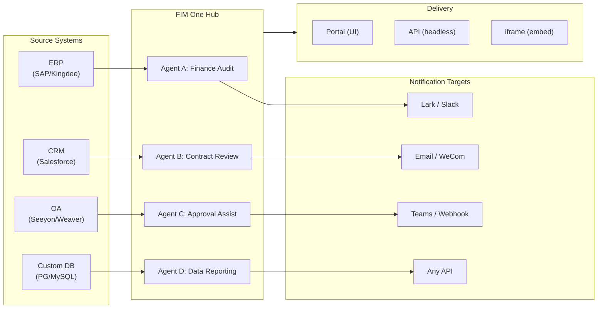

> Goal: Build an **AI-powered Connector Hub** — Standalone (portal assistant), Copilot (embedded in host system), Hub (central cross-system orchestration).
>
> Principles: **Provider-agnostic** (no vendor lock-in), **minimal-abstraction**, **protocol-first**, **connector-first** (integration is the core value).## 製品ビジョン

FIM One は **AI Connector Hub** であり、3つの段階的なモードを提供します：

```
Standalone   → Your own AI assistant (Portal)
Copilot      → AI embedded in a host system (iframe / widget / embed)
Hub          → Central cross-system orchestration (Portal / API)
```

**Hub Mode は主な差別化要因です。** エンタープライズクライアントはレガシーシステム — ERP、CRM、OA、財務、HR — を持っており、これらが AI を通じて相互に通信する必要があります：



**GTM パス：ランド・アンド・エクスパンド**

| ステップ | モード | 実行内容 |
|------|------|-------------|
| Land | Copilot | 1つのシステムに埋め込み、UI 内での価値を実証 |
| Expand | Copilot → Hub | より多くのシステムにロールアウト；Hub がそれらを集約 |## 出荷済みバージョン### v0.1 (2026-02-22) — MVP: ReAct + DAG Planner
- ReActAgent with tools (calculator, python_exec, web_search)
- DAG Planner (LLM generates dependency graphs)
- Portal UI with streaming + KaTeX### v0.2 (2026-02-24) — マルチモデル + メモリ
- リトライ / レート制限 / 使用状況追跡
- ネイティブ関数呼び出し (JSON のみの解析なし)
- マルチモデルサポート (高速 + メイン LLM)
- メモリ: WindowMemory、SummaryMemory
- SSE ストリーミング対応の FastAPI バックエンド### v0.3 (2026-02-25) — Web Tools + MCP
- Web tools (web_search, web_fetch) via Jina/Tavily/Brave
- File operations tool
- MCP client (standard tool integration)
- Tool auto-discovery + categories
- DAG visualization with click-to-scroll
- Code exec in Docker (`--network=none`)### v0.4 (2026-02-25) — マルチターン + エージェント
- マルチターン会話 (DbMemory)
- ツールステップ折りたたみUI
- HTTPリクエスト + シェル実行ツール
- エージェント管理 (作成、設定、公開)
- JWT認証
- エージェントごとの実行モード + 温度制御### v0.5 (2026-02-28) — Full RAG + Grounded Gen
- Full RAG pipeline (embedding + vector store + FTS + RRF + reranker)
- Grounded Generation (citations, conflict detection, confidence scores)
- Knowledge base document management (CRUD, search, retry, schema migration)
- ContextGuard + pinned messages (token budget manager)
- DbMemory persistence + LLM Compact
- DAG Re-Planning (up to 3 rounds)### v0.6 (2026-03-01) — Connector Platform
- **Connector CRUD**: create, read, update, delete
- **ConnectorToolAdapter**: converts Connector → BaseTool
- **Per-user credentials**: AES-GCM encryption
- **Confirmation gate**: write operation approval
- **Audit logging**: all tool calls recorded
- **Circuit breaker**: graceful degradation on failures
- **Utility tools**: email_send, json_transform, template_render, text_utils
- **Embedding options**: Jina, OpenAI, custom providers### v0.7 (2026-03-06) — Admin Platform + Multi-Tenant
- **Admin Platform**: ユーザー管理、ロール切り替え、パスワードリセット、アカウント有効化/無効化
- **招待制登録**: 3つのモード (open/invite/disabled) + 招待コード CRUD
- **ストレージ管理**: ユーザーごとのディスク使用量、クリア、孤立ファイルのクリーンアップ
- **会話モデレーション**: 管理者による一覧表示/削除
- **ユーザーごとの強制ログアウト**: すべてのトークンを無効化
- **API ヘルスダッシュボード**: システム統計、connector メトリクス
- **初回セットアップウィザード**: ガイド付き管理者アカウント作成
- **Personal Center**: ユーザーごとのグローバル指示、言語設定
- **JWT auth**: トークンベースの SSE 認証、会話の所有権
- **Global MCP servers**: 管理者がプロビジョニング、すべてのセッションで読み込み
- **後方互換性**: registration_enabled → registration_mode 自動マイグレーション### v0.7.x (2026-03-07 to 2026-03-12) — 安定性 + ポーランド
- 招待コード管理
- ユーザーごとのクォータ (429 強制)
- 構造化監査ログ
- 機密単語フィルタリング
- 管理者ログイン履歴
- 管理者ファイルブラウザ
- 拡張管理ビュー (model_name、tools、kb_ids フィールド)
- Docker Compose デプロイメント (単一イメージ、名前付きボリューム)
- OAuth 自動検出 (window.location から)
- 拡張思考 / 推論サポート (`LLM_REASONING_EFFORT`、`LLM_REASONING_BUDGET_TOKENS`) OpenAI o シリーズ、Gemini 2.5+、Claude 対応
- 管理者ツール単位の有効/無効 (無効なツールはチャット実行時に除外)
- MCP サーバー管理をコネクタページに移動
- デュアルデータベースサポート: SQLite (ゼロコンフィグデフォルト) + PostgreSQL (本番環境); Docker Compose は PostgreSQL を自動プロビジョニング
- モデル設定ドキュメントページ (プロバイダーごとの拡張思考セットアップ)
- SSE Protocol v2: リアルタイム回答ストリーミング (`delta_reasoning`、`usage` フィールド、`done`/`suggestions`/`title`/`end` イベント分割); SQLite プール サイズ 5 -> 20
- AI Builder 拡張: 7 つの新しいビルダーツール (GetSettings、TestConnection、ImportOpenAPI (コネクタ用); ListConnectors、AddConnector、RemoveConnector、SetModel (エージェント用))、エージェントの `is_builder` フラグ、ビルダープロンプト自動更新、SSRF ガード
- SSE v2 フロントエンド: ストリーミングドットパルスカーソル、DAG 再計画ラウンドスナップショット (折りたたみ可能カード)、DAG レイアウトをステップ状態から分離
- AI Builder コンセプトドキュメントページ (コネクタおよびエージェントビルダーガイド)
- 組織システム: 完全な CRUD とロールベースメンバーシップ (オーナー/管理者/メンバー)、管理者管理 UI
- 3 段階リソース可視性 (個人/組織/グローバル) エージェント、コネクタ、ナレッジベース、MCP サーバー用
- すべてのリソースタイプの公開/非公開 API; 公開エージェントのオーナー委譲
- 管理者設定可視性エンドポイント (クローン・トゥ・グローバルを置き換え); 統一 `build_visibility_filter()` クエリヘルパー
- データベースコネクタ (フェーズ 1-3): PG/MySQL/Oracle/SQL Server + 中国レガシー DB への直接 SQL アクセス; スキーマ内省、AI 注釈、読み取り専用クエリ実行、暗号化された認証情報、コネクタごと 3 つのツール (`list_tables`、`describe_table`、`query`)
- **評価センター**: 定量的エージェント品質ベンチマーク — テストデータセット CRUD (プロンプト + 期待される動作 + アサーション)、評価実行 (並列実行 + LLM グレーダー + ケースごとの合格/不合格/レイテンシ/トークン結果)、自動ポーリング付き結果ビューアー; マイグレーション `r8t0v2x4z567`
- 3 つのモデルロール (General/Fast/Reasoning) (ティアごとの env 設定分離); 高速モデルはメインモデル設定を継承しない
- `StepOutput` データクラス (構造化データとアーティファクト渡し用の通常文字列ステップ結果を置き換え)
- DAG 実行用ツールキャッシュ — 実行ごとの同一ツール呼び出しキャッシュ (非同期ロック スタンピード防止付き) (`DAG_TOOL_CACHE`)
- ステップごとの LLM 検証 (失敗時 1 回再試行) (`DAG_STEP_VERIFICATION`)
- 自動ルーティング: 高速 LLM がクエリを ReAct または DAG として分類; `/api/auto` エンドポイント; フロントエンド 3 方向モード切り替え (`AUTO_ROUTING`)
- [x] ~~**プラットフォーム組織 + リソースサブスクリプション**~~: 組み込みプラットフォーム組織がすべてのユーザーに自動参加; 共有リソース購読用マーケット API; リソースサブスクリプションテーブル; グローバル可視性を置き換える組織ベースのリソース共有
- [x] ~~**エージェント自動検出とサブエージェントバインディング**~~: エージェントの `discoverable` フラグ; `sub_agent_ids` ホワイトリスト; 専門エージェントへのタスク委譲用 CallAgentTool
- [x] ~~**MCP サーバー認証情報 + ユーザーごとのオーバーライド**~~: `mcp_server_credentials` テーブル; `PUT /api/mcp-servers/{id}/my-credentials` エンドポイント; 認証情報フォールバック動作用 `allow_fallback` フラグ
- [x] ~~**コネクタ/KB トグル**~~: `POST /api/connectors/{id}/toggle` および `POST /api/knowledge-bases/{id}/toggle` (リソースの一時停止/再開用)
- [x] ~~**スタンドアロン KB 会話**~~: 会話の `kb_ids` フィールド (エージェントバインディングなしの直接 KB チャット用)## 計画されたバージョン### v0.8 — Connector Declarative Config + Progressive Disclosure

**目標**: Pythonコードを書かずにconnectorを定義しやすくし、LLMに公開されるツールと指示を最適化する。

- [x] ~~**Database connectors**: direct SQL access (PostgreSQL, MySQL, Oracle)~~ *(v0.7.x で提供 — Phase 1-3)*
- [x] ~~**RBAC**: per-user/role connector access control~~ *(v0.7.x で提供 — org system + three-tier visibility)*
- [x] **Connector credential encryption + per-user override**: `connector_credentials` テーブル、`CREDENTIAL_ENCRYPTION_KEY` 経由の Fernet 暗号化、`allow_fallback` フラグ、`GET/PUT/DELETE /my-credentials` エンドポイント、chat ツール読み込み時のユーザーごとの認証情報解決
- [x] **Publish review UI**: Org レベルの公開レビューシステム — org ごとのレビュー切り替え、ReviewsSheet による承認/却下ワークフロー、リソースカードのステータスバッジ、公開ダイアログのレビュー通知、却下されたリソースの再提出
- [ ] **Connector Progressive Disclosure (Phase 1-2)**: 単一の `ConnectorMetaTool` がアクション単位のツールに置き換わる; システムプロンプトは軽量な**スタブ**のみを受け取る（名前 + 1行説明、connector あたり ~30 トークン vs アクション あたり ~250 トークン）; agent は `discover(connector)` を呼び出して完全なアクションスキーマをオンデマンドで読み込む — スキーマはモデルが connector を選択した時のみ読み込まれ、プロンプトプレフィックスをキャッシング用に安定に保つ。Claude Code の `defer_loading: true` 内部パターンをミラーリング。`execute` サブコマンド; 後方互換性のための機能フラグ。
- [ ] **Agent Skill System + Compact Instructions**: agent 指示のオンデマンドスキル読み込み — `Skill` モデル（名前、コンテンツ/SOP、オプションスクリプト）を agent に添付; システムプロンプトで名前のみで参照（スキルあたり ~10 トークン）; agent は `read_skill(name)` を呼び出して完全なコンテンツをオンデマンドで読み込む。会話ごとの指示トークンコストを ~80% 削減しながら、より豊富な SOP ライブラリを可能にする。ConnectorMetaTool のプログレッシブディスクロージャーを指示レベルで適用した対応物。「指令 + 工具 + 技能」の差別化ストーリーを実現。また Agent モデルに `compact_instructions` フィールドを追加 — agent ごとの圧縮優先度リストを圧縮時に `ContextGuard` に注入（例：「注文 ID と金額を保持し、生の API レスポンスを削除」）、現在の静的な汎用プロンプトに置き換わる。Claude Code の Compact Instructions パターンに着想を得た。
- [ ] **YAML/JSON connector config**: プラットフォームが自動的に MCP server を生成
- [ ] **Connector import/export**: connector テンプレートを共有
- [ ] **Connector fork**: 既存の connector をクローン + カスタマイズ
- [ ] **Database connectors Phase 4**: エンタープライズドライバー — Oracle (`oracledb`)、SQL Server (`aioodbc`)、達梦 DM8 (`aioodbc` + DM ODBC)、南大通用 GBase (`aioodbc` + GBase ODBC)
- [ ] **Message push**: Lark、WeCom、Slack、Email 通知アクション
- [x] **Operation audit**: 詳細なログ記録（誰が何をしたか） — admin レビューログ監査タブを追加（org/リソースごとの公開レビュー履歴）
- [ ] **Semantic Schema Annotations**: connector スキーマフィールドを `semantic_tag`、`description`、`pii` フラグで拡張; 注釈を LLM ツール説明に表示して、agent がカラム名から推測することなくフィールド意図を理解できるようにする

**影響**: 実装エンジニア（Python 不要）は 1～2 時間で connector を追加できる。ツール定義と agent 指示のトークンコストは規模に応じて ~80～93% 削減される。### v0.9 — 可観測性 + 本番環境対応

**目標**: 本番環境グレードの運用、デバッグ、監視。**Hook System** を導入 — LLMエージェント命令の下に位置する決定論的な強制レイヤーで、LLMによってオーバーライドできません。

- [ ] **Connector Progressive Disclosure (Phase 3-4)**: 統一された `ConnectorExecutor` インターフェース (API/DB/MCPを1つの抽象化の背後に); `jsonschema` によるアクション パラメータ検証; プロトコル非依存の discover/execute
- [ ] **Agent Trace Layer (Observability++)**: エージェント デバッグ用のアプリケーション レベルの run/trace/thread 階層 — 各会話 → `Trace`、各 LLM 呼び出し / ツール呼び出し / DAG ステップ → input/output/tokens/timing を含む `Span`。タイムラインと展開可能な LLM 呼び出しペイロードを備えたフロントエンド trace ビューアー。これは OTel (インフラストラクチャ レベル) を超えて、開発者とエンタープライズ クライアント向けの実用的なエージェント ループ デバッグを提供します。OpenTelemetry エクスポートをデータ シンク オプションとして提供。LangSmith の run/trace/thread コンセプト (エージェント可観測性の業界検証済みパターン) をモデルにしています。
- [ ] **Metrics ダッシュボード**: レイテンシ、成功率、トークン使用量、connector 呼び出し分析 — エージェント単位、ユーザー単位、組織単位の内訳
- [ ] **Circuit breaker**: 指数バックオフ、障害検出
- [ ] **Agent Hook System**: **LLM ループの外で実行される** 決定論的な強制レイヤー — hooks はツール イベントで自動的に実行され、エージェント命令によってバイパスできません。3つのフック ポイント: `PreToolUse` (実行前の検証 / ブロック)、`PostToolUse` (実行後のサイド エフェクト)、`SessionStart` (動的コンテキストの注入)。組み込み hooks: すべての connector 呼び出しで `ConnectorCallLog` を自動書き込み (現在は手動); 組織が読み取り専用モード時に書き込み操作をブロック; オーバーサイズの DB クエリ結果をエージェントに到達する前に自動トリミング; connector 呼び出し頻度のレート制限。ユーザー定義 hooks: エージェント単位の YAML 設定 (`hooks:` フィールド) で、マッチするツール イベントでトリガーされるシェル コマンドまたは Python 呼び出し可能オブジェクトを宣言 — Claude Code の hooks と同じパターン。主要な設計原則: **hooks は「LLM が実行を覚えていることに決して依存すべきではない『必ず発生する』ロジック」のためのもの**。命令は「すべての呼び出しを記録する」と言う; hooks は実際にそれらを記録します。命令は「読み取り専用モードで書き込みしない」と言う; hooks は実際にそれをブロックします。
- [ ] **Agent Workspace (Tool Output Offloading + Handoff)**: MCP / connector / DB ツール応答がしきい値 (デフォルト: 8K 文字) を超える場合、完全な出力を会話ごとのワークスペース ファイル (`workspace://tool_result_xxx.txt`) に自動保存し、トリミングされたプレビュー + ファイル URI をエージェントに返します。3つの新しい組み込み ツール: 選択的アクセス用の `read_workspace_file(path, start_line, end_line)`、検出用の `list_workspace_files()`、コンテキスト遷移用の `write_handoff(summary)` — エージェントはコンテキスト圧縮またはセッション切り替え前に構造化された HANDOFF ノート (進捗、何が機能したか、何が失敗したか、次のステップ) を書き込み; 次のエージェント インスタンスは圧縮アルゴリズムの要約品質に依存する代わりにそれを読み込みます。Claude Code のワークスペース + handoff パターンをミラーリング。大きな結果セットでの注意散漫を防ぎ、トリミングからのサイレント データ損失を排除します。最小限の変更: `MCPToolAdapter` と `ConnectorToolAdapter` の `truncate_tool_output()` を拡張してワークスペース ストレージに書き込み。
- [ ] **Sandbox 強化**: コード実行分離への v2 改善
- [ ] **Performance テスト**: 同時負荷ベンチマーク
- [ ] **MCP Connection Pooling**: リクエストごとの STDIO サブプロセス生成はスケーリングしません — 100 同時ユーザー = MCP サーバーごとに 100 サブプロセス。STDIO 接続をプール化し、ユーザーごとの env 分離 (`(server_id, env_hash)` でキー化); SSE/HTTP トランスポートは `httpx.AsyncClient` セッションを共有。目標: プール化された STDIO の 100ms 未満のウォーム スタート、ユーザー数に関係なく MCP サーバーごとの O(1) HTTP 接続
- [ ] **Scheduled jobs + Event-triggered Agents (Loop)**: cron のようなバックグラウンド タスク トリガー; `scheduled_jobs` + `job_runs` DB テーブル; APScheduler 統合; job CRUD API + job 履歴 UI; メッセージ プッシュ connector 経由の結果通知。スコープは時間トリガー (cron) とイベント トリガー (webhook インバウンド) の両方のパターンをカバー — バックグラウンドで非同期に実行されるエージェント IS Hub モードの非同期サブエージェント ユースケース。
- [ ] **DB Schema Advanced Builder**: 大規模データベース向けの AI 駆動スキーマ管理エージェント — 戦略的なテーブル注釈 (パターンベース、SQL 実行インフォームド)、ドメイン プレフィックス別の一括可視性管理、1K–7K+ テーブル デプロイメント用の反復的なマルチラウンド注釈; 既存のバッチ注釈ジョブを選択性とビジネス コンテキスト推論で補完

**影響**: FIM One を自信を持ってスケーリングで実行します。3つのアーキテクチャ レイヤーが完成: **Trace Layer** (何が起こったかを確認)、**Hook System** (何が起こるべきかを強制)、**Agent Workspace** (エージェントが独自のデータ アクセスを管理)。これらは「エージェントが従うかもしれない命令」と「システムが強制する保証」の間のギャップを埋めます — デモと本番環境エンタープライズ ツールの違い。### v1.0 — Hot-Plug + Embeddable

**Goal**: Zero-restart connector addition and embedded delivery.

- [ ] **Connector Progressive Disclosure (Phase 5)**: **Semantic-Guided Tool Selection** (entity extraction from query → Ontology Registry lookup → connector set reduction; 90%+ token reduction for 50+ connector deployments); Scale mode for batch/ETL connectors; CLI-style universal `connector <name> <action> <params>` interface
- [ ] **Cross-Connector Entity Alignment (Ontology Registry)**: define shared entity types (Customer, Order, Asset) with field mappings across connectors; DAGPlanner auto-resolves cross-system JOIN keys; enables cross-connector queries (e.g., "customers in Salesforce who ordered in Shopify") without hardcoded field names
- [ ] **Hot-plug connectors**: upload OpenAPI spec, AI generates config, live in 5 minutes (no restart)
- [ ] **Connector marketplace**: community-shared templates
- [ ] **Embeddable widget**: `<script src="fim-one.js">` injected into host page
- [ ] **Page context injection**: widget reads host page context (current ID, URL, DOM selectors)
- [ ] **Advanced triggers**: Webhook inbound events; scheduled job enhancements (multi-timezone, calendar-aware)
- [ ] **Batch execution**: process 1000+ items via DAG
- [ ] **Enterprise security**: IP whitelisting, encryption at rest, SSO
- [ ] **KB Advanced Editor**: Builder-mode agent for power users managing large knowledge bases — bulk URL ingestion, duplicate detection, gap analysis, document lifecycle management; extends existing KB AI chat with ReAct tool loop

**Impact**: Enterprises deploy FIM One from zero to multi-system orchestration in days.## 凍結された機能（リリース済み、メンテナンスのみ）

[直交性戦略](/strategy/orthogonality-strategy)に従い、これらの機能はリリース済みで動作していますが、新しい機能は追加されません（バグ修正のみ）：

| 機能 | バージョン | 凍結理由 |
|---------|---------|-----------|
| ReAct Agent | v0.1 | モデルがネイティブツール呼び出しを備えている |
| DAG Planning / Re-Planning | v0.1, v0.5, v0.7.5 | モデルの推論能力が向上中；分解がシングルショット化。ステップごとの検証がv0.7.5（`DAG_STEP_VERIFICATION`）でリリース済み — 追加の計画プリミティブは計画されていない |
| Memory (Window, Summary, Compact) | v0.2, v0.5 | コンテキストウィンドウが拡大中（200K+）；外部メモリ管理の必要性が低下 |
| RAG pipeline | v0.5 | プロバイダーがネイティブで検索を構築中（OpenAI file_search、Gemini Search Grounding） |
| Grounded Generation | v0.5 | モデルが引用に改善中；5段階パイプラインは収益逓減 |
| ContextGuard / Pinned Messages | v0.5 | 現状のままリリース；新機能なし |## 検討中（無期限延期）

直交戦略に基づき、以下は高い実装コストと吸収リスクに直面しています：

| 機能 | 延期理由 |
|---------|------------|
| マルチエージェントオーケストレーション（深い階層） | プロバイダーがネイティブに構築中（OpenAI Swarm、Claude Code Teams、Google A2A）。FIM Oneの CallAgentTool は1段階の委譲ケースをカバー；イベントトリガー型バックグラウンドエージェントは v0.9 の Scheduled Jobs でカバー |
| エージェント自己修正スキル（手続き型メモリ） | 実行中にエージェント自身が `skill.md` を更新する — 複雑性が高く、セキュリティ/監査の表面積が大きい。Agent Skill System（v0.8）のリリースが先決。エンタープライズ顧客が自己改善エージェントを明示的にリクエストした場合は再評価 |
| ~~エージェントワークスペース（ツール出力ファイルオフロード）~~ | v0.9 に昇格。価値は**選択的読み取り**であり、コンテキスト容量ではない — Claude Code 検証で確認。元の延期理由（「200K+ ウィンドウが緊急性を低下させる」）は誤り |
| クロスセッション長期メモリ | コンテキストウィンドウが急速に拡大中（200K–2M）；プロバイダーがビルトインメモリを追加中（OpenAI memory、Gemini context caching）；実装コストが高い割に差別化価値が低下。エンタープライズ顧客が明示的にリクエストした場合に再評価 |
| メモリライフサイクル（TTL、クォータ） | クロスセッションメモリに依存；一緒に延期 |
| アクティブコンテキスト圧縮ツール（エージェントトリガー型） | ContextGuard（v0.5）で明示的に凍結。200K+ のコンテキストウィンドウが価値を低下させる。コンテキストコストがエンタープライズの主要な懸念事項にならない限り、再検討しない |## バージョンとモードの整合性

| Version | Standalone | Copilot | Hub | Notes |
|---------|-----------|---------|-----|-------|
| **v0.1–v0.3** | Working | Not yet | Not yet | Portal-only, single-user |
| **v0.4** | Working | Not yet | Not yet | Multi-conversation, agent management |
| **v0.5** | Working | Not yet | Not yet | Knowledge base + RAG |
| **v0.6** | Working | Possible | Possible | Connectors ship; Copilot/Hub possible with manual wiring |
| **v0.7** | Working | Ready | Ready | Admin platform; multi-tenant auth; ready for production |
| **v0.8** | Working | Ready | Optimized | RBAC + audit log per-system; easier to onboard |
| **v0.9** | Working | Ready | Production | Observability, performance, hardening |
| **v1.0** | Working | Optimized | Enterprise | Hot-plug, marketplace, scheduled jobs, webhooks, batch |## リソース配分 (v0.8–v1.0)

直交性戦略は、努力がどこに向かうかを形作ります:

| カテゴリ | 配分 | バージョン | 理由 |
|----------|-----------|----------|-----|
| **Connector Platform** (v0.6+) | 50% | 継続中 | コア差別化; 吸収リスクなし |
| **Enterprise Features** (RBAC、監査、セキュリティ、可観測性) | 30% | v0.8–v1.0 | 地味だが耐久性がある; 本番環境要件。Agent Trace Layerは商用アンカー |
| **Agent Intelligence** (Skill System、スケジュール済みエージェント) | 15% | v0.8–v0.9 | 指令+工具+技能 差別化ストーリー; 低吸収リスク — フレームワークはパターンを検証しますが、エンタープライズSOPはカスタマー固有 |
| **v0.1–v0.5 メンテナンス** | 5% | 継続中 | バグ修正のみ; 新機能なし |## メトリック駆動型マイルストーン

成功は以下のメトリクスで測定されます:

| メトリック | v0.7 目標 | v0.8 目標 | v1.0 目標 |
|--------|------------|------------|------------|
| デプロイされた connector | 5 | 20+ | 100+ |
| エンタープライズ顧客 | 1–2 | 5–10 | 20+ |
| 平均 connector セットアップ時間 | 2週間 | 2日 | 5分 (ホットプラグ) |
| トークン効率 (DAG vs ReAct のみ) | 30% 削減 | 40% 削減 | 50% 削減 |
| アップタイム SLA | 99.5% | 99.9% | 99.95% |
| サポートチケットテーマ | 統合、セットアップ | Connector カスタムロジック | ホットプラグ、スケーリング |## 未解決の質問 / TBD

- **Marketplace moderation**: コミュニティコネクタを検証する方法は? (v1.0)
- **Token economics**: マルチユーザー、マルチエージェントシナリオの価格設定方法は? (v1.0)
- **Telemetry opt-out**: プライバシー設定をどのように尊重するか? (v0.8)
- **Connector versioning**: コネクタAPIの破壊的変更をどのように管理するか? (v0.8)
- **Rate limiting**: コネクタごと、ユーザーごと、またはグローバル? (v0.8)