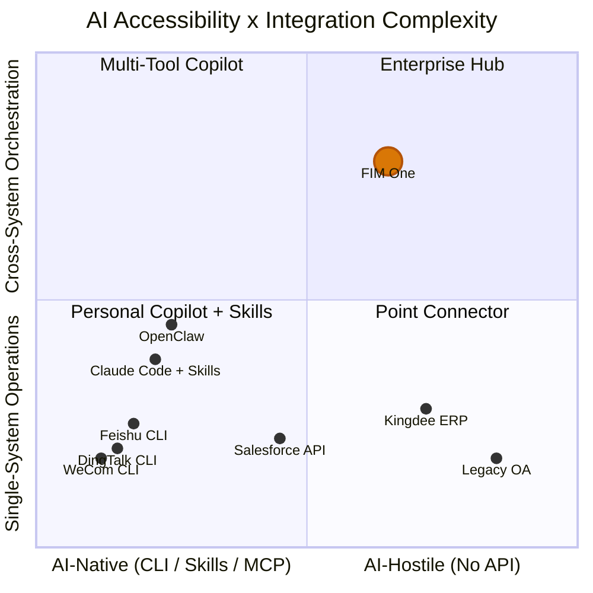

## 2026年3月信号

2026年3月，三个主要的中国工作场所平台在同一周内开源了CLI工具：

- **DingTalk** 发布了 `dws` — 跨12个业务领域的104个工具
- **Feishu/Lark** 发布了 `lark-cli` — 跨11个领域的200+个命令
- **WeCom** 发布了 `wecom-cli` — 覆盖7个业务领域

这三个平台都没有选择MCP。它们都发布了纯CLI工具，通过 `npx skills add` 分发预打包的AI Skills。这是业界首次集体展示AI智能体应该如何与企业系统交互的方式 — 答案不是一个协议，而是一个打包格式。

本文档分析了这对AI系统集成的广泛意义，以及对FIM One战略的具体影响。

## AI システム統合の 3 つのパラダイム

### 1. REST API (従来型)

基本的なアプローチです。すべてのSaaSプラットフォームはOpenAPI仕様で文書化されたHTTPエンドポイントを公開しています。AI統合には、アダプタレイヤーが必要です。つまり、「このAPIエンドポイントをこれらのヘッダーとこのJSONボディで呼び出す」から「ここに智能体が呼び出せるツールがあります」への変換を行うものです。

これが現在FIM OneのConnectorToolAdapterが行っていることです。機能しますが、各統合にはカスタム作業が必要です。APIドキュメントの読み取り、認証の処理、レスポンス形式のマッピング、ページネーションの対応などです。

- **使用者**: すべてのSaaSプラットフォーム、レガシー統合
- **AI統合**: アダプタレイヤー（ConnectorToolAdapter、カスタムコード）が必要
- **強み**: ユニバーサル、よく理解されている、構造化されたJSON I/O
- **弱み**: 各統合にはカスタム開発作業が必要

### 2. CLI + Skills (新興)

プラットフォームはコンパイル済みのCLIバイナリを提供します。AI統合は事前パッケージ化されたSkillファイル（AIIDEにCLIコマンドをsubprocess経由で呼び出す方法を教えるマークダウンドキュメント）を通じて行われます。配布はnpmを通じて行われます：`npx skills add dingtalk/dws`。

AIはSkillファイルを読み取り、利用可能なコマンドとそれが受け取る引数を理解し、CLIをsubprocessとして呼び出します。出力は通常、自由形式のテキスト（テーブル、フォーマット済み文字列）であり、AIがこれを解析する必要があります。

- **使用者**: DingTalk、Feishu、WeCom（すべて2026年3月に選択）
- **AI統合**: `npx skills add platform/cli` — AI IDEはSkillマークダウンを読み取り、CLIコマンドを呼び出す
- **強み**: 出荷が速く、Skills形式をサポートするあらゆるAI IDEで動作
- **弱み**: 非構造化テキスト出力（AIが解析する必要がある）、標準化された検出プロトコルなし、単一プラットフォームスコープ

### 3. MCP (Model Context Protocol)

JSON-RPC over stdio or SSE. 構造化されたツール検出（`tools/list`）と呼び出し（`tools/call`）。AIクライアントはサーバーとの機能をネゴシエートし、すべてのツールに対して型付きスキーマを取得し、構造化された`CallToolResult`レスポンスを受け取ります。

- **使用者**: Anthropicエコシステム、増加中の開発者ツール
- **AI統合**: ネイティブプロトコル — 構造化I/O、スキーマベースの検出
- **強み**: 標準化、構造化、合成可能、マルチツールオーケストレーション向けに構築
- **弱み**: 実装コストが高い、主要なワークプレイスプラットフォームではまだ採用されていない

### 比較

| 次元 | REST API | CLI + Skills | MCP |
|-----------|----------|-------------|-----|
| 標準化 | 中程度 (OpenAPI) | 低い (ベンダー固有のSkills) | 高い (JSON-RPC プロトコル) |
| AI フレンドリー性 | 低い (アダプタが必要) | 中程度 (テキスト I/O、AI により解析) | 高い (構造化 JSON I/O) |
| ディスカバリーメカニズム | OpenAPI spec / ドキュメント | `--help` + Skill マークダウン | `tools/list` プロトコルエンドポイント |
| 出力形式 | 構造化 JSON | 自由形式テキスト (AI 解析が必要) | 構造化 `CallToolResult` |
| リリースまでの時間 | 数週間 (統合ごと) | 数日 (既存 API をラップ) | 数週間 (プロトコル実装) |
| クロスプラットフォームオーケストレーション | ハブが必要 | 組み込みなし | 組み込みなし |
| エンタープライズガバナンス | ハブが必要 | 組み込みなし | 組み込みなし |

## 主要プラットフォームが実際に選択したもの

| | DingTalk `dws` | Feishu `lark-cli` | WeCom `wecom-cli` |
|---|---|---|---|
| Language | Go | Go + Python | Rust + TS |
| Tools | 104 / 12 domains | 200+ / 11 domains | 7 domains |
| MCP support | No | No | No |
| AI integration | Markdown Skills + schema introspection | 19 npm Skills (`npx skills add`) | 12 npm Skills (`npx skills add`) |
| Output formats | JSON / table / raw + `--jq` | JSON / table / csv / ndjson | JSON |
| Agent-friendly flags | `--yes`, `--dry-run`, smart input correction | `--no-wait`, `--as user/bot`, `--dry-run` | Direct JSON params |
| Discovery | `dws schema` (self-introspection) | `lark-cli schema` (self-introspection) | Via Skill files only |

主な観察: `npx skills add` はAIツール統合の事実上の配布チャネルになりつつあり、MCPを完全に迂回しています。これらのプラットフォームはプロトコル標準化よりも出荷速度を優先しました。AI IDE エコシステム (Cursor、Claude Code、Windsurf) は既に Skills ファイルを理解しているため、プラットフォームはプロトコルサーバーを実装することなく、即座に AI 統合を実現できます。

## AI アクセシビリティ スペクトラム

すべてのシステムが AI にとって同じくらい到達しやすいわけではなく、すべてのタスクが同じくらい単純なわけではありません。これら 2 つの次元が、異なる統合アプローチがどこで価値を生み出すかを定義します。

**チャートの読み方:**

- **左下 (Personal Copilot + Skills)**: シンプルな操作を備えた AI ネイティブ プラットフォーム。DingTalk、Feishu、WeCom はここに集約されます。独自の CLI + Skills を提供しており、単一プラットフォームの AI 統合をセルフサービスにしています。OpenClaw や Claude Code with Skills などのパーソナル コパイロットがこのゾーンを占めています。FIM One はここではほとんど価値を追加しません。プラットフォームはすでに作業を完了しています。
- **左上 (Multi-Tool Copilot)**: クロスシステム ニーズを備えた AI ネイティブ プラットフォーム。複数の Skills (`dingtalk` + `feishu` + `wechat`) を Claude Code にインストールするユーザーはマルチプラットフォーム調整を試みることができますが、ガバナンス、オーケストレーション計画、統一された認証情報管理が不足しています。
- **右下 (Point Connector)**: シンプルなブリッジが必要なレガシー システム。Kingdee ERP またはレガシー OA システムへの単一 Connector。FIM One は、単一システムの操作であっても、これらのシステムに CLI がなく、API が限定的またはない場合があるため、アダプターとして有用です。
- **右上 (Enterprise Hub)**: クロスシステム オーケストレーション要件を備えたレガシー システムまたは API 制限システム。これが FIM One の得意分野です。レガシー管理システム全体でコントラクトをクエリし、ERP 売掛金と相関させ、DingTalk 経由で回収通知を送信する。これには DAG 計画、マルチコネクタ調整、認証情報ボルト、監査証跡、および人間による確認ゲートが必要です。パーソナル コパイロット、CLI、Skills ファイルではここに到達することはできません。

FIM One の価値は、右上に向かって移動するにつれて増加します。到達しにくいシステムと、より複雑なオーケストレーション ニーズの組み合わせです。独自の CLI + Skills を提供するプラットフォームは反対の角を占めています。到達しやすく、シンプルな操作です。これは FIM One が追求すべきではない市場を表しています。

## パーソナルコパイロット対エンタープライズハブ

個人用AI copilot（OpenClaw、Claude Code、Cursor、Windsurf）の急増により、ポジショニングの問題が生じています。2つの根本的に異なるモデルが存在します：

### パーソナルコパイロット

- **ユーザー**: 個人開発者またはナレッジワーカー
- **データスコープ**: 自分のカレンダー、自分のメール、自分のドキュメント
- **認証**: 個人トークン、個人のOAuthセッション
- **統合スコープ**: 単一ユーザー、少数のプラットフォーム、個人の生産性向上
- **ガバナンス**: 不要 — 自分のデータ、自分のアクション

### エンタープライズ コネクタ ハブ

- **ユーザー**: 組織（チーム、部門、クロスファンクショナルワークフロー）
- **データ スコープ**: 部門横断、システム横断、機密および規制対象データを含む
- **認証**: 管理者割り当てのアクセス許可、最小権限の原則、認証情報の保管
- **統合スコープ**: マルチシステム オーケストレーション、ビジネス プロセス自動化
- **ガバナンス**: 監査ログ、RBAC、確認ゲート、コンプライアンス要件

これらは競合ではなく、補完的です。個人用コパイロットが増殖するにつれて、企業はそれらのコパイロットがアクセスできるものを管理するための中央ハブが必要になります。Claude Code で `npx skills add dingtalk/dws` を使用している個人は、自分の DingTalk メッセージを読むことができます。しかし、AI 智能体が DingTalk、企業 ERP、および財務システム全体をオーケストレーションする必要がある場合 — 監査証跡、アクセス許可制御、および書き込み操作の人間による確認を伴う — それは完全に異なる問題です。

個人用コパイロットは単純なシングルプラットフォーム操作を商品化します。これは FIM One のマーケットではありません。FIM One のマーケットは、個人用コパイロットが処理できないクロスシステム、ガバナンス必須、レガシー対応のエンタープライズ統合です。

## FIM Oneの戦略的含意

| 優先度 | アクション | 根拠 |
|----------|--------|-----------|
| 現在の方針を維持 | Connector アーキテクチャへの投資を継続（レガシー/API システム向け） | これが競争優位性 — CLI + Skills はレガシーシステムに到達できない |
| MCP を採用 | MCP Server サポートはすでに構築済み（MCPServerMetaTool） — 磨き続ける | MCP は構造化プロトコルへの賭け；いずれ一部プラットフォームが採用する |
| Skills を監視 | `npx skills add` エコシステムを追跡するが、追従しない | Skills は配布の問題を解決するが、FIM One にはその問題がない |
| ガバナンスで差別化 | 監査、RBAC、確認ゲート、認証情報管理 | パーソナルコパイロットはエンタープライズガバナンスを提供できない |
| ポジショニングを明確に | 「システムと AI が出会うハブ」— 「DingTalk を呼び出すもう一つの方法」ではない | プラットフォームが無料で提供する単純な統合での競争を回避 |

最悪の戦略的判断は、CLI + Skills の波に反応して、すでに独自のものを提供しているプラットフォーム向けの Skills アダプターを構築することです。これはプラットフォームベンダー自体との競争で底辺への競争になります。正しい対応は、それらのベンダーが到達できないシステムに焦点を当て続けることです。

## CLI、Skills、MCP の関係

これら3つの概念は異なるレイヤーで動作し、議論の中でしばしば混同されます。正確な区別は以下の通りです：

- **CLI** はユーザーインターフェース — シェルコマンド、テキストI/O、システムと相互作用するための形式
- **Skills** は配布メカニズム — AI に CLI コマンドの呼び出し方法を教えるマークダウンファイル、AI ツール統合のパッケージング形式
- **MCP** はプロトコル — JSON-RPC、構造化された検出と呼び出し、AI とツール間の通信の相互運用性標準

長期的には、これらは互いに代替可能ではありません。CLI は人間（または AI サブプロセス）がツールと相互作用する方法です。Skill ファイルは、その CLI が AI IDE に配布される方法です。MCP は、プロトコルレベルで構造化された、スキーマ型の、合成可能な統合がどのように機能するかです。

しかし、短期的には（2026年）、CLI + Skills は MCP よりも実装が安いため、採用速度で勝っています。既存の CLI を持つプラットフォームは、1日で Skill ファイルを提供できます。MCP サーバーの実装には数週間かかり、プロトコル仕様、トランスポートレイヤー、および機能ネゴシエーションの理解が必要です。

起こりうる収束：今日 CLI を提供するプラットフォームは、明日それらを MCP サーバーとしてラップするかもしれません。MCP の stdio トランスポートは既に CLI プロセスを起動します — 「Skills によって呼び出される CLI」と「MCP サーバーとしてラップされた CLI」の間のギャップは小さいです。しかし、この収束は保証されていません。Skills エコシステムが十分に速く成長し、AI IDE がそれを標準化した場合、MCP は企業ツール標準ではなく、開発者ツールプロトコルのままかもしれません。

FIM One にとって、結論は明確です：プロトコルレイヤー（MCP）とガバナンスレイヤー（Connector アーキテクチャ）に投資し、配布レイヤー（Skills）には投資しないこと。配布はプラットフォームベンダーにとって解決済みの問題です。プロトコルとガバナンスは、ハブが永続的な価値を生み出す場所です。
