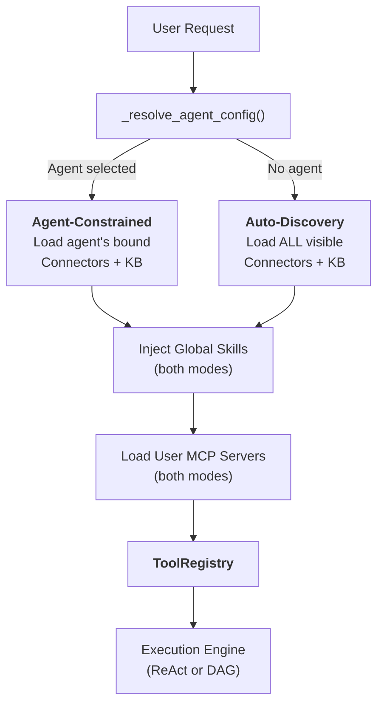
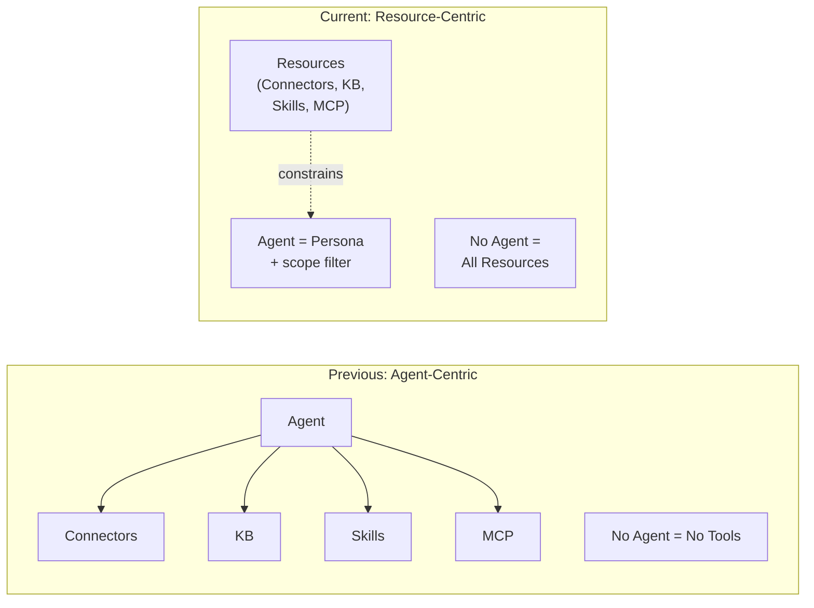
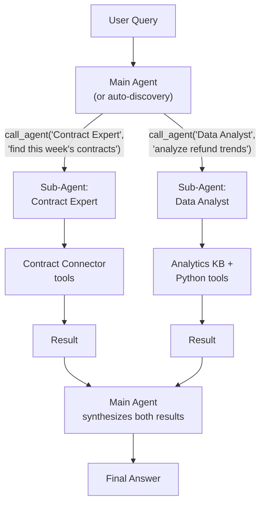
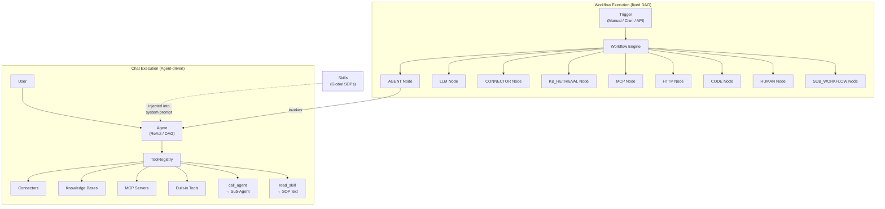

## 두 가지 모드

FIM One의 모든 채팅 요청은 하나의 질문으로 시작됩니다: **에이전트가 선택되었는가?** 이 답변에 따라 리소스(커넥터, 지식 베이스, 스킬, MCP 서버)가 어떻게 발견되고 LLM이 사용할 수 있는 도구 세트로 조립되는지가 결정됩니다.

**에이전트 제약 모드**는 사용자가 특정 에이전트를 선택할 때 활성화됩니다. 시스템은 해당 에이전트가 명시적으로 구성된 리소스만 로드합니다:

- **커넥터**: 에이전트의 바인딩된 `connector_ids`만 도구로 로드됩니다.
- **지식 베이스**: 에이전트의 바인딩된 `kb_ids`만 검색 도구로 주입됩니다.
- **스킬**: 전역적으로 사용 가능 — 사용자가 볼 수 있는 모든 활성 스킬이 주입됩니다. 스킬은 조직의 SOP이지 에이전트별 지식이 아니기 때문입니다. (아래의 [전역 SOP로서의 스킬](#skills-as-global-sops) 참조)
- **MCP 서버**: 항상 사용자 범위 — 사용자가 볼 수 있는 모든 활성 MCP 서버가 두 모드 모두에서 로드됩니다.
- **지시사항**: 에이전트의 `instructions` 필드는 시스템 프롬프트에 주입되는 페르소나와 행동 지침을 정의합니다.

**전역 자동 발견 모드**는 에이전트가 선택되지 않았을 때(예: 새 채팅) 활성화됩니다. 시스템은 사용자가 접근 가능한 모든 것을 자동으로 발견합니다:

- **커넥터**: 사용자가 볼 수 있는 모든 커넥터(개인 + 조직 공유 + 마켓 구독)가 로드됩니다.
- **지식 베이스**: 접근 가능한 모든 KB는 `kb_retrieve`를 통해 검색에 사용 가능합니다.
- **스킬**: 사용자가 볼 수 있는 모든 활성 스킬이 SOP 스텁으로 주입됩니다.
- **MCP 서버**: 에이전트 제약 모드와 동일 — 사용자가 볼 수 있는 모든 활성 서버입니다.
- **지시사항**: 일반적인 어시스턴트 페르소나가 사용됩니다.

분기는 모든 채팅 요청에서 호출되는 `_resolve_tools()` 내부에서 발생합니다:



실제 효과: 사용자는 에이전트를 구성하지 않고도 즉시 채팅을 시작할 수 있습니다. 시스템은 사용 가능한 리소스를 발견하고 도구로 노출합니다. 에이전트를 선택하면 범위가 좁혀집니다 — 새로운 기능을 잠금 해제하는 것이 아니라 기존 기능에 초점을 맞춥니다.

### 각 모드가 발견하는 것

두 모드는 **범위**에서 다르지만 종류에서는 다르지 않습니다. 둘 다 `ToolRegistry`를 생성합니다 — 단지 다르게 채울 뿐입니다.

**자동 발견 모드 (에이전트 미선택):**

| 리소스 | 발견 | 도구 형식 |
|---|---|---|
| 커넥터 (API) | `resolve_visibility()` — 사용자에게 모두 표시 | `ConnectorMetaTool` (점진적) |
| 커넥터 (DB) | `resolve_visibility()` — 사용자에게 모두 표시 | 스키마당 개별 DB 도구 |
| 지식 베이스 | 모든 접근 가능한 KB | `kb_retrieve` |
| 스킬 | `resolve_visibility()` — 모두 활성 | `read_skill` (점진적 스텁) |
| MCP 서버 | `resolve_visibility()` — 모든 사용자 표시 | `{server}__{tool}` |
| 에이전트 | `resolve_visibility()` — 모두 활성, 빌더 제외 | `call_agent` (카탈로그) |
| 기본 제공 도구 | `discover_builtin_tools()` — 전체 집합 | 카테고리 필터 미적용 |

**에이전트 제약 모드 (에이전트 선택):**

| 리소스 | 발견 | 도구 형식 |
|---|---|---|
| 커넥터 | `agent.connector_ids`만 | `ConnectorMetaTool` 또는 레거시 작업별 |
| 지식 베이스 | `agent.kb_ids`만 | `GroundedRetrieveTool` / `KBRetrieveTool` |
| 스킬 | 전역 — **에이전트로 제약되지 않음** | `read_skill` |
| MCP 서버 | 사용자 범위 — **에이전트로 제약되지 않음** | `{server}__{tool}` |
| 에이전트 | 전역 — `call_agent` 항상 사용 가능 | `call_agent` |
| 기본 제공 도구 | `agent.tool_categories` 필터 | 카테고리별 부분집합 |

핵심 비대칭성: 커넥터와 지식 베이스는 에이전트로 범위가 지정되지만, 스킬, MCP 서버, CallAgent는 항상 전역입니다. 이는 설계 의도를 반영합니다 — 스킬은 조직 규칙(모두가 동일한 SOP를 따름)이고, 커넥터와 KB는 기능 바인딩(다른 에이전트가 다른 시스템에 연결)입니다.

## 모든 것이 도구입니다

LLM 수준에서 모든 리소스 유형은 호출 가능한 도구의 평면 목록으로 수렴됩니다. LLM은 커넥터, MCP 서버 또는 Knowledge Base를 호출하는지 여부에 대한 구조적 인식이 없습니다. `ToolRegistry` — 이름, 설명 및 매개변수 스키마가 있는 함수 집합을 봅니다.

| 리소스 유형 | LLM 수준에서의 형태 | 도구 이름 패턴 |
|---|---|---|
| Connector (점진적) | 단일 메타 도구 | `connector` |
| Connector (레거시) | 작업당 N개 도구 | `{connector}__{action}` |
| MCP Server | 서버당 N개 도구 | `{server}__{tool}` |
| Knowledge Base | 검색 도구 | `kb_retrieve` 또는 `grounded_retrieve` |
| Skill (점진적) | 읽기 도구 + 시스템 프롬프트 스텁 | `read_skill` |
| Skill (인라인) | 시스템 프롬프트 텍스트만 | _(도구 없음)_ |
| 에이전트 자체 | 도구로 표시되지 않음 | _(지시사항 + 도구 조립)_ |

핵심 통찰: **에이전트는 도구가 아니라 도구를 사용하는 엔티티입니다.** 에이전트는 시스템 프롬프트에 지시사항을 제공하고 사용 가능한 도구를 결정합니다. 하지만 LLM의 관점에서는 "에이전트" 개념이 없습니다 — 시스템 프롬프트와 호출 가능한 함수 집합만 있습니다.

이러한 균일성이 시스템을 확장 가능하게 만드는 것입니다. 새로운 리소스 유형을 추가하는 것은 `Tool` 프로토콜(`name`, `description`, `parameters_schema`, `run()`)을 구현하는 것을 의미합니다. 실행 엔진, 컨텍스트 관리 및 LLM 상호작용 계층은 변경되지 않습니다.

## 글로벌 SOP로서의 스킬

스킬은 에이전트 위의 계층을 차지합니다. 이들은 선택된 에이전트가 무엇이든 상관없이 모든 에이전트가 따라야 하는 조직 정책 및 절차입니다.

### 스킬이 에이전트에 바인딩되지 않는 이유

"고객 불만 처리 SOP"와 같은 스킬은 고객과 상호작용하는 모든 에이전트에 적용됩니다. 스킬을 에이전트에 바인딩하면 양방향 소유권 문제가 발생합니다: 스킬이 에이전트를 조율하고 에이전트가 스킬을 소유한다면, 누가 누구를 제어합니까?

스킬은 설계상 전역적입니다 — 이들은 회사 규칙이지 에이전트별 지식이 아닙니다. `_resolve_tools()` 함수는 에이전트 선택과 관계없이 사용자에게 표시되는 모든 활성 스킬을 로드하며, 다른 리소스에 사용되는 것과 동일한 `resolve_visibility()` 필터를 사용합니다.

### 두 가지 주입 모드

스킬은 `SKILL_TOOL_MODE` (환경) 또는 에이전트의 `model_config_json.skill_tool_mode`로 제어되는 두 가지 주입 전략을 지원합니다:

| 모드 | 시스템 프롬프트 | 도구 | 사용 시기 |
|---|---|---|---|
| **Progressive** (기본값) | 이름 + 설명 스텁만 | `read_skill(name)`은 필요 시 전체 콘텐츠를 로드 | 많은 스킬 또는 큰 콘텐츠의 스킬 — 컨텍스트 토큰 절약 |
| **Inline** | 전체 스킬 콘텐츠 포함 | 없음 | 적은 수의 작은 스킬 — 도구 호출 오버헤드 없음 |

프로그레시브 모드에서 시스템 프롬프트는 다음과 같은 간결한 스텁을 포함합니다:

```
## Available Skills
Call read_skill(name) to load full content before executing any of these:
- **Customer Complaint SOP**: Handle escalations per company policy...
- **Refund Processing**: Step-by-step refund workflow...
```

LLM은 전체 절차가 필요할 때만 `read_skill("Customer Complaint SOP")`를 호출하여 관련 없는 턴 동안 컨텍스트를 간결하게 유지합니다.

## 에이전트를 컨테이너가 아닌 페르소나로

FIM One의 아키텍처는 에이전트 중심 모델에서 리소스 중심 모델로의 의도적인 전환을 반영합니다.

**이전 모델:** 에이전트는 모든 리소스에 대한 접근을 제어하는 컨테이너였습니다. 에이전트를 선택하지 않으면 커넥터, 스킬, 특화된 KB가 없었습니다. 에이전트는 모든 기능에 대한 필수 진입점이었습니다.

**현재 모델:** 에이전트는 페르소나입니다 — 지시사항과 행동 지침의 집합 — 선택적 리소스 제약과 결합됩니다. 리소스는 에이전트와 독립적으로 존재합니다. 에이전트를 선택하면 범위가 좁혀지고, 선택하지 않으면 완전히 열립니다.



이는 다음을 의미합니다:

- **사용자는 에이전트를 구성하지 않고도 즉시 채팅을 시작할 수 있습니다.**
- **시스템은 사용 가능한 리소스를 자동으로 발견**하고 도구로 노출합니다.
- **에이전트는 경량 페르소나가 됩니다** — 지시사항을 작성하고 선택적으로 특정 커넥터와 KB를 바인딩하기만 하면 빠르게 생성할 수 있습니다.
- **리소스 관리는 에이전트 관리와 분리됩니다.** 조직에 커넥터를 게시하면 자동 발견 모드, 에이전트 바인딩 드롭다운, 하위 에이전트 도구 해석에서 모든 곳에서 사용할 수 있게 됩니다.

## 멀티 에이전트 오케스트레이션

FIM One은 `CallAgentTool`을 통해 전문 에이전트에게 작업을 위임하는 것을 지원합니다. 이를 통해 부모 에이전트(또는 자동 발견 모드)가 집중된 작업을 위해 하위 에이전트를 호출할 수 있습니다.

### 에이전트 카탈로그

런타임에 사용자에게 보이는 모든 활성, 비빌더 에이전트는 카탈로그로 조립됩니다. 각 에이전트의 이름과 설명은 `call_agent` 도구의 매개변수 스키마에 나열되어 있으므로, LLM이 의미론적으로 올바른 전문가를 선택할 수 있습니다 — 하드코딩된 라우팅 없이.

### 전체 도구 상속

`call_agent(agent_id, task)`를 통해 하위 에이전트가 호출되면, 자신의 구성에서 구축된 완전한 `ToolRegistry`를 받습니다 — 바인딩된 커넥터, KB 및 기본 제공 도구를 포함합니다. 하위 에이전트는 텍스트 전용 조언자가 아닌 완전한 실행 단위입니다.

### 일단계 위임

무한 재귀를 방지하기 위해 하위 에이전트는 `call_agent` 도구를 받지 않습니다. 위임은 항상 일단계 깊이입니다: 부모가 자식을 호출하고, 자식이 실행하여 결과를 반환합니다. 부모는 여러 하위 에이전트의 결과를 종합합니다.

### 병렬 실행

네이티브 함수 호출 모드에서 LLM은 단일 턴에서 여러 `call_agent` 호출을 실행할 수 있습니다. 이들은 `asyncio.gather`를 통해 동시에 실행되어 "세 개의 소스를 동시에 검색"과 같은 패턴을 가능하게 합니다.



## 가시성 모델

모든 리소스 검색 — 두 모드 모두에서 — 은 세 가지 계층의 통합 가시성 모델에 의해 관리됩니다:

| 계층 | 설명 | 예시 |
|---|---|---|
| **Own** | 사용자가 생성한 리소스. 항상 표시됨. | 팀의 API를 위해 구축한 커넥터 |
| **Organization-shared** | 사용자의 조직에서 `visibility: "org"`인 리소스. 승인된 모든 조직 구성원에게 표시됨. | IT에서 게시한 회사 전체 ERP 커넥터 |
| **Market-subscribed** | FIM One Market에서 설치한 리소스. 구독자에게 표시됨. | 설치한 커뮤니티 기반 Slack 커넥터 |

`web/visibility.py`의 `resolve_visibility()` 함수는 세 가지 계층을 모두 단일 쿼리에 포함하는 SQL 필터를 구축합니다:

```python
conditions = [
    model.user_id == user_id,                    # own resources
    and_(model.visibility == "org",              # org-shared
         model.org_id.in_(user_org_ids),
         or_(model.publish_status == None,
             model.publish_status == "approved")),
    model.id.in_(subscribed_ids),                # Market-subscribed
]
```

이 동일한 필터는 모든 곳에서 사용됩니다:

- 에이전트 없음 모드에서 커넥터 자동 검색
- `CallAgentTool`을 위한 에이전트 카탈로그 구축
- 시스템 프롬프트 주입을 위한 표시 가능한 스킬 로드
- MCP 서버 해석
- 에이전트 구성 조회 (사용자가 자신에게 표시되는 에이전트만 선택할 수 있도록 보장)

이러한 균일성은 **조직에 커넥터를 게시하면 자동 검색 모드, 에이전트 바인딩 드롭다운, 하위 에이전트 도구 해석에서 자동으로 사용 가능해진다**는 의미입니다 — 특별한 연결이 필요하지 않습니다. 가시성 모델은 "이 사용자가 접근할 수 있는 것이 무엇인가"에 대한 단일 정보 소스입니다.

## 관계도

FIM One은 두 가지 병렬 실행 패러다임 — **Chat (에이전트 기반)** 과 **Workflow (DAG 기반)** — 을 가지고 있으며, 이들은 동일한 기본 리소스를 공유하지만 다르게 조율합니다.



다이어그램의 주요 내용:

- **에이전트와 워크플로우는 병렬 패러다임입니다.** 둘 다 커넥터, 지식 베이스, MCP 서버를 사용할 수 있습니다 — 하지만 다른 메커니즘을 통해 사용합니다. 에이전트는 이들을 `ToolRegistry`의 도구로 사용하고, 워크플로우는 이들을 타입이 지정된 DAG 노드로 사용합니다.
- **워크플로우는 에이전트를 조율할 수 있습니다.** `AGENT` 노드를 통해 — 워크플로우 단계는 자체 ReAct/DAG 루프를 가진 전체 에이전트를 호출할 수 있습니다. 역은 성립하지 않습니다: 에이전트는 워크플로우를 직접 호출할 수 없습니다 (API/웹훅 트리거를 통해서만 간접적으로 가능).
- **스킬은 에이전트에만 주입됩니다.** 스킬은 시스템 프롬프트 텍스트입니다 — 에이전트 동작을 안내합니다. 워크플로우는 스킬을 사용하지 않습니다. 왜냐하면 워크플로우 노드는 결정론적 로직을 실행하고, LLM 기반 추론을 하지 않기 때문입니다.
- **공유 리소스, 다른 접근 패턴.** 커넥터는 에이전트에 의해 호출될 수 있고 (`ConnectorToolAdapter`를 통해), 워크플로우에 의해 호출될 수 있고 (`CONNECTOR` 노드를 통해), 또는 동일한 비즈니스 프로세스에서 둘 다에 의해 호출될 수 있습니다 — 예를 들어, 워크플로우가 에이전트를 트리거하고 그 에이전트가 워크플로우가 나중 단계에서도 사용하는 동일한 커넥터를 쿼리합니다.

## Workflow Engine — 다른 실행 패러다임

이 문서는 에이전트 기반 채팅 실행에 중점을 두지만, FIM One에는 완전한 **Workflow Engine** — 고정 프로세스 자동화를 위한 26가지 노드 타입의 시각적 DAG 편집기가 포함되어 있습니다.

| 측면 | 에이전트 (채팅) | Workflow |
|---|---|---|
| 오케스트레이션 | LLM이 다음 단계를 동적으로 결정 | 설계 시점에 정의된 고정 DAG |
| 최적 용도 | 탐색적 작업, 대화, 유연한 추론 | 승인 체인, 예약된 ETL, 다단계 자동화 |
| 호출 가능 | 커넥터, KB, MCP, 내장 도구, 하위 에이전트, 스킬 | 에이전트, 커넥터, KB, MCP, LLM, HTTP, 코드, 인간 승인, 하위 Workflow |
| 트리거 | 채팅의 사용자 메시지 | 수동, cron 일정, 또는 API/webhook |
| 중첩 | 1단계 위임 (상위 → 하위 에이전트) | SUB_WORKFLOW 노드를 통한 임의의 DAG 깊이 |

두 패러다임은 상호 보완적입니다. 작업이 개방형일 때 에이전트를 사용하세요("이번 분기 판매 데이터를 분석하고 조치를 권장하세요"). 프로세스가 알려져 있을 때 Workflow를 사용하세요("매주 월요일에 ERP에서 새 송장을 가져오고, 규정 준수 검사를 실행하고, 예외를 인간 검토자에게 라우팅하세요"). Workflow는 고정 파이프라인 내에서 유연한 추론이 필요한 모든 단계에 대해 에이전트를 호출할 수 있습니다.

에이전트 실행 모드 및 Workflow 노드 타입에 대한 자세한 내용은 [실행 모드](/concepts/execution-modes)를 참조하세요.
