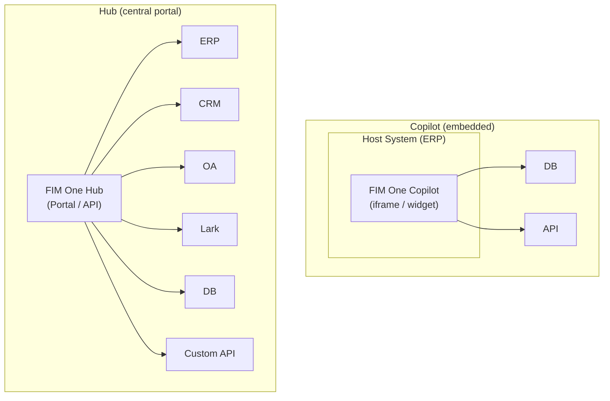
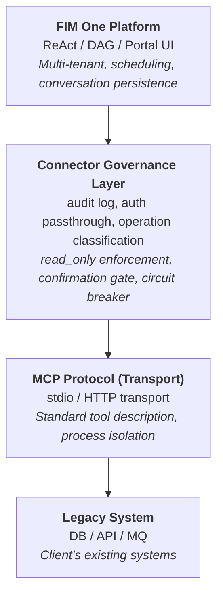
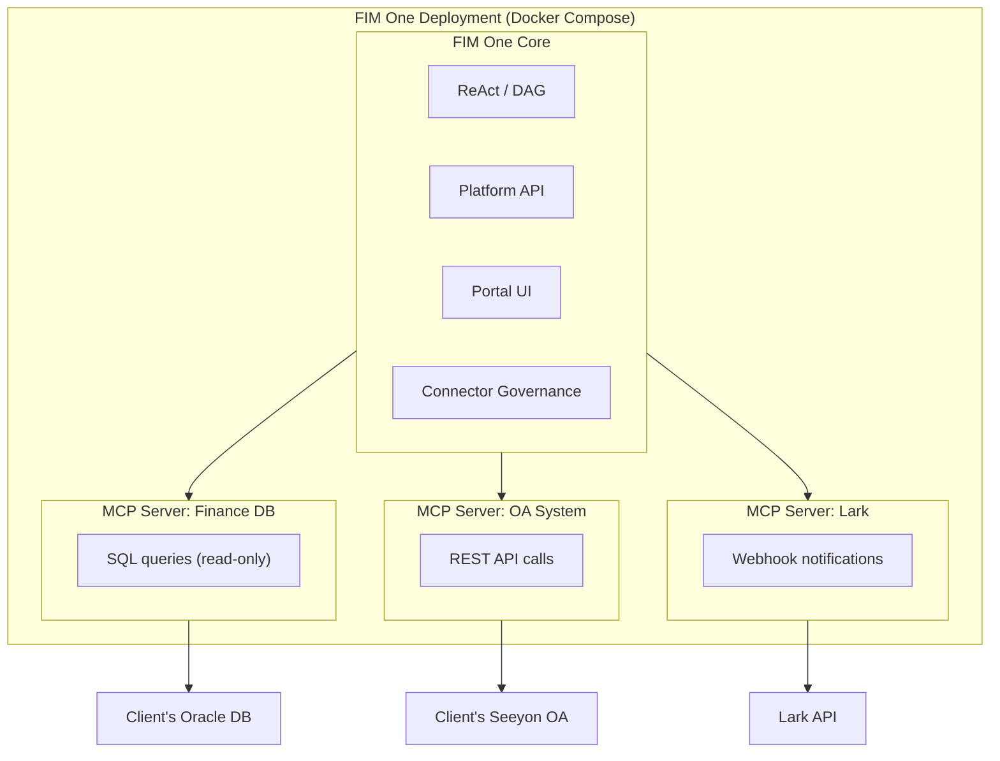
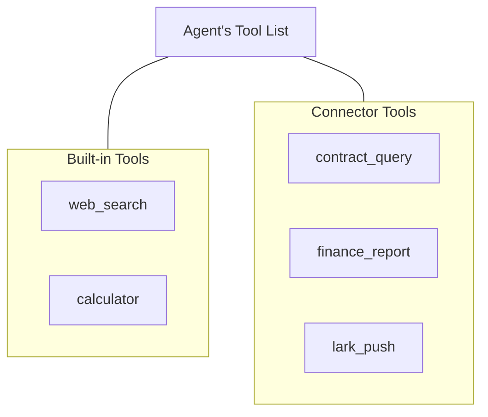
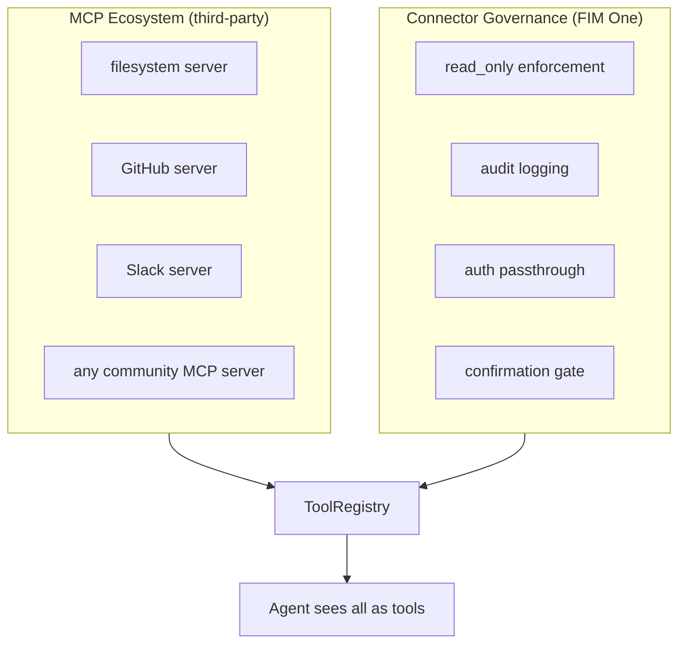

---
title: "커넥터 아키텍처"
description: "FIM One이 AI를 통해 레거시 시스템을 연결하는 방식 — Copilot에서 Hub까지."
---## Copilot vs Hub

아키텍처는 두 가지 통합 규모를 지원합니다:



**Copilot**은 호스트 시스템의 UI에 임베드됩니다. 사용자는 익숙한 인터페이스를 떠나지 않고 AI와 상호작용합니다. 여러 커넥터(호스트 DB + 알림 서비스 등)를 사용할 수 있습니다.

**Hub**는 모든 시스템을 연결하는 독립형 포털입니다. 단일 시스템에 임베드되지 않으며, 시스템과 AI가 만나는 중앙 인텔리전스 계층입니다.

동일한 커넥터 아키텍처, 다른 전달 방식. Copilot은 Hub와 동일한 `ConnectorToolAdapter`를 사용합니다.## 핵심 원칙

**클라이언트는 코드를 변경하지 않습니다.** FIM One은 그들의 시스템에 능동적으로 연결되어 데이터베이스를 읽고, API를 호출하고, 메시지 버스에 푸시합니다. 클라이언트는 자격 증명과 네트워크 액세스만 제공합니다.## 3계층 아키텍처



각 계층은 고유한 책임을 가집니다:

| 계층 | 담당 | 변경 시기... |
|---|---|---|
| **Platform** | 오케스트레이션, 멀티테넌트, UI | 새로운 플랫폼 기능 출시 |
| **Connector Governance Layer** | 엔터프라이즈 거버넌스 정책 | 보안/규정 준수 요구사항 변경 |
| **MCP Protocol** | 전송, 도구 인터페이스 표준 | 절대 변경 없음 (개방형 표준) |
| **Legacy System** | 비즈니스 데이터 및 로직 | 절대 변경 없음 (그것이 핵심) |## MCP를 전송 계층으로 사용하는 이유

어댑터는 **MCP 서버**로 구현됩니다. 이는 의도적인 아키텍처 선택입니다:

- **재사용성**: FIM One은 이미 MCP Client(v0.3)를 포함하고 있습니다. 레거시 시스템 어댑터를 추가하는 것은 MCP 도구를 추가하는 것과 동일한 인프라를 재사용합니다.
- **표준 프로토콜**: MCP는 개방형 표준입니다. 발명하거나 유지할 독점 프로토콜이 없습니다.
- **에코시스템**: 타사 MCP 서버(데이터베이스, API, SaaS 도구)가 즉시 작동합니다.
- **프로세스 격리**: 각 MCP 서버는 별도의 프로세스로 실행됩니다. 오작동하는 어댑터가 플랫폼을 중단시킬 수 없습니다.### MCP 단독으로 제공하지 않는 것

**Connector Governance Layer**는 원본 MCP가 부족한 엔터프라이즈 거버넌스를 추가합니다:

| 관심사 | MCP | Connector Governance Layer |
|---|---|---|
| 읽기 전용 적용 | 아니오 | 작업에 `read_only` 플래그; 기본적으로 쓰기 차단 |
| 감사 로깅 | 아니오 | 모든 도구 호출 기록 (타임스탬프, 사용자, 도구, 매개변수, 결과) |
| 인증 통과 | 아니오 | 프록시 호스트 시스템 인증; 에이전트가 로그인한 사용자를 대신하여 작동 |
| 확인 게이트 | 아니오 | 쓰기 작업에 인간 승인 필요 (SSE `confirmation_required`) |
| 서킷 브레이커 | 아니오 | 연결 실패 시 우아한 성능 저하 트리거 |
| 작업 분류 | 아니오 | 읽기/쓰기/관리자 수준별 정책이 있는 작업 태그 지정 |### 왜 커스텀 프로토콜을 만들지 않는가

프로토콜은 상품화된 기술입니다. 기술적 가치는 어댑터 자체(도메인 지식, 스키마 매핑, 엣지 케이스 처리)와 거버넌스 계층(감사, 인증, 안전성)에 있습니다. 전송 프로토콜을 새로 만드는 것은 기능을 추가하지 않으면서 유지보수 비용만 증가시킵니다. Stripe는 HTTPS를 사용하고, Docker는 cgroups를 사용하며, FIM One은 MCP를 사용합니다.## 배포 모델

모든 것이 단일 Docker Compose 배포에서 실행됩니다. 클라이언트는 아무것도 설치하지 않습니다.



<Note>
모두 FIM One에서 제공합니다. 클라이언트는 다음만 제공합니다:
- 데이터베이스 자격증명(읽기 전용 계정 권장)
- API 엔드포인트 및 키(사용 가능한 경우)
- 네트워크 화이트리스트 액세스
</Note>

**액세스 계층**: FIM One은 클라이언트가 제공할 수 있는 모든 액세스에 맞게 조정됩니다:

| 클라이언트가 보유한 것 | FIM One 연결 방식 |
|---|---|
| 문서가 있는 API | HTTP API 어댑터(최적의 경우) |
| 문서가 없는 API | HTTP API 어댑터 + 수동 스키마 매핑 |
| 데이터베이스 액세스만 | 데이터베이스 어댑터(직접 SQL, 기본적으로 읽기 전용) |
| 데이터베이스 + 메시지 버스 | 데이터베이스 어댑터 + 메시지 푸시 어댑터 |## Agent-Connector Decoupling

Agent는 connector를 일반적인 도구로 봅니다. 도구가 내장 도구인지, 타사 MCP Server인지, 또는 레거시 시스템 connector인지 알거나 신경 쓰지 않습니다.



이는 다음을 의미합니다:

- **새로운 시스템 추가** = connector 설정 추가. Agent 코드는 변경되지 않습니다.
- **Connector 제거** = 설정 제거. 코드 변경 없음.
- 동일한 agent는 단일 작업에서 내장 도구와 connector를 함께 사용할 수 있습니다.## Hot-Plug Evolution

| Version | How to add a new connector | Restart required? |
|---|---|---|
| **v0.6** | Write a Python MCP Server with Connector Governance Layer, add to docker-compose | Redeploy |
| **v0.8** | Write a YAML/JSON config, platform generates MCP Server | Restart |
| **v1.0** | Upload OpenAPI spec, AI generates config automatically | **No restart (hot-plug)** |

Enterprise deployments are "implement once, run for months" -- hot-plug is a v1.0 convenience, not a v0.6 requirement.## 데이터 흐름 예제

사용자: "재무 시스템에서 연체된 모든 계약을 확인하고 요약을 Lark에 푸시해줘."

```
1. User sends message via Portal / API

2. FIM One (ReAct mode):
   Think: I need to query the finance DB for overdue contracts, then push to Lark.

3. Act: contract_query(status="overdue", days_past_due=">30")
   → Connector Governance: audit log, read_only check (pass)
   → MCP Server: translates to SQL
   → Client DB: SELECT * FROM contracts WHERE status='overdue' AND ...
   ← Returns 7 overdue contracts

4. Think: Found 7 overdue contracts. I'll summarize and push.

5. Act: lark_push(message="7 overdue contracts found: ...")
   → Connector Governance: audit log, write operation → confirmation gate
   → User approves via Portal
   → MCP Server: POST to Lark webhook
   ← Push successful

6. Answer: "Found 7 overdue contracts. Summary pushed to Lark group."
```## Connector 표준화 수준

| 수준 | 버전 | 접근 방식 | 구축자 |
|---|---|---|---|
| **Level 1** | v0.6 | Connector Governance를 포함한 Python MCP Server | FIM One 개발자 |
| **Level 2** | v0.8 | YAML/JSON 설정, 플랫폼이 자동으로 MCP Server 생성 | 구현 엔지니어 (Python 불필요) |
| **Level 3** | v1.0 | OpenAPI/Swagger 스펙 업로드, AI가 설정 생성 | AI (인간 검토 포함) |## 기존 MCP 에코시스템과의 관계

FIM One의 MCP Client(v0.3에서 제공)는 이미 타사 MCP Servers를 지원합니다. 레거시 시스템 어댑터는 단순히 엔터프라이즈 거버넌스를 위해 Connector Governance Layer로 구축된 **도메인별 MCP Servers**입니다.



Connector Governance Layer는 MCP를 대체하지 않으며, 엔터프라이즈 레거시 시스템 통합에 필요한 거버넌스 계층으로 MCP를 확장합니다.