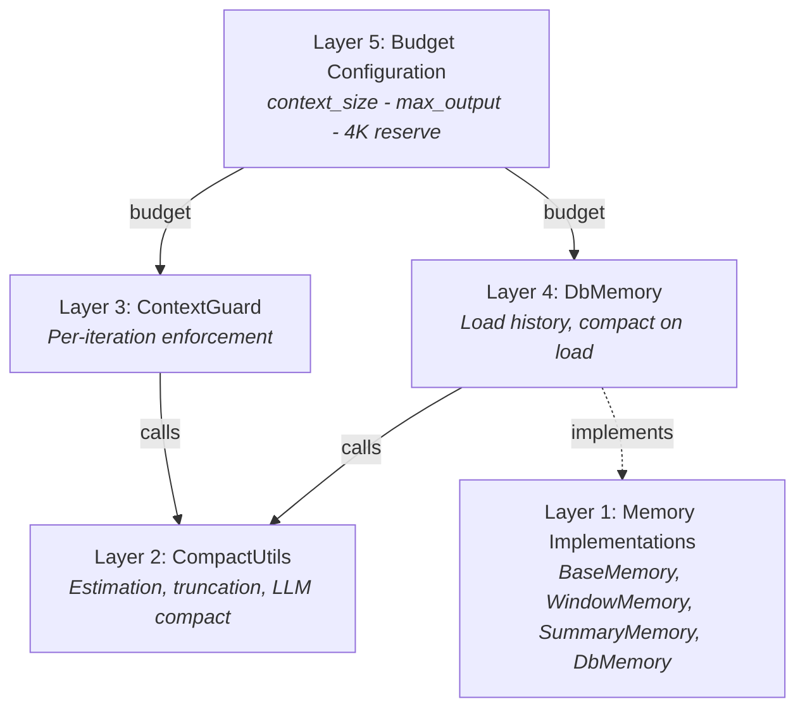
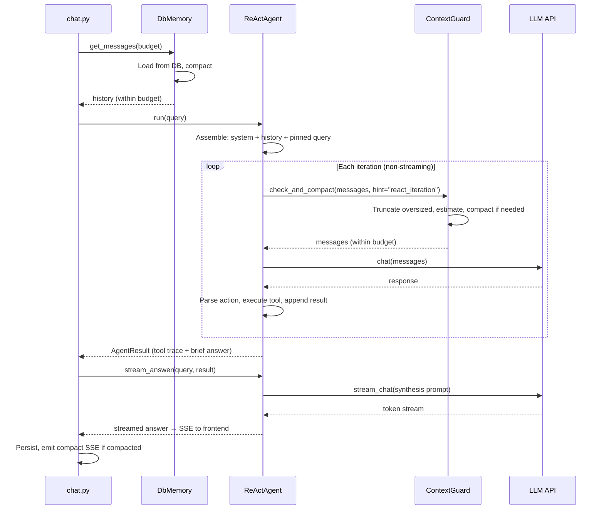
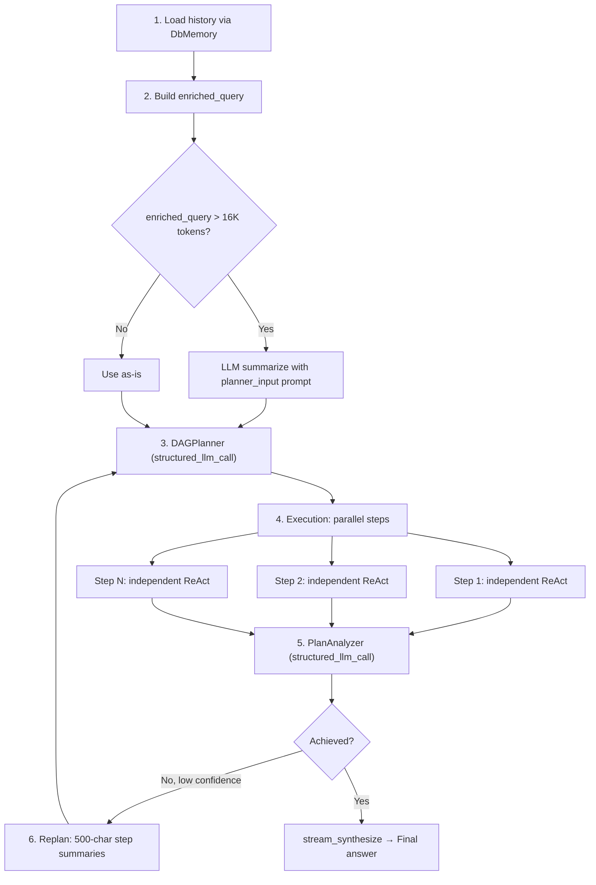

## 문제점

LLM은 유한한 컨텍스트 윈도우를 가지고 있습니다. 128K 토큰 모델은 관대해 보이지만, 출력 예산, 시스템 프롬프트, 도구 설명, 그리고 다중 턴 대화의 누적된 이력을 빼면 이야기가 달라집니다. 긴 대화, 큰 도구 결과, 그리고 다단계 에이전트 루프는 모두 이 한계에 압박을 가합니다 — 종종 단일 세션 내에서.

순진한 해결책은 자르기입니다: 윈도우가 가득 차면 이전 메시지를 삭제합니다. 이는 빠르고 예측 가능하지만, 무분별하게 컨텍스트를 파괴합니다. 사용자의 원래 의도, 이전 턴의 주요 결정, 그리고 중요한 데이터 포인트는 모두 무딘 문자 자르기에 의해 사라집니다. 반대 극단 — 매 턴마다 LLM 기반 요약 — 의미론적 내용은 보존하지만 비용이 많이 들고, 느리며, 자체 실패 모드를 도입합니다(환각된 요약, 손실된 수치 정밀도).

진정한 과제는 "윈도우에 맞추기"가 아닙니다. 그것은: **중요한 정보를 잃지 않으면서 우아하게 성능 저하, 불필요한 압축에 토큰을 낭비하지 않으면서, 사용자가 느낄 수 있는 지연을 추가하지 않으면서.**

FIM One은 5계층 심층 방어 아키텍처로 이를 해결합니다. 각 계층은 문제의 다른 규모를 다루며, 깔끔하게 구성됩니다 — 어떤 단일 계층도 완벽할 필요가 없습니다. 왜냐하면 다음 계층이 놓친 것을 포착하기 때문입니다.

## 다섯 계층의 방어

컨텍스트 관리는 단일 메커니즘이 아닙니다. 각 계층이 특정 관심사를 특정 세분성으로 처리하는 스택입니다:

| 계층 | 구성 요소 | 역할 | 작동 시기 |
|-------|-----------|-------------|-------------|
| **5** | Budget Configuration | 모델 사양에서 사용 가능한 입력 토큰 예산 계산 | 시작 시 / 요청당 |
| **4** | DbMemory | 지속된 히스토리 로드, 로드 시 압축 | 요청당 한 번 |
| **3** | ContextGuard | 반복당 예산 강제 | 모든 ReAct 반복 |
| **2** | CompactUtils | 토큰 추정, 스마트 자르기, LLM 압축 | 계층 3과 4에서 호출 |
| **1** | Memory Implementations | 추상 인터페이스 + 구체적 전략 | 프레임워크 수준 |

계층은 상위 계층이 하위 계층에 의존하기 때문에 하향식으로 번호가 매겨집니다. 계층 5는 예산을 설정합니다. 계층 4는 초기 로드 시간 압축을 수행합니다. 계층 3은 모든 반복에서 예산을 강제합니다. 계층 2와 1은 계층 3과 4가 사용하는 기본 요소를 제공합니다.



### Layer 5 — 예산 구성

예산은 세 가지 값으로 계산됩니다:

```
usable_input_tokens = context_size - max_output_tokens - system_prompt_reserve
```

기본값: `128,000 - 64,000 - 4,000 = 60,000 tokens`.

4,000토큰 시스템 프롬프트 예약은 에이전트의 시스템 프롬프트, 도구 설명 및 포맷팅 오버헤드를 포함합니다. 이는 고정 상수로, 실제로 시스템 프롬프트 자르기를 피하기에 충분하면서도 예산을 낭비하지 않을 정도로 작습니다.

예산 값은 우선순위 순서로 해결되는 세 가지 소스에서 올 수 있습니다:

1. **데이터베이스 ModelConfig** — 관리자가 설정한 모델별 `context_size` 및 `max_output_tokens`.
2. **환경 변수** — `LLM_CONTEXT_SIZE` 및 `LLM_MAX_OUTPUT_TOKENS`.
3. **하드코딩된 기본값** — 128K 컨텍스트, 64K 출력.

주 LLM과 빠른 LLM은 독립적인 예산을 가집니다. DAG 단계 실행은 빠른 LLM의 예산을 사용하고, ReAct 모드는 주 LLM의 예산을 사용합니다. 이는 운영자가 종종 ReAct용 대용량 컨텍스트 모델(히스토리가 누적되는 경우)과 DAG 단계용 더 작고 빠른 모델(각 단계가 새로 시작되는 경우)을 쌍으로 사용하기 때문에 중요합니다.

4,000토큰의 최소값이 적용됩니다. 잘못 구성된 값이 더 작은 예산을 생성하면 시스템은 조용히 실패하지 않고 4K로 고정합니다.

### Layer 4 — DbMemory

`DbMemory`는 프로덕션 메모리 구현입니다. 데이터베이스에서 지속된 대화 기록을 로드하고 에이전트가 보기 전에 토큰 예산에 맞게 압축합니다.

설계는 **의도적으로 읽기 전용**입니다. 지속성은 `chat.py`에서 처리됩니다 — 전체 메시지 수명 주기(메타데이터, 사용량 추적, 이미지 첨부 포함)를 소유하는 API 계층입니다. `DbMemory`는 읽기만 합니다. `add_message()` 및 `clear()` 메서드는 작동하지 않습니다. 이러한 분리는 이중 쓰기를 방지하고 지속성 로직을 한 곳에 유지합니다.

로드 시 `DbMemory`는:

1. 대화의 모든 `user` 및 `assistant` 메시지를 생성 시간 순서로 쿼리합니다.
2. 후행 사용자 메시지(현재 쿼리, 에이전트가 다시 추가할)를 삭제합니다.
3. 이미지 첨부를 재구성합니다 — 이미지를 포함한 사용자 메시지는 메타데이터(`file_id`, `mime_type`)를 데이터베이스에 저장하고, `DbMemory`는 디스크에서 base64 data-URL을 재구성하여 LLM이 이전 턴의 이미지를 "볼" 수 있도록 합니다.
4. 압축: `compact_llm`이 제공된 경우 `CompactUtils.llm_compact()`를 사용합니다. 그렇지 않으면 `CompactUtils.smart_truncate()`로 폴백합니다.

압축 후 `DbMemory`는 추적 플래그(`was_compacted`, `_original_count`, `_compacted_count`)를 설정하여 SSE 계층이 프론트엔드에 `compact` 이벤트를 내보내는 데 사용합니다.

### Layer 3 — ContextGuard

`ContextGuard`는 반복별 예산 집행자입니다. 독립 실행형 ReAct 모드와 각 DAG 단계의 하위 에이전트 내부 모두에서 모든 ReAct 반복의 맨 위에서 호출됩니다. 메시지가 LLM API에 도달하기 전의 마지막 방어선입니다.

집행은 3단계 프로세스를 따릅니다:

1. **과도하게 큰 개별 메시지 자르기.** 50K 문자를 초과하는 단일 메시지는 `[Truncated]` 접미사로 하드 자르기됩니다. 이는 웹 스크래핑이 전체 웹페이지를 반환하거나 파일 읽기가 대용량 데이터 세트를 덤프하는 등의 폭주하는 도구 출력을 포착합니다.

2. **총 토큰 추정.** 총량이 예산 내에 맞으면 즉시 반환합니다. 대부분의 반복은 여기를 통과합니다 — 압축은 예외이지 규칙이 아닙니다.

3. **예산 초과 시 압축.** `compact_llm`을 사용할 수 있으면 힌트별 프롬프트로 LLM 기반 압축을 사용합니다. 그렇지 않으면 `smart_truncate`로 폴백합니다.

**힌트 시스템**은 ContextGuard를 일률적이지 않고 컨텍스트 인식형으로 만드는 것입니다. 다양한 상황에는 다양한 압축 전략이 필요합니다:

| 힌트 | 사용 대상 | 보존 | 삭제 |
|------|---------|-----------|-------|
| `react_iteration` | ReAct 에이전트 루프 | 최근 추론 체인, 현재 목표, 중요 데이터 | 오래된 중복 단계, 실패한 재시도, 장황한 도구 출력 |
| `planner_input` | DAG 강화 쿼리 | 사용자 의도 진화, 주요 결정, 제약 조건 | 대화 세부 정보, 인사말, 도구 호출 메커니즘 |
| `step_dependency` | DAG 단계 컨텍스트 | 주요 데이터, 숫자, 결론 | 추론 프로세스, 실패한 시도, 장황한 형식 |
| `general` | 기본 폴백 | 주요 사실, 결정, 도구 결과 | 인사말, 채우기, 중복된 왕복 |

각 힌트는 압축 LLM에 무엇을 유지하고 무엇을 버릴지 알려주는 신중하게 작성된 시스템 프롬프트에 매핑됩니다. 프롬프트는 "대화와 동일한 언어로 작성하세요"로 끝나며 — 이는 요약이 영어로 기본 설정되는 CJK 사용자에게 중요한 세부 사항입니다.

LLM 압축이 실패하면(네트워크 오류, 빈 응답, 모든 예외), ContextGuard는 조용히 `smart_truncate`로 폴백합니다. 에이전트는 실패를 보지 못합니다. 이는 의도적인 신뢰성 선택입니다: 반복이 충돌하는 것보다 휴리스틱 자르기를 통해 일부 컨텍스트를 잃는 것이 낫습니다.

### Layer 2 — CompactUtils

`CompactUtils`는 상태 없는 유틸리티 클래스입니다 — 인스턴스 없음, 상태 없음, 순수 함수만 있습니다. 레이어 3과 4가 구축하는 세 가지 기능을 제공합니다.

**토큰 추정**은 토크나이저 라이브러리를 임포트하지 않고 텍스트를 대략적인 토큰 수로 변환합니다. 휴리스틱:

- ASCII 문자: ~토큰당 4자
- CJK / 비ASCII 문자: ~토큰당 1.5자
- 이미지: 이미지당 765토큰 (고정 비용)
- 메시지당 오버헤드: 4토큰 (역할 마커, 구분자)

**`smart_truncate`**는 휴리스틱 폴백입니다. 고정된 메시지를 무조건 유지한 다음, 고정되지 않은 메시지를 역순으로 탐색하면서 예산이 소진될 때까지 누적합니다. 결과는 맞는 대화의 접미사입니다. 또한 결과가 절대 어시스턴트 메시지로 시작하지 않도록 보장합니다 — 선행 사용자 메시지가 없는 고아 어시스턴트 턴은 LLM을 혼동시킵니다.

**`llm_compact`**는 LLM 기반 경로입니다. 메시지를 세 그룹으로 분할합니다 — 시스템 메시지 (항상 유지), 고정된 메시지 (항상 유지), 압축 가능한 메시지. 가장 오래된 압축 가능한 메시지는 단일 `[Conversation summary]` 시스템 메시지로 요약되고, 가장 최근 4개 메시지는 그대로 유지됩니다. 압축된 결과가 여전히 너무 길면, 압축된 출력에 대해 `smart_truncate`로 폴백합니다 — 이중 안전장치입니다.

### Layer 1 — 메모리 구현

메모리 레이어는 `BaseMemory` 인터페이스를 정의합니다: `add_message()`, `get_messages()`, `clear()`. 세 가지 구현이 존재합니다:

- **WindowMemory** — 개수 기반 슬라이딩 윈도우. 마지막 N개의 비시스템 메시지를 유지합니다. 단순하고 예측 가능하며 LLM 호출이 없습니다. 프로덕션에서 사용되지 않으며, 테스트 및 상태 비저장 시나리오에 유용합니다.

- **SummaryMemory** — 메시지 개수가 임계값을 초과할 때 LLM 요약을 트리거합니다. 이전 메시지를 `[Conversation summary]` 시스템 메시지로 압축합니다. 프로덕션에서 사용되지 않으며, 더 정교한 ContextGuard 접근 방식보다 앞선 것입니다.

- **DbMemory** — 프로덕션 구현(Layer 4에서 설명). 데이터베이스 기반, 읽기 전용, 로드 시 LLM 또는 휴리스틱 압축을 사용합니다.

WindowMemory와 SummaryMemory는 테스트를 위한 유용한 프리미티브로 사용되고 웹 레이어 없이 FIM One의 핵심 라이브러리를 임베드하는 사용자를 위해 코드베이스에 남아 있습니다. 이들은 죽은 코드가 아니라 아키텍처가 성장해 나온 단순한 경우들입니다.

## ReAct를 통한 컨텍스트 흐름

ReAct 에이전트는 두 가지 서로 다른 단계에서 컨텍스트 관리를 사용합니다: 로드 시간과 반복 시간입니다.



도구 반복은 속도를 위해 스트리밍되지 않는 `chat()`을 사용하고, 답변 합성은 `stream_answer()`를 통해 스트리밍 `stream_chat()`을 사용합니다. 이러한 두 단계 분할 — 빠른 도구 루프 다음에 스트리밍 합성 — 은 지연 시간과 사용자 경험을 모두 최적화합니다. 이중 모드 실행 및 도구 선택을 포함한 전체 ReAct 엔진 아키텍처는 [ReAct Engine](/architecture/react-engine)을 참조하세요.

핵심 통찰: **DbMemory는 역사적 컨텍스트 문제(이전 요청의 턴)를 처리하고, ContextGuard는 요청 내 성장 문제(에이전트 루프 중에 누적되는 도구 결과)를 처리합니다.** 이들은 서로 다른 시간 척도에서 작동하며 서로 다른 실패 모드를 포착합니다.

사용자의 현재 쿼리는 항상 `pinned=True`로 표시됩니다. 이는 모든 압축에서 생존하도록 보장합니다 — `smart_truncate`와 `llm_compact` 모두 고정된 메시지를 무조건 보존합니다. 역사가 얼마나 공격적으로 압축되든 사용자의 실제 질문은 절대 손실되지 않습니다.

## DAG를 통한 컨텍스트 흐름

DAG 모드는 ReAct와 근본적으로 다른 컨텍스트 형태를 가집니다. 하나의 긴 대화 스레드 대신 트리 구조를 가지며, 계획 단계, 여러 병렬 실행 단계, 분석 단계로 이루어집니다. 각 단계는 자체 컨텍스트 관리 전략을 가집니다.



**단계 1 — 히스토리 로딩.** DbMemory는 ReAct와 동일하게 대화 히스토리를 로드하고 압축합니다. 압축된 히스토리는 `"Previous conversation:"`으로 시작하는 텍스트 블록으로 포맷됩니다.

**단계 2 — 풍부한 쿼리 구성.** 히스토리 텍스트와 현재 쿼리가 `enriched_query`로 결합됩니다. 이것이 16K 토큰을 초과하면 `planner_input` 힌트 프롬프트를 사용하여 LLM으로 요약됩니다. 16K 임계값은 플래너가 전체 쿼리를 한 번에 읽어야 하기 때문에 선택되었습니다 — ReAct와 달리 계획 중에 반복적인 압축이 없습니다.

**단계 3 — 계획.** 플래너는 2개 메시지 프롬프트를 받습니다: 시스템 프롬프트와 풍부한 쿼리입니다. ContextGuard가 없습니다 — 풍부한 쿼리는 이미 16K 확인으로 크기가 제어됩니다.

**단계 4 — 단계 실행.** 각 DAG 단계는 자체 ContextGuard를 가진 독립적인 ReAct 에이전트로 실행됩니다. 중요하게도, 이러한 하위 에이전트는 **메모리가 없습니다** — 작업 설명과 종속성 컨텍스트만으로 새로 시작합니다. 이는 의도적입니다: DAG 단계는 자체 포함된 작업 단위여야 합니다. 종속성 결과는 `_build_step_context`를 통해 주입되며, 50K에서 문자 잘림이 적용됩니다 (ContextGuard의 `max_message_chars` 제한).

**단계 5 — 분석.** 단계 결과는 분석기 LLM을 위해 포맷되며, 단계별로 10K 문자에서 잘림이 적용됩니다. 이는 단일 단계의 상세한 출력이 분석 컨텍스트를 지배하는 것을 방지합니다.

**단계 6 — 재계획.** 분석기가 목표가 달성되지 않았고 신뢰도가 임계값 아래라고 판단할 때, 단계 결과는 재계획 컨텍스트를 위해 각각 500자로만 잘립니다. 재계획은 *무엇이 일어났는지*와 *무엇이 잘못되었는지*를 알아야 하지만, 모든 단계의 출력 전체 세부 사항은 필요하지 않습니다. 이 적극적인 잘림은 재계획 프롬프트를 플래너가 효율적으로 처리할 수 있을 정도로 간결하게 유지합니다.

LLM 호출 맵 및 재계획 로직을 포함한 전체 DAG 파이프라인 아키텍처는 [DAG 엔진](/architecture/dag-engine)을 참조하세요.

## 고정된 메시지

고정 메커니즘은 압축이 반드시 유지되어야 하는 메시지를 파괴하는 것을 방지합니다. 두 가지 범주의 메시지가 고정됩니다:

1. **현재 사용자 쿼리** — 항상 고정됩니다. 사용자가 질문을 하고 히스토리가 너무 길면, 시스템은 히스토리를 압축하지 질문을 압축하지 않습니다.

2. **스트림 중간에 주입된 메시지** — 사용자가 에이전트가 실행 중인 동안 후속 메시지를 보내면, 주입된 메시지는 고정으로 표시되어 에이전트가 다음 반복에서 이를 볼 수 있습니다.

고정의 위험은 누적입니다. 많은 주입된 메시지가 있는 긴 세션에서, 고정된 콘텐츠는 예산의 대부분을 소비하여 실제 대화 히스토리를 위한 공간을 남기지 않을 수 있습니다. ContextGuard는 하드 캡으로 이를 해결합니다: **고정된 토큰이 예산의 50%를 초과하면, 가장 오래된 주입된 메시지는 고정 해제되고 압축 가능한 풀로 이동됩니다.** 가장 최근의 고정된 메시지(현재 쿼리)만 유지됩니다.

이것은 트레이드오프입니다. 오래된 주입된 메시지의 고정을 해제하면 이들이 요약되거나 잘릴 수 있습니다. 하지만 대안 — 고정된 메시지가 다른 모든 컨텍스트를 밀어내도록 허용하는 것 — 은 더 나쁩니다. 시스템은 가장 최근의 컨텍스트를 유지하는 것을 선호하며, 이는 거의 항상 오래된 주입보다 더 관련성이 있습니다.

## 토큰 추정

FIM One은 실제 토크나이저 대신 휴리스틱 토큰 추정을 사용합니다. 이는 명확한 트레이드오프가 있는 의도적인 선택입니다.

**실제 토크나이저를 사용하지 않는 이유?** 세 가지 이유가 있습니다:

1. **의존성 비용.** `tiktoken`(OpenAI의 토크나이저)은 15MB의 컴파일된 Rust 바인딩입니다. `sentencepiece`(일부 오픈소스 모델에서 사용)는 자체 빌드 요구사항이 있습니다. 여러 LLM 제공자를 대상으로 하는 프레임워크의 경우, 단일 올바른 토크나이저는 없습니다 — 각 모델 계열은 서로 다른 토크나이저를 사용합니다.

2. **속도.** 휴리스틱 추정은 문자열에 대한 단일 패스입니다. 실제 토큰화는 어휘 조회, BPE 병합 작업, 특수 토큰 처리를 포함합니다. ContextGuard는 모든 반복에서 추정을 호출하며, 때로는 여러 번 호출합니다 — 속도 차이가 중요합니다.

3. **충분히 좋음.** 휴리스틱은 혼합 언어 텍스트에 맞게 조정됩니다(ASCII/CJK 분할은 두 가지 주요 경우를 다룹니다). 엣지 케이스(많은 구두점이 있는 코드, 비정상적인 유니코드)의 경우 1.5-2배 정도 벗어날 수 있지만, 컨텍스트 관리는 본질적으로 근사입니다. 60K 예산에서 30% 정도 벗어나도 여전히 충분한 여유가 있습니다.

구체적인 휴리스틱:

| 콘텐츠 유형 | 비율 | 근거 |
|-------------|-------|-----------|
| ASCII 텍스트 | ~4자/토큰 | 영어 산문과 코드는 GPT/Claude 토크나이저 전반에서 평균 3.5-4.5자/토큰 |
| CJK / 비ASCII | ~1.5자/토큰 | 각 CJK 문자는 일반적으로 1-2개 토큰이며, 1.5는 기하평균 |
| 이미지 | 765토큰/이미지 | 비전 API에서 base64로 인코딩된 이미지의 대략적인 비용 |
| 메시지당 오버헤드 | 4토큰 | 역할 마커, 구분자, 포매팅 |

추정은 비어있지 않은 콘텐츠에 대해 항상 최소 1개 토큰을 반환합니다. 이는 예산 산술에서 0으로 나누기 엣지 케이스를 방지합니다.

## 사용자가 보는 것

컨텍스트 관리는 일반적인 경우에는 보이지 않도록 설계되었으며, 활성화될 때만 최소한의 방해를 줍니다. 사용자 대면 신호는 다음과 같습니다:

**CompactDivider.** `DbMemory`가 로드 시 히스토리를 압축할 때, 프론트엔드는 "Earlier context (N messages) was summarized by AI."라는 텍스트가 있는 점선 구분선을 렌더링합니다. 이는 요약과 보존된 최근 메시지 사이에 나타나며, 사용자에게 이전 컨텍스트가 압축되었음을 시각적으로 알려주면서 대화 흐름을 방해하지 않습니다.

**토큰 사용량 표시.** 각 응답 끝의 `done` 카드는 "X.Xk in / X.Xk out"을 표시합니다 — 소비된 총 입력 및 출력 토큰입니다. 여기에는 압축에 소비된 토큰(요약을 위한 빠른 LLM 호출)이 포함됩니다. 토큰 소비를 모니터링하는 사용자는 압축이 오버헤드를 추가할 때를 볼 수 있습니다.

**우아한 오류 처리.** 컨텍스트 관리가 완전히 실패하면 — 폴백 체인이 주어진 상황에서는 발생하지 않아야 하지만 이론상 가능한 시나리오 — 오류는 응답의 에이전트 오류 텍스트로 표시되며, 시스템 충돌이 아닙니다. 대화는 계속되고 사용자는 재시도하거나 다시 표현할 수 있습니다.

목표는 대부분의 사용자가 컨텍스트 관리에 대해 생각하지 않는 것입니다. 사용자는 긴 대화를 나누고, 시스템이 예산을 투명하게 처리하며, 유일한 가시적 결과물은 가끔 나타나는 압축 구분선입니다. 토큰 효율성을 신경 쓰는 파워 사용자와 운영자의 경우, 사용량 표시와 구성 가능한 예산 매개변수가 필요한 제어를 제공합니다.
