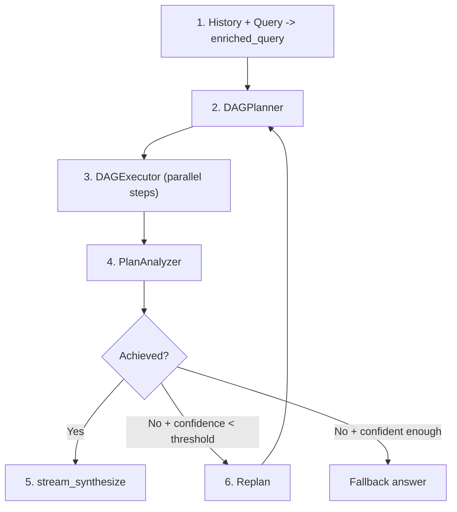
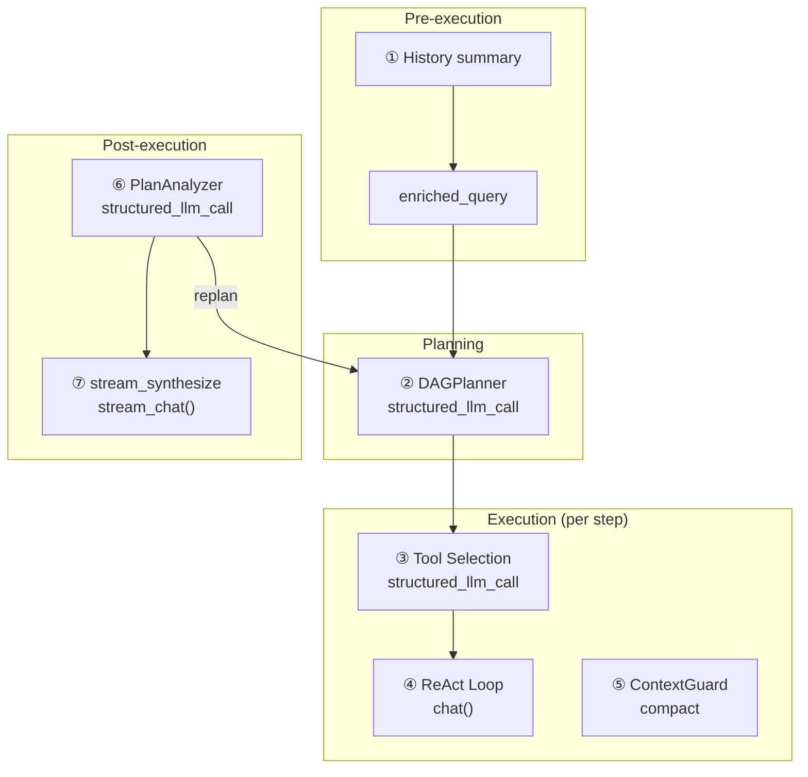
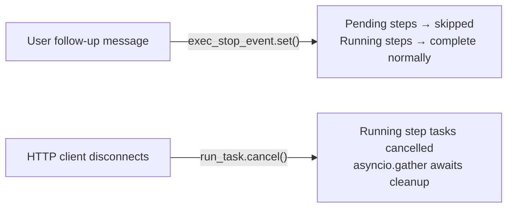

## 파이프라인

DAG 모드는 복잡한 목표를 방향성 비순환 그래프(DAG)의 단계로 분해하고, 최대 병렬성으로 실행한 후 목표가 실제로 달성되었는지 반영합니다. 그렇지 않으면 다시 계획하고 시도합니다 — 자동으로, 구성 가능한 예산까지.

파이프라인은 루프를 형성하는 4가지 단계로 구성됩니다:

**계획.** 스마트 LLM은 풍부한 쿼리를 2-6개의 단계로 분해하며 명시적 종속성 엣지를 포함합니다. 각 단계는 작업 설명, 선택적 도구 힌트, 그리고 빠른 LLM 또는 스마트 LLM에서 실행할지 여부를 제어하는 모델 힌트를 받습니다.

**실행.** DAGExecutor는 종속성 그래프를 존중하면서 독립적인 단계를 병렬로 시작합니다(최대 5개 동시). 각 단계는 메모리가 없는 자체 포함된 ReAct 에이전트로 실행됩니다 — 작업 설명과 완료된 종속성의 결과만 받습니다.

**분석.** PlanAnalyzer는 실행된 계획이 원래 목표를 달성했는지 평가하여 구조화된 판정을 생성합니다: `achieved` (부울), `confidence` (0.0-1.0), `reasoning`, 그리고 선택적 `final_answer`.

**재계획.** 목표가 달성되지 않았고 신뢰도가 중지 임계값 아래인 경우, 파이프라인은 무엇이 일어났는지와 무엇이 잘못되었는지를 요약하는 재계획 컨텍스트와 함께 계획으로 돌아갑니다. 이 루프는 `DAG_MAX_REPLAN_ROUNDS`번까지 자동으로 실행됩니다.

두 개의 LLM이 전체적으로 협력합니다: **스마트 LLM**은 계획, 분석 및 답변 합성을 처리합니다(높은 추론 능력이 필요한 작업), **일반 LLM**은 기본적으로 단계 실행을 처리합니다(`model_hint="fast"` 단계는 비용 절감을 위해 빠른 LLM에 위임됨). 컨텍스트 압축 및 히스토리 요약은 빠른 LLM을 사용합니다. 모든 구조화된 출력 호출은 `structured_llm_call`을 사용하며, 이는 모델별 출력 특이성을 처리하기 위해 3단계 저하 체인(Native FC, JSON Mode, 정규식 폴백이 있는 일반 텍스트)을 제공합니다.

## LLM 호출 맵

전체 DAG 파이프라인은 7가지의 서로 다른 LLM 호출 카테고리를 만듭니다. 각 호출이 어디서 발생하는지, 어떤 모델이 처리하는지, 그리고 실패 시 어떤 일이 발생하는지 이해하는 것은 디버깅과 비용 최적화에 필수적입니다.

| # | 호출 위치 | 모듈 | LLM 역할 | 형식 | 폴백 |
|---|-----------|--------|----------|--------|----------|
| 1 | 히스토리 요약 | chat.py | 빠른 LLM | 평문 | 마지막 20K 문자 잘라내기 |
| 2 | DAGPlanner | planner.py | 스마트 LLM | structured\_llm\_call | 3단계 저하 |
| 3 | 도구 선택 | react.py | 스텝 LLM | structured\_llm\_call | 모든 도구 반환 |
| 4 | ReAct 루프 (단계별) | react.py | 일반 LLM (기본값) / 빠른 LLM (`model_hint="fast"`) / 추론 LLM (`model_hint="reasoning"`) | chat() | 재시도/폴백 |
| 5 | ContextGuard 압축 | context\_guard.py | 빠른 LLM | 평문 | smart\_truncate |
| 6 | PlanAnalyzer | analyzer.py | 스마트 LLM | structured\_llm\_call | regex + 기본값 |
| 7 | stream\_synthesize | analyzer.py | 스마트 LLM | stream\_chat() | analysis.final\_answer |

호출 1과 5는 **사용자에게 보이지 않습니다** — 컨텍스트 크기를 관리하는 인프라 호출입니다. 호출 2, 6, 7은 높은 추론 능력이 필요하기 때문에 **스마트 LLM**을 사용합니다 (목표 분해, 달성 판단, 일관된 답변 합성). 호출 4는 기본적으로 **일반 LLM**을 사용합니다 — `model_hint="fast"`로 명시적으로 표시된 스텝만 빠른 LLM으로 다운그레이드되고, `model_hint="reasoning"`으로 표시된 스텝은 추론 LLM으로 업그레이드됩니다. 호출 3은 해당 스텝에 대해 결정된 동일한 LLM을 사용합니다.

## DAGPlanner

플래너의 역할은 고수준의 목표를 유효한 DAG의 구체적이고 실행 가능한 단계로 변환하는 것입니다. 이는 스마트 LLM에 대한 단일 `structured_llm_call`로 수행됩니다.

**프롬프트 설계.** 계획 프롬프트는 현재 날짜와 연도를 주입하고(LLM이 시간 인식 검색을 계획할 수 있도록), 언어 일치를 강제하며(작업 설명은 목표와 동일한 언어를 사용해야 함), 단계 수를 2-6으로 제한합니다. 각 단계는 5개의 필드를 가집니다: `id`, `task`, `dependencies`, `tool_hint`, `model_hint`. 프롬프트는 사소하게 관련된 하위 작업 분할을 명시적으로 권장하지 않습니다 — "여러 검사를 단일 스크립트에서 수행할 수 있다면 이를 한 단계로 결합하세요."

**구조화된 추출.** 플래너는 `steps` 배열 스키마를 정의하는 `_PLAN_SCHEMA`와 원본 딕셔너리를 `PlanStep` 객체로 변환하는 `parse_fn`을 사용하여 `structured_llm_call`을 사용합니다. LLM이 `{"steps": [...]}` 래퍼 대신 단일 단계 객체를 반환하면 파서가 자동으로 복구합니다. [ReAct Engine — structured\_llm\_call](/architecture/react-engine#structured_llm_call--unified-output-extraction)에 문서화된 3단계 저하 체인은 제공자 간 모델 출력 특이성을 처리합니다.

**DAG 검증.** 추출 후 플래너는 Kahn의 알고리즘을 사용하여 위상 정렬로 그래프 구조를 검증합니다. 두 가지 불변성이 확인됩니다:

1. **매달린 참조 없음.** 단계가 계획에 존재하지 않는 종속성 ID를 참조하면 참조는 경고 로그와 함께 자동으로 제거됩니다. 이는 복구 메커니즘입니다 — LLM은 때때로 참조한 단계를 생략하며, 하드 실패는 전체 계획 호출을 낭비할 것입니다.

2. **순환 없음.** Kahn의 알고리즘이 모든 노드를 방문할 수 없으면(최소 하나의 순환이 존재함을 의미), 플래너는 `ValueError`를 발생시킵니다. 순환은 복구 불가능합니다 — 순환 계획은 실행될 수 없습니다.

**model\_hint.** 플래너는 단순하고 결정론적이라고 간주하는 단계에 `"fast"`를 할당하고(데이터 조회, 형식 변환, 직관적 검색), 표준 추론이 필요한 단계에 `null`을 할당하며(일반 모델로 해결됨), 깊은 분석이 필요한 단계에 `"reasoning"`을 할당합니다. 실행자는 이 힌트를 사용하여 `ModelRegistry`를 통해 단계별로 적절한 LLM을 선택합니다. 의심스러울 때 프롬프트는 LLM에 `null`을 사용하도록 지시합니다 — 더 강력한 모델을 사용하는 것이 항상 더 안전합니다. 도메인 특화 작업(법률, 의료, 금융)의 경우 플래너는 라우터로부터 도메인 컨텍스트를 수신하고 전문가 정확성이 필요한 단계에 `model_hint="reasoning"`을 할당하도록 안내됩니다.

**입력 구성.** 보강된 쿼리는 대화 기록을 현재 요청과 결합합니다. 대화가 길면 기록은 `DbMemory`를 통해 로드되고 `"Previous conversation: ..."`로 형식화됩니다. 결과 보강 쿼리가 16K 토큰을 초과하면(`CompactUtils.estimate_tokens`를 통해 추정됨), ContextGuard의 `planner_input` 힌트 프롬프트를 사용하여 LLM으로 요약된 후 플래너에 전달됩니다. 빠른 LLM을 사용할 수 없을 때의 폴백: 마지막 20K 문자로 하드 잘라냅니다.

## DAGExecutor

실행자는 검증된 `ExecutionPlan`을 받아 단계를 동시에 실행하며, 종속성 엣지를 존중하고 리소스 제한을 적용합니다.

**동시성 모델.** `asyncio.Semaphore`는 병렬 단계 실행을 `max_concurrency`(기본값 5, `MAX_CONCURRENCY` 환경 변수로 구성 가능)로 제한합니다. 디스패치 루프는 종속성이 완료된 모든 단계를 식별하고, 이를 `asyncio.Task` 인스턴스로 시작하며, 최소 하나가 완료될 때까지 기다린 후 다시 확인합니다. 단계는 결정적 동작을 위해 정렬된 ID 순서로 시작됩니다.

**단계별 ReAct 에이전트.** 각 단계는 `_resolve_agent()`에 의해 생성된 독립적인 ReAct 에이전트로 실행됩니다. 단계에 `ModelRegistry`의 역할과 일치하는 `model_hint`가 있으면, 해당 LLM으로 임시 에이전트가 생성됩니다. 그렇지 않으면 레지스트리의 기본(일반) 모델이 사용됩니다. 이러한 단계별 에이전트는 **메모리가 없습니다** — 작업 설명, 원래 목표, 도구 힌트, 완료된 종속성의 결과만으로 새로 시작합니다. 이러한 격리는 의도적입니다: DAG 단계는 그래프 전체에 상태를 유출하지 않는 자체 포함된 작업 단위여야 합니다.

**종속성 컨텍스트 주입.** `_build_step_context()`는 완료된 모든 종속성 단계의 결과를 텍스트 블록으로 포맷합니다: 각 종속성의 ID, 상태, 작업 설명 및 결과입니다. `ContextGuard`가 구성되어 있고 결합된 컨텍스트가 `max_message_chars`를 초과하면, `[Dependency context truncated]` 접미사로 하드 잘립니다. 이는 여러 상세한 선행 단계에 종속된 단계가 자신의 컨텍스트 윈도우를 초과하는 것을 방지합니다.

**구조화된 콘텐츠 승수.** 종속성 결과에 구조화된 콘텐츠(법적 인용, 마크다운 테이블 또는 코드 블록)가 포함되면, `_build_step_context()`는 잘림 예산에 승수를 적용합니다(기본값 `3.0`, `DAG_STRUCTURED_CONTEXT_MULTIPLIER`로 구성 가능). 이는 인용, 표 형식 데이터 및 기타 구조화된 아티팩트가 단계 경계 전체에서 보존되도록 하며, 참조 중간에 잘리지 않도록 합니다.

**단계 타임아웃.** 각 단계는 기본 타임아웃 600초(10분)로 `asyncio.wait_for`에 래핑됩니다. 단계가 이를 초과하면 취소되고 타임아웃 메시지와 함께 `"failed"`로 표시됩니다. 타임아웃은 단계별이지 계획별이 아닙니다 — 5단계 계획은 단계가 순차적으로 실행되면 이론상 50분 동안 실행될 수 있습니다.

**중단 및 취소.** 실행자는 두 가지 서로 다른 취소 경로를 가지며, 각각 다른 이벤트에 의해 트리거됩니다:

*우아한 건너뛰기 — 중지 이벤트.* 사용자가 실행 중에 후속 메시지를 보내면, `chat.py`의 오케스트레이터가 `exec_stop_event`를 설정합니다. 실행자는 각 디스패치 사이클의 상단에서 이 플래그를 확인합니다: 설정되면 모든 남은 `pending` 단계는 즉시 `"skipped"`로 표시되고 이유는 `"Skipped — user changed requirements"`이며, 루프가 종료됩니다. 이미 실행 중인 단계는 완료될 수 있습니다 — 시작되지 않은 단계만 중단됩니다. 이 빠른 종료를 통해 파이프라인은 전체 원래 계획이 완료될 때까지 기다리지 않고 사용자의 업데이트된 의도 주위에서 다시 계획할 수 있습니다.

*즉시 중단 — asyncio 취소.* HTTP 클라이언트가 연결을 끊으면, `chat.py`는 `asyncio.Task.cancel()`을 통해 최상위 `run_task`를 취소합니다. 실행자는 `asyncio.CancelledError`를 포착하고, 현재 실행 중인 모든 단계 작업을 취소하며, `asyncio.gather(..., return_exceptions=True)`를 통해 이들이 인정할 때까지 기다린 후, 다시 발생시킵니다. 클라이언트 연결 끊김은 SSE 이벤트 루프 내에서 0.5초마다 `await request.is_disconnected()`를 폴링하여 감지됩니다.

의미론적 차이가 중요합니다: **중지 이벤트**는 "아직 시작되지 않은 것을 건너뛰되, 이미 실행 중인 것은 보존"을 의미합니다 — 완료된 단계 결과는 재계획을 알리기 위해 사용 가능하게 유지됩니다. **CancelledError**는 "모든 것을 즉시 중단"을 의미합니다 — 모든 진행 중인 작업은 결과 복구 없이 삭제됩니다.

**교착 상태 감지.** 디스패치 루프가 실행 중인 작업이 없고 시작할 준비가 된 단계도 없음을 발견하면(종속성이 실패했기 때문에), 모든 남은 보류 중인 단계는 `"failed"`로 표시되고 종속성이 완료되지 않았음을 설명하는 메시지가 표시됩니다. 이는 실행자가 무한정 행(hang)되는 것을 방지합니다.

**진행 콜백.** 실행자는 세 가지 이벤트 유형에 대해 `(step_id, event, data)` 콜백을 발생시킵니다: `"started"`(단계 시작), `"iteration"`(단계 내 도구 호출), `"completed"`(단계 완료). `chat.py`의 SSE 레이어는 이러한 콜백을 프론트엔드가 실시간 DAG 시각화를 렌더링하는 데 사용하는 `step_progress` 이벤트로 연결합니다.

## 인용 검증

각 단계가 완료된 후, 실행자는 선택적으로 **인용 검증자**를 실행하여 단계의 출력에서 사실적 주장을 확인합니다. 이는 `DAG_CITATION_VERIFICATION` 환경 변수(`기본값: true`)로 제어되며, 부정확한 인용이 높은 위험을 초래하는 영역을 대상으로 합니다 — 법정 법령, 의료 참고자료, 금융 규정.

검증자는 세 단계로 작동합니다:

1. **추출.** 정규식 패턴이 단계 결과에서 인용과 유사한 문자열을 식별합니다(예: 판례 번호, 법령 참고자료, 규정 코드).
2. **검증.** 추출된 각 인용은 타당성과 내부 일관성을 확인하는 LLM 판단 호출로 평가됩니다.
3. **실패 시 재시도.** 검증이 실패하면, 단계는 수정 피드백이 작업 설명에 추가된 상태로 재시도되어 에이전트가 부정확한 참고자료를 수정할 기회를 제공합니다.

인용 검증은 인용을 포함하는 단계에 지연을 추가하지만 인용이 없는 단계에는 영향을 주지 않습니다. 사용 사례에 인용에 민감한 영역이 포함되지 않는 경우 `DAG_CITATION_VERIFICATION=false`를 설정하여 비활성화하십시오.

## 도메인 인식 라우팅

자동 라우터는 이제 기존 모드 선택과 함께 **`domain_hint`**를 사용하여 쿼리를 분류합니다. 인식되는 도메인은 `legal`, `medical`, `financial`이며, 이러한 도메인 외의 쿼리는 `null`을 받습니다.

도메인 분류는 파이프라인에 두 가지 방식으로 영향을 미칩니다:

**DAG 모드.** 라우터가 DAG를 선택하고 null이 아닌 `domain_hint`를 제공할 때, 도메인 컨텍스트가 플래너 프롬프트에 주입됩니다. 이는 플래너가 전문가 수준의 정확성이 필요한 단계에 `model_hint="reasoning"`을 할당하고 사용 가능한 도메인 스킬과 일치하는 단계에 `tool_hint="read_skill"`을 제안하도록 안내합니다.

**ReAct 모드.** 라우터가 도메인 특화 쿼리에 대해 ReAct를 선택할 때, 시스템은 일반 모델에서 `registry.get_by_role("reasoning")`을 통해 **추론 모델**로 확대됩니다. 추가로, 에이전트가 도메인 특화 콘텐츠를 작성하기 전에 `web_search`를 사용하고 검색을 통해 인용을 검증하도록 요구하는 필수 지침이 주입됩니다. `read_skill` 도구는 도구 선택에서 고정되어 있으며(필터링되지 않음), 도메인 지식이 항상 접근 가능하도록 보장합니다.

라우팅 편향도 변합니다: 여러 하위 작업이 컨텍스트와 인용을 공유하는 긴밀하게 결합된 도메인 분석은 DAG 단계 경계를 넘어 컨텍스트 손실을 피하기 위해 ReAct 모드를 선호합니다.

## PlanAnalyzer

분석기는 실행된 계획이 원래 목표를 달성했는지 평가합니다. 네 가지 필드를 포함하는 구조화된 `AnalysisResult`를 생성합니다:

- **`achieved`** (boolean) — 목표가 완전히 달성된 경우에만 `true`.
- **`confidence`** (float, 0.0-1.0) — 분석기의 평가 확실성. 서로 모순되는 출처는 이 점수를 낮춥니다.
- **`final_answer`** (string or null) — 달성된 경우 종합된 답변, 그렇지 않으면 `null`.
- **`reasoning`** (string) — LLM의 사고 연쇄 정당화.

**구조화된 추출.** 분석기는 `structured_llm_call`을 `_ANALYSIS_SCHEMA`, 타입 강제 변환 및 신뢰도 제한을 처리하는 `parse_fn`, 그리고 형식이 잘못된 JSON에 대한 `regex_fallback`과 함께 사용합니다. 정규식 폴백(`_regex_extract_analysis`)은 패턴 매칭을 사용하여 부분적으로 유효한 JSON에서 `achieved`, `confidence`, `final_answer`, `reasoning` 필드를 추출합니다. 분석 응답이 계획 응답보다 더 길고 복잡한 경향이 있어 JSON 형식 오류가 더 자주 발생하기 때문에 이것이 중요합니다.

**안전한 기본값.** 모든 추출 수준이 실패하면(기본 FC, JSON 모드, 일반 텍스트, 정규식), 분석기는 `AnalysisResult(achieved=False, confidence=0.0, reasoning="Could not parse analysis response")`를 반환합니다. 이는 파이프라인이 항상 사용 가능한 결과를 얻도록 보장합니다 — 파싱 실패는 "달성되지 않음" 판정이 되어 충돌 대신 재계획을 트리거합니다.

**단계 결과 형식.** 각 단계의 결과는 분석 프롬프트에서 10K 문자로 잘립니다. 이는 단일 단계의 상세한 출력(예: 대규모 웹 스크래핑 또는 파일 덤프)이 분석기의 컨텍스트 윈도우를 지배하고 다른 단계의 결과를 압도하는 것을 방지합니다.

**다중 출처 비교.** 분석 프롬프트에는 서로 다른 출처의 결과를 명시적으로 비교하도록 지시하는 지시문이 포함됩니다. 웹 검색 결과, 지식 기반 검색, 파일 작업이 모두 데이터를 제공할 때, 분석기는 모순(다른 숫자, 날짜, 주장)을 표시하고 어느 출처가 더 신뢰할 수 있는지 나타내야 합니다. 모순은 신뢰도 점수를 낮추며, 이는 재계획 결정에 영향을 미칩니다.

## 재계획

재계획 루프는 DAG 엔진의 가장 distinctive한 특징입니다: 무엇이 잘못되었는지 반영하고 다른 접근 방식을 시도하여 부분 실패에서 자율적으로 복구할 수 있습니다.

**의사결정 로직.** 각 계획-실행-분석 라운드 후, `chat.py`의 오케스트레이터는 분석 결과를 평가합니다:

1. **`achieved == True`** — 루프를 종료하고 스트리밍 합성으로 진행합니다.
2. **이 라운드 중 사용자 주입 발생** — 신뢰도나 예산과 관계없이 항상 재계획합니다. 사용자 후속 메시지는 새로운 시도를 요구하는 요구사항 변경으로 취급됩니다. 이는 자율 재계획 예산을 소비하지 않습니다.
3. **자율 재계획 예산 소진** — 루프를 종료합니다. 예산은 `max_replan_rounds - 1`개의 자율 재계획입니다(기본값: 총 3 라운드 예산에서 2개의 자율 재계획).
4. **`confidence >= replan_stop_confidence`** — 루프를 종료합니다. 목표가 완전히 달성되지 않았더라도, 높은 신뢰도 점수(기본 임계값: 0.8, `DAG_REPLAN_STOP_CONFIDENCE`를 통해 구성 가능)는 분석기가 무엇이 일어났는지에 대해 상당히 확실하다는 것을 나타냅니다 — 재계획이 도움이 될 가능성은 낮습니다.
5. **그 외의 경우** — 재계획합니다. 목표가 달성되지 않았고, 신뢰도가 낮으며, 예산이 남아있습니다.

**재계획 컨텍스트.** 재계획할 때, 오케스트레이터는 `_format_replan_context()`를 호출하여 이전 라운드의 요약을 작성합니다. 여기에는 분석기의 추론과 각 단계 결과의 잘린 미리보기(단계당 최대 500자)가 포함됩니다. 공격적인 잘라내기는 의도적입니다: 플래너는 *무엇이 일어났는지*와 *무엇이 잘못되었는지*를 알아야 하며, 모든 단계의 출력의 전체 세부사항을 알 필요는 없습니다. 이 컨텍스트는 원본 enriched 쿼리와 함께 `context` 매개변수로 `DAGPlanner.plan()`에 전달됩니다.

**최대 라운드.** `DAG_MAX_REPLAN_ROUNDS` 환경 변수(기본값 3)는 총 계획 라운드 수를 제어합니다. 기본 설정에서, 첫 번째 라운드는 초기 계획이며, 최대 2개의 자율 재계획이 남습니다. 사용자가 트리거한 재계획(메시지 주입을 통해)은 이 예산에 포함되지 않습니다 — 사용자는 파이프라인을 무한정 조종할 수 있습니다.

**SSE 이벤트.** 파이프라인이 재계획하기로 결정하면, 분석기의 추론을 포함하는 `replanning` 단계 이벤트를 내보냅니다. 프론트엔드는 이를 사용하여 파이프라인이 재시도하는 이유를 사용자에게 표시합니다.

**enriched\_query 누적.** 사용자 후속 메시지는 라운드 전체에 걸쳐 enriched 쿼리에 추가됩니다: `enriched_query += "\n\n[User follow-up]: {content}"`. 이는 플래너가 수정된 계획을 작성할 때 사용자 의도의 전체 진화 — 원본 요청과 모든 후속 명확화 — 를 본다는 의미입니다.

## 스트리밍 합성

분석기가 목표 달성을 확인하면(`analysis.achieved == True`), 파이프라인은 `PlanAnalyzer.stream_synthesize()`를 통해 합성된 최종 답변을 사용자에게 스트리밍합니다.

**입력.** 합성 호출은 세 가지 입력을 받습니다: 원본 목표, 포맷된 단계 결과(단계당 최대 10K 문자), 그리고 비스트리밍 분석 호출의 분석기 추론입니다. 추론은 합성이 다루어야 할 내용의 "로드맵"을 제공합니다.

**시스템 프롬프트.** 합성 프롬프트는 LLM에게 메타 주석 없이 직접 답변하도록 지시합니다("'결과에 따르면'과 같은 문구를 포함하지 마세요"), 원본 목표의 언어와 일치시키고, 해당하는 경우 다양한 소스의 결과를 비교합니다. 사용자 기본 설정의 언어 지시문이 있으면 추가됩니다.

**스트리밍.** 이 메서드는 `stream_chat()`을 사용하여 토큰을 점진적으로 생성합니다. SSE 레이어는 각 청크를 `status: "delta"`가 포함된 `answer` 이벤트로 래핑하여 프론트엔드에서 최종 답변을 실시간으로 렌더링할 수 있게 합니다.

**폴백 체인.** 두 가지 폴백 경로가 실패를 처리합니다:

1. **stream_synthesize가 예외를 발생시킴** — 비스트리밍 `analyze()` 호출의 `analysis.final_answer`로 폴백합니다. 이 답변은 분석 중에 이미 생성되었으므로 스트리밍 호출이 실패해도 사용 가능합니다.

2. **목표 미달성(합성 시도 안 함)** — 모든 완료된 단계 결과를 연결하고 가로줄로 구분합니다. 각 결과 앞에는 단계 ID가 붙습니다. 완료된 단계가 없으면 `"(goal not achieved)"`를 반환합니다.

폴백 설계는 사용자가 항상 답변을 받도록 보장합니다. 품질은 낮을 수 있지만 절대 비어있지 않습니다.

## 다중 LLM 아키텍처

DAG 엔진의 비용 및 지연 시간 프로필은 다중 모델 설계에 의해 결정됩니다. 역할 분담은 다음과 같습니다:

| 역할 | 사용 대상 | 최적화 항목 |
|------|----------|---------------|
| **Smart LLM** | 계획, 분석, 답변 합성 | 추론 능력 |
| **General LLM** | 단계 실행(기본값), ReAct 에이전트 | 능력과 비용의 균형 |
| **Fast LLM** | `model_hint="fast"` 단계, 컨텍스트 압축, 히스토리 요약 | 비용 및 지연 시간 |
| **Reasoning LLM** | `model_hint="reasoning"` 단계, 도메인 에스컬레이션 ReAct | 심층 분석 능력 |

Smart LLM은 가장 깊은 추론이 필요한 세 가지 호출을 처리합니다: 목표를 일관된 계획으로 분해하기, 계획이 목표를 달성했는지 판단하기, 여러 단계 결과를 일관되게 통합하는 최종 답변 합성하기. 이러한 호출은 라운드당 한 번(또는 합성의 경우 총 한 번) 발생하므로 더 높은 토큰당 비용이 분산됩니다.

General LLM은 기본적으로 단계 실행을 처리합니다 — 각 DAG 단계의 ReAct 루프는 계획자가 명시적으로 다른 `model_hint`를 할당하지 않는 한 일반 모델에서 실행됩니다. Fast LLM은 `model_hint="fast"`로 태그된 단계(간단한 조회, 형식 변환)와 인프라 호출(컨텍스트 압축, 히스토리 요약)을 위해 예약되어 있습니다. Reasoning LLM은 `model_hint="reasoning"`으로 태그된 단계와 도메인 에스컬레이션 ReAct 작업([도메인 인식 라우팅](#domain-aware-routing) 참조)에 사용됩니다.

**단계별 재정의.** 각 `PlanStep`의 `model_hint` 필드는 해당 단계를 실행할 LLM을 제어합니다. `model_hint`가 `null`이면 실행자는 일반 모델을 사용합니다. `"fast"`이면 실행자는 모델 레지스트리를 통해 Fast LLM을 사용합니다. `"reasoning"`이면 실행자는 Reasoning LLM을 사용합니다. 계획자는 결정론적 작업의 경우 `"fast"`를, 표준 추론의 경우 `null`을, 심층 분석의 경우 `"reasoning"`을 설정하도록 지시받지만, `ModelRegistry`에 등록된 모든 사용자 정의 역할로도 설정할 수 있습니다. 모델 해석은 해당 단계의 ReAct 루프가 시작되기 직전에 `_resolve_agent()`를 통해 **단계당 한 번** 발생합니다 — 단계 내의 모든 반복(도구 선택, ReAct 루프, ContextGuard 압축)은 동일한 해석된 LLM을 사용합니다. 모델은 단계 중간에 변경되지 않습니다.

**예산 독립성.** 각 LLM 역할은 모델 구성에서 계산된 독립적인 컨텍스트 예산을 가집니다. DAG 단계 실행은 해석된 단계 모델의 예산을 사용합니다(기본값은 일반). 계획 및 분석 호출은 Smart LLM의 예산을 사용합니다. 이는 운영자가 계획을 위해 대규모 컨텍스트 모델(128K+)을 단계 실행을 위한 다른 모델과 쌍으로 묶는 경우가 많기 때문에 중요합니다. 예산 계산 방법에 대한 자세한 내용은 [컨텍스트 관리 — 예산 구성](/architecture/context-management#layer-5--budget-configuration)을 참조하세요.
