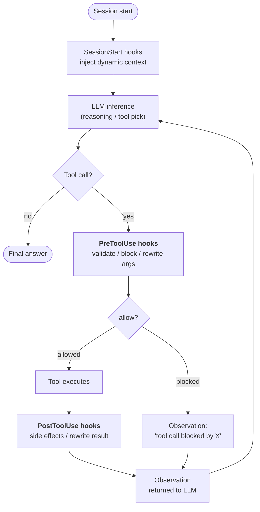
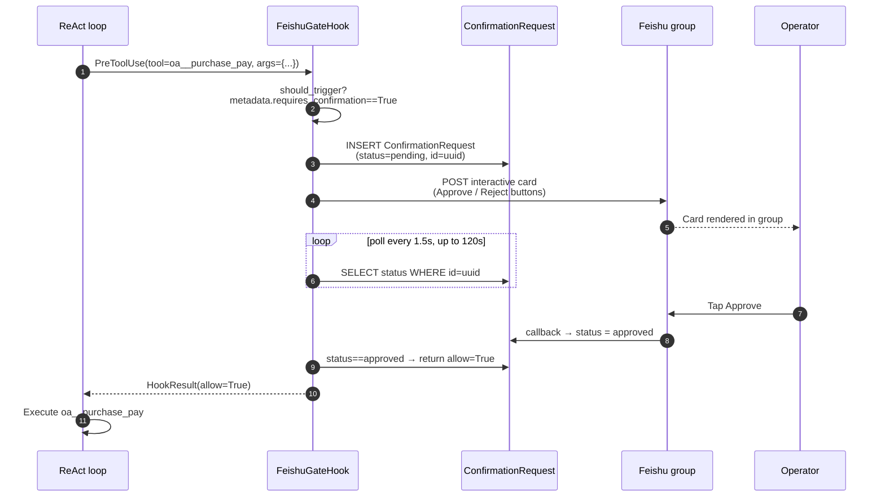

## 훅이 존재하는 이유

시스템 프롬프트의 지시사항은 **제안**입니다. 충분히 고집스럽거나 혼란스러운 LLM은 이를 무시할 수 있습니다. 대부분의 에이전트 동작에서는 정확히 그것이 원하는 것입니다 — 지시사항은 모델이 적응할 수 있는 여지를 제공합니다.

하지만 일부 요구사항은 제안이 아닙니다. "모든 민감한 도구 호출은 반드시 기록되어야 한다." "쓰기 작업은 조직이 읽기 전용 모드일 때 차단된다." "¥50k 이상의 결제는 실행 전에 사람의 승인이 필요하다." 이것들은 **불변식**입니다 — 모델이 어떤 턴에서 결정하든 관계없이 반드시 유지되어야 하는 시스템의 사실입니다.

훅은 에이전트의 실행 생명주기에서 잘 정의된 지점에서 **LLM 루프 외부에서** 실행되는 코드입니다. LLM은 훅을 볼 수 없습니다. LLM은 훅에 이의를 제기할 수 없습니다. LLM은 훅을 단계를 건너뛰도록 설득할 수 없습니다. `PreToolUse` 훅이 `allow=False`를 반환하면, 추론 추적이 아무리 강력하더라도 도구 호출은 발생하지 않습니다.

이것이 중요한 아키텍처 구분입니다:

| 메커니즘 | 실행 위치 | 제어자 | 보장 |
|---|---|---|---|
| **시스템 프롬프트 지시사항** | LLM 추론 내부 | 모델 | "아마도 따를 것" |
| **도구 설명 / 스키마** | LLM 추론 내부 | 모델 | "아마도 따를 것" |
| **훅** | LLM 추론 주변 | 플랫폼 코드 | **항상 실행됨** |

훅은 FIM One이 "에이전트는 ~해야 한다"를 "에이전트는 ~할 수 없다"로 바꾸는 방법입니다.

## 훅이 연결되는 위치

현재 세 가지 훅 포인트가 정의되어 있습니다. 각각은 에이전트가 한 번의 루프 반복 중에 통과하는 경계를 표시합니다:



| 훅 포인트 | 발동 시점 | 차단 가능? | 데이터 변경 가능? |
|---|---|---|---|
| `SessionStart` | 세션의 첫 번째 LLM 호출 전 | 아니오 | 예 — 초기 프롬프트에 컨텍스트 주입 |
| `PreToolUse` | LLM이 도구를 선택한 후, 도구 실행 전 | **예** (`allow=False`를 통해) | 예 — 실행 전 `tool_args` 재작성 가능 |
| `PostToolUse` | 도구가 반환된 후, 관찰이 LLM으로 전달되기 전 | 아니오 | 예 — 관찰 재작성 가능 |

같은 포인트의 여러 훅은 우선순위 순서대로 실행됩니다. 이전 `PreToolUse` 훅의 재작성된 인자는 이후 훅으로 전달되므로 미들웨어가 구성됩니다.

## 훅 vs. 명령어 선택 기준

요구사항을 프롬프트 명령어로 해결할지 훅으로 해결할지 결정하는 것은 "런타임 어설션 vs. 코드 주석" 계산과 동일합니다:

| 증상 | 해결책 |
|---|---|
| "에이전트가 Y일 때 X를 선호해야 한다" | 명령어 — 소프트 가이드, 모델이 자유도를 가짐 |
| "에이전트가 커넥터 Z에 대한 모든 호출을 로깅해야 한다" | **PostToolUse 훅** — 모델이 기억하도록 의존할 수 없음 |
| "¥50k 이상의 결제는 인간 승인이 필요하다" | **PreToolUse 훅** — 모델이 요청하도록 의존할 수 없음 |
| "에이전트가 중국어로 자신을 소개해야 한다" | 명령어 — 스타일 관련, 누락되어도 비용이 낮음 |
| "에이전트가 읽기 전용 모드에서 프로덕션 데이터베이스에 쓸 수 없다" | **PreToolUse 훅** — 안전 불변식, 영 허용 불가 |
| "에이전트가 긴 DB 쿼리 결과를 요약해야 한다" | 둘 다 가능하지만 훅이 더 견고함 — PostToolUse 자르기 참조 |

경험칙: **잘못된 동작이 인시던트라면 훅을 사용하세요. 잘못된 동작이 사소한 불편함이라면 명령어로 충분합니다.**

## 훅 계약

훅은 `PreToolUseHook`, `PostToolUseHook`, 또는 `SessionStartHook`의 서브클래스이며 하나의 필수 메서드를 가집니다:

```python
class ReadOnlyGuard(PreToolUseHook):
    name = "readonly_guard"
    priority = 5                          # lower runs earlier

    def should_trigger(self, ctx: HookContext) -> bool:
        return ctx.tool_name.startswith("sql_")

    async def execute(self, ctx: HookContext) -> HookResult:
        if org_is_readonly(ctx.metadata["org_id"]):
            return HookResult(
                allow=False,
                error="Org is in read-only mode — write blocked.",
                side_effects=["readonly_guard: blocked sql write"],
            )
        return HookResult()               # default: allow=True, no mutation
```

전달된 `HookContext`는 `tool_name`, `tool_args`, `agent_id`, `user_id`, 그리고 엔진이 요청별 사실(조직 id, 대화 id, 커넥터 작업의 `requires_confirmation` 플래그 등)로 채우는 유연한 `metadata` 딕셔너리를 포함합니다.

반환된 `HookResult`는 결과를 제어합니다:

- `allow: bool = True` — 도구 호출 진행 여부 (`PostToolUse` / `SessionStart`에서는 무시됨)
- `error: str | None` — 인간이 읽을 수 있는 이유로, 차단될 때 LLM에 관찰로 표시됨
- `modified_args: dict | None` — 설정된 경우, 실행 전에 도구 인자를 대체함
- `modified_result: Any | None` — 설정된 경우 (`PostToolUse`), LLM으로 반환되기 전에 관찰을 대체함
- `side_effects: list[str]` — 훅이 수행한 작업의 감사 추적으로, 에이전트의 추적에 병합됨

## 사례 연구: `FeishuGateHook`

이 시스템 위에 출시된 첫 번째 훅은 `FeishuGateHook`입니다. 이는 `PreToolUse` 훅으로, `requires_confirmation=True`로 표시된 모든 도구를 조직의 Feishu 그룹에 게시된 인간 승인 카드로 변환합니다.

이 훅은 전체 생명주기를 실행합니다:



이 설계가 제공하는 것:

- **도구 호출이 진정으로 일시 중지됩니다.** 에이전트의 SSE 스트림은 "I will call `oa__purchase_pay`"와 관찰 사이에서 일시 중지됩니다. 사용자는 에이전트가 대기 중인 것을 보며, 이는 내부에서 일어나는 일과 일치합니다.
- **승인이 프로세스 재시작을 견딥니다.** 대기 중인 행은 데이터베이스에 있으며, 메모리에는 없습니다. 카드가 미결 상태일 때 백엔드가 재시작되면, 다음 폴링이 중단된 지점부터 계속됩니다.
- **결정이 감사됩니다.** `ConfirmationRequest`는 `payload`, `responded_at`, `responded_by_open_id` 및 최종 상태를 유지합니다. 누가 무엇을 언제 승인했는지에 대한 감사 가능한 기록입니다.
- **의사 결정 루프에 LLM이 없습니다.** 모델이 도구 호출을 생성합니다. 인간이 판정을 생성합니다. 훅은 결정론적 다리입니다.

`FeishuGateHook`은 구성된 [Feishu Channel](/configuration/channels/feishu)에 의존합니다. 훅은 채널의 `send_interactive_card()` 메서드를 통해 카드를 전송하고 채널이 파싱한 콜백 이벤트를 수신합니다. 이러한 분리는 의도적입니다. 훅은 "승인 상태 머신"을 소유하고, 채널은 "IM 플랫폼 메커니즘"을 소유합니다. 동일한 훅은 내일 Slack이나 WeCom을 대상으로 할 수 있으며, 로직을 변경하지 않고 채널 구현만 변경하면 됩니다.

## 계획된 훅 (v0.9)

네 가지 훅 패턴이 v0.9 로드맵에 있으며, 모두 동일한 라이프사이클을 재사용합니다:

| 훅 | 포인트 | 목적 |
|---|---|---|
| `AuditLogHook` | PostToolUse | 모든 커넥터 호출 시 `ConnectorCallLog`를 자동으로 작성합니다. 현재는 수동이며, 훅으로 만들면 커버리지를 보장합니다. |
| `ReadOnlyGuard` | PreToolUse | 조직이 읽기 전용 모드일 때 쓰기를 차단합니다. |
| `ResultTruncateHook` | PostToolUse | 과도하게 큰 도구 관찰 결과(>8k 문자)를 LLM 컨텍스트에 도달하기 전에 자릅니다. |
| `ConnectorRateLimitHook` | PreToolUse | 커넥터당 사용자당 호출 빈도 상한선으로, LLM 속도 제한과 무관합니다. |

사용자 정의 훅 레이어도 계획 중입니다: 에이전트당 YAML 구성(`hooks: [...]`)으로 일치하는 도구 이벤트에서 실행할 셸 명령 또는 Python 호출 가능 객체를 선언합니다. 이는 최신 에이전트 프레임워크(Claude Code, OpenDevin)가 수렴한 패턴을 따릅니다 — 훅 기반 강제 실행은 "반드시 발생해야 하는" 로직을 프롬프트 밖으로 유지합니다.

## Hooks vs. Channels

두 추상화는 직교하는 문제를 해결합니다:

| 개념 | 모델링 대상 | 수명 | 예시 |
|---|---|---|---|
| **Hook** | 플랫폼 코드가 실행되는 에이전트 실행의 지점 | 도구 호출당 | `FeishuGateHook`, `AuditLogHook` |
| **Channel** | 외부 메시징 플랫폼에 대한 플러그인 가능한 어댑터 | 조직당 장기 | `FeishuChannel`, 계획 중인 `SlackChannel` |

Hooks는 Channels를 사용합니다 — 외부 세계와 통신해야 하는 hook(카드 전송, 알림 게시, 그룹으로 에스컬레이션)은 조직의 Channel을 호출합니다. 이를 사용하는 hook이 없는 channel도 여전히 유용합니다(예: 에이전트가 도구를 통해 사전에 알림을 보낼 수 있음). 하지만 승인 게이트 패턴은 특히 두 부분이 모두 준비되어 있어야 합니다.

다르게 말하면: **Channels는 "인간과 어떻게 통신할 것인가"라는 인프라이고, Hooks는 "언제 인간과 통신해야 하는가"라는 정책입니다**. 프로덕션 인간-루프 워크플로우에는 둘 다 필요합니다.

## 현재 상태 (v0.8.4)

출시된 기능과 향후 계획의 스냅샷:

- ✅ `HookRegistry`, `HookContext`, `HookResult` 기본 요소가 ReAct 및 DAG 모두에 연결됨
- ✅ `PreToolUseHook` / `PostToolUseHook` / `SessionStartHook` 추상 기본 클래스
- ✅ `FeishuGateHook` — 완성됨. `ConfirmationRequest` 테이블, 폴링 루프, 타임아웃/만료, 콜백 기반 상태 전환 포함
- ✅ Feishu 채널 콜백 엔드포인트가 `card.action.trigger`를 디코딩하고 대기 중인 행 업데이트
- ✅ 에이전트 수준 훅 선언: `agent.model_config_json.hooks.class_hooks`가 모든 ReAct/DAG 세션에서 인스턴스화된 `HookRegistry`로 해석됨
- 🟡 **실행 표면 전반의 훅 상속** (v0.8.5): 주요 채팅 경로(Portal, API, DAG)가 훅을 실행합니다. 평가 센터는 의도적으로 **훅을 우회**합니다(자동화된 평가는 인간의 승인을 기다려서는 안 됨). 위임된 하위 에이전트(`CallAgentTool`)와 워크플로우 `AGENT` 노드는 현재 부모 훅을 상속하지 않습니다 — 상속 정책은 v0.8.5의 결정 사항입니다.
- ❌ `AuditLogHook`, `ReadOnlyGuard`, `ResultTruncateHook`, `ConnectorRateLimitHook` (v0.9)
- ❌ 사용자 정의 YAML 훅 선언 (v0.9)

훅 시스템은 v0.9 프로덕션 강화를 위한 **핵심 기반**입니다. 첫 번째 사용자(`FeishuGateHook`)는 그 자체로도 프로덕션 기능이므로, 전체 훅 카탈로그를 기다리지 않고 2026-04-24 로드쇼를 위해 스켈레톤을 먼저 출시했습니다.
