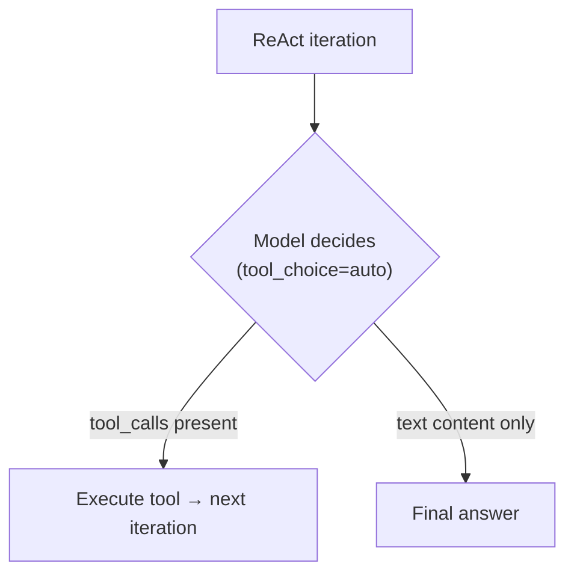
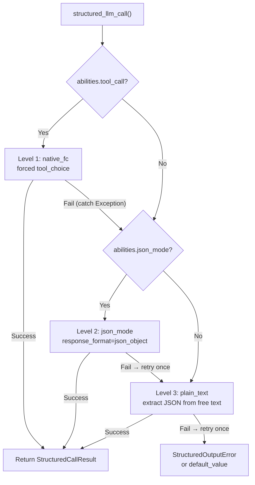
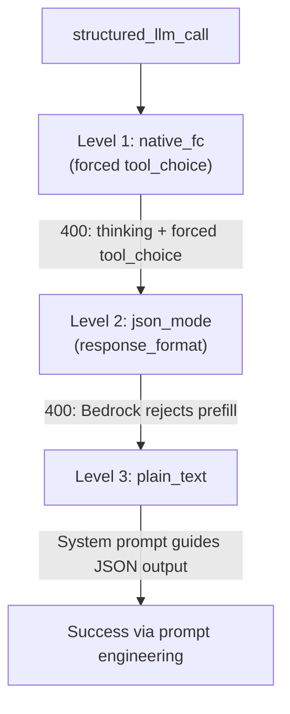

---
title: "LLM 제공자 호환성"
description: "FIM One이 LLM 호출을 라우팅하는 방식, tool_choice 아키텍처, 그리고 제공자별 주의사항 — 특히 Anthropic thinking + AWS Bedrock."
---## 제공자 감지

FIM One은 LiteLLM을 범용 어댑터로 사용합니다. `core/model/openai_compatible.py`의 `_resolve_litellm_model()` 함수는 사용자의 `LLM_BASE_URL` + `LLM_MODEL`을 제공자 접두사가 있는 LiteLLM 모델 식별자로 매핑합니다. 접두사는 LiteLLM이 요청을 라우팅하는 방식을 결정합니다 — 네이티브 API 프로토콜(Anthropic Messages API, Gemini 등) 또는 일반 OpenAI 호환 `/v1/chat/completions`.

해석 순서:

1. **명시적 제공자** (DB `ModelConfig.provider` 필드에서) — 최우선. 제공자가 URL의 알려진 도메인과 일치하면 `api_base`가 반환되지 않습니다(LiteLLM이 네이티브로 라우팅). 그렇지 않으면 `api_base`가 릴레이 URL로 설정됩니다.
2. **`KNOWN_DOMAINS`에 대한 도메인 일치** — 공식 API 엔드포인트가 호스트명으로 인식됩니다.
3. **`PATH_PROVIDER_HINTS`에 대한 URL 경로 힌트** — UniAPI와 같은 릴레이 플랫폼에서 경로의 `/claude` 또는 `/anthropic`이 업스트림 프로토콜을 나타낼 때 일반적입니다.
4. **폴백** — `openai/` 접두사(일반 OpenAI 호환).

| 도메인 / 경로 | 제공자 접두사 | 프로토콜 |
|---|---|---|
| `api.openai.com` | `openai/` | OpenAI Chat Completions |
| `anthropic.com` | `anthropic/` | Anthropic Messages API |
| `generativelanguage.googleapis.com` | `gemini/` | Google Gemini |
| `api.deepseek.com` | `deepseek/` | DeepSeek (OpenAI 호환) |
| `api.mistral.ai` | `mistral/` | Mistral |
| 경로에 `/claude` 또는 `/anthropic` 포함 | `anthropic/` | Anthropic Messages API (릴레이를 통해) |
| 경로에 `/gemini` 포함 | `gemini/` | Google Gemini (릴레이를 통해) |
| 기타 모든 경우 | `openai/` | 일반 OpenAI 호환 |

제공자 접두사가 네이티브 프로토콜(anthropic, gemini 등)이고 URL이 공식 엔드포인트가 아닐 때, LiteLLM은 네이티브 프로토콜을 사용하지만 릴레이의 `api_base`로 요청을 전송합니다. 이는 제공자별 동작 — 아래에 설명된 Bedrock 프리필 문제 포함 — 요청이 공식 API로 가든 릴레이를 통해 가든 적용됨을 의미합니다.

<Warning>
릴레이 URL에 경로에 `/claude`가 포함되어 있으면 FIM One은 자동으로 Anthropic의 네이티브 프로토콜을 통해 라우팅합니다. 이는 보통 올바릅니다(더 나은 스트리밍, thinking 지원), 하지만 제공자별 동작이 적용됨을 의미합니다 — 아래에 설명된 Bedrock 프리필 문제 포함.
</Warning>## tool_choice — 네 가지 모드

`tool_choice` 매개변수는 OpenAI 형식을 통해 표준화됩니다. LiteLLM은 요청을 보내기 전에 각 제공자의 기본 프로토콜로 변환합니다.

| 모드 | 의미 | 제공자 지원 |
|---|---|---|
| `"auto"` | 모델이 도구를 호출할지 또는 텍스트로 응답할지 결정 | 모든 제공자 |
| `"required"` | 도구를 반드시 호출해야 하지만 모델이 선택 | 대부분의 제공자 |
| `{"type":"function","function":{"name":"X"}}` | 특정 함수 X를 반드시 호출해야 함 | 대부분의 제공자 — **Anthropic thinking과 호환되지 않음** |
| `"none"` | 도구를 사용할 수 없음, 텍스트만 가능 | 모든 제공자 |

`"auto"`와 강제(`{"type":"function",...}`) 간의 구분은 FIM One의 모든 호환성 문제의 핵심입니다. 이 두 모드는 서로 다른 요구사항을 가진 완전히 다른 하위 시스템에서 사용됩니다.## tool_choice가 사용되는 곳

두 개의 서브시스템이 `tool_choice`를 사용하며, 이들은 근본적으로 다른 방식으로 사용합니다.### ReAct 엔진 — tool_choice="auto"

ReAct 루프는 모델이 각 반복마다 결정해야 합니다: 도구를 호출하거나 최종 답변을 제공합니다. `"auto"`만 의미가 있습니다 — 모델은 `tool_calls`를 생성하거나 텍스트 콘텐츠를 생성하는 것 중 자유롭게 선택합니다. 이는 모든 제공자, 모든 모델 및 확장 사고를 포함한 모든 모드와 호환됩니다.



ReAct 엔진은 `abilities["tool_call"] = True`일 때 네이티브 함수 호출(`_run_native`)을 사용하고, 그렇지 않으면 JSON-in-content 모드(`_run_json`)로 폴백합니다. 두 모드 모두 `"auto"`를 사용합니다 — 차이점은 도구가 `tools` 매개변수를 통해 전달되는지 아니면 시스템 프롬프트에서 설명되는지입니다. 자세한 내용은 [ReAct Engine — Dual-mode execution](/architecture/react-engine#dual-mode-execution)을 참조하세요.### structured_llm_call — tool_choice=forced

일회성 구조화된 추출(스키마 주석, DAG 계획, 계획 분석). 모델이 특정 가상 함수를 호출하도록 강제하여 구조화된 JSON 출력을 보장합니다. 이것은 공급자별 오류를 트리거하는 호출 사이트입니다.

`structured_llm_call`은 3단계 저하 체인을 구현합니다:



중요한 설계 차이점: `structured_llm_call`의 폴백은 **런타임**입니다 — 각 단계를 동적으로 시도하고 예외를 포착하여 통과합니다. ReAct 엔진의 모드 선택은 **빌드 타임**입니다 — 시작 시 `_native_mode_active`를 한 번 확인하고 전체 루프에 대해 한 가지 모드에 커밋합니다. 이는 `structured_llm_call`이 공급자별 400 오류에서 투명하게 복구할 수 있음을 의미하며, ReAct는 모드가 처음부터 올바르게 선택되었는지에 의존합니다.## Bedrock prefill 함정

`response_format={"type":"json_object"}`이 `anthropic/` 접두사로 해석된 모델에 전달되면, LiteLLM은 JSON 모드를 시뮬레이션하기 위해 내부적으로 어시스턴트 프리필 메시지를 주입합니다. Anthropic Messages API는 기본 `response_format` 매개변수가 없으므로, LiteLLM은 어시스턴트 콘텐츠로 여는 중괄호를 앞에 붙여서 근사화합니다:

```json
{"role": "assistant", "content": "{"}
```

이는 Anthropic의 직접 API에서 작동합니다. 그러나 최신 AWS Bedrock 모델 버전은 마지막 메시지의 `role: "assistant"`를 가진 대화를 거부합니다 — 이를 "어시스턴트 메시지 프리필"이라고 부르며 다음을 throw합니다:

```
ValidationException: This model does not support assistant message prefill.
The conversation must end with a user message.
```

이 오류는 **세 가지 조건이 모두 동시에 충족될 때만** 발생합니다:

1. 모델이 `anthropic/` 접두사로 해석됩니다 (도메인 일치 또는 URL 경로 힌트를 통해).
2. `response_format={"type":"json_object"}`가 전달됩니다 (`structured_llm_call`의 json_mode 코드 경로).
3. 실제 백엔드는 AWS Bedrock입니다 (프리필을 거부함).

<Warning>
이는 기본 도구 호출(`tool_choice="auto"`과 `tools=` 매개변수 포함)에는 영향을 주지 않습니다. 프리필 주입은 `response_format`에만 발생합니다. ReAct 에이전트 실행은 완전히 영향을 받지 않습니다.
</Warning>

실제 실패 경로는 다음과 같습니다:



Level 1 (thinking 충돌)과 Level 2 (Bedrock 프리필)가 모두 실패하면, 시스템은 여전히 Level 3에서 복구됩니다 — 하지만 구조화된 추출당 두 번의 낭비된 LLM 호출이라는 대가를 치르게 됩니다. 아래의 수정 사항은 낭비된 json_mode 호출을 제거합니다.### 수정: json_mode_enabled

모델별 `json_mode_enabled` 플래그는 Level 2 (json_mode)가 시도되는지 여부를 제어합니다:

- **DB 구성 모델**: Admin → Models → Advanced settings에서 토글합니다. 플래그는 `ModelConfig.json_mode_enabled`에 저장됩니다 (기본값 `TRUE`).
- **ENV 구성 모델**: 환경에서 `LLM_JSON_MODE_ENABLED=false`를 설정합니다.
- **효과**: 비활성화되면 `abilities["json_mode"]`는 `False`를 반환 → `response_format`이 전달되지 않음 → prefill 없음 → Bedrock이 작동합니다. 성능 저하 체인은 `native_fc → plain_text`가 되어 실패할 json_mode 호출을 완전히 건너뜁니다.
- **품질 손실 없음**: 시스템 프롬프트가 모델에 JSON을 반환하도록 지시하므로 모델은 여전히 유효한 JSON을 반환합니다. plain_text 레벨은 `extract_json()`을 사용하여 자유 형식 콘텐츠에서 JSON을 파싱하며, 이는 최신 모델에서 안정적으로 작동합니다.## Anthropic thinking + forced tool_choice

Anthropic의 API는 확장 thinking이 활성화되었을 때 `tool_choice={"type":"function","function":{"name":"X"}}`를 거부합니다. 오류:

```
Thinking may not be enabled when tool_choice forces tool use
```

이는 프로토콜 수준의 의미론적 충돌입니다: 특정 도구 호출을 강제하는 것은 모델이 어떤 도구를 호출할지(또는 호출할지 말지)에 대해 추론할 자유를 모순됩니다. Anthropic은 이 제약을 강제하며, 다른 제공자는 그렇지 않습니다.

이 충돌은 **오직** `structured_llm_call`의 Level 1 (native_fc)에만 영향을 미치며, 이는 강제된 `tool_choice`를 사용하여 구조화된 출력을 보장합니다. `_call_llm`의 기존 `try/except`는 400 응답을 포착하고 json_mode 또는 plain_text로 폴백합니다. `abilities` dict에서 특별한 처리가 필요하지 않습니다.

중요하게도, `tool_choice="auto"`는 Anthropic thinking이 활성화된 상태에서 완벽하게 작동합니다. ReAct 엔진은 `"auto"`만 사용하므로 영향을 받지 않습니다.

<Warning>
thinking + forced tool_choice 충돌을 해결하기 위해 `abilities["tool_call"] = False`를 설정하지 마세요. 이는 ReAct의 `_run_native` 모드(`tool_choice="auto"`를 사용하며 thinking과 함께 작동함)를 비활성화하여 `_run_json` 모드로 강제합니다. `_run_json`에서 모델은 콘텐츠에서 유효한 JSON을 생성해야 하며, 이는 신뢰성이 낮고 Bedrock에서 json_mode가 활성화된 경우 prefill 문제를 트리거할 수 있습니다. 올바른 해결책은 `structured_llm_call` 폴백 체인이 이를 처리하도록 하는 것입니다.
</Warning>## 빠른 참조: 어디서 무엇이 작동하는가

| 시나리오 | ReAct mode | structured_llm_call path | 참고 |
|---|---|---|---|
| OpenAI (모든 모델) | `_run_native` | native_fc | 완전 지원, 주의사항 없음 |
| Anthropic (thinking 없음) | `_run_native` | native_fc | 완전 지원 |
| Anthropic + thinking | `_run_native` | native_fc → 400 → json_mode | 자동 폴백, 낭비된 호출 1회 |
| Bedrock relay (thinking 없음) | `_run_native` | native_fc | 완전 지원 |
| Bedrock relay + thinking | `_run_native` | native_fc → 400 → json_mode → 400 → plain_text | 낭비된 호출 2회; `json_mode_enabled=false` 설정 |
| Bedrock relay + `json_mode_enabled=false` | `_run_native` | native_fc → 400 → plain_text | Bedrock with thinking에 권장되는 구성 |
| Bedrock relay (thinking 없음) + `json_mode_enabled=false` | `_run_native` | native_fc | 영향 없음 — native_fc가 첫 시도에서 성공 |
| Gemini | `_run_native` | native_fc | 완전 지원 |
| DeepSeek | `_run_native` | native_fc | 완전 지원 |
| Generic OpenAI-compatible | `_run_native` | native_fc | 완전 지원 |
| `tool_call=false`인 모든 모델 | `_run_json` | json_mode 또는 plain_text | tool-call을 지원하지 않는 모델에 대한 폴백 |

**AWS Bedrock relay에 권장되는 구성:**

```bash# .env 또는 환경에서
LLM_JSON_MODE_ENABLED=false
```

또는 관리자 UI에서 모델별로: Admin → Models → Bedrock 모델 선택 → Advanced → "JSON Mode" 비활성화.

이렇게 하면 낭비되는 모든 호출이 제거됩니다. 성능 저하 경로는 `native_fc → plain_text` (사고 없음) 또는 `native_fc → 400 → plain_text` (사고 포함)가 됩니다. 두 경로 모두 빠르고 안정적입니다.## 추론 노력 및 사고 구성

FIM One은 확장된 사고 / 추론을 제어하기 위해 두 개의 환경 변수를 노출합니다:

| 변수 | 값 | 효과 |
|---|---|---|
| `LLM_REASONING_EFFORT` | `low`, `medium`, `high` | LiteLLM에 `reasoning_effort`로 전달됩니다. Anthropic: `thinking` 매개변수로 매핑됩니다. OpenAI o-series: 통과합니다. 기타: 자동으로 삭제됩니다 (`drop_params=True`). |
| `LLM_REASONING_BUDGET_TOKENS` | 정수 (예: `10000`) | Anthropic만 해당: LiteLLM의 자동 매핑을 무시하고 명시적 `thinking.budget_tokens` 상한을 설정합니다. Claude 모델의 비용 제어에 유용합니다. |

`reasoning_effort`가 설정되고 모델이 `anthropic/`로 확인되면 두 가지 추가 동작이 적용됩니다:

1. **온도가 1.0으로 강제됩니다.** Bedrock은 사고가 활성화되었을 때 `temperature != 1.0`을 거부합니다. FIM One은 이를 자동으로 처리합니다 — 사용자 조치가 필요하지 않습니다.
2. **도구를 사용하는 GPT-5.x**: `tools`가 있을 때 `reasoning_effort`는 자동으로 삭제됩니다. GPT-5 `/v1/chat/completions` 엔드포인트가 이 조합을 거부하기 때문입니다. 이는 ReAct 도구 루프에만 영향을 미칩니다. `tools` 매개변수가 없는 `structured_llm_call` 호출은 영향을 받지 않습니다.## 문제 해결

**"This model does not support assistant message prefill"**
Bedrock + json_mode. `LLM_JSON_MODE_ENABLED=false`를 설정하거나 관리자 모델 설정에서 JSON Mode를 비활성화하세요.

**"Thinking may not be enabled when tool_choice forces tool use"**
Anthropic thinking + `structured_llm_call`에서 강제된 함수 호출. 이는 **오류가 아닌 예상된 동작**입니다. 폴백 체인이 400을 포착하고, native_fc를 건너뛴 후 json_mode 또는 plain_text에서 성공합니다. 로그는 DEBUG 레벨입니다 — `LOG_LEVEL=DEBUG`일 때만 표시됩니다. 비용: ~300ms 네트워크 왕복, 0 토큰 (모델이 400에서 실행되지 않음). 조치 불필요.

**ReAct가 예기치 않게 JSON mode로 폴백됨**
모델의 `abilities["tool_call"]`이 `True`인지 확인하세요. 이는 `OpenAICompatibleLLM`에서는 항상 `True`이지만, 사용자 정의 `BaseLLM` 서브클래스는 이를 재정의할 수 있습니다. 관리자 API의 모델 상세 엔드포인트로 확인하세요.

**structured_llm_call이 모든 레벨을 소진하고 StructuredOutputError를 발생시킴**
모델이 어떤 레벨에서도 파싱 가능한 JSON을 생성하지 못했습니다. 최신 모델에서는 드문 일입니다. 확인 사항: (1) 스키마가 유효한 JSON Schema인지, (2) 모델에 전체 응답을 생성할 충분한 `max_tokens`이 있는지, (3) 시스템 프롬프트가 스키마 지침과 모순되지 않는지. DAG 플래너와 분석기 모두 `default_value` 폴백을 제공하므로, 이 오류는 명시적으로 기본값을 생략하는 호출 사이트에서만 전파됩니다.